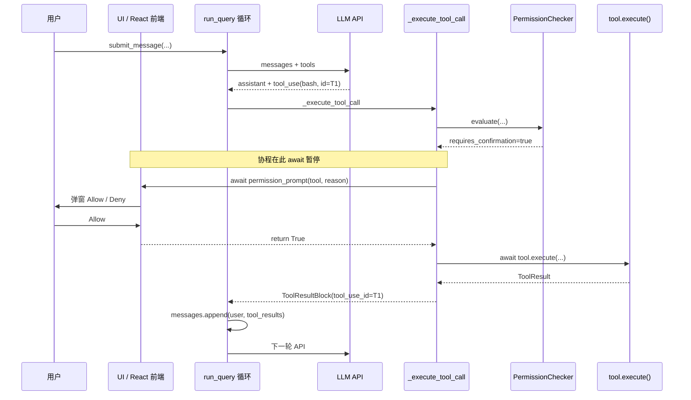
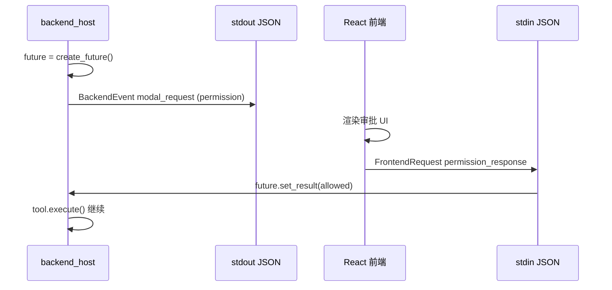
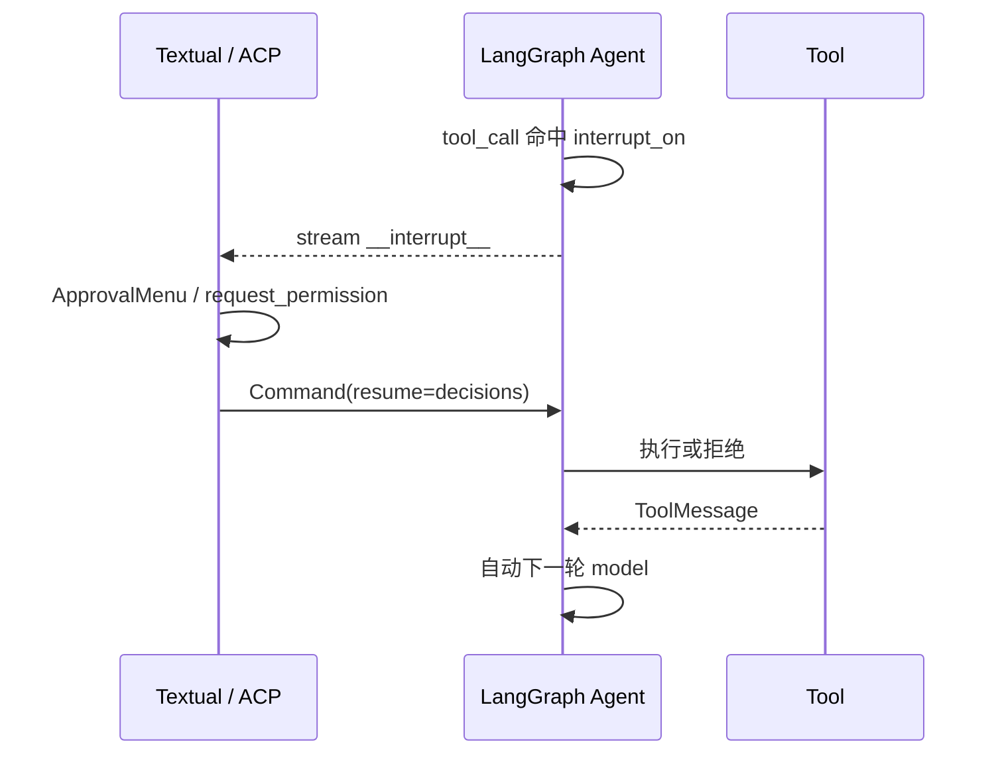
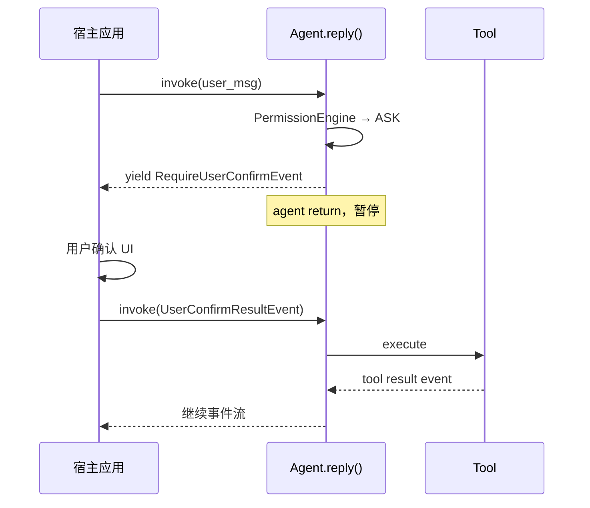
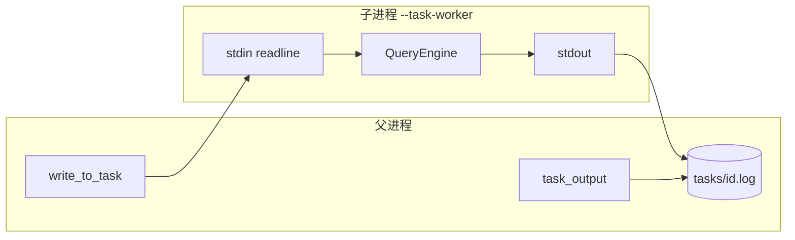

# Agent 工程：Tool 审批回调与主子 Agent 通信设计

> **版本**: 1.0  
> **日期**: 2026-06-10  
> **范围**: monorepo 内主要 Agent / Harness 项目（源码级横向对比）  
> **关联文档**: [AGENT_PROJECTS_FULL_ARCHITECTURE_COMPARISON.md](./AGENT_PROJECTS_FULL_ARCHITECTURE_COMPARISON.md) §7 / §10 / §16、[MULTI_AGENT_DESIGN_COMPARISON.md](./MULTI_AGENT_DESIGN_COMPARISON.md)

---

## 目录

1. [阅读路径与心智模型](#1-阅读路径与心智模型)
2. [审批（HITL）架构族](#2-审批hitl架构族)
3. [各项目 Tool 审批回调详解](#3-各项目-tool-审批回调详解)
4. [权限审批通信流程（重点）](#4-权限审批通信流程重点)
5. [主子 Agent 通信架构族](#5-主子-agent-通信架构族)
6. [各项目主子 Agent 与再次调度](#6-各项目主子-agent-与再次调度)
7. [OpenHarness 专题：BackgroundTaskManager](#7-openharness-专题backgroundtaskmanager)
8. [横向对比总表](#8-横向对比总表)
9. [三项目速查：OpenHarness vs DeerFlow vs deepagents](#9-三项目速查openharness-vs-deerflow-vs-deepagents)
10. [参考源码索引](#10-参考源码索引)

---

## 1. 阅读路径与心智模型

### 1.1 两个独立维度

| 维度 | 问的是什么 | 典型误解 |
|------|------------|----------|
| **Tool 审批** | 变更类工具执行前，谁拦、谁弹窗、批准后如何继续 | 「要给 tool 进程发消息让它继续」——多数框架是 **同进程 await 或 graph interrupt** |
| **主子 Agent** | 子 agent 怎么 spawn、父怎么拿结果、谁触发下一轮 LLM | 「spawn 后引擎自动把子结果注入主对话」——仅部分模式如此 |

### 1.2 四种审批心智模型

**模式 A — Graph Interrupt（deepagents）**

```
LLM → tool_call → [PAUSE checkpoint] → UI 决策 → Command(resume) → tool 执行 → ToolMessage → LLM 自动继续
```

**模式 B — Engine await 回调（OpenHarness 主 agent）**

```
LLM → tool_call → await permission_prompt() → [UI 阻塞此协程] → tool.execute() → ToolResultBlock → messages → LLM 自动继续
```

**模式 C — Spawn 与结果分离（OpenHarness 普通 / deepagents async）**

```
LLM → agent/spawn → 立即返回 task_id
       ↓（并行）子 agent 独立 ReAct
LLM → task_output / check_async_task → 读结果 → 继续
或
引擎 → drain / wakeup → submit_message(notification) → LLM 继续
```

**模式 D — Tool 内阻塞（DeerFlow / deepagents sync task / OpenHands delegate）**

```
LLM → task/delegate → [tool 内部等到子 agent 结束] → 一次性返回 → LLM 自动继续
```

---

## 2. 审批（HITL）架构族

| 族 | 代表项目 | 核心机制 |
|----|----------|----------|
| **A. Graph Interrupt** | deepagents | LangGraph `HumanInTheLoopMiddleware`，checkpoint 暂停 → `Command(resume=...)` |
| **B. Engine await 回调** | OpenHarness | `permission_prompt` 注入 `QueryEngine`，同协程 `await` |
| **C. 事件协议** | AgentScope | `RequireUserConfirmEvent` → 宿主注入 `UserConfirmResultEvent` |
| **D. 状态机 / Action 队列** | OpenHands SDK | `WAITING_FOR_CONFIRMATION`，下次 `run()` 执行 pending action |
| **E. 无统一门禁** | OpenManus、nanobot、MetaGPT（部分） | 仅 `ask_human` 类工具或通道配对 |
| **F. 子进程 Control Plane** | claude-agent-sdk-python | CLI 发 `can_use_tool` → Python async 回调 → 回传 CLI |

---

## 3. 各项目 Tool 审批回调详解

### 3.1 deepagents（`libs/deepagents` + `libs/code`）

| 项 | 设计 |
|----|------|
| 门禁层 | LangGraph `HumanInTheLoopMiddleware`（`interrupt_on`） |
| 拦截工具 | `execute`、`write_file`、`edit_file`、`web_search`、`fetch_url`、`task`、async 子任务工具等 |
| UI 回调 | Textual `TextualAdapter` 检测 `__interrupt__` → `ApprovalMenu` |
| ask_user | 独立 `AskUserMiddleware`，`interrupt()` 做结构化问答 |
| 通信 | 同进程 async；ACP 模式走 `Client.request_permission()`（IPC） |
| 恢复 | `Command(resume={interrupt_id: {"decisions": [...]}})` → checkpoint 续跑 → `ToolMessage` |

**关键路径**: `libs/deepagents/deepagents/graph.py`、`libs/code/deepagents_code/agent.py`（`_add_interrupt_on`）、`libs/code/deepagents_code/textual_adapter.py`

### 3.2 OpenHarness

| 项 | 设计 |
|----|------|
| 门禁层 | `engine/query.py` → `_execute_tool_call` 内 `PermissionChecker.evaluate` |
| 回调类型 | `PermissionPrompt = async (tool_name, reason) -> bool` 注入 `QueryEngine` |
| UI | Textual modal；React TUI：`backend_host` stdout `modal_request` ↔ stdin `permission_response` |
| 文件编辑 | 额外 `edit_approval_prompt(path, diff, ...)` |
| 子进程 worker | `--task-worker` 使用 `_noop_permission` → 恒 `True` |
| Swarm | `swarm/permission_sync.py`（mailbox + 文件）；**query 主路径尚未完全 wired** |
| 恢复 | 无 LangGraph interrupt；`await` 返回后直接 `tool.execute()` → `ToolResultBlock` → 下一轮 LLM |

**关键路径**: `OpenHarness/src/openharness/engine/query.py`、`permissions/checker.py`、`ui/backend_host.py`、`ui/app.py`（`run_task_worker`）

### 3.3 DeerFlow

| 项 | 设计 |
|----|------|
| 人类澄清 | `ClarificationMiddleware` 拦截 `ask_clarification` → `Command(goto=END)` |
| 自动护栏 | `GuardrailMiddleware` + `GuardrailProvider`：deny → error `ToolMessage`，无弹窗 |
| 特点 | 不用 LangGraph `interrupt_on` / OpenHarness 式 `permission_prompt` |

**关键路径**: `deer-flow/backend/packages/harness/deerflow/agents/middlewares/clarification_middleware.py`、`guardrails/middleware.py`

### 3.4 OpenHands + software-agent-sdk

| 项 | 设计 |
|----|------|
| 模式 | `confirmation_mode` + `ConfirmationPolicy` |
| 流程 | `ActionEvent` → `security_analyzer` → `WAITING_FOR_CONFIRMATION` |
| 回调 | Conversation 状态机 + Web UI / driver（非 per-tool 函数） |
| 通信 | Event stream + WebSocket/REST |
| 恢复 | approve → 下次 `conversation.run()` 执行 pending → Observation 进 log |

**关键路径**: `software-agent-sdk/openhands-sdk/openhands/sdk/agent/agent.py`、`security/confirmation_policy.py`

### 3.5 AgentScope

| 项 | 设计 |
|----|------|
| 机制 | `PermissionEngine.check_permission()` → ASK / DENY / ALLOW |
| ASK | yield `RequireUserConfirmEvent`，agent **return 暂停** |
| 恢复 | 宿主再 invoke 并传入 `UserConfirmResultEvent` |
| 通信 | 事件协议（非单一 callback 函数） |

**关键路径**: `agentscope/src/agentscope/permission/_engine.py`、`agent/_agent.py`

### 3.6 crewAI

| 项 | 设计 |
|----|------|
| Task 级 | `human_input=True`：任务完成后 `HumanInputProvider` |
| Hook 级 | `@before_tool_call` 可调 `request_human_input()` 并 `return False` 阻断 |
| Flow | `@human_feedback` 装饰器 |

**关键路径**: `crewAI/lib/crewai/src/crewai/task.py`、`hooks/tool_hooks.py`

### 3.7 autogen

| 项 | 设计 |
|----|------|
| UserProxy | `input_func` 阻塞等人回复 |
| CodeExecutor | 可选 `approval_func` 执行代码前审批 |

**关键路径**: `autogen/python/packages/autogen-agentchat/src/autogen_agentchat/agents/_user_proxy_agent.py`

### 3.8 OpenManus / GenericAgent / claude-agent-sdk / nanobot

| 项目 | 审批要点 |
|------|----------|
| **OpenManus** | 无框架级 gate；`AskHuman` tool 内 blocking `input()` |
| **GenericAgent** | `ask_user` → `INTERRUPT`，退出 loop；下轮 user message 重启 |
| **claude-agent-sdk** | CLI `can_use_tool` control request → 用户 `can_use_tool` async 回调（**子进程 IPC**） |
| **nanobot** | 无 tool 级 HITL；channel pairing + workspace policy |
| **MetaGPT** | `ask_human` / `AskReview`；无统一 tool gate |

---

## 4. 权限审批通信流程（重点）

### 4.1 核心结论

> **不存在「审批结果发回 tool 进程」的通用设计。**  
> Tool 通常是主进程内的 async 函数；审批是 **执行 tool 之前的门禁**；批准后 **当场** `tool.execute()`，结果写入对话历史，**下一轮 LLM** 读取 `tool_result` 继续。

### 4.2 OpenHarness 主 Agent（Engine await 族）



**源码锚点**（`OpenHarness/src/openharness/engine/query.py`）：

1. `PermissionChecker.evaluate()` → `requires_confirmation`
2. `confirmed = await context.permission_prompt(tool_name, decision.reason)`
3. 拒绝 → 直接 `return ToolResultBlock(..., is_error=True)`，**不执行 tool**
4. 批准 → `result = await tool.execute(...)` → `ToolResultBlock` → `messages.append(..., tool_results)`

### 4.3 React TUI：唯一「像 IPC」的审批通道

审批通信发生在 **UI ↔ 引擎**，不是 engine ↔ tool：



**源码**: `OpenHarness/src/openharness/ui/backend_host.py` — `_ask_permission`、`_read_requests` 中 `permission_response` 分支。

### 4.4 deepagents（Graph Interrupt 族）



与 OpenHarness 对比：deepagents 在 **checkpoint 层**暂停整个 graph run；OpenHarness 在 **单次 tool 调用协程**内 await。

### 4.5 AgentScope（事件协议族）



### 4.6 子 Agent 审批的特殊性

| 场景 | 行为 |
|------|------|
| OpenHarness `--task-worker` | `_noop_permission` 恒 True；无 TTY 弹窗 |
| deepagents 子 agent | 继承父 `interrupt_on`（同步 `task` 在子图内仍可走 HITL，取决于部署） |
| DeerFlow 子 agent | in-process，与主 agent 同 guardrail；**禁止** `ask_clarification` |
| Swarm permission_sync | 设计为 worker→leader mailbox；**尚未接入** `query.py` 主路径 |

---

## 5. 主子 Agent 通信架构族

| 族 | 代表 | Spawn | 父拿结果 | 下一轮谁触发 |
|----|------|-------|----------|--------------|
| **1. 同步阻塞 tool** | deepagents sync `task`、DeerFlow `task`、crewAI、OpenHands delegate | tool 内 invoke/run 至结束 | tool 返回字符串 | 框架 ReAct 自动 |
| **2. 异步 spawn + 模型 poll** | OpenHarness 普通、deepagents async | spawn 即返 task_id | `task_output` / `check_async_task` | **模型** |
| **3. 异步 spawn + 引擎注入** | OpenHarness Coordinator、AgentScope、nanobot | spawn 即返 | drain / MessageBus wakeup | **引擎** |
| **4. 编排器驱动** | MetaGPT、OpenManus、autogen Swarm | 非 LLM spawn tool | env 消息 / flow step | `env.run()` / `select_speaker` |
| **5. 文件/进程 IPC** | GenericAgent、OpenHarness subprocess | Popen / BTM | poll 文件或 log | 主 loop 拼 prompt |
| **6. CLI 黑盒** | claude-agent-sdk | CLI `Agent` tool | Stream `TaskNotification` | CLI + SDK 消费事件 |

---

## 6. 各项目主子 Agent 与再次调度

### 6.1 deepagents

| 项 | 设计 |
|----|------|
| 同步 | `SubAgentMiddleware` 的 **`task`**：`subagent.invoke()`，**阻塞至结束** |
| 异步 | `start_async_task` / `check_async_task` / `update_async_task`（LangGraph SDK thread+run） |
| 续聊 | `update_async_task` 同 thread 新 run（`multitask_strategy=interrupt`） |
| 再次调度 | 同步：tool 返回后框架自动；异步：**模型必须** `check_async_task` |

**路径**: `libs/deepagents/deepagents/middleware/subagents.py`、`async_subagents.py`

### 6.2 OpenHarness

| 项 | 设计 |
|----|------|
| Spawn | `agent` tool → `SubprocessBackend` → `BackgroundTaskManager.create_agent_task` |
| IPC | stdin 下发；stdout → log 文件；`send_message` 写 stdin |
| 拿结果 | **普通**：模型调 `task_output`；**Coordinator**：`drain_coordinator_async_agents` 自动 `submit_message` |
| 完成通知 | `_watch_process` + `SUBAGENT_STOP` hook；**不自动注入主对话**（普通模式） |
| 再次调度 | 普通=模型/用户；Coordinator=引擎 batch 注入 `<task-notification>` |

**路径**: `tools/agent_tool.py`、`swarm/subprocess_backend.py`、`ui/coordinator_drain.py`、`tasks/manager.py`

### 6.3 DeerFlow

| 项 | 设计 |
|----|------|
| Spawn | `task` tool → `SubagentExecutor.execute_async`（后台线程） |
| IPC | 内存 `_background_tasks` + SSE `task_*` 事件 |
| 拿结果 | **`task` tool 内部轮询（约 5s）直到结束**，对父 LLM **阻塞** |
| 续聊 | 不支持（每次 task 一次性） |
| 再次调度 | tool 返回后 LangGraph 自动 |

**路径**: `deer-flow/backend/packages/harness/deerflow/tools/builtins/task_tool.py`

### 6.4 OpenHands SDK

| 项 | 设计 |
|----|------|
| Spawn | `DelegateAction` `spawn` → `LocalConversation` |
| Delegate | `send_message` + blocking `conversation.run()` |
| 拿结果 | `thread.join()` + `DelegateObservation` |
| 再次调度 | 父 `LocalConversation.run()` 自动继续 |

**路径**: `software-agent-sdk/openhands-tools/openhands/tools/delegate/impl.py`

### 6.5 MetaGPT / crewAI / autogen

| 项目 | 模型 | 通信 | 调度 |
|------|------|------|------|
| **MetaGPT** | 多 Role + Environment | `publish_message` → `msg_buffer` | `Team.run` → `env.run()` |
| **crewAI** | Delegate tool | in-process `execute_task` | 父 executor ReAct |
| **autogen** | Handoff tool | 共享 group chat | `SwarmGroupChatManager.select_speaker` |

### 6.6 AgentScope / OpenManus / GenericAgent / claude-agent-sdk / nanobot

| 项目 | Spawn | 父↔子通道 | 再次调度 |
|------|-------|-----------|----------|
| **AgentScope** | `AgentCreate` | `MessageBus.inbox_push` + `enqueue_wakeup` | `WakeupDispatcher` → `ChatService.run` |
| **OpenManus** | PlanningFlow step | in-process `executor.run()` | Flow 引擎 |
| **GenericAgent** | Popen `agentmain` | 文件 `output.txt`、`_intervene` | 主 loop poll + prompt 注入 |
| **claude-agent-sdk** | CLI `Agent` tool | subprocess stream | CLI 内部 + SDK 事件 |
| **nanobot** | `SubagentManager` async | MessageBus 注入主 loop | `_drain_injections` |

---

## 7. OpenHarness 专题：BackgroundTaskManager

### 7.1 封装边界

`BackgroundTaskManager` 是 **后台子进程调度器 + I/O 桥**，不管 LLM 对话、不管 tool 权限、不管 ReAct 循环。

| **管（IN）** | **不管（OUT）** |
|-------------|----------------|
| 创建/终止 subprocess（bash 或 `--task-worker`） | 调用 LLM、维护 `messages` |
| 维护 `TaskRecord`（id、status、cwd、return_code） | Tool 权限与 UI 弹窗 |
| 写 stdin（一行 JSON/文本协议） | 子 agent 内部 ReAct（子进程自有 QueryEngine） |
| 异步 drain stdout → 追加 log | 自动把 log 注入主对话 |
| `read_task_output()` 读 log 尾部 | Swarm mailbox（在 `swarm/`） |
| `register_completion_listener()` | 会话持久化 |

**单例**: `get_task_manager()` — 按 `get_tasks_dir()` 路径键控生命周期。

### 7.2 三层 I/O 通道

| 通道 | 方向 | 介质 | 谁用 |
|------|------|------|------|
| **stdin** | 父 → 子 | OS pipe，JSON 行协议 | `write_to_task` / `send_message` |
| **stdout → log** | 子 → 父 | `_copy_output` 写 `~/.openharness/tasks/{id}.log` | 持久化 |
| **task_output** | 父读子 | 读 **log 文件尾部** | LLM tool；非实时 pipe |



### 7.3 谁调用 BTM

| 调用方 | API | 用途 |
|--------|-----|------|
| `agent` 工具 | `create_agent_task` | spawn 子 agent |
| `task_create` 工具 | `create_shell_task` / `create_agent_task` | 通用后台任务 |
| `task_output` | `read_task_output` | 读 log |
| `send_message` | `write_to_task` | 续聊 stdin |
| `task_stop` | `stop_task` | 终止 |
| Coordinator drain | `get_task` + `read_task_output` | 拼 notification |
| UI | `list_tasks` | 侧边栏 |

### 7.4 子 worker 生命周期

1. `SubprocessBackend.spawn` → `argv = [python, -m, openharness, --task-worker, ...]`
2. `create_agent_task` → `write_to_task(prompt)` 写 stdin
3. 子进程 `run_task_worker`：`readline` → `handle_line` → 独立 QueryEngine
4. 处理完 **一条 stdin 后 break**（one-shot）；续聊若进程已退出会 `_restart_agent_task`（**丢上下文**）

---

## 8. 横向对比总表

### 8.1 审批

| 项目 | 阻塞点 | 回调注入方 | 通信形态 | 批准后继续 |
|------|--------|------------|----------|------------|
| deepagents | LangGraph checkpoint | Textual / ACP | 进程内 / ACP IPC | `Command(resume)` → ToolMessage |
| OpenHarness | `_execute_tool_call` await | UI 注入 `permission_prompt` | 进程内 / React stdin JSON | 同协程 `tool.execute()` |
| DeerFlow | graph END（澄清） | Gateway 用户消息 | HTTP/SSE | 新 user turn |
| OpenHands | Conversation 状态 | Web UI | WebSocket/REST | 下次 `run()` |
| AgentScope | agent generator return | Host 事件 | 事件 API | 再 invoke + confirm event |
| crewAI | hook / task 后 | HumanInputProvider | sync | 重跑 LLM |
| claude-agent-sdk | CLI 等待 SDK | `can_use_tool` | **子进程 IPC** | CLI 执行 tool |
| OpenManus | tool 内 `input()` | stdin | 进程内 | tool result |
| nanobot | — | — | — | 直接执行 |

### 8.2 主子 Agent

| 项目 | Spawn | 父↔子通道 | 父拿结果 | 下一轮触发 |
|------|-------|-----------|----------|------------|
| deepagents sync | `task` | in-process graph | tool 阻塞返回 | 框架 ReAct |
| deepagents async | `start_async_task` | LangGraph SDK HTTP | `check_async_task` | 模型 poll |
| OpenHarness | `agent` | stdin + log | `task_output` / drain | 模型 / 引擎 |
| DeerFlow | `task` | 内存 dict | tool 内阻塞 poll | 框架 ReAct |
| OpenHands | Delegate | LocalConversation | blocking run | 框架 run |
| MetaGPT | Role hire | env message | AIMessage 广播 | `env.run()` |
| crewAI | Delegate tool | in-process | sync string | 框架 ReAct |
| autogen | Handoff | shared thread | HandoffMessage | select_speaker |
| AgentScope | AgentCreate | MessageBus | TeamSay | WakeupDispatcher |
| GenericAgent | Popen | 文件 IPC | poll | 主 loop |
| claude-agent-sdk | CLI Agent | subprocess | TaskNotification | CLI + SDK |

---

## 9. 三项目速查：OpenHarness vs DeerFlow vs deepagents

| 维度 | OpenHarness | DeerFlow | deepagents |
|------|-------------|----------|------------|
| Tool 审批 | Engine `await permission_prompt` | 澄清 END + guardrail | LangGraph interrupt |
| 子 agent 默认语义 | **异步** spawn，模型 poll | **同步**阻塞 `task` | sync + async 两套 |
| 子 agent 审批 | worker noop 自动批准 | 同主 agent in-process | `interrupt_on` 含 `task` |
| 引擎自动注入子结果 | 仅 **Coordinator** 模式 | 不需要（tool 已阻塞返回） | async 需模型 `check_async_task` |
| 子进程隔离 | **是**（BTM + `--task-worker`） | 否（线程 + 内存 dict） | sync 否；async 远程 thread |
| 续聊子 agent | `send_message` → stdin | 不支持 | `update_async_task` |

---

## 10. 参考源码索引

### 10.1 审批

| 项目 | 文件 |
|------|------|
| deepagents HITL | `libs/deepagents/deepagents/graph.py`、`libs/code/deepagents_code/textual_adapter.py` |
| OpenHarness | `OpenHarness/src/openharness/engine/query.py`、`permissions/checker.py`、`ui/backend_host.py` |
| DeerFlow | `deer-flow/.../clarification_middleware.py`、`guardrails/middleware.py` |
| OpenHands SDK | `software-agent-sdk/.../sdk/agent/agent.py`、`security/confirmation_policy.py` |
| AgentScope | `agentscope/src/agentscope/permission/_engine.py` |
| claude-agent-sdk | `claude-agent-sdk-python/src/claude_agent_sdk/_internal/query.py`、`types.py` |

### 10.2 主子 Agent

| 项目 | 文件 |
|------|------|
| deepagents | `libs/deepagents/deepagents/middleware/subagents.py`、`async_subagents.py` |
| OpenHarness | `OpenHarness/src/openharness/tools/agent_tool.py`、`tasks/manager.py`、`ui/coordinator_drain.py` |
| DeerFlow | `deer-flow/.../tools/builtins/task_tool.py` |
| OpenHands | `software-agent-sdk/.../tools/delegate/impl.py` |
| nanobot | `nanobot/nanobot/agent/subagent.py`、`runner.py` |
| GenericAgent | `GenericAgent/docs/DESIGN_DOCUMENT.md`（Task I/O 文件协议） |

### 10.3 相关文档

| 文档 | 内容 |
|------|------|
| [AGENT_PROJECTS_FULL_ARCHITECTURE_COMPARISON.md](./AGENT_PROJECTS_FULL_ARCHITECTURE_COMPARISON.md) | 七维总览、§16 HITL 源码级、§7 多 Agent |
| [MULTI_AGENT_DESIGN_COMPARISON.md](./MULTI_AGENT_DESIGN_COMPARISON.md) | 多 Agent 设计哲学 |
| [DEEPAGENTS_MIDDLEWARE_CHAIN_DEEP_DESIGN.md](./DEEPAGENTS_MIDDLEWARE_CHAIN_DEEP_DESIGN.md) | deepagents HITL 挂载顺序 |
| `OpenHarness/docs/ARCHITECTURE_ENGINE.md` | Engine、Coordinator drain、task 契约 |
| [OpenHarness/docs/ARCHITECTURE_TOOLS_SWARM.md](../OpenHarness/docs/ARCHITECTURE_TOOLS_SWARM.md) | spawn 子 Agent：进程/协程/I/O 全链路速查图 |
| [OpenHarness/docs/ARCHITECTURE_TOOLS_SWARM.md](../OpenHarness/docs/ARCHITECTURE_TOOLS_SWARM.md) §3.3.7–§3.3.8 | `spawn` 封装边界与 IO 拓扑（完整版） |

---

*文档维护：各项目审批或 spawn 行为变更时，同步更新 §3、§6 表格与 §10 路径。*
