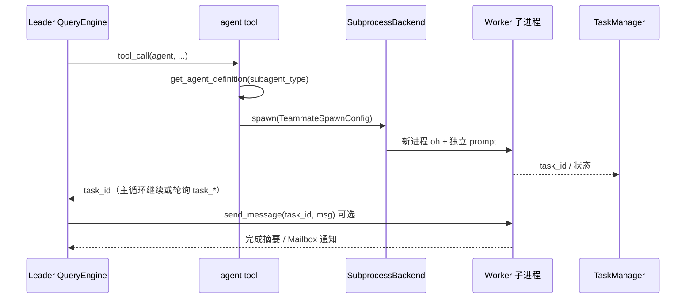
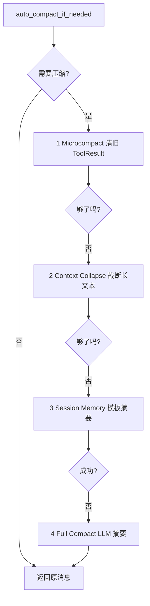

# Agent 工程全景对比：架构、Memory、Tool、多 Agent、Plan、Sandbox、权限与 Task 设计

> **版本**: 2.2 · **日期**: 2026-06-16  
> **范围**: monorepo 内 Agent/Harness 项目 + OpenHarness 专题 + **§15–§18 源码级扩展对比**  
> **维护**: 架构或模块行为变更时，同步更新对应章节；源码优先于本文。

---

## 目录

1. [工程内 Agent 项目全景](#1-工程内-agent-项目全景)
2. [OpenHarness 专题：Swarm 多 Agent](#2-openharness-专题swarm-多-agent)
3. [OpenHarness 专题：Auto-Compact 上下文压缩](#3-openharness-专题auto-compact-上下文压缩)
4. [七维对比总表（核心框架）](#4-七维对比总表核心框架)
5. [Memory：长短记忆、Session、压缩、自进化与读写流](#5-memory长短记忆session压缩自进化与读写流)
6. [Tool / MCP / Skill：封装与读写](#6-tool--mcp--skill封装与读写)
7. [多 Agent：原理、同步异步、消息传输与长周期实践](#7-多-agent原理同步异步消息传输与长周期实践)
8. [Plan：计划模式与计划—执行分离](#8-plan计划模式与计划执行分离)
9. [Sandbox：虚环境与文件读写](#9-sandbox虚环境与文件读写)
10. [权限管理](#10-权限管理)
11. [Task 设计：以「任务」为交互单元](#11-task-设计以任务为交互单元)
12. [长周期助手实践参考（Cursor / Codex / Claude Code）](#12-长周期助手实践参考cursor--codex--claude-code)
13. [选型速查](#13-选型速查)
14. [参考文档索引](#14-参考文档索引)
15. [扩展项目矩阵（用户清单）](#15-扩展项目矩阵用户清单)
16. [HITL / 人机协同（源码级）](#16-hitl--人机协同源码级)
17. [Prompt 装配与约束行为](#17-prompt-装配与约束行为)
18. [扩展运行时维度](#18-扩展运行时维度)

---

## 1. 工程内 Agent 项目全景

### 1.1 分层分类

| 层级 | 项目路径 | 角色 | 是否纳入下文七维详表 |
|------|----------|------|---------------------|
| **Harness SDK** | `libs/deepagents/` | LangGraph + Middleware 深度 Agent SDK | ✅ |
| **终端产品** | `libs/code/` (`deepagents-code`) | Textual REPL、MCP、Skills、Slash | ✅（与 SDK 合并行） |
| **部署 CLI** | `libs/cli/` | init/dev/deploy，非交互 Agent 内核 | 略 |
| **Super Agent 产品** | `deer-flow/` | Gateway + Web + Harness 包 | ✅ |
| **开源 Harness** | `OpenHarness/` | 自研 Agent Loop、`oh` / `ohmo` | ✅ |
| **OpenHands SDK** | `software-agent-sdk/` | V1 Agent 内核（事件 + step） | ✅ |
| **OpenHands 产品** | `OpenHands/` | GUI、App Server、Cloud | ✅（与 SDK 对照） |
| **编排框架** | `crewAI/` | Crew / Task 声明式编排 | ✅ |
| **阿里 SDK** | `agentscope/` | ReAct + MsgHub + Marks Memory | ✅ |
| **轻量框架** | `smolagents/` | CodeAct、极简 Loop | ✅ |
| **OpenAI SDK** | `openai-agents-python/` | Runner + Session + Handoff | ✅ §15 |
| **Claude SDK** | `claude-agent-sdk-python/` | 官方 Claude Agent 协议 | ✅ §15 |
| **个人助手** | `nanobot/`、`hermes-dev/` | 长会话 CLI / 本地栈 | ✅ §15 |
| **任务队列 Agent** | `GenericAgent/` | L0–L4 文件记忆 + 队列 | ✅ §15 |
| **其他** | MetaGPT、`OpenManus/`、autogen… | 领域或历史方案 | OpenManus §15 |

### 1.2 共同范式（为何「感觉都一样」）

```
用户输入
  → Harness（Prompt + 工具集 + 中间件/权限）
  → LLM ↔ Tool 循环（ReAct）
  → 可选：子 Agent / 后台任务 / 压缩 / 记忆回写
  → 输出 + 持久化（Session / Checkpoint / 文件）
```

**DeerFlow、Deep Agents、OpenHarness** 同属 **Orchestration Harness**，差异在 **运行时实现**（LangGraph vs 自研 Loop）、**配置方式**（YAML vs 代码）、**产品层**（Gateway vs CLI）。

---

## 2. OpenHarness 专题：Swarm 多 Agent

### 2.1 定位

OpenHarness **不用 LangGraph 子图**，而通过 **`agent` 工具 + Swarm 后端** 实现多 Agent：主 `QueryEngine` 循环内 spawn，Worker 多在 **子进程** 中跑另一套 `oh` 运行时。

### 2.2 核心组件

| 模块 | 路径 | 职责 |
|------|------|------|
| `AgentTool` | `src/openharness/tools/agent_tool.py` | 主 Agent 委派入口 |
| `SendMessageTool` | `src/openharness/tools/send_message_tool.py` | 向运行中 Worker 追加指令 |
| `coordinator/` | `agent_definitions.py`, `coordinator_mode.py` | Agent 模板、Team Registry |
| `swarm/` | `subprocess_backend.py`, `mailbox.py` | Spawn、Mailbox、权限同步 |
| `tasks/` | `manager.py` | 后台任务 ID、轮询、停止 |

### 2.3 `agent` 工具参数

```text
description       # 短标题（日志/UI）
prompt            # 子 Agent 完整任务
subagent_type     # general-purpose / Explore / plugin:xxx:reviewer
mode              # local_agent | remote_agent | in_process_teammate
team              # 可选团队名（TeamRegistry）
```

### 2.4 执行流程



### 2.5 Agent 定义加载优先级

1. Built-in 模板  
2. `~/.openharness/agents/`  
3. Plugin `agents/*.md` → 命名空间 `plugin-name:agent-name`

### 2.6 隔离与通信

| 机制 | 说明 |
|------|------|
| **Subprocess** | 默认 spawn 路径；`task_*` 可轮询 |
| **Git Worktree** | Worker 可选独立工作树（开发者并行改码） |
| **Docker Sandbox** | `sandbox/` 模块，命令级隔离 |
| **Mailbox** | Worker → Leader 异步通知（常 XML 形态注入下一轮） |
| **send_message** | Leader → Worker；Swarm 用 `name@team` 作 agent_id |

### 2.7 普通模式 vs Coordinator 模式（运行时行为）

**共同点（底层一样）**：主会话都是 `QueryEngine` + ReAct；`agent` 经 `SubprocessBackend` spawn **子进程 Worker**；spawn 后工具 **立即** 返回 `task_id`，Worker 在后台跑完整 ReAct。

**开关**：默认 **普通模式**；`CLAUDE_CODE_COORDINATOR_MODE=1`、slash `/coordinator` 等 → **Coordinator 模式**（与 `ohmo` Gateway Prompt 分支可叠加，见 `OpenHarness/docs/OHMO_DESIGN.md` §8）。

| 行为维度 | 普通模式 | Coordinator 模式 |
|----------|----------|----------------|
| **主 Agent 人设** | `build_system_prompt`：全能编程助手，自己读改测为主 | `get_coordinator_system_prompt()`：协调器，拆任务、派 Worker、对用户汇总 |
| **默认策略** | Delegation 段写 *Prefer a normal direct answer*；spawn 是加分项 | Prompt 强调 Research → **你综合** → Worker 实现/验证；并行 fan-out |
| **System 中 Skills 列表** | ✅ `_build_skills_section()` | ❌ 省略（指望 Worker 自带 skill 加载） |
| **Delegation 小段** | ✅ `_build_delegation_section()`（如何用 `agent`） | ❌ 由整份协调器 prompt 替代 |
| **Memory / 项目上下文** | ✅ 每轮 `build_runtime_system_prompt` 注入 | ✅ 同样注入（勘误：并非「Coordinator 不用 Memory」） |
| **spawn 后 harness** | **不** 调用 `drain_coordinator_async_agents` | `handle_line` 结束后 **自动 drain** 后台 Worker |
| **Worker 完成如何进对话** | 模型调 `task_output`、用户 `/agents`，或用户下一条再聊 | Harness 构造 `<task-notification>` XML，**自动** `submit_message` 再起 Coordinator 轮次 |
| **用户发一句之后** | 通常 **一轮主 Agent 结束即停**；后台 Worker 可能仍在跑 | 可能 **连续多轮**（等 Worker → 注入通知 → Coordinator 再思考），用户未必再输入 |
| **并行 spawn** | 技术上可 `asyncio.gather` 多个 `agent`；prompt 不强调 | Prompt **明确要求** 单条消息内多个 `agent` 并行 |
| **对用户说话** | 标准助手 | 每句都是对用户；Worker 通知是内部信号，翻译成用户能懂的总结 |
| **额外 user 上下文** | 无 | 可有 `workerToolsContext`（Worker 可用工具面） |

**端到端示例**（用户：「查认证模块 bug 并修好」）：

- **普通模式**：主 Agent 可能自己 `grep`/`edit`，也可能 `agent(worker)`；若 spawn，`agent` 立刻返回 `task_id`，本轮可结束；**不会** 自动把 Worker 结果变成下一条助手回复；要结果需 `task_output`、`/agents` 或你再发一句。
- **Coordinator 模式**：倾向 spawn 多个 Worker 并行研究；对用户说「已并行启动…」后结束本轮；UI 层 `drain_coordinator_async_agents` 轮询 `TaskManager`，把完成摘要注入为 `<task-notification>`，**自动** 再跑 Coordinator；Coordinator 向用户汇报并可 `send_message` 让同一 Worker 继续修。

**术语（行为含义，非独立运行时）**：

| 词 | 含义 |
|----|------|
| **Delegation** | 仅普通模式 system 里的一节 **说明书**，影响模型是否愿意 spawn，不改变内核 |
| **Worker** | `subagent_type="worker"` 时的 **实现型** 子进程人设；Coordinator 话术里对一切 spawn 后台 Agent 的统称 |

**源码锚点**：`prompts/context.py`（`build_runtime_system_prompt`、`_build_delegation_section`）；`ui/textual_app.py`（`is_coordinator_mode()` 后 `drain_coordinator_async_agents`）；`ui/coordinator_drain.py`；`coordinator/coordinator_mode.py`。

### 2.8 为何普通模式「不等」Worker 结果（设计动机）

普通模式 **不是**「不能做子 Agent」，而是 **刻意** 把「spawn」与「收结果」拆开。内核与文档（`OpenHarness/docs/ARCHITECTURE_ENGINE.md` §5）一致：

| 动机 | 说明 |
|------|------|
| **引擎层中立** | `QueryEngine` / `run_query` **不会**在 `BackgroundTaskManager` 标记 completed 时自动 `submit_message`。谁写入 notification、是否 drain，由 **应用层**（TUI Coordinator drain、用户输入、`task_output`）决定，避免所有产品形态都被绑成「多轮自动编排」。 |
| **交互式 CLI 不阻塞** | Worker 常跑数分钟（测试、大范围检索）。若 `agent` 工具内 `await process.wait()`，同一后端进程里的 TUI、权限 `permission_prompt()`、中断、Compaction 都会被卡住，违背「后台任务」语义。 |
| **真并行** | 同一用户轮次内多个 `agent` 经 `asyncio.gather` 并发 spawn；主 Agent 可在 **同一 turn** 继续推理或结束回复。在工具层阻塞第一个 Worker 会破坏「先全派出去、再汇总」的 Coordinator 式工作流，也限制普通模式下的并行调查。 |
| **子进程 = 后台 Job** | `BackgroundTaskManager` + `task_output` / `task_stop` / `/agents` 是一套 **Job 模型**（poll、续聊、kill），不是 deer-flow 式「子 Agent 当同步函数调用」。`agent_tool.py` 注释亦写明：subprocess 路径使任务可被 `task_*` 查询，而非 in-process 内部 ID。 |
| **Delegation 可选** | `_build_delegation_section()` 明确 *Use subagents only when they materially help*；多数任务主 Agent 当场完成。不等结果与「spawn 非默认主路径」一致：spawn 了也不假设主会话必须挂起等回报。 |
| **Coordinator 是显式产品模式** | `drain_coordinator_async_agents` 挂在 `textual_app.py`，**不在** `query.py` 内核。需要「Worker 完成 → 自动再调 LLM」时 **开 Coordinator**；默认普通模式保持「一轮一问一答」的可预期节奏。 |
| **对标 Claude Code 协议** | async spawn + 可选 `<task-notification>` 用户消息协议；普通模式 ≈ 单助手 + 可选后台；Coordinator ≈ orchestrator + 应用层 drain。 |

**补充**：普通模式 **并非** 永远不能在同一用户输入里拿到 Worker 输出——若 `max_turns` 仍有余量，**模型** 可在后续 tool 步主动调 `task_output`（引擎 **不会** 在每次 `run_query` 开头自动拉取）。这与 deer-flow `task`（线程里跑子 Agent、**tool 调用阻塞到子 Agent 结束**）是不同产品线选择：OH 默认 **Job 异步**；DF 默认 **委派同步**。

### 2.9 与 DeerFlow `task` / Deep Agents `task` 对照

| 维度 | OpenHarness | DeerFlow | Deep Agents |
|------|-------------|----------|-------------|
| 工具名 | `agent` | `task` | `task` |
| 执行体 | **子进程**（默认） | 线程池 + `SubagentExecutor` | 同进程 `subagent.invoke()` |
| **主 tool 是否阻塞** | **否**（立即 `task_id`） | **是**（等到子 Agent 结束） | **是**（`invoke` 同步） |
| **结果回主会话** | 拉取：`task_output` / `/agents`；Coordinator：**自动** `<task-notification>` | ToolMessage 一次带回 | ToolMessage 一次带回 |
| 内置类型 | worker + plugin 定义 | `general-purpose`, `bash` | 默认仅 `general-purpose`（无 bash 子类型） |
| 续聊 | `send_message` | 单次委派（无续聊） | 单次委派 |
| 再嵌套 | 依 Agent 定义 | 子侧禁止 `task` | 子图无 SubAgentMiddleware |

---

## 3. OpenHarness 专题：Auto-Compact 上下文压缩

### 3.1 设计目标

**渐进式压缩**：先廉价逻辑压缩，必要时才调 LLM；压缩过程可流式反馈；checkpoint 写入 `tool_metadata` 支持恢复。

### 3.2 四层架构



| 阶段 | 方法 | 调 LLM | 典型节省 |
|------|------|--------|----------|
| 1 Microcompact | 旧 `ToolResultBlock` → 占位符，保留最近 N 个 | ❌ | 30–50% |
| 2 Context Collapse | 超长文本块截断（如 >5000 字符） | ❌ | 10–20% |
| 3 Session Memory | 基于 `tool_metadata` 结构化模板摘要 | ❌ | 40–60% |
| 4 Full Compact | `compact_conversation()` LLM 理解摘要 | ✅ | 60–80% |

**源码**：`src/openharness/services/compact/` · 详述见 `OpenHarness/docs/ARCHITECTURE_ENGINE.md` 或 `ARCHITECTURE_MONOLITH.md` §10.2。

### 3.3 触发

- **预防性**：每轮前检查 token / 阈值（`auto_compact_threshold_tokens`）  
- **应急性**：API 返回 context length 类错误 → `REACTIVE_COMPACT` 后重试  
- **与 Memory 关系**：压缩前可将将删消息 **flush 到 memory 队列**（DeerFlow 有类似 `memory_flush_hook`）

### 3.4 与其他框架压缩对照

| 框架 | 策略 |
|------|------|
| **OpenHarness** | 四层渐进，前 3 层无 LLM |
| **deer-flow** | `SummarizationMiddleware` + checkpoint `messages` 替换 |
| **deepagents** | `SummarizationMiddleware` + 大 tool 结果 **offload 到文件** |
| **OpenHands SDK** | `LLMSummarizingCondenser`（可插拔 Condenser） |
| **AgentScope** | Working Memory 自动压缩 + `prepend_summary` |
| **OpenHarness Memory** | `MEMORY.md` + 相关性检索（与 Compact 互补） |

---

## 4. 七维对比总表（核心框架）

| 项目 | Memory | Tool/MCP/Skill | 多 Agent | Plan | Sandbox | 权限 | Task 交互 |
|------|--------|----------------|----------|------|---------|------|-----------|
| **deer-flow** | `memory.json` + 队列 LLM 更新；Summarization；checkpoint | YAML 工具 + MCP deferred + Skills 索引 | `task` 线程池；general/bash | `is_plan_mode` → `write_todos` | 虚拟路径 + Local/Docker Provider | Guardrail + CSRF + 沙箱路径 | `task` 即子任务单元 |
| **deepagents** | `AGENTS.md` + Summarization（设计文档 **13 字段**摘要；实现走 LangChain 默认 prompt） | 内置文件工具 + MCP 随集成方 | `task` 同步子图；**仅默认 general-purpose**（无内置 bash 子类型） | **默认** TodoListMiddleware | Backend 协议 + `execute` | `interrupt_on` HITL | `task` = 子 Agent 调用 |
| **deepagents-code** | 同上 + 项目 `AGENTS.md` 路径 | MCP + Skills 多源 | 同上 + 自定义 `.agents/` | CLI `/plan` 等 | 本地 FS + 可选 sandbox bootstrap | Textual 审批 UI + shell allow-list | Slash = 任务型命令 |
| **OpenHarness** | MEMORY.md + 相关记忆；Compact 四层 | 43+ tools；Plugin；MCP | `agent` + Swarm 子进程 | `/plan`、Coordinator 模式 | Docker + **Worktree** | Permission mode + Hooks | `tasks/` 后台任务 + `agent` |
| **software-agent-sdk** | **Events** + Condenser；可选 memory 插件 | Tool 类 + MCP 注册 | Subagent registry；远程 Agent Server | TaskTracker 工具（可选） | Workspace Docker/远程 | SecurityAnalyzer + 确认策略 | Conversation.run = 任务回合 |
| **OpenHands 产品** | EventStore 持久化 + Condenser | 工具在 SDK 上扩展 | Delegation / 多 Agent 实验 | 依 Agent 配置 | Docker/K8s Runtime | 企业策略 + 沙箱 | Issue/PR 级「任务」 |
| **crewAI** | Task `context` 传递 | 工具绑 Agent | **静态** Crew，无运行时 spawn | 隐式（Task 链） | 无内置沙箱 | 无统一权限层 | **Task** 为核心单元 |
| **AgentScope** | Marks + LTM 向量库 | Toolkit + MCP | MsgHub 对等广播 | 无专门 plan 工具 | 可选沙箱插件 | Hook | `reply` 步进 |
| **smolagents** | 消息列表 | 轻量 tools + MCP | 单 Agent（多步） | 无 | 本地 code 执行 | 极简 | `run()` 一步流 |
| **openai-agents-python** | Session 存储 RunItem | Function tools + MCP | **Handoff** 切换 Agent | 无内置 | 无 | Guardrails | `Runner.run` 会话 |

---

## 5. Memory：长短记忆、Session、压缩、自进化与读写流

### 5.1 概念分层

| 层次 | 含义 | 典型载体 |
|------|------|----------|
| **Working / Session** | 当前对话可见上下文 | `messages`、Events、ConversationMessage |
| **Short-term 结构化** | 会话内状态 | todos、sandbox_id、artifacts、tool_metadata |
| **Long-term 文件** | 跨会话人格/事实 | `memory.json`、`AGENTS.md`、`MEMORY.md`、`soul.md` |
| **Long-term 外部** | 向量库 / Store | AgentScope ReMe、LangGraph Store、`CompositeBackend` |
| **压缩产物** | 摘要替代旧消息 | Summarization 消息、Condenser View、Compact checkpoint |

### 5.2 各项目 Memory 架构

#### deer-flow

```text
读入（每轮）
  SOUL.md（静态）
  → memory.json 摘要注入（DynamicContextMiddleware / <memory>）
  → Skills 索引（非正文）
  → thread checkpoint：messages + sandbox + thread_data + artifacts…

写入（异步）
  MemoryMiddleware 队列对话
  → MemoryUpdater（LLM）更新 memory.json（user/history/facts）
  Summarization 前 memory_flush_hook 把将删消息入队

压缩
  DeerFlowSummarizationMiddleware → 替换旧 messages 为摘要 HumanMessage
```

**特点**：**结构化长期记忆**（非整文件灌入）；**per-user** `memory.json`；上传文件 **不** 写入 memory。

#### deepagents / deepagents-code

```text
读入
  MemoryMiddleware：AGENTS.md 等路径 → system 的 {agent_memory}
  SkillsMiddleware：元数据索引，正文 read_file
  SummarizationMiddleware：超阈值摘要 messages

写入
  用户/集成方维护 AGENTS.md；StoreBackend 路径 /memories/
  FilesystemMiddleware：超大 ToolMessage → 写入 backend 文件，上下文只留引用

Session
  LangGraph checkpointer（可选）；StateBackend 临时文件在 state 内
```

#### OpenHarness

```text
读入
  CLAUDE.md、Skills 索引、MEMORY.md
  当前 query 相关记忆检索（向量/关键词，依配置）
  ohmo：soul.md / identity.md / user.md

写入
  MEMORY.md 持久化；memory 命令；Session resume 增量保存
  Compact：tool_metadata 记录 compact_checkpoints

四层 Compact（见 §3）
```

#### software-agent-sdk (OpenHands)

```text
真相源：ConversationState.events（Observation/Action 事件流）
读入：View 经 Condenser 转为 LLM 输入
  默认 LLMSummarizingCondenser：旧 events 摘要 + 保留近期
写入：Event log 持久化；fork conversation 可复制 events
```

#### crewAI / smolagents

- **crewAI**：记忆 = Task 间 `context` 传递输出，无统一长期记忆模块。  
- **smolagents**：`agent.memory` 步骤列表，极简。

### 5.3 Session 与 Checkpoint 对照

| 项目 | Session 键 | 持久化 | 跨进程恢复 |
|------|------------|--------|------------|
| deer-flow | `thread_id` + LangGraph checkpoint | `.deer-flow`、DB 可选 | ✅ Gateway |
| deepagents | `thread_id` configurable | checkpointer | ✅ |
| OpenHarness | session 文件 + resume | 本地 session 存储 | ✅ `/resume` |
| OpenHands SDK | `conversation_id` | Event store | ✅ Agent Server |
| OpenHarness ohmo | `session_key` = channel+chat | Gateway runtime pool | ✅ |

### 5.4 「自进化文件」对照

| 机制 | 项目 | 文件/存储 |
|------|------|-----------|
| 人格 + 事实 LLM 更新 | deer-flow | `memory.json` |
| 用户维护 Markdown | deepagents | `AGENTS.md` |
| Claude 式 MEMORY | OpenHarness | `MEMORY.md` |
| 个人助手三联 | ohmo | `soul.md`, `identity.md`, `user.md` |
| Skills 沉淀 | 多项目 | `SKILL.md` 目录（人工/Agent 写） |

---

## 6. Tool / MCP / Skill：封装与读写

### 6.1 三类能力通路

| 类型 | 进入模型的方式 | 执行时进入上下文的方式 |
|------|----------------|------------------------|
| **Tool** | API `tools` schema | `ToolMessage` 返回值 |
| **MCP** | 注册为 Tool（或 deferred 仅名字） | 同 Tool |
| **Skill** | System **短索引**（name/desc/path） | `read_file(SKILL.md)` → ToolMessage |

### 6.2 对比表

| 项目 | 工具注册 | MCP | Skill 加载 | 大工具结果处理 |
|------|----------|-----|------------|----------------|
| **deer-flow** | `config.yaml` `use:` 反射 | `extensions_config.json`；**tool_search deferred** | 磁盘 `skills/`；索引在 prompt | Summarization + 工具输出预算中间件 |
| **deepagents** | `create_deep_agent(tools=)` + 内置 | 集成方注册 | `SkillsMiddleware(sources=)` | **Evict to filesystem** |
| **OpenHarness** | `ToolRegistry` 43+ | `mcp/` 客户端；dry-run 校验 | Plugin + `anthropics/skills` | Microcompact 清旧 ToolResult |
| **software-agent-sdk** | Agent `tools=[...]` | MCP 配置在 Agent | `Skill` 对象 + 触发词 | Condenser 压缩 events |
| **crewAI** | `@tool` 绑 Agent | 社区集成 | 无统一 Skill 层 | 无专门 offload |
| **smolagents** | `tools=` 列表 | `MCPClient` | 无 | 无 |

### 6.3 deer-flow MCP deferred（产品级差异）

- 主 Agent：MCP 全名 defer → `tool_search` 发现 → 再 bind schema。  
- 子 Agent（`task` 内）：常 **全量 MCP** 绑定（与主路径不对称，省 token 主要针对主会话）。

### 6.4 Skill 读写流程（通用）

```text
1. 启动：扫描 skills 目录 → 元数据列表进 system
2. 模型判断需要某 skill → read_file(/path/SKILL.md)
3. SKILL 全文进入 ToolMessage → 后续轮次可见
4. 按需 read references/、执行 scripts/（框架不自动读）
```

---

## 7. 多 Agent：原理、同步异步、消息传输与长周期实践

> 各项目 spawn / IPC / 完成通知 / 再次调度的端到端对照（含 OpenHarness `BackgroundTaskManager`）见 [AGENT_PERMISSION_AND_SUBAGENT_COMMUNICATION.md](./AGENT_PERMISSION_AND_SUBAGENT_COMMUNICATION.md) §5–§7。

### 7.1 实现原理分类

| 类型 | 代表 | 子 Agent 是什么 | 同步/异步 |
|------|------|-----------------|-----------|
| **工具委派** | deer-flow, deepagents, OpenHarness | 另一次 Agent 运行 | DF 异步线程+**阻塞 tool**；DA 同步 invoke；OH 子进程+**非阻塞 tool**（Coordinator 应用层 drain） |
| **编排图** | crewAI | 预定义 Agent 跑 Task | 同步 kickoff |
| **事件委托** | OpenHands | Child Controller | 异步 EventStream |
| **Handoff** | openai-agents | 切换 active agent | 同步 run loop |
| **对等广播** | AgentScope MsgHub | 多 Agent 同层 | 同步 observe |

### 7.2 消息传输

| 项目 | 父→子 | 子→父 | 子间 |
|------|-------|-------|------|
| deer-flow | `prompt` 单条 HumanMessage | ToolMessage 字符串 | 无（并行 task 独立） |
| deepagents | `description` 作 HumanMessage | 最后 AIMessage / structured | 无 |
| OpenHarness | `prompt` + spawn | Mailbox / task 结果 / send_message | Mailbox（Swarm） |
| OpenHands | DelegateAction | Observation | Event 总线 |
| software-agent-sdk | Subagent 工具 / 远程 graph | 最终 observation 事件 | 依部署 |

### 7.3 长任务 Loop

| 项目 | 单用户消息内循环 | 跨会话 |
|------|------------------|--------|
| deer-flow | LangGraph 至 stop；`recursion_limit` | checkpoint thread |
| OpenHarness | `max_turns` per submit；Coordinator 多轮 | session resume + memory |
| deepagents-code | 同 SDK；TUI 多轮 REPL | checkpointer + AGENTS.md |
| OpenHands | Controller 步进直到 delegate 结束 | EventStore 全历史 |

### 7.4 长周期记忆实践要点

- **Cursor / Codex**：依赖 **超长上下文 + 规则文件**（`.cursorrules`、项目 MD）+ **会话级** 工具历史；压缩由产品侧黑盒处理（见 §12）。  
- **DeerFlow**：显式 **memory.json 自进化** + Summarization。  
- **OpenHarness**：**MEMORY.md + 四层 Compact** + ohmo 人格文件。  
- **Deep Agents**：**AGENTS.md** 人工/Agent 共维护 + 文件 offload。

---

## 8. Plan：计划模式与计划—执行分离

| 项目 | Plan 开关 | 计划工具 | 计划与执行关系 |
|------|-----------|----------|----------------|
| **deer-flow** | `is_plan_mode` / Gateway configurable | `write_todos`（TodoListMiddleware） | Prompt 引导先规划；todos 在 state；**非**独立 Plan Agent |
| **deepagents** | 默认开启 TodoList | `write_todos` | 与主 Agent 同图、同 tools |
| **deepagents-code** | 用户 `/plan` 等 | 同上 + slash | TUI 展示 todos |
| **OpenHarness** | Coordinator / `/plan` command | slash + Coordinator prompt | 协调者 spawn worker **执行** |
| **crewAI** | 流程即计划 | Task DAG | **声明式** 先定义全部 Task 再 kickoff |
| **software-agent-sdk** | 可选 TaskTrackerTool | 任务列表工具 | 与 step 循环内更新 |
| **smolagents** | 无 | 无 | 模型自由多步 |

**DeerFlow vs Deep Agents Plan 差异**：DeerFlow **仅 plan_mode 挂 Todo**；Deep Agents **默认就有 TodoList**（更像 OpenHands/Codex 常驻规划）。

---

## 9. Sandbox：虚环境与文件读写

### 9.1 虚拟路径 vs 物理路径

| 项目 | 模型所见路径 | 映射实现 |
|------|--------------|----------|
| **deer-flow** | `/mnt/user-data/{workspace,uploads,outputs}`、`/mnt/skills` | `sandbox/tools.py` + Provider |
| **deepagents** | Backend 虚拟模式（`/` 或配置 root） | `FilesystemMiddleware` + Backend |
| **OpenHarness** | 真实 cwd + 可选 Docker | `sandbox/`；Worktree 另一工作副本 |
| **software-agent-sdk** | Workspace 根 | `Workspace` + 远程 Docker |
| **OpenHands** | 容器内 `/workspace` | Runtime 挂载 |

### 9.2 Provider 对照

| 项目 | 本地 | 容器 | 备注 |
|------|------|------|------|
| deer-flow | `LocalSandboxProvider` | `AioSandboxProvider` + provisioner | bash 子 agent 依赖 bash 可用 |
| deepagents | `LocalShellBackend` 等 | `SandboxBackendProtocol` | `execute` 依 backend |
| OpenHarness | 主机执行 | Docker | **Git Worktree** 作轻量隔离 |
| OpenHands | — | Docker/K8s 为主 | 企业级运行时 |

### 9.3 文件工具

共性：`read` / `write` / `edit` / `grep` / `glob`；DeerFlow 用 `str_replace`；OpenHarness 强调 **专用工具优于 bash cat/sed**。

---

## 10. 权限与人机协同（总览）

本节为速览；**源码级 HITL 机制见 §16**，Prompt 侧约束见 §17。  
**审批回调通信时序 + 主子 Agent 再次调度** 的专题横向对比见 [AGENT_PERMISSION_AND_SUBAGENT_COMMUNICATION.md](./AGENT_PERMISSION_AND_SUBAGENT_COMMUNICATION.md)。

| 项目 | 机制类型 | 粒度 | 暂停/恢复 | 与 Prompt 关系 |
|------|----------|------|-----------|----------------|
| **deepagents** | LangGraph `HumanInTheLoopMiddleware` + `interrupt_on` | 按工具名；`InterruptOnConfig` 可配 approve/edit/reject/respond | `Command(resume={decisions})` + checkpointer | 子 Agent 可继承或覆盖 `interrupt_on` |
| **deepagents-code** | 同上 + `_add_interrupt_on()` 默认门控 | execute/write/edit/web/task/async 子任务 | Textual 审批 UI；Shift+Tab 切 auto-approve | PTC 调用 **绕过** `interrupt_on`（显式风险） |
| **deer-flow** | **GuardrailMiddleware**（策略层）+ **ClarificationMiddleware**（人机澄清） | 工具名/参数；`ask_clarification` 专用 | Clarification → `Command(goto=END)` 等用户下一条消息 | Guardrail 返回 error ToolMessage，模型自适应 |
| **OpenHarness** | **PermissionChecker** + mode | 工具 + 路径 glob + 命令 deny | `permission_prompt()` 异步挂起；`interrupt` 取消 run | **Plan mode** 在权限层阻断 mutating 工具 |
| **software-agent-sdk** | **SecurityAnalyzer** + **ConfirmationPolicy** | Action 风险级 `SecurityRisk` | `interrupt()` 取消；confirmation 第二轮执行 | `ConfirmRisky(threshold=HIGH)` 等 |
| **openai-agents-python** | **Tool approval** + Input/Output **Guardrail** | MCP approval；guardrail tripwire | `NextStepInterruption` + `RunState` 序列化恢复 | Input guardrail **仅首轮**、仅 starting agent |
| **agentscope** | **RequireUserConfirmEvent** | 工具执行前事件流 | 宿主订阅事件后 `UserConfirmResultEvent` 续跑 | 与 ReAct `reply()` 事件管道绑定 |
| **nanobot** | workspace 沙箱 + pairing（渠道层） | 文件作用域 | 无统一框架级 HITL | 安全偏 **scope 绑定** 而非工具审批 |
| **crewAI** | 无统一 HITL | — | — | 业务层自行封装 |
| **hermes-agent** | Gateway 渠道权限 + delegate 策略 | 终端/backend 能力 | `/compress`、cron 等与 loop 解耦 | SOUL/USER 文件约束人格与边界 |
| **claude-agent-sdk-python** | 委托 Claude Code CLI | CLI permission mode | CLI hooks / permission rules | SDK 不实现审批 UI |

**三类安全模型**（不要混用术语）：

1. **策略拒绝**（deer-flow Guardrail、OpenHarness deny list）：工具 **不执行**，模型收到 error ToolMessage。  
2. **图级中断**（deepagents HITL、openai-agents approval）：执行 **暂停**，checkpoint/RunState 保留，用户 approve 后 **resume**。  
3. **事件确认**（agentscope、OpenHarness TUI）：运行时 **挂起协程**，UI 回传 bool/enum 后继续。

OpenHarness **dry-run**（`oh --dry-run`）在权限之外做配置预检（auth、MCP、skills），不执行 mutating 操作。

---

## 11. Task 设计：以「任务」为交互单元

「Task」在不同项目含义不同：

| 项目 | Task 含义 | 生命周期 | API/工具 |
|------|-----------|----------|----------|
| **crewAI** | 工作流节点 | Crew.kickoff 内一次 | `Task(description, agent, context)` |
| **deer-flow** | **子 Agent 委派** | spawn→跑完→ToolMessage | `task(description, prompt, subagent_type)` |
| **deepagents** | 同上 | 单次 invoke | `task(description, subagent_type)` |
| **OpenHarness** | **后台 Agent 进程** | spawn→poll→stop | `agent` + `task_status` / `task_stop` |
| **OpenHarness Swarm** | Teammate 实例 | Mailbox 异步 | `agent` + `send_message` |
| **software-agent-sdk** | 可选 TaskTracker | 会话内列表 | `TaskTrackerTool` |
| **openai-agents** | Run 内 step | Runner.run | 无独立 task 工具 |

**设计分野**：

- **声明式 Task 图**（crewAI）：适合业务流程，运行时不变。  
- **工具式 Task**（deer-flow/deepagents）：Lead 动态委派，适合研究/探索。  
- **进程式 Task**（OpenHarness）：可后台、可续聊、可 kill。  
- **事件式 Run**（OpenHands）：一切皆 Event，Task 是产品概念（Issue）。

---

## 12. 长周期助手实践参考（Cursor / Codex / Claude Code）

| 产品/协议 | 内核归属 | Memory 实践 | 多 Agent | Plan |
|-----------|----------|-------------|----------|------|
| **Claude Code** | Anthropic 闭源 | `CLAUDE.md`、auto memory；上下文压缩黑盒 | 子 agent（产品内） | Todo 内置 |
| **Codex CLI** | OpenAI | `AGENTS.md`、rules；subscription auth | 依产品迭代 | 任务列表 |
| **Cursor** | 闭源 | 项目 Rules、长上下文、Codebase 索引 | 后台 Agent（产品） | Plan 模式（产品） |
| **OpenHarness** | 开源对标 CLI | MEMORY.md + Compact | `agent` + Swarm | Coordinator |
| **deepagents-code** | 开源对标 | AGENTS.md + Skills | `task` | Todo 默认 on |
| **ohmo** | 开源个人助手 | soul/user + Gateway 会话 | 同 Harness | 渠道内 slash |

开源栈 **显式实现** 了商业产品中的：规则文件、技能目录、压缩、子 Agent、权限确认；商业产品则在 **索引规模、IDE 集成、模型上下文** 上更深。

---

## 13. 选型速查

| 目标 | 首选 |
|------|------|
| 可部署 Web Super Agent + YAML 运营 | **deer-flow** |
| 嵌入 Python + LangGraph .middleware | **deepagents** |
| 终端 REPL + 与 SDK 一致 | **deepagents-code** |
| 研究 Harness、插件、Worktree、dry-run | **OpenHarness** |
| 飞书/Slack 个人 coding 助手 | **OpenHarness ohmo** |
| 事件溯源 + Condenser + Agent Server | **software-agent-sdk** |
| 企业 SWE 自动化 + GUI | **OpenHands** |
| 固定业务流程 DAG | **crewAI** |
| 多 Agent 辩论 / 语音 | **AgentScope** |
| 教学 / 最小原型 | **smolagents** |
| Handoff 多 Agent 轻量 | **openai-agents-python** |

---

## 14. 参考文档索引

| 文档 | 内容 |
|------|------|
| `docs/AI_AGENT_FRAMEWORK_COMPREHENSIVE_COMPARISON.md` | 八框架综合对比（v2.0） |
| `docs/AGENT_PROJECTS_FULL_ARCHITECTURE_COMPARISON.md` | 本文：§15 用户清单扩展 |
| `docs/AGENT_PERMISSION_AND_SUBAGENT_COMMUNICATION.md` | **Tool 审批回调通信 + 主子 Agent IPC + 再次调度**（12 项目横向） |
| `docs/MULTI_AGENT_DESIGN_COMPARISON.md` | 多 Agent 深度对比 |
| `docs/AGENT_SDKS_SOURCE_LEVEL_DEEP_DIVE.md` | 四栈源码级导读 |
| `deer-flow/backend/docs/DEERFLOW_FRAMEWORK_QA_ARCHIVE.md` | DeerFlow Harness 设计 |
| `deer-flow/backend/docs/DEEP_AGENTS_VS_DEERFLOW_PROMPT_COMPARISON.md` | Prompt 对照 |
| `OpenHarness/docs/ARCHITECTURE.md` | OH 架构导航索引 |
| `OpenHarness/docs/ARCHITECTURE_ENGINE.md` | Engine + Compact |
| `OpenHarness/docs/OHMO_DESIGN.md` | ohmo Gateway / Prompt |
| `docs/DEEPAGENTS_MIDDLEWARE_CHAIN_DEEP_DESIGN.md` | Deep Agents 中间件 |
| `docs/OpenHands_ARCHITECTURE_OVERVIEW.md` | OpenHands 分层 |

---

## 15. 扩展项目矩阵（用户清单）

本节按你列出的项目逐项对照，并标注 **与常见误解的勘误**。

### 15.1 总览表（Memory · Tool · 多 Agent · Plan · Sandbox · Task）

| 项目 | Memory / 压缩 | Tool · MCP · Skill | 多 Agent | Plan | Sandbox / 文件 | Task 交互 |
|------|---------------|-------------------|----------|------|----------------|-----------|
| **smolagents** (HF) | **Step 记忆**（`ActionStep`/`PlanningStep`）；`to_messages()` 回放；无向量长期记忆 | 工具列表 + CodeAgent | **单 Agent** | `planning_interval` → `PlanningStep` | 本地/远程 executor | `run()` 步进 |
| **openai-agents-python** | **Session 两阶段**：prepare 合并历史 → run → save；可选 **Responses compaction**；`pop_item` 回滚 | Function tools + MCP | **Handoff** 换 Agent；`RunItem` 包装每步 | **`NextStep*`** 驱动 turn | 工具级 sandbox（shell/computer） | `Runner.run` 会话 |
| **nanobot** | `MEMORY.md` + **`history.jsonl`**；Consolidator 预算驱逐；session **`*.jsonl`** | Skills `SKILL.md`；workspace 工具 | **SubagentManager 异步**；结果经 **MessageBus 注入主 loop** | `AgentLoop` 状态机（COMPACT→RUN→SAVE） | workspace + sandbox 策略 | 队列 + 注入消息 |
| **claude-agent-sdk-python** | **委托 Claude Code CLI**；session store / resume | CLI 内置 Read/Write/Bash/MCP | 单会话单 Agent（子能力在 CLI 内） | `max_turns` 多轮 | Claude Code 工具面 | `query()` / `ClaudeSDKClient` |
| **GenericAgent** | **L0–L4 文件分层** + 会话工作记忆；`start_long_term_update` | L2 索引 + **skill_search** 远程检索 | 单主循环；**`queue.Queue` 串行任务** | 任务队列驱动 | Browser + `temp/` | **Task 队列** |
| **agentscope** (v1) | Agent state：**摘要 + 未压缩上下文**；`compress_context` 中间件 | **Skill 挂 ToolGroup**（`SKILL.md` 当工具组） | v1 应用层编排；**MsgHub/RealtimeAgent 在 v0 文档** | ReAct + task 工具 | bash tool、MCP | `reply` 步进 |
| **deer-flow** | `memory.json`；**DynamicContext** 首轮 `<system-reminder>` 注入；**MemoryMiddleware 防抖队列**异步更新 | **`tool_search` 隐藏 MCP schema**；Skills 中间件索引 | `task` + **general-purpose / bash** | **`plan_mode`** → todos；主 Agent 编排者 | `/mnt/user-data/*` Provider | `task` 工具 |
| **deepagents** | Summarization + 历史 offload 文件；**13 字段为设计文档目标** | 内置 FS + `task` | **`general-purpose` 默认**；**无 bash 子类型** | 默认 `write_todos` | Backend 协议 | `task` |
| **OpenHarness** | MEMORY.md + **四层 Auto-Compact**（§3） | 43+ tools；Plugin；MCP | **`agent` + Swarm 子进程**（§2） | Coordinator / `/plan` | Docker + **Worktree** | `agent` + task_* |
| **OpenHands** | EventStore + Condenser（迁向 SDK） | 工具在 SDK 扩展 | 单对话 Agent；ACP 外挂 | 产品/自动化流 | Docker/K8s runtime | Issue 级任务 |
| **software-agent-sdk** | **Events** + **LLMSummarizingCondenser** | Tool 类 + MCP + AgentSkills | 文件 **subagent** + 远程 graph | **TaskTrackerTool** | Workspace 包 | `Conversation.run` |
| **agent-framework** (MS) | Workflow checkpoint；OpenTelemetry | Provider 工具 | **Graph handoff / 并发** | YAML 声明式 workflow | 依 Provider | Workflow 节点 |
| **OpenManus** | 消息列表 on `ToolCallAgent` | MCP + 内置工具 | **单 Manus** | `NEXT_STEP_PROMPT` + max_steps | `PythonExecute`、编辑器 | Flow 变体 |
| **hermes-agent** | **官方 3 层**（MEMORY/USER + session_search + 外部 Provider）；**6 层为旧分析框架**；ContextEngine 压缩 | `session_search`；skills 渐进披露 | **`delegate_task`** 子 Agent | todo toolset；`/compress` | 多 terminal backend | delegate + cron |
| **crewAI** | **无对话级自动压缩**；**RecallMemoryTool 智能召回** + Remember | Agent 绑工具 | **静态 Crew**；无运行时 spawn | Task DAG = 计划 | 无统一沙箱 | **Task** 核心 |

### 15.2 逐项目要点

#### smolagents（HuggingFace）

- **「事件回溯」**：实为 **类型化 Step 列表**（`AgentMemory.steps`），每步可 `to_messages()` 转成聊天历史；`replay()` / `get_full_steps()` 审查轨迹。  
- **不是** LangGraph checkpoint 式时间旅行；可 `reset=False` 续跑、编辑 `PlanningStep`、或 `memory.reset()` 清空。  
- 源码：`smolagents/src/smolagents/memory.py`

#### openai-agents-python

- **Handoff**：`HandoffInputData` 携带 `pre_handoff_items` / `new_items`；历史 mapper（`nest_handoff_history`）处理换 Agent 后上下文。  
- **RunItem**：`items.py` 中每条 API 输入/输出项包装，弱引用来源 `Agent`。  
- **NextStep**：`NextStepHandoff | FinalOutput | RunAgain | Interruption` 驱动单轮结束后的分支。  
- **两阶段记忆**：`prepare_input_with_session`（读+合并）→ 运行 → `save_result_to_session`；失败可 `rewind_session_items`；可选 `OpenAIResponsesCompactionSession`。  
- 源码：`src/agents/run_internal/session_persistence.py`、`handoffs/`、`run_internal/run_steps.py`

#### nanobot

- **子 Agent**：`SubagentManager` **asyncio** 后台任务；结果通过 **MessageBus** 合成 inbound（`injected_event: subagent_result`）。  
- **Loop 注入**：`AgentRunner._drain_injections` 在 turn 中途插入新消息（含子 Agent 结果）。  
- **Session → 文件**：`session/{key}.jsonl`；长期 **`memory/history.jsonl`** + `MEMORY.md`；Skills 为 `skills/**/SKILL.md`。  
- 状态机：`RESTORE → COMPACT → COMMAND → BUILD → RUN → SAVE → RESPOND`。  
- 源码：`nanobot/agent/subagent.py`、`runner.py`、`session/manager.py`

#### claude-agent-sdk-python

- **薄 SDK**：子进程调 **bundled Claude Code CLI**；memory/resume 在 CLI + `session_store`。  
- 能力边界：tools/permission/hooks/MCP 由 **Claude Code** 定义，SDK 管 transport 与 options。  
- 源码：`src/claude_agent_sdk/client.py`、`_internal/session_store.py`

#### GenericAgent

- **L0–L4 存储模型**（`memory/memory_management_sop.md`）：  
  - **L0** 元规则（「No Execution, No Memory」）  
  - **L1** `global_mem_insight.txt`（短索引）  
  - **L2** `global_mem.txt`（环境事实）— **可当 skill 式文件索引**  
  - **L3** `memory/*.md` 任务 SOP  
  - **L4** `L4_raw_sessions/` 原始会话归档（`compress_session.py`）  
- **Task 队列**：`agentmain.py` 中 `queue.Queue` 串行处理任务。  
- **Mem 进化**：`start_long_term_update` 工具流 + L4 定时压缩。  
- **Skill**：`memory/skill_search/` 元数据 + 远程搜索 API。

#### agentscope

- **RealtimeAgent / MsgHub**：在 **v0.x 文档**；当前 **v1 `src/` 以 ReAct Agent + compress 中间件为主**（见 `docs/AGENT_AND_LTM_ANALYSIS.md`）。  
- **压缩**：`compress_context()` — **主要在对话后/阈值时** 更新 state 内摘要字段（「结构化压缩偏后」）。  
- **Session**：无 OpenHands 式独立 Session 产品层；state 在 agent 实例内。  
- **多 Agent**：应用层自己拼；**无内置子 Agent spawn**。  
- **Skill**：`LocalSkillLoader` + `ToolGroup.skills_or_loaders` — **Skill 作为工具组挂载，而非纯 prompt 索引**。  
- 源码：`src/agentscope/agent/_agent.py`、`tool/_tool_group.py`

#### deer-flow（你总结的 middleware 栈）

| 机制 | 实现要点 |
|------|----------|
| **tool_search** | MCP 工具名 defer → system 仅列名 → `tool_search` 提升 → `DeferredToolFilterMiddleware` 绑 schema |
| **memory 读** | `DynamicContextMiddleware`：首轮在**第一条用户消息前**插入 `<system-reminder>`（含 `<memory>` + 日期），**非**静态 system 块，利于 prefix cache |
| **memory 写** | `MemoryMiddleware.after_agent` → **防抖队列** `memory/queue.py` → `MemoryUpdater` LLM 写 `memory.json` |
| **skill** | Skills 中间件 + prompt 索引；正文 `read_file` |
| **plan** | `is_plan_mode` → `TodoListMiddleware` + `write_todos`；`subagent_enabled` → 超长 `<subagent_system>`，主 Agent **协调者** |
| **子 Agent** | 内置 **`general-purpose`**（全工具减禁止项）与 **`bash`**（沙箱工具白名单；host bash 关闭时隐藏） |

源码：`dynamic_context_middleware.py`、`memory_middleware.py`、`subagents/builtins/`、`tool_search_config.py`

#### deepagents（勘误：无内置 bash 子 Agent）

- **13 字段压缩**：设计文档 `DEEPAGENTS_MIDDLEWARE_CHAIN_DEEP_DESIGN.md` 描述结构化摘要字段（User Goal、Key Findings…）；**运行时** `SummarizationMiddleware` 委托 LangChain `DEFAULT_SUMMARY_PROMPT`，并 offload 到 `/conversation_history/{thread_id}.md`。  
- **子 Agent**：仅 **`general-purpose`** 自动注入（可用 `GeneralPurposeSubagentProfile(enabled=False)` 关掉）；**没有**与 DeerFlow 同名的 `bash` 子类型。  
- 源码：`middleware/subagents.py`、`middleware/summarization.py`

#### OpenHarness / OpenHands / software-agent-sdk

- 详见 §2–§3、§4 及 `OpenHands/docs/OPENHANDS_SDK_ARCHITECTURE_DEEP_DIVE.md`。  
- OpenHands 产品 → 运行时迁 **software-agent-sdk**；Condenser + Event 为 SDK 核心记忆路径。

#### agent-framework（Microsoft）

- **双语言** Python/.NET；**Workflow 图**（sequential、concurrent、handoff）。  
- Memory 偏 **checkpoint + 可观测性**；Skills 见 `docs/decisions/0021-agent-skills-design.md`。  
- 路径：`agent-framework/`

#### OpenManus

- MetaGPT 系 **单 Agent `Manus`**；`max_steps` ReAct；`app/flow/` 工作流变体。  
- 无分层长期记忆；MCP 扩工具。  
- 路径：`OpenManus/app/agent/manus.py`

#### hermes-agent（关于「6 层记忆」）

- **当前官方模型为 3 层**（`hermes-agent/docs/MEMORY_SYSTEM_OVERVIEW.md`）：  
  1. 持久文件 `MEMORY.md` + `USER.md`（会话开始冻结）  
  2. Session 内 **SQLite FTS** + `session_search` 工具  
  3. 可选外部 **MemoryProvider**（Honcho/Mem0…）  
- **「6 层」**：文档标明为 **旧分析/扩展叙述**，非主模型；Skills 文档另有 L1/L2/L3 **缓存层级**（与 memory 层不同概念）。  
- **压缩**：可插拔 `ContextEngine`（默认 `compressor`）。  
- **子 Agent**：`delegate_task`；**session 工具**可查询历史。  
- **沉淀**：`MEMORY.md` + skills 渐进加载（`skill_view`）。  
- 路径：`hermes-dev/hermes-agent/`

#### crewAI

- **无**类似 SummarizationMiddleware 的自动对话压缩。  
- **智能召回**：`recall_flow.py`（查询蒸馏、多 scope 搜索、置信度加深）+ **`RecallMemoryTool` / `RememberTool`** 供 Agent 主动搜/写记忆。  
- 文件上传有 **crewai-files** 分块压缩（为 LLM 输入限制，非会话记忆）。  
- 路径：`crewAI/lib/crewai/memory/recall_flow.py`、`tools/memory_tools.py`

### 15.3 易混概念对照

| 说法 | 实际情况 |
|------|----------|
| deepagents 内置 bash/general 双子 Agent | **仅 general-purpose**；bash 是 DeerFlow 内置子类型 |
| hermes「6 层记忆」为主模型 | 官方 **3 层**；6 层为旧/扩展文档 |
| agentscope MsgHub 在 v1 主线 | **v0 文档**；v1 以 compress middleware + ToolGroup skills 为主 |
| smolagents「消息历史回溯」 | **Step 序列回放**，非 checkpoint 回滚 |
| deer-flow memory 进静态 system | **DynamicContext** 用 `<system-reminder>` **HumanMessage** 插在首条用户消息前 |
| deepagents「13 字段」已在代码强制 | **设计目标**；实现以 LangChain 默认摘要 + 文件 offload 为主 |

### 15.4 源码速查（用户清单项目）

| 项目 | 路径 |
|------|------|
| smolagents | `smolagents/src/smolagents/memory.py` |
| openai-agents-python | `openai-agents-python/src/agents/` |
| nanobot | `nanobot/nanobot/agent/` |
| claude-agent-sdk-python | `claude-agent-sdk-python/src/claude_agent_sdk/` |
| GenericAgent | `GenericAgent/memory/`、`agentmain.py` |
| agentscope | `agentscope/src/agentscope/` |
| deer-flow | `deer-flow/backend/packages/harness/deerflow/` |
| deepagents | `libs/deepagents/deepagents/` |
| OpenHarness | `OpenHarness/src/openharness/` |
| software-agent-sdk | `software-agent-sdk/openhands-sdk/` |
| agent-framework | `agent-framework/` |
| OpenManus | `OpenManus/app/` |
| hermes-agent | `hermes-dev/hermes-agent/` |
| crewAI | `crewAI/lib/crewai/` |

### 15.5 各项目主循环源码入口（读代码从这里进）

| 项目 | 主循环 / 编排 | 关键状态 |
|------|---------------|----------|
| smolagents | `Agent.run()` → `memory.steps` 追加 | `ActionStep` / `PlanningStep` |
| openai-agents | `Runner.run` → `run_internal/run_loop.py` | `RunState`、`NextStep*` |
| nanobot | `agent/loop.py` `TurnState` 状态机 | `RESTORE→COMPACT→…→RESPOND` |
| deer-flow | LangGraph `create_agent` + middleware 链 | checkpoint `thread_id` |
| deepagents | `create_deep_agent` → LangGraph | `DeepAgentState` + checkpointer |
| OpenHarness | `QueryEngine` submit loop | session + Compact checkpoint |
| software-agent-sdk | `Conversation.run` / `arun` | EventStore + Condenser |
| agentscope | `Agent.reply()` 异步生成器 | `AgentState` 内摘要字段 |
| GenericAgent | `agentmain.py` 消费 `task_queue` | L0–L4 文件 + session 归档 |
| hermes | Gateway + agent loop（见 `docs/AGENT_LOOP_DEEP.md`） | SQLite session_search |

---

## 16. HITL / 人机协同（源码级）

### 16.1 机制对照表

| 项目 | 触发点 | 暂停实现 | 恢复路径 | 子 Agent 传播 |
|------|--------|----------|----------|---------------|
| **deepagents** | `HumanInTheLoopMiddleware` 在 tool node 前 | LangGraph `interrupt` | `Command(resume={"decisions":[...]})` | GP 子 Agent **继承**父 `interrupt_on`；声明式 subagent 可 **覆盖** |
| **deepagents-code** | `_add_interrupt_on()` 映射 7+ 工具 | 同上 + Textual widget | UI approve/reject → resume | `auto_approve` / `interrupt_shell_only` 缩小门控集 |
| **deer-flow** | `wrap_tool_call`：Guardrail / Clarification | Clarification：`goto=END` | 用户下一条消息重新 invoke | 子 Agent **禁止** `ask_clarification`（避免子 thread 复杂性） |
| **OpenHarness** | `PermissionChecker.evaluate` → `requires_confirmation` | `permission_prompt()` Future | `permission_response` JSON 协议 | Swarm worker **同步**父 permission settings |
| **software-agent-sdk** | `SecurityAnalyzer` 评级 | `agent_waiting_for_confirmation` 标志 | 第二次 `run` 隐式确认 | 子 Agent 依扩展配置 |
| **openai-agents** | `ProcessedResponse.has_interruptions()` | `NextStepInterruption` | `RunState` 反序列化 + approval item 决策 | Handoff 后 guardrail 规则 **不**自动继承到新 agent |
| **agentscope** | 工具批处理中发射 `RequireUserConfirmEvent` | `reply()` 暂停事件流 | `UserConfirmResultEvent` | 应用层处理，无内置子 Agent HITL |
| **GenericAgent** | `AskUserEvent` + `ask_user_queue`（TUI） | 队列阻塞前端 | 用户输入回队列 | 单主 Agent |
| **nanobot** | 无框架级 tool HITL | — | — | Subagent 同 workspace scope |

### 16.2 deepagents：`interrupt_on` 与 middleware 挂载顺序

`create_deep_agent` 在 **Summarization、用户 middleware、profile、Memory** 之后才挂 HITL，避免 memory 更新改动 system prompt 后破坏 Anthropic prefix cache：

```770:771:libs/deepagents/deepagents/graph.py
    if interrupt_on is not None:
        deepagent_middleware.append(HumanInTheLoopMiddleware(interrupt_on=interrupt_on))
```

`InterruptOnConfig` 支持 per-tool `allowed_decisions`（approve / edit / reject / respond）与 callable `description`（审批 UI 文案）。集成测试见 `libs/deepagents/tests/integration_tests/test_hitl.py`。

**deepagents-code** 默认门控工具（`libs/code/deepagents_code/agent.py` `_add_interrupt_on`）：`execute`、`write_file`、`edit_file`、`web_search`、`fetch_url`、`task`、async 子任务三件套、可选 `compact_conversation`。

### 16.3 deer-flow：Guardrail vs Clarification（两条不同链路）

**Guardrail**（`deerflow/guardrails/middleware.py`）：

- 在 `wrap_tool_call` **执行前** 调用 `provider.evaluate(GuardrailRequest)`。  
- deny → 直接返回 `ToolMessage(status="error")`，**不中断图**，模型换策略。  
- `GraphBubbleUp` **透传**（不吞 LangGraph interrupt 控制流）。  
- Provider：`AllowlistProvider`（零依赖）或 OAP Passport 等。

**Clarification**（`clarification_middleware.py`）：

- 拦截 `ask_clarification` **工具调用本身**（不跑 tool handler）。  
- 格式化为用户可读文案 → `ToolMessage` + `Command(goto=END)` **结束本轮**。  
- 与 HITL 不同：不是「批准后执行工具」，而是「把澄清问题当结果展示，等用户下一条输入」。

### 16.4 OpenHarness：PermissionChecker 决策树

`permissions/checker.py` 评估顺序（简化）：

1. **内置敏感路径**（`.ssh`、`.aws/credentials` 等）→ 永远 deny，无视 mode。  
2. `denied_tools` / `allowed_tools` 显式列表。  
3. 用户 `path_rules` glob。  
4. `denied_commands` 对 bash 命令 fnmatch。  
5. `PermissionMode.FULL_AUTO` → allow。  
6. `is_read_only` → allow。  
7. `PermissionMode.PLAN` → mutating deny（**与 plan 模式联动**）。  
8. 默认 mode → `requires_confirmation=True`（TUI/React 终端弹窗）。

运行中取消：`FrontendRequest type=interrupt` → `_interrupt_active_request()`（见 `ui/backend_host.py`）。

### 16.5 openai-agents-python：Approval 与 Guardrail

- **Tool approval**：`run_steps.py` 中 `NextStepInterruption` 携带 `ToolApprovalItem` 列表；`ProcessedResponse.mcp_approval_requests` 区分 MCP 回调。  
- **恢复**：`RunState` 序列化（`CURRENT_SCHEMA_VERSION`）；resume **不增加** turn 计数（仅真实 model call 算 turn）。  
- **Guardrail**：`InputGuardrail` / `OutputGuardrail` + `tool_guardrails`；tripwire → `GuardrailTripwireTriggered`。  
- **规则**：Input guardrail **仅首轮**、**仅 starting agent**（`AGENTS.md` 运行时指南）。  
- **Session 与 approval 联动**：`persist_session_items_for_guardrail_trip` 在 tripwire 时仍持久化部分 items。

### 16.6 agentscope：事件级确认

`Agent.reply()` 在工具执行管线中可抛出 `RequireUserConfirmEvent`；宿主必须回灌 `UserConfirmResultEvent` 才能继续。与 LangGraph interrupt **无直接对应**，更适合自定义 UI/Web 前端订阅事件流。

### 16.7 software-agent-sdk：确认策略与 interrupt

```43:61:software-agent-sdk/openhands-sdk/openhands/sdk/security/confirmation_policy.py
class ConfirmRisky(ConfirmationPolicyBase):
    threshold: SecurityRisk = SecurityRisk.HIGH
    ...
    def should_confirm(self, risk: SecurityRisk = SecurityRisk.UNKNOWN) -> bool:
        ...
        return risk.is_riskier(self.threshold)
```

`LocalConversation.interrupt()` 取消进行中的 LLM/工具；之后 `_repair_interrupted_tool_calls` 把 in-flight tool call 标为 interrupted，避免历史悬空。

---

## 17. Prompt 装配与约束行为

### 17.1 设计目标分类

| 策略 | 代表 | 目的 |
|------|------|------|
| **静态 system + 动态 Human 注入** | deer-flow `DynamicContextMiddleware` | Anthropic **prefix cache**；memory/日期不进 system |
| **middleware 叠加 system** | deepagents Skills/Memory/Filesystem | 每轮 `modify_request` / `wrap_model_call` append |
| **静态模板 + 运行时块** | deer-flow `apply_prompt_template` | subagent/plan/skills 块按 feature 开关拼接 |
| **上下文构建器** | nanobot `ContextBuilder` | session 历史 + skills + consolidator 预算 |
| **文件规则** | hermes SOUL/USER、deepagents-code AGENTS.md | 跨会话人格与边界 |
| **Coordinator 换 prompt** | OpenHarness coordinator mode | Leader 变协调者脚本，可省略 Skills 段 |

### 17.2 deer-flow：静态 system 与 `<system-reminder>`

`apply_prompt_template` **刻意**把 memory、当前日期移出 system：

```799:802:deer-flow/backend/packages/harness/deerflow/agents/lead_agent/prompt.py
    # Build and return the fully static system prompt.
    # Memory and current date are injected per-turn via DynamicContextMiddleware
    # as a <system-reminder> in the first HumanMessage, keeping this prompt
    # identical across users and sessions for maximum prefix-cache reuse.
```

`DynamicContextMiddleware` 在 **第一条用户消息前** 插入 `HumanMessage`（非 SystemMessage），格式见文件头 docstring（`<memory>` + `<current_date>`）；跨午夜另插轻量日期更新 reminder。

**Orchestrator 约束**（`subagent_enabled` 时注入）：

- `subagent_reminder`：硬限制每响应最多 `n` 个 `task` 调用。  
- `subagent_thinking`：分解检查与 batch 规划文案。  
- `subagent_section`：长 `<subagent_system>` 协调者说明。

**tool_search 约束**：`deferred_tools_section` 只列 MCP 工具 **名称**；schema 经 `tool_search` 提升后才进入 tool node（`DeferredToolFilterMiddleware`）。

**Skill 约束**：system 仅 **索引**（`get_skills_prompt_section`）；正文靠 `read_file` 或 `/skill-name` 激活（`SkillActivationMiddleware` 确定性加载全文）。

### 17.3 deepagents：middleware 链与 BASE_AGENT_PROMPT

主 Agent middleware **顺序**（`graph.py`）：

1. `TodoListMiddleware`  
2. `SkillsMiddleware`（可选）  
3. `FilesystemMiddleware`（动态 FS prompt + 大结果驱逐）  
4. `SubAgentMiddleware`  
5. Summarization + `PatchToolCallsMiddleware`  
6. 用户 middleware → profile extra → `AnthropicPromptCachingMiddleware`  
7. `MemoryMiddleware`（**在 caching 之后**，避免 memory 变更 invalidate cache）  
8. `HumanInTheLoopMiddleware`（最后）

`system_prompt` 与 `BASE_AGENT_PROMPT` 合并；GP 子 Agent 有独立 middleware 栈（含 Todo + FS + Summarization，**通常无** SubAgentMiddleware → 不能再嵌套 `task`）。

**Filesystem 约束**：`wrap_model_call` 内按可用工具动态拼接 `_FILESYSTEM_SYSTEM_PROMPT_TEMPLATE` + 可选 `EXECUTION_SYSTEM_PROMPT`；大 tool result 驱逐到 backend 文件。

### 17.4 OpenHarness：专用工具优于 bash 的 Prompt 哲学

架构文档强调：Read/Edit/Grep 等专用工具写入 system，减少模型用 bash `cat/sed` 的倾向；Coordinator 模式替换 Leader prompt 为 spawn/合成脚本。

### 17.5 nanobot：ContextBuilder 与模板

- `agent/loop.py`：`BUILD` 阶段 `ContextBuilder` 组装 messages（skills、memory consolidator、session 历史）。  
- `TurnState.COMPACT`：`AutoCompact` + `Consolidator` 在 **RUN 前** 做预算压缩。  
- Subagent 使用 `render_template` 生成隔离 system（`subagent.py`），工具集经 `ToolsConfig` 裁剪（无 `message` 等主 Agent 专用工具）。

### 17.6 openai-agents：Handoff 历史与 Session 合并

- `handoffs/history.py`：`nest_handoff_history` 等 mapper 控制换 Agent 后可见历史。  
- `prepare_input_with_session`：callback 重排历史时，**只持久化属于新 turn 的 items**（对象 identity + 内容频率去重，防重试双写）。  
- `call_model_input_filter` 与 server-managed conversation **互斥** session 持久化。

### 17.7 agentscope：压缩与 system 的关系

- `compress_context()`：**对话后/阈值时**更新 `AgentState` 内摘要字段；middleware `on_compress_context` 洋葱链。  
- Skill 作为 `ToolGroup` 挂载，system 由 toolkit + skill loader 共同决定，**不是**纯 Markdown 索引模式。

### 17.8 跨项目 Prompt 约束速查

| 约束类型 | deer-flow | deepagents | OpenHarness | nanobot |
|----------|-----------|------------|-------------|---------|
| 子 Agent 并发上限 | prompt 硬编码 `n` | 无 prompt 层限制 | Coordinator 脚本 | `max_concurrent_subagents` |
| Plan 模式文案 | `TodoMiddleware` 独立 system 片段 | 默认 TodoList | `/plan` + PLAN permission mode | — |
| 工具可见性 | deferred MCP 名列表 | 全量或 profile exclude | plugin 工具集 | `ToolsConfig` 子集 |
| 图片/视觉 | `ViewImageMiddleware` | 依集成方 | 依模型 | 附件引用工具 |
| 自更新 memory 说明 | `_build_self_update_section` | MemoryMiddleware 片段 | MEMORY.md 指引 | MEMORY.md + consolidator |

---

## 18. 扩展运行时维度

除 Memory/Tool/多 Agent/Plan/Sandbox/Task/HITL/Prompt 外，下列维度在选型时常被忽略。

### 18.1 Checkpoint 与 Session 持久化

| 项目 | 运行时状态 | 跨请求恢复 | 源码要点 |
|------|------------|------------|----------|
| deer-flow | LangGraph checkpointer | `thread_id` | Gateway + `DeerFlowClient` |
| deepagents | LangGraph + 可选 `store` | `thread_id` | `create_deep_agent(checkpointer=...)` |
| OpenHarness | session 文件 + Compact checkpoint | CLI resume | Compact `tool_metadata` 恢复点 |
| nanobot | `SessionManager` → `*.jsonl` | session key | `session/manager.py` |
| openai-agents | `Session` 接口 + `RunState` | `rewind_session_items` | `session_persistence.py` |
| software-agent-sdk | **EventStore** 全事件 | conversation id | 事件重放 Condenser |
| crewAI | kickoff 内状态 | 无标准长会话 | 流程型 |
| smolagents | `AgentMemory.steps` | `reset=False` 续跑 | 非 checkpoint 时间旅行 |

### 18.2 循环检测与预算治理

| 项目 | 机制 | 行为 |
|------|------|------|
| deer-flow | `LoopDetectionMiddleware` | 检测重复 tool call 模式并打断 |
| deer-flow | `SubagentLimitMiddleware` | 限制并发子 Agent |
| nanobot | `max_iterations` / `max_tool_iterations` | AgentRunner 迭代上限 |
| nanobot | `_MAX_INJECTIONS_PER_TURN=3`、`_MAX_INJECTION_CYCLES=5` | 注入消息防风暴 |
| OpenHarness | `max_turns` per submit | QueryEngine 轮次上限 |
| hermes | `iteration_budget` / `api_call_count`（文档） | Gateway 预算治理 |
| agentscope | `ExceedMaxItersEvent` | `reply()` 超限事件 |
| openai-agents | `max_turns` in RunConfig | Runner 级 |

### 18.3 工具错误与悬空 ToolCall 修复

| 项目 | 处理 |
|------|------|
| deer-flow | `DanglingToolCallMiddleware`（补 ToolMessage）；`ToolErrorHandlingMiddleware` |
| deepagents | `PatchToolCallsMiddleware`；Summarization 前修复 |
| nanobot | runner 内 tool error 转文本进历史 |
| software-agent-sdk | stuck detection + interrupted tool repair |

### 18.4 Schema 延迟加载（Tool Search / Deferred）

| 项目 | 模式 |
|------|------|
| deer-flow | MCP defer → system 只列名 → `tool_search` → `DeferredToolFilterMiddleware` |
| deer-flow 子 Agent | `get_deferred_tools_prompt_section` 同步主 Agent 逻辑 |
| deepagents | 无内置 defer；依赖集成方减 tools 或 MCP 懒加载 |

### 18.5 流式与可观测性

| 项目 | 流式 | 追踪 |
|------|------|------|
| deer-flow | Gateway SSE/WebSocket | `TokenUsageMiddleware`；LangSmith |
| deepagents-code | Textual 流式 tool 渲染 | LangSmith callback |
| OpenHarness | 终端/React 流式输出 | plugin telemetry |
| openai-agents | `run_streamed` + `stream_events.py` | OpenTelemetry hooks |
| agentscope | `reply()` AsyncGenerator 事件 | `AgentEvent` 类型丰富 |
| software-agent-sdk | step 事件流 | OpenTelemetry |

### 18.6 扩展维度总表（§4 七维 + 本节）

| 维度 | § | 一句话 |
|------|---|--------|
| Memory | §5、§15 | 长短记忆、压缩、自进化 |
| Tool/MCP/Skill | §6、§15 | 封装、索引、defer |
| 多 Agent | §7、§2 | 委派、Handoff、Swarm |
| Plan | §8 | todos vs DAG vs Coordinator |
| Sandbox | §9 | 虚路径、Provider |
| Task 单元 | §11 | task vs agent vs Crew Task |
| HITL | §10、§16 | interrupt vs guardrail vs event |
| Prompt | §17 | 静态/动态、协调者约束 |
| Checkpoint | §18.1 | thread vs event vs jsonl |
| 循环/预算 | §18.2 | loop detection、max turns |
| 流式/观测 | §18.5 | SSE、AgentEvent |

---

*文档结束。§15–§18 为源码级扩展；Swarm/Compact 见 §2–§3；通用七维见 §4–§11。*
