# Agent SDK 体系化设计指南（深入浅出）

> **文档类型**: 架构总览 + 流程设计 + 协作关系 + 选型与场景  
> **覆盖对象**: `software-agent-sdk`（OpenHands SDK）、`openai-agents-python`、`deepagents`（本仓库）、`deer-flow`  
> **版本**: 1.1  
> **更新**: 2026-04  

**源码级深读（图解 + 文件锚点 + 注释）**：若需在「讲透彻」层面对照 **`run_single_turn` / `Agent.step` / `create_deep_agent` / `make_lead_agent`** 等实现，请继续阅读 **[`AGENT_SDKS_SOURCE_LEVEL_DEEP_DIVE.md`](./AGENT_SDKS_SOURCE_LEVEL_DEEP_DIVE.md)**。

---

## 如何使用本文档

| 读者目标 | 建议阅读顺序 |
|----------|----------------|
| **快速选型**：我该用哪个 SDK？ | 直接跳 **[第九章 选型决策](#第九章-选型决策树与对比矩阵)** |
| **理解共性**：所有 Agent 框架都在解决什么问题？ | **[第二章](#第二章-统一参考模型-urm)** → **[第三章](#第三章-software-agent-sdkopenhands-sdk)** 起任选其一深入 |
| **对接源码**：软件工程 Agent / 事件溯源 | 精读 **§3**，并配合仓库内 [`OPENHANDS_SDK_ARCHITECTURE_DEEP_DIVE.md`](./OPENHANDS_SDK_ARCHITECTURE_DEEP_DIVE.md) |
| **对接源码**：最小 Runner 循环、Handoff | 精读 **§4**，并配合 [`OPENAI_AGENTS_SDK_ARCHITECTURE_DEEP_DIVE.md`](./OPENAI_AGENTS_SDK_ARCHITECTURE_DEEP_DIVE.md) |
| **对接源码**：LangGraph + 中间件 | 精读 **§5**，并配合 [`DEEPAGENTS_FRAMEWORK_COMPLETE_DESIGN.md`](./DEEPAGENTS_FRAMEWORK_COMPLETE_DESIGN.md) |
| **产品级 harness**：技能、沙箱、多端 | 精读 **§6**，并浏览 `deer-flow` 仓库 `README.md` 与 `docs/` |
| **按源码文件啃透四个 SDK** | **[`AGENT_SDKS_SOURCE_LEVEL_DEEP_DIVE.md`](./AGENT_SDKS_SOURCE_LEVEL_DEEP_DIVE.md)**（推荐与本文穿插阅读） |

**与仓库内其他文档的分工**：本文是 **一张地图**；[`AGENT_SDKS_SOURCE_LEVEL_DEEP_DIVE.md`](./AGENT_SDKS_SOURCE_LEVEL_DEEP_DIVE.md) 是 **对照源码的导读**；专题文档（OpenHands 深潜、OpenAI SDK 深潜、Deep Agents 中间件链等）是 **分专题长文**。避免重复粘贴数千行实现细节，文中用链接指向专题。

### 完整目录

| 章 | 标题 |
|----|------|
| 一 | [从「会调 API」到「Agent 系统」](#第一章-从会调-api到agent-系统) |
| 二 | [统一参考模型 URM](#第二章-统一参考模型-urm) |
| 三 | [software-agent-sdk](#第三章-software-agent-sdkopenhands-sdk) |
| 四 | [openai-agents-python](#第四章-openai-agents-pythonopenai-agents-sdk) |
| 五 | [deepagents](#第五章-deepagentslangchain-生态) |
| 六 | [deer-flow](#第六章-deer-flowsuper-agent-harness) |
| 七 | [协作关系](#第七章-协作关系四种栈如何对话) |
| 八 | [流程对比总图](#第八章-流程对比总图一张图收束) |
| 九 | [选型决策树与对比矩阵](#第九章-选型决策树与对比矩阵) |
| 十 | [扩展对比（运维、锁定、学习曲线）](#第十章-扩展对比运维锁定学习曲线) |
| 十一 | [关键抽象速查表](#第十一章-关键抽象速查表读源码用) |
| 十二 | [反模式](#第十二章-反模式选型与集成) |
| 十三 | [术语表](#第十三章-术语表) |
| 十四 | [延伸阅读](#第十四章-延伸阅读本仓库-docs) |
| 十五 | [变更记录](#第十五章-变更记录) |
| **附** | **[源码级深读 `AGENT_SDKS_SOURCE_LEVEL_DEEP_DIVE.md`](./AGENT_SDKS_SOURCE_LEVEL_DEEP_DIVE.md)** |

---

## 第一章 从「会调 API」到「Agent 系统」

### 1.1 三层递进

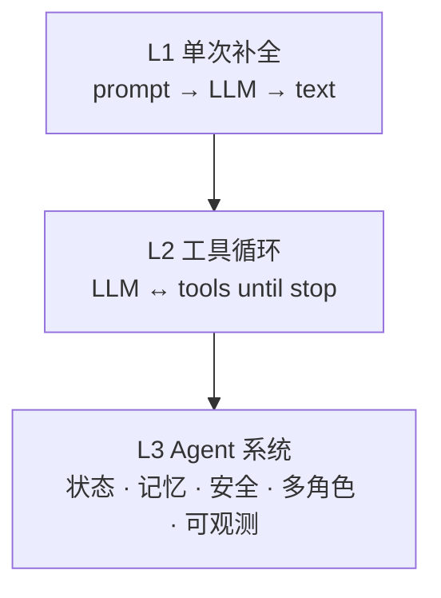

- **L1**：没有「行动—观察」闭环，不构成 Agent。  
- **L2**：具备 **Thought / Action / Observation** 语义（名称未必写在 prompt 里）。  
- **L3**：在 L2 上增加 **跨轮状态**、**持久记忆或摘要**、**护栏与人机确认**、**多 Agent 路由**、**追踪与评测**。  

本指南涉及的四个项目均至少覆盖 **L2**；其中 **`software-agent-sdk`**、**`deepagents`**、**`deer-flow`** 明显面向 **L3**；**`openai-agents-python`** 以 **L2+可插拔 L3 模块**（Session、Guardrail、Tracing）呈现。

### 1.2 为什么需要「设计文档」而不只看 README

README 回答 **「怎么用」**；设计文档回答 **「真相存在哪里、循环是谁驱动、状态如何演化」**。  
读源码时若缺少这三问，容易把 **「消息列表」** 与 **「事件流」**、**「图节点」** 与 **「while 循环」** 混为一谈——下文用 **统一参考模型** 先对齐词汇。

---

## 第二章 统一参考模型 URM

下面五维足以对比绝大多数 Agent 框架。

| 维度 | 问题 |
|------|------|
| **驱动循环** | 谁在外层 `while`/`run`：`Conversation`、`Runner`、还是 LangGraph `invoke`？ |
| **真相来源** | 当前「世界」以什么数据结构为准：`messages[]`、`events[]`、还是 graph state？ |
| **上下文工程** | 如何生成下一轮 LLM 输入：全量、摘要、压缩、View、还是 middleware 改写？ |
| **能力扩展** | 工具如何注册：函数 tool、MCP、代码执行、子代理？ |
| **协作模型** | 多 Agent：handoff、子图、Crew、delegate、还是产品内 coordinator？ |

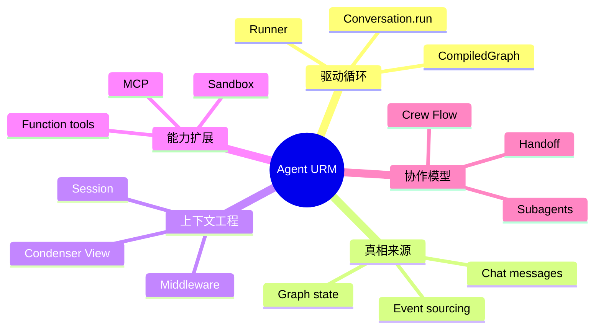

以下各节按 **同一五维** 描述四个项目，便于横向对齐。

---

## 第三章 software-agent-sdk（OpenHands SDK）

### 3.1 定位与仓库形态

- **仓库**: [OpenHands/software-agent-sdk](https://github.com/OpenHands/software-agent-sdk)（本地常见路径：`software-agent-sdk/`）。  
- **形态**: **UV monorepo**，核心包 **`openhands-sdk`**，配套 **`openhands-tools`**（终端、编辑、浏览器、委派等）、**`openhands-agent-server`**（FastAPI）、**`openhands-workspace`**（远程工作区）。  
- **与 OpenHands 主项目关系**：SDK 承担 **可嵌入的 Agent 核心**；OpenHands 产品侧承担 **编排、沙箱托管、UI** 等（详见 [`OpenHands_ARCHITECTURE_OVERVIEW.md`](./OpenHands_ARCHITECTURE_OVERVIEW.md)）。

### 3.2 Monorepo 依赖（协作）

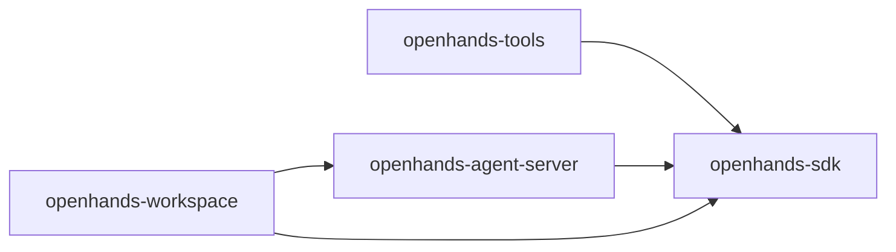

### 3.3 核心设计原则（深入浅出）

1. **事件溯源（Event Sourcing）**  
   - **浅浅说**：像 Git 一样只追加 commit，不偷偷改历史。  
   - **深深说**：协作与回放依赖 **不可变 `events`**；给 LLM 的「对话」是 **派生视图**，不是唯一真相。

2. **Agent 配置无状态**  
   - Agent 多为 **frozen Pydantic**；**`ConversationState`** 持有运行期 fields（执行状态、事件列表等）。

3. **View + Condenser**  
   - **View**：从事件构造「当前可见切片」。  
   - **Condenser**：在上下文过长时触发 **压缩事件**（如 `Condensation`），可能 **占用一整轮 step** 专做压缩。

4. **工具是第一公民**  
   - 统一 **ToolDefinition**；支持 **MCP**；内置 **Finish / Think** 等元工具；高危动作可走 **确认流**。

### 3.4 运行时流程：`LocalConversation.run` → `Agent.step`

外层 **Conversation** 在锁内循环调用 **`agent.step`**；内层 **step** 完成「准备消息 → LLM → 解析 → 发射事件 → 执行工具」。

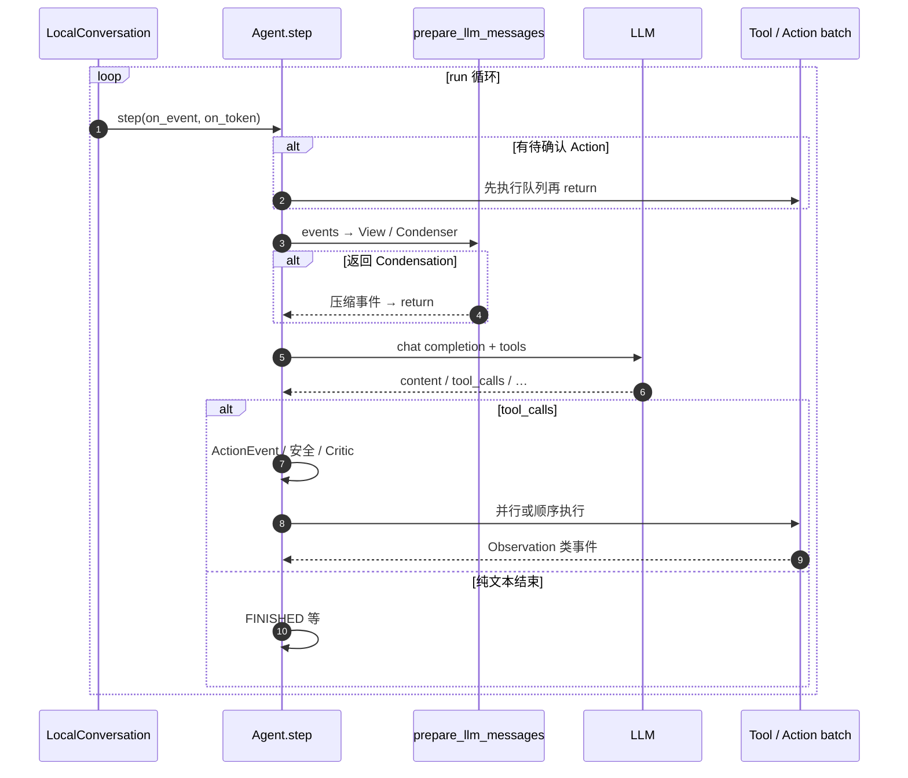

### 3.5 `step` 内部逻辑分段（概念）

下列阶段与源码 `openhands-sdk/openhands/sdk/agent/agent.py` 中 `step` 对齐，便于阅读时「贴标签」：

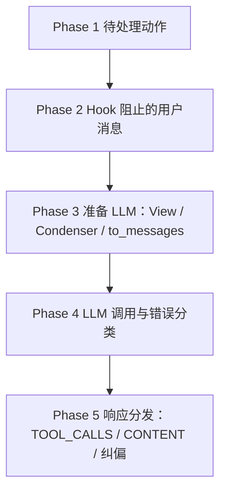

### 3.6 执行状态（与 UI / 网关协作）

常见 **`ConversationExecutionStatus`** 语义包括：**RUNNING**、**WAITING_FOR_CONFIRMATION**、**FINISHED**、**STUCK**、**ERROR** 等。  
状态机细节与 ASCII 图见 [`OPENHANDS_SDK_ARCHITECTURE_DEEP_DIVE.md`](./OPENHANDS_SDK_ARCHITECTURE_DEEP_DIVE.md) **§2.4**。

### 3.7 适用场景小结

| 场景 | 理由 |
|------|------|
| **自主编程、改仓库、跑终端、浏览器** | 工具链与 **delegate 子代理** 面向软件工程 |
| **审计、复盘、流式展示** | **事件流** 天然适合日志与 UI |
| **上下文极长需可控压缩** | **Condenser** 一等公民 |
| **人机确认、安全分级** | **SecurityRisk、Hooks、确认模式** |

### 3.8 兼容性与大模型依赖升级

- **Python 3.13 启动兼容性**：移除了 logger 初始化模块中对过时音频读取库 `aifc` 的强制预加载（pre-import）代码块。防止在现代 Python 3.13 移除该废弃模块后引发未捕获的导入异常和启动挂起。
- **LiteLLM 升级至 1.84.1**：升级底层模型调用代理库 `LiteLLM` 到 1.84.1 版本，以应对日益复杂的 reasoning 模型推理参数及多模态输入适配。该升级有效降低了流式输出中的分词抖动（token jitter）并提供了更好的 Prompt Caching 支持。

---

## 第四章 openai-agents-python（OpenAI Agents SDK）

### 4.1 定位

- **包名**: `openai-agents`；文档站由 MkDocs 构建（本地 `openai-agents-python/docs/`）。  
- **一句话**：**Runner 驱动的「Agent 循环 + 可选 Handoff + 工具」**，模型提供者可插拔。

### 4.2 统一参考模型五维

| 维度 | 实现要点 |
|------|----------|
| **驱动循环** | **`Runner.run` / `run_sync` / `run_streamed`** |
| **真相来源** | 运行期 **`RunResult` / items**；会话可选 **Session** 协议持久化输入项 |
| **上下文工程** | 以 **OpenAI Responses / Chat Completions** 物品模型为中心；Session 管历史 |
| **能力扩展** | **function tools**、**MCP**、**computer** 等；Agent 亦可 **as_tool** |
| **协作模型** | **Handoff**（切换当前 Agent）；或 **编排多个 Agent 调用** |

### 4.3 Agent Loop（与官方文档一致）

官方 **`docs/running_agents.md`** 将循环定义为：

1. 对**当前 Agent** 调 LLM；  
2. 若 **final_output**（无 tool calls 且满足输出类型）→ **结束**；  
3. 若 **handoff** → 切换 agent / 输入 → 继续；  
4. 若 **tool calls** → 执行 → 追加结果 → 继续；  
5. 超过 **`max_turns`** → **`MaxTurnsExceeded`**。

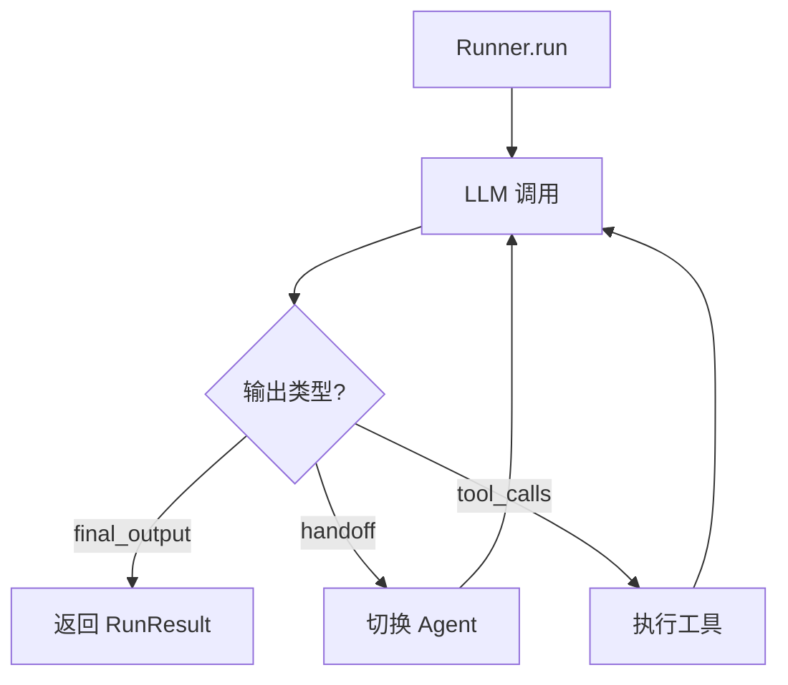

### 4.4 多 Agent 协作（两种常见范式）

| 范式 | 含义 | 典型用途 |
|------|------|----------|
| **Handoff** | 专员「接管」后续对话轮次 | 路由到专家 Agent |
| **Agent as tool** | 经理保留会话主权，把子 Agent 当工具调用 | 聚合多专家输出 |

详见 SDK **`docs/multi_agent.md`**。

### 4.5 适用场景小结

| 场景 | 理由 |
|------|------|
| **最小依赖接入多模型** | Provider 抽象成熟 |
| **应用内嵌 Agent**（后端服务） | Runner API 清晰 |
| **需要 Guardrail / Session / Tracing** | 一等模块 |
| **安全沙箱环境运行** | v0.14.0+ 引入的 Sandbox Agents 支持本地/Docker/托管沙箱（E2B/Runloop/Daytona 等） |

### 4.6 沙箱智能体与最新特性 (v0.14.0+ 至 v0.17.4)

- **`SandboxAgent` / `Manifest` / `SandboxRunConfig`**：声明式的沙箱配置与工作区管理，支持目录挂载、Git 仓库、Snapshot 备份与恢复。
- **沙箱运行后端**：支持本地 (`UnixLocalSandboxClient`)、容器隔离 (`DockerSandboxClient`)，并通过 optional extras 支持云端托管沙箱（Blaxel, Cloudflare, Daytona, E2B, Modal, Runloop, Vercel）。
- **持久化与恢复**：允许通过 `RunState` 恢复运行，或使用 portable snapshots 进行跨会话复用。
- **v0.15.0 / v0.16.0**：显式抛出 `ModelRefusalError`，将默认模型升级为 `gpt-5.4-mini` 并设置 GPT-5 对应的推理参数默认值。
- **v0.17.0+ 及 v0.17.4 更新**：
  - **Realtime API 支持**：移除 Realtime 智能体文档的 beta 标识，支持在 Realtime 运行中配置 **自定义语音对象 (Custom Voice objects)**。
  - **持久化记忆扩展**：在 `examples/memory` 中新增 MongoDB 状态与会话存储示例，支持大规模企业级交叉会话记忆持久化。
  - **钩子机制补强**：修复 `tool-end` 钩子数据返回格式，将其输出类型标准化为对象 (object) 以便下游中间件准确消费工具输出。

---

## 第五章 deepagents（LangChain 生态）

### 5.1 定位（本仓库 `libs/deepagents`）

**deepagents** 不是「裸循环」，而是在 **`create_agent`（LangChain）+ LangGraph `CompiledStateGraph`** 上，用 **Middleware 链** 堆出「深度任务」能力：**Todo、文件系统、摘要、子代理、Skills、Memory** 等。

### 5.2 入口：`create_deep_agent`

主入口见 **`deepagents/graph.py`** 中 **`create_deep_agent`**：组装模型、工具、**checkpoint/store**、以及内置 middleware（TodoList、Filesystem、Summarization、PatchToolCalls、Skills、Memory、Subagents 等）。

### 5.3 Middleware 为何存在（深入浅出）

- **浅**：像 HTTP 中间件，在「请求 LLM 之前」插一刀。  
- **深**：普通 **tool** 只能被模型调用；**middleware** 可在 **每一轮模型调用前** 动态 **改 system prompt、过滤工具、压缩历史、读写跨轮状态**——这是 deepagents 与「纯工具列表 Agent」的根本差别。

详见 [`DEEPAGENTS_MIDDLEWARE_CHAIN_DEEP_DESIGN.md`](./DEEPAGENTS_MIDDLEWARE_CHAIN_DEEP_DESIGN.md)。

### 5.4 架构示意

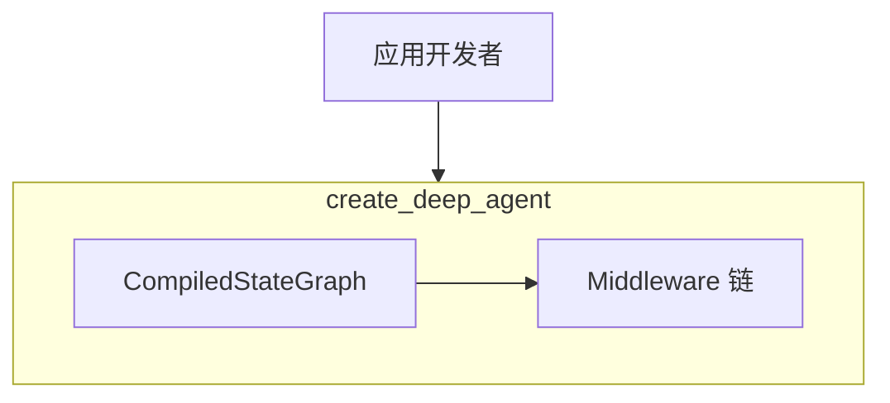

### 5.5 适用场景小结

| 场景 | 理由 |
|------|------|
| **已在 LangChain / LangGraph 栈** | 一致的状态与 checkpoint 模型 |
| **要「类 Claude Code」能力包** | Todo + FS + 子代理 + 摘要一体 |
| **需要可插拔治理** | Middleware 模式 |
| **开箱即用交互式 REPL 编码终端** | `deepagents-code` (`dcode`) 提供类 Claude Code 交互体验 |

### 5.6 CLI 与 Code 分包说明 (v0.6.6)

自 v0.6.6 起，Deep Agents 进行分包拆分：
- **`deepagents-cli`** (`deepagents`)：移除交互式 REPL 终端，仅包含部署子命令（`init`、`dev`、`deploy`），用于托管在 LangGraph / LangSmith 服务器上。
- **`deepagents-code`** (`dcode`)：作为独立包发布，提供原生的交互式终端 TUI（支持模型选择、会话持久化恢复、Skills/Memory 自定义等）。
- **沙箱运行扩展**：支持 Daytona, Modal, Runloop, QuickJS 等第三方沙箱运行扩展（位于 `libs/partners/`）。

---

## 第六章 deer-flow（Super Agent Harness）

### 6.1 定位

**deer-flow**（如本地 `deer-flow/`）是 **2.0 起整体重写**的开源 **Super Agent Harness**：强调 **子代理、记忆、沙箱、可扩展 skills**，并通常带 **前后端与部署形态**（详见仓库根 `README.md`）。

它 **不等于** 单一轻量 pip SDK：更接近 **平台 / 产品**，与 **`software-agent-sdk` 单库嵌入** 或 **`openai-agents-python` Runner** 的粒度不同。

### 6.2 概念组件（产品视角）

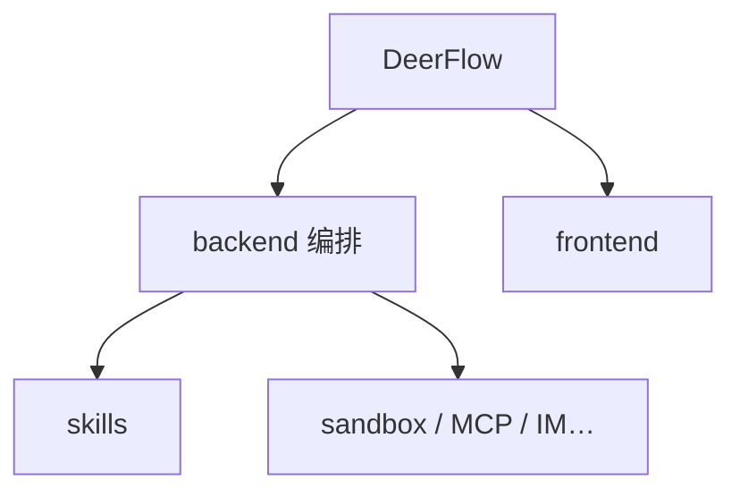

### 6.3 适用场景小结

| 场景 | 理由 |
|------|------|
| **要可部署的「研究 / 自动化工作台」** | 自带工程化骨架 |
| **要技能生态与沙箱整合** | README 明确列为核心 |
| **不是只想在现有服务里嵌 20 行 Agent** | 选型偏「整套 harness」 |

### 6.4 v2.0 重大更新说明

自 v2.0 起，DeerFlow 进行了全面的架构重构：
- **`RuntimeFeatures` 声明式配置系统**：替换了旧有的 YAML 驱动配置，允许在 Agent 创建时使用强类型声明特性（如 `features=RuntimeFeatures(sandbox=True, memory=True)`）。
- **19 个 Middleware 链**：从原来的 14 个扩展至 19 个。新增了全链路日志记录 (`ModelCallLogging`)、安全审计 (`SandboxAudit`)、LLM 错误处理熔断器 (`LLMErrorHandling`)、延迟工具过滤 (`DeferredToolFilter`) 以及 Token 使用统计 (`TokenUsage`)。
- **`@Next/@Prev` 装饰器机制**：提供显式声明中间件前后置依赖的精细扩展钩子。
- **I/O 阻塞检测**：引入静态检测器 (`make detect-blocking-io`) 和运行时 Blockbuster 回归守卫 (`make test-blocking-io`)，确保 asyncio 事件循环绝对不被同步 I/O 阻塞。
- **记忆与推理**：优化三层记忆结构（摘要、Hook、防抖队列），并原生适配 Kimi/DeepSeek 等 MiMo 推理内容（`reasoning_content`）回放以保持工具调用连贯性。

---

## 第七章 协作关系：四种栈如何对话

### 7.1 典型边界

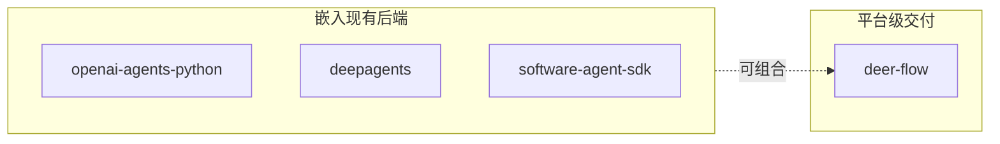

- **同一组织内**：后端可用 **openai-agents** 或 **deepagents** 做推理内核，外围再用 deer-flow 类产品做 **门户与运维**——注意维护 **两套状态模型** 的成本。  
- **软件工程 Agent**：**software-agent-sdk** 与 **deepagents** 都可完成；前者 **事件溯源 + 工具链** 更偏 IDE 作业审计，后者 **LangGraph 生态整合** 更快。

### 7.2 不推荐混淆的观念

- 把 **deer-flow** 当成「和 openai-agents 二选一的库」——粒度不对齐。  
- 把 **OpenHands 事件流** 强行塞进 **纯 messages Session** 心智模型——会误解 Condensation 与 replay。  

---

## 第八章 流程对比总图（一张图收束）

### 8.1 三种「真相来源」

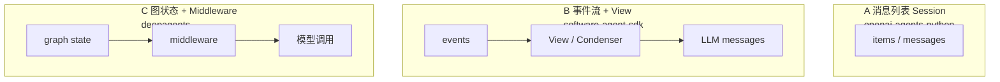

### 8.2 选型时的第一步

**先答**：你的「唯一真相」更希望是 **对话 items**、**事件日志**，还是 **图状态**？——答案往往直接缩小到 1～2 个候选框架。

---

## 第九章 选型决策树与对比矩阵

### 9.1 决策树

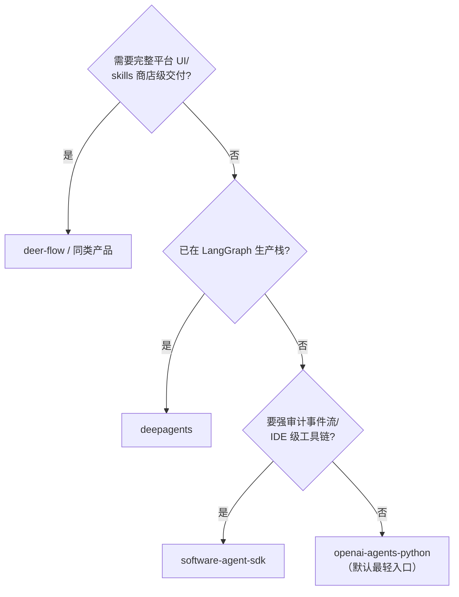

### 9.2 对比矩阵（精简版）

| 项目 | 驱动核心 | 状态 / 记忆 | 上下文策略 | 协作 | 典型交付 |
|------|-----------|-------------|------------|------|----------|
| **software-agent-sdk** | `Conversation` + `Agent.step` | **Event sourcing** | View + **Condenser** | delegate、子代理工具 | 编码 Agent、可审计 |
| **openai-agents-python** | `Runner` / `SandboxAgent` | **Session** / Workspace 快照 | 提供商 items + session | **Handoff**、as_tool | 应用内嵌、沙箱运行 |
| **deepagents** | **LangGraph** | graph state + checkpoint/store | **Middleware** | SubAgent、`task` 工具 | LC 生态、dcode REPL 终端 |
| **deer-flow** | 产品内编排 (v2.0) | 平台级三层记忆 (防抖) | skills + 19 Middleware 链 | 子代理 harness | 端到端部署 (RuntimeFeatures) |

### 9.3 学习路径建议（与本文档配套）

1. 读懂 **第二章 URM**（本章卡片）。  
2. 选一个「主战场」：**SDK 嵌入**（§4/§5）或 **事件型工程 Agent**（§3）。  
3. 用 **第九章矩阵** 对照团队栈（Python 版本、是否已有 LangGraph、是否要审计）。  
4. 再打开对应 **专题深潜文档** 读实现。

---

## 第十章 扩展对比（运维、锁定、学习曲线）

本节补充第九章矩阵未展开的维度，便于工程评审。

### 10.1 运维与可观测

| 项目 | 追踪 / 日志 | 会话恢复 | 备注 |
|------|-------------|-----------|------|
| **software-agent-sdk** | 事件流天然可审计；可与 agent-server 组合 | 依赖事件持久化与状态存储策略 | 适合自建运维面板 |
| **openai-agents-python** | **Tracing** 一等公民 | **RunState** 等恢复路径见文档 | 与 OpenAI 生态契合 |
| **deepagents** | **LangSmith** 等 LC 生态 | **Checkpointer** | 与 LangGraph 运维一致 |
| **deer-flow** | 产品内集成（如 README 提及 Langfuse 等） | 平台策略 | 按部署文档 |

### 10.2 供应商与迁移成本（定性）

| 项目 | 绑定程度 | 说明 |
|------|-----------|------|
| **openai-agents-python** | 中～低 | 设计上 **多提供商**；心智模型贴近 OpenAI Responses，但仍可抽象 |
| **deepagents** | 中 | 绑定 **LangChain/LangGraph** 栈；换栈成本高 |
| **software-agent-sdk** | 中 | **LiteLLM** 等统一 LLM；事件模型自建，迁移 UI 与存储需规划 |
| **deer-flow** | 取决于部署 | 平台配置（模型、skills、沙箱）迁移工作量随定制上升 |

### 10.3 学习曲线（主观，便于培训排序）

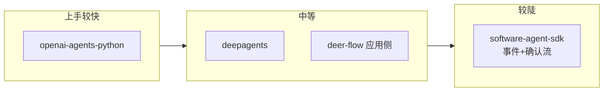

**说明**：**openai-agents-python** 文档 **`running_agents.md`** 把循环讲透，适合第一站；**deepagents** 需理解 **middleware + graph**；**software-agent-sdk** 需接受 **事件溯源** 范式迁移。

---

## 第十一章 关键抽象速查表（读源码用）

### 11.1 software-agent-sdk（目录职责）

| 路径（`openhands-sdk/openhands/sdk/`） | 职责 |
|----------------------------------------|------|
| `agent/` | `Agent`、`step`、响应分发、与 LLM 交互 |
| `conversation/` | 会话实现、`ConversationState`、本地/远程 |
| `event/` | 事件类型、`to_llm_message` |
| `context/` | View、Condenser、Prompt、Skills 相关上下文 |
| `tool/` | 工具抽象与执行链路 |
| `hooks/` | 生命周期与用户输入拦截 |
| `mcp/` | MCP 客户端集成 |
| `llm/` | LLM 封装 |

### 11.2 openai-agents-python（文档锚点）

| 文档 | 内容 |
|------|------|
| `docs/agents.md` | Agent 字段与配置 |
| `docs/running_agents.md` | **Agent Loop**、同步/流式 |
| `docs/multi_agent.md` | 编排范式 |
| `docs/handoffs.md` | Handoff 语义 |
| `docs/sessions/` | 会话持久化 |
| `docs/tracing.md` | 可观测 |

### 11.3 deepagents（本仓库）

| 入口 | 文件 |
|------|------|
| 装配图 | `libs/deepagents/deepagents/graph.py` → `create_deep_agent` |
| 中间件说明 | `libs/deepagents/deepagents/middleware/__init__.py`（module docstring） |
| 子代理规格 | `middleware/subagents.py`（`SubAgent` TypedDict） |

---

## 第十二章 反模式（选型与集成）

1. **用「聊天消息」心智读 OpenHands 事件流**：会误判 Condensation 与 replay；应先接受 **事件 → View**。  
2. **把 deer-flow 当轻量库塞进微服务却不带走运维**： harness 的价值在 **整体编排**，碎片化集成往往得不偿失。  
3. **在 LangGraph 已成熟团队强行用另一套状态机**：优先 **deepagents** 或显式桥接，避免双主循环。  
4. **忽视确认流与安全策略**：**software-agent-sdk** 面向真实终端与写盘，**生产必须**配 Hook、确认与审计。  

---

## 第十三章 术语表

| 术语 | 简释 |
|------|------|
| **Event Sourcing** | 以只追加事件为真相；视图由折叠规则派生 |
| **Condenser** | 将历史事件压缩为摘要事件，缓解上下文窗口 |
| **Handoff** | 将「当前负责 Agent」切换给另一个 Agent |
| **Middleware** | 在模型调用前后拦截、改写消息与工具列表 |
| **Harness** | 不仅包含库，还包含编排、UI、运维形态的整体载体 |
| **Runner** | OpenAI Agents SDK 中驱动循环的引擎类 |

---

## 第十四章 延伸阅读（本仓库 `docs/`）

| 文档 | 内容 |
|------|------|
| [`OPENHANDS_SDK_ARCHITECTURE_DEEP_DIVE.md`](./OPENHANDS_SDK_ARCHITECTURE_DEEP_DIVE.md) | OpenHands SDK + 与 OpenHands 主项目 |
| [`OPENAI_AGENTS_SDK_ARCHITECTURE_DEEP_DIVE.md`](./OPENAI_AGENTS_SDK_ARCHITECTURE_DEEP_DIVE.md) | OpenAI Agents SDK 源码级 |
| [`DEEPAGENTS_FRAMEWORK_COMPLETE_DESIGN.md`](./DEEPAGENTS_FRAMEWORK_COMPLETE_DESIGN.md) | Deep Agents 框架完整设计 |
| [`DEEPAGENTS_MIDDLEWARE_CHAIN_DEEP_DESIGN.md`](./DEEPAGENTS_MIDDLEWARE_CHAIN_DEEP_DESIGN.md) | 中间件链深度 |
| [`MULTI_AGENT_DESIGN_COMPARISON.md`](./MULTI_AGENT_DESIGN_COMPARISON.md) | 含 crewAI、deer-flow、smolagents 等更广对比 |
| [`AI_AGENT_FRAMEWORK_COMPREHENSIVE_COMPARISON.md`](./AI_AGENT_FRAMEWORK_COMPREHENSIVE_COMPARISON.md) | 更广框架综合对比 |

---

## 第十五章 变更记录

| 版本 | 日期 | 说明 |
|------|------|------|
| 1.0 | 2026-04 | 初版：四项目体系化总览 + 流程与选型 |
| 1.1 | 2026-04 | 增加与 [`AGENT_SDKS_SOURCE_LEVEL_DEEP_DIVE.md`](./AGENT_SDKS_SOURCE_LEVEL_DEEP_DIVE.md) 的交叉引用 |
| 1.2 | 2026-05 | 同步更新 OpenHands（LiteLLM 1.84.1 升级、Python 3.13 aifc 模块移除）以及 OpenHarness（动态系统提示词注入、Swarm 配置共享、win32 锁兼容）等演进细节 |

---

*本文遵循仓库贡献惯例：若用于对外材料，请根据实际部署版本核对各子项目 README 与官方文档。*
