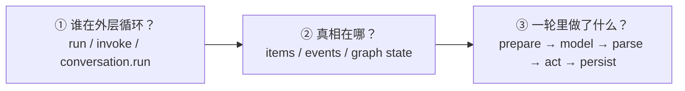
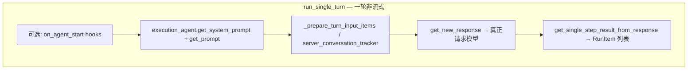
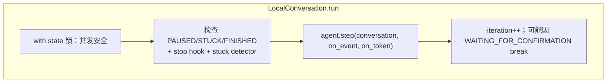
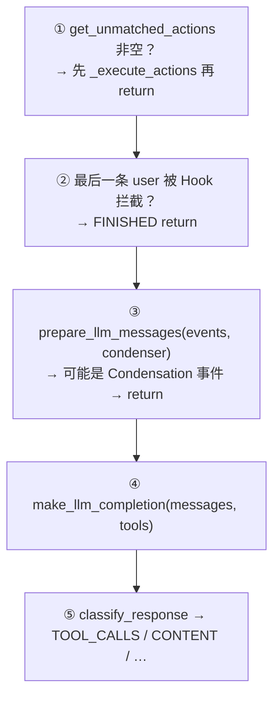
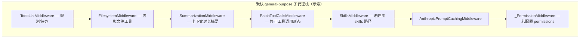
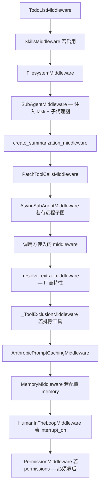
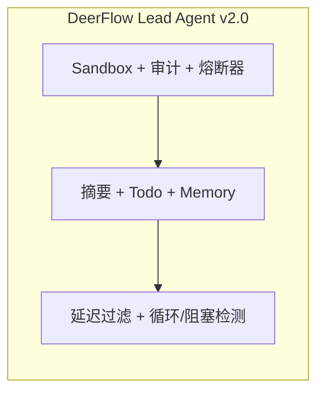

# Agent SDK 源码级深读（图解 + 注释）

> **目标**：在不大段粘贴源码的前提下，用 **文件路径 + 函数边界 + 带注释的图解**，把四个栈的 **运行时真理** 讲清楚。  
> **配套总览**：先看 [`AGENT_SDKS_COMPREHENSIVE_DESIGN_GUIDE.md`](./AGENT_SDKS_COMPREHENSIVE_DESIGN_GUIDE.md) 建立术语，再用本文 **对照源码**。  
> **路径约定**：下文路径相对于 monorepo 根目录（`/Users/gqli/work/deepagents/`），与子仓库克隆位置无关时可自行替换前缀。

---

## 〇、怎么读才不会迷路

读 Agent 源码建议固定 **三条轴**，任意框架都适用：



| 轴 | 你要回答的问题 |
|----|----------------|
| **① 驱动** | 断点打在 **最外层 while/for**，不要先在 LLM 客户端里打转。 |
| **② 真相** | 恢复会话时 **反序列化什么**：`RunState`、`events[]` 还是 checkpoint。 |
| **③ 单轮** | 一轮 = **准备输入 → 调模型 → 解析输出 → 执行副作用 → 写回状态**。 |

---

## 一、openai-agents-python：Runner 与「单轮」

### 1.1 源码地图（入口 → 循环 → 单轮）

```text
openai-agents-python/src/agents/
├── run.py                    # 公共 Runner：run / run_sync / run_streamed 的编排入口
├── run_internal/
│   ├── run_loop.py           # run_single_turn / get_new_response ——「一轮」核心
│   ├── turn_resolution.py    # 模型原始输出 → ProcessedResponse / RunItem
│   ├── tool_execution.py     # 工具实际执行
│   └── session_persistence.py
├── agent.py                  # Agent 数据类 + prompt/tools/handoffs 声明
├── items.py                  # RunItem / ResponseInputItem 等「物品」模型
└── run_state.py              # 可序列化的运行快照（恢复中断）
```

**浅层理解**：用户只接触 `Runner.run(agent, input)`。  
**深层理解**：`Runner` 内部把多次 **单轮** 串起来；每一轮由 **`run_single_turn`**（非流式）或对称的流式路径完成。

### 1.2 `run_single_turn` 做什么（逻辑注释图）

源码：`run_internal/run_loop.py` 中 **`run_single_turn`**（约 L1695 起）。



**注释（对应阅读源码时的心智标签）**：

1. **`hooks.on_agent_start`**：仅在需要时跑（外层循环控制 `should_run_agent_start_hooks`），用于生命周期观测。  
2. **`get_system_prompt` / `get_prompt`**：把 **Agent 声明** 落成本轮可用的 system 与 Responses prompt 配置。  
3. **`_prepare_turn_input_items`**：把 **原始 input + 已累计的 generated_items** 合成 **发给模型的 items**（与 Session、推理 item 策略等有关）。  
4. **`get_new_response`**：封装 **`maybe_filter_model_input`**、调用模型、处理重试与 hook —— **所有「调用 LLM」的复杂度集中在此**。  
5. **`get_single_step_result_from_response`**：把 **ModelResponse** 落成 **下一步怎么走**（工具调用 / handoff / final_output），产出 **`SingleStepResult`**。

### 1.3 外层循环在哪？

公共入口在 **`run.py`**：`Runner` 类组装 **`RunConfig`、`RunContextWrapper`、`AgentBindings`**，然后在内部模块中循环调用 **`run_single_turn`**（及工具执行、handoff 切换），直到：

- 模型给出 **无 tool call 的 final output**，或  
- **handoff** 切换当前 Agent，或  
- 超出 **`max_turns`**（`MaxTurnsExceeded`）。

官方文档 **`docs/running_agents.md`** 用文字描述了同一语义；调试时请以 **`run_loop.py`** 为准核对边界行为。

### 1.4 你要改行为时该看谁？

| 需求 | 优先打开的文件 |
|------|----------------|
| 调整一轮内模型输入拼接 | `run_internal/run_loop.py`（`get_new_response`、`_prepare_turn_input_items`） |
| 调整 tool/handoff 解析规则 | `run_internal/turn_resolution.py`、`run_internal/run_steps.py` |
| 会话持久化 / 恢复 | `memory/session*`、`run_internal/session_persistence.py`、`run_state.py` |
| 调整沙箱隔离与工作区机制 | `src/agents/sandbox/` (Manifest, SandboxPathGrant, base_dir 限制) |

---

## 二、software-agent-sdk（OpenHands SDK）：事件流 + `step`

### 2.1 源码地图

```text
software-agent-sdk/openhands-sdk/openhands/sdk/
├── agent/agent.py            # Agent.step —— 单步核心
├── agent/base.py             # AgentBase 抽象：step 契约
├── conversation/impl/local_conversation.py   # LocalConversation.run —— 外层循环
├── conversation/state.py     # ConversationState：events + execution_status
├── context/                  # Condenser、View、prompt 相关
├── event/                    # Event 类型体系
└── tool/                     # ToolDefinition、执行器
```

### 2.2 外层循环：`LocalConversation.run`

源码：`conversation/impl/local_conversation.py`，在 **`while True`** 中 **持有 `self._state` 锁** 调用 **`self.agent.step(...)`**。

**注释图**：



**源码注释（要点）**：

- **`FINISHED` 不立刻退出 while**：允许用户在 Agent 刚结束时 **并发再发一条消息**；`send_message` 会把状态从 FINISHED 拉回可运行 —— 注释里写明了设计意图（约 L816–823）。  
- **`WAITING_FOR_CONFIRMATION`**：需要用户点确认时 **跳出 run**，等确认后再进入下一轮。

### 2.3 内层一步：`Agent.step`（前几段分支）

源码：`agent/agent.py` **`step`**（约 L475 起）。



**与 openai-agents 的对照**：

| OpenHands SDK | OpenAI Agents SDK（概念对应） |
|---------------|-------------------------------|
| `prepare_llm_messages` + Condenser | `Session` + turn input 拼接（不同数据结构） |
| `make_llm_completion` | `get_new_response` |
| `_execute_actions` + `_ActionBatch` | `tool_execution` + 审批流 |

### 2.4 事件溯源：为何要有 `View` / `Condenser`

- **真相**是 **`state.events`** 列表；**不是**「单独维护一份 chat history」。  
- **给 LLM 看的内容** = `View` / 压缩策略过滤后的 **`events_to_messages`**。  
- 若 **`prepare_llm_messages` 返回 `Condensation`**：本轮 **不调用模型**，先写入压缩事件，**下一轮**再采样 —— 这是与「消息列表 Agent」最大的心态差异。

### 2.5 你要改行为时该看谁？

| 需求 | 优先打开的文件 |
|------|----------------|
| 改一轮步进 / 工具批处理 | `agent/agent.py`、`tool/` 下执行链路 |
| 改压缩策略 | `context/` 下 Condenser 实现 |
| 改会话生命周期 / 并发消息 | `local_conversation.py` 的 `run` 与 `send_message` |

---

## 三、deepagents：`create_deep_agent` 如何「堆」出深度能力

### 3.1 入口

源码：`libs/deepagents/deepagents/graph.py` 中的 **`create_deep_agent`**。

它 **不手写 while**；核心依赖 LangChain 的 **`create_agent`**（来自 `langchain.agents`），得到 **`CompiledStateGraph`**。

### 3.2 装配顺序（带注释）

下列顺序简化自 `graph.py` 中段（约 L475 起），**主 Agent** 与 **子 Agent** 都会拿到一套「基础 middleware + 可选 Skills + 权限」：



**浅**：middleware = 「在每次模型调用前后动手脚」。  
**深**：见 `middleware/__init__.py` 顶部长文档字符串：工具列表与 system prompt 的 **动态注入** 都靠 **`wrap_model_call`** 完成。

### 3.3 主 Agent 的 middleware 拼接顺序（源码注释）

下列顺序来自 **`graph.py`** 中 **`deepagent_middleware`** 的构建（约 L583 起），读源码时请 **从上到下** 对照（注释为行为语义）：



**最后一跳**：`return create_agent(..., middleware=deepagent_middleware, ...).with_config({"recursion_limit": 9_999, ...})`（**`graph.py`** 末尾）。高 **`recursion_limit`** 允许长任务多轮工具循环，仍受模型与底层图调度约束。

### 3.4 与 LangGraph 的关系

- **状态**：LangGraph **`AgentState`** + 可选 **`checkpointer` / `store`**。  
- **一轮**：图内部调度模型节点与工具节点；**不必**在业务代码里写显式 `while`。

### 3.5 你要改行为时该看谁？

| 需求 | 优先打开的文件 |
|------|----------------|
| 改默认工具/摘要/文件后端 | `deepagents/graph.py`、`middleware/filesystem.py`、`middleware/summarization.py` |
| 改子代理契约 | `middleware/subagents.py` |
| 理解「为何 middleware 不是普通 tool」 | `middleware/__init__.py` |
| 修改交互式 TUI / REPL 行为 | `libs/code/deepagents_code/` (主入口 `main.py`, 交互应用 `app.py`) |
| 修改部署 CLI (`init`/`dev`/`deploy`) | `libs/cli/deepagents_cli/` |
| 调整第三方沙箱运行环境 | `libs/partners/` (Daytona, Modal, QuickJS, Runloop 适配器) |

---

## 四、deer-flow：Harness / App 分界 + Lead Agent

### 4.1 两层仓库（读源码第一纪律）

```text
deer-flow/backend/packages/harness/deerflow/   # import: deerflow.*  — 可发布 harness
deer-flow/backend/app/                         # import: app.*       — Gateway、IM，不可被 harness 引用
```

**CI 防火墙**：`tests/test_harness_boundary.py` 确保 **`deerflow` 永不 import `app`**。

### 4.2 运行时入口（产品视角）

- **图工厂**：`deerflow/agents/lead_agent/agent.py` → **`make_lead_agent`**（`langgraph.json` 注册）。  
- **网关跑 run**：`app/gateway/services.py` → **`start_run`** → **`run_agent`**（同进程内嵌运行时 + SSE）。

**浅**：前端/IM 只跟 **Gateway REST / SSE** 打交道。  
**深**：Agent 实际创建仍走 **`make_lead_agent`**，与 `langgraph.json` 中的 **`deerflow.agents:make_lead_agent`** 一致（见 `backend/docs/ARCHITECTURE.md`）。

### 4.3 Lead Agent 中间件链 (v2.0)

在 v2.0 中，中间件链扩展到了 **19 个**。除了常规的 ThreadData、Sandbox、Guardrail、Summarization、Todo、Memory、LoopDetection 和 Clarification 之外，还新增了 5 个关键的系统中间件：
- `ModelCallLoggingMiddleware`（全链路日志）
- `SandboxAuditMiddleware`（命令行安全审计）
- `LLMErrorHandlingMiddleware`（熔断器模式错误处理）
- `DeferredToolFilterMiddleware`（延迟工具过滤以精简上下文）
- `TokenUsageMiddleware`（对推理用量进行自动统计）

配置方式在 v2.0 转向了基于 **`RuntimeFeatures`** 的声明式注入，而不再依赖纯 YAML，并且使用 `@Next/@Prev` 装饰器显式控制自定义中间件在链条中的相对拓扑位置。



### 4.4 你要改行为时该看谁？

| 需求 | 优先打开的文件 / 文档 |
|------|------------------------|
| 改主 Agent 工具组合 / prompt | `packages/harness/deerflow/agents/lead_agent/` |
| 改网关与线程/run | `app/gateway/services.py`、`docs/APP_PACKAGE_AND_AGENT_ECOSYSTEM.md` |
| 改沙箱或路径映射 | `packages/harness/deerflow/sandbox/` |
| 修改/增加 Middleware | `packages/harness/deerflow/agents/middlewares/` |
| 维护 I/O 阻塞检测 | `backend/docs/BLOCKING_IO_DETECTION.md` 和 `tests/blocking_io/` |

---

## 五、四栈对照：「我要改行为」速查

| 若你要… | openai-agents-python | software-agent-sdk | deepagents | deer-flow |
|---------|----------------------|--------------------|------------|-----------|
| **找外层循环** | `run.py` + `run_loop.py` | `local_conversation.py` `run` | LangGraph 图（`create_agent`） | Gateway `run_agent` + `make_lead_agent` |
| **找一轮推理** | `run_single_turn` | `Agent.step` | 模型节点 + middleware | Lead agent 图内节点 |
| **找真相存储** | `RunItem` / `Session` | `ConversationState.events` | checkpoint state | LangGraph checkpoint + `ThreadState` |
| **找工具执行** | `tool_execution.py` | `_execute_actions` / `tool/` | LangChain tools | `sandbox/tools.py` 等 |

---

## 六、小结：深入浅出的一句话

- **OpenAI Agents SDK**：用 **`Runner` + `run_single_turn`** 把「一轮」讲清楚，**items** 驱动供应商 API。  
- **OpenHands SDK**：用 **`events` + `step`** 把「可审计 Agent」讲清楚，**View/Condenser** 驱动上下文。  
- **deepagents**：用 **middleware 链 + LangGraph** 把「可扩展深度任务」讲清楚，**改请求比加 tool 更猛**。  
- **deer-flow**：用 **harness/app 分层 + make_lead_agent** 把「可部署 super agent」讲清楚，**读 CLAUDE 中间件顺序** 比猜路由快。

---

## 延伸阅读

- [`AGENT_SDKS_COMPREHENSIVE_DESIGN_GUIDE.md`](./AGENT_SDKS_COMPREHENSIVE_DESIGN_GUIDE.md) — 选型与架构总览  
- [`OPENHANDS_SDK_ARCHITECTURE_DEEP_DIVE.md`](./OPENHANDS_SDK_ARCHITECTURE_DEEP_DIVE.md) — OpenHands 事件与 Condenser 详解  
- [`OPENAI_AGENTS_SDK_ARCHITECTURE_DEEP_DIVE.md`](./OPENAI_AGENTS_SDK_ARCHITECTURE_DEEP_DIVE.md) — OpenAI SDK 更长源码轴  
- [`DEEPAGENTS_MIDDLEWARE_CHAIN_DEEP_DESIGN.md`](./DEEPAGENTS_MIDDLEWARE_CHAIN_DEEP_DESIGN.md) — Deep Agents 中间件洋葱模型  
- `deer-flow/backend/docs/ARCHITECTURE.md` — DeerFlow 组件与端口

---

*文档版本：1.0（2026-04）*
