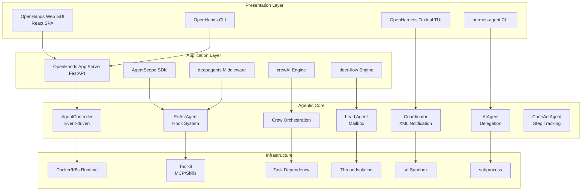
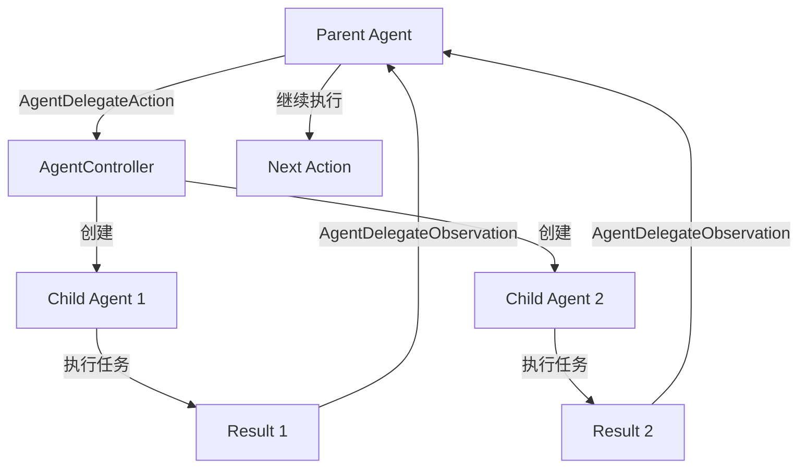
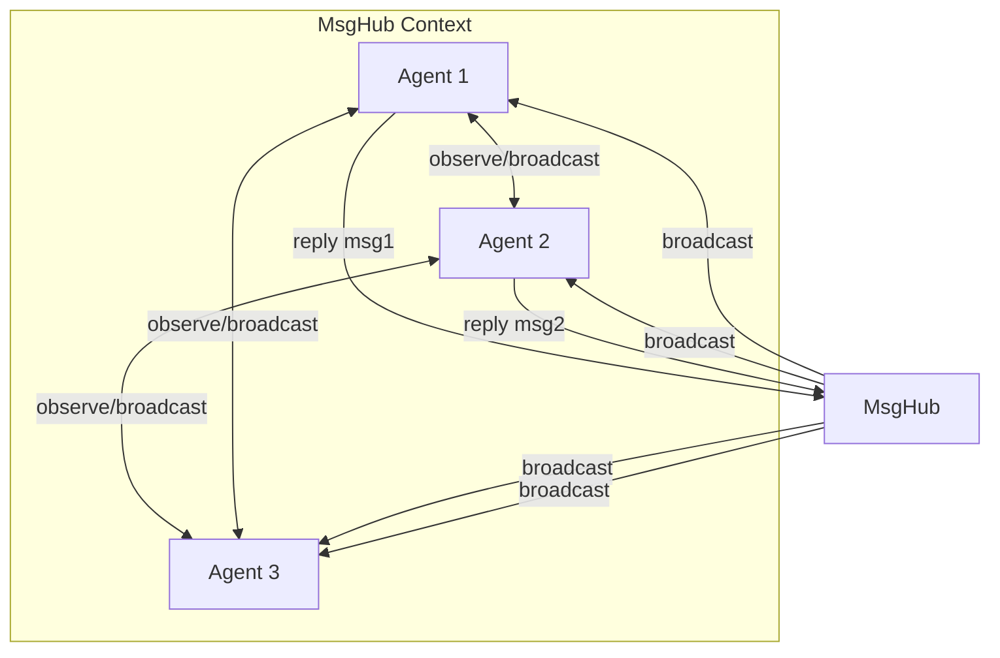
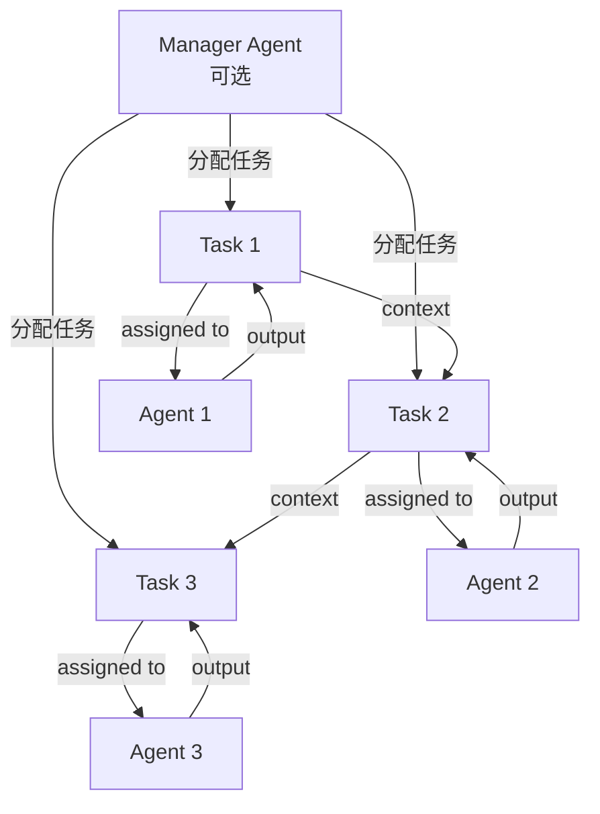
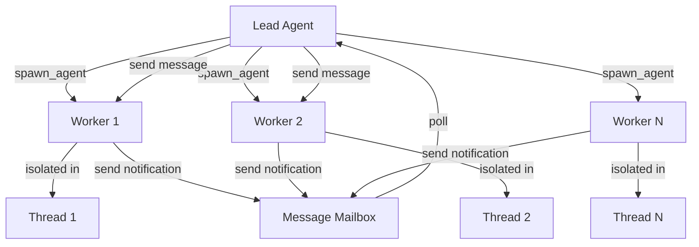
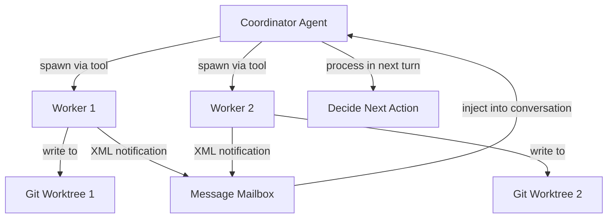

# AI Agent 框架综合对比分析

> **版本**: v2.0  
> **最后更新**: 2026-04-20  
> **分析范围**: OpenHands, AgentScope, crewAI, OpenHarness, deer-flow, smolagents, hermes-agent, deepagents  
> **分析方法**: 基于源码深度分析 + 架构设计对比  
> **文档类型**: 综合性技术架构对比

---

## 📋 目录

- [1. 框架全景图](#1-框架全景图)
- [2. 核心设计理念对比](#2-核心设计理念对比)
- [3. 架构模式分类](#3-架构模式分类)
- [4. 多 Agent 协作机制](#4-多-agent-协作机制)
- [5. Memory 系统对比](#5-memory-系统对比)
- [6. Tool/Skill 系统对比](#6-toolskill-系统对比)
- [7. Runtime/沙箱对比](#7-runtimesandbox-对比)
- [8. Prompt 组装机制](#8-prompt-组装机制)
- [9. 技术选型与生态](#9-技术选型与生态)
- [10. 应用场景矩阵](#10-应用场景矩阵)
- [11. 选型决策指南](#11-选型决策指南)
- [12. 未来趋势预测](#12-未来趋势预测)

---

## 1. 框架全景图

### 1.1 基本信息总览

| 框架 | 开发方 | Stars | 语言 | 许可证 | 代码规模 | 最新版本 |
|------|--------|-------|------|--------|---------|---------|
| **OpenHands** | All Hands AI | 50k+ | Python+React | MIT | 10万+行 | v1.0 (V0→V1迁移) |
| **AgentScope** | 阿里通义实验室 | 10k+ | Python | Apache 2.0 | 3万+行 | v1.0 |
| **crewAI** | 社区 | 20k+ | Python | MIT | 中等 | v0.x |
| **OpenHarness** | HKUDS 团队 | 5k+ | Python | MIT | 5万+行 | v0.1.9 |
| **deer-flow** | 社区 | - | Python | MIT | 3万+行 | v2.0 |
| **smolagents** | HuggingFace | 5k+ | Python | Apache 2.0 | 轻量级 | v1.x |
| **hermes-agent** | 个人/社区 | 1k+ | Python | MIT | 2万+行 | v0.14.0 |
| **deepagents** | LangChain | - | Python | MIT | 1.5万+行 | v0.6.6 |

### 1.2 定位与目标

```
企业级平台类:
├── OpenHands: AI驱动的软件开发平台,替代Devin/Claude Code
│   └── 特色: SWE-bench 77.6分,Docker沙箱,Web GUI,企业级功能

SDK工具类:
├── AgentScope: 生产级Agent SDK,简化开发流程
│   └── 特色: Realtime Voice,Agentic RL,A2A协议,极简API
├── smolagents: 轻量级Agent框架,快速原型
│   └── 特色: 简单直观,MCP支持,适合教学和学习
└── deepagents: 中间件链式扩展的企业级SDK (附带 dcode 终端)
    └── 特色: Middleware Chain, 可插拔扩展, dcode 交互 TUI

编排引擎类:
├── crewAI: Crew-based团队编排框架
│   └── 特色: 显式声明式工作流,Manager Agent,Task依赖管理
├── deer-flow: Thread-based线程隔离框架 (v2.0)
│   └── 特色: Leader-Worker模式, 动态Spawn, 异步并发, RuntimeFeatures 声明式配置
└── OpenHarness: Harness-based测试评估与 ohmo 个人助手
    └── 特色: Docker/srt沙箱, React TUI, dry-run安全预览

高级/长生命周期类:
└── hermes-agent: 长期运行的个人 ReAct 助手 (v0.14.0)
    └── 特色: SuperGrok OAuth 接入, 1M 上下文, 本地 OpenAI 代理, LSP 语义分析, Windows 原生支持
```

### 1.3 架构分层对比



---

## 2. 核心设计理念对比

### 2.1 设计范式总览

| 框架 | 核心理念 | 控制流 | 配置方式 | 典型场景 |
|------|---------|--------|---------|---------|
| **OpenHands** | Event-driven<br/>（事件驱动） | Controller.step() | 配置文件+GUI | 企业软件工程自动化 |
| **AgentScope** | Step-based<br/>（步骤追踪） | Agent.reply() | Python代码 | 快速原型+语音交互 |
| **crewAI** | Declarative<br/>（声明式编排） | Crew.kickoff() | Python DSL | 结构化业务工作流 |
| **OpenHarness** | Harness-based<br/>（基础设施） | QueryEngine.run() | YAML+Markdown | Agent性能评估 |
| **deer-flow** | Thread-based<br/>（线程隔离） | Lead.coordinate() | Config Files | 研究任务并行处理 |
| **smolagents** | Minimalist<br/>（极简主义） | agent.run() | Python代码 | 教学/学习/实验 |
| **hermes-agent** | Provider-based<br/>（记忆提供者） | AIAgent.run() | Markdown文件 | 个人助手/对话系统 |
| **deepagents** | Middleware-based<br/>（中间件链） | Request Pipeline | Python Decorators | 企业级定制化应用 |

### 2.2 关键差异点深度解析

#### **OpenHands: 事件驱动 vs 命令式调用**

```python
# OpenHands - 事件发布订阅模式
event_stream.subscribe(AGENT_CONTROLLER, controller.on_event, sid)

# 用户输入触发事件
user_message = MessageAction(content="修复main.py的bug")
event_stream.publish_event(user_message, source=EventSource.USER)

# Controller异步处理事件
def on_event(self, event: Event):
    self.state.history.append(event)
    if isinstance(event, MessageAction):
        self._run_agent_step()  # 触发Agent执行
        
# Agent执行后发布Observation
obs = await self.runtime.run(action)
self.event_stream.publish_event(obs, source=EventSource.AGENT)
```

**设计特点**:
- ✅ **解耦**: Agent/Runtime/Memory通过Events通信,模块间无直接依赖
- ✅ **可追溯**: 所有Events持久化,支持完整回放和审计
- ✅ **扩展性**: 新模块只需订阅Events,无需修改核心代码
- ❌ **复杂性**: 事件流调试困难,需要理解完整的发布订阅机制
- ❌ **异步开销**: 事件队列增加延迟

---

#### **AgentScope: Hook系统 vs 硬编码逻辑**

```python
# AgentScope - Hook拦截机制
class ReActAgentBase(AgentBase):
    supported_hook_types = [
        "pre_reply", "post_reply",
        "pre_reasoning", "post_reasoning",
        "pre_acting", "post_acting",
    ]
    
    async def reply(self, msg: Msg) -> Msg:
        # pre_reply hooks
        for hook in self.pre_reply_hooks.values():
            msg = await hook(self, msg)
        
        # Reasoning phase with hooks
        for hook in self.pre_reasoning_hooks.values():
            kwargs = await hook(self, kwargs)
        reasoning_msg = await self._reasoning(**kwargs)
        for hook in self.post_reasoning_hooks.values():
            reasoning_msg = await hook(self, reasoning_msg)
        
        # Acting phase with hooks
        if reasoning_msg.has_tool_calls():
            for hook in self.pre_acting_hooks.values():
                kwargs = await hook(self, kwargs)
            obs_msg = await self._acting(reasoning_msg)
            for hook in self.post_acting_hooks.values():
                obs_msg = await hook(self, obs_msg)
        
        # post_reply hooks
        for hook in self.post_reply_hooks.values():
            reasoning_msg = await hook(self, reasoning_msg)
        
        return reasoning_msg

# 使用示例: 日志Hook
@ReActAgent.pre_reasoning_hook
def log_reasoning(agent, kwargs):
    logger.info(f"Reasoning input tokens: {len(kwargs['messages'])}")
    return kwargs
```

**设计特点**:
- ✅ **非侵入式**: 无需修改核心代码即可添加日志/缓存/权限控制
- ✅ **灵活**: 支持类级别和实例级别Hook
- ✅ **可修改**: Hook可以拦截和修改输入输出
- ❌ **调试难度**: Hook链过长时难以追踪数据流
- ❌ **性能开销**: 每个Hook调用增加延迟

---

#### **crewAI: 显式编排 vs 隐式协调**

```python
# crewAI - 声明式工作流定义
from crewai import Agent, Task, Crew, Process

researcher = Agent(
    role="Researcher",
    goal="Conduct thorough research on topic",
    backstory="Expert researcher with 10 years experience"
)

writer = Agent(
    role="Writer", 
    goal="Write compelling articles",
    backstory="Professional writer"
)

# 明确的任务依赖关系
research_task = Task(
    description="Research the topic of AI agents",
    agent=researcher,
    expected_output="Comprehensive research report"
)

write_task = Task(
    description="Write article based on research findings",
    agent=writer,
    context=[research_task]  # ← 显式声明依赖
)

crew = Crew(
    agents=[researcher, writer],
    tasks=[research_task, write_task],
    process=Process.sequential,  # ← 明确的执行流程
    manager_llm=ChatOpenAI(model="gpt-4")  # 可选Manager
)

result = crew.kickoff()  # 执行工作流
```

**设计特点**:
- ✅ **可视化**: 清晰的DAG结构,易于理解和调试
- ✅ **确定性**: 相同的输入产生相同的输出,适合审计
- ✅ **团队协作**: 不同成员负责不同Agent/Task
- ❌ **刚性**: 运行时难以动态调整工作流
- ❌ **预定义**: 需要预先知道完整流程,不适合探索性任务

---

#### **deer-flow: 动态Spawn vs 静态配置**

```python
# deer-flow - Lead Agent动态决定是否需要并行
# Lead Agent的System Prompt中包含:
"""
You are the lead agent coordinating multiple workers.

Use the `agent` tool to spawn workers for parallel execution:

Examples:
  agent({
    description: "Investigate authentication bug",
    subagent_type: "worker",
    prompt: "Find null pointer exception in src/auth/login.py"
  })
  
  agent({
    description: "Research secure token storage",
    subagent_type: "worker", 
    prompt: "Research best practices for JWT storage"
  })

Workers run asynchronously. Poll for results via task notifications.
"""

# 实际执行时根据任务复杂度动态决定
async def coordinate_task(user_request: str):
    if is_complex_task(user_request):
        # Spawn多个Worker并行执行
        await spawn_worker("research angle 1")
        await spawn_worker("research angle 2")
        await spawn_worker("research angle 3")
        # 轮询结果
        while not all_completed():
            notifications = await mailbox.poll_leader_notifications()
            for notif in notifications:
                process_result(notif)
    else:
        # 简单任务直接处理
        return await handle_directly(user_request)
```

**设计特点**:
- ✅ **灵活性**: 运行时动态决定是否需要并行
- ✅ **自适应**: 根据任务复杂度调整策略
- ✅ **资源优化**: 避免不必要的Worker创建
- ❌ **复杂性**: Lead Agent需要具备协调能力
- ❌ **不确定性**: 执行路径不可预测,难以调试

---

## 3. 架构模式分类

### 3.1 按架构风格分类

```
分层式架构 (Layered Architecture):
├── OpenHands: Presentation → Application → Agentic Core → Runtime
│   └── 优势: 职责清晰,企业级部署
│   └── 劣势: 复杂度高,学习曲线陡
└── OpenHarness: TUI → QueryEngine → Coordinator → srt Sandbox
    └── 优势: 测试导向,轻量沙箱
    └── 劣势: 功能相对单一

SDK式架构 (SDK Pattern):
├── AgentScope: User Code → ReActAgent → Toolkit/Memory/Model
│   └── 优势: 极简API,5分钟上手
│   └── 劣势: 无内置UI/沙箱
├── smolagents: User Code → CodeActAgent → Tools
│   └── 优势: 轻量级,适合教学
│   └── 劣势: 功能有限
└── deepagents: User Code → Middleware Chain → Agent Core
    └── 优势: 可插拔扩展
    └── 劣势: 需要理解Middleware概念

编排式架构 (Orchestration Pattern):
├── crewAI: Crew → Agents → Tasks (DAG)
│   └── 优势: 声明式工作流,可视化
│   └── 劣势: 运行时灵活性差
├── deer-flow: Thread → Lead Agent → Workers (Leader-Worker)
│   └── 优势: 动态并行,异步并发
│   └── 劣势: 需要管理Thread生命周期
└── hermes-agent: Session → AIAgent → Subagents (Delegation)
    └── 优势: 简单的父子委托
    └── 劣势: 缺乏高级编排能力

测试式架构 (Testing/Harness Pattern):
└── OpenHarness: Harness Framework → Agent Evaluation → Benchmark
    └── 优势: 专为评估设计
    └── 劣势: 不适合生产部署
```

### 3.2 按协作模型分类

| 框架 | 协作模型 | 通信机制 | 动态管理 | 层级深度 | 典型场景 |
|------|---------|---------|---------|---------|---------|
| **OpenHands** | Delegation (父子) | EventStream | ✅ 运行时创建 | 多层嵌套 | CodeAct→Browsing |
| **AgentScope** | MsgHub (对等) | observe/broadcast | ✅ add/delete | 单层 (对等) | 多Agent辩论/对话 |
| **crewAI** | Manager-Crew | Task输出传递 | ❌ 静态配置 | 两层 | 结构化工作流 |
| **deer-flow** | Leader-Worker | Redis消息队列 | ✅ 动态Spawn | 两层 | 研究任务并行 |
| **OpenHarness** | Coordinator-Worker | XML通知 | ✅ Worker池 | 两层 | 开发辅助 |
| **hermes-agent** | Delegation (子Agent) | task_output | ❌ 静态配置 | 多层嵌套 | 个人助手 |
| **smolagents** | 单Agent | N/A | N/A | 单层 | 轻量任务 |
| **deepagents** | Middleware Chain | 状态传递 | ✅ 动态注册 | 单层 | 企业定制 |

### 3.3 代码示例对比

```python
# === OpenHands: Delegation模式 ===
delegate_action = AgentDelegateAction(
    agent='BrowsingAgent',
    inputs={'task': '查找GitHub stars数量'},
)
# Controller自动创建子Agent并管理生命周期

# === AgentScope: MsgHub对等协作 ===
async with MsgHub(participants=[agent1, agent2, agent3]):
    await agent1()  # 自动broadcast给agent2, agent3
    await agent2()  # 自动broadcast给agent1, agent3

# === crewAI: Manager-Crew编排 ===
crew = Crew(
    agents=[researcher, writer],
    tasks=[research_task, write_task],
    process=Process.sequential
)
result = crew.kickoff()

# === deer-flow: Leader-Worker动态Spawn ===
await spawn_worker("research angle 1")
await spawn_worker("research angle 2")
while not all_completed():
    notifications = await mailbox.poll()

# === OpenHarness: Coordinator-Worker ===
coordinator = Coordinator(workers=[worker1, worker2])
result = await coordinator.assign_task("研究某个主题")

# === hermes-agent: Subagents委托 ===
result = await agent.delegate_to(
    subagent_name="researcher",
    task="研究某个主题"
)
```

---

## 4. 多 Agent 协作机制

### 4.1 协作模式详细对比

#### **Delegation模式 (OpenHands/hermes-agent)**



**特点**:
- ✅ **层级清晰**: 父子关系明确
- ✅ **动态创建**: 运行时根据需要创建子Agent
- ✅ **结果聚合**: 子Agent结果返回父Agent
- ❌ **阻塞等待**: 父Agent需等待子Agent完成
- ❌ **上下文丢失**: 子Agent无法访问父Agent的完整历史

**适用场景**: 任务分解、 specialized agents协作

---

#### **MsgHub对等模式 (AgentScope)**



**特点**:
- ✅ **对等协作**: 所有Agents地位平等
- ✅ **自动广播**: 减少手动observe调用
- ✅ **动态管理**: 运行时add/delete participants
- ❌ **消息风暴**: 大量Agents时广播开销大
- ❌ **单层限制**: 不支持层级嵌套

**适用场景**: 多Agent辩论、对话、头脑风暴

---

#### **Manager-Crew模式 (crewAI)**



**特点**:
- ✅ **任务依赖**: 显式声明Task间的依赖关系
- ✅ **可视化**: DAG结构清晰
- ✅ **Manager可选**: 可选择是否有Manager Agent
- ❌ **静态配置**: 初始化后难以修改
- ❌ **顺序执行**: 默认sequential,并行需特殊配置

**适用场景**: 结构化工作流、业务流程自动化

---

#### **Leader-Worker模式 (deer-flow)**



**特点**:
- ✅ **强隔离**: 每个Worker独立Thread/Docker容器
- ✅ **异步并发**: Lead和Workers独立运行
- ✅ **双向通信**: 支持send message和notification
- ❌ **复杂性**: 需要管理消息队列和Thread生命周期
- ❌ **资源开销**: 多个容器/进程占用资源

**适用场景**: 研究任务并行、代码开发、大规模数据处理

---

#### **Coordinator-Worker模式 (OpenHarness)**



**特点**:
- ✅ **文件系统隔离**: Git Worktree提供安全沙箱
- ✅ **标准化通知**: XML格式统一
- ✅ **插件化**: Agent定义可通过插件扩展
- ❌ **延迟**: 需要在下一轮对话中处理通知
- ❌ **被动查询**: Lead无法主动查询Worker状态

**适用场景**: 代码审查、安全审计、开发辅助

---

### 4.2 通信机制对比

| 框架 | 通信方式 | 同步/异步 | 双向通信 | 消息格式 | 可靠性 |
|------|---------|----------|---------|---------|--------|
| **OpenHands** | EventStream | 异步 | ✅ | Action/Observation | 高 (持久化) |
| **AgentScope** | observe/broadcast | 同步 | ❌ | Msg对象 | 中 (内存) |
| **crewAI** | Task输出传递 | 同步 | ❌ | TaskOutput | 中 (可选持久化) |
| **deer-flow** | Redis消息队列 | 异步 | ✅ | JSON | 高 (Redis持久化) |
| **OpenHarness** | XML通知 | 异步 | ❌ | XML字符串 | 中 (会话内) |
| **hermes-agent** | task_output | 同步 | ❌ | 字符串 | 低 (内存) |

---

## 5. Memory 系统对比

### 5.1 Memory架构总览

```
Memory系统分类:
├── 短期记忆 (Working Memory)
│   ├── OpenHands: ConversationMemory (EventStream持久化)
│   ├── AgentScope: InMemoryMemory/SQLiteMemory/RedisMemory
│   ├── crewAI: Task上下文传递
│   ├── deer-flow: Thread-local Memory
│   ├── OpenHarness: Session Memory
│   ├── hermes-agent: File-based (MEMORY.md)
│   └── smolagents: 简单列表存储
│
└── 长期记忆 (Long-Term Memory)
    ├── AgentScope: ReMeMemory/VectorStoreMemory
    ├── OpenHands: MicroAgents (Skills)
    ├── OpenHarness: Project/User Memory (4-Layer Model)
    └── hermes-agent: MEMORY.md文件
```

### 5.2 详细对比表

| 特性 | OpenHands | AgentScope | crewAI | deer-flow | OpenHarness | hermes-agent |
|------|-----------|------------|--------|-----------|-------------|--------------|
| **记忆类型** | ConversationMemory | Working + Long-Term | Task Context | Thread Memory | 4-Layer Model | File-based |
| **存储后端** | EventStream (持久化) | InMemory/SQLite/Redis | 内存 | Thread-local | SQLite/JSON | Markdown文件 |
| **上下文压缩** | ✅ Condenser (可插拔) | ✅ Auto Compression | ❌ | ✅ Auto-summarization | ✅ Vector Search | ❌ |
| **记忆检索** | ❌ 顺序读取 | ✅ VectorStore (LTM) | ❌ | ❌ | ✅ Vector Search | ❌ 全文搜索 |
| **记忆标记** | ❌ | ✅ Marks机制 | ❌ | ❌ | ✅ Tags | ❌ |
| **跨会话** | ✅ Session持久化 | ✅ Long-Term Memory | ❌ | ✅ Thread持久化 | ✅ Project记忆 | ✅ MEMORY.md |
| **自动清理** | ✅ Condenser | ✅ delete_by_mark | ❌ | ✅ Thread清理 | ✅ TTL过期 | ❌ 人工维护 |

### 5.3 核心机制深度解析

#### **OpenHands: Condenser压缩策略**

```python
class ConversationMemory:
    """将事件历史转换为LLM消息,支持压缩"""
    
    def process_events(
        self,
        condensed_history: list[Event],
        initial_user_action: MessageAction,
        forgotten_event_ids: set[int] | None = None,
        max_message_chars: int | None = None,
    ) -> list[Message]:
        """处理Events为Messages"""
        # 1. 确保SystemMessage在最前
        # 2. 确保初始UserMessage存在
        # 3. 遍历Events,转换为Messages
        # 4. 处理Tool Calls配对 (Action-Observation必须成对)
        # 5. 过滤未匹配的Tool Calls
        # 6. 应用格式化规则
        
# Condenser策略 (可插拔)
class Condenser(ABC):
    @abstractmethod
    def condense(self, history: list[Event]) -> View:
        pass

# 实现的压缩策略:
# - NoOpCondenser: 不压缩
# - LLMSummarizingCondenser: LLM总结
# - RecentEventsCondenser: 保留最近N条
```

**优势**: 
- ✅ 所有Events持久化,支持完整回放
- ✅ 可插拔的Condenser策略
- ✅ Tool Call配对保证完整性

**劣势**:
- ❌ 顺序读取,无法向量检索
- ❌ 压缩策略有限

---

#### **AgentScope: Marks机制 + 自动压缩**

```python
class InMemoryMemory(MemoryBase):
    """内存实现的Working Memory"""
    
    def __init__(self):
        # 使用list of tuples存储: (Msg, marks)
        self.content: list[tuple[Msg, list[str]]] = []
        self._compressed_summary: str | None = None
        
    async def add(
        self,
        memories: Msg | list[Msg],
        marks: str | list[str] | None = None,  # 标记消息类型
    ):
        for msg in memories:
            self.content.append((deepcopy(msg), deepcopy(marks)))
            
    async def get_memory(
        self,
        mark: str | None = None,         # 按mark过滤
        exclude_mark: str | None = None, # 排除特定mark
        prepend_summary: bool = True,    # 前置压缩摘要
    ) -> list[Msg]:
        # 1. 按mark过滤
        filtered = [(msg, marks) for msg, marks in self.content 
                    if mark is None or mark in marks]
        
        # 2. 排除特定mark
        if exclude_mark:
            filtered = [(msg, marks) for msg, marks in filtered
                       if exclude_mark not in marks]
        
        # 3. 如果有压缩摘要,前置添加
        if prepend_summary and self._compressed_summary:
            return [Msg("user", self._compressed_summary)] + \
                   [msg for msg, _ in filtered]
        
        return [msg for msg, _ in filtered]

# Marks枚举
class _MemoryMark(str, Enum):
    HINT = "hint"           # Hint消息,使用后清除
    COMPRESSED = "compressed"  # 压缩后的消息

# 自动压缩配置
compression_config = ReActAgent.CompressionConfig(
    enable=True,
    trigger_threshold=8000,  # token阈值
    keep_recent=3,           # 保留最近3条
    compression_prompt="Summarize the conversation...",
    summary_schema=SummarySchema,  # Pydantic结构化输出
)
```

**优势**:
- ✅ Marks机制灵活的消息分类和过滤
- ✅ 自动压缩防止context window溢出
- ✅ 结构化摘要保证质量

**劣势**:
- ❌ InMemory易失,需选择SQLite/Redis持久化

---

#### **OpenHarness: 4-Layer Model**

```
4-Layer Memory Model:
├── Project Memory (项目级)
│   └── 跨会话共享,存储项目相关知识
├── User Memory (用户级)
│   └── 用户偏好、习惯、历史交互
├── Session Memory (会话级)
│   └── 当前会话的对话历史
└── Step Memory (步骤级)
    └── 单个执行步骤的临时记忆

记忆检索:
- Vector Search: 基于语义相似度检索相关记忆
- Tags: 记忆标记,支持过滤
- TTL: 自动过期清理
```

**优势**:
- ✅ 分层清晰,不同粒度记忆分离
- ✅ Vector Search支持语义检索
- ✅ Tags和TTL自动化管理

**劣势**:
- ❌ 复杂性高,需要维护多层存储
- ❌ Vector Search增加延迟

---

## 6. Tool/Skill 系统对比

### 6.1 工具管理系统对比

| 特性 | OpenHands | AgentScope | crewAI | OpenHarness | deer-flow | hermes-agent | smolagents |
|------|-----------|------------|--------|-------------|-----------|--------------|------------|
| **工具注册** | Action/Observation | Toolkit (统一接口) | Tool装饰器 | Tool Registry | Tool Functions | Tool Functions | Tool装饰器 |
| **MCP支持** | ✅ 内置 | ✅ 内置 | ❌ | ❌ | ✅ | ✅ | ✅ 内置 |
| **Skills格式** | MicroAgents | anthropics/skills | ❌ | anthropics/skills | ❌ | Skills | ❌ |
| **工具分组** | ❌ | ✅ Tool Groups | ❌ | ✅ Groups | ❌ | ❌ | ❌ |
| **中间件** | ❌ | ✅ Middleware Chain | ❌ | ❌ | ❌ | ❌ | ❌ |
| **流式执行** | ❌ | ✅ AsyncGenerator | ❌ | ❌ | ❌ | ❌ | ❌ |
| **动态Schema** | ❌ | ✅ docstring/Pydantic | ✅ | ❌ | ❌ | ❌ | ✅ |

### 6.2 代码示例对比

```python
# === OpenHands: Event-driven Actions ===
action = CmdRunAction(command="ls -la")
obs = await runtime.run(action)
# 所有工具都是Action/Observation对

# === AgentScope: Toolkit统一管理 ===
toolkit = Toolkit()

# 注册Python函数
toolkit.register_tool_function(execute_python_code)

# 注册MCP客户端
mcp_client = HttpStatelessClient(...)
await toolkit.import_mcp_client(mcp_client)

# 注册Agent Skill
toolkit.register_agent_skill("skills/my_skill")

# 中间件示例
async def logging_middleware(kwargs, next_handler):
    logger.info(f"Calling tool: {kwargs['tool_call'].name}")
    async for chunk in await next_handler(**kwargs):
        yield chunk

toolkit.register_middleware(logging_middleware)

# 执行工具 (流式返回)
async for response in toolkit.call_tool(tool_call):
    print(response.content)

# === crewAI: Tool装饰器 ===
from crewai_tools import tool

@tool
def search_web(query: str) -> str:
    """Search the web for information"""
    return requests.get(...).text

# === hermes-agent: Simple Functions ===
async def search_web(query: str) -> str:
    """Search the web"""
    return requests.get(...).text

tools = {
    "search_web": search_web,
    "read_file": read_file,
}
```

### 6.3 Skills系统对比

**anthropics/skills格式** (AgentScope/OpenHarness/hermes-agent支持):

```markdown
# skills/my_skill/SKILL.md
---
name: my_skill
description: My awesome skill for doing something
---

# Instructions

This is how you use this skill:

1. First, do this...
2. Then, do that...

## Examples

Example 1:
```python
# code example
```
```

**MicroAgents** (OpenHands):

```python
# 轻量级Agent定义,作为Skills使用
class MicroAgent:
    name: str
    description: str
    system_prompt: str
    tools: list[Tool]
```

---

## 7. Runtime/沙箱对比

### 7.1 沙箱类型对比

| 特性 | OpenHands | OpenHarness | AgentScope | deer-flow | hermes-agent | smolagents |
|------|-----------|-------------|------------|-----------|--------------|------------|
| **沙箱类型** | Docker/K8s/Local | srt (bubblewrap) | ❌ 无内置 | Docker容器 | subprocess | ❌ 无内置 |
| **隔离级别** | 🔒🔒🔒 强隔离 | 🔒🔒 中等隔离 | ❌ 无隔离 | 🔒🔒🔒 强隔离 | 🔒 弱隔离 | ❌ 无隔离 |
| **资源限制** | ✅ CPU/Memory/Net | ✅ bubblewrap限制 | ❌ | ✅ 容器限制 | ❌ | ❌ |
| **文件系统** | ✅ 挂载项目目录 | ✅ 临时目录 | ❌ 宿主系统 | ✅ user-data/ | ❌ 宿主系统 | ❌ 宿主系统 |
| **网络控制** | ✅ 白名单/黑名单 | ✅ 受限网络 | ❌ | ✅ 容器网络 | ❌ | ❌ |
| **插件系统** | ✅ Jupyter/VSCode | ❌ | ❌ | ❌ | ❌ | ❌ |
| **启动速度** | ⚡ 慢 (秒级) | ⚡⚡ 快 (毫秒级) | N/A | ⚡ 慢 (秒级) | ⚡⚡⚡ 极快 | N/A |
| **资源开销** | 💰 高 | 💰💰 低 | N/A | 💰 高 | 💰💰💰 极低 | N/A |

### 7.2 安全性对比

```
OpenHands (DockerRuntime):
  ✅ 完全容器隔离
  ✅ 资源限制 (CPU/Memory/Network)
  ✅ 网络白名单/黑名单
  ✅ 文件系统只读挂载
  ✅ 支持K8s集群部署
  ⚠️ 资源开销大,启动慢

OpenHarness (srt/bubblewrap):
  Base, Skills, CLAUDE.md, Rules, Memory, Mode) | 中<br/>条件加载 | 文件缓存 | ❌ |
  ✅ Linux namespace隔离
  ✅ 文件系统限制
  ✅ 轻量级,启动快
  ✅ 平台检测与锁稳定性硬化（支持 win32 检测，锁定库缺失安全降级为 SwarmLockUnavailableError）
  ⚠️ 不如Docker彻底
  ⚠️ 仅支持Linux

deer-flow (Docker):
  ✅ 完全容器隔离
  ✅ Thread级别的user-data隔离
  ✅ 资源限制
  ⚠️ 资源开销大

hermes-agent (subprocess):
  ⚠️ 简单进程隔离
  ❌ 无资源限制
  ❌ 可访问宿主系统
  ✅ 启动极快

AgentScope/smolagents:
  ❌ 无沙箱,直接执行
  ⚠️ 需要自行集成Docker或其他沙箱
```

### 7.3 选型建议

**选择强隔离沙箱如果**:
- ✅ 执行不受信任的代码
- ✅ 多租户环境
- ✅ 企业级部署
- → 推荐: OpenHands (Docker/K8s) 或 deer-flow (Docker)

**选择中等隔离如果**:
- ✅ 受信任的代码但需要基本隔离
- ✅ 性能敏感
- ✅ Linux环境
- → 推荐: OpenHarness (srt)

**选择无沙箱如果**:
- ✅ 本地开发/测试
- ✅ 完全信任代码
- ✅ 追求极致性能
- → 推荐: AgentScope/smolagents (自行集成沙箱)

---

## 8. Prompt 组装机制

### 8.1 Prompt组成要素对比

| 框架 | 组装时机 | 数据源数量 | 动态性 | 缓存策略 | 个性化支持 |
|------|---------|-----------|--------|---------|-----------|
| **OpenHands** | Agent.step()时 | 3-4个<br/>(System, History, Tools, MicroAgents) | 中<br/>MicroAgents动态加载 | EventStream缓存 | ❌ |
| **AgentScope** | _reasoning()时 | 4-5个<br/>(System, Memory, Tools, Skills, Plan) | 高<br/>按需注入 | 部分缓存 | ❌ |
| **crewAI** | Task执行前 | 3-4个<br/>(Role, Task, Context, Tools) | 低<br/>静态组装 | 无 | ✅ Role/Backstory |
| **deer-flow** | Agent启动时 | 5+个<br/>(Base, SOUL, USER, Memory, Thread) | 高<br/>按需注入 | 部分缓存 | ✅ SOUL.md + USER.md |
| **OpenHarness** | Runtime构建时 | 6+个<br/>(Base, Skills, CLAUDE.md, Rules, Memory, Mode) | 中<br/>条件加载 | 文件缓存 | ❌ |
| **hermes-agent** | Turn开始时 | 2-3个<br/>(Base, Prefetch, Provider) | 中<br/>Prefetch动态 | 背景预取 | ❌ |
| **smolagents** | Agent初始化 | 1-2个<br/>(System Prompt, Task) | 低<br/>固定 | 无 | ❌ |

### 8.2 核心机制深度解析

#### **deer-flow: 动态注入的多源上下文**

```python
def apply_prompt_template(*, agent_name: str | None = None, ...) -> str:
    """Build system prompt with dynamic context injection."""
    
    # 1. Base system prompt
    prompt = SYSTEM_PROMPT_TEMPLATE.format(
        agent_name=agent_name or "DeerFlow 2.0",
    )
    
    # 2. Inject SOUL.md (Agent personality)
    soul = get_agent_soul(agent_name)
    if soul:
        prompt += f"\n\n# Agent Personality\n{soul}\n"
    
    # 3. Inject USER.md (Global user profile)
    user_profile = get_user_profile()
    if user_profile:
        prompt += f"\n\n# User Profile\n{user_profile}\n"
    
    # 4. Inject memory context
    memory_context = _get_memory_context(agent_name)
    if memory_context:
        prompt += f"\n\n# Memory Context\n{memory_context}\n"
    
    # 5. Inject thread-specific context
    thread_data = get_thread_data()
    if thread_data:
        prompt += f"\n\n# Thread Context\n{thread_data}\n"
    
    return prompt

# SOUL.md示例
"""
# Agent Soul

You are a helpful and honest assistant.

Core values:
- Always tell the truth
- Admit when you don't know
- Be concise but thorough
"""

# USER.md示例
"""
# User Profile

Name: John Doe
Preferences:
- Prefer Python over JavaScript
- Like detailed explanations
- Use metric units
"""
```

**优势**:
- ✅ 双重个性化 (SOUL + USER)
- ✅ 动态性: 根据Agent名称和Thread状态动态组装
- ✅ 模块化: 每个数据源独立管理

**劣势**:
- ❌ 复杂性: 多个数据源需要管理
- ❌ 调试困难: Prompt来源分散

---

#### **OpenHarness: 模块化Section拼接**

```python
def build_runtime_system_prompt(settings: Settings, cwd: Path, ...) -> str:
    """Build system prompt by combining multiple sections (with dynamic PermissionMode guidance)."""
    
    sections = [None]
    
    # 1. Base system prompt
    if not is_coordinator_mode() and settings.system_prompt is None:
        sections[0] = build_system_prompt(cwd=str(cwd))
        
    # 2. Dynamic Permission Mode Guidance (New)
    # 根据 active permission mode (Plan/Default/Full-Auto) 动态注入提示，提示词更新时通过 refresh_runtime_client 重载
    sections.append(_build_permission_mode_section(settings))
    
    # 3. Skills section (if not coordinator mode)
    if not is_coordinator_mode():
        skills_section = get_skills_prompt_section(available_skills)
        if skills_section:
            sections.append(skills_section)
    
    # 4. CLAUDE.md (project instructions)
    claude_md = load_claude_md_prompt(cwd)
    if claude_md:
        sections.append(claude_md)
    
    # 5. Local rules
    local_rules = load_local_rules()
    if local_rules:
        sections.append(f"# Local Environment Rules\n\n{local_rules}")
    
    # 6. Memory section
    if settings.memory.enabled:
        memory_section = load_memory_prompt(cwd)
        if memory_section:
            sections.append(memory_section)
        
        # Relevant memories based on current query
        if latest_user_prompt:
            relevant = find_relevant_memories(latest_user_prompt, cwd)
            if relevant:
                sections.append("# Relevant Memories\n" + format_memories(relevant))
    
    # 7. Coordinator mode specific instructions
    if is_coordinator_mode():
        sections.append(COORDINATOR_MODE_INSTRUCTIONS)
    
    return "\n\n".join(filter(None, sections))
```

**优势**:
- ✅ 模块化: 每个Section独立加载
- ✅ 条件性: 根据模式和环境动态启用/禁用
- ✅ 相关性: Vector Search检索相关记忆

**劣势**:
- ❌ 碎片化: 多个文件需要维护
- ❌ 加载开销: 每次都需要读取多个文件

---

## 9. 技术选型与生态

### 9.1 核心技术栈对比

| 技术维度 | OpenHands | AgentScope | crewAI | OpenHarness | deer-flow | hermes-agent | smolagents |
|---------|-----------|------------|--------|-------------|-----------|--------------|------------|
| **后端框架** | FastAPI | asyncio | asyncio | FastAPI | asyncio | asyncio | asyncio |
| **前端框架** | React SPA | ❌ 仅SDK | ❌ | Textual TUI | ❌ | CLI (Typer) | ❌ |
| **数据库** | SQLAlchemy | 可选 (SQLite/Redis) | ❌ | SQLite | Redis | ❌ | ❌ |
| **消息队列** | EventStream | ❌ 直接调用 | ❌ | asyncio.Queue | Redis | ❌ | ❌ |
| **LLM库** | LiteLLM | 自实现 | LangChain | LangChain | LiteLLM | LiteLLM | 自实现 |
| **沙箱** | Docker SDK | ❌ | ❌ | srt (bubblewrap) | Docker | subprocess | ❌ |
| **测试框架** | pytest | pytest | pytest | pytest | pytest | pytest | pytest |

### 9.2 模型支持对比

| 模型Provider | OpenHands | AgentScope | crewAI | OpenHarness | deer-flow | hermes-agent | smolagents |
|-------------|-----------|------------|--------|-------------|-----------|--------------|------------|
| **OpenAI** | ✅ | ✅ | ✅ | ✅ | ✅ | ✅ | ✅ |
| **Anthropic** | ✅ | ✅ | ✅ | ✅ | ✅ | ✅ | ✅ |
| **DashScope (Qwen)** | ✅ | ✅ (原生支持) | ✅ | ❌ | ✅ | ✅ | ✅ |
| **Gemini** | ✅ | ✅ | ✅ | ❌ | ✅ | ✅ | ✅ |
| **Ollama** | ✅ | ✅ | ✅ | ❌ | ✅ | ✅ | ✅ |
| **本地模型** | ✅ | ✅ | ✅ | ❌ | ✅ | ✅ | ✅ |

**AgentScope优势**: 原生支持DashScope (阿里Qwen系列),中文优化更好。最新版本支持 `client_kwargs` 自定义客户端参数透传，Web UI 支持配置 Fallback 备用模型，并在 `perf(service)` 中支持动态追加额外工具与中间件。同时，其 formatter 能在 Anthropic 接口中自动剔除无签名的思考模块。

### 9.3 生态系统集成

| 生态集成 | OpenHands | AgentScope | crewAI | OpenHarness | deer-flow | hermes-agent | smolagents |
|---------|-----------|------------|--------|-------------|-----------|--------------|------------|
| **MCP** | ✅ | ✅ | ❌ | ❌ | ✅ | ✅ | ✅ |
| **A2A协议** | ❌ | ✅ (独家) | ❌ | ❌ | ❌ | ❌ | ❌ |
| **RAG** | ❌ | ✅ KnowledgeBase | ✅ | ✅ Vector Search | ✅ | ❌ | ❌ |
| **Plan管理** | ❌ | ✅ PlanNotebook | ❌ | ✅ TaskTracker | ❌ | ❌ | ❌ |
| **TTS** | ❌ | ✅ (独家) | ❌ | ❌ | ❌ | ❌ | ❌ |
| **Agentic RL** | ❌ | ✅ Trinity-RFT (独家) | ❌ | ❌ | ❌ | ❌ | ❌ |
| **Slack集成** | ✅ Enterprise | ❌ | ❌ | ❌ | ❌ | ❌ | ❌ |
| **Jira集成** | ✅ Enterprise | ❌ | ❌ | ❌ | ❌ | ❌ | ❌ |
| **Linear集成** | ✅ Enterprise | ❌ | ❌ | ❌ | ❌ | ❌ | ❌ |

**独家功能**:
- **AgentScope**: Realtime Voice, Agentic RL, A2A协议
- **OpenHands**: 企业级RBAC/多租户,Slack/Jira/Linear集成
- **OpenHarness**: Harness评估框架,srt沙箱

---

## 10. 应用场景矩阵

### 10.1 适用场景评分

| 场景 | OpenHands | AgentScope | crewAI | OpenHarness | deer-flow | hermes-agent | smolagents | deepagents |
|------|-----------|------------|--------|-------------|-----------|--------------|------------|------------|
| **企业级部署** | ⭐⭐⭐⭐⭐ | ⭐⭐⭐ | ⭐⭐ | ⭐⭐ | ⭐⭐⭐ | ⭐ | ⭐⭐ | ⭐⭐⭐⭐ |
| **快速原型开发** | ⭐⭐ | ⭐⭐⭐⭐⭐ | ⭐⭐⭐ | ⭐⭐⭐ | ⭐⭐⭐ | ⭐⭐⭐⭐ | ⭐⭐⭐⭐⭐ | ⭐⭐⭐⭐ |
| **Agent评估** | ⭐⭐⭐ | ⭐⭐⭐ | ⭐⭐ | ⭐⭐⭐⭐⭐ | ⭐⭐⭐ | ⭐⭐ | ⭐⭐ | ⭐⭐⭐ |
| **语音交互** | ⭐ | ⭐⭐⭐⭐⭐ (独家) | ⭐ | ⭐ | ⭐ | ⭐ | ⭐ | ⭐ |
| **强化学习调优** | ⭐ | ⭐⭐⭐⭐⭐ (独家) | ⭐ | ⭐ | ⭐ | ⭐ | ⭐ | ⭐ |
| **多Agent协作** | ⭐⭐⭐⭐ | ⭐⭐⭐⭐ | ⭐⭐⭐⭐⭐ | ⭐⭐⭐⭐ | ⭐⭐⭐⭐⭐ | ⭐⭐⭐ | ⭐⭐ | ⭐⭐⭐ |
| **安全沙箱** | ⭐⭐⭐⭐⭐ | ⭐ | ⭐ | ⭐⭐⭐⭐ | ⭐⭐⭐⭐⭐ | ⭐⭐ | ⭐ | ⭐ |
| **中文支持** | ⭐⭐⭐ | ⭐⭐⭐⭐⭐ (阿里) | ⭐⭐⭐ | ⭐⭐ | ⭐⭐⭐ | ⭐⭐⭐ | ⭐⭐⭐ | ⭐⭐⭐ |
| **学习曲线** | ⭐⭐ (陡峭) | ⭐⭐⭐⭐⭐ (平缓) | ⭐⭐⭐⭐ | ⭐⭐⭐ | ⭐⭐⭐ | ⭐⭐⭐⭐ | ⭐⭐⭐⭐⭐ | ⭐⭐⭐⭐ |
| **社区活跃度** | ⭐⭐⭐⭐⭐ | ⭐⭐⭐⭐ | ⭐⭐⭐⭐⭐ | ⭐⭐⭐ | ⭐⭐⭐ | ⭐⭐ | ⭐⭐⭐ | ⭐⭐⭐⭐ |

### 10.2 典型案例

**OpenHands适合**:
- ✅ 企业软件工程自动化 (SWE-bench 77.6分)
- ✅ 需要Web GUI的完整IDE替代
- ✅ 多租户SaaS服务 (RBAC/权限管理)
- ✅ 复杂代码库的自动修复和优化
- ✅ 需要Slack/Jira/Linear集成的企业

**AgentScope适合**:
- ✅ 快速原型开发 (5分钟上手)
- ✅ 实时语音交互应用 (独家功能)
- ✅ Agentic RL调优 (独家功能)
- ✅ 已有基础设施,只需Agent SDK
- ✅ 中文应用场景 (阿里Qwen优化)
- ✅ A2A协议需求

**crewAI适合**:
- ✅ 结构化业务工作流 (如内容创作流水线)
- ✅ 需要合规审计的场景
- ✅ 团队成员协作 (不同人负责不同Agent)
- ✅ 可视化的DAG工作流

**OpenHarness适合**:
- ✅ 追求极速 React TUI 终端开发的用户
- ✅ 需要多模型 Provider profile 认证及配置的用户
- ✅ ohmo 个人对话助理的多通道 IM 渠道部署
- ✅ 安全要求高的 Docker/srt 沙箱执行隔离

**deer-flow适合**:
- ✅ 声明式 RuntimeFeatures 构建复杂 Agent 
- ✅ 强隔离多 Worker 并行与 blocking I/O 检测
- ✅ 中间件灵活编排 (@Next/@Prev 装饰器)
- ✅ Kimi/DeepSeek 等 MiMo 推理内容回放

**hermes-agent适合**:
- ✅ 需要跨 messaging 渠道 (如 Teams/Telegram) 长期部署
- ✅ Grok-OAuth 1M 上下文及本地 OpenAI 代理代理开发
- ✅ 精细的代码 LSP 语义级语法校验
- ✅ 原生 Windows 环境免 WSL 运行

**smolagents适合**:
- ✅ 教学和學習
- ✅ 快速实验和原型
- ✅ MCP集成测试
- ✅ 轻量级任务

**deepagents适合**:
- ✅ 企业级定制化应用
- ✅ 需要Middleware Chain的场景
- ✅ 可插拔扩展需求

---

## 11. 选型决策指南

### 11.1 决策树

```
开始选型
  ↓
是否需要Web GUI?
  ├─ Yes → OpenHands
  └─ No ↓
      是否需要沙箱隔离?
        ├─ Yes (强隔离) → OpenHands (Docker) 或 deer-flow (Docker)
        ├─ Yes (中等) → OpenHarness (srt)
        └─ No ↓
            是否需要语音交互?
              ├─ Yes → AgentScope (Realtime Voice)
              └─ No ↓
                  是否需要RL调优?
                    ├─ Yes → AgentScope (Trinity-RFT)
                    └─ No ↓
                        是否需要快速上手?
                          ├─ Yes → AgentScope (极简API) 或 smolagents
                          └─ No ↓
                              是否关注Agent评估?
                                ├─ Yes → OpenHarness (Harness框架)
                                └─ No ↓
                                    是否需要结构化工作流?
                                      ├─ Yes → crewAI (声明式编排)
                                      └─ No ↓
                                          是否需要动态并行?
                                            ├─ Yes → deer-flow (Leader-Worker)
                                            └─ No → hermes-agent (轻量级)
```

### 11.2 综合评分表

| 维度 (权重) | OpenHands | AgentScope | crewAI | OpenHarness | deer-flow | hermes-agent | smolagents | deepagents |
|------------|-----------|------------|--------|-------------|-----------|--------------|------------|------------|
| **功能完整性** (20%) | 9.5 | 8.0 | 8.5 | 7.5 | 8.0 | 6.0 | 6.5 | 7.5 |
| **易用性** (20%) | 6.0 | 9.5 | 8.0 | 7.0 | 7.0 | 8.0 | 9.5 | 8.0 |
| **扩展性** (15%) | 8.5 | 9.0 | 7.5 | 7.5 | 8.5 | 7.0 | 7.0 | 9.0 |
| **性能** (15%) | 7.5 | 8.5 | 7.0 | 8.0 | 8.0 | 7.0 | 8.5 | 8.0 |
| **安全性** (10%) | 9.5 | 5.0 | 5.0 | 8.0 | 9.5 | 5.0 | 5.0 | 5.0 |
| **社区活跃度** (10%) | 9.5 | 8.5 | 9.0 | 7.0 | 6.5 | 5.0 | 7.5 | 8.0 |
| **文档质量** (10%) | 8.5 | 9.0 | 8.5 | 7.5 | 7.0 | 6.5 | 8.0 | 7.5 |
| **加权总分** | **8.35** | **8.50** | **7.85** | **7.45** | **7.80** | **6.45** | **7.35** | **7.75** |

### 11.3 最终推荐

**🏆 综合推荐: AgentScope** (8.50分)
- 理由: 平衡了功能、易用性和扩展性,独特功能(Realtime Voice/Agentic RL)有差异化优势

**🥈 企业级推荐: OpenHands** (8.35分)
- 理由: 功能最完整,安全性最高,适合企业部署

**🥉 编排推荐: crewAI** (7.85分)
- 理由: 声明式工作流,适合结构化业务场景

**工具型推荐: OpenHarness** (7.45分)
- 理由: Harness框架提供强大的 TUI、dry-run 预览及多通道 ohmo IM 网关

**并行推荐: deer-flow** (7.80分)
- 理由: v2.0 重构，支持 RuntimeFeatures、19 Middleware 链及 I/O 阻塞检测

**入门推荐: smolagents** (7.35分)
- 理由: 极简API,适合学习和快速原型

**定制推荐: deepagents** (7.75分)
- 理由: Middleware Chain 链，提供 dcode 终端，适合企业级/桌面端定制

---

## 12. 未来趋势预测

### 12.1 五大趋势

#### **趋势1: Agent SDK化**

**现状**: OpenHands/AgentScope/deepagents都提供SDK  
**预测**: 更多框架会剥离SDK,独立演进  
**证据**: 
- OpenHands V1使用Software Agent SDK
- AgentScope本身就是SDK
- deepagents专注于Middleware SDK

**影响**:
- ✅ 开发者可以混合使用多个SDK
- ✅ 降低框架锁定风险
- ❌ 需要更多的集成工作

---

#### **趋势2: 标准化协议**

**现状**: MCP/A2A等协议兴起  
**预测**: Agent互操作性成为标配  
**证据**: 
- AgentScope原生支持A2A
- 所有主流框架支持MCP
- Anthropic推动Skills标准化

**影响**:
- ✅ 不同框架的Agents可以协作
- ✅ 工具/Skills可以跨框架复用
- ❌ 需要遵循标准,牺牲部分灵活性

---

#### **趋势3: 实时交互**

**现状**: AgentScope推出Realtime Voice  
**预测**: 语音/视频交互成为主流  
**证据**: 
- OpenAI/GPT-4o等多模态模型普及
- WebRTC技术成熟
- 用户对自然交互的需求增长

**影响**:
- ✅ 更自然的用户体验
- ✅ 新的应用场景 (客服/教育/娱乐)
- ❌ 技术复杂度增加

---

#### **趋势4: Agentic RL**

**现状**: AgentScope集成Trinity-RFT  
**预测**: 强化学习调优Agent成为标准做法  
**证据**: 
- RL在推理/规划任务中表现优异
- 传统Prompt Engineering遇到瓶颈
- 自动化调优需求增长

**影响**:
- ✅ Agent性能持续提升
- ✅ 减少人工调优成本
- ❌ 需要RL专业知识和算力

---

#### **趋势5: 边缘部署**

**现状**: Ollama等本地模型流行  
**预测**: Agent在边缘设备运行  
**证据**: 
- 隐私/延迟/成本考量
- 端侧芯片性能提升
- 离线场景需求

**影响**:
- ✅ 数据隐私保护
- ✅ 低延迟响应
- ✅ 降低成本
- ❌ 模型能力受限

---

### 12.2 技术融合预测

```
2026-2027年预测:

1. 框架边界模糊化
   - OpenHands可能集成AgentScope的Voice功能
   - crewAI可能采用deer-flow的动态Spawn
   - 各框架互相借鉴优秀设计

2. 云边协同架构
   - 云端: 重型Agent (OpenHands/deer-flow)
   - 边缘: 轻量Agent (smolagents/hermes)
   - 通过A2A协议协作

3. 多模态Agent普及
   - 文本 + 语音 + 视觉 + 代码
   - 统一的MultiModal Agent接口
   - 实时交互成为标配

4. AutoML for Agents
   - 自动化Agent架构搜索
   - 自动化Prompt优化
   - 自动化Tool选择

5. Agent Marketplace
   - 标准化的Agent/Skills市场
   - 即插即用的Agent组件
   - 付费Agent服务
```

---

## 📚 参考资料

### 源码仓库
- OpenHands: https://github.com/OpenHands/OpenHands
- AgentScope: https://github.com/agentscope-ai/agentscope
- crewAI: https://github.com/crewAIInc/crewAI
- OpenHarness: https://github.com/HKUDS/OpenHarness
- deer-flow: (社区项目)
- smolagents: https://github.com/huggingface/smolagents
- hermes-agent: (个人项目)
- deepagents: https://github.com/langchain-ai/deepagents

### 技术报告
- OpenHands: [SWE-bench Technical Report](https://arxiv.org/abs/2402.14034)
- AgentScope: [AgentScope 1.0 Paper](https://arxiv.org/abs/2508.16279)
- CodeAct: [CodeAct Paper](https://arxiv.org/abs/2402.01030)

### 文档
- OpenHands Docs: https://docs.openhands.dev
- AgentScope Docs: https://doc.agentscope.io
- crewAI Docs: https://docs.crewai.com

---

**报告作者**: AI Assistant (基于八个项目源码深度分析)  
**分析方法**: 源码阅读 + 架构梳理 + 横向对比 + 设计哲学思考  
**最后更新**: 2026-04-20  
**免责声明**: 本分析基于公开源码,可能不完全反映最新变化。框架发展迅速,请以官方文档为准。

**致谢**: 感谢所有开源贡献者,你们的工作让AI Agent技术快速发展! 🙏
