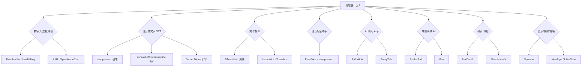

# GitHub 成熟 Android 开源项目选型指南

**文档目的**：汇总成熟、可作为**完整上线产品底座**的 Android 相关开源项目，覆盖数字人、语音转文字、实时翻译、AI、教育、音乐视频等方向。

**版本说明**：v2 大幅补充了**数字人**、**语音转文字（STT）**、**实时翻译**三类（此前确实遗漏较多）。

**筛选标准**：

- 有完整 App 或成熟 SDK，而非仅 Demo
- 近期仍有维护（Release / commit）
- 架构可 fork、可二次开发、可接自有后端
- **本文不考虑开源协议限制**（上线前仍建议法务复核 license）

**评级说明**：

| 等级 | 含义 |
|------|------|
| **S** | 完整 App 或成熟 SDK，改业务层即可冲上线 |
| **A** | 架构完整，需接后端 / 换模型 / 补运营模块 |
| **B** | 偏 SDK / 实验 / 维护一般，适合当组件而非整 App 底座 |

---

## 目录

| # | 分类 | 项目数 |
|---|------|--------|
| 1 | [数字人 / 虚拟形象](#1-数字人--虚拟形象) | **22** |
| 2 | [语音转文字 STT / 听写 / 转写](#2-语音转文字-stt--听写--转写) | **18** |
| 3 | [实时翻译 / 同声传译](#3-实时翻译--同声传译) | **10** |
| 4 | [语音对话编排 STT+LLM+TTS](#4-语音对话编排-sttllmtts) | 6 |
| 5 | [AI 聊天 / 多模态客户端](#5-ai-聊天--多模态客户端) | 10 |
| 6 | [端侧 LLM / 本地推理](#6-端侧-llm--本地推理) | 6 |
| 7 | [教育 / 学习](#7-教育--学习) | 6 |
| 8 | [音乐 / 播客 / 视频](#8-音乐--播客--视频) | 10 |
| 9 | [照片 / 内容 / 社交底座](#9-照片--内容--社交底座) | 6 |
| 10 | [成熟架构参考 / 工具型 App](#10-成熟架构参考--工具型-app) | 6 |
| — | [快速选型](#快速选型) | — |
| — | [Top 15 上线底座](#top-15-最值得优先看的上线底座) | — |
| — | [总结](#总结) | — |

**合计：约 100 个核心项目**（含引擎/SDK/App；部分跨分类标注）

---

## 1. 数字人 / 虚拟形象

> 分三层：**Android 端侧 SDK**（可直接嵌 App）→ **实时对话框架**（服务端+Android 壳）→ **口型/驱动算法**（需二次集成）。

### 1.0 阿里系数字人（端侧 + 开源 + 商用）

阿里在数字人上有 **两条线**：HumanAIGC 团队 **开源算法**（可自部署/自封装 Android），以及 **万相数字人 / 虚拟数字人 DVH 商用 SDK**（需阿里云账号与 license）。

#### A. 开源端侧（HumanAIGC，可嵌 App / 自研壳）

| 项目 | 类型 | 端侧能力 | Android 说明 |
|------|------|----------|--------------|
| [HumanAIGC/lite-avatar](https://github.com/HumanAIGC/lite-avatar) | **2D** 音频驱动 | CPU ~30fps，低显存（实测 4–5G 可跑） | 官方以 Python/ONNX 为主，**无现成 AAR**；需 JNI/ONNX Runtime 自封装，或走 OpenAvatarChat 服务端 + WebRTC 壳 |
| [aigc3d/LAM_Audio2Expression](https://github.com/aigc3d/LAM_Audio2Expression) | **3D** 音频→表情 | 驱动 3D 面部/肢体表情 | 算法开源；OpenAvatarChat 内置 `LAM_Driver`；Android 需自研 3D 渲染层 |
| [HumanAIGC-Engineering/LiteAvatarGallery](https://www.modelscope.cn/models/HumanAIGC-Engineering/LiteAvatarGallery) | 预训练形象库 | 100 个 LiteAvatar 形象 | ModelScope 下载，配合 lite-avatar 使用 |
| [HumanAIGC-Engineering/OpenAvatarChat](https://github.com/HumanAIGC-Engineering/OpenAvatarChat) | 对话框架 | ASR+LLM+TTS+Avatar 模块化 | **默认跑在 PC/服务器**；Avatar 可选 LiteAvatar/LAM/MuseTalk/FlashHead；Android 通常做 **WebRTC/WebView 客户端** |
| [FunAudioLLM/CosyVoice](https://github.com/FunAudioLLM/CosyVoice) | TTS | 高质量中文语音合成 | 常与 OpenAvatarChat 联用（API 或本地） |
| [FunAudioLLM/SenseVoice](https://github.com/FunAudioLLM/SenseVoice) | ASR | 多语言语音识别 | 常作 OpenAvatarChat 默认 ASR |

**和 Duix-Mobile 对比**：LiteAvatar 是阿里开源的 **2D 口型驱动算法**，优势是 CPU 友好、形象库多、和通义/CosyVoice 生态打通；劣势是 **没有像 Duix-Mobile 那样开箱即用的 Android SDK**，要自己包一层或走 OpenAvatarChat 服务端。

#### B. 商用端侧 Android SDK（阿里云万相 / DVH）

文档入口：[万相数字人 Android SDK](https://help.aliyun.com/zh/avatar/avatar-application/developer-reference/digital-people-conversation-androidsdk)（`VideoChatAndroidSdk`）

| 渲染模式 | 常量 | 含义 | 是否真·端侧 |
|----------|------|------|-------------|
| 云渲染-全链路 | `cloud` | RTC 拉云端视频流，完整语音对话 | 否（云端算） |
| 云渲染-音频驱动 | `remote_avatar_only` | 云端只渲染形象，客户端推音频 | 部分 |
| **端渲染-全链路** | `local` | 端侧 ASR+口型+渲染+对话，RTC 仅鉴权通道 | **是** |
| **端渲染-音频驱动** | `avatar_only` | 客户端 `pushAudioData`（PCM）驱动口型+渲染 | **是**（需自接 ASR/LLM/TTS） |

- **端渲染-音频驱动**（`avatar_only`）：最接近「自有大脑 + 阿里数字人皮囊」——你推 PCM，SDK 在手机上完成口型推理与渲染；支持 Tap2Talk / PushTalk / Duplex 等对话模式配置。
- **纯 3D 端渲染（大屏版）**：[AvatarClientRenderSDK](https://help.aliyun.com/zh/avatar/avatar/developer-reference/digital-human-side-rendering-android-sdk-access-instructions-large-screen-version)（`AvatarClientRenderSDK.aar`）——**不走推拉流**，终端直接渲染 **3D 数字人**；**仅 3D，不支持 2D**；需 license + STS 鉴权。
- **旧版流媒体 SDK**：[AliyunAvatarSDK](https://help.aliyun.com/zh/avatar/avatar/developer-reference/aliyunavatarsdk-for-android)（DingRTC 拉流），偏 **云端渲染**，与万相新 SDK 并存。

**阿里端侧选型一句话**：

| 目标 | 推荐 |
|------|------|
| 免费开源、2D、可接受自封装 | **lite-avatar** + ONNX Android |
| 免费开源、要完整对话管线（服务端） | **OpenAvatarChat** + LiteAvatar/LAM |
| 商用、要官方 Android SDK、3D | **万相 `local` / `avatar_only`** 或 **AvatarClientRenderSDK** |
| 商用、要 2D 端侧官方 SDK | 目前开源侧看 **lite-avatar**；商用线以 **3D 端渲染** 为主 |

---

### 1.1 Android 端侧 SDK / 可直接嵌 App（优先）

| # | 项目 | Stars | 等级 | 背景与可做什么 |
|---|------|-------|------|----------------|
| 1 | [duixcom/Duix-Mobile](https://github.com/duixcom/Duix-Mobile) | ~8k | **S** | **首推**。端侧 2D 数字人 SDK，<120ms 延迟，PCM/WAV 驱动口型，可接自定义 LLM/ASR/TTS；客服/导师/陪伴 |
| 2 | [moeru-ai/airi](https://github.com/moeru-ai/airi) | ~41k | **A** | Live2D/VRM 虚拟伴侣，实时语音；Android `stage-pocket` beta，生态最完整 |
| 3 | [bithuman-ai/sdk](https://docs.bithuman.ai/sdks/kotlin) (Maven) | — | **S** | 商业 SDK `ai.bithuman:sdk`，端侧 25fps 渲染，16kHz PCM 进、BGR 帧出；arm64-v8a |
| 4 | [feima09/GMTalker](https://github.com/feima09/GMTalker) | ~1k | **A** | 光明实验室 3D 数字人，**支持 Android 部署**，ASR+TTS+NLU+口型；UE 渲染，客户端可无 GPU |
| 5 | [anliyuan/Ultralight-Digital-Human](https://github.com/anliyuan/Ultralight-Digital-Human) | ~3k | **A** | **移动端实时**超轻量数字人，audio+UNet <1M，流式推理；需自研 Android 封装 |
| 6 | [HumanAIGC/lite-avatar](https://github.com/HumanAIGC/lite-avatar) | ~0.5k | **A** | **阿里开源 2D 端侧**。音频驱动口型，CPU 30fps；100+ 预训练形象（ModelScope）；无官方 Android AAR，需 ONNX 自封装或配 OpenAvatarChat |

### 1.2 实时对话数字人框架（服务端为主，Android 做壳/WebRTC）

| # | 项目 | Stars | 等级 | 背景与可做什么 |
|---|------|-------|------|----------------|
| 7 | [lipku/LiveTalking](https://github.com/lipku/LiveTalking) | ~7.8k | **S** | **国内最火**。流式数字人：Wav2Lip/MuseTalk/ER-NeRF/Ultralight；WebRTC/RTMP；LLM 对话 API；直播/客服/教育 |
| 8 | [HumanAIGC-Engineering/OpenAvatarChat](https://github.com/HumanAIGC-Engineering/OpenAvatarChat) | ~3.6k | **S** | 模块化 ASR+LLM+TTS+Avatar；LiteAvatar/LAM/MuseTalk/FlashHead；双工打断；~2.2s 延迟 |
| 9 | [lipku/metahuman-stream](https://github.com/lipku/metahuman-stream) | ~4k | **A** | LiveTalking 前身/姊妹，流式推流数字人 |
| 10 | [GuijiAI/HeyGem](https://github.com/GuijiAI/HeyGem) | ~5k+ | **A** | 硅基智能数字人克隆/视频生成，本地/LAN 部署，多语言字幕 |
| 11 | [shibing624/AIAvatar](https://github.com/shibing624/AIAvatar) | ~2k | **A** | 实时流式数字人，Wav2Lip，商用级口型 |
| 12 | [OpenTalker/SadTalker](https://github.com/OpenTalker/SadTalker) | ~11k | **B** | 单图说话头，偏离线视频生成，非实时对话 |
| 13 | [Rudrabha/Wav2Lip](https://github.com/Rudrabha/Wav2Lip) | ~11k | **B** | 经典口型同步算法，LiveTalking/AIAvatar 等底层 |

### 1.3 Live2D / VTuber / 虚拟形象层

| # | 项目 | Stars | 等级 | 背景与可做什么 |
|---|------|-------|------|----------------|
| 14 | [elevenyellow/handcrafted-persona-engine](https://github.com/elevenyellow/handcrafted-persona-engine) | ~1.3k | **B** | Live2D+LLM+ASR+TTS 桌面引擎，可参考管线（C#，非原生 Android） |
| 15 | [Ikaros-521/AI-Vtuber](https://github.com/Ikaros-521/AI-Vtuber) | ~3k | **B** | Luna AI VTuber，整合 Live2D/xuniren/UE5+Audio2Face |
| 16 | [guansss/pixi-live2d-display](https://github.com/guansss/pixi-live2d-display) | ~2k | **B** | Live2D Web 渲染，WebView/Capacitor 包 Android |
| 17 | [Noa-zaozao/react-native-live2d](https://github.com/Noa-zaozao/react-native-live2d) | — | **B** | RN 模块，Cubism 5.0 OpenGL ES 渲染 |

### 1.4 底层驱动 / 自研数字人组件

| # | 项目 | Stars | 等级 | 背景与可做什么 |
|---|------|-------|------|----------------|
| 18 | [google/mediapipe](https://github.com/google/mediapipe) | ~30k | **B** | 人脸网格/姿态/手势，自研轻量 Avatar |
| 19 | [deepinsight/insightface](https://github.com/deepinsight/insightface) | ~24k | **B** | 人脸分析/换脸底层 |
| 20 | [Tencent/MuseTalk](https://github.com/Tencent/MuseTalk) | ~3k | **B** | 实时高质量口型，LiveTalking 可选后端 |
| 21 | [Soul-AILab/SoulX-FlashHead](https://github.com/Soul-AILab/SoulX-FlashHead) | — | **B** | 扩散模型实时流式数字人，OpenAvatarChat 0.6 接入 |
| 22 | [aigc3d/LAM_Audio2Expression](https://github.com/aigc3d/LAM_Audio2Expression) | — | **B** | 音频驱动 3D 表情，LAM Avatar |

**选型建议**：

| 场景 | 推荐 |
|------|------|
| Android 端侧最快上线 | **Duix-Mobile** |
| **阿里系 2D 端侧（开源）** | **lite-avatar**（自封装）或 **OpenAvatarChat**（服务端） |
| **阿里系 3D 端侧（商用 SDK）** | 万相 **`local` / `avatar_only`** 或 **AvatarClientRenderSDK** |
| 二次元/VTuber 陪伴 | **AIRI** |
| 直播/客服/大屏（服务端） | **LiveTalking** 或 **OpenAvatarChat** |
| 超轻量移动端自研 | **Ultralight-Digital-Human** + 自研壳 |
| 商业 SDK 省事 | **bitHuman Kotlin SDK** 或 **万相数字人 SDK** |

---

## 2. 语音转文字 STT / 听写 / 转写

> 分四层：**工业级引擎 SDK** → **完整转写 App** → **系统级输入法/听写** → **单功能工具**。

### 2.1 工业级 STT 引擎（嵌入自有 App 首选）

| # | 项目 | Stars | 等级 | 背景与可做什么 |
|---|------|-------|------|----------------|
| 23 | [k2-fsa/sherpa-onnx](https://github.com/k2-fsa/sherpa-onnx) | ~12k | **S** | **首推引擎**。离线 ASR/TTS/VAD/说话人分离/关键词唤醒；官方多份 Android APK；支持 Whisper/Parakeet/SenseVoice/Zipformer/Moonshine |
| 24 | [ggerganov/whisper.cpp](https://github.com/ggerganov/whisper.cpp) | ~85k | **S** | Whisper 端侧推理，examples/android；多语言转写/会议纪要 |
| 25 | [alphacep/vosk-api](https://github.com/alphacep/vosk-api) | ~8k | **A** | 轻量离线 ASR，20+ 语言，Android demo 成熟；命令词/短句 |
| 26 | [moonshine-ai/moonshine](https://github.com/moonshine-ai/moonshine) | ~1k | **A** | 低延迟流式 STT，Maven `ai.moonshine:moonshine-voice`；含 Android IntentRecognizer 示例 |
| 27 | [FunAudioLLM/SenseVoice](https://github.com/FunAudioLLM/SenseVoice) | ~5k | **A** | 阿里多语言 ASR（中英日韩粤），常通过 sherpa-onnx 在 Android 部署 |
| 28 | [antirez/qwen-asr](https://github.com/antirez/qwen-asr) | — | **B** | Qwen3 ASR 纯 C ARM NEON，android-offline-transcribe 已集成 |

### 2.2 完整转写 App（可直接 fork 上线）

| # | 项目 | Stars | 等级 | 背景与可做什么 |
|---|------|-------|------|----------------|
| 29 | [voiceping-ai/android-offline-transcribe](https://github.com/voiceping-ai/android-offline-transcribe) | ~100 | **S** | **多引擎转写标杆**：6 种后端（Sherpa/Moonshine/SenseVoice/Whisper/Qwen/Android Speech）；可选 ML Kit 翻译 |
| 30 | [sunil-dhaka/Dicta](https://github.com/sunil-dhaka/Dicta) | ~200 | **A** | 离线听写 App，Moonshine 流式，录音历史+导出；Compose+MVVM |
| 31 | [getdictus/dictus-android](https://github.com/getdictus/dictus-android) | ~10 | **A** | **系统键盘听写**，Whisper+Parakeet 双引擎，100% 端侧 |
| 32 | [leonbubova/hush-app](https://github.com/leonbubova/hush-app) | ~50 | **A** | 隐私听写，飞行模式可用；Moonshine 流式 + Whisper 批量 |
| 33 | [raviumeshkulkarni-web/Fluence-Android](https://github.com/raviumeshkulkarni-web/Fluence-Android) | ~100 | **A** | 系统级悬浮气泡听写；云端 Groq Whisper 或离线 SenseVoice |
| 34 | [kafkasl/phone-whisper](https://github.com/kafkasl/phone-whisper) | ~50 | **A** | 按住说话跨 App 插入文字；本地 sherpa-onnx 或云端 OpenAI |
| 35 | [b0sh-net/phone-whisper](https://github.com/b0sh-net/phone-whisper) | ~1 | **A** | 分享菜单转写音频文件；本地/云端 |
| 36 | [woheller69/whisper](https://github.com/woheller69/whisper) | F-Droid | **A** | F-Droid 成熟 Whisper 转写 App，可参考集成 |

### 2.3 系统级 / 输入法 / 无障碍

| # | 项目 | Stars | 等级 | 背景与可做什么 |
|---|------|-------|------|----------------|
| 37 | [getdictus/dictus-android](https://github.com/getdictus/dictus-android) | ~10 | **A** | IME 键盘，任意 App 语音输入 |
| 38 | [Mobile-Artificial-Intelligence/maise](https://github.com/Mobile-Artificial-Intelligence/maise) | ~14 | **A** | 系统 TTS + ASR 引擎（TextToSpeech API / SpeechRecognizer API） |
| 39 | [soniqo/speech-android](https://github.com/soniqo/speech-android) | ~44 | **A** | 端侧 ASR+TTS+VAD+降噪 SDK，114 语言，NNAPI 加速 |

### 2.4 TTS 配套（语音对话常需）

| # | 项目 | Stars | 等级 | 背景与可做什么 |
|---|------|-------|------|----------------|
| 40 | [woheller69/ttsengine](https://github.com/woheller69/ttsengine) (SherpaTTS) | F-Droid | **A** | 系统 TTS，Piper/Coqui 离线多语言 |
| 41 | [coqui-ai/TTS](https://github.com/coqui-ai/TTS) | ~42k | **B** | TTS 模型库，需自行 Android 封装 |

**选型建议**：

| 场景 | 推荐 |
|------|------|
| 嵌入自有 App 的 STT | **sherpa-onnx**（首选）或 **whisper.cpp** |
| 做多引擎转写产品 | fork **android-offline-transcribe** |
| 系统级听写/输入法 | **Dictus** 或 **Fluence** |
| 低延迟流式（英文） | **Moonshine Voice** |
| 中文多方言 | **SenseVoice** via sherpa-onnx |

---

## 3. 实时翻译 / 同声传译

> 分三类：**完全离线** → **混合（本地 ASR + 云/本地翻译）** → **翻译引擎/SDK**。

### 3.1 完全离线实时翻译 App

| # | 项目 | Stars | 等级 | 背景与可做什么 |
|---|------|-------|------|----------------|
| 42 | [niedev/RTranslator](https://github.com/niedev/RTranslator) | ~9.8k | **S** | **首推**。离线实时翻译：Whisper(Small) ASR + NLLB-600M 翻译；对话/对讲机/文本三模式；需 6GB+ RAM，首装 ~1.2GB 模型 |
| 43 | [IliyaBrook/InstantVoiceTranslate](https://github.com/IliyaBrook/InstantVoiceTranslate) | ~50 | **A** | 本地 Sherpa-ONNX ASR + 离线 NLLB-200（31 语）或在线 Yandex；Compose+Hilt；前台服务 |
| 44 | [XiaoYi2018/OfflineRealtimeTranslator](https://github.com/XiaoYi2018/OfflineRealtimeTranslator) | ~0 | **A** | 离线俄→中同声传译：Vosk + Gemma LLM；OpenCL GPU；8GB+ RAM |
| 45 | [harineee/bharat_ai_soc_challenge_s2s](https://github.com/harineee/bharat_ai_soc_challenge_s2s) (Garud) | ~50 | **A** | 离线英→印地语 **Speech-to-Speech**：Whisper+Marian NMT+Piper TTS；纯 C++ ARM |

### 3.2 转写 + 翻译一体（STT 强，翻译可选）

| # | 项目 | Stars | 等级 | 背景与可做什么 |
|---|------|-------|------|----------------|
| 46 | [voiceping-ai/android-offline-transcribe](https://github.com/voiceping-ai/android-offline-transcribe) | ~100 | **S** | 多引擎 STT + **ML Kit 离线翻译**（按需下载语言包） |
| 47 | [woheller69/seemless](https://github.com/woheller69/seemless) | F-Droid | **A** | F-Droid 同声传译类 App（woheller69 系列） |

### 3.3 翻译引擎 / 可嵌入组件

| # | 项目 | Stars | 等级 | 背景与可做什么 |
|---|------|-------|------|----------------|
| 48 | [facebookresearch/fairseq](https://github.com/facebookresearch/fairseq) (NLLB) | ~30k | **A** | Meta NLLB 翻译模型，RTranslator/InstantVoiceTranslate 底层 |
| 49 | [google/mlkit](https://developers.google.com/mlkit/language/translation) | — | **A** | Android ML Kit 离线翻译，~30MB/语言对，无需自建模型 |
| 50 | [argosopentech/argos-translate](https://github.com/argosopentech/argos-translate) | ~4k | **B** | 开源离线翻译，可封装进 Android |
| 51 | [mozilla/firefox-translations](https://github.com/mozilla/firefox-translations) (Bergamot) | — | **B** | Mozilla 本地翻译，RTranslator 计划接入 |

**选型建议**：

| 场景 | 推荐 |
|------|------|
| 离线对话翻译（双人） | **RTranslator** |
| 自建流水线（ASR 本地 + 翻译可选） | **InstantVoiceTranslate** 架构 |
| 离线 S2S（特定语言对） | **Garud**（英→印地）或自研 NLLB+TTS |
| 只要 STT+简单翻译 | **android-offline-transcribe** + ML Kit |

---

## 4. 语音对话编排 STT+LLM+TTS

> 完整「听→想→说」管线，区别于单纯 STT 或翻译。

| # | 项目 | Stars | 等级 | 背景与可做什么 |
|---|------|-------|------|----------------|
| 52 | [techrifter/FluxVoice](https://github.com/techrifter/FluxVoice) | ~200 | **A** | Android 实时语音对话：STT→LLM→TTS，barge-in，Compose 可嵌入 |
| 53 | [soniqo/speech-android](https://github.com/soniqo/speech-android) | ~44 | **A** | VAD→STT→TTS 管线 SDK，车载/边缘 |
| 54 | [k2-fsa/sherpa-onnx](https://github.com/k2-fsa/sherpa-onnx) | ~12k | **S** | 同时覆盖 ASR+TTS，可自拼 LLM 中间层 |
| 55 | [Mobile-Artificial-Intelligence/maise](https://github.com/Mobile-Artificial-Intelligence/maise) | ~14 | **A** | 系统级语音引擎 |
| 56 | [harineee/bharat_ai_soc_challenge_s2s](https://github.com/harineee/bharat_ai_soc_challenge_s2s) | ~50 | **A** | 完整 S2S 管线参考实现 |
| 57 | [duixcom/Duix-Mobile](https://github.com/duixcom/Duix-Mobile) | ~8k | **S** | 数字人+语音对话一体 SDK |

**选型建议**：语音助手 → **FluxVoice + sherpa-onnx**；数字人语音 → **Duix-Mobile + 自有 LLM**。

---

## 5. AI 聊天 / 多模态客户端

| # | 项目 | Stars | 等级 | 背景与可做什么 |
|---|------|-------|------|----------------|
| 17 | [rikkahub/rikkahub](https://github.com/rikkahub/rikkahub) | ~4.3k | **S** | 原生 Android LLM 客户端：多 Provider、MCP、PDF/图片、Agent、记忆，**146+ Release**，极适合白标 |
| 18 | [roseforljh/EveryTalk](https://github.com/roseforljh/EveryTalk) | ~152 | **S** | 国产多模态 AI 客户端：流式、推理可视化、语音 Live、图像生成，115+ Release |
| 19 | [SimonSchubert/Kai](https://github.com/SimonSchubert/Kai) | ~905 | **A** | 跨平台 AI 助手 + 持久记忆 + 交互式 UI 生成，Android/iOS/Web |
| 20 | [jegly/Box](https://github.com/jegly/Box) | ~1k | **S** | Google AI Edge Gallery 增强 fork：端侧聊天/语音/图像生成/文档分析/加密，**隐私 App 底座** |
| 21 | [google-ai-edge/gallery](https://github.com/google-ai-edge/gallery) | ~7k | **A** | Google 官方端侧 AI 示例 App，LiteRT+Gemma，架构参考价值高 |
| 22 | [ChatboxApp/chatbox](https://github.com/ChatboxApp/chatbox) | ~37k | **B** | 桌面为主，移动端不如 RikkaHub/EveryTalk 完整 |
| 23 | [lobehub/lobe-chat](https://github.com/lobehub/lobe-chat) | ~60k | **B** | Web 为主，Android 需 WebView 壳 |
| 24 | [binary-husky/gpt_academic](https://github.com/binary-husky/gpt_academic) | ~70k | **B** | 学术 AI 工具，非原生 Android |
| 25 | [fcitx5-android/fcitx5-android](https://github.com/fcitx5-android/fcitx5-android) | ~1k | **B** | 输入法框架，可扩展 AI 输入/语音键盘 |
| 26 | [moltbot/moltbot](https://github.com/moltbot/moltbot) | — | **B** | Agent Bot 框架，可参考对话编排 |

**选型建议**：

- 最快做「ChatGPT 类 App」→ **RikkaHub** 或 **EveryTalk**
- 端侧隐私 AI → **Box**

---

## 6. 端侧 LLM / 本地推理

| # | 项目 | Stars | 等级 | 背景与可做什么 |
|---|------|-------|------|----------------|
| 27 | [a-ghorbani/pocketpal-ai](https://github.com/a-ghorbani/pocketpal-ai) | ~7.2k | **S** | **已上 Google Play**，离线 SLM，React Native+llama.cpp，78+ Release |
| 28 | [shubham0204/SmolChat-Android](https://github.com/shubham0204/SmolChat-Android) | ~817 | **A** | 纯 Kotlin+Compose+llama.cpp，GGUF 本地聊天，架构干净 |
| 29 | [mlc-ai/mlc-llm](https://github.com/mlc-ai/mlc-llm) | ~21k | **S** | MLC 编译器+Android App，多后端 GPU 加速，官方维护 |
| 30 | [ggerganov/llama.cpp](https://github.com/ggerganov/llama.cpp) | ~85k | **A** | 底层引擎，examples/android 可直接参考 |
| 31 | [google-ai-edge/LiteRT](https://github.com/google-ai-edge/LiteRT) | — | **A** | Google 端侧推理运行时，配合 Gemma 做 NPU/GPU 加速 |
| 32 | [CodeShipping/llama-kotlin-android](https://github.com/CodeShipping/llama-kotlin-android) | ~4 | **B** | Kotlin 封装 llama.cpp，适合嵌入已有 App |

**选型建议**：

- Play Store 现成产品感 → **PocketPal**
- 原生 Kotlin 可控 → **SmolChat**
- GPU 加速 → **MLC LLM**

---

## 7. 教育 / 学习

| # | 项目 | Stars | 等级 | 背景与可做什么 |
|---|------|-------|------|----------------|
| 33 | [AnkiDroid/Anki-Android](https://github.com/AnkiDroid/Anki-Android) | ~9.5k | **S** | 全球最成熟开源闪卡 App，可扩展 AI 出题/语音背诵 |
| 34 | [openedx/edx-app-android](https://github.com/openedx/edx-app-android) | ~700 | **A** | edX 官方课程 App，完整 LMS 客户端架构 |
| 35 | [moodlehq/moodlemobile](https://github.com/moodlehq/moodlemobile) | ~500 | **A** | Moodle 官方移动端，适合**网校/企业培训** |
| 36 | [wordpress-mobile/WordPress-Android](https://github.com/wordpress-mobile/WordPress-Android) | ~3k | **A** | 成熟 CMS 客户端，可改做「知识付费/课程发布」 |
| 37 | [fossasia/pslab-android](https://github.com/fossasia/pslab-android) | ~700 | **B** | 科学实验/STEM 教育 App，硬件+数据采集 |
| 38 | Khan Academy 部分开源组件 | — | **B** | 可参考教育 UI 模式（非完整 App 底座） |

**选型建议**：

- AI 背单词/刷题 → **AnkiDroid + LLM 插件**
- 在线课程平台 → **Open edX / Moodle Mobile**

---

## 8. 音乐 / 播客 / 视频

| # | 项目 | Stars | 等级 | 背景与可做什么 |
|---|------|-------|------|----------------|
| 39 | [KRTirtho/spotube](https://github.com/KRTirtho/spotube) | ~47k | **S** | 跨平台音乐流 App，插件化音源，Android APK 下载量极大 |
| 40 | [TeamNewPipe/NewPipe](https://github.com/TeamNewPipe/NewPipe) | ~39k | **S** | 轻量 YouTube/多平台前端，144+ Release，Extractor 可复用 |
| 41 | [AntennaPod/AntennaPod](https://github.com/AntennaPod/AntennaPod) | ~7.8k | **S** | 播客管理标杆，12 年维护，可扩展 AI 摘要/转写 |
| 42 | [LibreTubeApp/LibreTube](https://github.com/LibreTubeApp/LibreTube) | ~11k | **A** | Material You YouTube 客户端，Compose 现代架构 |
| 43 | [jellyfin/jellyfin-android](https://github.com/jellyfin/jellyfin-android) | ~2.5k | **S** | 私有媒体库客户端，适合**家庭影院/企业内训视频** |
| 44 | [mpv-android/mpv-android](https://github.com/mpv-android/mpv-android) | ~2.5k | **S** | 高性能播放器，可嵌入 AI 字幕/摘要 |
| 45 | [xbmc/xbmc](https://github.com/xbmc/xbmc) (Kodi) | ~20k | **S** | 全功能媒体中心，TV/平板场景 |
| 46 | [harmonoid/harmonoid](https://github.com/harmonoid/harmonoid) | ~3k | **A** | Flutter 音乐播放器，Material Design 3 |
| 47 | [TeamAmaze/AmazeFileManager](https://github.com/TeamAmaze/AmazeFileManager) | ~5.5k | **A** | 文件管理+媒体浏览，可扩展 AI 整理 |
| 48 | [TeamNewPipe/NewPipeExtractor](https://github.com/TeamNewPipe/NewPipeExtractor) | — | **A** | 流媒体解析库，做音乐/视频 App 的核心组件 |

**选型建议**：

- 音乐 App → **Spotube**
- 视频 App → **LibreTube / NewPipe**
- 企业内网视频 → **Jellyfin**

---

## 9. 照片 / 内容 / 社交底座

| # | 项目 | Stars | 等级 | 背景与可做什么 |
|---|------|-------|------|----------------|
| 49 | [immich-app/immich](https://github.com/immich-app/immich) | ~68k | **S** | 私有相册（含 Android），AI 识图/人脸，可扩展 AI 修图 |
| 50 | [tuskyapp/Tusky](https://github.com/tuskyapp/Tusky) | ~1.8k | **A** | Mastodon 客户端，社交 App 架构参考 |
| 51 | [element-hq/element-x-android](https://github.com/element-hq/element-x-android) | ~2.2k | **S** | Matrix 即时通讯，Compose+Rust SDK，**生产级 IM 底座** |
| 52 | [nextcloud/android](https://github.com/nextcloud/android) | ~5.4k | **S** | 云盘/协作客户端，286+ Release，企业文件 App 底座 |
| 53 | [thunderbird/thunderbird-android](https://github.com/thunderbird/thunderbird-android) | ~11k | **S** | 邮件客户端，成熟账号/同步架构 |
| 54 | [standardnotes/standardnotes](https://github.com/StandardNotes/standardnotes) | ~5k | **A** | 加密笔记，可改做 AI 笔记/知识库 App |

---

## 10. 成熟架构参考 / 工具型 App

| # | 项目 | Stars | 等级 | 背景与可做什么 |
|---|------|-------|------|----------------|
| 55 | [android/nowinandroid](https://github.com/android/nowinandroid) | ~21k | **S** | Google 官方 Compose 最佳实践样板，**新 App 架构首选参考** |
| 56 | [home-assistant/android](https://github.com/home-assistant/android) | ~3.6k | **S** | IoT 伴侣 App，1583+ Release，Widget/通知/定位完整 |
| 57 | [organicmaps/organicmaps](https://github.com/organicmaps/organicmaps) | ~11k | **S** | 离线地图，可扩展 LBS/出行类 App |
| 58 | [termux/termux-app](https://github.com/termux/termux-app) | ~40k | **A** | 终端环境，开发者工具类 App 参考 |
| 59 | [bitwarden/android](https://github.com/bitwarden/android) | ~7k | **S** | 密码管理器，安全/加密/同步架构标杆 |
| 60 | [simplemobiletools/Simple-Gallery](https://github.com/SimpleMobileTools/Simple-Gallery) | ~4k | **A** | Simple 系列 App 套件，轻量工具 App 快速改造 |

---

## 快速选型

### 组合方案示例

| 目标产品 | App 底座 | 语音/数字人组件 | 自研模块 |
|----------|----------|-----------------|----------|
| **AI 数字人客服** | Duix-Mobile 或 LiveTalking 服务端 | sherpa-onnx ASR + 自有 LLM | 账号、工单、后台 |
| **AI 陪伴 App** | AIRI 或 RikkaHub | FluxVoice + TTS | 角色商城、订阅 |
| **离线听写/转写 App** | android-offline-transcribe | sherpa-onnx 多引擎 | 云同步、订阅 |
| **同声传译 App** | RTranslator | Whisper+NLLB（内置） | UI 品牌化、语言包 |
| **会议转写+翻译** | Dicta + ML Kit 翻译 | Moonshine 流式 | 导出、分享 |
| **离线 AI 助手** | PocketPal 或 Box | whisper.cpp | 模型分发、设置 |
| **AI 教育 App** | AnkiDroid | SherpaTTS 朗读 | AI 出题 API |
| **AI 音乐 App** | Spotube | — | 推荐算法、社区 |

---

## Top 15 最值得优先看的上线底座

| 优先级 | 项目 | 适合产品 |
|--------|------|----------|
| 1 | [Duix-Mobile](https://github.com/duixcom/Duix-Mobile) | Android 端侧数字人 |
| 2 | [LiveTalking](https://github.com/lipku/LiveTalking) | 服务端流式数字人（直播/客服） |
| 3 | [sherpa-onnx](https://github.com/k2-fsa/sherpa-onnx) | STT/TTS 引擎（嵌入任何 App） |
| 4 | [android-offline-transcribe](https://github.com/voiceping-ai/android-offline-transcribe) | 多引擎转写 App |
| 5 | [RTranslator](https://github.com/niedev/RTranslator) | 离线实时翻译 |
| 6 | [RikkaHub](https://github.com/rikkahub/rikkahub) | 多模型 AI 聊天（白标） |
| 7 | [OpenAvatarChat](https://github.com/HumanAIGC-Engineering/OpenAvatarChat) | 模块化数字人对话 |
| 8 | [AIRI](https://github.com/moeru-ai/airi) | Live2D 虚拟伴侣 |
| 9 | [PocketPal AI](https://github.com/a-ghorbani/pocketpal-ai) | 离线 AI 助手（已上 Play） |
| 10 | [FluxVoice](https://github.com/techrifter/FluxVoice) | 语音对话编排 |
| 11 | [whisper.cpp](https://github.com/ggerganov/whisper.cpp) | 多语言转写引擎 |
| 12 | [InstantVoiceTranslate](https://github.com/IliyaBrook/InstantVoiceTranslate) | 可定制翻译流水线 |
| 13 | [Spotube](https://github.com/KRTirtho/spotube) | 音乐 App |
| 14 | [AnkiDroid](https://github.com/AnkiDroid/Anki-Android) | AI 教育 |
| 15 | [nowinandroid](https://github.com/android/nowinandroid) | 架构骨架 |

---

## 总结

### 数字人（22 个）

- **阿里开源 2D 端侧**：**lite-avatar**（CPU 30fps，需自封装 Android）；形象库 **LiteAvatarGallery**
- **阿里开源 3D**：**LAM_Audio2Expression**；对话框架 **OpenAvatarChat**
- **阿里商用 Android SDK**：万相 **VideoChatAndroidSdk**（`local` 端渲染全链路 / `avatar_only` 纯音频驱动）；大屏 **AvatarClientRenderSDK**（仅 3D）
- **Android 端侧 SDK（第三方）**：Duix-Mobile（首推）、bitHuman SDK、GMTalker
- **服务端框架**：LiveTalking、OpenAvatarChat、HeyGem

### 语音转文字 STT（18 个）

- **引擎**：sherpa-onnx（首推）、whisper.cpp、vosk、Moonshine、SenseVoice
- **完整 App**：android-offline-transcribe（多引擎标杆）、Dicta、Dictus、Hush、Fluence、Phone-Whisper
- 嵌入自有 App → **sherpa-onnx**；做转写产品 → fork **android-offline-transcribe**

### 实时翻译（10 个）

- **离线翻译 App**：RTranslator（首推，~9.8k Stars）、InstantVoiceTranslate、Garud（S2S）
- **STT+翻译一体**：android-offline-transcribe + ML Kit
- 双人对话翻译 → **RTranslator**；自建流水线 → **InstantVoiceTranslate** 架构

### 其他方向

- **AI 聊天**：RikkaHub / EveryTalk
- **端侧 AI**：PocketPal / Box / SmolChat
- **教育**：AnkiDroid；**音视频**：Spotube / NewPipe
- **架构**：nowinandroid

---

*v2 更新：2026-06-08 — 补充数字人 14 项、STT 10 项、实时翻译 10 项*  
*项目 Stars 为撰写时近似值，以 GitHub 实时数据为准*
