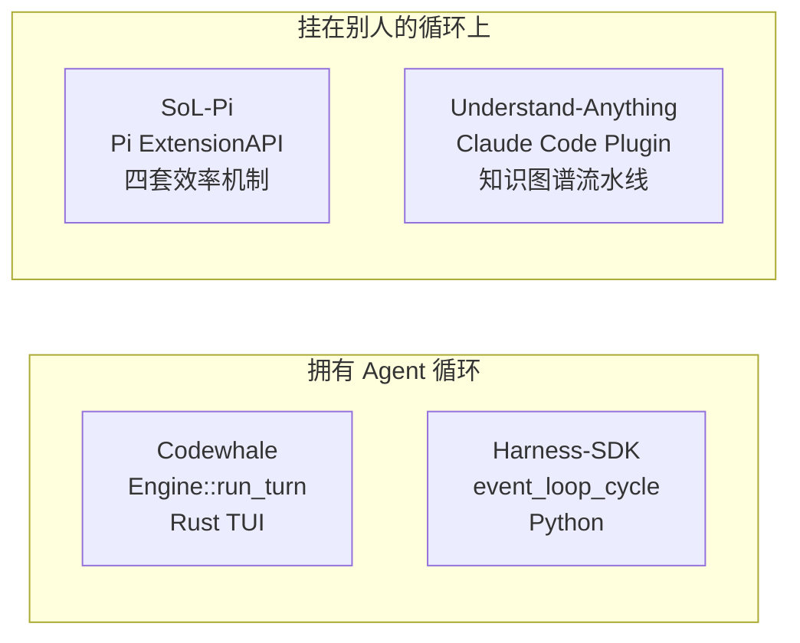

# 四项目架构对照：Codewhale · Harness-SDK · SoL-Pi · Understand-Anything

> 各项目仅保留 **README · ARCHITECTURE.md · DESIGN_THINKING_SERIES.md** 三文件；主文 **ARCHITECTURE.md** 已按 maf/opencode 体例加厚为 **约 4.8k–6k 行 / 21–27 万字符**（含 §0 导航、术语表、模块设计长文、多场景 E2E 状态叙述、源码索引/ADR）。  
> 跨仓库总索引：[CROSS_AGENT_DESIGN_INDEX.md](./CROSS_AGENT_DESIGN_INDEX.md)

| 项目 | 文档（每项目仅 3 个文件） |
|------|---------------------------|
| **Codewhale** | [README](./codewhale-architecture/README.md) · [**ARCHITECTURE.md**](./codewhale-architecture/ARCHITECTURE.md) · [DESIGN_THINKING](./codewhale-architecture/DESIGN_THINKING_SERIES.md) |
| **Harness-SDK（Python）** | [README](./harness-sdk-architecture/README.md) · [**ARCHITECTURE.md**](./harness-sdk-architecture/ARCHITECTURE.md) · [DESIGN_THINKING](./harness-sdk-architecture/DESIGN_THINKING_SERIES.md) |
| **SoL-Pi** | [README](./sol-pi-architecture/README.md) · [**ARCHITECTURE.md**](./sol-pi-architecture/ARCHITECTURE.md) · [DESIGN_THINKING](./sol-pi-architecture/DESIGN_THINKING_SERIES.md) |
| **Understand-Anything** | [README](./understand-anything-architecture/README.md) · [**ARCHITECTURE.md**](./understand-anything-architecture/ARCHITECTURE.md) · [DESIGN_THINKING](./understand-anything-architecture/DESIGN_THINKING_SERIES.md) |

主文档 **ARCHITECTURE.md** = 设计说明与模块走读；图解两层（各项目 `diagrams/`）：**[DIAGRAM_ATLAS.md](./codewhale-architecture/diagrams/DIAGRAM_ATLAS.md)**（全局 G/M）+ **[AGENT_MODULE_DIAGRAMS.md](./codewhale-architecture/diagrams/AGENT_MODULE_DIAGRAMS.md)**（逐 Agent 模块，可 `python3 docs/scripts/generate_agent_module_diagrams.py` 再生）。

---

## 1. 它们分别是什么

| | Codewhale | Harness-SDK (Py) | SoL-Pi | Understand-Anything |
|--|-----------|------------------|--------|---------------------|
| **产品形态** | 终端编码 Agent | 可嵌入的 SDK + 电池 Harness | Pi 扩展 | IDE 插件 + Dashboard |
| **语言** | Rust workspace | Python（另有 TS 同仓） | TypeScript | TypeScript |
| **谁跑 loop** | `Engine::run_turn`（tui crate） | `event_loop_cycle` | **Pi** | **宿主 IDE Agent** |
| **默认任务** | 读改跑仓库 | 任意工具 Agent | 少 token/少 turn | 把仓库编成图 |

---

## 2. 整体架构对照

```mermaid
flowchart TB
    subgraph CW["Codewhale"]
        C0["TUI / exec / Fleet"] --> C1["run_turn"]
        C1 --> C2["core request + execpolicy + tools"]
        C1 --> C3["session SQLite / checkpoint"]
    end
    subgraph HS["Harness-SDK Python"]
        H0["create_harness()"] --> H1["strands.Agent"]
        H1 --> H2["event_loop_cycle"]
        H2 --> H3["tools MCP memory session plugins"]
    end
    subgraph SP["SoL-Pi"]
        P0["Pi loop"] --> P1["ExtensionAPI"]
        P1 --> P2["Fusion / Pack / Reducer / Compact"]
    end
    subgraph UA["Understand-Anything"]
        U0["Skill /understand"] --> U1["scanner + file-analyzer"]
        U1 --> U2["KnowledgeGraph .ua/"]
        U2 --> U3["dashboard / chat / diff"]
    end
```

---

## 3. 循环与消息

| 阶梯 | Codewhale | Harness-SDK | SoL-Pi | UA |
|------|-----------|-------------|--------|-----|
| 外层 | 用户 Turn | invocation `agent()` | Pi session | Skill 流水线阶段 |
| 内层 | `run_turn` 模型↔工具 | `event_loop_cycle` + recurse | Pi turn；机制只挂钩 | 每个子 Agent 的宿主 loop |
| 模型可见必入账 | session log 可重建 | `agent.messages` + snapshot | Pack **只投影**不改历史 | 图 JSON，不是 chat log |
| 中途输入 | `pending_steers` 边界提交 | interrupt / cancel / 下一 invocation | 不实现；交给 Pi | 不实现；交给 IDE |
| 压缩 | compaction.rs + KV 冻结前缀 | ContextManager + Offloader | 触发 **Pi 原生** compact | 无对话压缩；增量指纹 |

---

## 4. 工具与权限

| | Codewhale | Harness-SDK | SoL-Pi | UA |
|--|-----------|-------------|--------|-----|
| 工具面 | 内置 + 延迟 schema + MCP | `@tool` + MCP + harness 内置 | **替换** Pi 的 edit/write；加 `obs_recall` `update_plan` | 捆绑 `scan-project.mjs` 等脚本，由子 Agent 调用 |
| 审批 | Ask / Auto-Review / Full Access + Plan 模式 | `interventions` ask/smart/Cedar | 沿用 Pi | 沿用宿主 |
| 沙箱 | Seatbelt / bwrap | SDK `sandbox`；Monty 跑 programmatic caller | Pi bash | 无独立沙箱 |
| 子 Agent | 唯一 `agent` 工具 → Runtime worker | `subagent` 同工厂；另有 Swarm/Graph | 无 | 流水线子 Agent，**禁止再委派** |

---

## 5. 实体密度（改代码时认这些名字）

| 项目 | 核心实体（摘） |
|------|----------------|
| Codewhale | Engine, TurnContext, Session, Thread, ToolExecutionPlan, ToolActivationCache, FrozenPrefix, PendingSteer, Runtime worker |
| Harness-SDK | Agent, event_loop_cycle, AgentResult, ToolRegistry, HookRegistry, SessionManager, MemoryManager, Plugin, ContextOffloader, Limits, Swarm/Graph |
| SoL-Pi | SolPiConfig, Observation, Ledger, ArchiveObject, ReducerReceipt, OnlineState, CompactionDecision, PlanStep, ThenRunInput |
| UA | KnowledgeGraph, GraphNode×27, GraphEdge×38, GraphBuilder, TreeSitterPlugin, StructuralAnalysis, AnalysisMeta, FingerprintStore |

完整类图见各项目 Part 1。

---

## 6. 一条「修失败测试」会怎么走

同一句话 *Fix the failing tests*：

**Codewhale** `codewhale exec "…"` → `run_turn` → bash pytest → 审批 → edit → LSP diagnostics → 终稿；全程一条 Engine。

**Harness** `create_harness(); agent("…")` → cycle1 shell pytest → offload 大栈 → cycle2 edit → todos 清单 → `end_turn`；session 默认新 id。

**SoL-Pi**（四开）Pi 模型 `edit`+`then_run pytest` 一次往返；长日志或经 Reducer 成可核验收据；大观察第三次起变 `obs_*`；计划步完成才考虑 compact。

**UA** 这句话 **不会**去修测试。应走 `/understand-diff` 或 chat：「测试失败会碰到哪些节点」——前提是已经 `/understand` 建过图。

---

## 7. 核心 vs 边界（别把扩展写进内核）

| 项目 | 内核（不要复制第二份） | 边界 |
|------|------------------------|------|
| Codewhale | 唯一 `turn_loop.rs` | Fleet 选人、Workflow JS、MCP 进程 |
| Harness-SDK | 唯一 `event_loop.py` | `create_harness` 默认工具/prompt、Exa、Cedar |
| SoL-Pi | 不拥有 loop；四机制正交 | 开关、reducer 模型、经济性比率 |
| UA | schema + tree-sitter + GraphBuilder | Agent 提示词、dashboard、wiki/Figma 流水线 |

---

## 8. 阅读顺序建议

1. 先读本页 §1–§3，分清「谁拥有循环」。  
2. 对号入座读该项目 **九幕**（约 20 分钟）。  
3. 要改代码：Part 2 示例 + Part 3 扩展点。  
4. SoL-Pi 先读 [Pi 架构](./pi-architecture/README.md)；Harness 可与 [maf-agent](./maf-agent/docs/README.md) 的 `agent.run` 对照（都是 SDK 内 tool loop）。
