# GenericAgent 系统设计文档

> 版本：2.2 | 最后更新：2026-06  
> 适用源码：GenericAgent main (v1.0+)

**读不懂 L0–L4 / 自我进化？** 请先读 **[MEMORY_EVOLUTION_QUICKSTART.md](./MEMORY_EVOLUTION_QUICKSTART.md)**（带 gbrain 安装端到端例子），再回本文 §2.3。

---

## 0. 阅读指南（建议顺序）

主文档按「概述 → 哲学 → 架构 → 模块 → 记忆实现 → 多 Agent → 链路」组织，**不必从头到尾线性读**。

| 你的目标 | 建议路径 |
|----------|----------|
| **搞懂自我进化 + L0–L4** | [MEMORY_EVOLUTION_QUICKSTART.md](./MEMORY_EVOLUTION_QUICKSTART.md) → §2.3 → §4.7 → §5 |
| **搞懂三种运行模式 / Task I/O** | §2.2（全文在此，与 L1–L4 无关）→ §6.2 |
| **搞懂 Loop / ReAct** | §4.1 → §10 |
| **搞懂 Prompt 拼装** | §4.8 |
| **查实现与类图** | §3 → §4 → §13 附录 |

**易混对照（一句话）**

| 概念 A | 概念 B | 区别 |
|--------|--------|------|
| Working `key_info` | L2 `global_mem.txt` | 前者仅当前任务；后者跨会话环境事实 |
| `temp/task/output.txt` | L3 `memory/*_sop.md` | 前者父子进程信箱；后者长期 SOP |
| §7 对话压缩 | §5 记忆压缩 | 前者裁聊天 history；后者控 L1 行数 / L4 归档 |

---

## 目录

0. [阅读指南](#0-阅读指南建议顺序) · [记忆速读（独立文档）](./MEMORY_EVOLUTION_QUICKSTART.md)
1. [系统概述](#1-系统概述)
2. [设计哲学与运行模式](#2-设计哲学与运行模式)
   - 2.2 [运行模式与 Task I/O 白话说明](#22-运行模式deployment-profiles)
   - 2.3 [自我进化与 L0–L4 记忆](#23-自我进化设计原理)
3. [架构设计](#3-架构设计)
   - 3.1 [C4 上下文与容器视图](#31-c4-上下文与容器视图)
   - 3.2 [逻辑分层与模块依赖](#32-逻辑分层与模块依赖)
   - 3.3 [模块职责矩阵](#33-模块职责矩阵)
   - 3.4 [核心类图](#34-核心类图)
4. [核心模块设计](#4-核心模块设计)
   - 4.1 [Agent Loop 引擎（核心）](#41-agent-loop-引擎核心)
   - 4.2 [LLM Core 与 Session](#42-llm-core-与-session)
   - 4.3 [工具层 GenericAgentHandler](#43-工具层-genericagenthandler)
   - 4.4 [三层协作：Handler / ToolClient / Session.backend 职责划分](#44-三层协作handler--toolclient--sessionbackend-职责划分)
   - 4.5 [浏览器 CDP 与 DOM](#45-浏览器-cdp-与-dom)
   - 4.6 [分层记忆（概要）](#46-分层记忆概要)
   - 4.7 [Plugin Hook](#47-plugin-hook)
   - 4.8 [运行时 Prompt 完整拼装（中文）](#48-运行时-prompt-完整拼装中文)
5. [记忆体系架构与压缩](#5-记忆体系架构与压缩)
6. [多 Agent 协作模式](#6-多-agent-协作模式)
7. [对话上下文压缩（Session 侧）](#7-对话上下文压缩session-侧)
8. [前端交互与通信协议](#8-前端交互与通信协议)
9. [全链路端到端流程](#9-全链路端到端流程)
10. [单轮 ReAct 时序（Loop 内核）](#10-单轮-react-时序loop-内核)
11. [关键数据流向](#11-关键数据流向)
12. [UI 选型说明](#12-ui-选型说明)
13. [附录：文件索引](#13-附录文件索引)

---

## 1. 系统概述

**GenericAgent** 是一个极简、自驱、可自进化的自主 Agent 框架。核心约 **3K 行** Python（`agent_loop.py` + `agentmain.py` + `ga.py` 主干），通过 **9 个原子工具** 与约 **100 行** 的 `agent_runner_loop`，让任意 LLM 能操作：

- 本地终端（`code_run`）
- 文件系统（`file_read` / `file_patch` / `file_write`）
- 真实浏览器（`web_scan` / `web_execute_js`，CDP 桥接）
- 可选 ADB 移动端（`memory/adb_ui.py` 等）

成功轨迹可沉淀为 **L1–L4 分层记忆**（Markdown/文本），实现「无行动验证，不记忆」的自我进化。

**代码入口**

| 入口 | 文件 | 说明 |
|------|------|------|
| 交互 CLI | `agentmain.py` | `put_task` + 后台 `run()` 线程 |
| 一次性子任务 | `agentmain.py --task DIR` | 文件 IO 驱动 Subagent |
| 反射监控 | `agentmain.py --reflect SCRIPT` | `check()` 周期触发 |
| 前端 | `frontends/*` | TUI / Streamlit / IM Bot / Desktop |

---

## 2. 设计哲学与运行模式

### 2.1 核心原则

* **Don't preload skills, evolve them**：只给原子工具；SOP/技能由执行验证后写入 `memory/`。
* **No Execution, No Memory**：未经验证的信息不得进入 L2/L3。
* **Minimum Sufficient Pointer**：L1 索引 ≤30 行，只放指针。
* **零向量库依赖**：记忆全是文本，用 `file_patch` 维护。

### 2.2 运行模式（Deployment Profiles）

同一套 `agentmain.py` 可按启动方式变成三种「部署形态」——不是三个独立产品，而是**同内核、不同协作边界**。

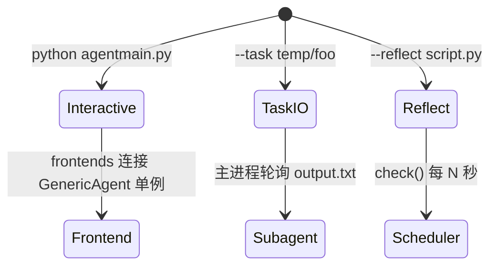
```mermaid
stateDiagram-v2
    [*] --> Interactive: python agentmain.py
    [*] --> TaskIO: --task temp/foo
    [*] --> Reflect: --reflect script.py
    Interactive --> Frontend: frontends 连接 GenericAgent 单例
    TaskIO --> Subagent: 主进程轮询 output.txt
    Reflect --> Scheduler: check() 每 N 秒
```

| 模式 | 触发 | `task_dir` | 流式 | 典型用途 |
|------|------|------------|------|----------|
| **Interactive** | `put_task` / CLI 输入 | `None` | 是 | TUI、IM、Desktop |
| **Task I/O** | `--task name` | `temp/{name}/` | 否（`force_non_stream`） | Subagent、Plan 探索子进程、Supervisor 监工 |
| **Reflect** | `--reflect mod.py` | `None` | 否 | 定时巡检、BBS 抢单、Goal 自驱、L4 归档 |

#### 2.2.1 三种模式分别是什么？

| 模式 | 一句话 |
|------|--------|
| **Interactive** | 你平时聊天：一个问题进 `task_queue`，一个 Agent 在**当前窗口**里 ReAct，用 `display_queue` 流式回显。 |
| **Task I/O** | **再开一个子进程**跑 Agent，父子不靠共享聊天历史，靠 **`temp/任务名/` 里的文件**传话（信箱协议）。 |
| **Reflect** | 主进程几乎不聊天；每隔 N 秒执行 `reflect/xxx.py` 的 `check()`，有返回值才 `put_task` 唤醒 Agent。 |

**和日常用的关系**：只开 TUI/CLI 对话 → 几乎总是 **Interactive**，不会出现 `temp/xxx/input.txt`。只有主 Agent 在工具里执行 `python agentmain.py --task xxx`（或 Plan/Supervisor 流程）时，才会看到 Task I/O 目录。

#### 2.2.2 Task I/O 是什么？（I/O = 用文件当信箱）

**Task** = 一个具名任务目录 `temp/{name}/`。  
**I/O** = Input/Output 都通过**磁盘文件**完成，不用 WebSocket、不共享父进程的 `llmclient.history`。

主 Agent（或你手动）典型步骤：

1. 创建 `temp/my_job/`，写入 `input.txt`（任务说明）  
2. 启动子进程：`python agentmain.py --task my_job`（常加 `--verbose` 便于主进程读工具细节）  
3. 主进程**轮询** `output*.txt`，必要时写入纠偏文件  
4. 子进程内部跑完整 `agent_runner_loop`，每轮末尾写 `outputN.txt` 并标记 `[ROUND END]`  
5. 主进程读最终结果，继续自己的任务或结束  

源码入口：`agentmain.py` 中 `if args.task:` 分支；`handler.parent.task_dir` 指向该目录时，`turn_end_callback` 会 `consume_file` 读取 `_intervene` / `_keyinfo`。

#### 2.2.3 目录约定与分工

以 `temp/my_job/` 为例：

| 文件 | 谁写入 | 谁读取 | 作用 |
|------|--------|--------|------|
| `input.txt` | 主 Agent / 用户 | 子进程首轮 | 子 Agent 的任务说明 |
| `output.txt`, `output1.txt`… | 子进程每轮结束 | 主 Agent 轮询 | 子 Agent 的流式汇总 + `[ROUND END]` 分隔 |
| `reply.txt` | 主 Agent | 子进程（读后删除） | 给子 Agent 的**下一轮**新指令 |
| `_intervene` | 主 Agent | 子进程 `turn_end_callback` | 纠偏话术，拼进 `next_prompt`（如「别跳步」） |
| `_keyinfo` | 主 Agent | 子进程 | 注入 `working['key_info']`（补充上下文） |
| `_stop` | 主 Agent | 子进程 / 主进程检测 | 请求中止；主进程也可 `abort()` |
| `_history.json` | 主 Agent（可选） | 子进程启动时 | 恢复 `llmclient.backend.history`，接着上次聊 |

```text
temp/my_job/
  input.txt
  output.txt          # 第 1 轮结束
  output1.txt         # 第 2 轮 …
  reply.txt           # 主 → 子（一次性）
  _intervene          # 主 → 子（可多次写，按 consume 语义消费）
  _keyinfo
  _stop
  _history.json       # 可选
```

#### 2.2.4 协作时序（信箱模型）

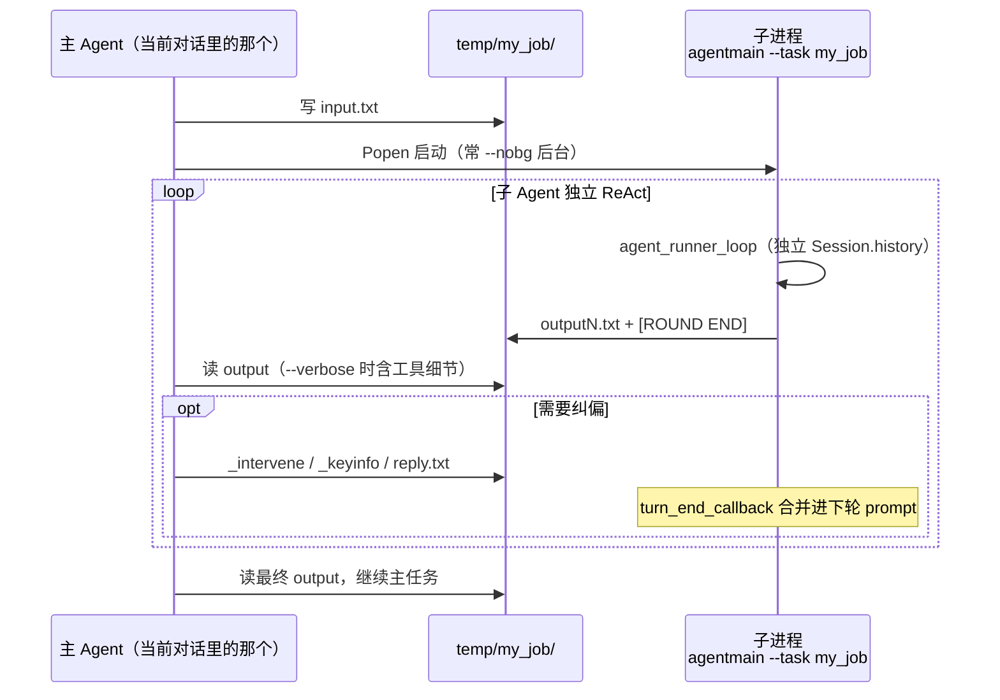
```mermaid
sequenceDiagram
    participant 主 as 主 Agent（当前对话里的那个）
    participant 盘 as temp/my_job/
    participant 子 as 子进程<br/>agentmain --task my_job

    主->>盘: 写 input.txt
    主->>子: Popen 启动（常 --nobg 后台）
    loop 子 Agent 独立 ReAct
        子->>子: agent_runner_loop（独立 Session.history）
        子->>盘: outputN.txt + [ROUND END]
        主->>盘: 读 output（--verbose 时含工具细节）
        opt 需要纠偏
            主->>盘: _intervene / _keyinfo / reply.txt
            Note over 子: turn_end_callback 合并进下轮 prompt
        end
    end
    主->>盘: 读最终 output，继续主任务
```

#### 2.2.5 为什么要 Task I/O？（设计动机）

| 动机 | 说明 |
|------|------|
| **上下文隔离** | 子进程有独立 `backend.history`；探索网页、读大仓库不会撑爆主对话（Plan/Supervisor 依赖此点）。 |
| **可监察** | 主 Agent 像监工：读 `output.txt`，写 `_intervene`，不必在同一聊天窗里挤工具日志。 |
| **实现极简** | 仅需 `subprocess` + 文件名约定，无需多 Agent SDK。 |
| **与 Reflect 复用** | BBS Worker、定时任务等唤醒的 Agent 同样可 `--task`，协议统一。 |

#### 2.2.6 与长期记忆（L1–L4）的区别

| | Task I/O `temp/{task}/` | L1–L4 `memory/` |
|---|------------------------|-----------------|
| 生命周期 | 单次子任务，结束可删 | 跨会话长期保留 |
| 目的 | 父子进程**传话** | **进化**（下次 Prompt 更聪明） |
| 是否注入 Prompt | 否（仅子进程读文件） | L1/L2 默认注入，见 §2.3 |

多 Agent 协作细节（Supervisor、Plan、BBS 等）见 **[§6 多 Agent 协作模式](#6-多-agent-协作模式)**。

**一句话**：Task I/O = 子 Agent 与主 Agent 之间用 `temp/{任务名}/` 里约定文件名协作的**信箱协议**；不是你日常必须配置的目录，而是**派生子任务时自动生成的工作区**。

---

### 2.3 自我进化设计原理

> **速读**：带完整故事的例子见 **[MEMORY_EVOLUTION_QUICKSTART.md](./MEMORY_EVOLUTION_QUICKSTART.md)**。本节是设计文档内的展开版。

#### 2.3.0 L0–L4 是什么？（白话 + 设计意图）

记忆不是数据库，而是 **`memory/` 目录下的普通文本文件**。分层是为了：**省 token、防写乱、能进化**。

用**图书馆**类比：

| 层 | 文件 | 类比 | 每次对话会不会自动塞进 Prompt？ | 作用一句话 |
|----|------|------|--------------------------------|------------|
| **L0** | `memory_management_sop.md` | 图书馆**编目规范** | 否（只有「要写记忆」时才读） | 规定什么能写、写哪一层、怎么改文件 |
| **L1** | `global_mem_insight.txt` | **一楼索引牌**（≤30 行） | **是**，每次对话开头必带 | 用关键词告诉你「去哪找」，不写具体步骤 |
| **L2** | `global_mem.txt` | **事实档案柜** | **是**（经 L1 指路；结构说明在 assets） | 存环境事实：路径、账号约定、固定配置 |
| **L3** | `memory/*.md` / `*.py` | **专题书架**（每任务一本 SOP 或脚本） | **否**，需要时 `file_read` | 存某类任务的踩坑步骤、可复用脚本 |
| **L4** | `memory/L4_raw_sessions/` | **地下室档案**（旧对话摘要） | 否，按需查阅 | 历史会话压缩归档，方便以后翻旧账 |

另外还有 **Working memory**（`key_info` / `history_info`），在内存里、每轮注入，**不算 L1–L4**：只管**当前这一次任务**，关机就淡掉，不写进 `global_mem`。

**为什么分五层？（设计动机）**

1. **上下文很贵**：若把所有 SOP 全文每次塞进 Prompt，几万 token 瞬间爆掉 → 所以 **L1 只放索引**（≤30 行），L3 正文按需读。
2. **不能瞎记**：模型爱「想当然」→ **L0 公理**「无行动验证，不记忆」：没跑通工具的结果不准进 L2/L3。
3. **要能改、能进化**：不用向量库，Agent 用 `file_patch` 自己改 Markdown → 验证成功的经验**越积越多**。
4. **事实和套路分开**：「API 在 8080」进 L2；「装 gbrain 要先装 bun」进 L3 的 `xxx_sop.md` → 分类清晰，L1 用一行指针串起来。

**各层写什么、不写什么（举例）**

| 层 | 适合写 | 禁止写 |
|----|--------|--------|
| L1 | `plan_sop`、关键词 `浏览器上传`、RULES「禁杀 python」 | 安装命令步骤、长段落教程 |
| L2 | `## GitHub Token` 在 `~/.config/...`、项目用 uv 管理依赖 | 今天日期、当前 PID、未验证的猜测 |
| L3 | `web_setup_sop.md` 里 5 条踩坑、 `ocr_utils.py` 封装调用 | 通用常识「Python 用 pip」 |
| L4 | 「2026-05-01 会话：讨论了 gbrain 安装失败原因…」摘要 | 一般不手改，由后台压缩生成 |

**L1 与 L2 的分工（易混点）**

- **L1** 只写「叫什么、什么关键词触发」，例如一行 `tmwebdriver_sop(浏览器上传)` 或 RULES 里「禁无条件杀 python」。  
- **L2** 才写「具体是什么」，例如 `## API Keys` 下写「OpenRouter key 在 `~/.hermes/.env`」。  
- 模型**每次**先看到 L1；只有任务相关时，才按 L1 指针去 `file_read` L2 段落或 L3 全文。  
- 仓库现状：`global_mem_insight.txt` 通常已有 L3 文件名列表；`global_mem.txt` 可能仍为空——表示环境事实尚未沉淀，属正常。

**要解决的设计问题（为何不用「一个大 memory.md」）**

| 问题 | 设计对策 |
|------|----------|
| 上下文有限，无法每次塞入全部 SOP | L1 极短索引 + L3 按需 `file_read` |
| 模型倾向记录未验证的猜测 | L0 公理「无行动验证，不记忆」+ 只 `file_patch` |
| 环境事实与操作流程混杂 | L2 存「是什么」，L3 存「怎么做」 |
| 跨会话要变聪明 | 成功任务 → `start_long_term_update` → 改 L2/L3 + 同步 L1 一行 |

**L0–L4 与 Prompt / Working 的关系（数据流）**

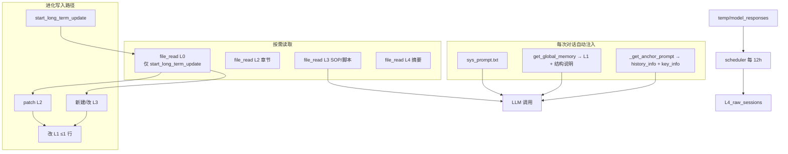
```mermaid
flowchart TB
    subgraph Inject["每次对话自动注入"]
        SP[sys_prompt.txt]
        GM[get_global_memory → L1 + 结构说明]
        WM每轮[_get_anchor_prompt → history_info + key_info]
    end

    subgraph OnDemand["按需读取"]
        L0read[file_read L0<br/>仅 start_long_term_update]
        L2read[file_read L2 章节]
        L3read[file_read L3 SOP/脚本]
        L4read[file_read L4 摘要]
    end

    subgraph Write["进化写入路径"]
        U[start_long_term_update]
        U --> L0read
        L0read --> PatchL2[patch L2]
        L0read --> PatchL3[新建/改 L3]
        PatchL2 --> SyncL1[改 L1 ≤1 行]
        PatchL3 --> SyncL1
    end

    SP --> LLM[LLM 调用]
    GM --> LLM
    WM每轮 --> LLM
    L3read --> LLM

    Logs[temp/model_responses] --> Cron[scheduler 每 12h]
    Cron --> L4dir[L4_raw_sessions]
```

更细的架构图、三套压缩（L1 行数 / L4 归档 / Working 折叠）、L1↔L2/L3 同步表见 **[§5 记忆体系架构与压缩](#5-记忆体系架构与压缩)**。

#### 2.3.1 「进化」在说什么？

GenericAgent 的「进化」**不是**在线改模型权重，而是 **把验证过的行动轨迹写入可编辑的文本记忆**，下次启动时通过 Prompt 注入，使模型少走弯路。

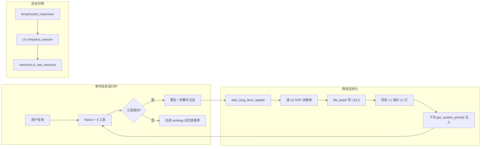
```mermaid
flowchart LR
    subgraph Runtime["单次任务运行时"]
        A[用户任务] --> B[ReAct + 9 工具]
        B --> C{工具成功?}
        C -->|是| D[事实 / 步骤可沉淀]
        C -->|否| E[仅进 working 记忆或丢弃]
    end

    subgraph Evolution["跨会话进化"]
        D --> F[start_long_term_update]
        F --> G[读 L0 SOP 决策树]
        G --> H[file_patch 写 L2/L3]
        H --> I[同步 L1 指针 ≤1 行]
        I --> J[下次 get_system_prompt 注入]
        J --> B
    end

    subgraph Archive["后台归档"]
        K[temp/model_responses] --> L[L4 compress_session]
        L --> M[memory/L4_raw_sessions]
    end
```

| 阶段 | 机制 | 设计意图 |
|------|------|----------|
| **短期** | `history_info` + `<summary>` + `update_working_checkpoint` | 单任务内防遗忘，不污染长期库 |
| **长期** | L2 事实 + L3 SOP/脚本 + L1 索引 | 跨任务复用，靠指针控制 token |
| **元规则** | L0 `memory_management_sop.md` | 约束「什么能写、写哪层、怎么 sync」 |
| **归档** | L4 + `scheduler` 定时 `compress_session` | 原始对话蒸馏，可检索历史上下文 |

**进化闭环（必须同时满足）**

1. **行动验证**：只有工具返回成功、或 `file_read` 确认存在的内容才能进 L2/L3（L0 公理：No Execution, No Memory）。
2. **最小写入**：优先 `file_patch` 局部改，禁止 `code_run` 覆写整个记忆文件。
3. **索引同步**：L2/L3 新增场景时，L1 只加**一行关键词或文件名**，禁止把 How-to 塞进 L1。
4. **主动结算**：复杂任务（15+ 轮）或 agent 判断「值得记住」时调用 `start_long_term_update`，由模型按 L0 决策树分类写入。
5. **不存易变态**：PID、临时 URL、当前时间等只进 working memory，不进 L1/L2/L3。

**与「预置 Skill」框架的差异**：不内置上百个 skill 包；能力来自 **L3 里 agent 自己写下的 SOP** 和 **可执行 `.py` 脚本**，发现路径靠 L1 触发词。

#### 2.3.2 进化示例（端到端故事）

以「首次在本机安装 gbrain」为例，说明 L 层如何配合（与 §2.2 Task I/O 无关，这是**跨会话**记忆）：

| 步骤 | 发生什么 | 涉及层级 |
|------|----------|----------|
| 1 | 用户在 TUI 说「安装 gbrain」 | Interactive，无 `temp/` 信箱 |
| 2 | Agent `code_run` / `file_read` 试安装，某条命令成功 | 仅 **Working** `key_info` 记进度 |
| 3 | 任务完成，Agent 调用 `start_long_term_update` | 触发读 **L0** 决策树 |
| 4 | 判定「安装命令序列」属任务经验 | 新建 **L3** `gbrain_install_sop.md`（精简踩坑，非教程） |
| 5 | 判定「bun 二进制路径」已验证 | **patch L2** 一小节 |
| 6 | 在 **L1** 增加一行：`gbrain_install_sop(gbrain安装)` | 仅索引，不写步骤 |
| 7 | 一周后新对话提到 gbrain | **L1** 已在 Prompt 里 → Agent `file_read` L3，跳过重复试错 |

若安装**未**跑通工具验证，按 L0 不得写入 L2/L3，最多留在当次 **Working**，关会话即失效。

#### 2.3.3 短期 vs 长期（对照表）

| 记忆 | 存储位置 | 生命周期 | 进 Prompt 方式 |
|------|----------|----------|----------------|
| `<summary>` 行 | `history_info` | 当前任务 | 每轮 `turn_end_callback` → anchor |
| `key_info` | `handler.working` | 当前任务，可跨轮 | `_get_anchor_prompt` |
| L1 | `global_mem_insight.txt` | 永久 | `get_system_prompt()` |
| L2 | `global_mem.txt` | 永久 | 结构说明 + 按需 read |
| L3 | `memory/*` | 永久 | L1 触发后 `file_read` |
| L4 | `L4_raw_sessions/` | 永久归档 | 一般不注入，按需查 |

---

## 3. 架构设计

### 3.1 C4 上下文与容器视图

**系统上下文（谁在用）**

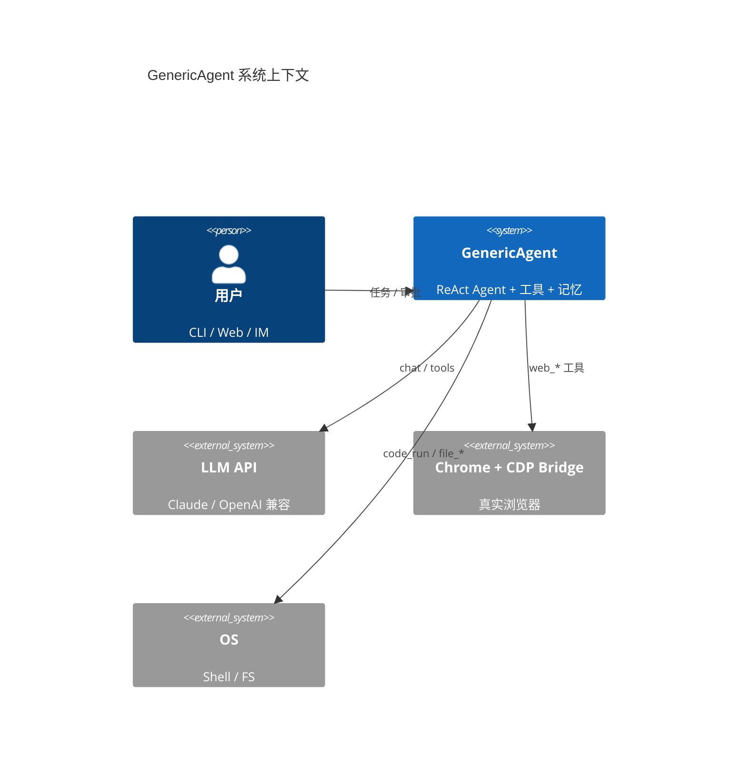
```mermaid
C4Context
    title GenericAgent 系统上下文
    Person(user, "用户", "CLI / Web / IM")
    System(ga, "GenericAgent", "ReAct Agent + 工具 + 记忆")
    System_Ext(llm, "LLM API", "Claude / OpenAI 兼容")
    System_Ext(browser, "Chrome + CDP Bridge", "真实浏览器")
    System_Ext(os, "OS", "Shell / FS")
    Rel(user, ga, "任务 / 审批")
    Rel(ga, llm, "chat / tools")
    Rel(ga, browser, "web_* 工具")
    Rel(ga, os, "code_run / file_*")
```

**容器视图（进程内模块）**

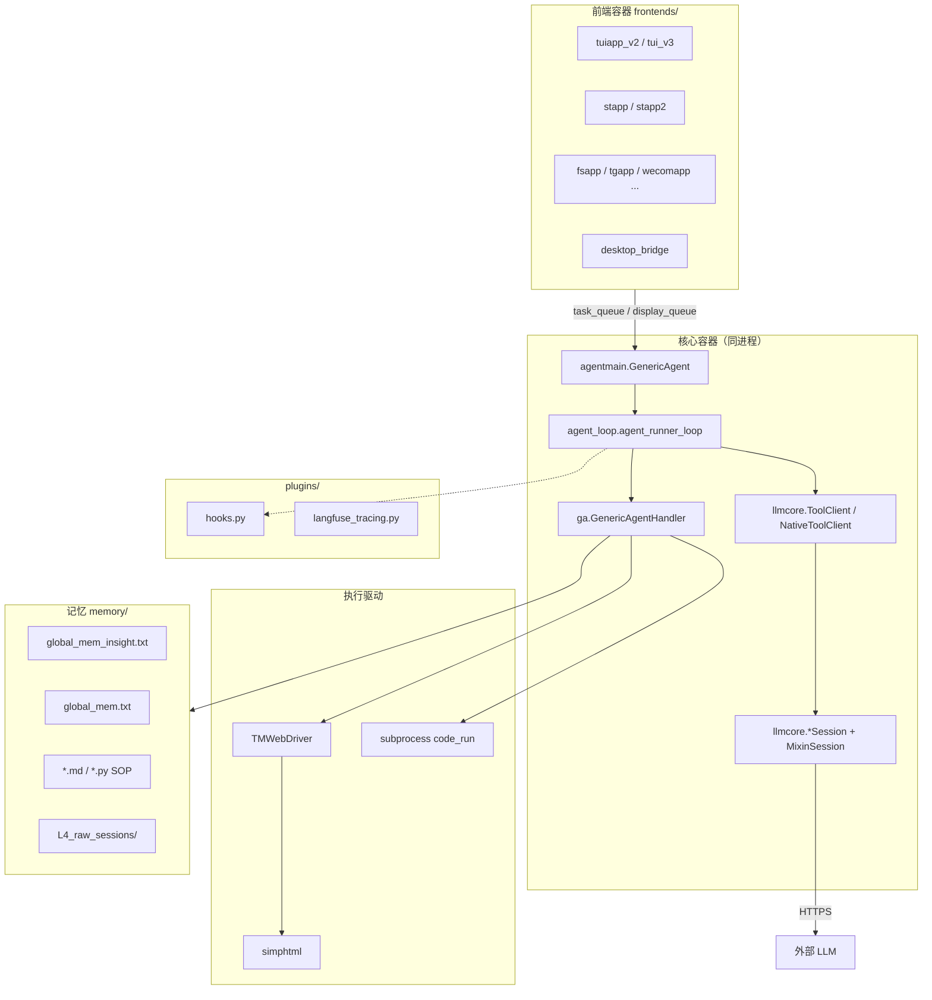
```mermaid
flowchart TB
    subgraph FE["前端容器 frontends/"]
        TUI[tuiapp_v2 / tui_v3]
        ST[stapp / stapp2]
        IM[fsapp / tgapp / wecomapp ...]
        DB[desktop_bridge]
    end

    subgraph CORE["核心容器（同进程）"]
        AM[agentmain.GenericAgent]
        AL[agent_loop.agent_runner_loop]
        GA[ga.GenericAgentHandler]
        LC[llmcore.ToolClient / NativeToolClient]
        SE[llmcore.*Session + MixinSession]
    end

    subgraph EXEC["执行驱动"]
        TM[TMWebDriver]
        SH[simphtml]
        SP[subprocess code_run]
    end

    subgraph MEM["记忆 memory/"]
        L1[global_mem_insight.txt]
        L2[global_mem.txt]
        L3[*.md / *.py SOP]
        L4[L4_raw_sessions/]
    end

    subgraph PLG["plugins/"]
        HK[hooks.py]
        LF[langfuse_tracing.py]
    end

    FE -->|task_queue / display_queue| AM
    AM --> AL
    AL --> GA
    AL --> LC
    LC --> SE
    GA --> TM
    GA --> SP
    TM --> SH
    GA --> MEM
    AL -.-> HK
    SE -->|HTTPS| LLM_EXT[外部 LLM]
```

### 3.2 逻辑分层与模块依赖

```
┌─────────────────────────────────────────────────────────────┐
│ L0  Presentation     frontends/*, launch.pyw, hub.pyw      │
├─────────────────────────────────────────────────────────────┤
│ L1  Orchestration    agentmain.py (队列、Prompt、Session池)   │
├─────────────────────────────────────────────────────────────┤
│ L2  Agent Runtime    agent_loop.py (ReAct 循环)              │
│                      ga.py (工具 + turn_end_callback)        │
├─────────────────────────────────────────────────────────────┤
│ L3  LLM Adapter      llmcore.py (Session/Client/裁剪/降级)   │
├─────────────────────────────────────────────────────────────┤
│ L4  Drivers          TMWebDriver, simphtml, subprocess, adb  │
├─────────────────────────────────────────────────────────────┤
│ L5  Cross-cutting    plugins/hooks, memory/, assets/         │
└─────────────────────────────────────────────────────────────┘

依赖方向（只允许向下）:
  frontends → agentmain → agent_loop → {ga, llmcore}
  ga → {TMWebDriver, memory/, subprocess}
  llmcore → requests / anthropic SDK（Native*）
  agent_loop → plugins.hooks（可选）
```

### 3.3 模块职责矩阵

| 模块 | 路径 | 职责 | 上游依赖 | 下游被谁调 |
|------|------|------|----------|------------|
| **GenericAgent** | `agentmain.py` | 任务队列、`get_system_prompt()`、LLM 热重载、`put_task`/`run` | `llmcore`, `agent_loop`, `ga` | 所有 frontends |
| **agent_runner_loop** | `agent_loop.py` | ReAct while 循环、工具分发、`StepOutcome` | `llmcore`(经 client)、`ga` handler | `agentmain.run` |
| **GenericAgentHandler** | `ga.py` | 9+1 工具、`turn_end_callback`、工作记忆 | `TMWebDriver`, `memory/` | `agent_loop.dispatch` |
| **ToolClient** | `llmcore.py` | 协议 Prompt、`<tool_use>` 解析、流式 | `BaseSession` | `agent_loop` |
| **NativeToolClient** | `llmcore.py` | 原生 function calling API | `Native*Session` | `agent_loop` |
| **MixinSession** | `llmcore.py` | 多节点 Failover / Spring-back | 多个 Session | `ToolClient.backend` |
| **TMWebDriver** | `TMWebDriver.py` | WS:18765 + HTTP:18766 双通道 | 浏览器扩展 | `ga.do_web_*` |
| **simphtml** | `simphtml.py` | DOM 提纯、列表折叠 | — | `web_scan` |
| **hooks** | `plugins/hooks.py` | 事件总线 | — | `agent_loop`, `ga` |
| **reflect/** | `reflect/*.py` | Goal Hive、scheduler、checklist | `agentmain --task` | 运维脚本 |
| **frontends** | `frontends/*` | UI + `display_queue` 消费 | `agentmain` | 用户 |

**九项对外工具**（`assets/tools_schema.json`）：

| 工具 | 物理效果 |
|------|----------|
| `code_run` | `subprocess` 执行 Python/PowerShell |
| `file_read` | 读文件，可选 keyword 搜索 |
| `file_patch` | 唯一匹配替换 |
| `file_write` | 写/追加；大内容走 `<file_content>` |
| `web_scan` | CDP 取页 + simphtml 提纯 |
| `web_execute_js` | 页内执行 JS，可切 Tab |
| `update_working_checkpoint` | `handler.working` 短期记忆 |
| `ask_user` | `should_exit=True`，等待用户 |
| `start_long_term_update` | 触发 L0 引导的长期记忆结算 |

引擎内置（不在 schema）：`no_tool`、`bad_json`。

### 3.4 核心类图

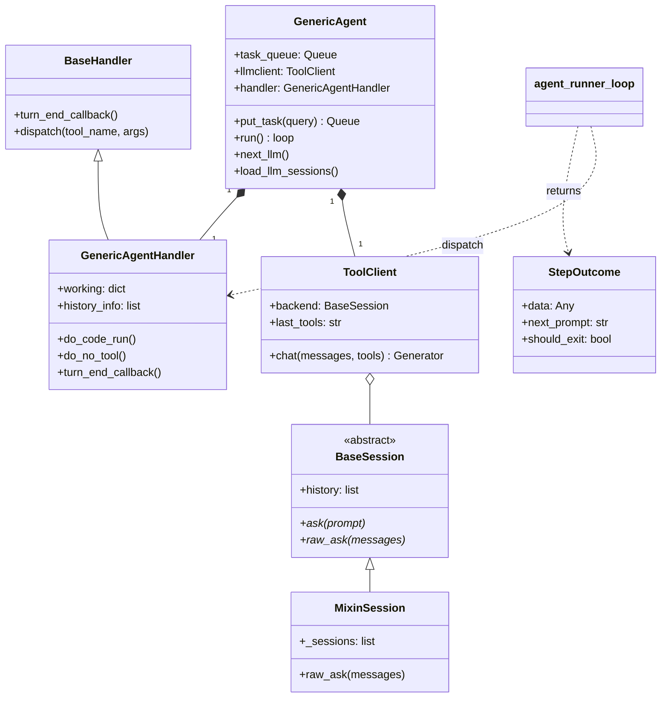
```mermaid
classDiagram
    class GenericAgent {
        +task_queue: Queue
        +llmclient: ToolClient
        +handler: GenericAgentHandler
        +put_task(query) Queue
        +run() loop
        +next_llm()
        +load_llm_sessions()
    }

    class BaseHandler {
        +turn_end_callback()
        +dispatch(tool_name, args)
    }

    class GenericAgentHandler {
        +working: dict
        +history_info: list
        +do_code_run()
        +do_no_tool()
        +turn_end_callback()
    }

    class StepOutcome {
        +data: Any
        +next_prompt: str
        +should_exit: bool
    }

    class ToolClient {
        +backend: BaseSession
        +last_tools: str
        +chat(messages, tools) Generator
    }

    class BaseSession {
        <<abstract>>
        +history: list
        +ask(prompt)*
        +raw_ask(messages)*
    }

    class MixinSession {
        +_sessions: list
        +raw_ask(messages)
    }

    GenericAgent "1" *-- "1" GenericAgentHandler
    GenericAgent "1" *-- "1" ToolClient
    BaseHandler <|-- GenericAgentHandler
    ToolClient o-- BaseSession
    BaseSession <|-- MixinSession
    agent_runner_loop ..> StepOutcome : returns
    agent_runner_loop ..> GenericAgentHandler : dispatch
```

---

## 4. 核心模块设计

### 4.1 Agent Loop 引擎（核心）

**源文件**：`agent_loop.py`（~130 行，全框架最关键路径）

#### 4.1.1 职责边界

| 组件 | 负责 | 不负责 |
|------|------|--------|
| `agent_runner_loop` | 轮次控制、调用 LLM、解析 tool_calls、收集 `StepOutcome`、拼装下轮 `messages` | 工具副作用、Prompt 里的 L1/L2 |
| `GenericAgentHandler` | 工具实现、`turn_end_callback`、工作记忆 | Session.history 持久化 |
| `ToolClient` / Session | API 请求、history 追加、`trim_messages_history` | 业务逻辑 |

#### 4.1.2 控制原语：`StepOutcome`

```python
@dataclass
class StepOutcome:
    data: Any                      # 写入 tool_results（供下轮 LLM）
    next_prompt: Optional[str] = None   # 下轮 user 文本主体
    should_exit: bool = False      # True → 立即结束 loop（如 ask_user）
```

**Loop 终止条件（按优先级）**

| 条件 | 来源 | 结果 |
|------|------|------|
| `outcome.should_exit` | `ask_user` 等 | `exit_reason=EXITED`，break |
| `outcome.next_prompt is None` | `do_no_tool` 正常收尾 | `CURRENT_TASK_DONE`，break |
| `turn >= max_turns` | 默认 80 | `MAX_TURNS_EXCEEDED` |
| `next_prompts` 空且无 `_done_hooks` | 异常路径 | break |

> 注意：`next_prompt=""` 与 `None` 不同——空字符串仍会进入下轮；只有 **`None`** 才表示「本段任务结束」。

#### 4.1.3 核心 Loop 状态机

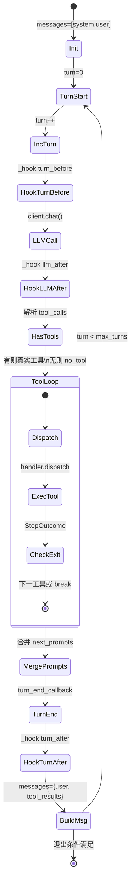
```mermaid
stateDiagram-v2
    [*] --> Init: messages=[system,user]
    Init --> TurnStart: turn=0

    TurnStart --> IncTurn: turn++
    IncTurn --> HookTurnBefore: _hook turn_before
    HookTurnBefore --> LLMCall: client.chat()
    LLMCall --> HookLLMAfter: _hook llm_after

    HookLLMAfter --> HasTools: 解析 tool_calls
    HasTools --> ToolLoop: 有则真实工具\n无则 no_tool

    state ToolLoop {
        [*] --> Dispatch
        Dispatch --> ExecTool: handler.dispatch
        ExecTool --> CheckExit: StepOutcome
        CheckExit --> [*]: 下一工具或 break
    }

    ToolLoop --> MergePrompts: 合并 next_prompts
    MergePrompts --> TurnEnd: turn_end_callback
    TurnEnd --> HookTurnAfter: _hook turn_after
    HookTurnAfter --> BuildMsg: messages={user, tool_results}

    BuildMsg --> TurnStart: turn < max_turns
    BuildMsg --> [*]: 退出条件满足
```

#### 4.1.4 Loop 伪代码（与源码一致）

```python
def agent_runner_loop(client, system_prompt, user_input, handler, tools_schema, max_turns=40, ...):
    messages = [system, user]
    turn = 0
    _hook('agent_before', ...)
    while turn < handler.max_turns:
        turn += 1
        if turn % 10 == 0:
            client.last_tools = ''   # 强制重发工具 schema

        _hook('turn_before', ...); _hook('llm_before', ...)
        response = yield from client.chat(messages, tools=tools_schema)
        _hook('llm_after', ...)

        tool_calls = parse(response) or [{'tool_name': 'no_tool', 'args': {}}]
        tool_results, next_prompts, exit_reason = [], set(), {}

        for tc in tool_calls:
            outcome = yield from handler.dispatch(tc['tool_name'], tc['args'], response)
            if outcome.should_exit:
                exit_reason = {'result': 'EXITED'}; break
            if outcome.next_prompt is None:
                exit_reason = {'result': 'CURRENT_TASK_DONE'}; break
            if outcome.data and tc['tool_name'] != 'no_tool':
                tool_results.append({...})
            next_prompts.add(outcome.next_prompt)

        if not next_prompts or exit_reason:
            if not handler._done_hooks or exit_reason.get('result') == 'EXITED':
                break
            next_prompts.add(handler._done_hooks.pop(0))

        next_prompt = handler.turn_end_callback(
            response, tool_calls, tool_results, turn,
            '\n'.join(next_prompts), exit_reason)

        _hook('turn_after', ...)
        # 仅发送增量；完整 history 在 Session.backend.history
        messages = [{"role": "user", "content": next_prompt, "tool_results": tool_results}]

    _hook('agent_after', ...)
    return exit_reason or {'result': 'MAX_TURNS_EXCEEDED'}
```

#### 4.1.5 `do_no_tool` 决策（无工具轮）

当模型未调用工具时，引擎**强制**走 `do_no_tool`：

1. 空响应 / 流中断 / `max_tokens` 截断 → 注入 `[System] ... Regenerate and tooluse`
2. Plan 模式声称完成但未 `[VERIFY]` → 打回
3. 单一大代码块无后续说明 → 要求改用 `code_run`/`file_write` 或补充文字
4. 否则 `next_prompt=None` → 结束 Loop

---

### 4.2 LLM Core 与 Session

**源文件**：`llmcore.py`

#### 双通道客户端

| 类型 | 工具协议 | Session 示例 |
|------|----------|--------------|
| **ToolClient** | 文本协议 `<tool_use>{json}</tool_use>` | `ClaudeSession`, `LLMSession` |
| **NativeToolClient** | OpenAI `tool_calls` | `NativeClaudeSession`, `NativeOAISession` |

`chat()` 流程（ToolClient）：

1. `_build_protocol_prompt`：system + 工具说明 + 历史 USER/ASSISTANT
2. `backend.ask(full_prompt)` 流式 yield
3. `_parse_mixed_response` → `Response(content, tool_calls, thinking)`

#### Session.history 与 Loop.messages 的关系

```
agent_runner_loop 每轮只传 messages=[{user, tool_results}]  # 增量
ToolClient/Session 在 raw_ask 内 merge 到 backend.history  # 全量
trim_messages_history / compress_history_tags 在 ask 前裁剪
```

#### MixinSession 容灾

- 主节点 429/5xx/流 `!!!Error:` → 轮换 `llm_nos`
- `spring_back` 秒后尝试回切主模型
- Prompt cache：`cache_control` 打在 system + 最后 2 条 user

---

### 4.3 工具层 GenericAgentHandler

**源文件**：`ga.py`

#### `turn_end_callback` 流水线（每轮必走）

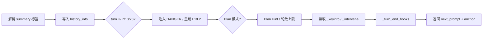
```mermaid
flowchart LR
    A[解析 summary 标签] --> B[写入 history_info]
    B --> C{turn % 7/10/75?}
    C --> D[注入 DANGER / 重载 L1/L2]
    D --> E{Plan 模式?}
    E --> F[Plan Hint / 轮数上限]
    F --> G[读取 _keyinfo / _intervene]
    G --> H[_turn_end_hooks]
    H --> I[返回 next_prompt + anchor]
```

`_get_anchor_prompt()` 在每轮 `next_prompt` 末尾注入：

- `<earlier_context>`：折叠 30 轮前的 `[Agent]` 摘要
- `<history>`：最近 30 条 `history_info`
- `<key_info>`：`working` 短期记忆

---

### 4.4 三层协作：Handler / ToolClient / Session.backend 职责划分

`agent_runner_loop` 的每次 ReAct 轮次中，**Handler、ToolClient、Session.backend** 形成一条清晰的分层调用链，每一层只关心一件事：

#### 4.4.1 各层职责一览

| 层 | 类 | 源文件 | 类比 | 一句话职责 |
|----|-----|--------|------|------------|
| **工具执行 + 短期记忆** | `GenericAgentHandler` | `ga.py` | 🖐 手 | 执行工具副作用、管理工作记忆、`turn_end_callback` 轮间状态 |
| **协议适配 + 工具解析** | `ToolClient` / `NativeToolClient` | `llmcore.py` | 🗣 嘴 | 拼 Prompt、解析 LLM 输出中的工具调用、流式封装 |
| **API 通信 + 历史管理** | `BaseSession` / `MixinSession` | `llmcore.py` | 👂 耳 | 发 HTTP/SSE 请求、维护完整 history、裁剪超长历史、多节点容灾 |

#### 4.4.2 Handler —— 手与短期大脑

| 职责 | 具体内容 |
|------|----------|
| **9+1 工具实现** | `code_run`、`file_read`、`file_patch`、`file_write`、`web_scan`、`web_execute_js`、`update_working_checkpoint`、`ask_user`、`start_long_term_update` + 内置 `no_tool` |
| **工作记忆管理** | 维护 `working`（key_info）、`history_info`（摘要列表），每轮通过 `_get_anchor_prompt()` 注入到下轮 prompt |
| **`turn_end_callback`** | 每轮结束必走的流水线：解析 summary → 写 history_info → 周期性注入 DANGER/重载 L1-L2 → 读 `_intervene`/`_keyinfo` → 返回 `next_prompt + anchor` |
| **`dispatch(tool_name, args)`** | 被 `agent_runner_loop` 调用，路由到具体 `do_xxx` 方法，返回 `StepOutcome` |

**不负责**：Session.history 持久化、LLM API 通信。

#### 4.4.3 ToolClient —— 嘴巴与翻译器

| 职责 | 具体内容 |
|------|----------|
| **协议 Prompt 构建** | `_build_protocol_prompt`：把 system + 工具说明 + 历史 USER/ASSISTANT 拼成完整 prompt |
| **工具调用解析** | `_parse_mixed_response`：从 LLM 原始文本中解析 `<tool_use>{json}</tool_use>` 标签，提取 `tool_calls` |
| **流式封装** | `chat(messages, tools)` 是一个 generator，流式 yield LLM 输出，同时内部完成解析 |
| **工具 schema 管理** | `last_tools` 缓存，避免每轮重发相同 schema（每 10 轮强制刷新） |

**双通道变体**：

- `ToolClient`：文本协议（`<tool_use>` 标签），适配 Claude / 开源模型
- `NativeToolClient`：原生 function calling API，适配 OpenAI 兼容接口

**不负责**：工具副作用、API 网络请求（交给 backend）。

#### 4.4.4 Session.backend —— 耳朵与记忆库

| 职责 | 具体内容 |
|------|----------|
| **API 请求** | `ask(prompt)` / `raw_ask(messages)`：真正发 HTTP/SSE 请求到 LLM API |
| **对话历史持久化** | `backend.history`：维护完整的 messages 列表，`raw_ask` 内部将增量 merge 进全量历史 |
| **历史裁剪** | `trim_messages_history` / `compress_history_tags`：在 `ask` 前自动裁剪超长历史，防止超 token |
| **多节点容灾** | `MixinSession`：主节点 429/5xx 时自动轮换 `llm_nos`，`spring_back` 秒后回切主模型 |
| **Prompt Cache** | `cache_control` 标记打在 system + 最后 2 条 user，利用 API 级缓存 |

**继承体系**：`BaseSession`（抽象）→ `ClaudeSession` / `LLMSession` / `NativeClaudeSession` / `NativeOAISession`；`MixinSession` 组合多个 Session 实现容灾。

**不负责**：业务逻辑、工具执行。

#### 4.4.5 一次完整 ReAct 轮次中的三层协作

```
agent_runner_loop 每轮：
  ① client.chat(messages, tools)       ← ToolClient 拼 prompt + 解析
      ② backend.ask(full_prompt)        ← Session 发 API + 管理 history
          ③ HTTP/SSE → LLM API          ← 真正的网络请求
      ④ 返回 Response(tool_calls?)
  ⑤ handler.dispatch(tool_name, args)  ← Handler 执行工具副作用
  ⑥ handler.turn_end_callback(...)     ← Handler 管轮间状态
  ⑦ 组装 next_prompt → 下一轮
```

#### 4.4.6 为什么要拆三层？

| 设计动机 | 如果不拆会怎样 |
|----------|---------------|
| **关注点分离** | 工具执行、协议解析、API 通信混在一起，改一个牵动全部 |
| **可替换性** | 换 LLM 供应商只需换 Session；换工具协议只需换 ToolClient / NativeToolClient；加工具只改 Handler |
| **可测试性** | 可以 mock Session 测 ToolClient 解析；mock ToolClient 测 Handler 工具逻辑；mock 全部测 Loop 控制流 |
| **容灾独立** | MixinSession 的多节点轮换与 ToolClient 的协议解析、Handler 的工具执行互不干扰 |

---

### 4.5 浏览器 CDP 与 DOM

（保留 v1.1 细节，见 `TMWebDriver.py`、`simphtml.py`）

- WS `18765` + HTTP `18766` 双通道
- `web_scan` → simphtml 提纯 → token 预算内 HTML

---

### 4.6 分层记忆（概要）

L0–L4 白话、图书馆类比、进化示例见 **[§2.3 自我进化设计原理](#23-自我进化设计原理)**（尤其 §2.3.0–§2.3.3）。  
实现级架构、压缩策略、L1↔L2/L3 同步与 L0 决策树全文，见 **[§5 记忆体系架构与压缩](#5-记忆体系架构与压缩)**。元规范源文件：`memory/memory_management_sop.md`（L0）。

---

### 4.7 Plugin Hook

| 事件 | 触发点 | 典型用途 |
|------|--------|----------|
| `agent_before` / `agent_after` | Loop 首尾 | Langfuse root span |
| `turn_before` / `turn_after` | 每轮 | 审计 messages |
| `llm_before` / `llm_after` | API 前后 | Token/延迟 |
| `tool_before` / `tool_after` | 工具前后 | 嵌套 span |

`agentmain` 启动时 `discover_and_load()` 扫描 `plugins/*.py`。

---

### 4.8 运行时 Prompt 完整拼装（中文）

> **中文全集附录**（含各层 memory 文件全文）：[RUNTIME_PROMPT_AND_MEMORY_ZH.md](./RUNTIME_PROMPT_AND_MEMORY_ZH.md)

一次 LLM 调用所见的文本由 **多层拼装** 而成。Native 模式（`NativeToolClient`）走 API 原生 `messages`；下文以默认 **ToolClient 文本协议** 为准（`llmcore._build_protocol_prompt`）。

#### 4.8.1 拼装总览

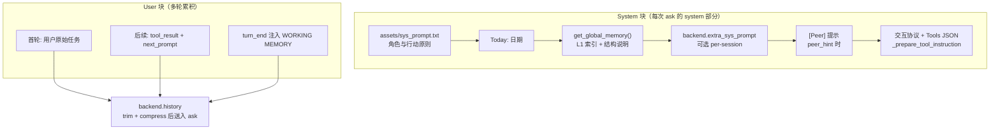
```mermaid
flowchart TB
    subgraph SystemBlock["System 块（每次 ask 的 system 部分）"]
        S1["assets/sys_prompt.txt<br/>角色与行动原则"]
        S2["Today: 日期"]
        S3["get_global_memory()<br/>L1 索引 + 结构说明"]
        S4["backend.extra_sys_prompt<br/>可选 per-session"]
        S5["[Peer] 提示<br/>peer_hint 时"]
        S6["交互协议 + Tools JSON<br/>_prepare_tool_instruction"]
    end

    subgraph UserBlock["User 块（多轮累积）"]
        U1["首轮: 用户原始任务"]
        U2["后续: tool_result + next_prompt"]
        U3["turn_end 注入 WORKING MEMORY"]
    end

    S1 --> S2 --> S3 --> S4 --> S5 --> S6
    U1 --> SessionHistory
    U2 --> SessionHistory
    U3 --> SessionHistory
    SessionHistory["backend.history<br/>trim + compress 后送入 ask"]
```

#### 4.8.2 System Prompt 各段（中文意译）

**① 基础角色**（`assets/sys_prompt.txt`）

| 原文要点 | 中文含义 |
|----------|----------|
| Role: 物理级全能执行者 | 具备文件、脚本、浏览器 JS、系统干预权限；禁止说「无法操作」，须用工具探测 |
| 行动前推演 + `<summary>` | 每轮须在回复里写极简单行总结（进入工作记忆） |
| 探测优先 | 失败先拿日志/状态，写入 working memory 再决定重试 |
| 失败升级 | 1 次读错因 → 2 次探环境 → 3 次换方案或 `ask_user` |

**② 记忆导航**（`get_global_memory()` = `insight_fixed_structure` + `global_mem_insight.txt`）

| 片段 | 中文含义 |
|------|----------|
| Facts(L2) / SOPs(L3) / META-SOP(L0) 路径 | 告诉模型记忆文件在哪 |
| [CONSTITUTION] 五条 | 改源码先请示；决策前查记忆；分步控失败半径；密钥只引用不读；写记忆前读 L0、只能 patch |
| L1 正文 | ≤30 行的场景关键词 → L2 section / L3 文件名 + RULES 红线 |

**③ 动态附加**（`agentmain.run`）

- `Today: YYYY-MM-DD Weekday`
- `[Peer]`：提示可查 `temp/model_responses/` 里其他会话尾部（多前端/多任务时）
- `llmclient.backend.extra_sys_prompt`：如 `/session.xxx=` 动态设置

**④ 交互协议**（每轮可能缩短，见 `_prepare_tool_instruction`）

中文协议（`GA_LANG != en` 时）：

1. **思考**：在 `<thinking>` 里分析现状与策略  
2. **总结**：在 `<summary>` 里写 <30 字的物理快照（上次工具结果 + 本次意图）→ 进入 `history_info`  
3. **行动**：需要工具时，在正文后输出 `<tool_use>{"name","arguments"}</tool_use>`  

若工具 JSON 与上轮相同且累计 token 未超阈值，协议可折叠为一句：「工具库持续有效，可正常调用」。

**⑤ 工具定义**：完整 `tools_schema.json` 嵌入 system；每 10 轮 `client.last_tools=''` 强制重发。

#### 4.8.3 每轮 User 消息（Loop 增量）

`agent_loop` 每轮结束时：

```python
messages = [{"role": "user", "content": next_prompt, "tool_results": tool_results}]
```

`next_prompt` 由以下来源**拼接**（`turn_end_callback`）：

| 来源 | 内容（中文） |
|------|----------------|
| 各工具 `StepOutcome.next_prompt` | 工具返回的指引（如记忆结算说明、错误重试） |
| 缺 `<summary>` 惩罚 | `[SYSTEM] 必须在回复文本中包含<summary>！` |
| 轮次护栏 | 每 7 轮 DANGER 禁无效重试；每 10 轮重载 `get_global_memory()`；每 75 轮强制 `ask_user` |
| Plan 模式 | 每 5 轮提示读 `plan.md` 当前步骤 |
| Subagent 主进程 | `_keyinfo` / `_intervene` 文件注入 |
| **WORKING MEMORY 锚点** | `_get_anchor_prompt()`：见下 |

**WORKING MEMORY 锚点结构**（中文标签含义）：

```xml
### [WORKING MEMORY]
<earlier_context>
  ... 折叠后的 [Agent] 摘要（超过 30 轮以前）...
</earlier_context>
<history>
  [USER]: ...
  [Agent]: ...   <!-- 来自每轮 <summary> 或工具摘要 -->
</history>
Current turn: N
<key_info>...</key_info>        <!-- update_working_checkpoint -->
<related_sop>path</related_sop>  <!-- 提示可再读 L3 SOP -->
```

工具执行后，`tool_results` 在下一轮以 `<tool_result>...</tool_result>` 形式拼进 USER 段。

#### 4.8.4 Native 模式差异

`NativeToolClient` 不拼 `<tool_use>` 文本，而是：

- `system` = sys_prompt + memory + 协议（若仍注入）
- `messages` 使用 API 标准 `tool` / `tool_result` role
- 历史存在 `backend.history`，同样走 `trim_messages_history`

---

## 5. 记忆体系架构与压缩

> **读前提示**：若还不清楚 L0–L4 各是什么、为何分层，请先读 **[§2.3](#23-自我进化设计原理)**（§2.3.0 白话表 + §2.3.2 进化示例）。本节偏实现与压缩机制。

### 5.1 分层架构图

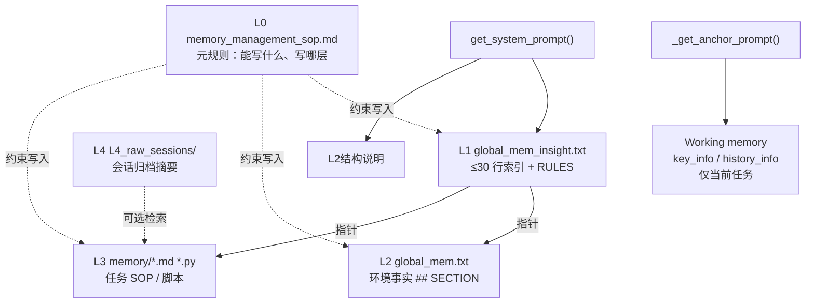
```mermaid
flowchart TB
    L0["L0 memory_management_sop.md<br/>元规则：能写什么、写哪层"]
    L1["L1 global_mem_insight.txt<br/>≤30 行索引 + RULES"]
    L2["L2 global_mem.txt<br/>环境事实 ## SECTION"]
    L3["L3 memory/*.md *.py<br/>任务 SOP / 脚本"]
    L4["L4 L4_raw_sessions/<br/>会话归档摘要"]
    WM["Working memory<br/>key_info / history_info<br/>仅当前任务"]

    L0 -.->|约束写入| L1
    L0 -.->|约束写入| L2
    L0 -.->|约束写入| L3
    L1 -->|指针| L2
    L1 -->|指针| L3
    L4 -.->|可选检索| L3

    Prompt["get_system_prompt()"] --> L1
    Prompt --> L2结构说明
    Anchor["_get_anchor_prompt()"] --> WM
```

### 5.2 各层职责表

| 层 | 文件 | 是否默认注入 Prompt | 写入触发 | 禁止内容 |
|----|------|---------------------|----------|----------|
| **L0** | `memory_management_sop.md` | 仅 `start_long_term_update` 时读入 | 人工维护 | — |
| **L1** | `global_mem_insight.txt` | **是**（全量） | L2/L3 变更时 patch 同步 | 细节、How-to、密钥 |
| **L2** | `global_mem.txt` | **是**（经 L1 导航；结构说明在 assets） | 环境事实验证后 patch | 猜测、易变态、常识 |
| **L3** | `memory/*_sop.md`, `*.py` | **否**（模型按 L1 指针 `file_read`） | 任务经验验证后新建/改 | 未验证步骤 |
| **L4** | `L4_raw_sessions/` | **否** | 后台 `compress_session` | 原始全文常留档 |
| **Working** | 内存 `handler.working` | **是**（每轮 anchor） | `update_working_checkpoint` | 跨任务时应更新/清空 |

### 5.3 L1 ↔ L2/L3 同步规则（摘要）

| 操作 | L1 动作 |
|------|---------|
| L2/L3 新增场景 | 低频场景只在列表加**文件名**；高频才在第一层写 key→value |
| 删除场景 | 删对应关键词行 |
| 通用避坑 | 压缩一句进 `[RULES]` |
| 红线 | L1 只改关键词，**禁止** overwrite 整个文件 |

完整决策树见 L0 文档「信息分类快速决策树」。

### 5.4 记忆相关压缩（与对话压缩不同）

记忆体系有 **三套压缩**，不要与 §7 Session 对话裁剪混淆：

| 类型 | 位置 | 原理 | 触发 |
|------|------|------|------|
| **L1 体积硬约束** | `global_mem_insight.txt` | 人工+模型遵守 ≤30 行；场景词压缩 | 每次写 L1 |
| **L4 会话归档** | `memory/L4_raw_sessions/compress_session.py` | 读 `temp/model_responses/*.txt`，用 LLM/规则蒸馏为摘要写入 L4 | `reflect/scheduler.py` 每 12h |
| **Working 折叠** | `ga._fold_earlier` | 超过 30 轮的 `[Agent]` 行合并为 `（N turns）` | 每轮 `_get_anchor_prompt` |

**L4 归档流程**（`scheduler.check` 内嵌，每 12h 触发一次）：

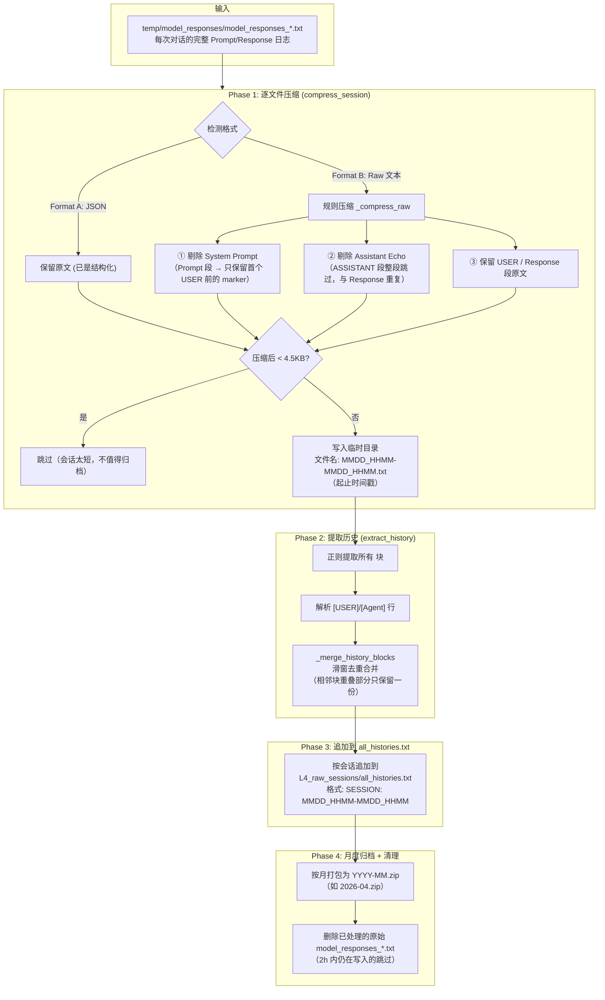
```mermaid
flowchart TB
    subgraph Input["输入"]
        RAW["temp/model_responses/model_responses_*.txt<br/>每次对话的完整 Prompt/Response 日志"]
    end

    subgraph P1["Phase 1: 逐文件压缩 (compress_session)"]
        DET{"检测格式"}
        DET -->|Format A: JSON| KEEP["保留原文 (已是结构化)"]
        DET -->|Format B: Raw 文本| STRIP["规则压缩 _compress_raw"]
        STRIP --> S1["① 剔除 System Prompt<br/>（Prompt 段 → 只保留首个 USER 前的 marker）"]
        STRIP --> S2["② 剔除 Assistant Echo<br/>（ASSISTANT 段整段跳过，与 Response 重复）"]
        STRIP --> S3["③ 保留 USER / Response 段原文"]
        SIZE{"压缩后 < 4.5KB?"}
        KEEP --> SIZE
        S1 & S2 & S3 --> SIZE
        SIZE -->|是| SKIP["跳过（会话太短，不值得归档）"]
        SIZE -->|否| WRITE["写入临时目录<br/>文件名: MMDD_HHMM-MMDD_HHMM.txt<br/>（起止时间戳）"]
    end

    subgraph P2["Phase 2: 提取历史 (extract_history)"]
        WRITE --> EXTRACT["正则提取所有 <history> 块"]
        EXTRACT --> PARSE["解析 [USER]/[Agent] 行"]
        PARSE --> MERGE["_merge_history_blocks<br/>滑窗去重合并<br/>（相邻块重叠部分只保留一份）"]
    end

    subgraph P3["Phase 3: 追加到 all_histories.txt"]
        MERGE --> APPEND["按会话追加到<br/>L4_raw_sessions/all_histories.txt<br/>格式: SESSION: MMDD_HHMM-MMDD_HHMM"]
    end

    subgraph P4["Phase 4: 月度归档 + 清理"]
        APPEND --> ZIP["按月打包为 YYYY-MM.zip<br/>（如 2026-04.zip）"]
        ZIP --> DEL["删除已处理的原始 model_responses_*.txt<br/>（2h 内仍在写入的跳过）"]
    end

    RAW --> P1
```

**Phase 1 详解：格式检测与规则压缩**

| 步骤 | 说明 |
|------|------|
| 格式检测 | `_detect_format`：检查首个 `=== Prompt ===` 后的内容，以 `{` 开头 → Format A (JSON)，否则 → Format B (Raw) |
| Format A (JSON) | 已是结构化数据，**保留原文**不压缩 |
| Format B (Raw) 规则压缩 | `_compress_raw`：按 `=== Prompt/Response/USER/ASSISTANT ===` 分段，**剔除** Prompt 段中的 System Prompt（保留 marker 行）、**剔除** ASSISTANT 段（与 Response 重复），**保留** USER 和 Response 段 |
| 体积过滤 | 压缩后 < 4.5KB 的会话视为太短，跳过不归档 |
| 去重检查 | 已在 `all_histories.txt` 中存在的会话名（时间戳）跳过，避免重复 |
| 新鲜度保护 | 2h 内仍在写入的原始日志跳过（活跃会话可能还在追加） |

**Phase 2 详解：历史提取与滑窗去重**

| 步骤 | 说明 |
|------|------|
| 提取 `<history>` 块 | 正则匹配每轮 Prompt 中的 `<history>...</history>`，解析出 `[USER]...` / `[Agent]...` 行 |
| 滑窗去重合并 | `_merge_history_blocks`：相邻块存在重叠（每轮 history 包含前几轮的摘要），算法从尾部向前寻找最长公共子序列，只追加不重叠部分 |
| 输出 | 一份完整的去重 `[USER]/[Agent]` 交替历史列表 |

**Phase 3–4 详解：归档与清理**

| 步骤 | 说明 |
|------|------|
| all_histories.txt | 所有会话的去重历史按 `SESSION:` 分隔追加，供 Agent 按 `file_read` 检索 |
| 月度 ZIP | 压缩后的 `.txt` 文件按月归入 `YYYY-MM.zip`（如 `2026-04.zip`），已存在的 zip 追加写入 |
| 删除原始文件 | 已成功归档的 `model_responses_*.txt` 删除；2h 内活跃的跳过 |

**触发与调度**

| 触发方式 | 代码位置 | 说明 |
|----------|----------|------|
| 定时自动 | `reflect/scheduler.py` → `check()` | 每 12h（43200s）执行一次 `batch_process(dry_run=False)` |
| 手动 CLI | `python -m memory.L4_raw_sessions.compress_session [DIR] [--run]` | 不加 `--run` 为 dry run 预览 |

**L4 与其他层的关系**

- L4 **不**自动注入 Prompt，作用是「可检索的历史档案」；需要时 agent 根据 L1 提示或用户指令去 `file_read`。
- L4 中提取的 `<history>` 摘要（`all_histories.txt`）可帮助 Agent 定位「以前是否做过类似任务」，但不会像 L2/L3 那样影响下次 Prompt 的系统指令。
- L4 归档是**纯规则压缩**（无 LLM 调用），成本为零；压缩比通常 40–70%。

### 5.5 `start_long_term_update` 运行时 Prompt 片段（中文）

工具触发后，下一轮 `next_prompt` 会附加类似：

> **[总结提炼经验]** 提取本任务中**行动验证成功且长期有效**的环境事实、用户偏好、关键步骤。  
> - 环境事实 → `file_patch` 更新 L2，并同步 L1  
> - 复杂任务经验 → L3 精简 SOP  
> 禁止：未验证信息、临时变量、通用常识。严格遵循 L0 SOP，先 `file_read` 再最小 patch。

并附带当前 `get_global_memory()` 快照 + L0 全文（若存在）。

---

## 6. 多 Agent 协作模式

> **读前提示**：子进程与主进程如何通过文件传话，见 **[§2.2 Task I/O](#222-task-io-是什么io--用文件当信箱)**。本节说明 Plan / Supervisor / BBS 等如何**使用**该协议。

GenericAgent **没有**统一的 Multi-Agent SDK；协作靠 **进程隔离 + 文件 IPC（§2.2）+ 可选 BBS 黑板 + Reflect 唤醒** 实现。

### 6.1 模式总览

| 模式 | 实现 | 主/子关系 | 协调介质 | 文档/SOP |
|------|------|-----------|----------|----------|
| **Subagent（Task I/O）** | `agentmain --task DIR` | 主进程派生子进程 | `temp/{task}/` 文件 | `memory/subagent.md`（若有） |
| **监察者 Supervisor** | 主 agent 轮询 + `_intervene` | 主监工 / 子干活 | 同上 | `memory/supervisor_sop.md` |
| **Plan 模式** | `code_run` + `enter_plan_mode` | 主规划 / 子探测·执行 | `plan_XXX/` + subagent | `memory/plan_sop.md` |
| **BBS Worker** | `--reflect agent_team_worker.py` | 多 Worker 对等 | HTTP BBS API | BBS `/readme` |
| **Checklist Master** | `--reflect checklist_master.py` | Master 派发 / Worker 执行 | BBS + `state.json` | `memory/checklist_sop.md` |
| **Goal Mode** | `--reflect goal_mode.py` | 单 agent 自驱多轮 | `goal_state.json` | 环境变量 `GOAL_STATE` |
| **Conductor** | `frontends/conductor.py` | 指挥 1 + N 个 `GenericAgent` 实例 | 内存队列 + WebSocket | — |
| **Reflect 自主** | `--reflect autonomous.py` | 单 agent 定时唤醒 | — | 自动化 SOP |

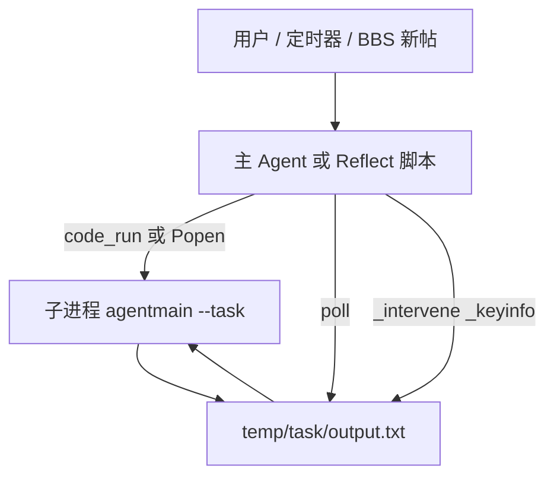
```mermaid
flowchart TB
    User[用户 / 定时器 / BBS 新帖]
    User --> Main[主 Agent 或 Reflect 脚本]
    Main -->|code_run 或 Popen| Sub[子进程 agentmain --task]
    Sub --> Files[temp/task/output.txt]
    Main -->|poll| Files
    Main -->|_intervene _keyinfo| Files
    Files --> Sub
```

### 6.2 Subagent（文件 IO 子进程）

**启动命令**（主 agent 在 `code_run` 中执行）：

```bash
python agentmain.py --task {name} --verbose [--nobg]
```

**生命周期时序**：

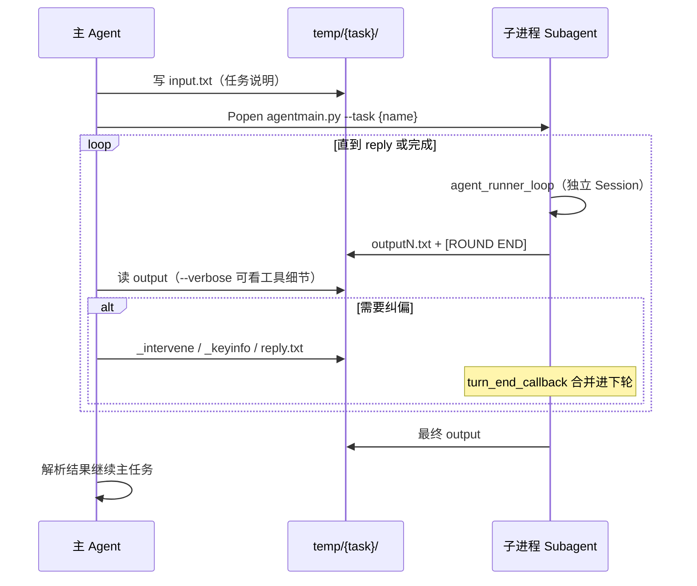
```mermaid
sequenceDiagram
    participant M as 主 Agent
    participant D as temp/{task}/
    participant S as 子进程 Subagent

    M->>D: 写 input.txt（任务说明）
    M->>S: Popen agentmain.py --task {name}
    loop 直到 reply 或完成
        S->>S: agent_runner_loop（独立 Session）
        S->>D: outputN.txt + [ROUND END]
        M->>D: 读 output（--verbose 可看工具细节）
        alt 需要纠偏
            M->>D: _intervene / _keyinfo / reply.txt
            Note over S: turn_end_callback 合并进下轮
        end
    end
    S->>D: 最终 output
    M->>M: 解析结果继续主任务
```

**设计要点**：子进程有**独立** `llmclient.backend.history`；主进程上下文不被子 agent 工具输出撑爆（Plan/Supervisor 的核心动机）。

### 6.3 监察者模式（Supervisor）

主 agent **禁止下场执行**（SOP 红线），只做：

1. `python agentmain.py --task {name} --verbose` 启动工人  
2. 轮询 `output.txt`，对照约束清单  
3. 通过 `_intervene`（纠正）、`_keyinfo`（预注入细节）干预  

| 发现 | 干预文件 |
|------|----------|
| 跳步、漏约束、光说不做 | `_intervene` 一句话指令 |
| 即将进入高风险步骤 | `_keyinfo` 提前塞 SOP 细节 |

### 6.4 Plan 模式（规划 + 验证 Subagent）

触发：多步骤、有依赖任务 → `enter_plan_mode("./plan_XXX/plan.md")`（经 `inline_eval` 注入 `handler`）。

| 阶段 | 谁执行 | 产出 |
|------|--------|------|
| 探索态 | **必须** Subagent（主 agent 禁止直接探测） | `exploration_findings.md` |
| 规划态 | 主 agent 写 | `plan.md`（含 `[D]` 委托标记） |
| 执行态 | 主 agent + 按需 Subagent | 勾选 `[ ]` → `[x]` |
| 验证态 | **必须** `[VERIFY]` Subagent | `VERDICT` 后方能 `no_tool` 声称完成 |

`do_no_tool` 在 Plan 模式下会拦截「未完成验证就声称任务完成」。

### 6.5 BBS 协作（Agent Team Worker）

`reflect/agent_team_worker.py` 周期性 `check()`：

- `GET /posts` 拉新帖 → 有则唤醒 agent  
- Prompt 要求：注册名、抢单、执行、发帖交付、**禁止**接 master 说明性禁接单帖  

适合 **多机多 Worker** 抢同一黑板任务（类似外包大厅）。

### 6.6 Checklist Master（派发 + 验收）

`reflect/checklist_master.py` + `memory/checklist_helper.py`：

- **checklist 模式**：本地 `state.json` 任务列表，`CL(folder)` 管理  
- **mapreduce 模式**：带 BBS URL，Master **只派发/验收，不亲自执行**  

### 6.7 Goal Mode（预算内自驱）

`reflect/goal_mode.py` + `GOAL_STATE=temp/goal_state.json`：

- `check()` 返回 `CONTINUATION_PROMPT` 直到 `budget_seconds` 或 `max_turns`  
- 明确要求：**禁止**提前说「已完成」；在工作目录打磨交付物，**不写全局记忆**  

### 6.8 Conductor（多 GenericAgent 实例）

`frontends/conductor.py`：FastAPI + 多个 `GenericAgent()` 实例，每个 Subagent 独立 `put_task`，Web UI 监控 `summary` 与 intervene/abort。

与 `--task` 子进程的区别：Conductor 子 agent 是**同机多实例**，仍走 `task_queue`，不强制文件 IO。

### 6.9 Reflect 定时唤醒

`agentmain --reflect SCRIPT` 循环：

```python
while True:
    task = mod.check()  # None 则不唤醒
    if task == '/exit': break
    put_task(task) → 等待 done → mod.on_done(result)
    sleep(INTERVAL)
```

| 脚本 | INTERVAL | 用途 |
|------|----------|------|
| `scheduler.py` | 120s | 读 `sche_tasks/` 定时任务 + L4 归档 |
| `autonomous.py` | 1800s | 用户离开后的自主巡检 |
| `goal_mode.py` | 3s | Goal 预算推进 |
| `agent_team_worker.py` | 60s | BBS 抢单 |

---

## 7. 对话上下文压缩（Session 侧）

指 **`llmcore.backend.history`** 与 **WORKING MEMORY 折叠**，保证长对话不超窗。与 **§5.4 记忆文件压缩** 无关。

### 7.1 三级机制

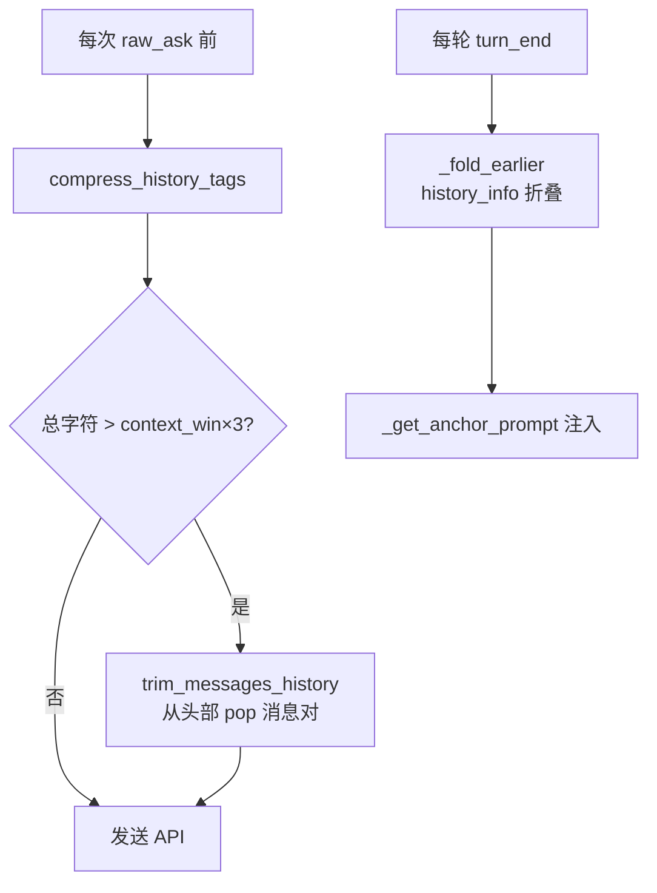
```mermaid
flowchart TD
    A[每次 raw_ask 前] --> B[compress_history_tags]
    B --> C{总字符 > context_win×3?}
    C -->|是| D[trim_messages_history<br/>从头部 pop 消息对]
    C -->|否| E[发送 API]
    D --> E
    F[每轮 turn_end] --> G[_fold_earlier<br/>history_info 折叠]
    G --> H[_get_anchor_prompt 注入]
```

| 机制 | 函数 | 原理 | 参数要点 |
|------|------|------|----------|
| **标签压缩** | `compress_history_tags` | 正则缩短旧消息内 `<thinking>`、`<tool_use>`、`<tool_result>`；保留最近 N 轮完整 | 默认每 5 轮执行；`keep_recent=10` |
| **历史裁剪** | `trim_messages_history` | 估算 JSON 字符数，超过 `context_win*3` 则 `pop(0)`；保证首条为 `user`；孤立 tool_result 改写成纯文本 | `trim_keep_rate` 目标比例 |
| **工作记忆折叠** | `_fold_earlier` | `history_info` 里旧 `[Agent]` 合并为「（N turns）」 | 最近 30 条保留原文 |

### 7.2 ToolClient 额外省 token

- 工具 schema 与上轮相同 → 协议折叠为一句「工具仍有效」  
- `total_cd_tokens > 9000` → 强制 `last_tools=''` 重发完整工具列表  
- 流式展示时 `_clean_content` 缩短历史代码块显示（不影响 Session）

### 7.3 Prompt Cache（费用优化）

`ClaudeSession` / `NativeClaudeSession`：system 块 `cache_control: persistent`；最后 2 条 user 消息 `ephemeral`，降低长对话成本（见 `make_messages`）。

---

## 8. 前端交互与通信协议

### 7.1 双队列模型

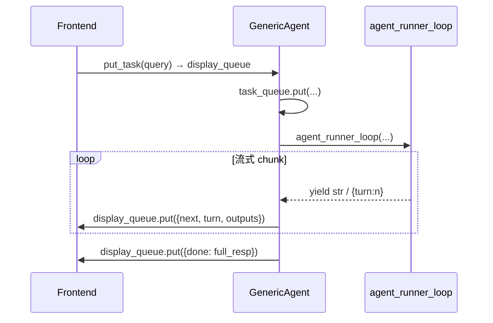
```mermaid
sequenceDiagram
    participant UI as Frontend
    participant GA as GenericAgent
    participant ARL as agent_runner_loop

    UI->>GA: put_task(query) → display_queue
    GA->>GA: task_queue.put(...)
    GA->>ARL: agent_runner_loop(...)
    loop 流式 chunk
        ARL-->>GA: yield str / {turn:n}
        GA->>UI: display_queue.put({next, turn, outputs})
    end
    GA->>UI: display_queue.put({done: full_resp})
```

**display_queue 消息形状**

| 字段 | 含义 |
|------|------|
| `next` | 增量文本 |
| `done` | 全量结束 |
| `turn` | 当前轮次 |
| `source` | `user` / `task` / `reflect` |
| `outputs` | 最近两轮输出（TUI 用） |

### 7.2 前端目录

| 目录/文件 | 类型 |
|-----------|------|
| `frontends/tuiapp_v2.py`, `tui_v3.py` | Textual TUI（主维护） |
| `frontends/stapp.py` | Streamlit |
| `frontends/desktop_bridge.py` | Tauri 桥 |
| `frontends/fsapp.py`, `tgapp.py`, ... | IM 接入 |

---

## 9. 全链路端到端流程

从用户在前端输入一条消息，到 Agent 完成并刷新 UI 的**完整链路**：

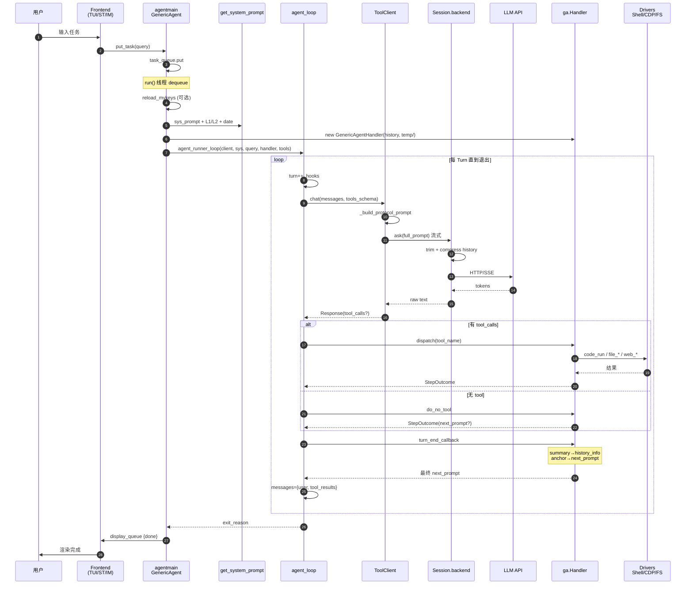
```mermaid
sequenceDiagram
    autonumber
    participant User as 用户
    participant FE as Frontend<br/>(TUI/ST/IM)
    participant AM as agentmain<br/>GenericAgent
    participant Prompt as get_system_prompt
    participant AL as agent_loop
    participant TC as ToolClient
    participant SE as Session.backend
    participant API as LLM API
    participant GH as ga.Handler
    participant DRV as Drivers<br/>Shell/CDP/FS

    User->>FE: 输入任务
    FE->>AM: put_task(query)
    AM->>AM: task_queue.put
    Note over AM: run() 线程 dequeue

    AM->>AM: reload_mykeys (可选)
    AM->>Prompt: sys_prompt + L1/L2 + date
    AM->>GH: new GenericAgentHandler(history, temp/)
    AM->>AL: agent_runner_loop(client, sys, query, handler, tools)

    loop 每 Turn 直到退出
        AL->>AL: turn++, hooks
        AL->>TC: chat(messages, tools_schema)
        TC->>TC: _build_protocol_prompt
        TC->>SE: ask(full_prompt) 流式
        SE->>SE: trim + compress history
        SE->>API: HTTP/SSE
        API-->>SE: tokens
        SE-->>TC: raw text
        TC-->>AL: Response(tool_calls?)

        alt 有 tool_calls
            AL->>GH: dispatch(tool_name)
            GH->>DRV: code_run / file_* / web_*
            DRV-->>GH: 结果
            GH-->>AL: StepOutcome
        else 无 tool
            AL->>GH: do_no_tool
            GH-->>AL: StepOutcome(next_prompt?)
        end

        AL->>GH: turn_end_callback
        Note over GH: summary→history_info<br/>anchor→next_prompt
        GH-->>AL: 最终 next_prompt
        AL->>AL: messages={user, tool_results}
    end

    AL-->>AM: exit_reason
    AM->>FE: display_queue {done}
    FE->>User: 渲染完成
```

**与「仅 Loop 图」的区别**：上图包含 **前端队列、Prompt 构建、Session 裁剪、驱动层**；第 10 节聚焦单轮 Loop 内部。

---

## 10. 单轮 ReAct 时序（Loop 内核）

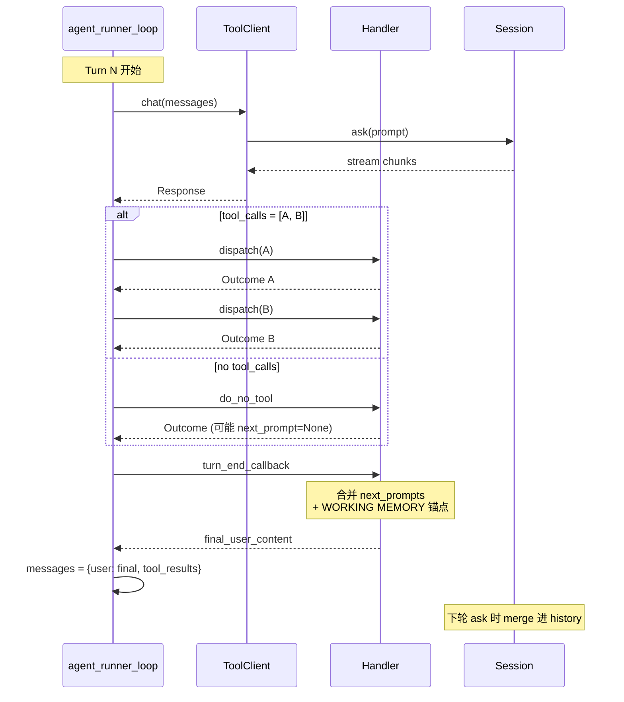
```mermaid
sequenceDiagram
    participant AL as agent_runner_loop
    participant TC as ToolClient
    participant GH as Handler
    participant SE as Session

    Note over AL: Turn N 开始
    AL->>TC: chat(messages)
    TC->>SE: ask(prompt)
    SE-->>TC: stream chunks
    TC-->>AL: Response

    alt tool_calls = [A, B]
        AL->>GH: dispatch(A)
        GH-->>AL: Outcome A
        AL->>GH: dispatch(B)
        GH-->>AL: Outcome B
    else no tool_calls
        AL->>GH: do_no_tool
        GH-->>AL: Outcome (可能 next_prompt=None)
    end

    AL->>GH: turn_end_callback
    Note over GH: 合并 next_prompts<br/>+ WORKING MEMORY 锚点
    GH-->>AL: final_user_content

    AL->>AL: messages = {user: final, tool_results}
    Note over SE: 下轮 ask 时 merge 进 history
```

---

## 11. 关键数据流向

### 10.1 单轮工具调用

```
LLM Response
    ├─ content / thinking / tool_calls
    ▼
agent_loop.dispatch → ga.do_*
    ├─ StepOutcome.data → tool_results[] → 下轮 <tool_result>
    ├─ StepOutcome.next_prompt → turn_end_callback 合并 → user message
    └─ should_exit → 结束 Loop
```

### 10.2 记忆写入

```
start_long_term_update
    → 读 L0 memory_management_sop.md
    → 模型 file_read / file_patch
    → L2 global_mem.txt + L1 指针 + L3 SOP
```

---

## 12. UI 选型说明

| UI | 来源 | 优势 | 劣势 |
|----|------|------|------|
| **TUI v2/v3** | 官方 repo `frontends/` | 与 GenericAgent 同仓、双队列原生 | 需终端 |
| **Streamlit** | 官方 `stapp.py` | 快速 Web 原型 | 功能少于 TUI |
| **Desktop** | `desktop_bridge` + Tauri | 桌面集成 | 额外构建 |
| **Hermes Workspace** | 外部项目 | 多 Agent 编排 | **非 GenericAgent 官方**；协议不同 |

GenericAgent **没有**独立官方的「大型 React 控制台」；推荐日常使用 **`frontends/tuiapp_v2.py`** 或 **`python agentmain.py`** CLI。

---

## 13. 附录：文件索引

### 13.1 核心文件

| 文件 | 说明 |
|------|------|
| `agentmain.py` | 启动、队列、`put_task`、`--task`/`--reflect` |
| `agent_loop.py` | **核心 ReAct Loop** |
| `ga.py` | 工具实现 + `turn_end_callback` |
| `llmcore.py` | Session、Client、裁剪、Mixin |
| `TMWebDriver.py` | 浏览器桥 |
| `simphtml.py` | DOM 提纯 |
| `assets/tools_schema.json` | 工具 JSON Schema |
| `assets/sys_prompt*.txt` | 系统提示词模板 |
| `mykey.py` | API 密钥与 Session 配置（用户本地） |

### 13.2 配置与记忆

| 路径 | 层级 |
|------|------|
| `memory/memory_management_sop.md` | L0 |
| `memory/global_mem_insight.txt` | L1 |
| `memory/global_mem.txt` | L2 |
| `memory/*.md` | L3 |
| `memory/L4_raw_sessions/` | L4 |
| `temp/model_responses/` | 会话日志 / `/resume` |

### 13.3 相关文档

| 文档 | 主题 |
|------|------|
| `README.md` | 快速上手 |
| `memory/memory_management_sop.md` | L0 记忆元规则 |
| `memory/plan_sop.md` | Plan 模式 + Subagent 探索/验证 |
| `memory/supervisor_sop.md` | 监察者模式 |
| `reflect/goal_mode.py` | Goal 预算自驱 |
| `reflect/agent_team_worker.py` | BBS Worker |
| `reflect/checklist_master.py` | Checklist Master |
| `reflect/scheduler.py` | 定时任务 + L4 归档 |

---

*文档 v2.2：§2.2 Task I/O 信箱协议白话、§2.3 L0–L4 分层与进化示例；v2.1 含 Prompt 拼装/记忆架构/多 Agent；v2.0 含 C4/Loop/全链路时序。*
