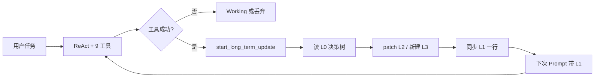

# GenericAgent：自我进化与 L0–L4 记忆（速读 + 例子）

> 若 `DESIGN_DOCUMENT.md` 太长、顺序绕，**先读本文**；细节再回主文档 §2.3 / §5 / §4.7。

---

## 1. 一句话

GenericAgent **不预装 Skill**，只靠 9 个原子工具干活；**跑通并验证**的经验，用 `file_patch` 写进 `memory/` 里的文本文件，下次对话自动带上索引，Agent 就「越用越聪明」——这叫**自我进化**（改的是记忆文件，不是模型权重）。

---

## 2. 为什么文档难懂？

| 现象 | 原因 |
|------|------|
| L0–L4 讲了好几遍 | 分散在 §2.3（原理）、§4.5（指针）、§4.7（Prompt）、§5（实现）、§11（数据流） |
| Task I/O 插在记忆前面 | §2.2 很长，容易以为和 L1–L4 是一回事（其实是**两套东西**） |
| 架构图在前、故事在后 | §3–§4 偏实现，§2.3.2 例子埋得深 |

**建议阅读顺序（只关心记忆与进化）**：

1. 本文（例子）
2. `DESIGN_DOCUMENT.md` §2.3.0 → §2.3.2
3. §4.7（记忆怎么进 Prompt）
4. §5（压缩与 `start_long_term_update`）
5. 需要多 Agent 时再读 §2.2、§6

---

## 3. 两套「记忆」别混了

| | **Working 工作记忆** | **L0–L4 长期记忆** |
|---|---------------------|-------------------|
| 存在哪 | 内存 `key_info` / `history_info` | 磁盘 `memory/` 下文本 |
| 活多久 | **当前这一次任务** | **跨会话永久** |
| 谁看 | 每轮自动塞进 Prompt 锚点 | L1/L2 开头注入；L3 按需 `file_read` |
| 例子 | 「第 3 步正在装 bun」 | 「gbrain 安装要先装 bun」 |

| | **Task I/O `temp/任务名/`** | **L0–L4 `memory/`** |
|---|---------------------------|---------------------|
| 目的 | 主 Agent ↔ **子进程**传话 | **下次任务**更聪明 |
| 生命周期 | 单次子任务，可删 | 长期保留 |
| 例子 | `input.txt` / `output.txt` | `global_mem_insight.txt` |

---

## 4. L0–L4：图书馆类比 + 文件

```
memory/
├── memory_management_sop.md      ← L0 编目规范（怎么写记忆）
├── global_mem_insight.txt        ← L1 索引牌（≤30 行，每次必带）
├── global_mem.txt              ← L2 环境事实（路径、密钥位置…）
├── web_upload_sop.md             ← L3 某类任务 SOP（按需读）
├── deploy_helper.py              ← L3 可执行脚本
└── L4_raw_sessions/            ← L4 旧对话压缩档案
```

| 层 | 记什么 | 不记什么 |
|----|--------|----------|
| **L0** | 规则本身（元 SOP） | 业务步骤 |
| **L1** | `gbrain_install_sop(gbrain安装)` 这种**一行指针** | 安装命令全文 |
| **L2** | `OpenRouter key 在 ~/.hermes/.env` | 未验证猜测、今天日期 |
| **L3** | 「先 `bun install` 再…」已跑通的步骤 | 泛泛常识 |
| **L4** | 「2026-05-01 会话：讨论了…」摘要 | 一般不手改 |

**铁律（L0）**：**No Execution, No Memory** — 没经工具验证成功的，不准写入 L2/L3。

---

## 5. 完整例子：第一次安装 gbrain

### 场景

用户在 TUI 说：「帮我在本机安装 gbrain。」

### 时间线

```text
【第 1 次对话 — 还没进化】

用户: 安装 gbrain
  ↓
System Prompt 里只有 L1 索引（可能没有 gbrain 相关行）
  ↓
Agent: code_run("npm install -g gbrain")  → 失败
Agent: file_read README…                  → 发现需要 bun
Agent: code_run("bun install")            → 成功
Agent: code_run("…启动命令…")              → 成功
  ↓
Working: key_info 记下「bun 已装、启动命令是 xxx」  ← 仅本次任务
  ↓
Agent 调用工具: start_long_term_update
  ↓
  1) file_read L0（memory_management_sop.md）— 按决策树分类
  2) 新建 L3: memory/gbrain_install_sop.md（3～5 条踩坑，非教程）
  3) file_patch L2: 加一节「gbrain 依赖 bun，路径 …」
  4) file_patch L1: 加一行 gbrain_install_sop(gbrain安装)

【一周后 — 已进化】

用户: 再装一台机器上的 gbrain
  ↓
每次对话开头 System 已带 L1:
  「gbrain_install_sop(gbrain安装)」
  ↓
Agent: file_read memory/gbrain_install_sop.md
  ↓
直接按 SOP 执行，跳过上周的试错
```

### 各层在例子里的对应

| 步骤 | 层级 |
|------|------|
| 「正在试 npm」 | Working |
| `start_long_term_update` 读规范 | L0 |
| L1 加 `gbrain_install_sop(gbrain安装)` | L1 |
| L2 写 bun 路径、配置位置 | L2 |
| L3 写安装 SOP 正文 | L3 |
| 旧对话日志压缩进档案 | L4（后台 scheduler，不阻塞用户） |

若安装**从未**跑通任何命令，按 L0 **不得**写 L2/L3，最多留在 Working，关会话就没了。

---

## 6. 「进化」闭环（5 步）



---

## 7. Prompt 里到底带了什么？（例子）

**每次新开对话，模型大致看到：**

```text
[System]
  assets/sys_prompt.txt          # 角色：必须用工具，禁止空谈
  Today: 2026-06-04
  get_global_memory()            # ← L1 全文 + L2/L3 路径说明（不是 L3 全文）
  工具 JSON …

[User 每轮]
  用户任务 / 工具结果
  ### [WORKING MEMORY]           # ← 仅当前任务
  <history>…</history>
  <key_info>第 2 步 bun 已装好</key_info>
```

**L3 全文不会自动塞进来**，除非 L1 里有指针，Agent 自己 `file_read`。

---

## 8. 其它核心概念（小例子）

### 8.1 九工具 ReAct 一轮

```text
用户: 查 github.com 某 repo 的 star 数

[Agent 思考 + <summary>准备打开网页</summary>]
<tool_use>{"name":"web_scan","arguments":{"url":"https://github.com/..."}}</tool_use>

[tool_result] HTML 摘要…

[Agent] <summary>star 约 12k</summary>
回答用户
```

Loop 在 `agent_runner_loop` 里重复「想 → 调工具 → 看结果」，直到不再调工具或 `ask_user`。

### 8.2 三种运行模式

| 模式 | 例子 |
|------|------|
| **Interactive** | 你在 TUI 里聊一句「帮我写脚本」 |
| **Task I/O** | 主 Agent 执行 `python agentmain.py --task explore_repo`，子进程写 `temp/explore_repo/output.txt` |
| **Reflect** | 每 60 秒跑 `reflect/bbs.py` 的 `check()`，有活就 `put_task` 唤醒 Agent |

### 8.3 Session 压缩 vs 记忆压缩（易混）

| | 对话压缩 §7 | 记忆压缩 §5 |
|---|------------|------------|
| 裁什么 | `backend.history` 聊天太长 | L1 行数、L4 归档、Working 折叠 |
| 目的 | 单会话不超 token | 跨会话索引不爆、旧对话可检索 |

---

## 9. 回主文档查什么

| 你想搞懂… | 去主文档 |
|-----------|----------|
| Task I/O 文件协议 | §2.2 |
| L0–L4 表与动机 | §2.3.0–2.3.3 |
| C4 / 类图 | §3 |
| Loop 状态机 | §4.1 |
| Prompt 拼装全文 | §4.7 |
| L1 同步规则、L4 定时任务 | §5 |
| Supervisor / Plan | §6 |

---

## 10. 自检：我真的懂了没有？

1. L1 里能写「先 cd 再 npm install」吗？ → **不能**，只能写指针/关键词。  
2. 子任务 `temp/foo/output.txt` 算 L3 吗？ → **不算**，那是 Task I/O。  
3. 进化改的是模型权重吗？ → **不是**，改 `memory/*.txt`。  
4. L3 每次对话都会进 Prompt 吗？ → **不会**，靠 L1 触发再 `file_read`。
