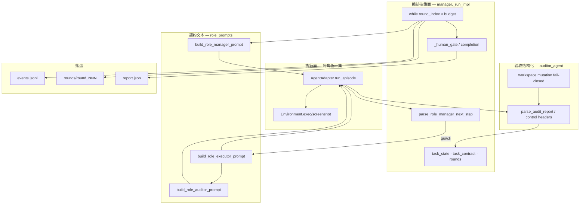
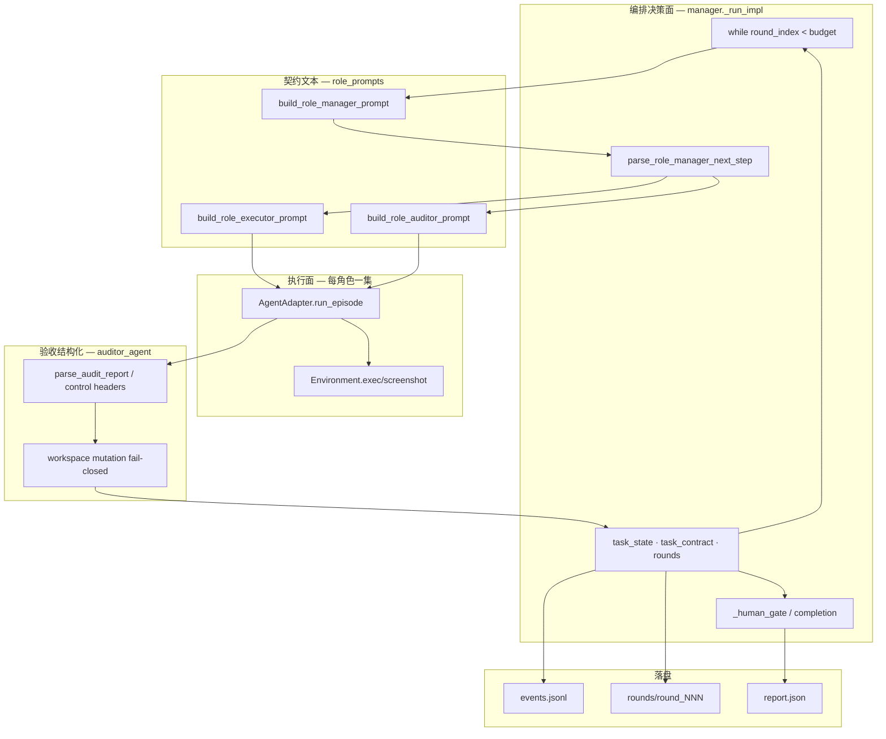
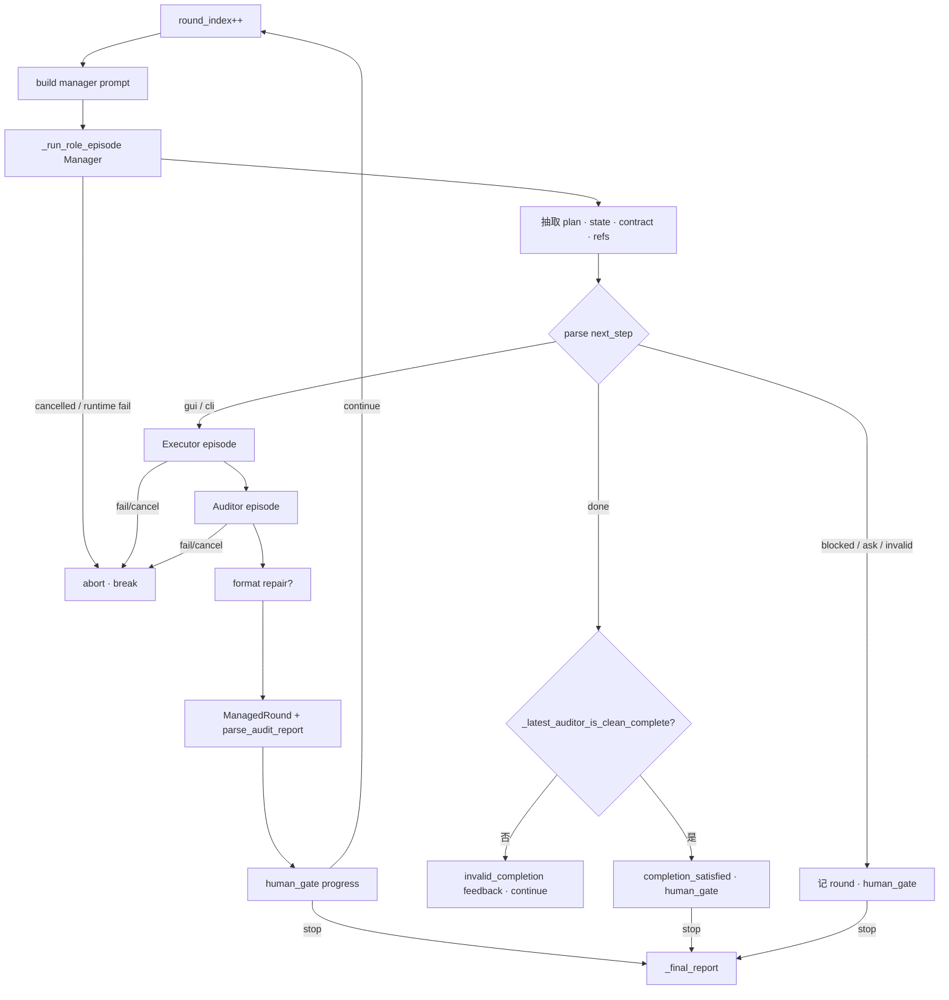

# LongHorizon-Harness — 架构文档（第1部分）

> **主题**：为什么 MEA 外环成立 · 状态真源如何流动 · Prompt/路由契约 · 落盘与事件 · 完成门禁  
> **配套源码走读**：[source/01-manager-loop.md](./source/01-manager-loop.md)（逐行 `_run_impl`）  
> 仓库：`src/lh_harness/` · 语言：**Python**  
> 2026-08-14

---

## §0 本卷要回答的问题

1. 为什么「换模型/换 Agent」解决不了长程 computer-use，而要在外层做 Loop Engineering？  
2. Manager / Executor / Auditor 各自看见什么、看不见什么？信息隔离如何用代码强制？  
3. 「任务完成了」在系统里由谁说了算？伪完成如何被挡回？  
4. 磁盘上的 round 目录、events.jsonl、report.json 各自服务哪一层消费者？

---

## §1 产品命题与架构公理

### 1.1 一句话

**LongHorizon-Harness（LHH）** = 在 Claude Code / Codex 等 **现有 Agent CLI 之外**，用固定的 **Manager → Executor → Auditor** 轮次，把「规划、执行、真实验收、可信进度」工程化。

不训练模型；不替换 Agent 内部 Tool Loop；不自研 SessionEvent 内核（那是 DeepSeek Harness 路线）。

### 1.2 失败模式 → 对策

| 单 Agent 长跑常见失败 | LHH 对策（代码落点） |
|----------------------|----------------------|
| 上下文爆掉，忘记目标 | 每角色 `run_episode` 全新进程；跨轮只传 `task` + 压缩后的 state/报告 |
| 自报完成但桌面/文件未达标 | `Next: done` 必须 `_latest_auditor_is_clean_complete` |
| 执行口述被当成进度 | Manager prompt **不含** raw trajectory；只含 auditor 报告 |
| GUI/CLI 混用状态乱 | `next: gui\|cli` 分绑不同 adapter/budget/auditor |
| Worker 崩溃无终态 | `manager.run` 捕获一切异常写 terminal `report.json` |

### 1.3 五条公理（操作化）

1. **原始 `task` 不变**——每轮 Manager 都重新看见它。  
2. **可信中间状态 = Auditor 自然语言报告**（再加 Manager 维护的 `task_state`/`task_contract`）。  
3. **完成权威 = Manager 路由 + 干净审计**，权威字段写在 `report.json` 的 `completion_authority`。  
4. **Harness 反馈 ≠ 审计**——invalid plan/completion 进 `harness_feedback`，prompt 里单独一节标明。  
5. **落盘先于信任 UI**——Supervisor/Web 读文件与进程身份，不读内存里的「我觉得完成了」。

---

## §2 模块全景（决策面 vs 执行面）




**读图要点**：右边 Exec 可以换 Claude/Codex；左边 Decision 的门禁与状态机不应随 Adapter 分叉复制。

---

## §3 三角色：信息隔离（架构核心）

### 3.1 职责表（带「禁止」）

| 角色 | 负责 | 允许看见 | **禁止看见/做** |
|------|------|----------|-----------------|
| **Manager** | 恢复目标、维护契约、选下一步 | 原始 task、task_state/contract、历史 auditor 报告、harness_feedback、轮次预算 | Executor/Auditor 的 raw JSONL 轨迹；替用户「假装验收」 |
| **Executor** | 只做一项边界明确的子任务 | 本轮 plan、state/contract、**Manager 点名的** related reports、workspace | 全局改规划；把 harness 日志当交付物 |
| **Auditor** | 独立检查真实环境 | 子任务契约、executor 可见输出、related reports | 默认写改工作区；无控制头的胡言当 complete |

### 3.2 代码如何强制「Manager 不看轨迹」

构造 Manager prompt 时显式组装的块（英文路径，`role_prompts.py`）：

```62:94:src/lh_harness/role_prompts.py
        return f"""\
{MANAGER_INSTRUCTIONS[lang].strip()}

Original task:
{task.rstrip()}
...
Previous current-task state:
{task_state.strip() or "(No maintained state yet. ...)"}

Historical auditor reports by round (authority for trusted intermediate state):
{auditor_reports or "(No auditor reports yet.)"}

Harness management feedback (not an audit; only for protocol/completion correction):
{harness_feedback or "(No harness feedback.)"}

Round budget:
- Current management round: {round_index}
...
Output only the next management result.
"""
```

`auditor_reports` 来自 `format_verified_intermediate_context(rounds, ...)`——只抽取过去 round 里存下的 **auditor_report 文本**，不是 `*_raw_trajectory.jsonl`。

轨迹仍会通过 `_save_role_result` 落盘供人审 / Dashboard，但 **不进入下一轮 Manager 的决策输入**。这是「操作员面」与「决策面」分离。

### 3.3 Executor 只拿「点名」的报告

```561:572:src/lh_harness/manager.py
        # Task prompts receive the manager-maintained state plus only the
        # auditor reports explicitly referenced by the current subtask contract.
        executor_prompt = build_role_executor_prompt(
            ...
            related_auditor_reports=related_auditor_reports,
            ...
        )
```

`related_report_refs` 从 Manager 计划里解析；`format_related_auditor_reports` 按 round id 裁剪。  
**未引用的历史报告默认不进 Executor**——防止上下文膨胀，也防止「随便翻旧报告当新证据」。

---

## §4 一轮 Round 的完整控制流



对应源码主循环：`manager.py` `_run_impl` 约 L285–L890。  
取消与 provider 失败在 **每个角色阶段** 都有对称分支（写 `ManagedRound`、events、`abort_reason`/`failure_reason`）。

---

## §5 路由契约：`Next:` 是控制面，不是散文

### 5.1 合法取值

| 解析结果 | Manager 意图 | 编排行为 |
|----------|--------------|----------|
| `gui` | 需要桌面/视觉操作 | GUI executor + GUI auditor |
| `cli` | 需要终端/文件/代码 | CLI executor + CLI auditor |
| `done` | 宣称总任务完成 | **仅当**存在干净 complete 审计才收工 |
| `blocked` | 无法继续 | human_gate；无 hook 则停 |
| `ask` | 必须问人 | 抽 question/choices；无 hook → `needs_human_input` |
| `invalid` | 控制行不合规 | 注入 `_invalid_plan_feedback`，当审计信号 |

### 5.2 解析器行为（严格）

```481:499:src/lh_harness/role_prompts.py
def parse_role_manager_next_step(text: str) -> RoleNextStep:
    for line in str(text or "").splitlines():
        normalized = ...
        normalized = re.split(r"(?:—|–|--|//|#|[（(])", normalized, maxsplit=1)[0]
        ...
    return MANAGER_NEXT_INVALID
```

- `Next: done — all passed` → **done**（破折号后当注释）  
- `Next: done later` → **invalid**（later 不是 delimited 后缀）  
- 中英同义集合（`下一步:完成` / `next:complete` 等）  

架构含义：控制面靠 **行级协议**，不是靠 LLM JSON schema。代价是脆弱 → 用 invalid + harness_feedback 闭环修正，而不是静默猜。

---

## §6 完成门禁（最重要的业务不变量）

### 6.1 干净审计判定

```1397:1409:src/lh_harness/manager.py
def _latest_auditor_is_clean_complete(rounds, *, language="en") -> bool:
    for item in reversed(rounds):
        if item.auditor_status.get("invalid_completion") or item.auditor_status.get("invalid_plan"):
            continue
        if not item.auditor_report.strip():
            continue
        report = parse_audit_report(item.auditor_report, item.round_index, language=language)
        return (
            report.status == "complete"
            and report.integrity_status == "clean"
            and report.contract_audit_status == "aligned"
        )
    return False
```

三条件缺一不可：`complete` ∧ `clean` ∧ `aligned`。  
跳过「伪完成/伪计划」合成轮，避免用 harness_feedback 冒充审计。

### 6.2 伪完成路径

当 `next_step == done` 但判定失败：写入 `_invalid_completion_feedback`，`ManagedRound.next_step = invalid`，带 `auditor_status.invalid_completion=True`，然后 `human_gate("progress")` 并 **continue** 下一轮。

**Manager 不能单方面结束任务。**

### 6.3 终态 `report.json` 状态机

```1426:1439:src/lh_harness/manager.py
    status = (
        "complete" if completion_satisfied
        else "cancelled" if abort_reason == "user_cancelled"
        else "failed" if abort_reason.startswith("provider_")
        else "blocked" if abort_reason == "manager_blocked"
        else "incomplete"
    )
```

`completion_authority: "manager_with_role_auditors"` 写死在报告里——评测/Supervisor 应读这个字段，而不是读最后一轮 Executor 自称。

---

## §7 Human gate：无人 / 有 Dashboard 两条路径

`_GateContext` 打包：hook、rounds、budget、carryover、final_response、failure_reason…

`_human_gate` 返回 `True` = **停止** while：

| 场景 | 无 `human_hook` | 有 hook |
|------|-----------------|---------|
| 已 `completion_satisfied` | 停 | hook 可 continue 再开 |
| `blocked` | abort=`manager_blocked`，停 | 可注入指令后 continue |
| `ask` | abort=`needs_human_input`，停 | 答案写入 carryover |
| 达 max rounds | abort=`max_rounds_exhausted` | 可 `extra_rounds` 延期 |
| 普通 progress | **不停**（return False） | hook 决定 |

Carryover 在 **下一轮 Manager prompt 开头**以高优先级注入（中英不同 heading），并写入 `human_instructions.txt` + event。

无 Dashboard 的纯 CLI：progress 轮连续跑到 done/blocked/max；ask 会硬停——因为没有答题通道。

---

## §8 落盘：三层消费者

### 8.1 目录树（单 run）

```text
{log_dir}/                          # 常在 ~/.lh-harness/... 或 ./.lh-harness/runs/<id>
  report.json                       # Supervisor/评测读的终态
  role_orchestration/
    events.jsonl                    # 实时事件（role_start/done、cancel、runtime_failed）
    report.json                     # 同终态副本
    orchestration_transcript.txt
    rounds/round_001/
      manager_input.txt             # 决策面输入（可审计「Manager 看见了什么」）
      manager_plan.txt
      task_state.txt / task_contract.txt
      executor_prompt.txt / executor_output.txt
      auditor_input.txt / auditor_report.txt
      harness_feedback.txt          # 可选
      {role}_raw_trajectory.jsonl   # 操作员面；决策面不用
      {role}_metadata.json
      screenshots / artifacts…
  manager_episodes/ …
```

### 8.2 `_save_role_result` 的轨迹语义

注释写明：超时取消时 stdout 可能空，但 live tee 已写入 JSONL——优先 **保留 live 更长前缀**，避免擦掉已刷轨迹。  
另：`persist_trajectory_artifacts` 抽截图清单；GUI 还可挂 final screenshot。

### 8.3 事件流

`_append_event(events_path, event, payload)` → JSONL。  
关键 event：`role_harness_start`、`manager_round_*`、`executor_role_*`、`auditor_role_*`、`agent_runtime_failed`、`role_harness_cancelled`、`role_harness_done`、`human_instructions_injected`。

`progress` 回调与 events **并行**：CLI 打印用人话；机器跟跑用 JSONL。

---

## §9 与 DeepSeek Harness 对照（本卷视角）

| | LHH | DSH |
|--|-----|-----|
| 循环单位 | **Round**（Manager±Executor±Auditor） | **Turn/Step**（LLM+tools） |
| 真源 | task_state + auditor 报告 + 文件 | SessionEvent 日志 |
| 「完成」 | 外环门禁 | 通常无独立 Auditor；工具结果即事实 |
| 扩展 | 换 Adapter/Env | 换 Cordis 插件 / Seam |

两者都叫 Harness，但 LHH 解决的是 **长程 computer-use 的验收与状态恢复**；DSH 解决的是 **可替换的自研 Agent 运行时**。

---

## §10 本卷小结

编排内核的灵魂不是某个 Prompt 字符串，而是：

> **决策面只吃审计过的状态；执行面每集清空上下文；完成必须三条件干净审计；一切异常也要留下 report.json。**

下一卷展开 Adapter/Env/插件/只读守卫；源码级 while 分支继续看 [source/01](./source/01-manager-loop.md)。
