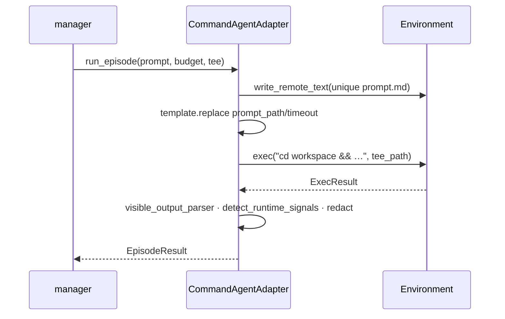
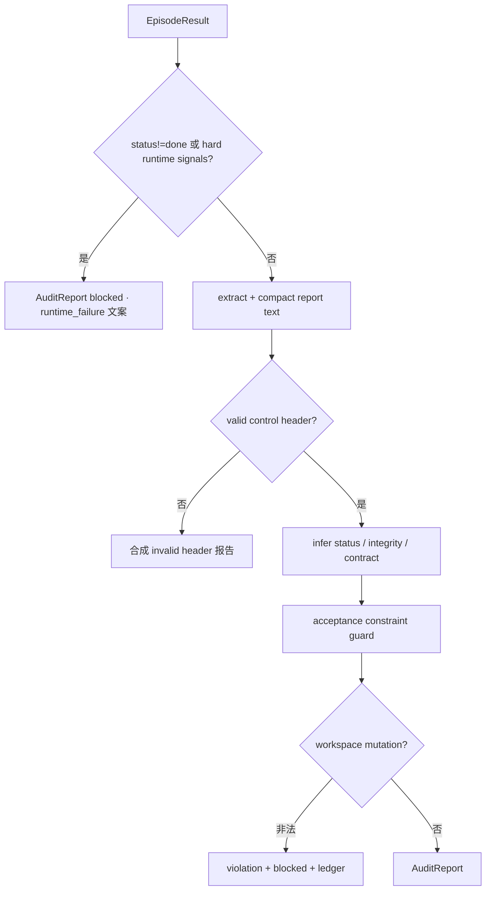

# LongHorizon-Harness — 架构文档（第2部分）

> **主题**：AgentAdapter / Environment 如何承载内环 · Claude 角色隔离 · Auditor 结构化与只读守卫 · 预算与 runtime 信号 · Computer-use 插件  
> 源码：[source/02-adapters-env-auditor.md](./source/02-adapters-env-auditor.md)  
> 2026-08-14

---

## §0 本卷问题

1. Manager 调的「Agent」到底是什么？一次 episode 在 OS 上发生了什么？  
2. 为什么 Auditor 用 Claude 时要 snapshot 工作区？mutation 后编排如何 fail-closed？  
3. 控制头 / acceptance guard / format repair 如何串成「可解析的验收」？  
4. 超时、鉴权失败如何从 CLI stderr 变成编排可消费的 abort？

---

## §1 Protocol 边界：薄，但是硬

### 1.1 `AgentAdapter`

```python
async def run_episode(prompt, env, budget, live_trajectory_path=None) -> EpisodeResult
```

契约：

- **输入**：完整自然语言 prompt（已由 role_prompts 拼好）  
- **副作用**：通过 `env` 改世界（Executor）或尽量只读（Auditor）  
- **输出**：`EpisodeResult(status, actions_log, error, duration_ms, metadata)`  
- **取消**：抛 `CancelledError` 或返回 `status=cancelled`——manager 用 `_run_role_episode` 归一化

Harness **从不**直接调 Anthropic/OpenAI HTTP；密钥与模型都在 CLI 环境变量 / 命令行里。

### 1.2 `Environment`

`exec` / `screenshot` / `upload` / `download`。  
本地实现要点（`local.py`）：

- stdout/stderr **有界尾部**（防截图 base64 撑爆内存）  
- `tee_path`：锚定目录 + `O_NOFOLLOW` 打开轨迹文件，防 symlink 劫持把轨迹写到 run 外  
- 进程组追踪：stop/abort 时能杀整棵 CLI 子进程树  

评测可换 Docker/SSH Environment，**manager 循环零改动**。

---

## §2 `CommandAgentAdapter`：通用「写文件 → 跑命令」路径



关键实现细节：

| 点 | 代码意图 |
|----|----------|
| prompt 文件名含 uuid | 并发 run/角色不互盖 |
| `replace` 非 `format` | Codex `-c '{…}'` 花括号 |
| `hidden_paths` notice | 禁止 Agent 读 harness 账本当证据 |
| `redact_secrets` | 日志与 metadata 脱敏 |
| timeout → `status=timeout` | 与 exit_code 错误分开 |

`assistant_visible_output` 进 metadata；manager 的 `_visible_output` 优先用它，避免把整段 stream-json 塞进 Auditor prompt。

---

## §3 Claude Code Adapter：角色策略 + Auditor 只读快照

### 3.1 构造：权限减工具，而不是换循环

`ClaudeCodeAdapter` 继承 `CommandAgentAdapter`，按 `ClaudeRole`（manager / gui_executor / cli_executor / gui_auditor / cli_auditor…）取 `policy_for_role`：

- `disallowedTools` + path deny（hidden_paths）  
- 可选 MCP computer-use（`--mcp-config`，`--strict-mcp-config` 防用户全局 MCP 漏进）  
- **禁止** `add_dirs`：角色隔离要求任务文件在 workspace 内  
- 环境变量：`CLAUDE_CODE_DISABLE_AUTO_MEMORY`、`SKIP_PROMPT_HISTORY`、`LH_HARNESS_CLAUDE_ROLE=…`  

命令形态：`claude --print --output-format stream-json … < {prompt_path}`。

### 3.2 Auditor 特有：workspace snapshot

```116:159:src/lh_harness/adapters/claude_code.py
    async def run_episode(...):
        before = snapshot_workspace(...) if is_auditor_role(self.role) else None
        result = await super().run_episode(...)
        ...
        if before is not None:
            after = snapshot_workspace(...)
            diff = workspace_snapshot_diff(before, after)
            result.metadata.update(diff)
            if snapshot_errors:
                result.status = "error"  # fail-closed
```

若 Auditor 改了工作区文件：`verifier_workspace_mutation_detected` 等 metadata 进入 `auditor_agent.audit_report_from_episode_result`，通常升级为 **integrity violation + blocked**，并附「必须由 Executor 修复」文案。  
快照检查失败本身也会把 episode 标 error——**宁可不信审计，也不收污染证据**。

Codex 路径有平行的 computer-use / 配置插件（`plugins/codex_*`），原则相同：能力在 Adapter/Plugin，纪律在 Manager/Auditor。

---

## §4 Auditor 结构化管道



### 4.1 控制头（前三行协议）

典型要求（中英）：状态行、完整性行、契约审计行。  
`_parse_status_control_header` 只看第一非空行；缺头 → 整份作废为「格式错误」类报告，触发 manager 的 format repair。

### 4.2 Acceptance guard

```351:364:src/lh_harness/auditor_agent.py
def _apply_acceptance_constraint_guard(...):
    if status != "complete" or not _has_blocking_acceptance_constraints(report_text):
        return report_text, status, contract_audit_status
    # 降级为 incomplete，并可能撤销 aligned
```

防止模型一边写「还有 blocking acceptance」，一边控制头标 `complete`。

### 4.3 Format repair（manager）

主 Auditor episode 后 `_auditor_report_with_format_repair`：

- 判定是否需要修（`_should_repair_auditor_format`）  
- 再用（默认同）auditor adapter 跑 `build_role_auditor_format_repair_prompt`  
- 缩短预算 `_format_repair_budget`  
- 仍失败则带着不合格文本继续——下一轮 Manager 会看见不干净状态，不会误 complete  

---

## §5 预算、失败分类、runtime signals

### 5.1 预算

`HarnessConfig` 四分预算：manager / gui_executor / cli_executor / auditor。  
默认 manager/auditor 更短（规划与验收不应跑半小时 tool loop），executor 默认 1800s 级。

### 5.2 Runtime signals

`detect_runtime_signals(stdout)` 扫 CLI 输出，识别鉴权失败、配额、明显崩溃模式等。  
硬信号 → Auditor 直接 blocked；Manager/Executor 侧 `classify_agent_runtime_failure` → 编排 `abort_reason` 常以 `provider_` 前缀 → `_final_report` 映射为 `failed`。

**设计意图**：把「供应商挂了」与「任务做不完」分开，Web 才能展示真实错误（`failure_reason`）。

---

## §6 Computer-use 插件层

`plugins/`：安装 npm 包、写 Codex/Claude 配置、社区 computer-use 变体。  
`lh-harness doctor` 检查 Node、CLI、插件健康。  

插件 **只增强 Executor 桌面能力**；不改变：

- `parse_role_manager_next_step`  
- `_latest_auditor_is_clean_complete`  
- `run()` 崩溃护栏  

若插件导致 Auditor 误改文件，仍靠 snapshot fail-closed 兜住。

---

## §7 端到端：一集 GUI Executor 在机器上发生了什么

```text
manager
  → ClaudeCodeAdapter(role=gui_executor).run_episode
       → 写 /tmp/.../round_003_executor_<uuid>.md
       → env.exec:
            cd $WORKSPACE &&
            ANTHROPIC_API_KEY=… CLAUDE_CODE_DISABLE_AUTO_MEMORY=1 …
            claude --print --output-format stream-json
              --disallowedTools … --mcp-config … --model …
              < prompt.md
       → LocalEnvironment:
            进程组启动、stdout tee 到 round_003/executor_raw_trajectory.jsonl
            有界捕获、timeout 杀组
       → 解析 visible_output、runtime_signals
  → _save_role_result（保留 tee、抽截图）
  → 拼 auditor prompt（塞入 executor_output 裁剪后文本）
```

同一模式替换 `codex` 命令模板即可换后端；Manager 无分支。

---

## §8 本卷小结

> **Adapter 负责「如何启动一种 Agent」；Environment 负责「命令跑在哪」；Auditor 管道负责「文本如何变成可门禁的结构」；mutation/snapshot 负责「验收角色不能污染世界」。**

下一卷：CLI/Supervisor/Web 如何把上述内核变成可运营的多 run 系统。
