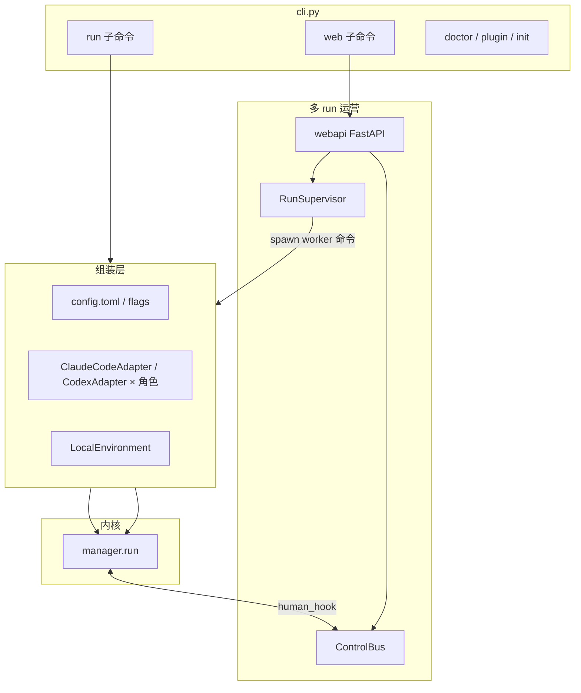
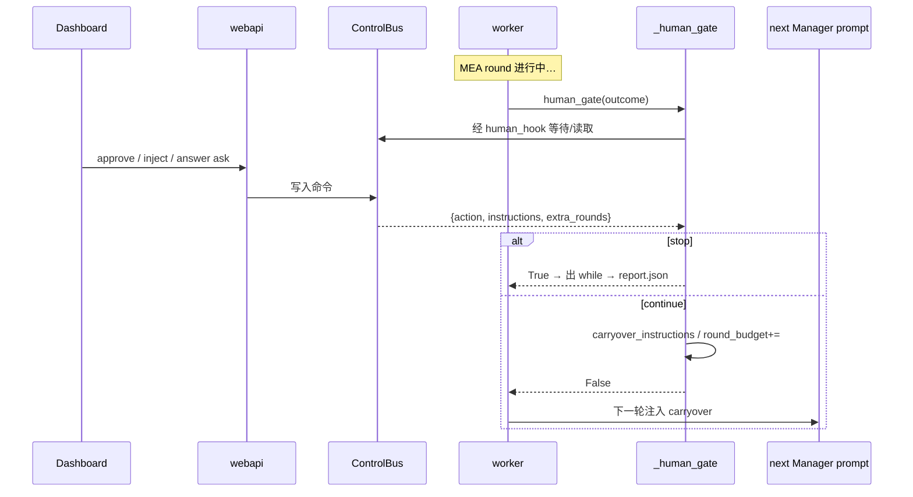

# LongHorizon-Harness — 架构文档（第3部分）

> **主题**：CLI 与 Web 入口 · RunSupervisor 进程模型 · ControlBus/人机 · 终态合并 · 评测仓 · 扩展食谱  
> 源码：[source/03-supervisor-web.md](./source/03-supervisor-web.md)  
> 2026-08-14

---

## §0 本卷问题

1. `lh-harness run` 与 `lh-harness web` 如何共用同一 `manager.run`？  
2. Supervisor 为什么必须「读 report.json + 进程身份」，而不能只看 exit code？  
3. 审批/注入指令如何进入下一轮 Manager，而不破坏 MEA 隔离？  
4. 改完成条件时，要同步改哪些边界？

---

## §1 入口与组装



**原则**：Web 不重新实现 MEA；它 spawn 的 worker 最终仍进 `manager.run`。  
角色模型/后端在组装层分叉，内核只收 `AgentAdapter` 实例。

### CLI `run` 典型组装

1. 解析 task、workspace（默认启动 cwd）、log_dir、max rounds、每角色 model/agent  
2. 构造最多 5+ 个 adapter（manager / gui·cli executor / gui·cli auditor），可全部指向同一后端  
3. `LocalEnvironment(workspace=…)`  
4. 可选 attach ControlBus（与 Web 同语义）  
5. `await manager.run(task=…, env=…, config=…, agents…, human_hook=…, progress=print)`  

`progress`：把 `round_start` / `role_done` / `run_done` 打到控制台——与 events.jsonl 互补。

---

## §2 RunSupervisor：进程与证据

### 2.1 职责清单

| 职责 | 非职责 |
|------|--------|
| create/list/status/stop/abort/resume | 解析 `Next: gui` |
| 幂等键防双 worker | 写 Auditor 控制头 |
| 合并 lifecycle（活着吗 + report 说什么） | 替换 Adapter |
| 把控制命令写入 Bus | 维护 task_state |

### 2.2 为什么 exit code 不够

历史问题（manager 注释）：内核崩溃若无 `report.json`，Supervisor 可能误报完成。  
因此：

1. **所有路径**经 `manager.run` 写 terminal 记录  
2. `_refresh` / `_terminal_status_for_exit` 读 report：`completion_satisfied`、`abort_reason`、是否缺 evidence  
3. `_missing_completion_evidence`：status 像完成但证据不足 → 降级  

### 2.3 进程安全细节（架构相关）

- run_id 校验防路径穿越  
- PID + start time / command fingerprint：防 PID 复用误杀  
- process group 信号：Claude/Codex 子进程一起收  
- idempotency 文件：同键冲突抛 `IdempotencyConflict`  

这些与 MEA 无关，但对「长跑 + Web」是生产正确性。

---

## §3 ControlBus 与 human_hook 时序



**隔离仍然成立**：人话进入的是 **下一轮 Manager 输入**，不是直接改 `rounds[].auditor_report`。  
操作员不能「手改审计通过」；只能影响规划与是否续跑。

`ask` 路径：Manager 计划含 `问题:` / `Question:`；gate 把答案放进 instructions。  
无 hook 的 CLI：ask → 停，abort=`needs_human_input`。

---

## §4 Web 事件投影

```text
磁盘 events.jsonl + 轨迹 tee + status
  → webapi/events · snapshot
  → websocket/HTTP
  → frontend/core runFeed（纯 TS）
  → frontend/web UI
```

前端 **重建**应依赖 run 目录，不依赖浏览器内存。  
`frontend/core` 可单测，避免 UI 与协议缠死。

打包：CI 建 `lh_harness/_frontend/web/dist`，wheel `artifacts` 带上；无 Node 的源码安装可跳过。

---

## §5 评测仓关系

```text
LongHorizon-Harness/src/lh_harness   ← 产品内核
eval/WeaveBench-harness              ← 基准 + 可能独立 cua_harness 变体
eval/OSWorldv2-harness
eval/TB-harness
```

读评测 README 时拆开：

- **任务定义 / 评分**（基准自有）  
- **编排是否复用本仓 manager**（有的嵌套了类似 MEA 的 cua_harness）  

论文数字（WeaveBench / OSWorld / TB）论证的是：**同模型同后端，换 Harness 外环** 的增益——与 PART1 公理一致。

---

## §6 对照表（系统级）

| 维度 | LHH | DeepSeek Harness | MAF 类框架 |
|------|-----|------------------|------------|
| 内环所有权 | 外部 CLI Agent | 自研 loop | SDK Agent |
| 外环 | **强制 MEA** | 可选 Goal/Workflow | Workflow/Orchestrator |
| 验收 | **独立 Auditor + 门禁** | 工具结果/插件 | 应用自定 |
| 多 run | Supervisor + 文件账本 | Profile/进程内多 Agent | 视托管 |
| 语言 | Python + TS UI | TypeScript | 多语言 |

---

## §7 扩展食谱（带「改哪里」）

| 需求 | 改 | 别改 |
|------|----|------|
| 支持新 CLI Agent | 新 `AgentAdapter` 或扩 command_template | `_run_impl` 状态机 |
| 远程执行机 | 新 `Environment` | role_prompts 路由集合 |
| 更严完成条件 | `_latest_auditor_is_clean_complete` + `_final_report` + Supervisor `_missing_completion_evidence` | 只改前端文案 |
| 新审批种类 | ControlBus 命令 + dashboard + human_hook 契约 | 让 UI 直接写 auditor_report |
| 调角色提示 | `prompt_texts.py` / `role_prompts.py` | Adapter 里硬编码长提示 |
| 新评测 | eval 仓 + Environment | fork 一份 manager「评测专用逻辑」除非必要 |

---

## §8 故障联排清单

| 症状 | 决策面 | 执行面 | 运营面 |
|------|--------|--------|--------|
| 一直跑不完 | next_step 是否总 gui/cli；max_rounds | executor 是否 timeout | budget / extra_rounds |
| 误报完成 | clean complete 三条件 | — | Supervisor 是否忽略 evidence |
| 审计总 blocked | 控制头/repair | Auditor mutation | — |
| Web 停不掉 | — | 进程组 | `_signal` / pid identity |
| 注入无效 | carryover 是否进 manager_input.txt | — | Bus 是否写入该 run |

---

## §9 本卷小结

> **组装层选后端；内核跑 MEA；Supervisor 管进程与证据；Bus 只把人话送回 Manager；前端只做投影。**

三卷 + [CORE_RUNTIME](./CORE_RUNTIME.md) + [source/](./source/README.md) 构成完整 doc-sn。改行为以源码与测试为准。
