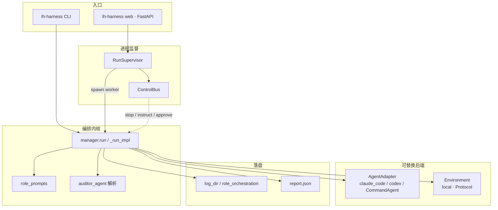
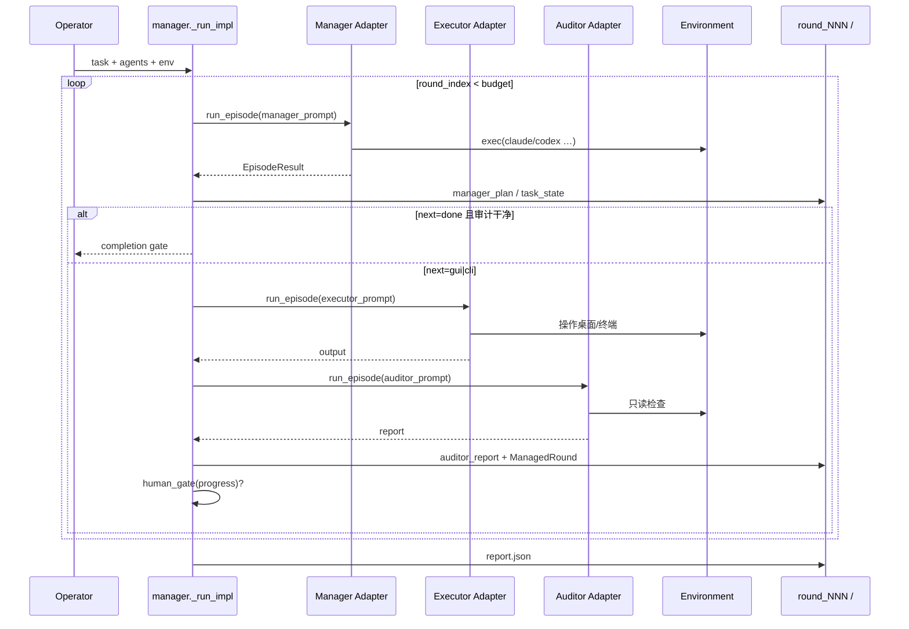
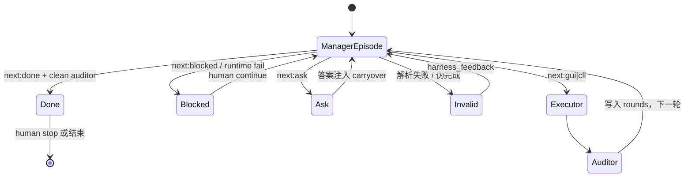

# LongHorizon-Harness — 核心运行时（架构层）

> 逐函数走读见 [source/](./source/README.md)。本文件：设计公理、模块图、E2E。  
> 源码根：`src/lh_harness/`

---

## §0 架构思考：这个 Harness 在解决什么？

### 0.1 问题

单次 Agent（Claude Code / Codex）在长任务上会：

- 上下文爆掉 → 遗忘目标与已完成项  
- 自报「完成」但桌面/文件实际未达标  
- GUI 与 CLI 混用时状态分裂  

**LongHorizon-Harness（LHH）** 不改 Agent 内部 Tool Loop，而是在外层固定：

> **规划（Manager）→ 执行（Executor，全新上下文）→ 独立验证（Auditor）→ 只保存通过验证的进度 → 重复。**

### 0.2 核心公理

| # | 公理 | 操作化 |
|---|------|--------|
| 1 | **可信进度 = Auditor 报告，不是 Executor 口述** | Manager 下一轮读的是报告/任务状态，不是 raw trajectory |
| 2 | **完成必须有证据** | `Next: done` 且上一轮 Auditor `clean + complete`，否则合成 invalid 反馈 |
| 3 | **每角色 episode 独立** | `AgentAdapter.run_episode(prompt, env, budget)`；默认全新上下文 |
| 4 | **Harness 状态落盘** | `~/.lh-harness` 账本 + 每 round 目录；崩溃也要有 terminal `report.json` |
| 5 | **后端可换** | Protocol：`AgentAdapter` + `Environment`；角色可绑不同模型/后端 |

### 0.3 与 DeepSeek Harness 的差（对照）

| | DeepSeek Harness | LongHorizon-Harness |
|--|------------------|---------------------|
| 内核 | 自研 Turn/Step + SessionEvent | **编排外环**；内环是外部 CLI Agent |
| 真源 | SessionEvent 日志投影 | **Manager 维护的 task_state + Auditor 报告** + events.jsonl |
| 扩展 | Cordis 插件 / Seam | Adapter / Env / Plugin（computer-use） |
| 语言 | TypeScript | Python + TS 前端 |

两者都是「Harness」，但 LHH 是 **MEA（Manager–Executor–Auditor）外环工程**，不是可替换的自研 Tool Loop。

---

## §1 模块设计图



### 包职责（`src/lh_harness/`）

| 模块 | 职责 |
|------|------|
| `manager.py` | **四角色闭环内核**（约 2.2k 行） |
| `role_prompts.py` | 构造/解析 Manager·Executor·Auditor Prompt |
| `auditor_agent.py` | 报告文本 → `AuditReport`、只读违规、删除账本 |
| `adapters/` | 把 prompt 变成 `claude`/`codex` 等 CLI 进程 |
| `environment/` | `exec` / `screenshot` / upload·download |
| `supervisor/` | Web/多 run：创建、信号、幂等、生命周期 |
| `webapi/` | FastAPI + 事件推送 |
| `dashboard/` | 人机门禁状态机（审批/追问） |
| `plugins/` | computer-use 插件安装与配置 |
| `cli.py` | 命令行与 doctor / plugin / run |

---

## §2 端到端：一轮 Round



---

## §3 状态机（Manager `next_step`）



路由解析：`parse_role_manager_next_step`（`role_prompts.py`）——只认显式 `Next: gui|cli|done|blocked|ask`（中英），否则 `invalid`。

---

## §4 可信状态流

```text
原始 task（不变）
  + current_task_state / task_contract（从 Manager 计划抽取，跨轮保留）
  + rounds[].auditor_report（仅被引用的报告进 Executor/Auditor 上下文）
  + harness_feedback（无效完成 / 无效计划 / 运行时失败）
  ≠ Executor raw trajectory（Manager 刻意不看）
```

磁盘侧每轮还有完整轨迹供人审；**编排决策面**刻意收窄。

---

## §5 权衡

| 选择 | 得到 | 付出 |
|------|------|------|
| 外环三角色 | 长程可恢复、验收独立 | 每轮 2–3 次完整 Agent 启动，成本高 |
| 自然语言控制头 | 任意后端只要能出文本 | 解析脆弱 → format repair / invalid 路径 |
| 文件系统账本 | 崩溃可查、Supervisor 可判终态 | 路径/权限/符号链接需硬化 |
| Adapter 薄封装 | 保留原生 Agent 能力 | 依赖外部 CLI 版本与权限模型 |

---

## §6 读源码地图

1. `types.py` — `ManagedRound` / `AuditReport` / `HarnessConfig`  
2. `manager.py` — `run` → `_run_impl` while 循环  
3. `role_prompts.py` — build + `parse_role_manager_next_step`  
4. `adapters/cli_agent.py` — prompt 文件 + `env.exec`  
5. `auditor_agent.py` — `audit_report_from_episode_result`  
6. `supervisor/service.py` — `create_run` / stop / resume  

详细走读：[source/01-manager-loop.md](./source/01-manager-loop.md)
