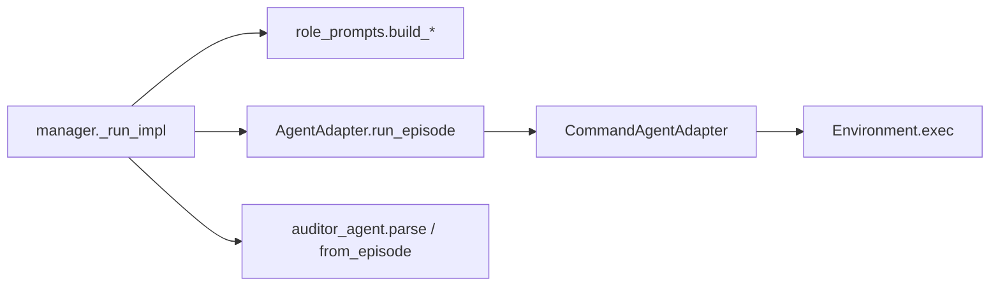

# 02 — Adapter / Environment / Auditor / 路由解析

> `adapters/base.py` · `cli_agent.py` · `claude_code.py` · `codex.py`  
> `environment/base.py` · `local.py`  
> `role_prompts.py` · `auditor_agent.py`

---

## 1. 两个 Protocol：可替换边界

### 1.1 `AgentAdapter`

```9:17:src/lh_harness/adapters/base.py
@runtime_checkable
class AgentAdapter(Protocol):
    async def run_episode(
        self,
        prompt: str,
        env: Environment,
        budget: EpisodeBudget,
        live_trajectory_path: str | None = None,
    ) -> EpisodeResult: ...
```

**一集 = 一次全新上下文的 Agent 运行**（对外部 CLI 而言通常是一次进程）。  
Harness 不调用模型 API；只塞 prompt、收 `EpisodeResult`。

### 1.2 `Environment`

```8:21:src/lh_harness/environment/base.py
@runtime_checkable
class Environment(Protocol):
    async def exec(self, command: str, timeout: int = 30, tee_path: str | None = None) -> ExecResult: ...
    async def screenshot(self) -> bytes: ...
    async def upload(self, local_path: str, remote_path: str) -> None: ...
    async def download(self, remote_path: str, local_path: str) -> None: ...
```

本地实现：`environment/local.py`（进程组、tee 轨迹、截图等）。  
评测仓可换 Docker/SSH（见 `eval/*/cua-harness`），**编排内核不改**。

---

## 2. `CommandAgentAdapter.run_episode`（通用 CLI 路径）

Claude Code / Codex 适配器都建立在「写 prompt 文件 + 拼命令 + `env.exec`」模式上。核心在 `cli_agent.py`：

```47:80:src/lh_harness/adapters/cli_agent.py
    async def run_episode(self, prompt, env, budget, live_trajectory_path=None) -> EpisodeResult:
        start = time.monotonic()
        prompt_path = posixpath.join(
            self.prompt_dir,
            f"{_episode_prompt_label(live_trajectory_path)}_{uuid.uuid4().hex[:12]}.md",
        )
        await write_remote_text(env, prompt_path, prompt + _hidden_paths_notice(self.hidden_paths))
        command_body = self.command_template
        for placeholder, value in (
            ("{prompt_path}", shlex.quote(prompt_path)),
            ("{timeout}", str(budget.max_duration_seconds)),
        ):
            command_body = command_body.replace(placeholder, value)
        command = f"cd {shlex.quote(self.workspace_path)} && {command_body}"
        result = await env.exec(
            command,
            timeout=budget.max_duration_seconds,
            tee_path=live_trajectory_path,
        )
```

### 源码级要点

| 细节 | 原因 |
|------|------|
| **每集唯一 prompt 文件名**（uuid） | 防并发 harness / 角色互相覆盖（注释） |
| **`str.replace` 而非 `format`** | Codex `-c` 内联 TOML 含 `{}`，format 会炸 |
| **`cd workspace && …`** | 任务作用在启动目录（与 `DEFAULT_WORKSPACE_PATH` 一致） |
| **`tee_path`** | 本地把 stdout 镜像到 `*_raw_trajectory.jsonl`，Dashboard 直播 |
| **`redact_secrets`** | 日志/可见输出脱敏 API key 等 |

返回前通常：解析可见输出、`detect_runtime_signals`、填 `EpisodeResult.metadata`。

`claude_code.py` / `codex.py`：组装具体 `command_template`、权限、模型、computer-use 插件参数；**不**实现第二套编排循环。

---

## 3. Manager 路由解析（控制面契约）

```481:499:src/lh_harness/role_prompts.py
def parse_role_manager_next_step(text: str) -> RoleNextStep:
    for line in str(text or "").splitlines():
        normalized = line.strip().strip("*").replace(" ", "").replace("　", "").lower()
        normalized = re.split(r"(?:—|–|--|//|#|[（(])", normalized, maxsplit=1)[0]
        if normalized in {..., "next:gui"}: return "gui"
        if normalized in {..., "next:cli"}: return "cli"
        if normalized in {..., "next:ask"}: return "ask"
        if normalized in {..., "next:done", "next:complete"}: return "done"
        if normalized in {..., "next:blocked"}: return "blocked"
    return "invalid"
```

**故意严格**：

- 只扫「像控制行」的行  
- `Next: done later` → **invalid**（`later` 不算 delimited 后缀）  
- `Next: done — rationale` → **done**（破折号后当注释）

配套抽取：

- `extract_role_task_state` / `extract_role_task_contract`  
- `extract_related_report_refs` → 决定 Executor/Auditor 能看到哪些历史报告  
- `build_role_*_prompt` → 中英模板 + 字数裁剪（`role_history_chars` 等）

---

## 4. Auditor：文本到 `AuditReport`

### 4.1 `audit_report_from_episode_result`

```182:215:src/lh_harness/auditor_agent.py
def audit_report_from_episode_result(result, round_index, *, language="en") -> AuditReport:
    hard_runtime_signals = hard_signal_labels(result.metadata.get("runtime_signals"))
    if result.status != "done" or hard_runtime_signals:
        return AuditReport(status="blocked", report_text=_runtime_failure_report(...), ...)
    report_text = compact_auditor_report_text(extract_auditor_report_text(...))
    if not _has_valid_control_header(report_text):
        report_text = _invalid_control_header_report(...)
    status = infer_report_status(report_text)
    integrity_status, integrity_findings = infer_integrity_findings(report_text)
    contract_audit_status = infer_contract_audit_status(report_text)
    # workspace mutation / delete ledger reconciliation ...
```

### 控制头与状态

Auditor 输出需带结构化控制头（状态 / integrity / contract）。缺失 → 合成 invalid header 报告。  

| 字段 | 含义 |
|------|------|
| `status` | `complete` / `incomplete` / `blocked` |
| `integrity_status` | `clean` / `suspect` / `violation` |
| `contract_audit_status` | 与任务契约对齐度 |
| `artifact_actions` | 删除类动作账本（violation 时） |

**只读约束**：若 metadata 标 `verifier_workspace_mutation_detected` 且非允许删除路径 → 强制 violation + blocked，并附恢复说明。这是「Auditor 不可偷偷改世界」的硬门。

### 4.2 Format repair（manager 内）

`_auditor_report_with_format_repair`：主报告格式不合格时，再用同一（或指定）auditor adapter 跑 repair prompt；取消则整轮 cancelled。  
预算用 `_format_repair_budget` 收紧，避免无限修。

---

## 5. 类型：一轮在内存里长什么样

```90:103:src/lh_harness/types.py
@dataclass
class ManagedRound:
    round_index: int
    next_step: RoleNextStep
    plan_text: str
    executor_output: str = ""
    auditor_report: str = ""
    harness_feedback: str = ""
    task_state: str = ""
    task_contract: str = ""
    related_report_refs: list[str] = field(default_factory=list)
    manager_status / executor_status / auditor_status: dict
```

`HarnessConfig`：每角色 `EpisodeBudget`、workspace、log/harness 路径、prompt 语言、各上下文字数上限、`max_total_episodes`（默认 25，硬顶 `MAX_ROUNDS=1000`）。

---

## 6. 调用关系图



---

## 7. Claude Auditor 只读：从 snapshot 到 AuditReport

```text
ClaudeCodeAdapter.run_episode(role=*auditor*)
  before = snapshot_workspace(workspace, hidden_paths)
  super().run_episode(...)           # 真正跑 claude CLI
  after = snapshot_workspace(...)
  diff = workspace_snapshot_diff(before, after)
  metadata |= diff
  if snapshot_errors: status = error   # 查不了就 fail-closed

manager
  → auditor_report_with_format_repair
  → parse_audit_report / audit_report_from_episode_result
       if verifier_workspace_mutation_detected:
            非允许删除路径 → integrity=violation, status=blocked
            文案要求 Executor 修复
```

**允许删除**走 `_allowed_auditor_delete_paths` + `_reconcile_deletion_actions`：声明与确认路径对齐才进 artifact ledger。  
这不是「提示词要求只读」——是 **前后快照差分**，提示词撒谎也挡得住。

---

## 8. `build_role_executor_prompt` 里的语义边界（摘录）

Executor 英文模板明确：

- Durable files 属于 workspace，**不是** harness run-record 目录  
- 必须报告 **可被 Auditor 独立验证** 的路径与可见状态  
- harness prompts/trajectories/logs **不是**成功证据  
- 只完成子任务；缺上下文则 stop，不要全局重规划  

这些句子与 PART1「决策面/操作员面」分离是同一设计的 Prompt 侧表达。

---

## 9. LocalEnvironment.exec 硬化（与 Adapter 的交接）

| 机制 | 作用 |
|------|------|
| stdout/stderr 有界尾 | 防巨型 tool 结果 OOM |
| tee `O_NOFOLLOW` + 私有 regular file | 防 symlink 把轨迹导出 run |
| process group | Supervisor stop 可杀干净 |
| StreamingTrajectoryArtifactWriter | 直播抽截图给 Dashboard |

Adapter 不关心这些；它只传 `tee_path`。换 SSH Environment 时需自行保证等价安全属性。

---

## 10. 调试

| 现象 | 查 |
|------|-----|
| prompt 互相覆盖 | uuid 文件名是否还在 |
| Codex 命令炸 | 是否误用 `.format` |
| 路由总 invalid | 缺 `Next:` 行；`done later` 类散文 |
| Auditor 总 blocked | 控制头；runtime_signals；mutation diff |
| 快照 error | 权限/隐藏路径导致 inspect 失败 |
| 截图空 | `screenshot()` 平台权限；GUI 角色是否调用 |

下一篇：[03-supervisor-web.md](./03-supervisor-web.md)
