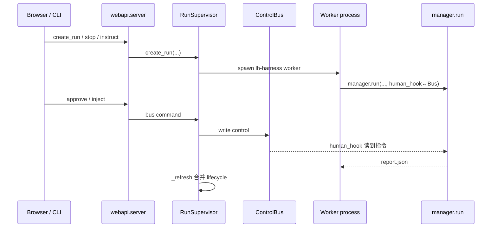

# 03 — Supervisor / Web / CLI 进程边界

> `supervisor/service.py`（`RunSupervisor`）· `control_bus.py` · `lifecycle.py`  
> `webapi/server.py` · `cli.py`（run / web / attach）

---

## 0. 为什么需要 Supervisor？

`manager.run` 是 **单进程编排内核**。Web / 多任务需要：

- 为每个 run 建目录、spawn worker  
- stop / abort / resume / 审批注入  
- 崩溃后根据磁盘产物判断终态（不能只看「进程还在不在」）  
- 幂等创建，避免双点产生两个 worker  

`RunSupervisor` 管 **进程与控制面**；**不**重写 MEA 循环。

---

## 1. 分层



---

## 2. `RunSupervisor` 关键方法（行为级）

| 方法 | 做什么 |
|------|--------|
| `create_run` | 校验、幂等键、写 task、spawn `_worker_command` |
| `attach_run` | 附着已有 run 目录（CLI attach） |
| `status` / `list_run_items` | 读 status + 存活探测 |
| `stop` / `abort` | 信号进程组（`_signal`） |
| `resume` | 在安全条件下重启 worker |
| `shutdown` | 优雅停所有 |
| `_refresh` | 合并进程存活、report.json、pending approval |

`_terminal_status_for_exit` / `_merge_lifecycle_status`：把 exit code、report 字段、是否缺 completion evidence 合成对外 status——对应 manager 的「必须有 terminal record」契约。

### 身份与安全

- `_validate_run_id`、`_assert_run_scope`：路径穿越防护  
- `_process_identity` / pid start time：防 PID 复用误杀  
- `IdempotencyConflict`：同键不同指纹冲突  

---

## 3. ControlBus 与 human_hook

Dashboard 审批 / 追问 / 注入指令不直接调 manager 内部函数，而是：

1. API 写入 ControlBus（按 run）  
2. worker 里 `human_hook`（见 cli `_run_with_attached_control`）轮询/等待总线  
3. 返回 `{"action":"continue"|"stop", "instructions":..., "extra_rounds":...}`  
4. `_human_gate` 更新 `_GateContext`（carryover、budget、final_response）

这与 manager 文档中的 end-of-round gate 一一对应。

---

## 4. CLI 入口（概念）

`cli.py`（约 2k 行）职责：

- `run`：组装 adapters（claude/codex）、LocalEnvironment、调用 `manager.run`  
- `web`：起 FastAPI + 静态前端  
- `doctor` / `plugin` / `init`：环境与 computer-use 插件  
- attach 控制：与 Supervisor 共用总线语义  

Worker 命令由 Supervisor `_worker_command` 拼出，保证 Web 创建的 run 与 CLI 同内核。

---

## 5. WebAPI 事件

`webapi/events.py` / `snapshot.py`：把 `events.jsonl`、轨迹 tee、status 投影成前端 `runFeed` 可消费的帧。  
前端：`frontend/core`（纯 TS 视图模型）+ `frontend/web`（Vite UI）。

**真源仍在磁盘**；浏览器是投影。刷新应能从 run 目录重建。

---

## 6. 与内核的契约清单

| Supervisor 期望 | Manager 保证 |
|-----------------|--------------|
| 终态有 `report.json` | `run()` 崩溃护栏 + 正常 `_final_report` |
| events 可跟随进度 | `_append_event` / `progress` |
| 可取消 | `CancelledError` → episode cancelled / abort_reason |
| 完成可信 | `completion_satisfied` 仅在干净审计后 |

若改 manager 终态字段，必须同步 `_terminal_status_for_exit` 与前端 statusView。

---

## 7. create_run → worker → report 证据链

```text
UI/API create_run(task, role configs, idempotency_key)
  RunSupervisor._create_run_once
    写 run 目录 / task 文件 / 初始 status
    spawn _worker_command  →  子进程进入 cli 组装 → manager.run
manager.run
  成功 → report.json + role_harness_done
  异常 → _write_terminal_failure → 仍有 report.json
Supervisor._refresh
  读 pid 存活 + report 字段 + pending approval
  _merge_lifecycle_status → 对外 status
```

若 worker 被 `kill -9` 且来不及写 report：Supervisor 只能报「异常退出/无证据」类状态——这正是「exit code 不够」的场景；产品上应避免硬杀，走 `stop`/`abort` 让 CancelledError 路径落盘。

---

## 8. 与 PART1 完成门禁的衔接

| Manager 写出 | Supervisor 应如何读 |
|--------------|---------------------|
| `completion_satisfied: true` | 才可对外 complete |
| `abort_reason: provider_*` | 映射 failed + 展示 `failure_reason` |
| `abort_reason: manager_blocked` | blocked |
| 有 complete 外观但缺审计证据 | `_missing_completion_evidence` 降级 |

改 `_latest_auditor_is_clean_complete` 时，同步检查 Supervisor 与前端 statusView。

---

## 9. 调试

| 现象 | 查 |
|------|-----|
| Web 显示 completed 但任务失败 | report 是否缺失；`_missing_completion_evidence` |
| stop 杀错进程 | pid identity / process group |
| 注入指令无效 | Bus → human_hook → `human_instructions.txt` / manager_input |
| 双 worker | idempotency fingerprint |
| attach 后无控制 | `can_control` / run scope |

返回：[source/README.md](./README.md)
