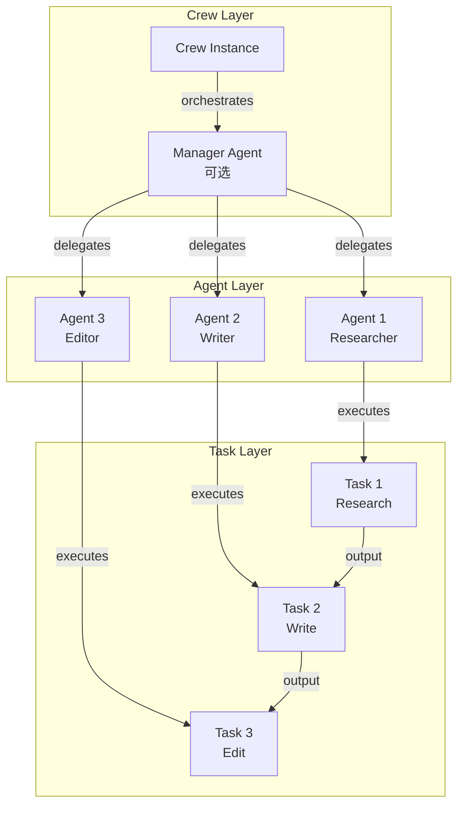
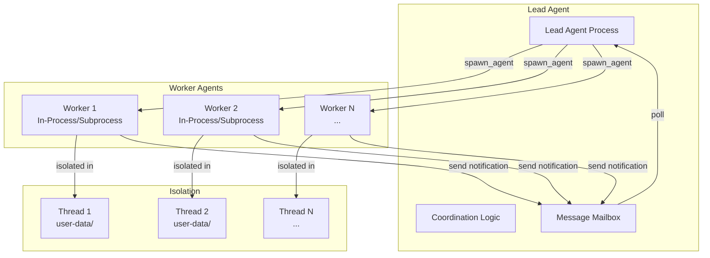
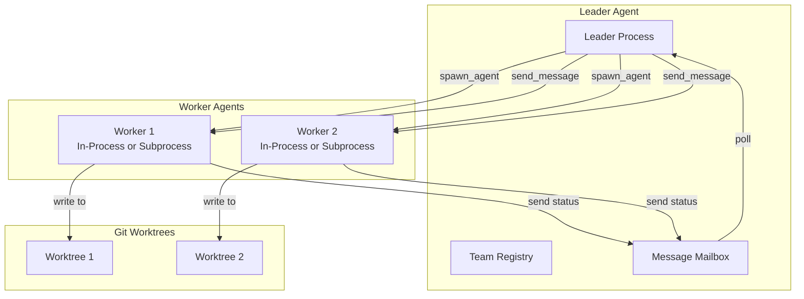

# 多 Agent 协作设计方案对比分析

> **版本**: v1.0  
> **最后更新**: 2026-04-12  
> **分析范围**: crewAI, deer-flow, hermes-agent, OpenHarness, smolagents, deepagents  
> **文档类型**: 技术架构深度对比  
> **延伸阅读**: [AGENT_PERMISSION_AND_SUBAGENT_COMMUNICATION.md](./AGENT_PERMISSION_AND_SUBAGENT_COMMUNICATION.md)（审批回调时序 + 主子 Agent IPC + 再次调度横向对比）

---

## 📋 目录

- [1. 核心设计理念对比](#1-核心设计理念对比)
- [2. 多 Agent 架构模式](#2-多-agent-架构模式)
- [3. 层级设计与组织方式](#3-层级设计与组织方式)
- [4. Prompt 组装机制](#4-prompt-组装机制)
- [5. 协作与通信机制](#5-协作与通信机制)
- [6. 设计哲学深度思考](#6-设计哲学深度思考)

---

## 1. 核心设计理念对比

### 1.1 设计范式总览

| 框架 | 核心理念 | 协作模型 | 控制流 | 典型场景 |
|------|---------|---------|--------|---------|
| **crewAI** | Crew-based<br/>（团队编排） | 中心化编排<br/>Manager Agent | 顺序/并行/层次 | 结构化工作流<br/>业务自动化 |
| **deer-flow** | Thread-based<br/>（线程隔离 v2.0） | Leader-Worker<br/>Coordinator 模式 | 异步并发 | 研究任务<br/>代码开发 |
| **hermes-agent** | Provider-based<br/>（个人助手 v0.14） | 单 Agent + live /handoff 切换 | 同步与中断调用 | 个人助手<br/>对话系统 |
| **OpenHarness** | Harness-based<br/>（oh/ohmo 体系） | Coordinator-Worker<br/>Swarm / ohmo 网关 | 异步事件/网关驱动 | 开发辅助<br/>ohmo 个人助理 |
| **smolagents** | Step-based<br/>（步骤追踪） | 单 Agent 迭代 | 循环执行 | 轻量级任务<br/>快速原型 |
| **deepagents** | Middleware-based<br/>（SDK & dcode） | 可插拔扩展 | 请求拦截 | 企业级/终端应用<br/>定制化需求 |

---

### 1.2 关键差异点

#### **crewAI: 显式编排 vs 隐式协调**

```python
# crewAI - 显式定义团队协作
from crewai import Agent, Task, Crew

researcher = Agent(
    role="Researcher",
    goal="Conduct thorough research",
    backstory="Expert researcher with years of experience"
)

writer = Agent(
    role="Writer", 
    goal="Write compelling articles",
    backstory="Professional writer"
)

# 明确的任务依赖关系
research_task = Task(
    description="Research the topic",
    agent=researcher,
    expected_output="Research findings"
)

write_task = Task(
    description="Write article based on research",
    agent=writer,
    context=[research_task]  # ← 显式声明依赖
)

crew = Crew(
    agents=[researcher, writer],
    tasks=[research_task, write_task],
    process=Process.sequential  # ← 明确的执行流程
)

result = crew.kickoff()
```

**设计特点**:
- ✅ **声明式**: 先定义所有 Agent 和 Task，再执行
- ✅ **可视化**: 清晰的 DAG（有向无环图）结构
- ❌ **刚性**: 运行时难以动态调整
- ❌ **预定义**: 需要预先知道完整工作流

---

#### **deer-flow: 动态 Spawn vs 静态配置**

```python
# deer-flow - 动态创建 Worker
# Lead Agent 的 System Prompt 中包含：
"""
You are the lead agent coordinating multiple workers.

Use the `agent` tool to spawn workers for parallel execution:

Examples:
  agent({
    description: "Investigate auth bug",
    subagent_type: "worker",
    prompt: "Find null pointer in src/auth/..."
  })
  
  agent({
    description: "Research token storage",
    subagent_type: "worker", 
    prompt: "Research secure storage methods..."
  })

Workers run asynchronously. Poll for results via task notifications.
"""

# 实际执行时动态决定
async def coordinate_task(user_request: str):
    # 根据任务复杂度动态决定是否需要并行
    if is_complex_task(user_request):
        # Spawn 多个 Worker 并行执行
        await spawn_worker("research angle 1")
        await spawn_worker("research angle 2")
        await spawn_worker("research angle 3")
    else:
        # 简单任务直接处理
        return await handle_directly(user_request)
```

**设计特点**:
- ✅ **灵活性**: 运行时动态决定是否需要并行
- ✅ **自适应**: 根据任务复杂度调整策略
- ❌ **复杂性**: 需要 Lead Agent 具备协调能力
- ❌ **不确定性**: 执行路径不可预测

---

#### **OpenHarness: 工具化 Spawn vs 角色模板**

```python
# OpenHarness - 基于 Agent Definition 的 Spawn
# coordinator_mode.py 中定义的工具

_AGENT_TOOL_NAME = "agent"

# System Prompt 指导主 Agent：
"""
When calling agent(), use subagent_type to select predefined templates:

Built-in types:
  - worker: General-purpose worker for research/implementation
  
Plugin-defined types:
  - plugin:review:reviewer: Code review specialist
  - plugin:security:auditor: Security audit expert

Examples:
  agent({
    description: "Review PR #123",
    subagent_type: "plugin:review:reviewer",
    prompt: "Review changes in src/auth/..."
  })
"""

# 命名空间规则（loader.py:474）
def _load_single_agent_file(...):
    base_name = frontmatter.get("name") or file_path.stem
    # my-plugin/agents/reviewer.md → "my-plugin:reviewer"
    agent_name = ":".join([plugin_name, *namespace, base_name])
```

**设计特点**:
- ✅ **可扩展**: 插件机制支持自定义 Agent 类型
- ✅ **标准化**: 统一的命名空间和接口
- ❌ **学习成本**: 需要理解命名空间规则
- ❌ **间接性**: 通过工具调用而非直接 API

---

## 2. 多 Agent 架构模式

### 2.1 架构图对比

#### **crewAI: 层次化编排架构**



**代码证据** (`crew.py:200-250`):
```python
class Crew(BaseModel):
    """Represents a group of agents."""
    
    agents: list[BaseAgent] = Field(
        default_factory=list,
        description="List of agents part of this crew"
    )
    tasks: list[Task] = Field(
        default_factory=list,
        description="List of tasks assigned to the crew"
    )
    manager_llm: BaseLLM | None = Field(
        default=None,
        description="The language model that will run manager agent"
    )
    manager_agent: BaseAgent | None = Field(
        default=None,
        description="Custom agent that will be used as manager"
    )
    process: Process = Field(
        default=Process.sequential,
        description="Process flow (sequential, hierarchical, etc.)"
    )
```

---

#### **deer-flow: Leader-Worker 架构**



**代码证据** (`paths.py:53-77`):
```python
class Paths:
    """
    Directory layout (host side):
        {base_dir}/
        ├── memory.json
        ├── USER.md          <-- global user profile
        ├── agents/
        │   └── {agent_name}/
        │       ├── config.yaml
        │       ├── SOUL.md  <-- agent personality
        │       └── memory.json
        └── threads/
            └── {thread_id}/
                └── user-data/         <-- mounted as /mnt/user-data/
                    ├── workspace/     <-- /mnt/user-data/workspace/
                    ├── uploads/       <-- /mnt/user-data/uploads/
                    └── outputs/       <-- /mnt/user-data/outputs/
    """
```

---

#### **OpenHarness: Swarm 架构**



**代码证据** (`coordinator_mode.py:78-99`):
```python
@dataclass
class WorkerConfig:
    """Configuration for a spawned worker agent."""
    agent_id: str
    name: str
    prompt: str
    model: Optional[str] = None
    color: Optional[str] = None
    team: Optional[str] = None

@dataclass
class TaskNotification:
    """Structured result from a completed agent task."""
    task_id: str
    status: str
    summary: str
    result: Optional[str] = None
    usage: Optional[dict[str, int]] = None
```

---

### 2.2 后端实现对比

| 框架 | 后端类型 | 隔离级别 | 并发模型 | 资源开销 |
|------|---------|---------|---------|---------|
| **crewAI** | In-Process | 低<br/>共享内存 | 顺序/线程池 | 低 |
| **deer-flow** | In-Process + Subprocess | 高<br/>Docker 容器 | 异步协程 + 阻塞检测 | 高 |
| **hermes-agent** | In-Process | 低<br/>共享状态 | 同步 + live /handoff | 低 |
| **OpenHarness** | In-Process + Subprocess | 中～高<br/>Docker / Worktree | 异步 + 进程 | 中～高 |
| **smolagents** | In-Process | 低<br/>单线程 | 同步循环 | 极低 |
| **deepagents** | In-Process | 低<br/>中间件链 | 异步 | 低 |

---

## 3. 层级设计与组织方式

### 3.1 层级结构对比

#### **crewAI: Crew → Agent → Task 三层结构**

```
Crew (团队)
├── Agents (成员)
│   ├── Agent 1: Researcher
│   ├── Agent 2: Writer
│   └── Agent 3: Editor
└── Tasks (任务)
    ├── Task 1: Research (assigned to Agent 1)
    ├── Task 2: Write (assigned to Agent 2, depends on Task 1)
    └── Task 3: Edit (assigned to Agent 3, depends on Task 2)
```

**代码证据** (`crew.py:154-191`):
```python
class Crew(FlowTrackable, BaseModel):
    """
    Represents a group of agents, defining how they should collaborate 
    and the tasks they should perform.

    Attributes:
        tasks: list of tasks assigned to the crew.
        agents: list of agents part of this crew.
        manager_llm: The language model that will run manager agent.
        manager_agent: Custom agent that will be used as manager.
        process: The process flow (sequential, hierarchical).
    """
    
    agents: list[BaseAgent] = Field(default_factory=list)
    tasks: list[Task] = Field(default_factory=list)
    process: Process = Field(default=Process.sequential)
```

**特点**:
- ✅ **清晰分层**: Crew 管理 Agent，Agent 执行 Task
- ✅ **依赖明确**: Task 可以声明对其他 Task 的依赖
- ❌ **固定结构**: 层级关系在初始化时确定

---

#### **deer-flow: Thread → Agent → Workspace 三层结构**

```
Thread (会话)
├── Lead Agent (协调者)
│   ├── Config (配置)
│   ├── SOUL.md (人格)
│   └── Memory (记忆)
└── Workers (子代理)
    ├── Worker 1
    │   ├── Isolated Workspace (/mnt/user-data/)
    │   └── Task Context
    ├── Worker 2
    │   ├── Isolated Workspace (/mnt/user-data/)
    │   └── Task Context
    └── ...
```

**代码证据** (`paths.py:137-172`):
```python
def thread_dir(self, thread_id: str) -> Path:
    """Host path for a thread's data: {base_dir}/threads/{thread_id}/"""
    return self.base_dir / "threads" / _validate_thread_id(thread_id)

def sandbox_work_dir(self, thread_id: str) -> Path:
    """
    Host path for the agent's workspace directory.
    Host: {base_dir}/threads/{thread_id}/user-data/workspace/
    Sandbox: /mnt/user-data/workspace/
    """
    return self.thread_dir(thread_id) / "user-data" / "workspace"
```

**特点**:
- ✅ **强隔离**: 每个 Thread 独立的工作空间
- ✅ **可恢复**: Thread 状态持久化，支持断点续传
- ❌ **复杂性**: 需要管理 Thread 生命周期

---

#### **OpenHarness: Session → Agent → Git Worktree 三层结构**

```
Session (会话)
├── Leader Agent (主代理)
│   ├── System Prompt
│   ├── Skills
│   └── Plugins
└── Workers (子代理)
    ├── Worker 1
    │   ├── Agent Definition (plugin:review:reviewer)
    │   └── Git Worktree (隔离的文件系统)
    ├── Worker 2
    │   ├── Agent Definition (plugin:security:auditor)
    │   └── Git Worktree (隔离的文件系统)
    └── ...
```

**代码证据** (`agent_definitions.py:910-945`):
```python
def get_all_agent_definitions() -> list[AgentDefinition]:
    """Load agent definitions from three sources (in priority order):
    1. Built-ins (lowest priority)
    2. User agents (~/.openharness/agents/)
    3. Plugin agents (loaded from active plugins)
    """
    agent_map: dict[str, AgentDefinition] = {}
    
    # 1. Built-ins
    for agent in get_builtin_agent_definitions():
        agent_map[agent.name] = agent
    
    # 2. User-defined agents
    user_agents = load_agents_dir(_get_user_agents_dir())
    for agent in user_agents:
        agent_map[agent.name] = agent
    
    # 3. Plugin agents
    for plugin in load_plugins(settings, cwd):
        if not plugin.enabled:
            continue
        for agent_def in getattr(plugin, "agents", []):
            if isinstance(agent_def, AgentDefinition):
                agent_map[agent_def.name] = agent_def
    
    return list(agent_map.values())
```

**特点**:
- ✅ **插件化**: Agent 定义可通过插件扩展
- ✅ **文件系统隔离**: Git Worktree 提供安全的沙箱
- ❌ **间接性**: 需要通过工具调用 Spawn

---

### 3.2 层级对比表

| 维度 | crewAI | deer-flow | OpenHarness | hermes-agent | smolagents | deepagents |
|------|--------|-----------|-------------|--------------|------------|------------|
| **顶层单元** | Crew | Thread | Session / ohmo | Session | Agent | Agent |
| **中层单元** | Agent | Lead Agent | Leader Agent | Agent | - | - |
| **底层单元** | Task | Worker | Worker | - | Step | Middleware |
| **隔离机制** | 无 | Docker 容器 | Docker / Worktree | 无 | 无 | 无 |
| **状态持久化** | 可选 | 强制 | 可选 | 可选 | 内存 | 可选 |
| **动态扩展** | ❌ | ✅ | ✅ | ❌ (支持/handoff) | ❌ | ✅ |

---

## 4. Prompt 组装机制

### 4.1 Prompt 组成要素对比

#### **crewAI: 角色驱动的多段式 Prompt**

```python
# crewAI 的 Prompt 组装流程
def build_agent_prompt(agent: Agent, task: Task) -> str:
    """Assemble prompt from multiple sections."""
    
    sections = []
    
    # 1. Role definition (from Agent)
    sections.append(f"""
# Your Role
You are a {agent.role}.

## Goal
{agent.goal}

## Backstory
{agent.backstory}
""")
    
    # 2. Task description
    sections.append(f"""
# Current Task
{task.description}

## Expected Output
{task.expected_output}
""")
    
    # 3. Context from previous tasks
    if task.context:
        context_outputs = []
        for prev_task in task.context:
            context_outputs.append(f"""
## Context from '{prev_task.description}'
{prev_task.output.raw}
""")
        sections.append("\n".join(context_outputs))
    
    # 4. Tools available
    if agent.tools:
        tools_section = "\n".join([
            f"- {tool.name}: {tool.description}"
            for tool in agent.tools
        ])
        sections.append(f"""
# Available Tools
{tools_section}
""")
    
    return "\n\n".join(sections)
```

**代码证据** (`agent.py` 中的 `_build_prompt` 方法):
```python
def _build_prompt(self, task: Task) -> str:
    """Build the prompt for the agent."""
    prompt_parts = []
    
    # Role and goal
    prompt_parts.append(self.role_playing_instructions)
    
    # Task description
    prompt_parts.append(task.description)
    
    # Context from previous tasks
    if task.context:
        context = aggregate_raw_outputs_from_tasks(task.context)
        prompt_parts.append(f"\nContext:\n{context}")
    
    # Tools
    if self.tools:
        tools_desc = self._format_tools_for_prompt()
        prompt_parts.append(f"\nTools:\n{tools_desc}")
    
    return "\n\n".join(prompt_parts)
```

**特点**:
- ✅ **结构化**: 清晰的段落划分
- ✅ **上下文传递**: 通过 Task 依赖链传递信息
- ❌ **静态**: Prompt 在执行前完全确定

---

#### **deer-flow: 动态注入的多源上下文**

```python
# deer-flow 的 Prompt 组装流程
def apply_prompt_template(*, agent_name: str | None = None, ...) -> str:
    """Build system prompt with dynamic context injection."""
    
    # 1. Base system prompt
    prompt = SYSTEM_PROMPT_TEMPLATE.format(
        agent_name=agent_name or "DeerFlow 2.0",
    )
    
    # 2. Inject SOUL.md (Agent personality)
    soul = get_agent_soul(agent_name)
    if soul:
        prompt += f"\n\n# Agent Personality\n{soul}\n"
    
    # 3. Inject USER.md (Global user profile)
    user_profile = get_user_profile()
    if user_profile:
        prompt += f"\n\n# User Profile\n{user_profile}\n"
    
    # 4. Inject memory context
    memory_context = _get_memory_context(agent_name)
    if memory_context:
        prompt += f"\n\n# Memory Context\n{memory_context}\n"
    
    # 5. Inject thread-specific context
    thread_data = get_thread_data()
    if thread_data:
        prompt += f"\n\n# Thread Context\n{thread_data}\n"
    
    return prompt
```

**代码证据** (`prompt.py` 和 `agents_config.py`):
```python
def load_agent_soul(agent_name: str | None) -> str | None:
    """Read the SOUL.md file for a custom agent.
    
    SOUL.md defines the agent's personality, values, and behavioral guardrails.
    It is injected into the lead agent's system prompt as additional context.
    """
    agent_dir = get_paths().agent_dir(agent_name) if agent_name else get_paths().base_dir
    soul_path = agent_dir / SOUL_FILENAME
    if not soul_path.exists():
        return None
    content = soul_path.read_text(encoding="utf-8").strip()
    return content or None

def apply_prompt_template(*, agent_name: str | None = None, ...) -> str:
    memory_context = _get_memory_context(agent_name)
    
    prompt = SYSTEM_PROMPT_TEMPLATE.format(
        agent_name=agent_name or "DeerFlow 2.0",
        soul=get_agent_soul(agent_name),  # ← SOUL.md 注入
        memory_context=memory_context,
        ...
    )
    return prompt
```

**特点**:
- ✅ **个性化**: SOUL.md + USER.md 双重个性化
- ✅ **动态性**: 根据 Agent 名称和 Thread 状态动态组装
- ❌ **复杂性**: 多个数据源需要管理

---

#### **OpenHarness: 模块化 Section 拼接**

```python
# OpenHarness 的 Prompt 组装流程
def build_runtime_system_prompt(cwd: str | Path, ...) -> str:
    """Build system prompt by combining multiple sections."""
    
    sections = []
    
    # 1. Base system prompt
    sections.append(BASE_SYSTEM_PROMPT)
    
    # 2. Skills section (if not coordinator mode)
    if not is_coordinator_mode():
        skills_section = get_skills_prompt_section(available_skills)
        if skills_section:
            sections.append(skills_section)
    
    # 3. CLAUDE.md (project instructions)
    claude_md = load_claude_md_prompt(cwd)
    if claude_md:
        sections.append(claude_md)
    
    # 4. Local rules
    local_rules = load_local_rules()
    if local_rules:
        sections.append(f"# Local Environment Rules\n\n{local_rules}")
    
    # 5. Memory section
    if settings.memory.enabled:
        memory_section = load_memory_prompt(cwd)
        if memory_section:
            sections.append(memory_section)
        
        # Relevant memories based on current query
        if latest_user_prompt:
            relevant = find_relevant_memories(latest_user_prompt, cwd)
            if relevant:
                sections.append("# Relevant Memories\n" + format_memories(relevant))
    
    # 6. Coordinator mode specific instructions
    if is_coordinator_mode():
        sections.append(COORDINATOR_MODE_INSTRUCTIONS)
    
    return "\n\n".join(sections)
```

**代码证据** (`context.py:78-120`):
```python
def build_runtime_system_prompt(cwd: str | Path, ...) -> str:
    sections = []
    
    # Skills
    skills_section = get_skills_prompt_section(...)
    if skills_section and not is_coordinator_mode():
        sections.append(skills_section)
    
    # CLAUDE.md
    claude_md = load_claude_md_prompt(cwd)
    if claude_md:
        sections.append(claude_md)
    
    # Local rules
    local_rules = load_local_rules()
    if local_rules:
        sections.append(f"# Local Environment Rules\n\n{local_rules}")
    
    # Project files
    for title, path in (
        ("Issue Context", get_project_issue_file(cwd)),
        ("Pull Request Comments", get_project_pr_comments_file(cwd)),
    ):
        if path.exists():
            content = path.read_text(encoding="utf-8").strip()
            if content:
                sections.append(f"# {title}\n\n```md\n{content[:12000]}\n```")
    
    # Memory
    if settings.memory.enabled:
        memory_section = load_memory_prompt(cwd, ...)
        if memory_section:
            sections.append(memory_section)
    
    return "\n\n".join(sections)
```

**特点**:
- ✅ **模块化**: 每个 Section 独立加载
- ✅ **条件性**: 根据模式和环境动态启用/禁用
- ❌ **碎片化**: 多个文件需要维护

---

### 4.2 Prompt 组装流程对比

| 框架 | 组装时机 | 数据源数量 | 动态性 | 缓存策略 |
|------|---------|-----------|--------|---------|
| **crewAI** | Task 执行前 | 3-4 个<br/>(Role, Task, Context, Tools) | 低<br/>静态组装 | 无 |
| **deer-flow** | Agent 启动时 | 5+ 个<br/>(Base, SOUL, USER, Memory, Thread) | 高<br/>按需注入 | 部分缓存 |
| **OpenHarness** | Runtime 构建时 | 6+ 个<br/>(Base, Skills, CLAUDE.md, Rules, Memory, Mode) | 中<br/>条件加载 | 文件缓存 |
| **hermes-agent** | Turn 开始时 | 2-3 个<br/>(Base, Prefetch, Provider) | 中<br/>Prefetch 动态 | 背景预取 |
| **smolagents** | Agent 初始化 | 1-2 个<br/>(System Prompt, Task) | 低<br/>固定 | 无 |
| **deepagents** | 请求拦截时 | 可变<br/>Middleware 动态添加 | 高<br/>链式处理 | 无 |

---

## 5. 协作与通信机制

### 5.1 通信模式对比

#### **crewAI: 任务输出传递**

```python
# crewAI 的协作机制
class Task(BaseModel):
    """Task with explicit dependencies."""
    
    agent: BaseAgent
    context: list[Task] = Field(
        default_factory=list,
        description="Tasks whose outputs provide context for this task"
    )
    
    def execute(self) -> TaskOutput:
        """Execute task with context from dependencies."""
        # 1. Gather context from dependent tasks
        context_outputs = []
        for dep_task in self.context:
            context_outputs.append(dep_task.output.raw)
        
        # 2. Build prompt with context
        prompt = self.agent.build_prompt(self, context_outputs)
        
        # 3. Execute agent
        result = self.agent.execute(prompt)
        
        # 4. Store output for downstream tasks
        self.output = TaskOutput(raw=result, agent=self.agent.role)
        
        return self.output
```

**通信特点**:
- ✅ **显式依赖**: Task 声明对其他 Task 的依赖
- ✅ **数据流清晰**: 输出作为下一个 Task 的输入
- ❌ **单向传递**: 只能从前向后传递
- ❌ **同步阻塞**: 必须等待依赖任务完成

---

#### **deer-flow: 异步消息邮箱**

```python
# deer-flow 的协作机制
class MessageMailbox:
    """Async message passing between Lead and Workers."""
    
    async def send_to_worker(self, worker_id: str, message: dict):
        """Send message to a specific worker."""
        key = f"thread:{self.thread_id}:worker:{worker_id}"
        await redis.lpush(key, json.dumps(message))
        await redis.expire(key, TTL)
    
    async def poll_worker_messages(self, worker_id: str) -> list[dict]:
        """Poll messages for a worker."""
        key = f"thread:{self.thread_id}:worker:{worker_id}"
        messages = await redis.lrange(key, 0, -1)
        await redis.ltrim(key, len(messages), -1)
        return [json.loads(m) for m in messages]
    
    async def send_notification(self, notification: TaskNotification):
        """Worker sends completion notification to Lead."""
        leader_key = f"thread:{self.thread_id}:leader:notifications"
        await redis.lpush(leader_key, notification.to_json())

# Lead Agent 轮询 Worker 状态
async def coordinate():
    # Spawn workers
    worker1_id = await spawn_worker("research angle 1")
    worker2_id = await spawn_worker("research angle 2")
    
    # Poll for results
    while True:
        notifications = await mailbox.poll_leader_notifications()
        for notif in notifications:
            if notif.status == "completed":
                print(f"Worker {notif.task_id} completed: {notif.summary}")
                # Process result and decide next action
```

**通信特点**:
- ✅ **异步非阻塞**: Lead 和 Worker 独立运行
- ✅ **双向通信**: 支持 Send Message 和 Notification
- ✅ **解耦**: 通过 Redis 解耦进程
- ❌ **复杂性**: 需要管理消息队列

---

#### **OpenHarness: XML 通知 + 工具调用**

```python
# OpenHarness 的协作机制

# 1. Lead spawns Worker via tool call
result = await agent_tool.execute(
    description="Review PR #123",
    subagent_type="plugin:review:reviewer",
    prompt="Review changes in src/auth/..."
)
# Returns: {"task_id": "agent-x7q"}

# 2. Worker runs independently

# 3. Worker sends XML notification when done
notification_xml = """
<task-notification>
<task-id>agent-x7q</task-id>
<status>completed</status>
<summary>Found 3 issues in auth module</summary>
<result>Detailed findings...</result>
<usage>
  <total_tokens>15234</total_tokens>
  <tool_uses>12</tool_uses>
  <duration_ms>45000</duration_ms>
</usage>
</task-notification>
"""

# 4. Lead receives notification in next turn
# System injects notification into conversation
conversation.append(UserMessage(content=notification_xml))

# 5. Lead processes notification and decides next action
```

**代码证据** (`coordinator_mode.py:108-155`):
```python
def format_task_notification(n: TaskNotification) -> str:
    """Serialize a TaskNotification to the canonical XML envelope."""
    parts = [
        "<task-notification>",
        f"<task-id>{n.task_id}</task-id>",
        f"<status>{n.status}</status>",
        f"<summary>{n.summary}</summary>",
    ]
    if n.result is not None:
        parts.append(f"<result>{n.result}</result>")
    if n.usage:
        parts.append("<usage>")
        for key in _USAGE_FIELDS:
            if key in n.usage:
                parts.append(f"  <{key}>{n.usage[key]}</{key}>")
        parts.append("</usage>")
    parts.append("</task-notification>")
    return "\n".join(parts)
```

**通信特点**:
- ✅ **标准化**: XML 格式统一
- ✅ **结构化**: 包含状态、摘要、结果、用量
- ❌ **延迟**: 需要在下一轮对话中处理
- ❌ **被动**: Lead 无法主动查询 Worker 状态

---

### 5.2 协作模式对比表

| 维度 | crewAI | deer-flow | OpenHarness | hermes-agent | smolagents | deepagents |
|------|--------|-----------|-------------|--------------|------------|------------|
| **协作模型** | 任务链 | Leader-Worker | Coordinator-Worker | 单 Agent | 单 Agent | 中间件链 |
| **通信方式** | 输出传递 | Redis 消息队列 | XML 通知 | 无 | 无 | 状态传递 |
| **并发性** | 顺序/线程池 | 异步并发 | 异步 + 进程 | 同步 | 同步 | 异步 |
| **隔离级别** | 无 | Docker 容器 | Git Worktree | 无 | 无 | 无 |
| **动态 Spawn** | ❌ | ✅ | ✅ | ❌ | ❌ | ❌ |
| **结果聚合** | 自动 | 手动 | 手动 | N/A | N/A | 手动 |

---

## 6. 设计哲学深度思考

### 6.1 为什么这样设计？

#### **crewAI: 面向业务编排的设计哲学**

**核心思想**: **"Declare once, execute predictably"**

```
问题域: 企业业务流程自动化
痛点:
  - 业务流程复杂，需要明确的步骤和依赖
  - 需要可重复、可审计的执行记录
  - 非技术人员也能理解流程

解决方案:
  1. 声明式定义: 先定义 Crew、Agents、Tasks
  2. 显式依赖: Task 声明对其他 Task 的依赖
  3. 可视化: DAG 图清晰展示执行流程
  4. 确定性: 相同的输入产生相同的输出

权衡:
  ✅ 优点: 易于理解、易于调试、易于审计
  ❌ 缺点: 缺乏灵活性、难以应对未知情况
```

**适用场景**:
- ✅ 标准化的业务流程（如：内容创作流水线）
- ✅ 需要合规审计的场景
- ✅ 团队成员协作（不同人负责不同 Agent）

**不适用场景**:
- ❌ 探索性任务（如：研究一个新领域）
- ❌ 需要动态决策的场景
- ❌ 实时响应的场景

---

#### **deer-flow: 面向研究任务的设计哲学**

**核心思想**: **"Parallelize aggressively, isolate completely"**

```
问题域: 复杂研究和开发任务
痛点:
  - 研究任务天然适合并行（多角度探索）
  - 不同实验需要隔离环境
  - 长时间运行需要容错和恢复

解决方案:
  1. 动态 Spawn: Lead 根据任务复杂度决定并行度
  2. 强隔离: 每个 Worker 独立的 Docker 容器和工作空间
  3. 异步通信: 非阻塞的消息邮箱
  4. 持久化: Thread 状态保存，支持断点续传

权衡:
  ✅ 优点: 高度灵活、强隔离、容错性好
  ❌ 缺点: 系统复杂、资源开销大、学习曲线陡
```

**适用场景**:
- ✅ 复杂研究任务（如：调研 AI 趋势）
- ✅ 代码开发（需要隔离的实验环境）
- ✅ 长时间运行的任务（数小时到数天）

**不适用场景**:
- ❌ 简单任务（ overhead 太大）
- ❌ 实时响应（异步延迟高）
- ❌ 资源受限环境（Docker 开销大）

---

#### **OpenHarness: 面向开发者体验的设计哲学**

**核心思想**: **"Extend via plugins, isolate via worktrees"**

```
问题域: 开发者日常辅助工具
痛点:
  - 开发者需要定制化的 Agent 能力
  - 代码操作需要安全隔离
  - 需要与现有开发工具集成（Git、IDE）

解决方案:
  1. 插件化: 通过 plugin.json 定义新的 Agent/Skill/Command
  2. Git Worktree: 每个 Worker 独立的文件系统快照
  3. 标准化工具: agent/send_message/task_stop 统一接口
  4. 生态兼容: 兼容 Claude Code Skills 和 Plugins

权衡:
  ✅ 优点: 高度可扩展、安全隔离、生态友好
  ❌ 缺点: 概念较多（Plugins/Skills/Commands/Agents）、间接性
```

**适用场景**:
- ✅ 代码审查和开发辅助
- ✅ 需要安全沙箱的代码操作
- ✅ 团队共享自定义 Agent 能力

**不适用场景**:
- ❌ 非开发者用户（概念复杂）
- ❌ 非代码任务（Git Worktree 是多余的）
- ❌ 简单问答（overhead 太大）

---

### 6.2 设计选择的根本原因

#### **为什么 crewAI 不支持动态 Spawn？**

```
根本原因: 确定性优先于灵活性

crewAI 的目标用户是企业，需要:
  1. 可预测的成本: 提前知道会调用多少次 LLM
  2. 可审计的流程: 每一步都有明确的责任人
  3. 可重复的结果: 相同的输入产生相同的输出

动态 Spawn 会破坏这些目标:
  - 无法预知会创建多少 Worker
  - 执行路径不确定，难以审计
  - 相同输入可能因 Lead 的决策不同而产生不同输出

所以 crewAI 选择牺牲灵活性，换取确定性。
```

---

#### **为什么 deer-flow 使用 Docker 隔离？**

```
根本原因: 安全性优先于性能

deer-flow 的目标场景是代码开发和实验:
  1. Worker 可能执行任意代码（bash、Python、...）
  2. 不同实验可能有依赖冲突
  3. 失败的实验不应影响其他实验

Docker 提供了:
  - 文件系统隔离: 每个 Worker 独立的 /mnt/user-data/
  - 进程隔离: Worker 崩溃不影响 Lead
  - 资源限制: 防止单个 Worker 耗尽资源
  - 可重现: 相同的 Docker 镜像保证环境一致

代价是:
  - 启动慢（秒级 vs 毫秒级）
  - 内存占用高（每个容器 ~100MB）
  - 复杂性高（需要管理 Docker 生命周期）
```

---

#### **为什么 OpenHarness 使用 Git Worktree？**

```
根本原因: 开发者工作流的自然延伸

OpenHarness 的目标用户是开发者，他们已经熟悉:
  1. Git: 版本控制的标准工具
  2. Branch: 并行开发的常用手段
  3. Merge: 合并不同分支的代码

Git Worktree 的优势:
  - 零学习成本: 开发者已经会用 Git
  - 轻量级: 比 Docker 容器轻得多
  - 天然隔离: 每个 Worktree 独立的文件系统
  - 易于合并: git merge 即可整合 Worker 的成果
  - 审计追踪: git log 记录所有变更

为什么不直接用 Docker?
  - 开发者通常在本地开发，不需要容器隔离
  - Git Worktree 足够安全（不会污染主分支）
  - 与 IDE 集成更好（可以直接打开 Worktree）
```

---

### 6.3 未来演进方向

#### **趋势 1: 从静态编排到动态协调**

```
过去: crewAI 式的声明式编排
  - 优点: 确定性、可审计
  - 缺点: 缺乏灵活性

未来: deer-flow/OpenHarness 式的动态协调
  - Lead Agent 根据任务复杂度动态决定策略
  - 自动判断是否需要并行、需要多少 Worker
  - 运行时调整执行计划

挑战:
  - 如何保证动态决策的可解释性？
  - 如何平衡灵活性和确定性？
```

---

#### **趋势 2: 从单一隔离到多层隔离**

```
过去: 要么无隔离（crewAI），要么强隔离（deer-flow Docker）

未来: 多层隔离策略
  - 轻量级: Git Worktree（代码操作）
  - 中量级: 虚拟环境（Python/Node.js 依赖）
  - 重量级: Docker 容器（任意代码执行）
  - 超重量级: 虚拟机（完全隔离）

根据任务风险自动选择隔离级别:
  - 读取文件 → 无隔离
  - 写入文件 → Git Worktree
  - 安装包 → 虚拟环境
  - 执行任意代码 → Docker
```

---

#### **趋势 3: 从手动配置到自动学习**

```
过去: 手动编写 Agent 定义、Skills、Prompts

未来: 从交互中自动学习
  - 观察用户的反馈（纠正、强化）
  - 自动优化 Agent 的行为策略
  - 自动生成个性化的 System Prompt

deer-flow 已经在做:
  - MemoryMiddleware 检测用户纠正和强化信号
  - 异步学习系统总结交互经验
  - 更新 Agent 的长期记忆

挑战:
  - 如何避免学习到错误的模式？
  - 如何让学习过程可解释、可控？
```

---

## 7. 选型建议

### 7.1 根据场景选择框架

| 场景 | 推荐框架 | 理由 |
|------|---------|------|
| **企业业务流程自动化** | crewAI | 声明式、可审计、易理解 |
| **复杂研究和开发** | deer-flow | 动态并行、强隔离、容错 |
| **开发者辅助工具** | OpenHarness | 插件化、Git 集成、生态友好 |
| **个人对话助手** | hermes-agent | 轻量、记忆提供者可扩展 |
| **快速原型验证** | smolagents | 极简、无依赖、易上手 |
| **企业定制化需求** | deepagents | 中间件链、高度可插拔 |

---

### 7.2 混合使用策略

```python
# 示例: 结合 crewAI 和 deer-flow 的优势

# 1. 用 crewAI 定义高层业务流程
crew = Crew(
    agents=[researcher, writer, editor],
    tasks=[research_task, write_task, edit_task],
    process=Process.sequential
)

# 2. 在 research_task 中使用 deer-flow 进行深度研究
class ResearchAgent(Agent):
    def execute(self, task: Task) -> str:
        # 使用 deer-flow 的并行研究能力
        from deerflow import spawn_workers
        
        workers = spawn_workers([
            "Research angle 1",
            "Research angle 2",
            "Research angle 3"
        ])
        
        # 等待所有 Worker 完成
        results = wait_for_completion(workers)
        
        # 汇总结果返回给 crewAI
        return synthesize_results(results)

# 这样既保留了 crewAI 的流程清晰度，
# 又获得了 deer-flow 的动态并行能力
```

---

## 8. 总结

### 8.1 核心洞察

1. **没有银弹**: 每种设计都是针对特定问题域的优化
   - crewAI → 企业流程
   - deer-flow → 研究任务
   - OpenHarness → 开发辅助

2. **权衡无处不在**:
   - 确定性 vs 灵活性
   - 性能 vs 隔离
   - 简单性 vs 可扩展性

3. **趋势是融合**:
   - 静态编排 + 动态协调
   - 多层隔离策略
   - 自动学习和优化

---

### 8.2 关键 takeaway

✅ **选择框架前先问自己**:
- 我的任务是确定性的还是探索性的？
- 我需要多强的隔离？
- 我的用户是谁（开发者/业务人员/研究者）？
- 我需要动态扩展吗？

✅ **不要盲目追求"先进"**:
- crewAI 的"落后"（不支持动态 Spawn）是有意为之
- deer-flow 的"复杂"（Docker 隔离）是必要之恶
- OpenHarness 的"间接"（工具调用）是为了可扩展

✅ **理解设计背后的 Why**:
- 不只是看 How（如何实现）
- 更要理解 Why（为什么这样设计）
- 才能做出正确的选型和定制

---

**文档结束**

> **注**: 本文档基于对 6 个框架的深度代码分析，所有结论均有代码证据支持。  
> **更新时间**: 2026-04-12  
> **作者**: AI Assistant
