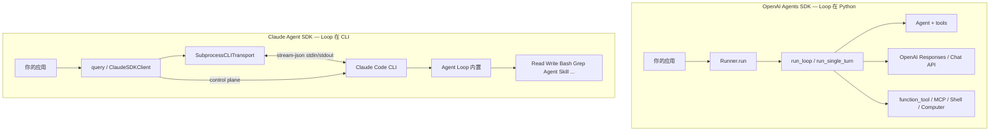
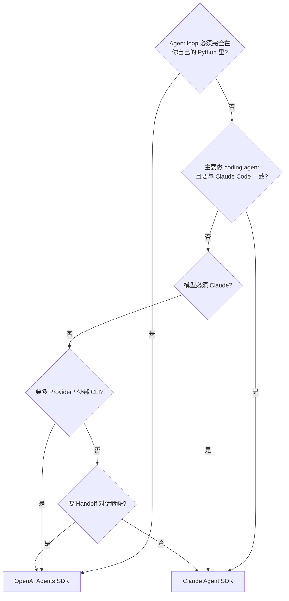

# OpenAI Agents SDK vs Claude Agent SDK 对比

> **对比对象**  
> - OpenAI Agents Python SDK **v0.17.4**（`openai-agents-python`）  
> - Claude Agent SDK Python **v0.2.88**（bundled Claude Code CLI **v2.1.161**）  
> **更新时间**: 2026-06-04  
> **方法**: 基于仓库内架构深读文档 + 源码锚点，非官方营销材料

**延伸阅读**  
- OpenAI：[OPENAI_AGENTS_SDK_README.md](../openai-agents-python/docs/OPENAI_AGENTS_SDK_README.md)  
- Claude：[CLAUDE_AGENT_SDK_GUIDE.md](../claude-agent-sdk-python/docs/CLAUDE_AGENT_SDK_GUIDE.md)  
- 三者总览：[AGENT_SDKS_COMPREHENSIVE_DESIGN_GUIDE.md](./AGENT_SDKS_COMPREHENSIVE_DESIGN_GUIDE.md)

---

## 1. 一句话定位

| SDK | 一句话 |
|-----|--------|
| **OpenAI Agents SDK** | **纯 Python 的 Agent 运行时**：`Runner` 驱动 `run_loop`，你在进程内拥有完整 loop、工具与状态。 |
| **Claude Agent SDK** | **Claude Code 的类型化遥控器**：Agent loop 在 **CLI 子进程**；Python 管配置、stream-json 协议与控制平面（hooks / SDK MCP / 权限）。 |

二者都是「帮你跑 agent loop 的 SDK」，但 **loop 跑在哪里** 是根本分歧。

---

## 2. 架构对照（核心分歧）



| 维度 | OpenAI | Claude |
|------|--------|--------|
| **Agent loop 实现位置** | `src/agents/run_internal/run_loop.py` 等（Python） | Claude Code 二进制内部 |
| **SDK 厚度** | 厚：~4 万行级 runtime + tool 执行 | 薄：~3k 行公共 API + 控制协议；能力在 CLI |
| **进程模型** | 通常单 Python 进程 | Python + **子进程 CLI**（bundled 或 PATH） |
| **模型调用** | SDK → OpenAI API（默认 Responses） | CLI → Anthropic API（SDK 不直接调模型） |

---

## 3. 总览对比矩阵

| 维度 | OpenAI Agents SDK | Claude Agent SDK |
|------|---------------------|------------------|
| **GitHub** | [openai/openai-agents-python](https://github.com/openai/openai-agents-python) | [anthropics/claude-agent-sdk-python](https://github.com/anthropics/claude-agent-sdk-python) |
| **PyPI** | `openai-agents` | `claude-agent-sdk` |
| **Python** | ≥3.10 | ≥3.10 |
| **主入口** | `Runner.run(agent, input)` | `query(...)` / `ClaudeSDKClient` |
| **配置核心** | `Agent(instructions, tools, handoffs, ...)` | `ClaudeAgentOptions(...)` (~40 字段) |
| **执行单元** | `Run` → 多 `Turn` → `RunItem[]` | 一轮 → `ResultMessage` 边界 |
| **流式** | `RunItemStreamEvent` / raw SSE | `StreamEvent` + stream-json |
| **内置 Coding 工具** | 需自建或 Sandbox/Shell 工具 | CLI 自带 Read/Write/Edit/Bash/Grep 等 |
| **自定义工具** | `@function_tool` / Python 函数 | `@tool` + **SDK 内嵌 MCP server** |
| **外部 MCP** | `HostedMCPTool` / MCP client | `mcp_servers` → CLI `--mcp-config` |
| **多 Agent** | **Handoff**（转移对话控制权） | **Agent 工具** + `AgentDefinition`（子 agent） |
| **输入/输出护栏** | `@input_guardrail` / `@output_guardrail` | **Hooks**（PreToolUse、Stop 等） |
| **工具审批** | `needs_approval` / HITL | `can_use_tool` 回调 / `permission_mode` |
| **Session** | `Session` 抽象（InMemory、OpenAI Conversations…） | CLI JSONL + `resume` / `fork_session` / `SessionStore` 镜像 |
| **Tracing** | 一等公民 Tracing / Spans | 可选 OTEL 注入 CLI；无同等 Span 体系 |
| **沙箱** | `SandboxAgent`、Docker/Daytona/Local Shell | `sandbox` settings → CLI |
| **Realtime / Voice** | 有 Realtime Agents 路径 | 无（聚焦 coding agent） |
| **模型锁定** | 设计上多提供商，心智偏 OpenAI | **Claude 模型**（经 CLI） |
| **部署依赖** | Python + API Key | Python + **claude 二进制** + API/订阅 |

---

## 4. 运行时流程对比

### 4.1 OpenAI：Run-based Execution

```
用户 input
  → Runner.run(agent, input, session=?)
  → start_streaming / run_loop
  → run_single_turn (×N)
       Phase 1: 准备输入（Session → model items）
       Phase 2: 收集 tools + handoffs
       Phase 3: 调用 LLM
       Phase 4: 解析 → RunItem
       Phase 5: NextStep → RunAgain | Handoff | FinalOutput | Interruption
  → RunResult(items, final_output)
```

**真相来源**：`RunItem` 列表（事件溯源风格），可审计、可恢复。

### 4.2 Claude：CLI + Control Plane

```
ClaudeAgentOptions
  → SubprocessCLITransport.connect()  # spawn claude
  → Query.initialize()               # hooks / agents / skills 注册
  → stdin: user JSON (stream-json)
  → CLI 内部 agent loop
  → stdout: JSONL (assistant / user / result / stream_event)
  → 并行: control_request (can_use_tool / hook_callback / mcp_message)
  → parse_message() → Message
  → ResultMessage = 一轮结束
```

**真相来源**：CLI 管理的 `~/.claude/projects/.../*.jsonl`；SDK 可选 `SessionStore` 镜像。

### 4.3 对照表

| 概念 | OpenAI | Claude |
|------|--------|--------|
| 外层循环 | `Runner` + `max_turns` | CLI `--max-turns` / `max_budget_usd` |
| 单轮边界 | 一次 model 响应 + tool 执行链 | 到 `ResultMessage` |
| 中断 | Run interruption / HITL | `client.interrupt()` control request |
| 动态改模型 | 新 Run 或 agent 配置 | `set_model()` control request |

---

## 5. API 表面对照

### 5.1 最小示例

**OpenAI**

```python
from agents import Agent, Runner

agent = Agent(name="Assistant", instructions="You are helpful.", tools=[...])
result = await Runner.run(agent, "Fix the bug in auth.py")
print(result.final_output)
```

**Claude**

```python
from claude_agent_sdk import query

async for message in query(
    prompt="Fix the bug in auth.py",
    options=ClaudeAgentOptions(allowed_tools=["Read", "Edit", "Bash"]),
):
    if hasattr(message, "result"):
        print(message.result)
```

### 5.2 交互式 / 多轮

| 需求 | OpenAI | Claude |
|------|--------|--------|
| 多轮同一上下文 | `Runner.run(..., session=session)` 多次 | `ClaudeSDKClient.connect()` + 多次 `query()` |
| 流式 UI | `Runner.run_streamed()` | `receive_messages()` / `include_partial_messages` |
| 中途用户插话 | 新 Run 或 Realtime 路径 | 双向 stdin（AsyncIterable prompt） |

### 5.3 必须用「高级客户端」的能力

| 能力 | OpenAI | Claude |
|------|--------|--------|
| 自定义 hook/拦截 | Guardrails（输入/输出） | **必须** `ClaudeSDKClient` + `hooks` |
| 程序化工具审批 | tool approval / HITL | **必须** `can_use_tool`（且 streaming prompt） |
| 进程内自定义工具 | `@function_tool` | **必须** SDK MCP（`create_sdk_mcp_server`） |

---

## 6. 工具系统

| 主题 | OpenAI | Claude |
|------|--------|--------|
| **定义方式** | Python 函数 + JSON Schema（`@function_tool`） | CLI 内置名 + SDK `@tool` 装饰器 |
| **执行位置** | Python 进程内 | 内置：CLI 进程；自定义：Python MCP server |
| **工具名** | 函数名 | 内置：`Read`…；SDK MCP：`mcp__{server}__{tool}` |
| **MCP 角色** | SDK 作为 **MCP 客户端** 连外部 server | SDK 可作 **MCP server**（in-process）+ CLI 连外部 MCP |
| **Computer / Browser** | `ComputerTool` 等 | 依赖 CLI 能力演进，非 SDK 直接暴露 |
| **Shell** | `ShellTool` + Sandbox 后端 | CLI `Bash` 工具 + `sandbox` settings |

**选型提示**  
- 要 **大量 Python 业务逻辑进 tool**：OpenAI 更直接。  
- 要 **开箱 coding 工具链 + 与 Claude Code 一致**：Claude SDK + CLI。  
- 要 **in-process 自定义 tool 且用 Claude**：Claude 的 SDK MCP 模式（非普通 Python callback）。

---

## 7. 多 Agent 协作

| 模式 | OpenAI | Claude |
|------|--------|--------|
| **机制** | **Handoff** — 当前 agent 把对话交给另一个 agent | **Agent 工具** — 主 agent 调用 `Agent`  spawn 子 agent |
| **配置** | `Agent(handoffs=[other_agent])` | `ClaudeAgentOptions(agents={"reviewer": AgentDefinition(...)})` |
| **控制权** | 接收方 agent 接管 thread | 主 agent 仍在；子 agent 有独立 transcript |
| **Also** | Agent-as-tool（manager 模式） | `background=True` 子 agent、SubagentStop hook |
| **典型场景** | 研究 → 写作 → 编辑 流水线 | 主 agent 派 reviewer / researcher 子任务 |

OpenAI 的 Handoff 是 **对话所有权转移**；Claude 的 Subagent 是 **工具化派出 worker**（更接近 nanobot 的 `spawn` 而非 OpenAI handoff）。

---

## 8. Session、记忆与上下文

| 主题 | OpenAI | Claude |
|------|--------|--------|
| **Session API** | `Session` 协议 + 多种实现 | `resume` / `continue_conversation` / `session_id` |
| **持久化** | 内存、OpenAI Conversations、自定义 | CLI JSONL 文件 |
| **压缩** | `OpenAIConversationsSession` compaction | CLI 内 PreCompact + `PreCompact` hook |
| **Fork** | 新 session / 新 Run | `fork_session=True` 或 `fork_session()` 离线 |
| **外部存储** | 自建 Session backend | `SessionStore` + `--session-mirror` |
| **跨进程** | 同一 Python 服务内 | CLI 子进程；镜像到 Redis/S3/Postgres（examples） |

OpenAI 的 Session 是 **SDK 一等抽象**；Claude 的 Session **以 CLI 为准**，SDK 做 resume/镜像/离线 fork。

---

## 9. 安全、权限与护栏

| 主题 | OpenAI | Claude |
|------|--------|--------|
| **输入审查** | `input_guardrails`（可并行） | `UserPromptSubmit` hook |
| **输出审查** | `output_guardrails` | 无对称 guardrail；可用 Stop hook |
| **工具前拦截** | guardrail + approval | `PreToolUse` hook |
| **工具后处理** | 无内置 | `PostToolUse` / `PostToolUseFailure` |
| **权限模式** | `needs_approval` on tools | `permission_mode`（default / acceptEdits / bypassPermissions / plan …） |
| **程序化审批** | HITL 流程 | `can_use_tool(name, input, context)` |
| **沙箱** | SandboxAgent、network 隔离 | CLI `sandbox` 配置 |

OpenAI 偏 **声明式 Guardrail + Run 中断**；Claude 偏 **Hook 生命周期 + CLI 权限模型**（与 Claude Code 产品一致）。

---

## 10. 可观测性与调试

| 主题 | OpenAI | Claude |
|------|--------|--------|
| **Tracing** | Built-in tracing、Span 层次、导出 JSON | OTEL 可选注入子进程 |
| **流式事件** | `RunItemStreamEvent`（tool_called、handoff…） | `StreamEvent`（partial API events） |
| **日志** | 应用层 + trace processor | CLI stderr 可回调；SDK debug logging |
| **Replay** | RunItem 历史 | JSONL transcript + `get_session_messages()` |

---

## 11. 依赖、部署与运维

| 主题 | OpenAI | Claude |
|------|--------|--------|
| **核心依赖** | `openai`, `pydantic`, `griffelib` | `anyio`, `mcp` |
| **外部二进制** | 无 | **claude**（wheel 内 bundled 或系统安装） |
| **版本耦合** | SDK ↔ OpenAI API 版本 | SDK ↔ **CLI 最低 2.0.0**（bundled 2.1.161） |
| **容器化** | 单 Python 镜像 | Python 镜像 + CLI 可执行文件 + 权限 |
| **无头 CI** | API Key 即可 | 需 CLI + 认证；e2e 测 credentials |
| **子进程孤儿** | 无 | `atexit` 杀 CLI 子进程 |

---

## 12. 选型决策树



### 12.1 选 OpenAI Agents SDK 当…

- 嵌入现有 **Python 服务**，不想管 CLI 子进程  
- 需要 **Handoff**、Guardrail、Tracing 等 **SDK 内完整运行时**  
- 使用 **Responses API**、Sandbox Agent、Realtime 等 OpenAI 栈能力  
- 工具主要是 **Python 函数** 或标准 MCP client  
- 团队已熟悉 `Agent` + `Runner` 心智模型  

### 12.2 选 Claude Agent SDK 当…

- 要做 **Claude Code 同级** 的读文件 / 改代码 / Bash agent  
- 希望 **产品级 coding 工具** 由 Anthropic 维护，而非自建 ShellTool  
- 需要 **Hooks** 深度介入 tool 生命周期（与 Claude Code 一致）  
- 接受 **CLI 子进程** 与 Claude 模型绑定  
- 需要 **Managed Agents** 之外的自托管，但仍要 Code 能力  

### 12.3 两者可组合（非二选一）

- 后端 **OpenAI** 做编排/API 网关，特定 coding 任务 **子进程调 Claude SDK**  
- 注意：**两套 Session 模型不互通**，需应用层桥接  

---

## 13. 概念映射（迁移心智）

| OpenAI 概念 | Claude 近似 |
|-------------|-------------|
| `Runner.run()` | `query()` / `ClaudeSDKClient.receive_response()` |
| `Agent` | `ClaudeAgentOptions` + CLI `--system-prompt` |
| `RunItem` | `Message` 流 + `ResultMessage` |
| `@function_tool` | `@tool` + SDK MCP server |
| `handoff()` | `AgentDefinition` + CLI Agent 工具 |
| `input_guardrail` | `UserPromptSubmit` / `PreToolUse` hook |
| `Session` | `resume` + JSONL / `SessionStore` |
| `max_turns` | `max_turns` option → CLI flag |
| `RunResult.final_output` | `ResultMessage.result` |
| Tracing span | OTEL / 自建日志（无直接等价） |

---

## 14. 与 nanobot 的三角关系（简表）

| 维度 | OpenAI SDK | Claude SDK | nanobot |
|------|------------|------------|---------|
| Loop 位置 | Python | CLI | Python (`AgentRunner`) |
| 渠道 | 无 | 无 | 15+ IM + WebUI |
| Coding 工具 | 自建/Sandbox | CLI 内置 | filesystem/shell/web |
| 定位 | 通用嵌入 SDK | Claude Code 编程 SDK | 自托管个人助手 |

详见 [NANOBOT_README.md](../nanobot/docs/NANOBOT_README.md)。

---

## 15. 文档索引

| 项目 | 入口 |
|------|------|
| OpenAI 架构 | [openai-agents-python/docs/OPENAI_AGENTS_SDK_README.md](../openai-agents-python/docs/OPENAI_AGENTS_SDK_README.md) |
| Claude 架构 | [claude-agent-sdk-python/docs/CLAUDE_AGENT_SDK_GUIDE.md](../claude-agent-sdk-python/docs/CLAUDE_AGENT_SDK_GUIDE.md) |
| 四 SDK 总指南 | [AGENT_SDKS_COMPREHENSIVE_DESIGN_GUIDE.md](./AGENT_SDKS_COMPREHENSIVE_DESIGN_GUIDE.md) |
| 源码级深读 | [AGENT_SDKS_SOURCE_LEVEL_DEEP_DIVE.md](./AGENT_SDKS_SOURCE_LEVEL_DEEP_DIVE.md) |

---

**变更记录**

| 日期 | 说明 |
|------|------|
| 2026-06-04 | 初版：OpenAI v0.17.4 vs Claude SDK v0.2.88 |
