# SmolAgents 系统底层设计深度分析

> **项目**: HuggingFace SmolAgents  
> **分析范围**: `src/smolagents/` 核心源码（以 **smolagents 1.24.x** 的 `agents.py` 为准；发行版升级后行号与细节可能略有差异）  
> **文档说明**: 若 **Memory / Step / LLM 联动** 或 **主流程** 不清晰，请先读 **§2.0**。下文 **§2.1.7** 为 `MultiStepAgent` 与子类 **源码级**路径；与早期草稿冲突时以 **§2.1.7** 为准。  
> **整理说明（2026-04）**: 正文含 **Mermaid** 流程图/时序图（**ReAct**、**run→_run_stream→_step_stream**、两子类分歧等）。请使用支持 Mermaid 的预览（如 **GitHub/GitLab**、**VS Code** + Markdown 插件、**Obsidian**、**MkDocs mermaid**）；纯文本下将显示为代码块。  
> **审查状态（2026-04-29）**: 已与 smolagents 1.24.x 源码逐一比对，核心架构、Memory/Step/Prompt 流程描述均准确。smolagents Memory 深潜已合并至 **OpenHarness/docs/framework-comparison/06-memory.md**。  
> **注意**：本文档若未纳入 Git，误删难以从远端恢复；重要版本请 `git add` 或依赖编辑器本地历史。

### 相关文档索引

#### Memory 深潜文档（`OpenHarness/docs/framework-comparison/`）

| 文档 | 用途 |
|------|------|
| **[06-memory.md](../../OpenHarness/docs/framework-comparison/06-memory.md)** | smolagents Memory 系统深潜（AgentMemory、5 种 MemoryStep、to_messages 转换链路、读写时机、上下文管理、MCP 集成、CallbackRegistry、与 OpenHarness/OpenAI Agents 框架对比） |

#### 同目录下 Prompt / 运行时文案专项文档索引（`examples/`）

以下与 **本文（架构）** 互补：**架构讲控制流与模块；专项文档讲模板全文或「展开后的 LLM 视角」**。以仓库内 **`smolagents/src/smolagents/prompts/*.yaml`** 或你安装的包为准做版本核对。

| 文档 | 用途 |
|------|------|
| **`smolagents-runtime-prompts-complete.md`** | 运行时 **完整 Prompt 示例（英文）**：Code / Structured Code / ToolCalling、**Planning**、Managed Agent 等，含动态注入说明。 |
| **`smolagents-runtime-prompts-zh.md`** | 同上思路的 **中文版**（便于从 LLM 视角通读）。 |
| **`smolagents-prompts-reference.md`** | 对齐 **`code_agent.yaml` / `toolcalling_agent.yaml` 等** 的 **模板参考（英文）**，含对比与自定义指南。 |
| **`smolagents-prompts-reference-zh.md`** | 同上 **中文版**（模板译文 + 结构说明）。 |
| **`smolagents-multistepagent-open-deep-research-walkthrough.md`** | 结合 **`open_deep_research/custom_model.py`** 的 **执行与 LLM 调用推演**（非 prompt 全文）。 |
| **[guides/deepagents-prompt-architecture.md](../../OpenHarness/docs/guides/deepagents-prompt-architecture.md)** | 针对 **Deep Agents / `examples/deep_research`** 的 Prompt 与 middleware 分析，**不是 SmolAgents 包内默认 prompt 的权威来源**，勿与上表混淆。 |

---

## 一、系统架构总览

### 1.1 核心设计理念

SmolAgents 是一个**轻量级但功能完整的 Agent 框架**，采用以下核心设计原则：

1. **极简主义（Minimalism）**: 代码精简，依赖最少
2. **ReAct 范式**: Thought → Action → Observation 循环
3. **双模式执行**: CodeAgent（代码执行）vs ToolCallingAgent（工具调用）
4. **沙箱安全**: 本地 Python 解释器 + 远程执行器
5. **可序列化**: Agent/Tool 可保存、加载、推送到 Hub

### 1.2 模块架构图

```
smolagents/
├── agents.py              # Agent 核心逻辑（MultiStepAgent, CodeAgent, ToolCallingAgent）
├── tools.py               # 工具系统（Tool, BaseTool, ToolCollection）
├── models.py              # 模型抽象层（Model, ChatMessage, 流式处理）
├── memory.py              # 记忆系统（AgentMemory, MemoryStep, CallbackRegistry）
├── local_python_executor.py  # 本地 Python 沙箱执行器
├── remote_executors.py    # 远程执行器（Docker, E2B, Modal, Wasm, Blaxel）
├── monitoring.py          # 监控与日志（Monitor, AgentLogger, TokenUsage）
├── agent_types.py         # 类型系统（AgentImage, AgentAudio, AgentVideo）
├── default_tools.py       # 内置工具集
├── mcp_client.py          # MCP 协议客户端
├── gradio_ui.py           # Gradio UI 集成
├── serialization.py       # 序列化/反序列化
└── utils.py               # 工具函数
```

---

## 二、核心组件深度解析

### 2.0 Memory、Step 与 LLM 如何联动（主流程导读）

若暂时不想啃源码细节，可先只读本节：**把下面三张牌理清，整本书的「主流程」就通了。**

#### 2.0.1 三个对象各管什么

| 对象 | 是什么 | 和 LLM 的关系 |
|------|--------|----------------|
| **`AgentMemory`** | 一个**记事本**：里面有 **1 份系统提示** + **按时间顺序的一串 Step** | 本身**不直接**发给 LLM；要通过下面函数「翻译」成消息 |
| **`MemoryStep`（Step）** | 记事本里的**一条记录**（任务 / 规划 / 行动 / …） | 每条记录会 **`to_messages()`** 变成若干条 **`ChatMessage`**（角色 + 正文） |
| **`Model`（LLM）** | 只认 **`list[ChatMessage]`**（以及可选 tools 等） | **每一轮**读入的输入，都来自：**系统提示那条 Step** + **之前所有 Step 展开后的消息** |

**关键函数（唯一桥梁）**：**`MultiStepAgent.write_memory_to_messages(summary_mode=False)`**

```text
AgentMemory
  ├── system_prompt  (SystemPromptStep)     → to_messages() → 通常 1 条 system
  └── steps[]        (TaskStep, PlanningStep, ActionStep, …)
                       每个 step.to_messages() → 按顺序拼成多条 user/assistant/tool…
```

拼出来的列表就是：**「若现在让 LLM 接着往下想，它应该看到的完整对话上下文」**。  
行动步里调用 LLM 前，做的就是：**`messages = write_memory_to_messages()`**（再 `copy` 存进 `ActionStep.model_input_messages` 做快照）。

**`summary_mode=True`**：某些 Step（如系统提示、旧规划）在摘要模式下**少输出或不输出**，用来省 token（例如**更新规划**时用）。

#### 2.0.2 Step 类型一句话（对应记事本里记了什么）

| Step | 记事本在记什么 | 转成消息后 LLM 读到什么（直觉） |
|------|----------------|----------------------------------|
| **`TaskStep`** | 用户这次丢进来的任务（可含附加参数说明、图） | 「新任务是……」 |
| **`PlanningStep`** | 某次**专门为了列计划**而调 LLM 的结果 | 「这是我的计划」+「好，去执行计划」 |
| **`ActionStep`** | **某一回合**：模型说了啥、调了啥工具/跑了啥代码、**观察结果/报错** | 一轮完整的 **想 → 做 → 看结果** |

下一轮 LLM 能「看见」上一轮 **`ActionStep`** 里的 **Observation**，所以才能 ReAct：**根据结果再决定下一步**。

#### 2.0.3 主流程（从用户提问到结束）——只记一条线

```text
用户 agent.run("问题")
    │
    ├─ 写入/刷新 system_prompt（系统人设 + 工具说明等在 initialize_system_prompt 里）
    ├─ memory.steps.append(TaskStep("问题…"))     ← 记事本第一条业务记录
    │
    └─ 进入 _run_stream，反复循环（最多 max_steps 次「行动尝试」）：
            │
            ├─ [可选] 若配置了 planning_interval：
            │       调一次 LLM 写计划 → append(PlanningStep) → 记事本多了「计划」
            │
            ├─ 本回合行动：new ActionStep
            │       messages = write_memory_to_messages()   ← 把整本记事本摊平给 LLM
            │       LLM 生成（+ Tool 模式还带 tools）
            │       执行工具或代码 → 结果写进本 ActionStep（observations 等）
            │       append(ActionStep)                      ← 记事本多了「这一轮干了啥」
            │
            └─ 若本轮判定 final_answer → 结束循环 → FinalAnswerStep → 返回给用户
```

**一句话**：**Memory = 结构化记事本；Step = 一条条记录；每轮 LLM 前把记事本 `to_messages` 摊平；每轮行动结束再往记事本追加一条 `ActionStep`，下一轮 LLM 自然带上「历史 + 最新观察」。**

#### 2.0.3.1 ReAct 一步在 `ActionStep` 里对应什么

SmolAgents 不强制模型输出字符串前缀 `Thought:`，但**语义上**每一轮行动步就是 **Reason → Act → Observe**：

| ReAct 概念 | 在 `ActionStep` / 记忆中的落点 |
|------------|--------------------------------|
| **Thought** | `model_output`（模型本轮正文：推理、代码块、或配合 tool 的说明） |
| **Action** | `tool_calls`（ToolCalling）或 `code_action`（CodeAgent） |
| **Observation** | `observations`（成功）或 `error`（失败时进入记忆，下轮可见） |

下一轮 **`write_memory_to_messages()`** 把上一步的 Thought / Action / Observation **序列化进消息列表**，模型据此继续推理。

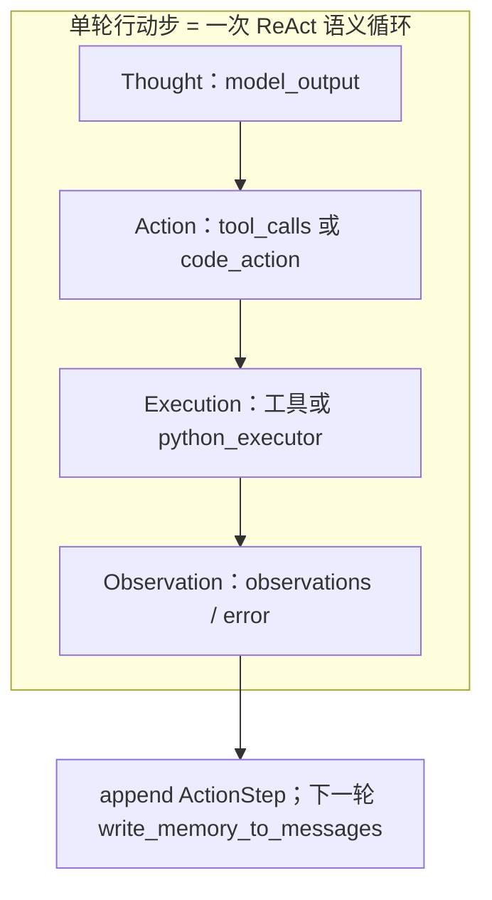

#### 2.0.3.2 从 `run` 到 `_run_stream` 外环（与 `planning_interval`）

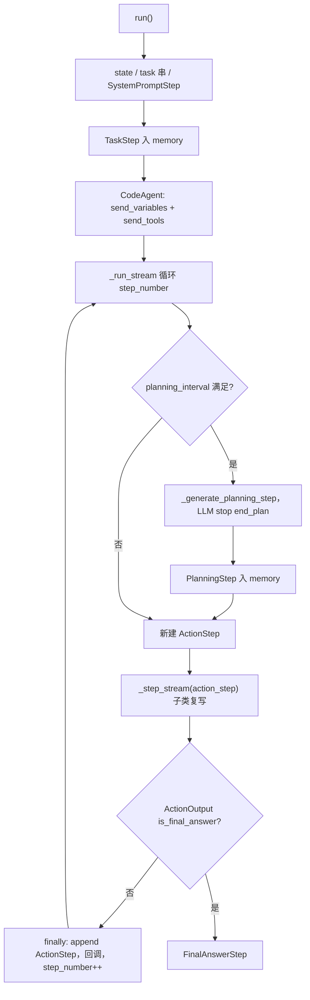

#### 2.0.4 和后面章节怎么对照

| 想深入 | 跳转 |
|--------|------|
| `ActionStep.to_messages` 具体长什么样 | **§2.4.2**、`memory.py` |
| 规划步何时插入、用什么 prompt | **§2.7.2、§2.8.6**；模板全文见 **`smolagents-runtime-prompts-*.md`** |
| ToolCalling 与 Code 两路径差异 | **§2.1.7、§2.7.4～2.7.5、§2.8.6** |
| Model 如何把 messages 交给 API | **§2.3**、`models.py` |
| 分层架构 + 函数级调用链 + 阶段表 | **§2.8** |
| `MultiStepAgent` 全流程 + `open_deep_research/custom_model.py` 场景推演 | **`examples/smolagents-multistepagent-open-deep-research-walkthrough.md`** |
| Step 的 input/output 与 `write_memory_to_messages` 拼装示例 | **§2.0.5**（本节） |
| ReAct 与 `ActionStep` 字段对应、`run` 外环 | **§2.0.3.1～2.0.3.2** + **Mermaid** |
| `self.state` 与 `memory` 的分工、跨步对象引用 | **§2.0.6** |

#### 2.0.5 `TaskStep` / `PlanningStep` / `ActionStep`：有无「输入输出」？与 `write_memory_to_messages` 如何拼装

##### （1）先纠正一个常见误解

- **下一轮 LLM 的输入** **不是**「把历史上每一轮曾经发给 API 的 **整包 prompt** 再存一遍、再拼起来」。  
- **实际机制**：每一类 **`MemoryStep`** 只存 **与本步业务相关的字段**；需要给下一轮模型看历史时，调用 **`write_memory_to_messages()`**，对 **当前 `memory` 里每一条 step** 做 **`to_messages(summary_mode)`**，把得到的 **`ChatMessage` 列表按顺序接龙**。  
- 因此：进入下一轮时，模型看到的是 **「按设计规则重放出来的对话轨迹」**（system + user 任务 + 计划摘要 + 各轮 assistant / 伪 tool / observation…），它在 **语义上**等价于「带着完整上文继续聊」，但 **字节级**不一定等于某次 HTTP 请求的原始 JSON（例如角色名会被 **`get_clean_message_list`** 再映射一次才上网）。

##### （2）各 Step「存什么」——可理解为业务上的 input / output

| Step | 主要存储（源码字段） | 更像「输入」 | 更像「输出 / 给下轮看的」 |
|------|----------------------|--------------|---------------------------|
| **`TaskStep`** | `task`、可选 `task_images` | 用户任务（来自 `run`） | **`to_messages`** → 一条 **user**：`New task:\n...` |
| **`PlanningStep`** | `model_input_messages`、`model_output_message`、`plan`、`token_usage`… | **仅规划那一次**：`model_input_messages` = **当时**发给规划 LLM 的完整消息列表（快照） | **`plan`**（包装后的计划正文）；**`to_messages`** → **assistant(plan)** + **user("Now proceed…")** |
| **`ActionStep`** | `model_input_messages`、`model_output`、`tool_calls`、`code_action`、`observations`、`error`… | **仅本行动步那一次**：`model_input_messages` = **当时**发给行动 LLM 的完整列表（快照，便于调试/导出） | **`to_messages`** → 依次可能含：**assistant(模型原文)**、**tool-call 伪消息**、**user(图)**、**tool-response(Observation)**、**tool-response(Error)** |

要点：

- **`model_input_messages`（Planning / Action）**：才是「**这一轮调用 LLM 时，当时完整的 messages 快照**」。  
- **`write_memory_to_messages()` 不用这些快照来拼历史**；它用 **`to_messages()`** 生成 **标准化叙事**。两者目的不同：**快照 = 调试/落盘；to_messages = 驱动下一轮上下文**。

##### （3）示例：研究问题「广州和上海，哪个城市的人口更多」（与 `custom_model` 一致：先规划再 Code 行动）

下面用 **极简占位文本** 表示内容；真实系统 prompt 很长，这里用 `[系统提示: CodeAgent 规则与工具说明…]` 代替。

**时刻 T0 — `run()` 刚结束初始化，`memory.steps = [TaskStep]`**

`write_memory_to_messages()` 得到：

| # | `role`（逻辑） | 内容摘要 |
|---|----------------|----------|
| 1 | `system` | `[系统提示: CodeAgent…]` |
| 2 | `user` | `New task:\n广州和上海，哪个城市的人口更多` |

→ 若 **下一步是规划 LLM**，**不走**这段列表；规划用 **`_generate_planning_step`** 自己组 **`input_messages`**（通常只有 **user + initial_plan 模板**），与上表独立。

**时刻 T1 — 规划完成，`memory.steps = [TaskStep, PlanningStep]`**

`PlanningStep.to_messages()` 产出 2 条（非 summary）：

| # | `role` | 内容摘要 |
|---|--------|----------|
| 3 | `assistant` | `Here are the facts…` + 代码块里的计划全文（字段 `plan`） |
| 4 | `user` | `Now proceed and carry out this plan.` |

此时 **`write_memory_to_messages()`** 完整顺序为：

```text
[1] system   ← SystemPromptStep
[2] user     ← TaskStep  ("New task:…")
[3] assistant← PlanningStep (plan)
[4] user     ← PlanningStep ("Now proceed…")
```

这就是 **第一次行动步 `CodeAgent._step_stream`** 里 **`write_memory_to_messages()`** 拼出来、再 **`copy` 到 `action_step.model_input_messages`** 的那份上下文（与 **`model.generate(...)`** 使用的列表一致，再经 Model 层清洗角色/图片等）。

**时刻 T2 — 第 1 个行动步结束，模型生成了 Thought+代码，执行后得到 Observation**

假设本步写入 **`ActionStep`**：

- **`model_output`**（字符串）= 模型打印的 Thought + 代码块（摘要）  
- **`tool_calls`** = 含合成调用 `python_interpreter`（CodeAgent 行为）  
- **`observations`** = `Execution logs:…` + `Last output from code snippet:…`（含例如 `search_agent` 返回的长报告节选）

则 **`ActionStep.to_messages()`** 追加（顺序）：

| # | `role`（逻辑） | 内容摘要 |
|---|----------------|----------|
| 5 | `assistant` | 与 **`model_output`** 一致（模型上一段输出） |
| 6 | `tool-call`（内部枚举，上传 API 前会映射） | `Calling tools:\n[{'id':…,'function':{'name':'python_interpreter',…}}]` |
| 7 | `tool-response` | `Observation:\nExecution logs:…\nLast output:…` |

**下一轮（manager 第 2 个行动步）** 再调用 **`write_memory_to_messages()`** 时，**完整链路**变为：

```text
[1] system
[2] user     TaskStep
[3] assistant PlanningStep plan
[4] user     PlanningStep "Now proceed…"
[5] assistant ActionStep model_output
[6] tool-call ActionStep  Calling tools…
[7] tool-response        Observation…
```

之后若再插入 **第二个 `PlanningStep`（更新计划）**，会在 **现有 steps 末尾**再追加其 **`to_messages()`** 的两条，再进入下一个 **`ActionStep`**。

##### （4）与「历史上前些轮完整的 prompt 输入」的关系（一句话）

- **每一轮行动/规划当时**的 **完整输入**：看该步的 **`model_input_messages`**（快照）。  
- **给下一轮用的「历史」**：看 **`write_memory_to_messages()`** = **`system` + 各 `step.to_messages()` 顺序拼接**，是 **为续写设计的对话视图**，**不等于**把各步快照首尾相连。

#### 2.0.6 `MultiStepAgent.state`：干什么用？流程里怎么用？

**`self.state: dict[str, Any]`** 是 **运行期命名上下文字典**，在一次或多次 `run` 之间保存 **不适合只放在纯文本任务里的真实对象**（如 `AgentImage`、DataFrame）或 **`run(..., additional_args={...})` 注入的键值**。它与 **`AgentMemory` / `MemoryStep`** 分工不同：

| | **`memory`** | **`state`** |
|---|--------------|-------------|
| 角色 | 结构化「记事本」，可 **`to_messages()`** 驱动 LLM | 键值仓库，**默认不**整本摊平进对话 |
| 典型内容 | 任务、计划、行动、观察（多为文本或可消息化的片段） | 对象引用、图/音句柄、用户注入变量 |

**流程中的挂钩（`agents.py`）：**

1. **`run(..., additional_args=...)`**  
   - `self.state.update(additional_args)`。  
   - 向 **`self.task` 追加**一段说明：可用 **key 当变量名**（`CodeAgent` 的 prompt 会配合这一点）。  
   - **仅 `CodeAgent`**：随后 **`python_executor.send_variables(self.state)`**，沙箱内代码可直接使用这些名字。

2. **`ToolCallingAgent.execute_tool_call` → `_substitute_state_variables`**  
   - 若工具参数字典里某字段的 **value 是字符串**，且 **`self.state` 存在同名 key**，则用 **`state` 里的对象**替换再调用工具（例如模型传 `"image.png"`，实际传入 **`AgentImage`**）。

3. **`process_tool_calls`**  
   - 工具返回 **`AgentImage` / `AgentAudio`** 时，写入 **`self.state`**（当前实现固定名为 **`image.png` / `audio.mp3`**），观察字符串提示 *Stored '…' in memory*，供下一轮用 **名字** 引用；**同类型多次结果可能覆盖同名 key**（源码 TODO）。

4. **`final_answer` 工具**  
   - 若返回的 answer 是 **字符串且等于某个 `state` key**，则 **解引用**为 **`self.state[key]`** 作为真正最终答案。

**一句话**：**`state` = 跨步、可命名的运行时上下文；Code 路径配合 executor 注入变量，Tool 路径配合「字符串占位符 → 真实对象」替换。** 细节与 §2.1.7 中 `run` / `ToolCallingAgent` 小节一致。

---

### 2.1 Agent 系统（agents.py）

#### 2.1.1 类层次结构

```python
MultiStepAgent (ABC)          # 抽象基类，实现 ReAct 循环
├── CodeAgent                 # 代码执行模式：LLM 生成 Python 代码
└── ToolCallingAgent          # 工具调用模式：LLM 直接调用工具
```

> **源码级细节**: `run` / `_run_stream` 状态机与两个子类 `_step_stream` 的准确数据流见 **§2.1.7**（与下列概念小节互补，不重复摘抄整段源码）。  
> **端到端串联**（规划、每轮如何调 LLM、Tool/Code 两路径）：见 **§2.7**。  
> **主/子逐步 LLM 推演**：**§2.8.8** + **`examples/smolagents_managed_agent_demo.py`**。

#### 2.1.2 `MultiStepAgent.__init__` 在做什么（流程图）

```text
__init__
  ├─ prompt_templates 校验 / 默认值
  ├─ state、planning_interval、final_answer_checks …
  ├─ _setup_managed_agents  → 子代理注入 inputs / output_type（伪装 Tool）
  ├─ _setup_tools           → self.tools 字典 + 默认 final_answer + 可选 TOOL_MAPPING
  ├─ _validate_tools_and_managed_agents（名称唯一）
  ├─ AgentMemory(self.system_prompt)   ← 读 property → initialize_system_prompt()
  ├─ AgentLogger / Monitor
  └─ _setup_step_callbacks（含默认 Monitor.update_metrics）
```

#### 2.1.3 `run()` 入口（与 §2.7.1 对照）

```text
run(task, reset, additional_args, …)
  ├─ self.task / state.update(additional_args) / 任务串追加「可用变量名」说明
  ├─ memory.system_prompt = SystemPromptStep(…)  ← 重新渲染 Jinja 系统模板
  ├─ 可选 memory.reset()、monitor.reset()
  ├─ memory.steps.append(TaskStep)
  ├─ CodeAgent：python_executor.send_variables(state)；send_tools(tools∪managed_agents)
  └─ list(_run_stream) 或 stream 返回生成器 → 末步 FinalAnswerStep
```

#### 2.1.4 设计模式（纲要）

| 模式 | 在 SmolAgents 中的体现 |
|------|------------------------|
| **模板方法** | `run` / `_run_stream` 定骨架；`_step_stream` 子类实现 |
| **策略** | `CodeAgent` vs `ToolCallingAgent` 不同的行动步 |
| **观察者** | `CallbackRegistry` + `Monitor`（§2.4.3） |

#### 2.1.5 性能与扩展（索引）

- **省 token**：`write_memory_to_messages(summary_mode=True)`（更新规划等）。  
- **降规划频率**：`planning_interval`。  
- **扩展**：自定义 `Tool` / `Model` / `PythonExecutor`；子类化 Agent 时慎改对外签名（见 **`AGENTS.md`**）。

#### 2.1.6 两种 Agent 模式对比

**一句话**：`ToolCallingAgent` 让模型用 **API 级 tool_calls** 调外部能力；`CodeAgent` 让模型写 **一段 Python**，由沙箱执行并在同一段里组合逻辑。

**单步数据流（Mermaid 并排子图）**：

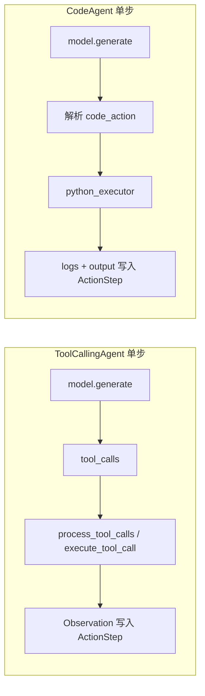

**对照表**（单步实现清单见 **§2.1.7 B / C**）：

| 对比维度 | CodeAgent | ToolCallingAgent |
|----------|-----------|------------------|
| **模型每步主要产出** | 文本中的代码块，或 JSON 里的 `code` 字段 | 结构化 **`tool_calls`**（或从纯文本解析出的等价调用） |
| **工具清单如何进入上下文** | 嵌入 **system prompt**（`Tool.to_code_prompt()` 等生成「函数签名」说明） | 随 **`model.generate(..., tools_to_call_from=...)`** 进入供应商 **`tools`** 字段 |
| **本步执行方式** | 单次 **`python_executor(code_action)`**（代码内可多次调用已注入的 `static_tools`） | 零到多次 **`execute_tool_call`**（多调用可 **并行**） |
| **内置 `python_interpreter`** | **不**经 TOOL_MAPPING 注入（避免与 `python_executor` 双入口） | 在 **`add_base_tools`** 时可为 ToolCalling 注入 |
| **Managed agents** | 与工具一并 **`send_tools`**，代码里按名调用；**非 local 远程 executor 时不支持** | 与工具并列 **`tools_to_call_from`**，走与普通 Tool 相同的调用链 |
| **默认 Prompt 模板** | `code_agent.yaml` / `structured_code_agent.yaml` | `toolcalling_agent.yaml` |

#### 2.1.7 `_step_stream` 与执行路径（源码级合并说明）

**怎么读**：**A** 是基类外环（所有子类共用）；**B / C** 为两子类**单步流水线表** + **Mermaid**；**D** 说明与 §2.1.6 分工。**选型级对比**已在 **§2.1.6**。

**从 `run` 到「子类复写点」`_step_stream`（与 §2.0.3.2 一致，强调复写边界）**：

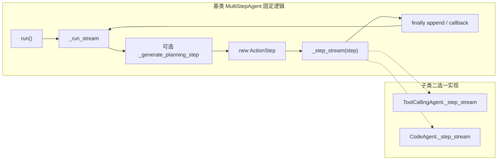

- **基类不负责**「模型输出是 tool 还是 code」的解析与执行，只负责：**何时规划**、**何时 new ActionStep**、**何时 append**、**何时因 `is_final_answer` 跳出**。  
- **子类 `_step_stream`** 负责：**拼 `model_input_messages` → 调 `model.generate`（参数不同）→ 解析 → 执行 → 填 `ActionStep` → yield `ActionOutput`**。

##### A. 基类 `MultiStepAgent`（不含子类 `_step_stream` 内部）

| 主题 | 行为（源码口径） |
|------|------------------|
| **`system_prompt`** | 只读 property → 子类 `initialize_system_prompt()`；直接赋值会报错，改 **`prompt_templates`** |
| **`run()`** | `state` / 任务串；`TaskStep`；若有 **`python_executor`** 则 `send_variables` + `send_tools(tools∪managed)`；非流式 **`list(_run_stream)`** 末步必为 **`FinalAnswerStep`**，可包 **`RunResult`** |
| **`_run_stream` 一步** | 可选 **规划** → **`_step_stream(ActionStep)`**（yield 流式增量原样转发）→ **`finally`**：timing、回调、**`memory.steps.append`**、再 yield 本步、`step_number += 1` |
| **何时停** | **`ActionOutput.is_final_answer=True`** → `final_answer_checks`；或步尽 → **`provide_final_answer`** → 仍 **`FinalAnswerStep`** |
| **异常** | **`AgentGenerationError`** 向上抛；其它 **`AgentError`** 写入 **`action_step.error`**，**不**断外环 |
| **`write_memory_to_messages`** | **`system_prompt.to_messages`** + 各 **`memory_step.to_messages(summary_mode)`** 顺序拼接（是否省略由 Step 类型 + `summary_mode` 决定） |

```text
_run_stream 外环（概念）:
    … → [可选 PlanningStep] → ActionStep := _step_stream(...) → append memory → 步号+1 → …
```

##### B. `ToolCallingAgent._step_stream`（单步流水线）

| 序号 | 环节 | 说明 |
|:----:|------|------|
| 1 | 模板 | 默认 **`toolcalling_agent.yaml`** |
| 2 | 输入 | **`model_input_messages = write_memory_to_messages().copy()`** |
| 3 | 生成 | **`model.generate` / `generate_stream`**，`tools_to_call_from=self.tools_and_managed_agents`，**`stop_sequences`** 含 **`Observation:`**、**`Calling tools:`** |
| 4 | 解析 | 有 **`tool_calls`** 则规范化 arguments；否则 **`parse_tool_calls(chat_message)`**（兼容纯文本模型） |
| 5 | 执行 | **`process_tool_calls`**：先 yield **`ToolCall`**；单调用同步 / 多调用 **`ThreadPoolExecutor`**（**`max_tool_threads`**）；**`_substitute_state_variables`** → **`validate_tool_arguments`** → **`tool(..., sanitize_inputs_outputs=True)`** 或子代理 **`__call__`** |
| 6 | 图/音 | **`AgentImage` / `AgentAudio`** → 写入 **`state`**（固定键名）；observation 提示可名字引用 |
| 7 | 顺序 | 多 observation 按 **tool call id 排序**拼接 |
| 8 | 约束 | **`final_answer`** 与他 tool 同轮或多个 final → 抛错 |
| 9 | 收尾 | **`yield ActionOutput`**；仅调用 **`final_answer`** 工具时 **`is_final_answer=True`** |

**ToolCalling 单步时序（Mermaid）**：

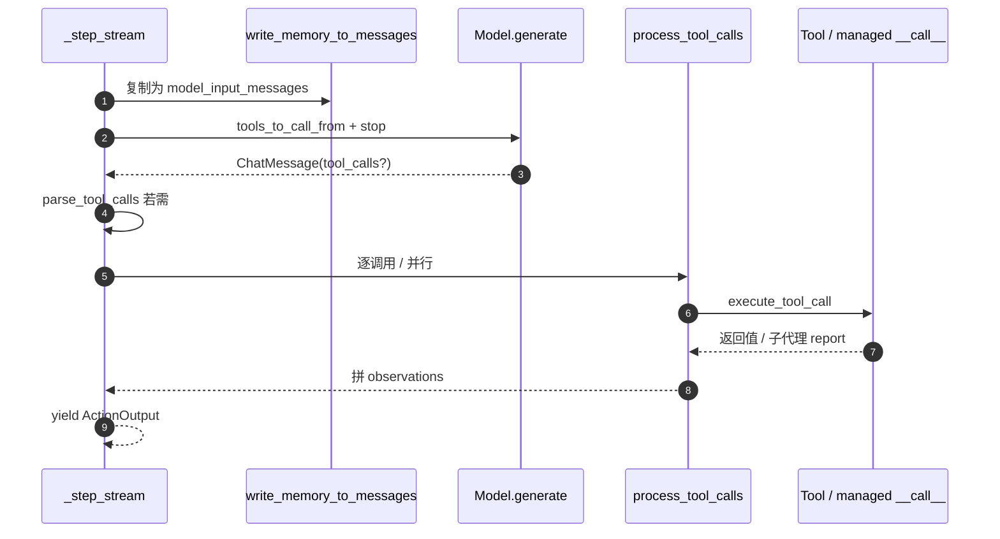

##### C. `CodeAgent._step_stream`（单步流水线）

| 序号 | 环节 | 说明 |
|:----:|------|------|
| 1 | 模板 | 默认 **`code_agent.yaml`**；结构化模式用 **`structured_code_agent.yaml`** + **`response_format=CODEAGENT_RESPONSE_FORMAT`** |
| 2 | 输入 | 同 B.2 |
| 3 | 生成 | **`generate` / `generate_stream`**；一般 **无** `tools_to_call_from`；**stop** 含代码块 **闭合标签**（与开启标签不冲突时才加） |
| 4 | 补全 | 非结构化时若缺闭合标签，**自动补上**并写回 **`model_output_message`** |
| 5 | 解析 | **`parse_code_blobs`** 或 JSON 取 **`code`** → **`extract_code_from_text`** → **`fix_final_answer_code`** → **`memory_step.code_action`** |
| 6 | 对齐记忆 | 合成 **`ToolCall(python_interpreter, code_action)`** yield 一次（replay/序列化与 ToolCalling 形态对齐） |
| 7 | 执行 | **`python_executor(code_action)`** → **`observations`**（logs + 截断 output）、**`action_output`** |
| 8 | 收尾 | **`yield ActionOutput(..., is_final_answer=code_output.is_final_answer)`**（**`final_answer()`** 在沙箱内通过异常约定） |
| 附 | 其它 | **`authorized_imports`**；**远程 executor** 且 **managed_agents** → 源码直接限制；**`with` / `cleanup()`** 释放 executor |

**CodeAgent 单步时序（Mermaid）**：

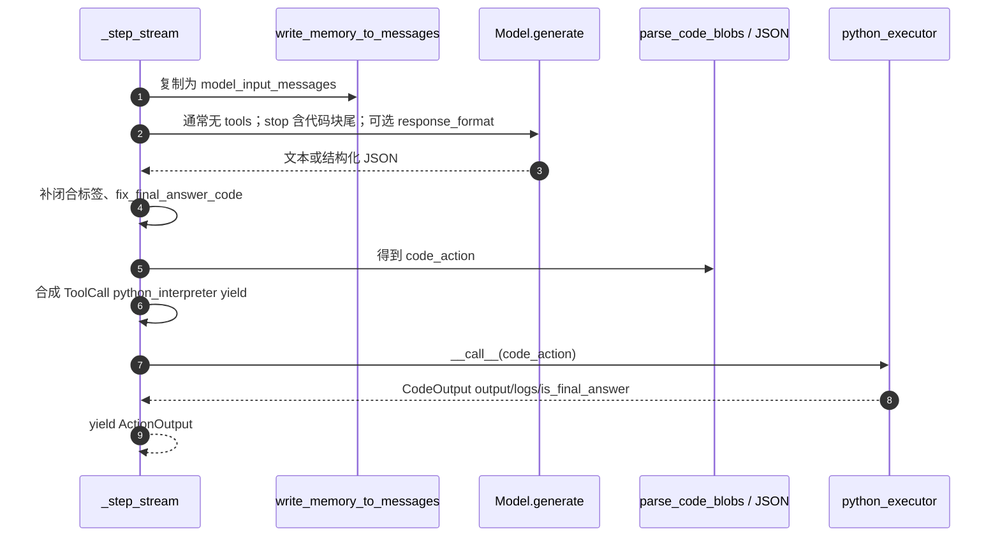

##### D. 与 §2.1.6 的分工

- **§2.1.6**：选 **Code** 还是 **ToolCalling**（工具进上下文的方式、子代理差异等）。  
- **§2.1.7 本节**：**单步**里先干什么、后干什么（上表 **B / C**）。  
- **实现向风险/耦合**一句话：**ToolCalling** 强依赖 **API tool schema** 与工具质量；**Code** 强依赖 **解析 + 沙箱**。

##### E. `run` 起算：外环共有 vs 子类复写（对照）

| 阶段 | 谁实现 | ToolCallingAgent | CodeAgent |
|------|--------|------------------|-----------|
| `run()` 里 `TaskStep`、刷新 system、（可选）`send_variables`/`send_tools` | 基类 + Code 覆写 `run` 尾部 | 同左 | 多 **`python_executor` 同步** |
| `_run_stream`：`planning_interval`、`finally append`、`step_number` | **仅基类** | 相同 | 相同 |
| 单步内 **`model.generate` 参数** | 子类 `_step_stream` | **`tools_to_call_from`** + 特定 **stop** | 通常 **无 tools**；**stop** 含代码块尾；可 **`response_format`** |
| 单步内 **解析** | 子类 | **`tool_calls` / `parse_tool_calls`** | **`parse_code_blobs` / JSON → `code_action`** |
| 单步内 **执行** | 子类 | **`process_tool_calls` → `execute_tool_call`** | **`python_executor(code_action)`** |
| **`is_final_answer` 来源** | 子类填 **`ActionOutput`** | 仅 **`final_answer`** 工具成功时 | **`CodeOutput`** 沙箱约定（如 **`final_answer()`**） |

**记忆对齐**：Code 路径会 **合成** 一次 **`ToolCall(python_interpreter, …)`** 再 yield，使 **`ActionStep.to_messages()`** 与 ToolCalling 的「伪 tool-call + tool-response」形态一致，便于 **replay / 监控**（见上表 **B 序号 6**、**C 序号 6**）。

---

### 2.2 工具系统（`tools.py`）

#### 2.2.1 `Tool.__call__` 数据流

```text
tool(*args, **kwargs)
  ├─ 首次：setup()（懒加载重资源）
  ├─ 若单参 dict 且键 ⊆ inputs → 展成 kwargs
  ├─ 可选 sanitize：handle_agent_input_types
  ├─ forward(*args, **kwargs)
  ├─ 可选 sanitize：handle_agent_output_types
  └─ return
```

#### 2.2.2 与两类 Agent 的衔接

| 场景 | 行为 |
|------|------|
| **ToolCallingAgent** | `get_tool_json_schema` 等把 Tool 变成 API tools；模型返回 `tool_calls` 后 `validate_tool_arguments` → `tool(..., sanitize_inputs_outputs=True)` |
| **CodeAgent** | `send_tools` 把 Tool 实例放进 `static_tools`；**`to_code_prompt()`** 生成 **Python 函数签名 + docstring** 写进 system 文本，模型在代码里按名调用 |

#### 2.2.3 工具来源（索引）

包内支持从 **Hub / Space / `@tool` / LangChain 包装** 等创建 Tool（见 **`tools.py`** 各类工厂与 `ToolCollection`）。序列化与 `to_dict` / `from_dict` 用于保存与 Hub 推送。

---

### 2.3 模型抽象层（`models.py`）

#### 2.3.1 一次 `generate` 在干什么

```text
Model.generate(messages, stop_sequences=..., tools_to_call_from=..., **kwargs)
  ├─ _prepare_completion_kwargs
  │     ├─ get_clean_message_list（角色映射：如 tool-call / tool-response → 供应商角色）
  │     ├─ 合并 stop、tools schema（若传入 tools_to_call_from）
  │     └─ 合并模型特有参数
  ├─ 调用具体后端（OpenAI、LiteLLM、Transformers、Azure…）
  └─ 解析为 ChatMessage（含 content / tool_calls / token_usage）
```

**流式**：`generate_stream` 产出 `ChatMessageStreamDelta`，由 **`agglomerate_stream_deltas`** 聚合成完整 `ChatMessage`（与 `CodeAgent` / `ToolCallingAgent` 的 `stream_outputs` 配合）。

#### 2.3.2 与 §2.7 的衔接

- **ToolCalling**：本步必须把 **`tools_to_call_from`** 传到 `generate`，否则模型无法发结构化 tool call。  
- **Code**：通常 **不传** tools；用 **stop_sequences**（含代码块闭合标签）约束输出形态；可选 **`response_format`**（结构化 code JSON）。

---

### 2.4 记忆系统（`memory.py`）

#### 2.4.1 结构

```text
AgentMemory
  ├── system_prompt: SystemPromptStep
  └── steps: [ TaskStep | PlanningStep | ActionStep | … ]
```

`FinalAnswerStep` 由 `run` 末尾 yield，不长期作为「下一轮历史」追加进 `steps` 的叙事链（与收尾逻辑有关，见源码）。

#### 2.4.2 `ActionStep.to_messages()` 逻辑（示意）

```text
to_messages(summary_mode)
  ├─ model_output 且非 summary → assistant
  ├─ tool_calls → tool-call 伪消息（Calling tools: …）
  ├─ observations → tool-response（Observation: …）
  └─ error → tool-response（Error: … + 重试提示）
```

与 **§2.0.5** 中的「快照 `model_input_messages` vs 叙事 `to_messages`」对照阅读。

#### 2.4.3 `CallbackRegistry`

- **注册**：`register(Step类, callback)`，支持 **MRO** 匹配。  
- **触发**：步骤收尾 **`_finalize_step`** → `step_callbacks.callback(step, agent=self)`。  
- **默认**：`ActionStep` 上挂 **`Monitor.update_metrics`**。

---

### 2.5 Python 沙箱（`local_python_executor.py`）

#### 2.5.1 执行路径（要点）

本地路径 **不是** 对任意字符串 `exec`；而是 **`evaluate_python_code` → 遍历 AST → `evaluate_ast`**，在受限环境下解释执行。**`static_tools`**（含 **`final_answer`** 包装为抛 `FinalAnswerException`）与 **`state`** 注入名字空间；**`Name` / `Call`** 解析时命中 `static_tools` 即允许调用（见 **`evaluate_name` / `evaluate_call`**）。

#### 2.5.2 安全与资源（索引）

- **授权 import** 列表、`authorized_imports`、操作计数、while 迭代上限、**超时**、**print 捕获与截断**。  
- 具体常量名以源码为准（如 `MAX_EXECUTION_TIME_SECONDS`、`DEFAULT_MAX_LEN_OUTPUT`）。

---

### 2.6 远程执行器（`remote_executors.py`）

| 类型 | 说明 |
|------|------|
| Docker / E2B / Modal / Wasm / Blaxel | 均实现 **`PythonExecutor`**；错误类 **`FinalAnswerException`** 跨边界序列化后与本地 **`CodeOutput.is_final_answer`** 语义对齐 |

---

### 2.7 Agent 调用 LLM 的端到端流程（含规划与工具）

本节把 **`run` → `_run_stream` → 规划 / 行动 → 再调 LLM** 的主线串成一条可读逻辑，并与 **§2.1.7**（子类 `_step_stream` 细节）、**§2.2、§2.3**（工具/模型）互补。

#### 2.7.1 总览：一次 `run` 里发生什么

1. **`run(task, ...)`**  
   - 更新 **`self.state`**（`additional_args`）、拼接任务说明、刷新 **`SystemPromptStep`**、可选 **`memory.reset()`**。  
   - **`memory.steps.append(TaskStep(...))`**。  
   - 若为 **`CodeAgent`**：**`python_executor.send_variables(state)`**、**`send_tools({**tools, **managed_agents})`**，使生成代码里可直接调用工具名 / 子代理名。  
   - 非流式：**`list(_run_stream(...))`**，最后一步必为 **`FinalAnswerStep`**，其 **`output`** 即返回值（或包进 **`RunResult`**）。

2. **`_run_stream`**（核心状态机）  
   对每个 **`step_number`**（1…`max_steps`），顺序为：  
   **[可选] 规划步** → **行动步（`_step_stream`）** → **`step_number += 1`**，直到 **`ActionOutput(is_final_answer=True)`** 或步数耗尽。  
   结束时构造 **`FinalAnswerStep`** 并 yield。

#### 2.7.2 规划（Planning）如何参与、如何调 LLM

**触发条件**（`planning_interval is not None` 时）：

- **第 1 步**必规划一次；  
- 之后每当 **`(step_number - 1) % planning_interval == 0`** 再规划（与源码一致）。

**与行动步的关系**：规划占用一次循环迭代前的插入段；**不消耗「行动步」里的 `_step_stream`**，但会 **`memory.steps.append(PlanningStep)`**，后续 **`write_memory_to_messages()`** 会把计划文本带给主循环用的 LLM。

**如何调 LLM**（`_generate_planning_step`）：

| 场景 | 输入消息 | Stop | 产出 |
|------|----------|------|------|
| **首次规划** | 用户向消息：模板 `planning.initial_plan`（含 task、tools、managed_agents 等变量） | `<end_plan>` | **`PlanningStep`**（`plan` 字符串 + `model_output_message` + token） |
| **更新规划** | `summary_mode=True` 的 **`write_memory_to_messages()`** + system/user 模板 `update_plan_pre_messages` / `update_plan_post_messages`（含剩余步数等） | `<end_plan>` | 同上 |

**设计意图**：首次给完整上下文列计划；更新时用 **summary** 减少旧计划/冗长历史对「新计划」的绑架。

#### 2.7.3 行动步：记忆如何变成「这一轮 LLM 输入」

每一步行动开始时新建 **`ActionStep`**，子类 **`_step_stream`** 内：

1. **`input_messages = write_memory_to_messages()`**（再 `copy` 赋给 **`action_step.model_input_messages`** 便于调试/序列化）。  
2. 即：**系统提示** + **TaskStep** + **若干 PlanningStep / ActionStep** 经各 **`MemoryStep.to_messages()`** 展开成 **`ChatMessage` 列表**（含上一轮模型输出、工具调用描述、**Observation**、**Error** 等）。  
3. 调用 **`model.generate` 或 `generate_stream(...)`** —— 具体参数由子类决定（见下）。

此后模型输出 → 解析 → 执行 → 写入 **`action_step`**（`model_output`、`tool_calls`/`code_action`、`observations`、`token_usage`、`error` 等），**`finally`** 里 **`memory.steps.append(action_step)`**，下一轮 LLM 自然看到完整 ReAct 轨迹。

#### 2.7.4 ToolCallingAgent：工具在流程中的位置

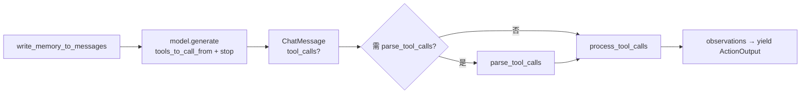

- **工具传入 LLM**：仅在本路径；见 **§2.3**（`generate` 参数链）、**§2.2**（schema 来源）、`get_tool_json_schema`（`models.py`）。  
- **执行**：**`execute_tool_call`** → 普通工具带 **`sanitize_inputs_outputs=True`**；子代理走 **`__call__(task, **kwargs)`**。  
- **结束本步**：若调用 **`final_answer`** 工具，**`ActionOutput.is_final_answer=True`**，主循环置 **`returned_final_answer`**；否则 observation 进入记忆，**下一步**再 **`write_memory_to_messages`**，形成标准 **Thought / Action / Observation** 闭环（内容由 prompt 与模板塑形）。

#### 2.7.5 CodeAgent：工具不在 LLM 请求里，而在执行器里

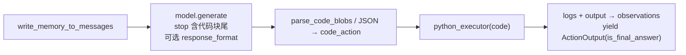

- **LLM**：通常 **不带 `tools_to_call_from`**；工具清单在 **system prompt 文本**里描述。  
- **执行**：代码在 **`static_tools`** 里调用与 **`send_tools`** 注入的同名字典（**工具 + 子代理**）。  
- **子代理**：在代码里像函数一样调用；**远程 executor** 时子代理与远程执行暂不兼容（源码限制）。

#### 2.7.6 终止与兜底

| 情况 | 行为 |
|------|------|
| **`ActionOutput(is_final_answer=True)`** | 可选 **`final_answer_checks`**；结束 while，**`FinalAnswerStep(output)`** |
| **步数用尽** | **`provide_final_answer(task)`**：再调一轮 LLM（**无 tools**），用 **`final_answer` 模板**基于全文记忆总结；可能带 **`AgentMaxStepsError`** 记入一步 |
| **`AgentGenerationError`** | 立即抛出（实现级错误） |
| **其它 `AgentError`** | 记入 **`action_step.error`**，不中断循环，下轮 LLM 从记忆中看到错误提示 |

#### 2.7.7 综合时序（Mermaid）

一条 **`run`** 里：**初始化写 `memory`** → **`_run_stream` 外环**（可选规划 → **`_step_stream`**）→ **两子类在「行动 LLM 之后」分歧**。与 **§2.0.3.2、§2.1.7** 同一条主线。

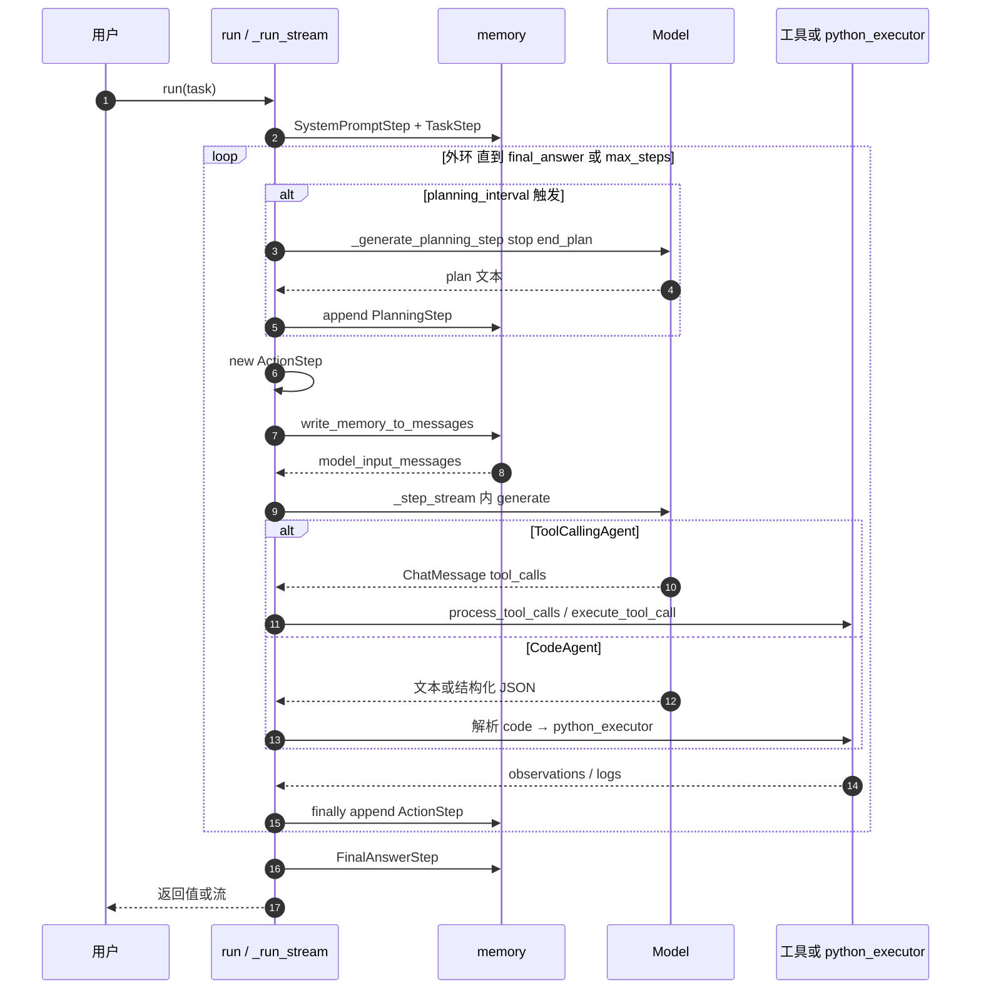

**与 §2.1.7 的对应**：上图中 **`_step_stream 内 generate` 到 `X` 的分支**，即 **B 表（ToolCalling）** 与 **C 表（Code）** 的差异；外环 **`planning_interval` / `finally append`** 由基类 **`MultiStepAgent._run_stream`** 统一处理，**不由子类复写**。

#### 2.7.8 与 §2.8 的分工

- **§2.7**：控制流、规划触发、两路径叙述、**§2.7.7 Mermaid 时序**。  
- **§2.8**：**四层架构（Mermaid）**、**纵向调用链（Mermaid）**、**阶段 0～N 表**；与 §2.7 **互补**。

---

### 2.8 完整执行流程：分层架构、调用链与阶段表

> 本节：**Layer 图（Mermaid）** + **纵向调用链（Mermaid）** + **分阶段表格**。叙述上与 §2.7 重叠处仅保留表格式信息。

#### 2.8.1 四层调用架构

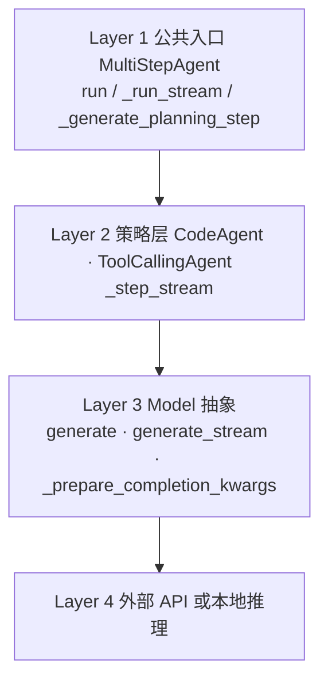

#### 2.8.2 纵向调用链（从用户到工具/沙箱）

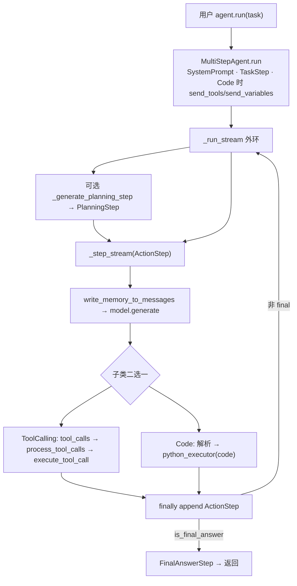

**说明**：**ToolCalling** 与 **Code** 在 **`model.generate` 之后**由 **`_step_stream` 实现类**二选一，**单步只走一支**。与 **§2.1.6 并排子图、§2.1.7 E 表**一致。

```text
（文字版速查，与上图等价）
用户 run → run 初始化 → _run_stream → [规划] → _step_stream → generate → Tool 或 Code 执行 → append → 循环或 FinalAnswerStep
```

#### 2.8.3 Prompt / 记忆如何进入每一轮行动 LLM

| `MemoryStep` | `to_messages()`（`summary_mode=False` 概要） |
|--------------|---------------------------------------------|
| **TaskStep** | `user`：`New task:\n…` |
| **PlanningStep** | `assistant`：计划正文；`user`：`Now proceed…` |
| **ActionStep** | `assistant`（模型输出）→ 伪 `tool-call` → `tool-response`（Observation / Error） |

写入供应商 API 前经 **`get_clean_message_list`** 做角色映射（详见 **§2.3**）。

#### 2.8.4 阶段 0：`run` 完成初始化（本阶段不调行动 LLM）

| 步骤 | 行为 |
|------|------|
| 0.1 | `additional_args` → `state`；任务串追加变量说明 |
| 0.2 | `memory.system_prompt = …`（触发 Jinja 渲染） |
| 0.3 | 可选 `memory.reset()` |
| 0.4 | `TaskStep` 入 `memory.steps` |
| 0.5 | CodeAgent：`send_variables` / `send_tools` |

#### 2.8.5 阶段 1：`_run_stream` 外环

| 步骤 | 行为 |
|------|------|
| 1.1 | `while` 直到 `final_answer` 或步数耗尽 |
| 1.2 | 满足条件则插入 **规划**（§2.7.2） |
| 1.3 | 新建 `ActionStep`，执行 `_step_stream` |
| 1.4 | `finally`：回调、`memory.steps.append`、步号 +1 |

#### 2.8.6 规划步谁调 LLM（摘要表）

| | 首次规划 | 更新规划 |
|---|----------|----------|
| 消息 | `planning.initial_plan` 渲染为 user | `summary_mode=True` 的 memory + `update_plan_pre/post` |
| Stop | `<end_plan>` | 同上 |
| 产出 | `PlanningStep` | `PlanningStep` |

#### 2.8.7 ToolCalling 行动步 + 子代理（主路径）

1. `write_memory_to_messages` → `model.generate(..., tools_to_call_from=…)`  
2. 解析 `tool_calls` → `process_tool_calls`  
3. **子代理**：`managed_agents[name](**args)` → 内部 **`run`** → 报告模板拼进 **Observation**  
4. `yield ActionOutput`；若调用 **`final_answer`** 工具则 `is_final_answer=True`

#### 2.8.8 CodeAgent 差异（对照表）

| 环节 | ToolCalling | Code |
|------|-------------|------|
| 行动 LLM | 带 `tools_to_call_from` | 一般不带；可选 `response_format` |
| 动作载体 | `tool_calls` | 代码块 / JSON 内 `code` |
| 执行 | `execute_tool_call` | `python_executor` |

#### 2.8.9 收尾：`final_answer` 与 `max_steps`

| 情况 | 行为 |
|------|------|
| 工具 `final_answer` / `code_output.is_final_answer` | `FinalAnswerStep` |
| 步数用尽 | `provide_final_answer`（再调 LLM、无 tools）+ 可能 `AgentMaxStepsError` |

#### 2.8.10 主调用子时的 LLM 顺序（简化）

1. **LLM#主-1**：`generate`（tools 含子代理）→ `tool_calls`  
2. **执行**：子代理 **`run`** 内若干 **LLM#子-*  
3. 子返回 **report 字符串** → 主 **Observation**  
4. **LLM#主-2**：继续直至 **`final_answer`**

（启用规划时，主/子外环各自在迭代开头插入规划 LLM，见 **`_generate_planning_step`**。）

---

## 三～五、设计模式 / 数据流 / 扩展点（纲要表）

> 不与 §2.7、§2.8 重复画流程图；只保留**索引式**对照。

| 章 | 内容 | 详见 |
|----|------|------|
| **三 设计模式** | 模板方法 / 策略 / 观察者 | **§2.1.4、§2.4.3** |
| **四 数据流** | 单任务在 Step 间的数据形态 | **§2.0.5、§2.8.2～2.8.3** |
| **五 扩展点** | 自定义 Tool / Model / Executor / Agent 子类 | **`tools.py` / `models.py` / `agents.py`** |

---

## 六～九、性能 / 安全 / 对比 / 实践

### 6.1 性能要点

```text
省 token          → write_memory_to_messages(summary_mode=True)（尤其更新规划）
控规划成本        → planning_interval
控步数            → max_steps、run(..., max_steps=...)
并行工具          → ToolCallingAgent max_tool_threads + ThreadPoolExecutor
早见结果          → stream=True（yield 每步 / delta）
截断过长观察      → truncate_content（执行路径内）
```

### 7.1 安全要点

| 域 | 措施 |
|----|------|
| **代码** | AST 解释执行、授权 import、超时、操作计数；优先远程沙箱 |
| **工具** | `validate_tool_arguments`；Hub/`trust_remote_code` 先审 |
| **提示** | `instructions`、用户任务均不可信；敏感能力放工具内硬编码校验 |

### 8.1 与 DeepAgents 对比

| 维度 | SmolAgents | DeepAgents |
|------|------------|------------|
| 中间件 | 无（仅有 Callback） | AgentMiddleware 链 |
| 状态 | `memory` + `state` | Checkpointer / 状态图等 |
| 技能 | 无内置 Skills | 可有渐进披露技能包 |

### 9.1 实践清单

- 选型：**复杂脚本 / 数据处理** → CodeAgent；**强 API 边界** → ToolCallingAgent。  
- 调试：`verbosity_level=DEBUG`、`replay(detailed=True)`、`return_full_result=True` 看 token。  
- 子代理：见 **附录 B**、`smolagents_managed_agent_demo.py`。

### 9.2 常用构造参数

| 参数 | 作用 |
|------|------|
| `instructions` | Jinja 变量 `custom_instructions` → `initialize_system_prompt` |
| `max_steps` | 外环上限；用尽 → `provide_final_answer` |
| `planning_interval` | 非 `None` 则周期性 `_generate_planning_step` |
| `step_callbacks` | `CallbackRegistry`；列表默认挂 `ActionStep` |
| `additional_args` | 见 **§2.0.6** |
| `add_base_tools` | **`python_interpreter` 仅注入 ToolCallingAgent** |

### 9.3 Prompt 模板如何渲染（Jinja2）

- **函数**：**`populate_template(template, variables={...})`**（`agents.py`），**StrictUndefined**。  
- **系统提示**：子类 **`initialize_system_prompt()`** 内对 **`prompt_templates["system_prompt"]`** 渲染；**每次 `run()`** 读 **`self.system_prompt` property** 时重新计算并写入 **`SystemPromptStep`**。  
- **规划**：**`_generate_planning_step`** 内渲染 **`planning.initial_plan` / `update_plan_*`**。  
- **子代理**：**`__call__`** 内渲染 **`managed_agent.task` / `report`**。  
- 全文模板见 **`smolagents-runtime-prompts-*.md`**。

---

## 十、总结

### 10.1 架构优势

✅ **简洁优雅**: 代码量少，易于理解和修改  
✅ **灵活扩展**: 插件化工具、模型、执行器  
✅ **安全可靠**: 多层沙箱保护  
✅ **生态整合**: HuggingFace Hub、Gradio、MCP  

### 10.2 局限性

❌ **无中间件系统**: 无法像 DeepAgents 那样灵活拦截和修改  
❌ **记忆管理简单**: 缺少持久化、向量检索等高级功能  
❌ **无技能系统**: 无法动态加载和管理技能  
❌ **状态管理弱**: 依赖内存，不支持分布式  

### 10.3 适用场景

**推荐使用 SmolAgents**:
- 快速原型开发
- 教育和学习 Agent 原理
- 简单的自动化任务
- 资源受限的环境

**推荐使用 DeepAgents**:
- 生产环境部署
- 复杂业务工作流
- 需要精细控制的场景
- 团队协作开发

---

## 附录：关键文件速查

| 文件 | 行数 | 核心内容 |
|------|------|---------|
| `agents.py` | 1815 | Agent 核心逻辑 |
| `tools.py` | 1423 | 工具系统 |
| `models.py` | 2103 | 模型抽象 |
| `local_python_executor.py` | 1769 | 沙箱执行器 |
| `memory.py` | 317 | 记忆系统 |
| `remote_executors.py` | ~800 | 远程执行器 |
| `monitoring.py` | ~274 | 监控日志（Monitor, AgentLogger, TokenUsage, Timing） |

**总计核心代码**: ~8600 行

---

## 附录 B：Managed Agent 如何与 Tool 对齐

### B.1 为什么要「伪装」

对 **Manager** 的 LLM 而言，子代理与工具应是**同一类可调用物**：有 **name / description / inputs / output_type**，并可通过 **ToolCalling** 的 schema 或 **Code** 的 `to_code_prompt()` 写进上下文。

### B.2 初始化：`_setup_managed_agents`

为每个子 agent 注入：

- **`inputs`**：`task`（string）+ `additional_args`（object, nullable）  
- **`output_type`**：`"string"`  

从而与 **`Tool`** 的 JSON schema 生成路径兼容（见 **`agents.py`**）。

### B.3 调用链（ToolCalling 路径）

```text
模型 tool_calls: { name: 子代理名, arguments: { task, additional_args? } }
  ↓
execute_tool_call → 命中 managed_agents[name]
  ↓
MultiStepAgent.__call__(task, **kwargs)
  ├─ populate_template(managed_agent.task, …)
  ├─ self.run(full_task, …)   ← 子记忆、子 system、子 _run_stream
  └─ populate_template(managed_agent.report, …) → 字符串返回主代理 Observation
```

**时序（Mermaid）**：

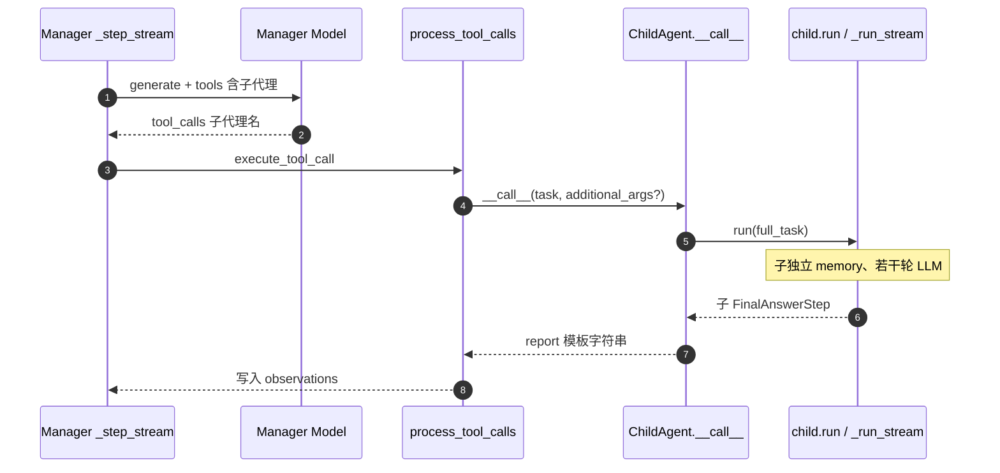

### B.4 CodeAgent 路径

- **`send_tools({**tools, **managed_agents})`** 后，子代理与工具同在 **`static_tools`**。  
- **`to_code_prompt()`** 生成 **`def 子代理名(task: str, additional_args: dict) -> string:`** 形态，写入 **system prompt**。  
- **限制**：**远程 `executor_type` ≠ `"local"`** 时，源码**不允许**再配 `managed_agents`（避免跨沙箱递归未解决）。

### B.5 示例

运行 **`examples/smolagents_managed_agent_demo.py`** 对照 **§2.8.10** 的 LLM 顺序叙述。

