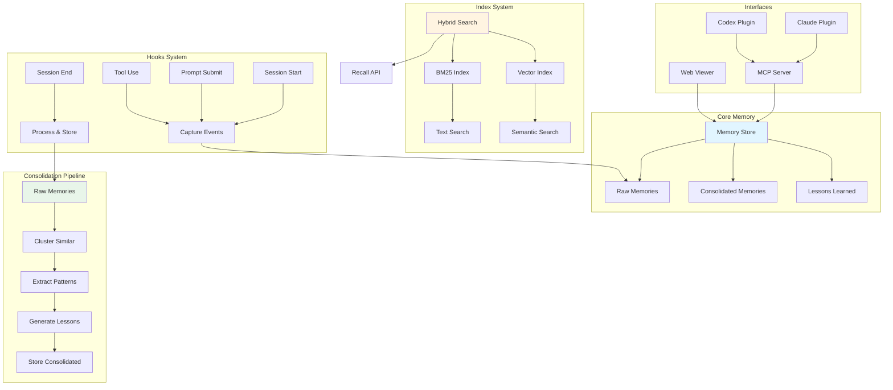
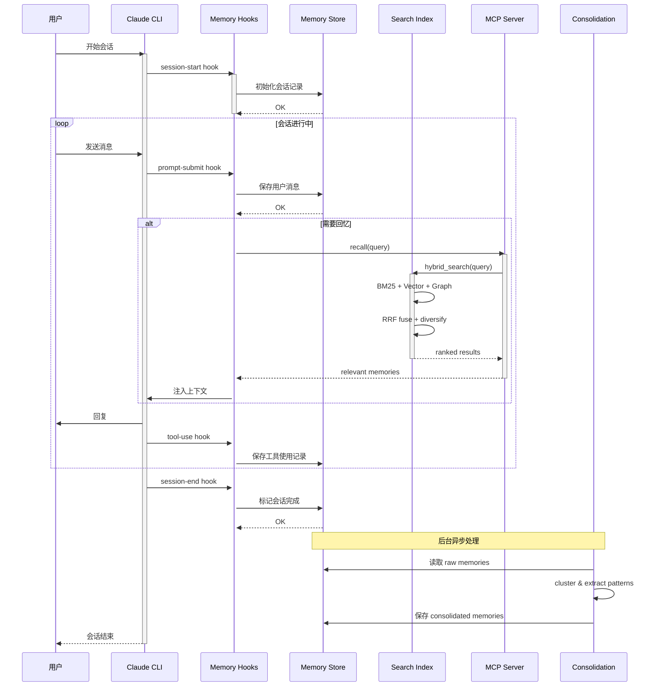
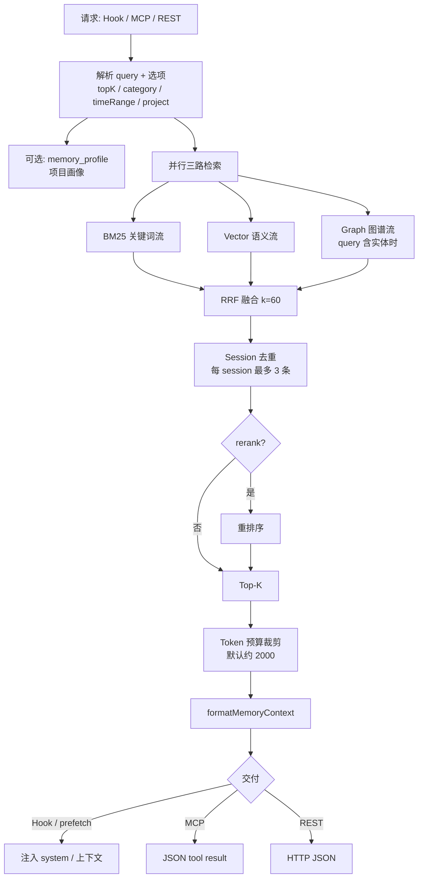
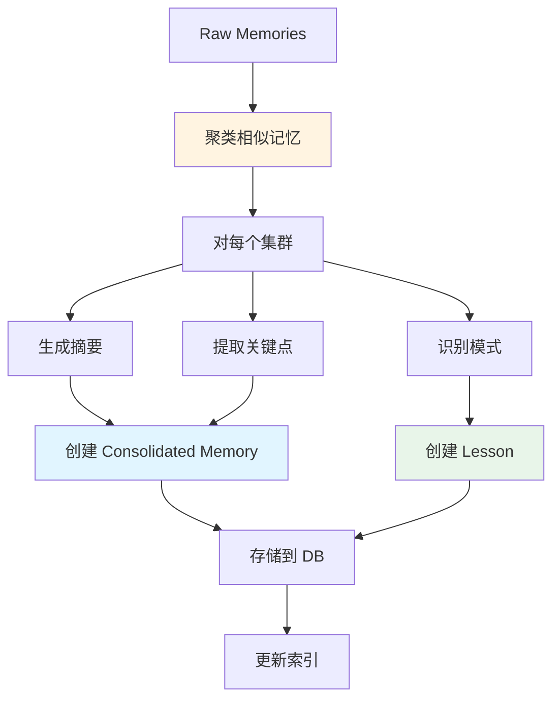
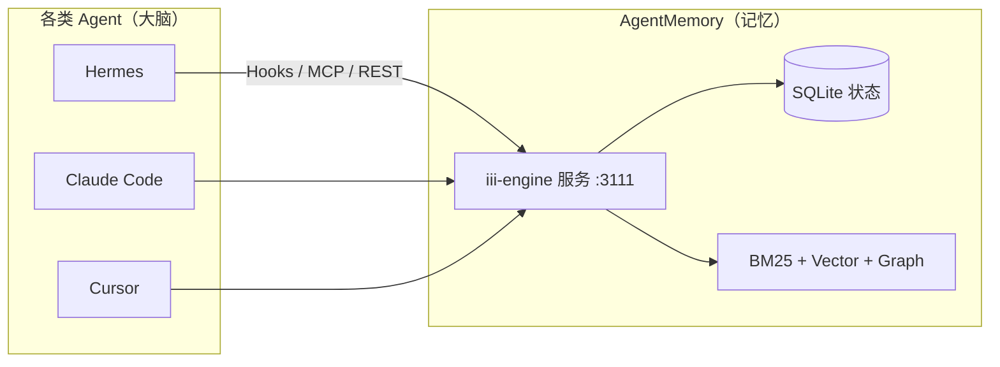
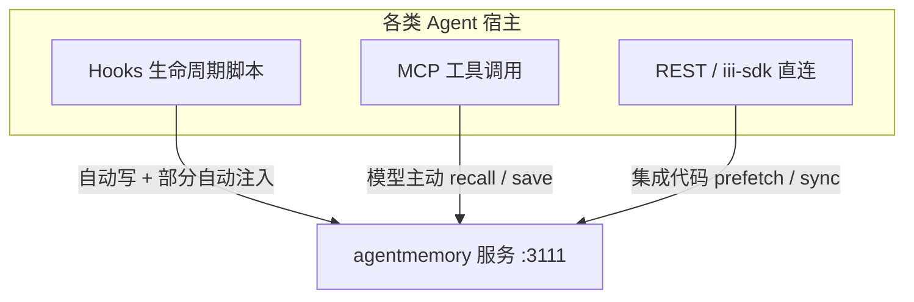
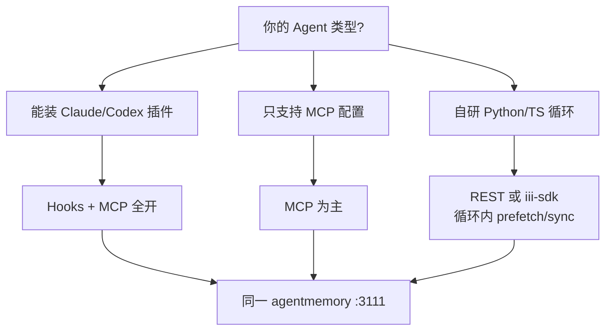

# AgentMemory 完整架构设计文档（第一部分）

> **版本**: 1.2  
> **分析时间**: 2026-05-17（§3 检索流程 2026-05-19）  
> **分析方法**: 源码深度阅读  
> **源码路径**: `/Users/gqli/work/deepagents/agentmemory/src`

---

## 📋 目录

- [第1章：项目概览与核心架构](#第1章项目概览与核心架构)
- [第2章：Memory 核心系统](#第2章memory-核心系统)
- [第3章：Search & Retrieval 检索系统](#第3章search--retrieval-检索系统)
  - [3.1 检索流程总览](#31-检索流程总览)
  - [3.2 Hybrid Search（三流 + RRF）](#32-hybrid-search三流--rrf)
  - [3.3 BM25 Index](#33-bm25-index-实现)
  - [3.4 Vector Index](#34-vector-index-实现)
  - [3.5 Recall MCP 工具](#35-recall-mcp-工具)
- [第4章：Consolidation 记忆整合](#第4章consolidation-记忆整合)
- [第5章：与其他 Agent 集成（Hooks / MCP / SDK）](#第5章与其他-agent-集成hooks--mcp--sdk)
  - [5.1 定位：记忆侧车，不是 Agent 本体](#51-定位记忆侧车不是-agent-本体)
  - [5.2 三条接入通道](#52-三条接入通道)
  - [5.3 为什么需要 Hooks（不能只用 MCP）](#53-为什么需要-hooks不能只用-mcp)
  - [5.4 程序化接口：REST、iii-sdk、MCP](#54-程序化接口restiii-sdkmcp)
  - [5.5 为何不维护「各框架官方 SDK」](#55-为何不维护各框架官方-sdk)
  - [5.6 各 Agent 集成选型](#56-各-agent-集成选型)

---

## 第1章：项目概览与核心架构

### 1.1 项目定位

**AgentMemory** 是一个智能体长期记忆系统，提供：

1. ✅ **自动记忆** - 会话中自动捕获和存储重要信息
2. ✅ **混合检索** - BM25 + 向量检索的混合搜索
3. ✅ **记忆整合** - 定期将原始记忆提炼为结构化知识
4. ✅ **MCP Server** - Model Context Protocol 接口
5. ✅ **Plugin 集成** - Claude/Codex/OpenClaw 插件支持
6. ✅ **可视化界面** - Web Viewer 查看和管理记忆

---

### 1.2 核心模块架构



---

### 1.3 关键组件关系

| 组件 | 位置 | 职责 |
|------|------|------|
| `Memory Store` | `src/state/` | 记忆存储（SQLite/JSONL） |
| `Hooks` | `src/hooks/` | 会话事件捕获 |
| `BM25 Index` | `src/providers/bm25_index.ts` | 关键词检索索引 |
| `Vector Index` | `src/providers/vector_index.ts` | 向量语义检索索引 |
| `Consolidation` | `src/functions/consolidate.ts` | 记忆整合管道 |
| `MCP Server` | `src/mcp/` | MCP 协议服务器 |
| `Viewer` | `src/viewer/` | Web 可视化界面 |
| `Plugin Hooks` | `plugin/hooks/` | Claude/Codex 钩子 |

---

### 1.4 数据流转全景图



---

## 第2章：Memory 核心系统

### 2.1 Memory Store 架构

**位置**: `src/state/memory-store.ts`

```typescript
class MemoryStore {
  private db: Database; // SQLite 数据库
  
  constructor(dbPath: string) {
    this.db = new Database(dbPath);
    this.initializeSchema();
  }
  
  private initializeSchema() {
    // Raw memories - 原始会话记录
    this.db.exec(`
      CREATE TABLE IF NOT EXISTS raw_memories (
        id TEXT PRIMARY KEY,
        session_id TEXT NOT NULL,
        timestamp DATETIME DEFAULT CURRENT_TIMESTAMP,
        content TEXT NOT NULL,
        type TEXT CHECK(type IN ('user_message', 'assistant_message', 'tool_use', 'observation')),
        metadata TEXT, -- JSON 元数据
        tags TEXT -- JSON 标签数组
      )
    `);
    
    // Consolidated memories - 整合后的知识
    this.db.exec(`
      CREATE TABLE IF NOT EXISTS consolidated_memories (
        id TEXT PRIMARY KEY,
        created_at DATETIME DEFAULT CURRENT_TIMESTAMP,
        title TEXT NOT NULL,
        summary TEXT NOT NULL,
        details TEXT, -- 详细内容
        category TEXT, -- 分类
        confidence REAL CHECK(confidence >= 0 AND confidence <= 1),
        source_ids TEXT, -- 来源 raw memory IDs
        embeddings TEXT -- JSON 向量数组
      )
    `);
    
    // Lessons learned - 经验教训
    this.db.exec(`
      CREATE TABLE IF NOT EXISTS lessons (
        id TEXT PRIMARY KEY,
        created_at DATETIME DEFAULT CURRENT_TIMESTAMP,
        lesson TEXT NOT NULL,
        context TEXT, -- 适用场景
        priority INTEGER DEFAULT 5, -- 优先级 1-10
        tags TEXT -- JSON 标签
      )
    `);
  }
  
  async addRawMemory(sessionId: string, content: string, type: string, metadata?: object) {
    const id = crypto.randomUUID();
    await this.db.run(
      `INSERT INTO raw_memories (id, session_id, content, type, metadata)
       VALUES (?, ?, ?, ?, ?)`,
      [id, sessionId, content, type, JSON.stringify(metadata || {})]
    );
    return id;
  }
  
  async getRawMemories(sessionId?: string, limit = 100) {
    if (sessionId) {
      return await this.db.all(
        `SELECT * FROM raw_memories WHERE session_id = ? ORDER BY timestamp DESC LIMIT ?`,
        [sessionId, limit]
      );
    }
    return await this.db.all(
      `SELECT * FROM raw_memories ORDER BY timestamp DESC LIMIT ?`,
      [limit]
    );
  }
}
```

**存储结构**：
```
memory-store.db
├── raw_memories (原始会话记录)
│   ├── id (UUID)
│   ├── session_id (会话ID)
│   ├── timestamp (时间戳)
│   ├── content (内容)
│   ├── type (类型: user/assistant/tool)
│   ├── metadata (JSON 元数据)
│   └── tags (JSON 标签)
│
├── consolidated_memories (整合知识)
│   ├── id (UUID)
│   ├── title (标题)
│   ├── summary (摘要)
│   ├── details (详细内容)
│   ├── category (分类)
│   ├── confidence (置信度 0-1)
│   ├── source_ids (来源IDs)
│   └── embeddings (向量)
│
└── lessons (经验教训)
    ├── id (UUID)
    ├── lesson (教训内容)
    ├── context (适用场景)
    ├── priority (优先级 1-10)
    └── tags (标签)
```

---

### 2.2 Hooks 系统

**位置**: `src/hooks/`

#### **Session Start Hook**

```typescript
// src/hooks/session-start.ts
export async function onSessionStart(event: SessionStartEvent) {
  const store = getMemoryStore();
  const sessionId = event.sessionId;
  
  // 创建会话记录
  await store.createSession({
    id: sessionId,
    startedAt: new Date().toISOString(),
    model: event.model,
    workspace: event.workspace,
  });
  
  logger.info(`[Memory] Session started: ${sessionId}`);
}
```

#### **Prompt Submit Hook**

```typescript
// src/hooks/prompt-submit.ts
export async function onPromptSubmit(event: PromptSubmitEvent) {
  const store = getMemoryStore();
  const { sessionId, messages } = event;
  
  // 保存用户消息
  for (const msg of messages) {
    if (msg.role === 'user') {
      await store.addRawMemory(sessionId, msg.content, 'user_message', {
        timestamp: Date.now(),
        tokenCount: estimateTokens(msg.content),
      });
    }
  }
  
  // 自动触发回忆
  const lastUserMessage = messages.filter(m => m.role === 'user').pop();
  if (lastUserMessage) {
    const relevantMemories = await recallRelevant(lastUserMessage.content);
    
    if (relevantMemories.length > 0) {
      // 注入到系统提示
      const contextBlock = formatMemoryContext(relevantMemories);
      injectIntoSystemPrompt(contextBlock);
    }
  }
}
```

#### **Tool Use Hook**

```typescript
// src/hooks/tool-use.ts
export async function onToolUse(event: ToolUseEvent) {
  const store = getMemoryStore();
  const { sessionId, toolName, input, output } = event;
  
  // 记录工具使用
  await store.addRawMemory(sessionId, JSON.stringify({
    tool: toolName,
    input,
    output,
  }), 'tool_use', {
    timestamp: Date.now(),
    success: !output.error,
  });
  
  // 检测重要信息（如文件修改、命令执行结果）
  if (isSignificantTool(toolName, output)) {
    await flagAsImportant(sessionId, {
      type: 'tool_result',
      tool: toolName,
      summary: summarizeToolOutput(output),
    });
  }
}
```

#### **Session End Hook**

```typescript
// src/hooks/session-end.ts
export async function onSessionEnd(event: SessionEndEvent) {
  const store = getMemoryStore();
  const sessionId = event.sessionId;
  
  // 标记会话完成
  await store.completeSession(sessionId, {
    endedAt: new Date().toISOString(),
    messageCount: await store.getSessionMessageCount(sessionId),
    duration: calculateDuration(sessionId),
  });
  
  // 触发后台整合
  scheduleConsolidation(sessionId);
  
  logger.info(`[Memory] Session completed: ${sessionId}`);
}
```

**Hook 注册**：
```json
// plugin/hooks/hooks.json
{
  "hooks": [
    {
      "event": "session.start",
      "script": "scripts/session-start.mjs"
    },
    {
      "event": "prompt.submit",
      "script": "scripts/prompt-submit.mjs"
    },
    {
      "event": "tool.use",
      "script": "scripts/pre-tool-use.mjs"
    },
    {
      "event": "session.end",
      "script": "scripts/session-end.mjs"
    }
  ]
}
```

---

### 2.3 记忆捕获策略

```typescript
// src/functions/capture-strategy.ts

interface CaptureConfig {
  minImportance: number;  // 最小重要性阈值 (0-1)
  maxPerSession: number;  // 每会话最大捕获数
  excludedPatterns: RegExp[];  // 排除模式
}

const DEFAULT_CONFIG: CaptureConfig = {
  minImportance: 0.3,
  maxPerSession: 50,
  excludedPatterns: [
    /^hi$/,
    /^hello$/,
    /^thanks?$/i,
    /you're welcome/i,
  ],
};

export function shouldCapture(content: string, context: CaptureContext): boolean {
  // 检查排除模式
  for (const pattern of DEFAULT_CONFIG.excludedPatterns) {
    if (pattern.test(content)) {
      return false;
    }
  }
  
  // 计算重要性分数
  const importance = calculateImportance(content, context);
  
  return importance >= DEFAULT_CONFIG.minImportance;
}

function calculateImportance(content: string, context: CaptureContext): number {
  let score = 0;
  
  // 长度因素（较长的消息通常更重要）
  if (content.length > 100) score += 0.2;
  if (content.length > 500) score += 0.2;
  
  // 包含代码块
  if (content.includes('```')) score += 0.3;
  
  // 包含文件路径
  if (/\/[\w.-]+\/[\w.-]+/.test(content)) score += 0.2;
  
  // 包含命令
  if (/^(git|npm|pip|docker|kubectl)\s/.test(content)) score += 0.3;
  
  // 问题标记
  if (content.includes('?')) score += 0.1;
  
  // 上下文增强
  if (context.isFollowUp) score += 0.1;
  if (context.hasCodeChanges) score += 0.2;
  
  return Math.min(score, 1.0);
}
```

---

## 第3章：Search & Retrieval 检索系统

### 3.1 检索流程总览

检索的**主入口**是 `mem::smart-search`（REST `:3111`）与 MCP `memory_smart_search`；`memory_recall` 偏原始 observation，profile/file_history 等为专项查询。以下描述以 **smart-search 全管道** 为准。

#### 3.1.1 何时触发检索

| 触发时机 | 入口 | Query 来源 |
|----------|------|------------|
| 会话开始 | `SessionStart` Hook、`prefetch()` | 工作区路径；可选首条用户意图 |
| 用户发消息 | `UserPromptSubmit`、`PreCompact` | 最新 user prompt |
| 模型主动 | MCP `memory_smart_search` / `memory_recall` | 模型构造的搜索句 |
| 应用代码 | REST、`iii-sdk` `mem::smart-search` | 宿主显式传入 |

#### 3.1.2 端到端流程



#### 3.1.3 写入侧：可被检索的数据从哪来

检索能命中，依赖写入管道已建索引（与第 1 章 Memory Pipeline 对称）：

```txt
PostToolUse / observe
  → SHA-256 去重 → 隐私过滤
  → 存 raw / consolidated
  → LLM 压缩 → facts + concepts + narrative
  → embedding → Vector 索引
  → 全文 → BM25 索引
  →（可选）SessionEnd 实体抽取 → 知识图谱
```

#### 3.1.4 两条典型路径

**路径 A — 自动注入（Hooks / Hermes `prefetch`）**

```txt
SessionStart → createSession →（可选）memory_profile
用户消息 / 每轮 LLM 前 → smart-search → token 裁剪 → 注入 system（不占 tool 轮次）
```

**路径 B — 模型主动查（MCP）**

```txt
模型调用 memory_smart_search → 同上 hybrid 管道 → JSON 返回 → 模型引用
```

#### 3.1.5 工具分工（避免混淆）

| 能力 | 作用 |
|------|------|
| `memory_smart_search` | **主检索**：BM25 + Vector + Graph → RRF |
| `memory_recall` | 偏 **past observations**（原始观察） |
| `memory_profile` | **预聚合项目画像**，常与 search 在 SessionStart 组合 |
| `memory_file_history` | 按 **文件路径** 查历史 |
| `memory_graph_query` | **专用图谱遍历**，不替代 smart-search 三流融合 |

---

### 3.2 Hybrid Search（三流 + RRF）

**位置**: `src/functions/smart-search.ts`

生产实现采用 **三路并行检索 + Reciprocal Rank Fusion（RRF, k=60）**，而非对 BM25/向量原始分数做加权求和（量纲不同，加权易偏一路）。图谱流在 query 中 **识别到实体** 时参与（需 `GRAPH_EXTRACTION_ENABLED` 等配置在 SessionEnd 建图）。

```typescript
const RRF_K = 60;

async function hybridSearch(query: string, options: SearchOptions): Promise<Memory[]> {
  const { topK = 10 } = options;
  const overFetch = topK * 2;

  // 三路并行（图谱流按实体检测结果可选启用）
  const [bm25Ranked, vectorRanked, graphRanked] = await Promise.all([
    bm25Search(query, { topK: overFetch }),
    vectorSearch(query, { topK: overFetch }),
    graphSearch(query, { topK: overFetch }), // 无实体时返回 []
  ]);

  // RRF：按各流排名融合，不直接比绝对分
  const merged = reciprocalRankFusion(
    [bm25Ranked, vectorRanked, graphRanked],
    { k: RRF_K },
  );

  // 同一会话最多保留 3 条，避免单次长会话占满 Top-K
  const diversified = sessionDiversify(merged, { maxPerSession: 3 });

  const reranked = options.rerank
    ? await rerankResults(query, diversified)
    : diversified;

  return applyTokenBudget(reranked.slice(0, topK), options.tokenBudget ?? 2000);
}

function reciprocalRankFusion(
  rankedLists: SearchResult[][],
  { k }: { k: number },
): SearchResult[] {
  const scores = new Map<string, number>();

  for (const list of rankedLists) {
    list.forEach((item, rank) => {
      const rrf = 1 / (k + rank + 1);
      scores.set(item.id, (scores.get(item.id) ?? 0) + rrf);
    });
  }

  return [...scores.entries()]
    .sort((a, b) => b[1] - a[1])
    .map(([id, score]) => ({ id, score, /* hydrate content */ }));
}
```

**三路职责**：

| 流 | 职责 | 典型场景 |
|----|------|----------|
| **BM25** | 分词 + 同义词扩展后的关键词匹配 | 文件名、`auth.py`、命令、错误码 |
| **Vector** | query embedding 余弦相似度 | 跨表述语义相似（「上次 Docker 怎么配」） |
| **Graph** | 实体匹配 + 图谱 BFS | 模块/概念关联、上下游依赖 |

**后处理**：RRF → session diversify → 可选 rerank → Top-K → **token 预算**（注入场景默认约 2000 tokens）。

---

### 3.3 BM25 Index 实现

**位置**: `src/providers/bm25_index.ts`

```typescript
class BM25Index {
  private index: any; // FlexSearch 或自定义实现
  private documents: Map<string, string> = new Map();
  
  constructor() {
    this.index = new FlexSearch({
      tokenize: 'forward',
      encode: 'icase',
      resolution: 9,
    });
  }
  
  async addDocument(id: string, text: string) {
    this.documents.set(id, text);
    await this.index.add(id, text);
  }
  
  async removeDocument(id: string) {
    this.documents.delete(id);
    await this.index.remove(id);
  }
  
  async search(query: string, topK = 10): Promise<SearchResult[]> {
    const results = await this.index.search(query, topK);
    
    return results.map(({ id, score }) => ({
      id,
      content: this.documents.get(id) || '',
      score,
      method: 'bm25',
    }));
  }
  
  async rebuild(memories: Memory[]) {
    this.index = new FlexSearch({ /* config */ });
    this.documents.clear();
    
    for (const memory of memories) {
      await this.addDocument(memory.id, memory.content);
    }
    
    logger.info(`[BM25] Index rebuilt with ${memories.length} documents`);
  }
}
```

**配置选项**：
```typescript
interface BM25Config {
  k1: number;      // Term frequency saturation (默认 1.2)
  b: number;       // Length normalization (默认 0.75)
  tokenize: string; // Tokenization strategy
  encode: string;   // Text encoding
}
```

---

### 3.4 Vector Index 实现

**位置**: `src/providers/vector_index.ts`

```typescript
class VectorIndex {
  private embeddings: EmbeddingProvider;
  private store: VectorStore;
  private dimension: number;
  
  constructor(embeddings: EmbeddingProvider, store: VectorStore) {
    this.embeddings = embeddings;
    this.store = store;
    this.dimension = embeddings.dimension;
  }
  
  async addMemory(id: string, text: string, metadata?: object) {
    // Step 1: 生成嵌入向量
    const embedding = await this.embeddings.encode(text);
    
    // Step 2: 存储到向量数据库
    await this.store.insert({
      id,
      embedding,
      metadata: {
        text,
        ...metadata,
        timestamp: Date.now(),
      },
    });
  }
  
  async search(query: string, topK = 10, threshold = 0.7): Promise<SearchResult[]> {
    // Step 1: 查询嵌入
    const queryEmbedding = await this.embeddings.encode(query);
    
    // Step 2: 向量相似度搜索
    const results = await this.store.search({
      vector: queryEmbedding,
      topK,
      threshold,
    });
    
    return results.map(({ id, score, metadata }) => ({
      id,
      content: metadata.text,
      score,
      method: 'vector',
    }));
  }
  
  async updateMemory(id: string, newText: string) {
    const embedding = await this.embeddings.encode(newText);
    await this.store.update(id, { embedding, metadata: { text: newText } });
  }
  
  async deleteMemory(id: string) {
    await this.store.delete(id);
  }
}
```

**支持的 Embedding 模型**：
- ✅ **Xenova Transformers** - 本地运行（默认）
- ✅ **OpenAI** - `text-embedding-3-small/large`
- ✅ **Cohere** - `embed-english-v3.0`
- ✅ **Jina** - `jina-embeddings-v2`

**支持的向量数据库**：
- ✅ **FAISS** - Facebook AI Similarity Search
- ✅ **Chroma** - 轻量级向量数据库
- ✅ **LanceDB** - 高性能向量数据库
- ✅ **SQLite vec0** - SQLite 扩展

---

### 3.5 Recall MCP 工具

**位置**: `src/mcp/tools/recall.ts`

```typescript
import { McpServer } from '@modelcontextprotocol/sdk/server/mcp.js';

export function registerRecallTools(server: McpServer) {
  server.tool(
    'recall',
    'Search long-term memory for relevant information',
    {
      query: z.string().describe('Search query'),
      topK: z.number().optional().default(10).describe('Number of results'),
      category: z.string().optional().describe('Filter by category'),
      timeRange: z.object({
        from: z.string().optional(),
        to: z.string().optional(),
      }).optional(),
    },
    async ({ query, topK, category, timeRange }) => {
      try {
        const memories = await hybridSearch(query, {
          topK,
          filters: { category, timeRange },
        });
        
        return {
          content: [
            {
              type: 'text',
              text: JSON.stringify(memories, null, 2),
            },
          ],
        };
      } catch (error) {
        return {
          content: [
            {
              type: 'text',
              text: `Error recalling memories: ${error.message}`,
            },
          ],
          isError: true,
        };
      }
    }
  );
  
  server.tool(
    'remember',
    'Manually save important information to memory',
    {
      content: z.string().describe('Content to remember'),
      category: z.string().optional().describe('Category tag'),
      tags: z.array(z.string()).optional().describe('Additional tags'),
    },
    async ({ content, category, tags }) => {
      const store = getMemoryStore();
      const id = await store.addConsolidatedMemory({
        title: generateTitle(content),
        summary: content,
        category,
        tags,
        confidence: 1.0, // Manual entries have high confidence
      });
      
      return {
        content: [
          {
            type: 'text',
            text: `✅ Saved to memory (ID: ${id})`,
          },
        ],
      };
    }
  );
  
  server.tool(
    'forget',
    'Remove specific memories',
    {
      ids: z.array(z.string()).describe('Memory IDs to forget'),
      reason: z.string().optional().describe('Reason for forgetting'),
    },
    async ({ ids, reason }) => {
      const store = getMemoryStore();
      
      for (const id of ids) {
        await store.deleteMemory(id);
        logger.info(`[Memory] Forgot: ${id} (reason: ${reason || 'unspecified'})`);
      }
      
      return {
        content: [
          {
            type: 'text',
            text: `✅ Forgot ${ids.length} memories`,
          },
        ],
      };
    }
  );
}
```

**使用示例**：
```typescript
// Claude 调用 recall 工具
const result = await claude.callTool('recall', {
  query: "How do I configure Docker for Python projects?",
  topK: 5,
});

// 返回的记忆会自动注入到对话上下文
```

---

## 第4章：Consolidation 记忆整合

### 4.1 Consolidation Pipeline

**位置**: `src/functions/consolidate.ts`

```typescript
async function consolidateMemories(sessionIds?: string[]): Promise<ConsolidationResult> {
  const store = getMemoryStore();
  
  // Step 1: 获取原始记忆
  const rawMemories = await store.getRawMemories(sessionIds);
  
  if (rawMemories.length < 10) {
    logger.info('[Consolidation] Not enough memories to consolidate');
    return { consolidated: 0, lessons: 0 };
  }
  
  // Step 2: 聚类相似记忆
  const clusters = await clusterMemories(rawMemories);
  
  logger.info(`[Consolidation] Found ${clusters.length} clusters`);
  
  // Step 3: 提取模式和洞察
  const consolidated: ConsolidatedMemory[] = [];
  const lessons: Lesson[] = [];
  
  for (const cluster of clusters) {
    // 3.1 生成摘要
    const summary = await generateSummary(cluster.memories);
    
    // 3.2 提取关键信息
    const keyPoints = await extractKeyPoints(cluster.memories);
    
    // 3.3 识别模式
    const patterns = await identifyPatterns(cluster.memories);
    
    // 3.4 创建整合记忆
    consolidated.push({
      title: generateTitle(summary),
      summary,
      details: keyPoints.join('\n'),
      category: categorize(cluster.memories),
      confidence: calculateConfidence(cluster),
      sourceIds: cluster.memories.map(m => m.id),
    });
    
    // 3.5 生成经验教训
    if (patterns.length > 0) {
      lessons.push({
        lesson: patterns[0].description,
        context: patterns[0].context,
        priority: patterns[0].priority,
        tags: extractTags(cluster.memories),
      });
    }
  }
  
  // Step 4: 存储整合结果
  for (const memory of consolidated) {
    await store.addConsolidatedMemory(memory);
  }
  
  for (const lesson of lessons) {
    await store.addLesson(lesson);
  }
  
  logger.info(`[Consolidation] Created ${consolidated.length} memories, ${lessons.length} lessons`);
  
  return {
    consolidated: consolidated.length,
    lessons: lessons.length,
  };
}
```

**工作流程**：


---

### 4.2 记忆聚类

```typescript
async function clusterMemories(memories: Memory[]): Promise<MemoryCluster[]> {
  // Step 1: 生成所有记忆的嵌入向量
  const embeddings = await Promise.all(
    memories.map(m => embeddingProvider.encode(m.content))
  );
  
  // Step 2: 计算相似度矩阵
  const similarityMatrix = computeSimilarityMatrix(embeddings);
  
  // Step 3: 层次聚类（Hierarchical Clustering）
  const clusters = hierarchicalClustering(similarityMatrix, {
    threshold: 0.7,  // 相似度阈值
    minClusterSize: 2,
    maxClusterSize: 20,
  });
  
  // Step 4: 过滤小集群
  return clusters.filter(c => c.members.length >= 2);
}

function hierarchicalClustering(
  similarityMatrix: number[][],
  options: ClusteringOptions
): MemoryCluster[] {
  // 使用 AGNES (Agglomerative Nesting) 算法
  const n = similarityMatrix.length;
  const clusters = Array.from({ length: n }, (_, i) => [i]);
  
  while (clusters.length > 1) {
    // 找到最相似的两个集群
    let maxSim = -1;
    let mergeI = -1;
    let mergeJ = -1;
    
    for (let i = 0; i < clusters.length; i++) {
      for (let j = i + 1; j < clusters.length; j++) {
        const sim = averageLinkage(clusters[i], clusters[j], similarityMatrix);
        if (sim > maxSim) {
          maxSim = sim;
          mergeI = i;
          mergeJ = j;
        }
      }
    }
    
    // 如果最高相似度低于阈值，停止合并
    if (maxSim < options.threshold) break;
    
    // 合并两个集群
    clusters[mergeI] = [...clusters[mergeI], ...clusters[mergeJ]];
    clusters.splice(mergeJ, 1);
  }
  
  // 转换为 MemoryCluster 格式
  return clusters
    .filter(c => c.length >= options.minClusterSize && c.length <= options.maxClusterSize)
    .map(indices => ({
      members: indices.map(i => memories[i]),
      centroid: computeCentroid(indices, embeddings),
    }));
}
```

---

### 4.3 摘要生成

```typescript
async function generateSummary(memories: Memory[]): Promise<string> {
  const llm = getLLMProvider();
  
  // 构建提示
  const prompt = `
You are an expert at summarizing information. Please create a concise summary of the following related memories:

${memories.map((m, i) => `[${i + 1}] ${m.content}`).join('\n\n')}

Requirements:
- Keep it under 200 words
- Focus on key facts and insights
- Remove redundancies
- Use clear, professional language

Summary:
`;
  
  const response = await llm.generate(prompt, {
    temperature: 0.3,
    maxTokens: 300,
  });
  
  return response.text.trim();
}
```

---

### 4.4 模式识别

```typescript
async function identifyPatterns(memories: Memory[]): Promise<Pattern[]> {
  const llm = getLLMProvider();
  
  const prompt = `
Analyze these memories and identify recurring patterns, best practices, or lessons learned:

${memories.map(m => `- ${m.content}`).join('\n')}

For each pattern you find, provide:
1. Description: What is the pattern?
2. Context: When does it apply?
3. Priority: How important is it? (1-10)

Format as JSON array:
[
  {
    "description": "...",
    "context": "...",
    "priority": 8
  }
]
`;
  
  const response = await llm.generate(prompt, {
    temperature: 0.2,
    responseFormat: 'json',
  });
  
  return JSON.parse(response.text);
}
```

---

### 4.5 调度整合任务

```typescript
// src/triggers/consolidation-trigger.ts

import cron from 'node-cron';

// 每天凌晨 2 点执行整合
cron.schedule('0 2 * * *', async () => {
  logger.info('[Scheduler] Starting daily consolidation...');
  
  try {
    const result = await consolidateMemories();
    logger.info(`[Scheduler] Consolidation complete: ${result.consolidated} memories, ${result.lessons} lessons`);
  } catch (error) {
    logger.error('[Scheduler] Consolidation failed:', error);
  }
});

// 或在会话结束时触发
export function scheduleConsolidation(sessionId: string) {
  // 延迟 5 分钟执行，避免阻塞会话结束
  setTimeout(async () => {
    try {
      await consolidateMemories([sessionId]);
    } catch (error) {
      logger.error('[Consolidation] Failed:', error);
    }
  }, 5 * 60 * 1000);
}
```

---

## 第5章：与其他 Agent 集成（Hooks / MCP / SDK）

> 本章回答两个常见问题：**AgentMemory 独立部署后，为什么除了 MCP 还要 Hooks？** 以及 **为什么不给每个 Agent 框架发一个官方 SDK？**

### 5.1 定位：记忆侧车，不是 Agent 本体

**AgentMemory 是「编程 Agent 的长期记忆后端」，不是推理 Agent 本身。**

| 角色 | 职责 |
|------|------|
| **宿主 Agent**（Hermes、Claude Code、Cursor、Deep Agents 等） | 推理、工具执行、多轮对话 |
| **AgentMemory**（`:3111` + iii-engine） | 自动记录、混合检索、整合提炼、跨会话共享 |



独立部署的意义：**多个 Agent 连接同一记忆服务**，Claude 里记的 observation，Hermes 用 MCP 也能查到。

---

### 5.2 三条接入通道

独立部署后，对外并非「只有 MCP 用来查」，而是 **三层接口分工**：



| 通道 | 谁触发 | 典型动作 | 深度 |
|------|--------|----------|------|
| **Hooks** | 宿主在固定时机 **自动** 执行脚本 | 每句话、每次工具 → 写入；SessionStart → 注入 recall | 自动采集 + 部分自动注入 |
| **MCP** | **LLM 决定** 调用 `memory_*` 工具 | `memory_smart_search`、`memory_save`、治理删除 | 主动查 / 主动存 |
| **REST / iii-sdk** | **应用代码** 显式调用 | Hermes `prefetch()`、`curl smart-search` | 与 Agent 循环深度绑定 |

**结论：MCP 与 Hooks 不是二选一，而是分工协作。**

---

### 5.3 为什么需要 Hooks（不能只用 MCP）

#### （1）采集：模型不调工具 = 记忆丢失

若 **只靠 MCP**：

- 用户长时间改代码，模型从未调用 `memory_save` → 库中无记录。
- 工具入参/输出、失败栈等细粒度事件，难以依赖模型「想起来记」。

**Hooks** 在 `PostToolUse`、`UserPromptSubmit` 等时刻 **无 LLM 参与** 即写入（见第 1 章 Memory Pipeline）：

```txt
PostToolUse → SHA-256 去重 → 隐私过滤 → 存 observation → 压缩/向量化 → 建索引
SessionEnd  → 会话摘要 → 图谱抽取 → 触发 consolidate
```

这是相对「手写 `add()`」或「只靠 MCP 自觉 `memory_save`」的核心差异：**零人工、零依赖模型记笔记**。

#### （2）注入：Session 开始时的 recall 不应占一轮 tool

会话开始需将 Top-K 记忆注入上下文（默认约 2000 tokens）。

| 方式 | 问题 |
|------|------|
| **仅 MCP** | 需额外一轮让模型调用 `memory_recall` → 延迟、多 token、可能不调 |
| **Hook / Memory Provider** | `SessionStart` 或 `prefetch()` 在首条用户消息 **之前** 注入 → 用户无感 |

#### （3）与宿主产品形态绑定

Claude Code / Codex 提供官方 **Plugin + hooks.json**，并无「每次 tool 后自动调 MCP」的内建机制。AgentMemory 选择 **顺应宿主 Hook 扩展点**，而非要求修改 Claude/Cursor 内核。

#### （4）后台管道

`SessionEnd` 触发的摘要、consolidation、图谱抽取是 **副作用管道**，不适合完全依赖模型在对话中调用 `memory_consolidate`。Hooks 在会话结束时 **best-effort 调 REST**，不占用对话轮次。

#### 何时「只用 MCP」即可？

| 场景 | 建议 |
|------|------|
| 仅需「需要时搜记忆」 | MCP only 足够 |
| 长期编码、要强自动记账 | Hooks 或 Memory Provider（如 Hermes 插件） |
| 自研 Python Agent，可控循环 | REST / iii-sdk 在 `run` 前后 `prefetch` / `sync_turn`，通常比 MCP 更稳 |

---

### 5.4 程序化接口：REST、iii-sdk、MCP

AgentMemory **已提供程序化访问**，只是未统一打包为 `agentmemory-python-sdk` 品牌名：

| 形式 | 说明 |
|------|------|
| **REST API** | `:3111` 上约 124 个端点（`smart-search`、`observe` 等） |
| **iii-sdk** | Python / Rust / Node，经 `ws://localhost:49134` 调用 `mem::*` 函数 |
| **MCP（`@agentmemory/mcp`）** | 面向支持 MCP 的客户端；**有运行中 server 时** 代理完整工具面（50+），无 server 时 shim 约 7 个本地工具 |
| **宿主插件** | 如 `integrations/hermes/` = 面向 Hermes 的 Python 适配层 |

**Python 直连 iii-engine 示例**（摘自官方 README）：

```python
from iii import register_worker

iii = register_worker("ws://localhost:49134")
iii.connect()

iii.trigger({
    "function_id": "mem::smart-search",
    "payload": {"project": "demo", "query": "how do tokens refresh"},
})
```

对 **Deep Agents / 自研 Python Agent**，更自然的是在 loop 内调 **REST 或 iii-sdk**（与 Hermes Memory Provider 等价），而非让 LLM 每轮走 MCP tool。

**MCP 常用工具（有 server 时）**：

| 工具 | 用途 |
|------|------|
| `memory_recall` / `memory_smart_search` | 混合检索 |
| `memory_save` | 显式保存结论/模式 |
| `memory_sessions` / `memory_timeline` | 浏览会话与时间线 |
| `memory_file_history` | 某文件相关历史 |
| `memory_profile` | 项目画像 |
| `memory_consolidate` | 触发整合管道 |

**Hooks vs MCP 分工**：

| | Hooks | MCP |
|--|-------|-----|
| **触发** | 事件驱动，自动 | 模型 `tool_call` |
| **典型场景** | 每句话、每次工具写入 | 「查上周 auth 相关决策」 |
| **是否进 prompt** | 部分 Hook 自动 inject recall | 工具结果由模型决定如何用 |
| **存储** | 与 MCP **同一 Memory Store** | 同左 |

---

### 5.5 为何不维护「各框架官方 SDK」

产品/架构上的取舍：

1. **单一事实来源** — 一个 iii-engine + SQLite；多 Agent 连同一端口才能实现跨 Agent 共享。若各框架嵌不同版本 SDK，易出现双写与 schema 漂移。

2. **MCP 已是协议层「通用 SDK」** — Cursor、Claude、Hermes、Gemini CLI 等只需配置 `mcp_servers`，无需为每个框架维护 PyPI 包。

3. **Hooks 是「零改 Agent 源码」的集成** — Claude Code 用户 `plugin install agentmemory` 即可，比要求改 agent 代码更简单。

4. **深度集成 = 薄适配** — Hermes 的 `prefetch` / `sync_turn` 等是对 REST 的薄包装；复杂逻辑留在 server 侧 `mem::*` 函数。

5. **维护面** — 53 MCP 工具 + 124 REST + 12 hooks；再维护 LangChain / OpenAI Agents / Deep Agents 三套官方 SDK，公开 API 表面会爆炸（见仓库 `AGENTS.md` 一致性规则）。

更准确表述：

> **AgentMemory 的「SDK」= REST + iii-sdk + MCP；框架专用逻辑放在 `integrations/*` 插件，而非统一命名的多语言 SDK  monorepo。**

---

### 5.6 各 Agent 集成选型



| Agent / 框架 | 推荐集成 | 说明 |
|--------------|----------|------|
| **Claude Code** | 官方 Plugin + 12 Hooks + MCP | 自动采集最全 |
| **Codex CLI** | Plugin + 6 Hooks + MCP | 与 Claude 共享 hook 脚本 |
| **Hermes** | MCP（轻）或 `integrations/hermes` 插件（深） | `memory.provider: agentmemory` + 可选 6-hook Provider |
| **Cursor / OpenCode 等** | MCP（需先起 server） | 配置 `AGENTMEMORY_URL=http://localhost:3111` |
| **Deep Agents SDK** | REST / iii-sdk 或 MCP | 无宿主 hooks；在 `Runner.run` 前后注入/同步 |
| **OpenAI Agents SDK** | REST 或 MCP | 同上 |
| **Aider 等** | REST `curl` | 直接调 `smart-search` |
| **LiveKit + Hermes** | Hermes Provider 同步 **文本轮次** | LiveKit 管音频；记忆在 Hermes 文本层 prefetch/sync |

#### Hermes 两档集成（`integrations/hermes/README.md`）

**轻量 — 仅 MCP：**

```yaml
# ~/.hermes/config.yaml
mcp_servers:
  agentmemory:
    command: npx
    args: ["-y", "@agentmemory/mcp"]
memory:
  provider: agentmemory
```

**深度 — Memory Provider 插件：**

```bash
cp -r integrations/hermes ~/.hermes/plugins/agentmemory
npx @agentmemory/agentmemory   # 先起 :3111
```

| Provider 方法 | 作用 |
|---------------|------|
| `prefetch()` | 每轮 LLM 前注入相关记忆 |
| `sync_turn()` | 每轮对话后台写入 agentmemory |
| `on_session_end()` | 会话结束，触发摘要/整合 |
| `on_pre_compress()` | 上下文压缩前再注入 |
| `on_memory_write()` | `MEMORY.md` 写入时镜像到 agentmemory |
| `system_prompt_block()` | 会话开始注入项目 profile |

**与 Hermes 内置记忆的关系**：

| Hermes 内置 | AgentMemory 补充 |
|-------------|------------------|
| `MEMORY.md` 扁平文本 | 结构化 observation、facts、文件关联 |
| `USER.md` | 项目 profile、模式统计 |
| SQLite FTS（本会话） | 跨会话 BM25 + 向量 + 图检索 |
| 单 Agent | 经 MCP/REST 与 Claude/Cursor 等同库 |

#### 推荐实践（自研 Agent）

- **写入**：`sync_turn` / REST `observe`，**不依赖**模型每轮调 `memory_save`。
- **读取**：`prefetch` 注入 system prompt；需要时再开放 MCP `memory_smart_search` 供模型主动查。
- **不要**在 LiveKit 音频层直连 agentmemory；在 **文本轮次**（Hermes `run_conversation`）前后对接即可。

---

## 总结

本文档深入分析了 AgentMemory 的核心架构：

✅ **第1章** - 项目概览与核心架构（组件关系、数据流转）  
✅ **第2章** - Memory 核心系统（Store、Hooks、捕获策略）  
✅ **第3章** - Search & Retrieval（检索流程、三流 + RRF、BM25、Vector、MCP）  
✅ **第4章** - Consolidation 记忆整合（Pipeline、聚类、摘要生成）  
✅ **第5章** - 与其他 Agent 集成（Hooks / MCP / REST·iii-sdk 分工与选型）  

**关键洞察**：
1. ✅ **自动捕获** - Hooks 系统无缝集成到 Claude/Codex 工作流
2. ✅ **混合检索** - BM25 + Vector + Graph，RRF 融合 + session 去重 + token 预算
3. ✅ **智能整合** - 聚类 → 摘要 → 模式识别的自动化管道
4. ✅ **MCP 接口** - 标准化的 recall/remember/forget 工具（主动查存）
5. ✅ **多通道集成** - Hooks 负责自动记/自动注入；MCP 负责模型主动查；REST/iii-sdk 负责宿主代码深度绑定

**下一步**：
- 阅读 PART2（MCP Server、Plugin 集成、Viewer）
- 阅读 PART3（Advanced Features、Evaluation、Deployment）
- 参考官方文档：https://github.com/agentmemory/agentmemory

---

**文档版本**: 1.2  
**最后更新**: 2026-05-19（§3.1 检索流程；§3.2 统一为 RRF 三流融合）  
**维护者**: Deep Agents Team
