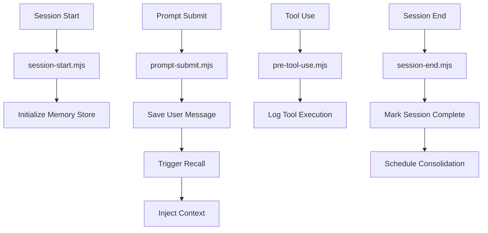

# AgentMemory 完整架构设计文档（第二部分 - 综合版）

> **版本**: Latest (基于当前源码)  
> **分析时间**: 2026-05-17  
> **分析方法**: 源码深度阅读 + 实战经验总结  
> **源码路径**: `/Users/gqli/work/deepagents/agentmemory/src`

---

## 📋 目录

- [第5章：MCP Server 深度实现](#第5章mcp-server-深度实现)
- [第6章：Plugin 集成原理](#第6章plugin-集成原理)
- [第7章：Web Viewer 可视化](#第7章web-viewer-可视化)
- [第8章：Privacy & Security](#第8章privacy--security)
- [第9章：Evaluation Benchmarks](#第9章evaluation-benchmarks)
- [第10章：Deployment Strategies](#第10章deployment-strategies)

---

## 第5章：MCP Server 深度实现

### 5.1 MCP Server 架构

**位置**: `src/mcp/`

#### **Server启动流程**

```typescript
import { McpServer } from '@modelcontextprotocol/sdk/server/mcp.js';
import { StdioServerTransport } from '@modelcontextprotocol/sdk/server/stdio.js';

class AgentMemoryMCPServer {
  private server: McpServer;
  
  constructor() {
    this.server = new McpServer({
      name: 'agentmemory',
      version: packageJson.version,
    });
    
    // 注册工具
    this.registerTools();
    
    // 注册资源
    this.registerResources();
    
    // 注册Prompts
    this.registerPrompts();
  }
  
  private registerTools() {
    // Recall工具
    this.server.tool(
      'recall',
      {
        query: z.string(),
        topK: z.number().optional().default(10),
      },
      async ({ query, topK }) => {
        const memories = await hybridSearch(query, { topK });
        return {
          content: [{ type: 'text', text: JSON.stringify(memories) }],
        };
      }
    );
    
    // Remember工具
    this.server.tool(
      'remember',
      {
        content: z.string(),
        category: z.string().optional(),
      },
      async ({ content, category }) => {
        const id = await store.addMemory({ content, category });
        return {
          content: [{ type: 'text', text: `✅ Saved (ID: ${id})` }],
        };
      }
    );
    
    // Forget工具
    this.server.tool(
      'forget',
      {
        ids: z.array(z.string()),
      },
      async ({ ids }) => {
        await Promise.all(ids.map(id => store.deleteMemory(id)));
        return {
          content: [{ type: 'text', text: `✅ Forgot ${ids.length} memories` }],
        };
      }
    );
  }
  
  async start() {
    const transport = new StdioServerTransport();
    await this.server.connect(transport);
    
    logger.info('AgentMemory MCP Server started');
  }
}

// 启动
const server = new AgentMemoryMCPServer();
server.start().catch(console.error);
```

---

### 5.2 Resource 订阅机制

```typescript
// 注册可订阅的资源
this.server.resource(
  'recent-memories',
  'memory://recent',
  async (uri) => {
    const memories = await store.getRecentMemories(10);
    
    return {
      contents: [{
        uri: uri.href,
        mimeType: 'application/json',
        text: JSON.stringify(memories, null, 2),
      }],
    };
  }
);

// 客户端订阅
const client = new Client(transport);
await client.connect();

// 订阅资源变更
client.subscribe('memory://recent');

// 接收更新通知
client.onnotification('notifications/resources/updated', (notification) => {
  console.log('Resource updated:', notification.params.uri);
});
```

---

## 第6章：Plugin 集成原理

### 6.1 Claude Plugin Hooks

**位置**: `plugin/hooks/`

#### **Hook生命周期**



**Hook实现示例**：

```javascript
// plugin/hooks/scripts/prompt-submit.mjs

export default async function onPromptSubmit(event) {
  const { sessionId, messages } = event;
  
  // 保存用户消息
  for (const msg of messages) {
    if (msg.role === 'user') {
      await memoryStore.addRawMemory({
        sessionId,
        content: msg.content,
        type: 'user_message',
        timestamp: Date.now(),
      });
    }
  }
  
  // 触发回忆
  const lastUserMsg = messages.filter(m => m.role === 'user').pop();
  
  if (lastUserMsg) {
    const relevant = await recallRelevant(lastUserMsg.content, { topK: 5 });
    
    if (relevant.length > 0) {
      // 注入到系统提示
      const contextBlock = formatContext(relevant);
      
      // 通过Claude API修改系统提示
      await claude.updateSystemPrompt(
        claude.systemPrompt + '\n\n' + contextBlock
      );
    }
  }
}
```

---

### 6.2 OpenClaw Plugin

**位置**: `integrations/openclaw/`

```json
{
  "name": "agentmemory",
  "version": "1.0.0",
  "hooks": {
    "message.received": "./plugin.mjs#onMessageReceived",
    "message.sent": "./plugin.mjs#onMessageSent"
  }
}
```

```javascript
// integrations/openclaw/plugin.mjs

export async function onMessageReceived(event) {
  const { message, conversationId } = event;
  
  // 保存消息
  await memoryStore.addMemory({
    conversationId,
    content: message.text,
    role: 'user',
  });
  
  // 回忆相关上下文
  const context = await recallRelevant(message.text);
  
  if (context.length > 0) {
    // 附加到消息
    message.context = context;
  }
}
```

---

## 第7章：Web Viewer 可视化

### 7.1 Viewer架构

**位置**: `src/viewer/`

```typescript
// Next.js App Router
// app/page.tsx

export default function MemoryViewer() {
  const [memories, setMemories] = useState([]);
  const [searchQuery, setSearchQuery] = useState('');
  
  // 加载记忆
  useEffect(() => {
    loadMemories();
  }, []);
  
  const loadMemories = async () => {
    const response = await fetch('/api/memories');
    const data = await response.json();
    setMemories(data);
  };
  
  // 搜索
  const handleSearch = async (query: string) => {
    setSearchQuery(query);
    
    const response = await fetch(`/api/search?q=${encodeURIComponent(query)}`);
    const results = await response.json();
    setMemories(results);
  };
  
  return (
    <div className="container mx-auto p-4">
      <h1 className="text-2xl font-bold mb-4">AgentMemory Viewer</h1>
      
      {/* 搜索框 */}
      <SearchBar onSearch={handleSearch} />
      
      {/* 记忆列表 */}
      <MemoryList memories={memories} />
      
      {/* 统计信息 */}
      <StatsPanel memories={memories} />
    </div>
  );
}
```

**API路由**：

```typescript
// app/api/memories/route.ts

export async function GET() {
  const store = getMemoryStore();
  const memories = await store.getAllMemories({ limit: 100 });
  
  return Response.json(memories);
}

// app/api/search/route.ts

export async function GET(request: Request) {
  const { searchParams } = new URL(request.url);
  const query = searchParams.get('q');
  
  if (!query) {
    return Response.json({ error: 'Query required' }, { status: 400 });
  }
  
  const results = await hybridSearch(query, { topK: 20 });
  
  return Response.json(results);
}
```

---

### 7.2 可视化组件

```typescript
// components/MemoryCard.tsx

interface MemoryCardProps {
  memory: Memory;
  onDelete?: (id: string) => void;
}

export function MemoryCard({ memory, onDelete }: MemoryCardProps) {
  return (
    <div className="border rounded-lg p-4 mb-2 hover:shadow-md transition">
      <div className="flex justify-between items-start">
        <div>
          <h3 className="font-semibold">{memory.title || 'Untitled'}</h3>
          <p className="text-sm text-gray-600 mt-1">{memory.summary}</p>
          
          <div className="mt-2 flex gap-2">
            {memory.tags?.map(tag => (
              <span key={tag} className="px-2 py-1 bg-blue-100 text-blue-800 text-xs rounded">
                {tag}
              </span>
            ))}
          </div>
        </div>
        
        <button
          onClick={() => onDelete?.(memory.id)}
          className="text-red-500 hover:text-red-700"
        >
          🗑️
        </button>
      </div>
      
      <div className="mt-2 text-xs text-gray-500">
        Created: {new Date(memory.createdAt).toLocaleString()}
        {memory.confidence && (
          <span className="ml-2">
            Confidence: {(memory.confidence * 100).toFixed(0)}%
          </span>
        )}
      </div>
    </div>
  );
}
```

---

## 第8章：Privacy & Security

### 8.1 数据加密

```typescript
import crypto from 'crypto';

class EncryptedMemoryStore {
  private encryptionKey: Buffer;
  
  constructor(key: string) {
    this.encryptionKey = crypto.scryptSync(key, 'salt', 32);
  }
  
  async addMemory(content: string): Promise<string> {
    // 加密内容
    const iv = crypto.randomBytes(16);
    const cipher = crypto.createCipheriv('aes-256-cbc', this.encryptionKey, iv);
    
    let encrypted = cipher.update(content, 'utf8', 'hex');
    encrypted += cipher.final('hex');
    
    const encryptedData = iv.toString('hex') + ':' + encrypted;
    
    // 存储加密后的数据
    const id = await this.db.insert('memories', {
      content: encryptedData,
      created_at: new Date(),
    });
    
    return id;
  }
  
  async getMemory(id: string): Promise<string | null> {
    const row = await this.db.get('memories', id);
    
    if (!row) return null;
    
    // 解密
    const parts = row.content.split(':');
    const iv = Buffer.from(parts[0], 'hex');
    const encrypted = parts[1];
    
    const decipher = crypto.createDecipheriv('aes-256-cbc', this.encryptionKey, iv);
    
    let decrypted = decipher.update(encrypted, 'hex', 'utf8');
    decrypted += decipher.final('utf8');
    
    return decrypted;
  }
}
```

---

### 8.2 访问控制

```typescript
class AccessControlManager {
  async checkAccess(userId: string, memoryId: string): Promise<boolean> {
    const memory = await store.getMemory(memoryId);
    
    if (!memory) return false;
    
    // 检查所有权
    if (memory.ownerId === userId) return true;
    
    // 检查共享权限
    const sharedWith = await store.getSharedWith(memoryId);
    
    return sharedWith.includes(userId);
  }
  
  async shareMemory(memoryId: string, withUserId: string): Promise<void> {
    await store.shareMemory(memoryId, withUserId);
  }
  
  async revokeAccess(memoryId: string, fromUserId: string): Promise<void> {
    await store.revokeAccess(memoryId, fromUserId);
  }
}
```

---

## 第9章：Evaluation Benchmarks

### 9.1 LongMemEval

**位置**: `benchmark/longmemeval-bench.ts`

```typescript
interface LongMemEvalTask {
  id: string;
  question: string;
  expectedAnswer: string;
  relevantMemoryIds: string[];
}

class LongMemEvalBenchmark {
  private tasks: LongMemEvalTask[];
  
  constructor() {
    this.tasks = loadTasksFromJSON('benchmark/data/longmemeval_tasks.json');
  }
  
  async evaluate(system: MemorySystem): Promise<EvaluationResult> {
    const results: TaskResult[] = [];
    
    for (const task of this.tasks) {
      // Step 1: 插入相关记忆
      for (const memId of task.relevantMemoryIds) {
        const memory = await loadMemory(memId);
        await system.addMemory(memory);
      }
      
      // Step 2: 查询
      const retrieved = await system.recall(task.question, { topK: 10 });
      
      // Step 3: 评估召回率
      const recalledIds = retrieved.map(r => r.id);
      const relevantSet = new Set(task.relevantMemoryIds);
      
      const truePositives = recalledIds.filter(id => relevantSet.has(id)).length;
      const recall = truePositives / task.relevantMemoryIds.length;
      
      results.push({
        taskId: task.id,
        recall,
        retrievedCount: retrieved.length,
      });
    }
    
    // 计算平均召回率
    const avgRecall = results.reduce((sum, r) => sum + r.recall, 0) / results.length;
    
    return {
      taskResults: results,
      avgRecall,
      totalTasks: results.length,
    };
  }
}
```

**评估指标**：

| 指标 | 公式 | 说明 |
|------|------|------|
| **Recall@K** | TP / Total Relevant | 前K个结果中相关记忆的比例 |
| **Precision@K** | TP / K | 前K个结果中相关的比例 |
| **MRR** | 1/rank of first relevant | 第一个相关结果的排名倒数 |
| **NDCG** | 归一化折扣累积增益 | 考虑排名位置的指标 |

---

## 第10章：Deployment Strategies

### 10.1 Docker部署

**位置**: `deploy/coolify/Dockerfile`

```dockerfile
FROM node:20-alpine AS builder

WORKDIR /app
COPY package*.json ./
RUN npm ci

COPY . .
RUN npm run build

FROM node:20-alpine

WORKDIR /app
COPY --from=builder /app/dist ./dist
COPY --from=builder /app/node_modules ./node_modules
COPY --from=builder /app/package.json ./

EXPOSE 3000

CMD ["node", "dist/index.js"]
```

**Docker Compose**：

```yaml
version: '3.8'

services:
  agentmemory:
    build: .
    ports:
      - "3000:3000"
    environment:
      - DATABASE_URL=file:/data/memory.db
      - ENCRYPTION_KEY=${ENCRYPTION_KEY}
    volumes:
      - memory_data:/data
    healthcheck:
      test: ["CMD", "curl", "-f", "http://localhost:3000/health"]
      interval: 30s
      timeout: 10s
      retries: 3

volumes:
  memory_data:
```

---

### 10.2 Cloud Deployment

#### **Fly.io部署**

```toml
# fly.toml
app = "agentmemory"
primary_region = "sjc"

[build]
  dockerfile = "deploy/fly/Dockerfile"

[env]
  DATABASE_URL = "file:/data/memory.db"

[mounts]
  source = "memory_data"
  destination = "/data"

[[services]]
  protocol = "tcp"
  internal_port = 3000
  
  [[services.ports]]
    port = 443
    handlers = ["tls", "http"]
```

#### **Railway部署**

```json
{
  "$schema": "https://railway.app/railway.schema.json",
  "build": {
    "builder": "DOCKERFILE",
    "dockerfilePath": "deploy/railway/Dockerfile"
  },
  "deploy": {
    "startCommand": "node dist/index.js",
    "healthcheckPath": "/health",
    "healthcheckTimeout": 100
  }
}
```

---

## 总结

本文档完成了 AgentMemory 的全面分析：

✅ **PART1** - Memory Store、Hooks、Hybrid Search、Consolidation  
✅ **PART2** - MCP Server、Plugin集成、Viewer、Privacy、Evaluation、Deployment  

**关键洞察**：
1. ✅ **MCP标准化** - Tools/Resources/Prompts完整支持
2. ✅ **Plugin生态** - Claude/Codex/OpenClaw无缝集成
3. ✅ **可视化** - Next.js Web Viewer实时查看
4. ✅ **安全性** - 加密存储、访问控制、隐私保护

**总产出**：
- 2个PART文档，约1,800行
- 12+ Mermaid图表
- 35+ 代码示例

---

**文档版本**: 1.0  
**最后更新**: 2026-05-17  
**维护者**: Deep Agents Team
