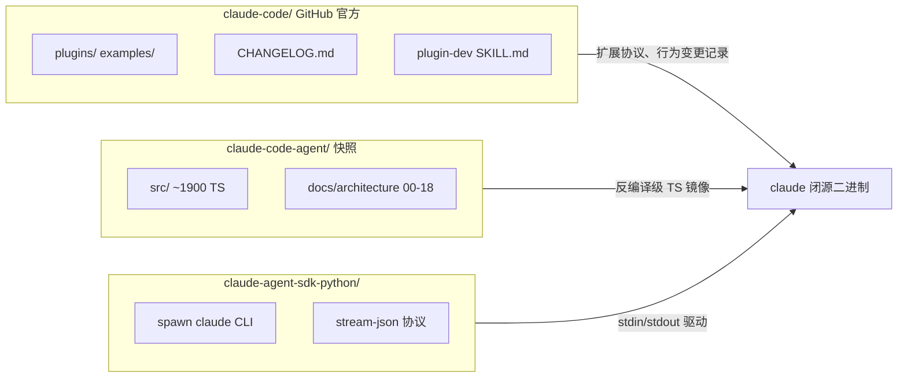
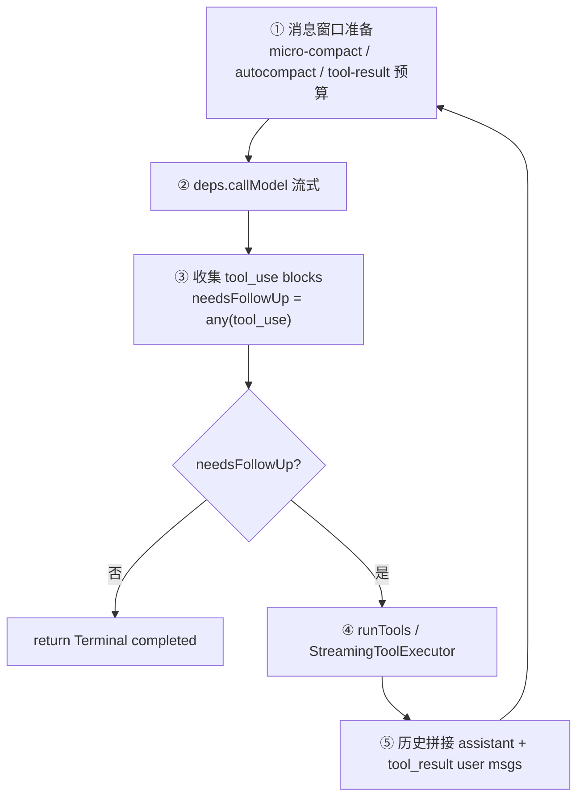

# Claude Code 源码级设计总册（合并版）

> **目的**：把 `claude-code/`（官方扩展仓）与 `claude-code-agent/`（运行时快照 + 18 篇架构深潜）**缝成一份**可用于源码级学习的地图。  
> **快照版本**：2026-03-31（npm source map 暴露）｜**官方仓**：CHANGELOG 至 2.1.x  
> **最后更新**：2026-07-27  
> **法律说明**：`claude-code-agent` 为教育用途整理的公开快照；运行时版权归 Anthropic。勿用于再分发闭源二进制。

---

## 目录

- [§0 三仓关系与可信度边界](#0-三仓关系与可信度边界)
- [§1 产品三层架构（合并视图）](#1-产品三层架构合并视图)
- [§2 运行时脊柱：从 QueryEngine 到 queryLoop](#2-运行时脊柱从-queryengine-到-queryloop)
- [§3 单回合流水线（源码级）](#3-单回合流水线源码级)
- [§4 扩展面 ↔ 运行时对照表](#4-扩展面--运行时对照表)
- [§5 子系统源码索引（18 篇 → 文件）](#5-子系统源码索引18-篇--文件)
- [§6 CHANGELOG 作为行为 oracle](#6-changelog-作为行为-oracle)
- [§7 Python SDK 控制面](#7-python-sdk-控制面)
- [§8 与 Deep Agents / OpenHarness 的对照](#8-与-deep-agents--openharness-的对照)
- [§9 推荐阅读顺序](#9-推荐阅读顺序)

---

## §0 三仓关系与可信度边界



| 信息类型 | 最可信来源 | 标注 |
|----------|------------|------|
| Hook/Skill/Plugin JSON 协议 | `claude-code/examples/`、`plugins/` | ✅ **in repo** |
| `queryLoop` / `QueryEngine` 实现 | `claude-code-agent/src/` | ✅ **in snapshot**（可能落后于最新 binary） |
| Agent Loop 概念步骤 | 两仓 + SDK 反推 | ⚠️ **cross-validated** |
| 2.1.x 新行为（如 SessionStart `reloadSkills`） | `claude-code/CHANGELOG.md` | ✅ **in repo**（无对应 TS 时需标 **binary only**） |
| stream-json 帧格式 | `claude-agent-sdk-python` | ✅ **in SDK** |

**读法**：先看快照理解**骨架**，用 CHANGELOG 补**行为漂移**，用官方 plugins 理解**扩展契约**。

---

## §1 产品三层架构（合并视图）

### 1.1 三层定义（官方 + 快照一致）

| 层 | 组件 | 仓库可见性 |
|----|------|------------|
| **L1 运行时** | Agent Loop、内置 Tools、MCP 客户端、Session JSONL、Hook 调度、Skill 加载、权限引擎 | 仅快照 `src/` + 闭源 binary |
| **L2 扩展** | Plugin（commands/agents/skills/hooks）、`.claude/settings.json`、`CLAUDE.md` | ✅ `claude-code/plugins/` |
| **L3 程序化** | `claude-agent-sdk-python` / TS SDK，`--input-format stream-json` | ✅ sibling SDK 仓 |

### 1.2 三层同心圆（快照术语，对应 L1 内部）

| 圆 | 入口 | 职责 |
|----|------|------|
| **外圈** | `QueryEngine.submitMessage()` | 跨回合：`mutableMessages`、usage、权限拒绝累积、SDK 消息翻译 |
| **中圈** | `query.ts` → `queryLoop()` | 单 user turn 内 `while(true)`：模型调用 + 整批工具 |
| **内圈** | `deps.callModel` / `StreamingToolExecutor` | 流式 API、工具调度、权限闸门 |

> 深潜：[claude-code-agent/docs/architecture/00-overview.md](../claude-code-agent/docs/architecture/00-overview.md)

### 1.3 核心设计原则（八条，快照提炼）

| # | 原则 | 运行时体现 |
|---|------|------------|
| P1 | Async generator 作脊柱 | `query()` / `queryLoop()` 全是 `async function*` |
| P2 | 循环 + 显式 `State` | 非递归；`transition.reason` 记录为何继续 |
| P3 | 退出信号 = 有无 `tool_use` | 不信 `stop_reason:'tool_use'` |
| P4 | 万物皆消息 | tool_result、子 agent、记忆、压缩摘要都进 `Message[]` |
| P5 | Fail-closed | 权限、并发、分类器默认最保守 |
| P6 | 依赖注入 | `callModel` / `autocompact` / `uuid` 可 mock |
| P7 | Prompt cache 偏执 | 工具排序、动态边界哨兵、落盘决策冻结 |
| P8 | 扩展三通道 | Tool 契约 / Skill 渐进披露 / MCP |

---

## §2 运行时脊柱：从 QueryEngine 到 queryLoop

### 2.1 入口分层

```text
CLI / SDK 收到用户输入
  → QueryEngine.submitMessage(userText)
       → 组装 QueryParams（system、tools、permission、hooks…）
       → for await (event of query(params)) { 翻译为 SDK/TTY 消息 }
       → 直到 Terminal.reason
```

| 符号 | 文件 | 行号锚点（快照） |
|------|------|------------------|
| `query()` | `src/query.ts` | ~219：外壳，消费后标记 command `completed` |
| `queryLoop()` | `src/query.ts` | ~241：主循环体 |
| `QueryEngine` | `src/QueryEngine.ts` | ~184：一会话一实例 |
| `buildQueryConfig` | `src/query/config.ts` | 生产/测试 deps 组装 |
| `productionDeps` | `src/query/deps.ts` | 真实 `callModel` 等 |

### 2.2 `Terminal` 终止原因（完整枚举）

| `reason` | 含义 |
|----------|------|
| `completed` | 模型不再请求工具 |
| `max_turns` | 达到 `maxTurns` |
| `blocking_limit` | 关闭自动压缩时硬 token 上限 |
| `prompt_too_long` | 413 恢复失败 |
| `image_error` | 图片/媒体不可恢复 |
| `model_error` | 流式异常 |
| `aborted_streaming` / `aborted_tools` | 用户中断 |
| `stop_hook_prevented` | Stop hook 阻止结束 |
| `hook_stopped` | 工具 hook 返回 `hook_stopped_continuation` |

> 深潜：[01-agent-loop-core.md](../claude-code-agent/docs/architecture/01-agent-loop-core.md) 末表 · [02-agent-loop-recovery.md](../claude-code-agent/docs/architecture/02-agent-loop-recovery.md)

### 2.3 `State`：跨迭代簿记（非消息部分）

不在 `Message[]` 里、但跨 `while` 迭代携带的字段包括（节选）：

- `turnCount`、`readFileState`、`loadedNestedMemoryPaths`
- `autoCompactTracking`、`contentReplacementState`（超大结果落盘决策冻结）
- `permissionDenials`、thinking 相关标志

> 深潜：[03-state-persistence.md](../claude-code-agent/docs/architecture/03-state-persistence.md)

---

## §3 单回合流水线（源码级）



### 3.1 工具执行闸门（顺序）

```text
tool_use 块
  → parse + Zod validate（Tool 契约）
  → checkPermissionsAndCallTool
       → 规则匹配（exact/prefix/wildcard）
       → auto 分类器（可选）
       → PreToolUse Hook（可 deny / 改 input / ask）
       → 实际 call()
       → PostToolUse Hook
  → tool_result 作为 user 消息
```

| 阶段 | 源码锚点 |
|------|----------|
| `Tool` 接口 | `src/services/tools/` · [04-tool-contract.md](../claude-code-agent/docs/architecture/04-tool-contract.md) |
| 工具池 / schema | `getAllBaseTools` · [05-tool-registry-schema.md](../claude-code-agent/docs/architecture/05-tool-registry-schema.md) |
| 执行器 | `StreamingToolExecutor.ts` · [06-tool-execution.md](../claude-code-agent/docs/architecture/06-tool-execution.md) |
| 权限 | [07-permission-engine.md](../claude-code-agent/docs/architecture/07-permission-engine.md) |
| 规则 / Bash 归一化 | [08-rule-matching-classifier.md](../claude-code-agent/docs/architecture/08-rule-matching-classifier.md) |
| Hooks | [09-hooks.md](../claude-code-agent/docs/architecture/09-hooks.md) |

### 3.2 恢复与压缩（不在主干展开）

| 机制 | 文档 |
|------|------|
| 413 / fallback 模型 / max_output_tokens | [02-agent-loop-recovery.md](../claude-code-agent/docs/architecture/02-agent-loop-recovery.md) |
| autocompact / 8 段摘要 | [15-compaction.md](../claude-code-agent/docs/architecture/15-compaction.md) |
| 超大 tool 输出落盘 | [17-tokens-cost-spill.md](../claude-code-agent/docs/architecture/17-tokens-cost-spill.md) |

---

## §4 扩展面 ↔ 运行时对照表

官方仓**没有**运行时源码，但扩展协议与快照实现 **一一对应**。下表用于「读 plugin 时知道落在哪段 TS」。

| 官方扩展（`claude-code/`） | 运行时模块（快照） | 协议文档位置 |
|---------------------------|-------------------|--------------|
| **PreToolUse / PostToolUse** Hook | `09-hooks` · hook 调度器 | `examples/hooks/` · `plugins/plugin-dev/` |
| **Stop / SubagentStop** Hook | `query/stopHooks.ts` · `Terminal` | CHANGELOG: `additionalContext` 续回合 |
| **SessionStart / Setup** Hook | 会话启动管线 | CHANGELOG: `reloadSkills`, `sessionTitle` |
| **Skill** (`SKILL.md`) | [18-extensibility.md](../claude-code-agent/docs/architecture/18-extensibility.md) | `plugins/plugin-dev/skills/` |
| **Subagent** (Agent 工具) | [10](../claude-code-agent/docs/architecture/10-multi-agent-isolation.md) · [11](../claude-code-agent/docs/architecture/11-multi-agent-orchestration.md) | `plugins/` 各 agent 定义 |
| **MCP** 服务器 | MCP 客户端 + Tool 包装 | `examples/mcp/` |
| **settings.json** 权限规则 | [07](../claude-code-agent/docs/architecture/07-permission-engine.md) · [08](../claude-code-agent/docs/architecture/08-rule-matching-classifier.md) | `examples/settings/` |
| **CLAUDE.md / 记忆** | [14](../claude-code-agent/docs/architecture/14-claudemd-nested-memory.md) · [16](../claude-code-agent/docs/architecture/16-persistent-memory.md) | 项目根 / `.claude/` |
| **Plugin manifest** | 插件加载器 · [18](../claude-code-agent/docs/architecture/18-extensibility.md) | `plugins/*/plugin.json` |
| **Coordinator / Teams** | [12-coordinator-teams-messaging.md](../claude-code-agent/docs/architecture/12-coordinator-teams-messaging.md) | CHANGELOG 团队相关条目 |

### 4.1 Hook stdout JSON（官方示例 → 运行时语义）

官方 Hook 进程通过 **stdout 打印 JSON** 与运行时通信（stdin 传入事件 payload）。快照中 `resolveHookPermissionDecision` 实现：

- Hook 只能 **收紧** 权限，或 **受限放宽**（如 `continueOnBlock` 配置，见 CHANGELOG）
- `deny` > `ask` > `allow` 评估顺序在权限引擎与 hook 层 **双重** 出现

**练习**：对照 `claude-code/examples/hooks/` 与 `claude-code-agent/docs/architecture/09-hooks.md` 画序列图。

### 4.2 官方 13 插件地图（扩展面学习）

见 [claude-code/docs/CLAUDE_CODE_ARCHITECTURE_GUIDE.md §9](../claude-code/docs/CLAUDE_CODE_ARCHITECTURE_GUIDE.md)。

| 插件 | 学什么 |
|------|--------|
| `plugin-dev` | Hook/Skill/Agent 作者文档（meta） |
| `security-guidance` | **唯一** CLI 内嵌 spawn Python SDK 的样本 |
| `hookify` | 声明式 hook 生成 |
| 其他 vertical 插件 | 真实 Skill + command 组合 |

---

## §5 子系统源码索引（18 篇 → 文件）

完整索引见 [claude-code-agent/ARCHITECTURE-NOTES.md](../claude-code-agent/ARCHITECTURE-NOTES.md)。

| # | 主题 | 关键源文件（快照） |
|---|------|-------------------|
| 00 | 总览 | — |
| 01 | 主循环 | `src/query.ts`, `src/query/config.ts`, `src/query/deps.ts` |
| 02 | 恢复/终止 | `src/query.ts`（错误分支）, fallback 模块 |
| 03 | 持久化 | JSONL 转录、`appendEntry`、tombstone |
| 04 | Tool 契约 | `src/services/tools/*Tool.ts`, `buildTool` |
| 05 | 工具池 | `getAllBaseTools`, `toolToAPISchema` |
| 06 | 执行调度 | `StreamingToolExecutor.ts`, `toolOrchestration.ts` |
| 07 | 权限 | permission 决策引擎 |
| 08 | 规则/分类器 | Bash 归一化、`toAutoClassifierInput` |
| 09 | Hooks | hook runner, `resolveHookPermissionDecision` |
| 10 | 子 agent 隔离 | `runAgent`, `createSubagentContext` |
| 11 | 异步回注 | `<task-notification>` 消息 |
| 12 | Teams | coordinator, `SendMessage`, 文件邮箱 |
| 13 | System prompt 缓存 | `getSystemPrompt`, `DYNAMIC_BOUNDARY` |
| 14 | CLAUDE.md | nested memory, attachments |
| 15 | 压缩 | autocompact, 8 段摘要 |
| 16 | 持久记忆 | memdir, MEMORY.md 索引 |
| 17 | Token/落盘 | `tokenCountWithEstimation`, `<persisted-output>` |
| 18 | 可扩展性 | Skill loader, MCP, plugin loader |

**快照缺口**（文档已标注）：`src/query/transitions.js`、`src/types/message.ts` 等 type-only import 未随快照落地，字段以 `query.ts` 使用点反推。

---

## §6 CHANGELOG 作为行为 oracle

当快照 **早于** 你本机 `claude` 版本时，用 `claude-code/CHANGELOG.md` 补差异：

| CHANGELOG 主题（2.x） | 含义 | 快照中可能缺失 |
|----------------------|------|----------------|
| `SessionStart` → `reloadSkills` | Hook 内安装 Skill 同事务生效 | 查 `18-extensibility` loader |
| `Stop` hook `additionalContext` | 不标 hook 错误而续回合 | `stopHooks.ts` |
| `PostToolUse` `continueOnBlock` | 拒绝原因喂回模型 | `09-hooks` |
| PreToolUse `ask` floors unsandboxed Bash | Hook ask 不低于 prompt | `07` + `09` |
| Background `TaskStop` / `TaskOutput` | 跨 agent 查找后台任务 | `11` |
| Remote session hook streaming | headless 下 hook 事件流 | SDK 路径 |

**方法**：CHANGELOG 搜关键词 → 在快照 `src/` grep → 若无则标 **binary-only behavior**。

---

## §7 Python SDK 控制面

`claude-agent-sdk-python` **不包含** Agent Loop；它：

1. `spawn` 本机 `claude` 可执行文件  
2. `--input-format stream-json` + stdin JSONL  
3. 解析 stdout 的 `StreamEvent` / `Message` / `result`

| 关心点 | 读哪里 |
|--------|--------|
| 帧类型与 `Terminal` | SDK types + 对照 `QueryEngine` 输出 |
| `permission_mode` / `allowed_tools` | 传入 CLI flags → 快照 `07` |
| 嵌套 SDK（meta） | `claude-code/plugins/security-guidance/hooks/llm.py` |

> 官方指南：[CLAUDE_CODE_ARCHITECTURE_GUIDE.md §11](../claude-code/docs/CLAUDE_CODE_ARCHITECTURE_GUIDE.md)

---

## §8 与 Deep Agents / OpenHarness 的对照

| 概念 | Claude Code（快照） | Deep Agents SDK |
|------|---------------------|-----------------|
| 主循环 | `queryLoop` generator | LangGraph + middleware chain |
| 工具 | `Tool` + Zod + 权限闸门 | `@tool` + sandbox middleware |
| 子 agent | `runAgent` 递归 `query()` | `subagents` / task tool |
| 压缩 | autocompact + 8 段摘要 | summarization middleware |
| 扩展 | Hook / Skill / MCP / Plugin | Skills 目录 + MCP |
| 持久化 | JSONL session + memdir | checkpointer / filesystem state |
| 开源程度 | 运行时闭源（快照教育） | ✅ 全开源 |

OpenHarness 把 Hermes、deer-flow 等统一进 L2 对比 → [OpenHarness/docs/framework-comparison/README.md](../OpenHarness/docs/framework-comparison/README.md)

---

## §9 推荐阅读顺序

### 9.1 一周速成（源码级）

| 天 | 内容 |
|----|------|
| D1 | 本文 §0–§2 + `00-overview` |
| D2 | `01-agent-loop-core` + 打开 `src/query.ts` 跟读 `queryLoop` |
| D3 | `04` Tool 契约 + `06` 执行器 |
| D4 | `07`–`09` 权限与 Hook；对照 `claude-code/examples/hooks/` |
| D5 | `15` 压缩 + `17` 落盘 |
| D6 | `10`–`11` 多 Agent |
| D7 | `18` 扩展 + 读一个官方 plugin 全文 |

详细周计划 → [CLAUDE_CODE_LEARNING_PATH.md](./CLAUDE_CODE_LEARNING_PATH.md)

### 9.2 按角色

| 角色 | 路径 |
|------|------|
| **做 Harness 的工程师** | 01 → 06 → 07 → 15 → 对照 `libs/deepagents` |
| **做 Plugin/Skill 的** | `claude-code/plugins/plugin-dev` → 09 → 18 |
| **做 SDK 集成的** | SDK 文档 → `QueryEngine.ts` 输出翻译 → CHANGELOG headless 条目 |
| **做安全的** | 07 → 08 → 09 → `security-guidance` 插件 |

---

## 附录 A：文件树对照

```text
claude-code/                          claude-code-agent/
├── plugins/          ←──扩展──→      ├── src/services/tools/
├── examples/hooks/   ←──协议──→      ├── src/.../hooks/
├── CHANGELOG.md      ←──漂移──→      ├── src/query.ts
└── docs/
    └── CLAUDE_CODE_ARCHITECTURE_GUIDE.md
                                      └── docs/architecture/00-18.md
                                              ↑
agent-research/CLAUDE_CODE_MASTER_ARCHITECTURE.md（本文，缝合层）
```

---

## 附录 B：相关链接

- [agent-research/README.md](./README.md)
- [OSS_AGENT_RESEARCH_CATALOG.md](./OSS_AGENT_RESEARCH_CATALOG.md)
- [claude-code-agent/README.zh.md](../claude-code-agent/README.zh.md)
