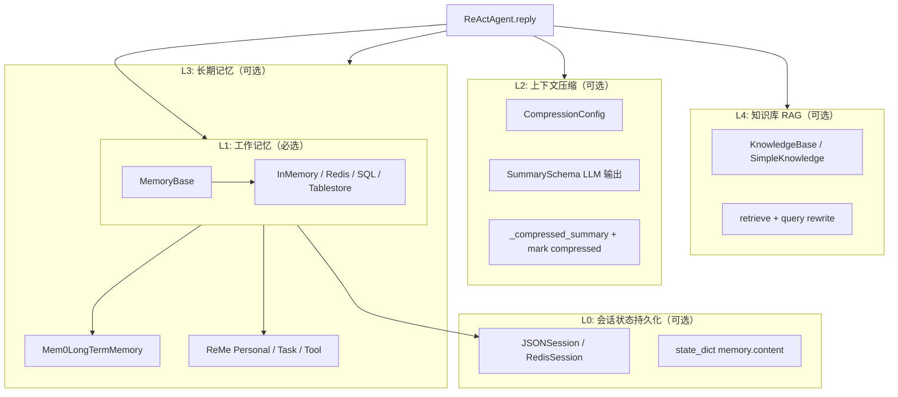
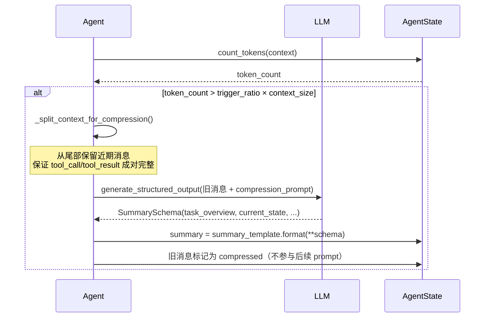
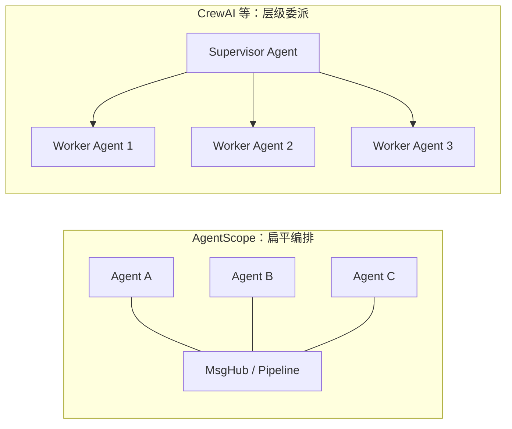

# AgentScope 长期记忆与 Agent 架构分析

> **版本**: 1.0  
> **分析时间**: 2026-05-22  
> **App 层 Team/子 Agent**（`AgentCreate` 等）：见 [APP_ARCHITECTURE.md](./APP_ARCHITECTURE.md) §7 — 核心 `Agent` 仍无内置 delegate。  
> **分析方法**: 源码深度阅读 + 文档交叉验证
> **源码路径**: `src/agentscope/`
> **前置阅读**: [ARCHITECTURE.md](./ARCHITECTURE.md) · [MEMORY_SYSTEM](./MEMORY_SYSTEM.md)

---

## 📋 目录

- [第1章：Agent 架构分析——没有子 Agent](#第1章agent-架构分析没有子-agent)
- [第2章：长期记忆系统——源码与文档差异](#第2章长期记忆系统源码与文档差异)
- [第3章：当前 v1 实际可用的记忆机制](#第3章当前-v1-实际可用的记忆机制)
- [第4章：长期记忆的替代实现方案](#第4章长期记忆的替代实现方案)
- [第5章：多 Agent 协作机制——扁平编排而非层级委派](#第5章多-agent-协作机制扁平编排而非层级委派)
- [第6章：与竞品对比](#第6章与竞品对比)
- [第7章：设计取舍与总结](#第7章设计取舍与总结)

---

## 第1章：Agent 架构分析——没有子 Agent

### 1.1 Agent 类结构

**位置**: `src/agentscope/agent/_agent.py`（2390 行）

AgentScope v1 的 `Agent` 类是一个**独立的、自包含的 ReAct 智能体**，其构造函数参数为：

```python
class Agent:
    def __init__(
        self,
        name: str,
        system_prompt: str,
        model: ChatModelBase,
        toolkit: Toolkit | None = None,
        middlewares: list[MiddlewareBase] | None = None,
        state: AgentState | None = None,
        offloader: Offloader | None = None,
        model_config: ModelConfig = ModelConfig(),
        context_config: ContextConfig = ContextConfig(),
        react_config: ReActConfig = ReActConfig(),
    ):
```

**没有任何 `children`、`sub_agents`、`parent`、`delegate` 之类的字段**。Agent 内部不持有其他 Agent 的引用，也无法嵌套或委托给另一个 Agent。

### 1.2 AgentState 结构

**位置**: `src/agentscope/state/_state.py`

```python
class AgentState(BaseModel):
    session_id: str
    summary: str | list[TextBlock | DataBlock] = ""   # 压缩摘要
    context: list[Msg] = []                            # 对话上下文
    reply_id: str
    cur_iter: int = 0
    permission_context: PermissionContext
    tool_context: ToolContext
    tasks_context: TaskContext
```

AgentState 中同样**没有任何子 Agent 相关字段**。

### 1.3 ReAct 循环内部流程

Agent 的核心是 `_reply_impl()` 方法，执行标准的 ReAct 循环：

```
Step 1: 检查输入事件（用户确认 / 外部执行结果）
Step 2: 处理输入消息，写入 context
Step 3: 进入 reasoning-acting 循环
  ├─ 3.1 检查下一步动作（exit / reasoning / acting）
  ├─ 3.2 reasoning：压缩上下文 → 调用 LLM → 生成回复或工具调用
  └─ 3.3 acting：执行工具调用（顺序 / 并发）→ 结果写入 context
Step 4: 超过 max_iters 则退出
```

整个循环中**没有任何调用其他 Agent 的逻辑**，只有 `toolkit.call_tool()` 执行工具。

### 1.4 源码验证

在 `src/agentscope/` 中搜索以下关键词，均无结果：

| 搜索词 | 结果 |
|--------|------|
| `sub_agent` / `child_agent` / `delegate_agent` | ❌ 无匹配 |
| `spawn_agent` / `agent_hierarchy` | ❌ 无匹配 |
| `orchestrat` | ❌ 无匹配 |
| `long_term_memory` / `LongTermMemory` | ❌ 无匹配 |
| `Mem0` / `ReMe` | ❌ 无匹配（源码中） |

---

## 第2章：长期记忆系统——源码与文档差异

### 2.1 关键发现：v1 源码中尚未实现长期记忆

经过对源码的逐目录验证：

| 预期路径 | 是否存在 | 说明 |
|----------|----------|------|
| `src/agentscope/memory/` | ❌ 不存在 | 文档描述的 memory 子目录 |
| `src/agentscope/memory/_working_memory/` | ❌ 不存在 | 工作记忆实现 |
| `src/agentscope/memory/_long_term_memory/` | ❌ 不存在 | 长期记忆实现 |
| `src/agentscope/rag/` | ❌ 不存在 | RAG 知识库 |
| `src/agentscope/session/` | ❌ 不存在 | Session 持久化 |
| `src/agentscope/plan/` | ❌ 不存在 | Plan Notebook |
| `src/agentscope/a2a/` | ❌ 不存在 | A2A 协议 |

**结论**：`MEMORY_SYSTEM.md` 等文档中描述的长期记忆、RAG、Session、Plan、A2A 等功能属于**旧版（v0.x）或规划中功能**，尚未迁移到当前 v1 异步版本。

### 2.2 文档与源码的对应关系

| 文档描述 | v1 源码实际状态 |
|----------|-----------------|
| `MemoryBase` + `InMemoryMemory` / `RedisMemory` | ❌ 不存在；由 `AgentState.context` 替代 |
| `LongTermMemoryBase` + `Mem0LongTermMemory` | ❌ 不存在 |
| `ReMePersonalLongTermMemory` / `TaskLongTermMemory` / `ToolLongTermMemory` | ❌ 不存在 |
| `CompressionConfig`（嵌套在 ReActAgent 中） | ✅ 已实现为 `ContextConfig`（独立配置类） |
| `KnowledgeBase` + `SimpleKnowledge` | ❌ 不存在 |
| `JSONSession` / `RedisSession` | ❌ 不存在 |
| `PlanNotebook` | ❌ 不存在；由 `TaskCreate`/`TaskUpdate` 工具替代 |
| `MsgHub` | ❌ 不存在（v1 源码中） |
| `SequentialPipeline` / `FanoutPipeline` | ❌ 不存在（v1 源码中） |

### 2.3 文档描述的长期记忆设计（参考）

以下为文档中描述的长期记忆架构，供未来迁移参考：

#### 分层架构



#### 三种控制模式

| 模式 | `_static_control` | `_agent_control` | 行为 |
|------|-------------------|------------------|------|
| `static_control` | ✓ | ✗ | 每 reply 自动 retrieve + 结束 record |
| `agent_control` | ✗ | ✓ | 注册两个工具，模型自控 |
| `both` | ✓ | ✓ | 自动 + 工具并存 |

#### 注入格式

```xml
<long_term_memory>
The content below are retrieved from long-term memory, which maybe useful:
{retrieved_info}
</long_term_memory>
```

以 `Msg(name="long_term_memory", role="user")` 写入工作记忆。

---

## 第3章：当前 v1 实际可用的记忆机制

### 3.1 对话上下文（AgentState.context）

**核心载体**，存储当前会话的完整对话历史：

```python
class AgentState(BaseModel):
    context: list[Msg] = []  # 对话上下文
```

- 每轮 `reply()` 的输入消息和输出消息都写入 `context`
- 工具调用（`ToolCallBlock`）和工具结果（`ToolResultBlock`）也存储在 `context` 中的 `AssistantMsg` 内
- `_prepare_model_input()` 将 `system_prompt` + `summary` + `context` 组装为 LLM 输入

### 3.2 上下文压缩（ContextConfig）

**位置**: `src/agentscope/agent/_config.py`

```python
class ContextConfig(BaseModel):
    trigger_ratio: float = 0.8       # 上下文占用超过 80% 时触发压缩
    reserve_ratio: float = 0.1       # 保留 10% 近期上下文
    compression_prompt: str = ...    # 引导压缩模型的提示
    summary_template: str = ...      # 摘要模板
    summary_schema: dict = ...       # 结构化摘要 Schema
    tool_result_limit: int = 3000    # 工具结果截断 token 限制
```

#### 压缩流程



#### SummarySchema 结构

| 字段 | 用途 |
|------|------|
| `task_overview` | 用户核心请求与成功标准 |
| `current_state` | 已完成工作与产出 |
| `important_discoveries` | 约束、决策、错误与修复 |
| `next_steps` | 待办与阻塞 |
| `context_to_preserve` | 偏好、领域细节、承诺 |

#### 压缩后的 prompt 组装

```python
# _prepare_model_input() 的组装逻辑
messages = [
    SystemMsg(content=system_prompt),      # 系统提示
]
if state.summary:
    messages.append(UserMsg(content=state.summary))  # 压缩摘要
messages.extend(state.context)             # 未压缩的近期上下文
```

### 3.3 工具结果截断

当工具返回结果过长时，自动截断并附加提醒：

```python
# 超过 tool_result_limit 的工具结果会被截断
reserved, offload = await self._split_tool_result_for_compression(tool_result)

# 截断后附加提醒
reminder = "\n<<<TRUNCATED>>>\n<system-reminder>The remaining content has been omitted...</system-reminder>"

# 如果配置了 offloader，截断内容可保存到文件
if self.offloader:
    path = await self.offloader.offload_tool_result(session_id, offload)
    reminder += f" You can refer to the file in \'{path}\' for the truncated content."
```

### 3.4 上下文卸载（Offloader）

**位置**: `src/agentscope/workspace/`

`Offloader` 可将压缩后的旧上下文和截断的工具结果保存到外部存储（本地文件系统、Docker、E2B 等），并在摘要中附加文件路径引用。

### 3.5 任务管理（Task Tools）

**位置**: `src/agentscope/tool/_task/`

虽然不是记忆系统，但 `TaskCreate`/`TaskUpdate`/`TaskList`/`GetTask` 工具可以让 Agent 在 ReAct 循环中跟踪任务进度，起到一定的"工作记忆"作用。

| 工具 | 功能 |
|------|------|
| `TaskCreate` | 创建子任务 |
| `TaskUpdate` | 更新任务状态（pending → in_progress → completed） |
| `TaskList` | 列出所有任务 |
| `GetTask` | 获取任务详情 |

任务存储在 `AgentState.tasks_context` 中。

### 3.6 技能系统（Skill）

**位置**: `src/agentscope/skill/`

`SkillViewer` 工具允许 Agent 查看和激活预定义的技能（markdown 格式），技能描述会注入到系统提示中。这是**知识/指令注入**，不是独立记忆。

### 3.7 能力矩阵

| 能力 | v1 状态 | 实现方式 |
|------|---------|----------|
| 对话上下文 | ✅ 已实现 | `AgentState.context` |
| 上下文压缩 | ✅ 已实现 | `ContextConfig` + `compress_context()` |
| 工具结果截断 | ✅ 已实现 | `ContextConfig.tool_result_limit` |
| 上下文卸载 | ✅ 已实现 | `Offloader` |
| 任务跟踪 | ✅ 已实现 | `TaskCreate`/`TaskUpdate` 工具 |
| 技能注入 | ✅ 已实现 | `SkillViewer` 工具 |
| **长期记忆（LTM）** | ❌ 未迁移 | 文档描述但源码不存在 |
| **RAG 知识库** | ❌ 未迁移 | 文档描述但源码不存在 |
| **Session 持久化** | ❌ 未迁移 | 文档描述但源码不存在 |

---

## 第4章：长期记忆的替代实现方案

### 4.1 方案一：通过 Toolkit 注册自定义记忆工具（推荐）

将长期记忆封装为工具，由 LLM 在 ReAct 循环中自主决定何时读写：

```python
from agentscope.agent import Agent
from agentscope.tool import Toolkit
from agentscope.model import OpenAIChatModel

# 自定义记忆存储（生产环境用 Redis / Chroma / Qdrant 等）
class SimpleMemoryStore:
    """简单的键值记忆存储，生产环境应替换为向量数据库"""

    def __init__(self):
        self.store: dict[str, str] = {}

    async def record(self, key: str, content: str) -> str:
        self.store[key] = content
        return f"Recorded: {key}"

    async def retrieve(self, query: str) -> str:
        # 简单实现；生产环境用语义检索
        results = [
            f"- [{k}] {v}" for k, v in self.store.items()
            if query.lower() in k.lower() or query.lower() in v.lower()
        ]
        return "\n".join(results) if results else "No relevant memory found."

memory_store = SimpleMemoryStore()
toolkit = Toolkit()

# 注册记忆工具
@toolkit.register_tool_function
async def record_to_memory(key: str, content: str) -> str:
    """Record important information to long-term memory for later recall.

    Args:
        key: A brief identifier for the information (e.g., "user_preference_theme").
        content: The detailed content to remember.
    """
    return await memory_store.record(key, content)

@toolkit.register_tool_function
async def retrieve_from_memory(query: str) -> str:
    """Retrieve relevant information from long-term memory.

    Args:
        query: Keywords or description of what you want to recall.
    """
    return await memory_store.retrieve(query)

agent = Agent(
    name="Friday",
    system_prompt=(
        "You are a helpful assistant. "
        "Use record_to_memory to save important facts about the user, "
        "and retrieve_from_memory to recall them when needed."
    ),
    model=OpenAIChatModel(...),
    toolkit=toolkit,
)
```

**优点**：
- LLM 自主决定何时读写，灵活性高
- 与现有 ReAct 循环无缝集成
- 可对接任意后端（Redis、Mem0、Chroma、Qdrant 等）

**缺点**：
- 依赖 LLM 的判断能力，可能遗忘记录
- 每次检索消耗一轮 ReAct 迭代

### 4.2 方案二：通过 Middleware 自动注入（模拟 static_control）

在每轮 `reply` 前自动检索长期记忆并注入上下文：

```python
from agentscope.middleware import MiddlewareBase
from agentscope.message import Msg

class MemoryInjectionMiddleware(MiddlewareBase):
    """在 reply 前自动检索长期记忆并注入上下文（模拟 static_control）"""

    def __init__(self, memory_store):
        self.memory_store = memory_store

    async def on_reply(self, agent, input_kwargs, next_handler):
        # 从输入消息提取查询关键词
        inputs = input_kwargs.get("inputs")
        query = self._extract_query(inputs)

        if query:
            # 检索相关记忆
            memory_content = await self.memory_store.retrieve(query)

            if memory_content:
                # 构造记忆注入消息
                memory_msg = Msg(
                    name="long_term_memory",
                    content=(
                        f"<long_term_memory>"
                        f"The content below are retrieved from long-term memory, "
                        f"which may be useful:\n{memory_content}"
                        f"</long_term_memory>"
                    ),
                    role="user",
                )

                # 注入到输入消息中
                if inputs is None:
                    input_kwargs["inputs"] = memory_msg
                elif isinstance(inputs, list):
                    input_kwargs["inputs"] = [memory_msg] + inputs
                else:
                    input_kwargs["inputs"] = [memory_msg, inputs]

        # 执行正常的 reply 流程
        async for item in next_handler(**input_kwargs):
            yield item

        # reply 结束后自动归档（模拟 static_control 的 record）
        if query:
            context_text = self._serialize_context(agent.state.context)
            await self.memory_store.record(
                key=f"session_{agent.state.session_id}",
                content=context_text,
            )

    def _extract_query(self, inputs) -> str:
        """从输入消息中提取查询文本"""
        if inputs is None:
            return ""
        if isinstance(inputs, Msg):
            return inputs.content if isinstance(inputs.content, str) else ""
        if isinstance(inputs, list):
            return " ".join(
                m.content for m in inputs
                if isinstance(m, Msg) and isinstance(m.content, str)
            )
        return ""

    def _serialize_context(self, context: list) -> str:
        """将上下文序列化为文本"""
        parts = []
        for msg in context:
            if isinstance(msg.content, str):
                parts.append(f"[{msg.name}]: {msg.content[:200]}")
        return "\n".join(parts[-10:])  # 只保留最近 10 条
```

**使用方式**：

```python
agent = Agent(
    name="Friday",
    system_prompt="You are a helpful assistant.",
    model=OpenAIChatModel(...),
    middlewares=[MemoryInjectionMiddleware(memory_store)],
)
```

**优点**：
- 自动注入，LLM 无需主动调用
- 与文档描述的 `static_control` 行为一致
- 对 LLM 透明，不消耗 ReAct 迭代

**缺点**：
- 每轮都注入，可能增加上下文长度
- 需要自行实现检索逻辑

### 4.3 方案三：组合方案（模拟 both 模式）

同时使用 Middleware 自动注入 + Toolkit 工具，实现 `both` 模式：

```python
agent = Agent(
    name="Friday",
    system_prompt=(
        "You are a helpful assistant. "
        "Some memories are automatically provided. "
        "You can also use record_to_memory and retrieve_from_memory "
        "to actively manage your memories."
    ),
    model=OpenAIChatModel(...),
    toolkit=toolkit,                                      # agent_control 工具
    middlewares=[MemoryInjectionMiddleware(memory_store)],  # static_control 注入
)
```

### 4.4 方案四：利用上下文压缩（已内置，会话内有效）

当前 v1 已实现的 `ContextConfig` 可以在**单会话内**起到类似长期记忆的效果：

```python
from agentscope.agent import Agent, ContextConfig

agent = Agent(
    name="Friday",
    system_prompt="...",
    model=OpenAIChatModel(...),
    context_config=ContextConfig(
        trigger_ratio=0.8,       # 80% 上下文时触发压缩
        reserve_ratio=0.1,       # 保留 10% 近期上下文
        tool_result_limit=3000,  # 工具结果截断
    ),
)
```

压缩后，旧对话被结构化摘要替代，关键信息保留在 `summary` 中。

**局限**：仅限于当前会话，会话结束后 `AgentState` 不持久化，摘要丢失。

### 4.5 方案选型指南

| 场景 | 推荐方案 | 理由 |
|------|----------|------|
| 需要跨会话记住用户偏好 | 方案一（Toolkit 工具） | LLM 主动记录，灵活可控 |
| 需要"无感"自动注入记忆 | 方案二（Middleware） | 模拟 static_control，对 LLM 透明 |
| 既要自动注入又要主动管理 | 方案三（组合） | 模拟 both 模式 |
| 只需单会话内长对话 | 方案四（上下文压缩） | 已内置，零额外开发 |
| 生产级跨会话记忆 | 方案一 + Mem0/Redis 后端 | 对接专业记忆服务 |

---

## 第5章：多 Agent 协作机制——扁平编排而非层级委派

### 5.1 设计哲学

AgentScope 采用**扁平协作**模式，而非层级化的 Supervisor/Worker 模式：



### 5.2 文档描述的编排方式（v0.x / 规划中）

| 编排方式 | 说明 | v1 状态 |
|----------|------|---------|
| **MsgHub** | 消息中心，Agent reply 后自动广播给其他 participant | ❌ 未迁移 |
| **SequentialPipeline** | 顺序管道，A→B→C | ❌ 未迁移 |
| **FanoutPipeline** | 扇出管道，同一消息并行发给多个 Agent | ❌ 未迁移 |
| **ChatRoom** | 实时多 Agent 房间（仅 RealtimeAgent） | ❌ 未迁移 |

### 5.3 当前 v1 如何实现多 Agent 协作

由于 Pipeline 和 MsgHub 尚未迁移，当前 v1 的多 Agent 协作需要**应用层手动编排**：

```python
# 手动顺序编排
agent_a = Agent(name="Planner", ...)
agent_b = Agent(name="Executor", ...)
agent_c = Agent(name="Reviewer", ...)

msg = Msg("user", "帮我完成一个任务", role="user")
plan = await agent_a.reply(msg)
result = await agent_b.reply(plan)
review = await agent_c.reply(result)
```

```python
# 手动并行编排
import asyncio

agents = [Agent(name=f"Expert_{i}", ...) for i in range(3)]
msg = Msg("user", "分析这个问题", role="user")

results = await asyncio.gather(*[agent.reply(msg) for agent in agents])
```

### 5.4 实现动态委派的变通方案

如果需要类似"Supervisor Agent 动态分配任务"的效果，可以将其他 Agent 封装为工具：

```python
from agentscope.tool import Toolkit

toolkit = Toolkit()

# 将 Agent 封装为工具函数
@toolkit.register_tool_function
async def ask_coder_agent(task: str) -> str:
    """Delegate a coding task to the Coder Agent.

    Args:
        task: The coding task description.
    """
    coder = Agent(name="Coder", system_prompt="You are a coder...", model=...)
    result = await coder.reply(Msg("user", task, role="user"))
    return result.content if isinstance(result.content, str) else str(result.content)

@toolkit.register_tool_function
async def ask_reviewer_agent(code: str) -> str:
    """Ask the Reviewer Agent to review code.

    Args:
        code: The code to review.
    """
    reviewer = Agent(name="Reviewer", system_prompt="You are a code reviewer...", model=...)
    result = await reviewer.reply(Msg("user", f"Review this code:\n{code}", role="user"))
    return result.content if isinstance(result.content, str) else str(result.content)

# Supervisor Agent 通过工具调用实现动态委派
supervisor = Agent(
    name="Supervisor",
    system_prompt="You are a supervisor. Delegate tasks to specialists.",
    model=OpenAIChatModel(...),
    toolkit=toolkit,
)
```

**注意**：每次工具调用会创建新的 Agent 实例，没有共享状态。如需共享状态，需要自行管理 Agent 实例的生命周期和状态传递。

---

## 第6章：与竞品对比

### 6.1 子 Agent / 委派机制对比

| 框架 | 子 Agent / 委派机制 | 说明 |
|------|---------------------|------|
| **CrewAI** | ✅ `delegate` 机制 | Agent 可委派任务给其他 Agent |
| **AutoGen** | ✅ `GroupChat` + Manager | Manager Agent 动态分配发言权 |
| **LangGraph** | ✅ 嵌套图（Subgraph） | 子图可作为"子 Agent"使用 |
| **OpenAI Swarm** | ✅ `handoff` 机制 | Agent 可将对话转交给另一个 Agent |
| **AgentScope** | ❌ **没有** | Agent 之间只能通过 Pipeline 外部编排 |

### 6.2 长期记忆对比

| 框架 | 长期记忆机制 | 说明 |
|------|-------------|------|
| **Mem0** | ✅ 内置 | 专门的记忆服务，支持向量检索 |
| **LangChain** | ✅ 丰富 | `ConversationSummaryMemory`、`VectorStoreRetrieverMemory` 等 |
| **Hermes (Claude)** | ✅ `MEMORY.md` / `USER.md` | 始终在线的精编记忆文件 |
| **AgentScope v0.x** | ✅ `LongTermMemoryBase` | Mem0 / ReMe 后端 |
| **AgentScope v1** | ❌ **未迁移** | 需自行通过 Toolkit/Middleware 实现 |

### 6.3 多 Agent 编排对比

| 框架 | 编排方式 | 动态调度 |
|------|----------|----------|
| **CrewAI** | `Crew` + `Process`（sequential/hierarchical） | ✅ hierarchical 模式 |
| **AutoGen** | `GroupChat` + 自定义 Speaker Selection | ✅ 动态选择 |
| **LangGraph** | 状态图 + 条件边 | ✅ 完全自定义 |
| **AgentScope v0.x** | MsgHub + Pipeline | ❌ 应用层手动驱动 |
| **AgentScope v1** | 无内置编排 | ❌ 需自行实现 |

---

## 第7章：设计取舍与总结

### 7.1 AgentScope v1 的设计哲学

1. **Agent 是原子单位**：每个 Agent 是独立的 ReAct 循环，不嵌套、不委派
2. **编排在外部**：多 Agent 协作通过 Pipeline / MsgHub 在应用层实现，而非 Agent 内部
3. **工具是扩展点**：通过 Toolkit 注册工具函数、MCP 工具、Skill 来扩展 Agent 能力
4. **中间件是修饰器**：通过 Middleware 在不修改源码的情况下改变 Agent 行为
5. **状态是可序列化的**：`AgentState` 是 Pydantic BaseModel，可序列化/反序列化

### 7.2 当前 v1 的能力边界

| 能做 | 不能做（需自行实现） |
|------|---------------------|
| 单 Agent ReAct 循环 | 跨会话长期记忆 |
| 上下文压缩与摘要 | RAG 知识库检索 |
| 工具调用（含 MCP） | 动态 Agent 委派 |
| 权限控制与用户确认 | 多 Agent 自动编排 |
| 流式事件输出 | Session 持久化与恢复 |
| 中间件扩展 | A2A 协议通信 |

### 7.3 迁移路线图（推测）

基于文档与源码的差异，以下功能可能在后续版本迁移：

| 优先级 | 功能 | 依赖 |
|--------|------|------|
| 🔴 高 | 长期记忆（LongTermMemoryBase + Mem0/ReMe） | 向量数据库 |
| 🔴 高 | Session 持久化（JSONSession / RedisSession） | 存储后端 |
| 🟡 中 | RAG 知识库（KnowledgeBase） | Embedding + VectorStore |
| 🟡 中 | MsgHub / Pipeline 编排 | 无 |
| 🟢 低 | A2A 协议 | HTTP 服务 |
| 🟢 低 | Plan Notebook | 已有 Task 工具替代 |

### 7.4 开发者建议

1. **需要长期记忆**：使用方案一（Toolkit 工具）+ Mem0/Redis 后端，最灵活
2. **需要多 Agent 编排**：应用层手动编排，或将 Agent 封装为工具
3. **需要 Session 持久化**：自行序列化 `AgentState`，存入 Redis/文件
4. **关注官方迁移进度**：https://github.com/agentscope-ai/agentscope

---

## 附录：相关文档索引

| 文档 | 内容 | 与本文关系 |
|------|------|------------|
| [MEMORY_SYSTEM.md](./MEMORY_SYSTEM.md) | 旧版记忆系统源码级设计 | 本文 §2.3 引用其设计描述 |
| [MEMORY_SYSTEM_USAGE.md](./MEMORY_SYSTEM_USAGE.md) | 旧版记忆配置示例 | 本文 §4 基于其模式提供 v1 替代方案 |
| [ARCHITECTURE.md](./ARCHITECTURE.md) | 库内核导读 | 本文 §1、§5 补充验证 |
| [_archive/ARCHITECTURE.md](./_archive/ARCHITECTURE.md) | 历史 Pipeline/Memory 长文 | 实现路径搜索 |
| [ARCHITECTURE.md](./ARCHITECTURE.md) | 总体架构流程 | 前置阅读 |
| [README.md](./README.md) | 文档索引与核对清单 | 旧名称对照 |

---

**文档版本**: 1.0
**最后更新**: 2026-05-22
