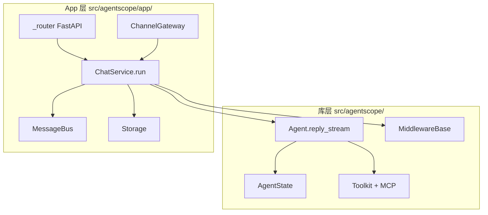
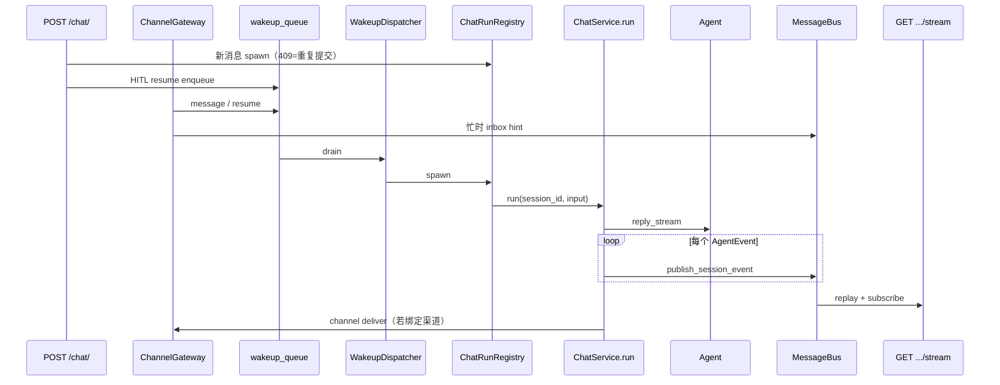
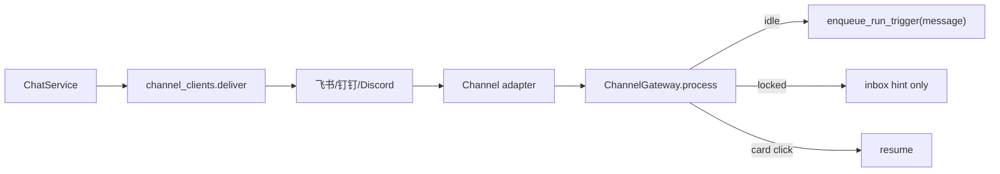
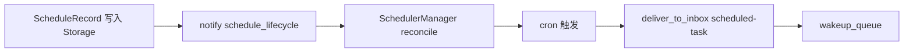

# AgentScope App 服务层架构

> **定位**：`src/agentscope/app/` 是 **生产级 Harness**——在库级 `Agent` 之上提供 HTTP、渠道、会话持久化、Team/子 Agent、调度与事件流。  
> **前置阅读**：[ARCHITECTURE.md](./ARCHITECTURE.md)（单 Agent ReAct 内核）· [MEMORY_SYSTEM.md](./MEMORY_SYSTEM.md)  
> **最后更新**：2026-09-08

---

## 1. 一句话

**库（`agent/`）管一轮 ReAct；App（`app/`）管「谁触发、存哪、怎么推给前端/飞书、多成员怎么协作」。**  
所有运行路径最终汇入 **`ChatService.run`**。

---

## 2. 库层 vs App 层

| 问题 | 库层 | App 层 |
|------|------|--------|
| 一次 turn 怎么跑 | `Agent` | 装配 Agent + 调 `reply_stream` |
| 会话存哪 | 应用自行 `model_dump_json` | `StorageBase`（SQL / Redis） |
| 前端怎么收事件 | `AsyncGenerator[AgentEvent]` | SSE `GET /sessions/{id}/stream` |
| IM 怎么接入 | 无 | `channel/` + `ChannelGateway` |
| 子 Agent | 无内置 | `AgentCreate` / `AgentInvite` + Team |

---

## 3. 模块地图

| 目录 | 职责 |
|------|------|
| **`_app.py`** | `create_app()` 工厂，注册路由与 lifespan |
| **`_lifespan.py`** | 启动 `WakeupDispatcher`、`SchedulerManager`、`ChannelLifecycleDispatcher` 等 |
| **`_service/`** | 业务核心：`ChatService`、`SessionService`、`get_toolkit`、KB 服务 |
| **`_router/`** | FastAPI：chat、session（SSE）、agent、channel、schedule、workspace、hub… |
| **`message_bus/`** | 运行时协调：锁、队列、pub/sub、事件 replay（**非**持久化真源） |
| **`storage/`** | 持久化：`Session` / `Team` / `Agent` / `Schedule` / `Channel` / 消息历史 |
| **`channel/`** | 飞书 / 钉钉 / Discord 适配；`ChannelGateway` 入站路由 |
| **`_manager/`** | `WakeupDispatcher`、`ChatRunRegistry`、`BackgroundTaskManager`、`SchedulerManager` |
| **`workspace_manager/`** | 每 session 工作区隔离（local / Docker / E2B / K8s…） |
| **`_tool/`** | Team 工具：`TeamCreate`、`AgentCreate`、`AgentInvite`、`TeamSay`… |
| **`middleware/`**（app） | `InboxMiddleware`、`TeamMemberLoopMiddleware`、`StateChangeMiddleware`… |
| **`hub/`** | 外部 MCP / Skill 注册表 |
| **`rag/`**（app） | `KnowledgeBaseManager`、索引 worker、blob store（配合库级 `rag.KnowledgeBase`） |
| **`access/`** | 跨用户资源访问策略 |

入口：`agentscope.app.create_app(storage, message_bus, workspace_manager, ...)`

---

## 4. 主流程：从触发到 SSE

### 4.1 统一收敛点

**设计要点**（见 `_router/_chat.py` 注释）：

- **新用户消息**：直接 `ChatRunRegistry.spawn` → 同 session 重复提交返回 **409**
- **HITL 恢复**（确认 / 外部执行结果）：走 **`enqueue_run_trigger`** → `WakeupDispatcher` 唯一 spawn 点，避免与 parked run 竞态

### 4.2 `ChatService.run` 内部（持 session 锁）

在 `MessageBusKeys.session_lock(session_id)` 下大致顺序：

1. 加载 `AgentRecord` / `SessionRecord`（`ResourceAccessService`）
2. 解析 **Team 角色**（leader vs worker session）
3. `workspace_manager.get_workspace` → 合并进 permission context
4. 若 `ChannelOrigin` → 注入渠道工具与 system 片段
5. 装配 middleware：`InboxMiddleware`、`StateChangeMiddleware`、`ToolOffloadMiddleware`；worker 加 `TeamMemberLoopMiddleware`；可选 TTS / RAG
6. `get_toolkit`（按角色暴露 Team 工具）
7. 构造 `Agent` → `register_inbox_consumer` → **`reply_stream`**
8. 每个事件 → `publish_session_event`（replay log + live pub/sub）
9. 持久化 messages / `AgentState`；自动标题、team 通知

源码锚点：`app/_service/_chat.py`（文件头注释写明为 HTTP 与 wakeup 的 **single source of truth**）。

---

## 5. MessageBus 与 SSE

**Storage 与 MessageBus 分工**（`create_app` 允许 SQL 存盘 + Redis 总线）：

| 层 | 典型后端 | 存什么 |
|----|----------|--------|
| **Storage** | Postgres / Redis hash | Session、消息历史、Team、Schedule… |
| **MessageBus** | Redis / InMemory | 锁、inbox、wakeup 队列、事件流、pub/sub |

### 5.1 关键键（`MessageBusKeys`）

| 键 | 用途 |
|----|------|
| `session_events(sid)` | 事件 replay + SSE 订阅 |
| `session_lock(sid)` | 分布式 run 锁（TTL） |
| `inbox(sid)` | 跨 turn 投递（TeamSay、调度、忙时 hint） |
| `wakeup_queue()` / `wakeup_signal()` | 统一 run 触发队列 |
| `projection_namespace(sid)` | 跨 session UI 投影（如子 Agent HITL 卡片） |
| `index_tasks_queue()` | KB 索引异步管道 |

Wakeup 种类：`wake`（空闲唤醒 drain inbox）· `resume`（HITL 续跑）· `message`（新用户 turn）

### 5.2 SSE 路径

`GET /sessions/{session_id}/stream`（`_router/_session.py`）：

1. `log_read(session_events)` — 重放已缓冲事件  
2. 注入 `SessionProjection` 上的子 Agent HITL 卡片  
3. `subscribe(session_events)` — 实时流  
4. 30s 心跳  

客户端应 **长连 SSE**；`POST /chat/` 仅触发，**不**再返回事件流。

---

## 6. 渠道（L7）与 Gateway

| 场景 | 行为 |
|------|------|
| Session 空闲 | 入站消息 → `WAKEUP_KIND_MESSAGE` → 新 turn |
| Session 忙 | 消息进 **inbox**（`HintBlock`），不 abort 当前 run |
| 卡片确认 | `resume` → 与 HTTP HITL 同队列 |

测试参考：`tests/channel_gateway_test.py`、`tests/service_chat_channel_delivery_test.py`

---

## 7. Team 与子 Agent

核心 `Agent` **无** `children` 字段；Team 在 **App 工具层**实现。

### 7.1 角色与工具面

| 角色 | 典型工具 |
|------|----------|
| **Leader**（或无 team） | `TeamCreate`、`AgentCreate`、`AgentInvite`、`TeamSay`、`TeamDelete` |
| **Worker** | 仅 `TeamSay` |

由 `get_toolkit(..., team_role=...)` 在每次 run 解析。

### 7.2 `AgentCreate`（leader）

1. 按 `SubAgentTemplate` 创建 `AgentRecord` + team 作用域 `SessionRecord`（`TeamOrigin`）  
2. `TeamRecord.members` 追加 `role=created`  
3. `deliver_to_inbox` 初始任务 → `enqueue_run_trigger(wake)` 拉起 worker run  

### 7.3 `AgentInvite`（leader）

借用已有 `AgentRecord`，mint 新 team session，`role=invited`，同样 inbox + wakeup。

### 7.4 `TeamMemberLoopMiddleware`（worker only）

强制 worker 以成功的 `TeamSay(to=leader)` 结束；最多 nudge 数次，否则以 ERROR 结束 reply。  
与 `TeamSay` 工具（投递路径）互补。

### 7.5 Leader 看子 Agent HITL

`SubagentHitlProjector` → `projection_namespace(leader_session_id)` → SSE 合并展示。

测试参考：`tests/service_team_tools_test.py`、`tests/service_inbox_handoff_test.py`

---

## 8. 调度（Scheduler）

- **单节点**跑 APScheduler（`enable_scheduler=True`）  
- 触发后 **不直接**调 `ChatService`——与 Team 消息相同：inbox + wakeup  
- 测试：`tests/service_scheduler_test.py`

---

## 9. Storage 模型（设计级）

| 模型 | 要点 |
|------|------|
| **`SessionRecord`** | `agent_id`、`team_id`、`origin`（User / Schedule / Channel / Team）、`config`（model、KB、workspace）、`state: AgentState` |
| **`TeamRecord`** | `session_id`（leader）、`members[]`（agent_id、session_id、role created/invited） |
| **`AgentRecord`** | `system_prompt`、context/react 配置、`InviteConfig`、`source` user/team |
| **`ScheduleRecord`** | cron、target agent、stateful、enabled |

实现：`RedisStorage`（全量接口）或 `AsyncSQLAlchemyStorage`（可选 SQLAlchemy）。  
测试：`tests/storage_redis_test.py`、`tests/storage_sql_test.py`

---

## 10. 与库级模块的衔接

| App 装配 | 库模块 |
|----------|--------|
| `get_model` / `get_toolkit` | `model/`、`tool/`、`mcp/` |
| `RAGMiddleware` + `KnowledgeBaseManager` | `rag.KnowledgeBase`、`embedding/` |
| `TTSMiddleware` | `tts/` |
| `AgenticMemoryMiddleware` 等 | `middleware/` |
| `workspace_manager` | `workspace/`（Docker、E2B、K8s…） |
| `Offloader` / 工具落盘 | `workspace.Offloader` |

→ RAG 专题：[RAG_AND_KNOWLEDGE.md](./RAG_AND_KNOWLEDGE.md)  
→ Workspace：[WORKSPACE_AND_SANDBOX.md](./WORKSPACE_AND_SANDBOX.md)  
→ Middleware：[MIDDLEWARE_CATALOG.md](./MIDDLEWARE_CATALOG.md)

---

## 11. 设计法则

1. **`ChatService.run` 是唯一执行真源** — HTTP、渠道、调度、Team 工具都汇入此处。  
2. **Storage ≠ MessageBus** — 持久化与 live 协调分离，便于 SQL + Redis 组合。  
3. **HITL resume 走 wakeup 队列** — 避免与进行中的 run 409 竞态。  
4. **同 session 单 run** — `ChatRunRegistry` + `session_lock`；忙时 channel 用 inbox 而非硬 interrupt。  
5. **SSE 与 POST 解耦** — 触发异步，订阅收事件。  
6. **子 Agent 在 App 层** — 不要假设核心 `Agent` 有 delegate API。

---

## 12. 源码索引

| 主题 | 路径 |
|------|------|
| App 工厂 | `app/_app.py` |
| Lifespan | `app/_lifespan.py` |
| ChatService | `app/_service/_chat.py` |
| HTTP 触发 | `app/_router/_chat.py` |
| SSE | `app/_router/_session.py` |
| Channel | `app/channel/_gateway.py` |
| Bus 键 | `app/message_bus/_keys.py` |
| Wakeup | `app/_manager/_wakeup_dispatcher.py` |
| Scheduler | `app/_manager/_scheduler/_scheduler_manager.py` |
| AgentCreate | `app/_tool/_agent_create.py` |
| Team middleware | `app/middleware/_team_member_middleware.py` |
| Storage ABC | `app/storage/_base.py` |

---

## 13. 相关文档

| 文档 | 内容 |
|------|------|
| [ARCHITECTURE.md](./ARCHITECTURE.md) | 单 Agent ReAct、Tool、Permission |
| [MEMORY_SYSTEM.md](./MEMORY_SYSTEM.md) | `AgentState`、压缩、Offloader |
| [PIPELINE_AND_GOALS.md](./PIPELINE_AND_GOALS.md) | `GoalPipeline` |
| [WORKSPACE_AND_SANDBOX.md](./WORKSPACE_AND_SANDBOX.md) | 沙箱与 WorkspaceManager |
| [MIDDLEWARE_CATALOG.md](./MIDDLEWARE_CATALOG.md) | 中间件全目录 |
| [RAG_AND_KNOWLEDGE.md](./RAG_AND_KNOWLEDGE.md) | 知识库与 RAG |
