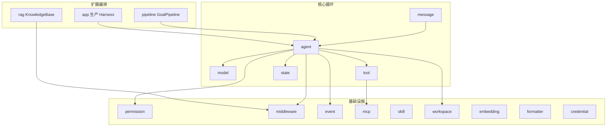
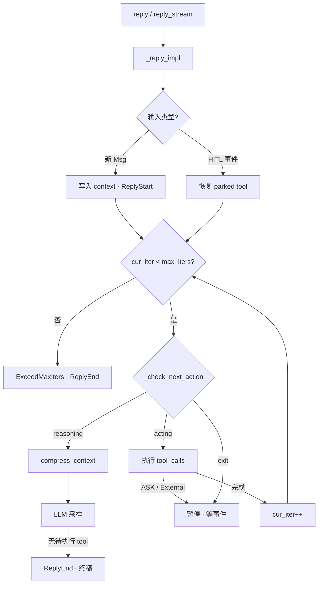
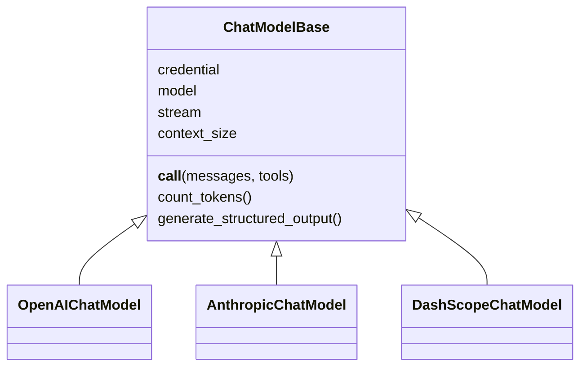
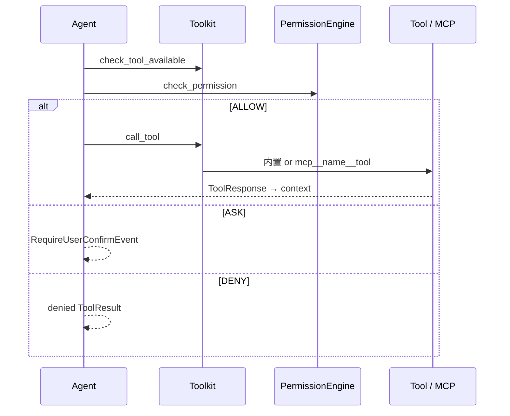

# AgentScope 库内核架构

> **设计导读** · 实现级长文（FLOW + PART1–3 合并，~3150 行）：[_archive/ARCHITECTURE.md](./_archive/ARCHITECTURE.md)  
> **App 服务层**：[APP_ARCHITECTURE.md](./APP_ARCHITECTURE.md) · **专题**见 [README](./README.md)

---

## 1. 一句话

AgentScope v2 = **消息驱动、全异步** 的单 `Agent` ReAct 框架：`AgentState` 承载记忆，`ChatModelBase` 直接吃 `list[Msg]`，横切靠 **Middleware + Permission + AgentEvent 流**。

---

## 2. 设计定位

| 维度 | 选择 |
|------|------|
| **核心循环** | 单一 `Agent`，`reply` / `reply_stream` 内 reasoning ↔ acting |
| **状态** | `AgentState`：`context` + `summary` + `permission` + `tool` + `tasks` |
| **模型** | `ChatModelBase`；无 v0.x Memory→Formatter 链 |
| **工具** | `Toolkit` + `ToolGroup` + `MCPClient` + Skill |
| **横切** | `MiddlewareBase`（7 钩子）+ `PermissionEngine` |
| **可观测** | `AgentEvent` 流（Thinking/Text/ToolCall/HITL…） |
| **生产部署** | 库本身无 Server → [`app.create_app`](./APP_ARCHITECTURE.md) 或自建循环 |

---

## 3. 包结构（main 分支）



| 模块 | 职责 | 深潜 |
|------|------|------|
| `agent` | ReAct、`compress_context` | 本文 §4 |
| `message` | `Msg` + ContentBlock | 归档 §10 |
| `model` | 多 Provider LLM | 本文 §5 |
| `tool` | 注册、执行、分组 | 本文 §6 |
| `state` | `AgentState` | [MEMORY_SYSTEM](./MEMORY_SYSTEM.md) |
| `middleware` | 钩子 + RAG/LTM/TTS… | [MIDDLEWARE_CATALOG](./MIDDLEWARE_CATALOG.md) |
| `workspace` | 沙箱、Offloader | [WORKSPACE_AND_SANDBOX](./WORKSPACE_AND_SANDBOX.md) |
| `pipeline` | `GoalPipeline` | [PIPELINE_AND_GOALS](./PIPELINE_AND_GOALS.md) |
| `rag` | `KnowledgeBase` | [RAG_AND_KNOWLEDGE](./RAG_AND_KNOWLEDGE.md) |
| `app` | HTTP/Channel/Team | [APP_ARCHITECTURE](./APP_ARCHITECTURE.md) |

**已移除（v0.x）**：`memory.MemoryBase`、`session.JSONSession`、`pipeline.MsgHub` — 见 [_archive](./_archive/ARCHITECTURE.md) 历史章节。

---

## 4. ReAct 主循环

### 4.1 流程



### 4.2 `_check_next_action`

| 未完成 tool_call | 下一步 |
|------------------|--------|
| 有可执行 (PENDING/ALLOWED) | **acting** |
| 仅等待 (ASKING/SUBMITTED) | **exit**（暂停 reply） |
| 无 | **reasoning** |

### 4.3 送模输入（L 投影）

```text
SystemMsg（system_prompt，不进 context）
+ summary?（压缩摘要）
+ context（完整近期对话）
+ tools[]（ToolGroup 激活子集）
```

→ 压缩算法：[MEMORY_SYSTEM.md](./MEMORY_SYSTEM.md) §9

### 4.4 公开 API

| API | 用途 |
|-----|------|
| `await agent(msg)` | 等价 `reply`，返回终稿 `Msg` |
| `agent.reply_stream(...)` | 流式 `AgentEvent \| Msg` |
| `structured_schema=` | 强制结构化终稿（`GoalPipeline` 用） |

源码锚点：`agent/_agent.py` — `_reply_impl`、`_check_next_action`、`_reasoning_impl`、`_execute_tool_call`

---

## 5. Model 模块（设计级）



| 能力 | 说明 |
|------|------|
| **流式** | `ChatResponse` chunk → Agent 转为 Block 事件 |
| **Token 计数** | `count_tokens` 驱动 `compress_context` |
| **结构化输出** | `generate_structured_output` / reply 参数 |
| **Credential** | `credential/` 解耦密钥 |

Provider 列表与 YAML 配置：归档 [_archive/ARCHITECTURE.md §5](./_archive/ARCHITECTURE.md)

---

## 6. Tool · MCP · Permission



| 主题 | 要点 |
|------|------|
| **注册** | `Toolkit(tools=[...], mcps=[...], tool_groups=[...])` |
| **MCP 命名** | `mcp__{client}__{tool}` |
| **ToolGroup** | `activated_groups` 控制可见工具面 |
| **权限模式** | `DEFAULT` / `EXPLORE` / `ACCEPT_EDITS` / `BYPASS` / `DONT_ASK` |
| **HITL** | `ASK` → `UserConfirmResultEvent`；外部执行 → `ExternalExecutionResultEvent` |
| **Backend** | 内置 Bash/Read/Write 走 `BackendBase` → [WORKSPACE](./WORKSPACE_AND_SANDBOX.md) |

---

## 7. Middleware

7 个钩子：洋葱式 `on_reply` / `on_reasoning` / `on_acting` / `on_model_call` / `on_check_permission` / `on_compress_context`；流水线式 `on_system_prompt`。

专用中间件（RAG、LTM、Budget、TTS、Tracing）及 App 层 Inbox/Team：**不重复列举** → [MIDDLEWARE_CATALOG.md](./MIDDLEWARE_CATALOG.md)

---

## 8. 启动与构造（无 `agentscope.init()`）

```python
from agentscope import setup_logger
from agentscope.agent import Agent
from agentscope.model import OpenAIChatModel
from agentscope.credential import OpenAICredential
from agentscope.tool import Toolkit, Bash, Read, Write

setup_logger(level="INFO")

agent = Agent(
    name="Friday",
    system_prompt="You are a helpful assistant.",
    model=OpenAIChatModel(
        credential=OpenAICredential(api_key="..."),
        model="gpt-4o",
        stream=True,
        context_size=128000,
    ),
    toolkit=Toolkit(tools=[Bash(), Read(), Write()]),
)

async for event in agent.reply_stream(user_msg):
    ...
```

| v0.x | v2 |
|------|-----|
| `agentscope.init()` | `setup_logger()` |
| `InMemoryMemory` | `AgentState.context` 自动追加 |
| `JSONSession` | `AgentState.model_validate_json` 或 **app/storage** |
| `Formatter` 组装 | Model 内部处理 `Msg` |

---

## 9. 多 Agent（库层边界）

| 方式 | 机制 | 文档 |
|------|------|------|
| **手动编排** | `await a2.reply(await a1.reply(msg))` / `asyncio.gather` | — |
| **GoalPipeline** | executor + verifier 结构化环 | [PIPELINE_AND_GOALS](./PIPELINE_AND_GOALS.md) |
| **Team / 子 Agent** | `AgentCreate`、独立 session | [APP_ARCHITECTURE](./APP_ARCHITECTURE.md) §7 |

核心 `Agent` **无** `children` / `delegate` → [AGENT_AND_LTM](./AGENT_AND_LTM_ANALYSIS.md)

---

## 10. 持久化

```python
# 保存
json_str = agent.state.model_dump_json()

# 恢复
state = AgentState.model_validate_json(json_str)
agent = Agent(..., state=state)
```

- 至少持久化：`context`、`summary`、`session_id`  
- 使用 `Offloader` 时同步拷贝 workspace 目录  
- 生产多实例：**不要**只写本地文件 → `app/storage`  

---

## 11. AgentEvent 与消费者

| 类别 | 例子 |
|------|------|
| **Reply 生命周期** | `ReplyStartEvent`、`ReplyEndEvent` |
| **模型流** | `ThinkingBlock*`、`TextBlock*`、`ToolCall*`、`ModelCallEndEvent` |
| **工具** | `ToolResult*` |
| **HITL** | `RequireUserConfirmEvent`、`RequireExternalExecutionEvent` |
| **提示** | `HintBlockEvent` |

`reply_stream` 消费者：CLI、测试、**App SSE**（经 MessageBus 转发）。

---

## 12. 端到端场景

| 场景 | 路径 |
|------|------|
| 最小 ReAct | 本文 §8 + §4 |
| 带 MCP | §6 + `MCPClient` connect |
| 带压缩 | [MEMORY_SYSTEM](./MEMORY_SYSTEM.md) |
| 带 RAG | [RAG_AND_KNOWLEDGE](./RAG_AND_KNOWLEDGE.md) |
| 带沙箱 | [WORKSPACE_AND_SANDBOX](./WORKSPACE_AND_SANDBOX.md) |
| 质量验收环 | [PIPELINE_AND_GOALS](./PIPELINE_AND_GOALS.md) |
| 飞书/HTTP 服务 | [APP_ARCHITECTURE](./APP_ARCHITECTURE.md) |
| 语音 Realtime | [REALTIME_AGENT](./REALTIME_AGENT_ARCHITECTURE.md)（v1，main 未迁回） |

---

## 13. 设计法则

1. **Msg 是一等公民** — 模型、存储、事件都围绕 `Msg` / Block。  
2. **压缩在 reasoning 前** — `compress_context` 每次 reasoning 前调用。  
3. **权限默认经 PE** — 不要绕过 `PermissionEngine` 直接调 tool。  
4. **HITL 是事件** — resume 用 `UserConfirmResultEvent`，不是新 UserMsg 冒充。  
5. **Middleware 可吞 ReplyEnd** — 强制多轮时先理解 `on_reply` 语义。  
6. **库与 App 分层** — Team/Channel/Scheduler 不在 `agent/` 里找。

---

## 14. 深潜与历史

| 需求 | 读哪里 |
|------|--------|
| 完整时序、类图、v0.x A2A/MsgHub/Evaluate | [_archive/ARCHITECTURE.md](./_archive/ARCHITECTURE.md) |
| Memory 权威 | [MEMORY_SYSTEM.md](./MEMORY_SYSTEM.md) |
| 官方教程 | `docs/tutorial/` · https://doc.agentscope.io/ |
