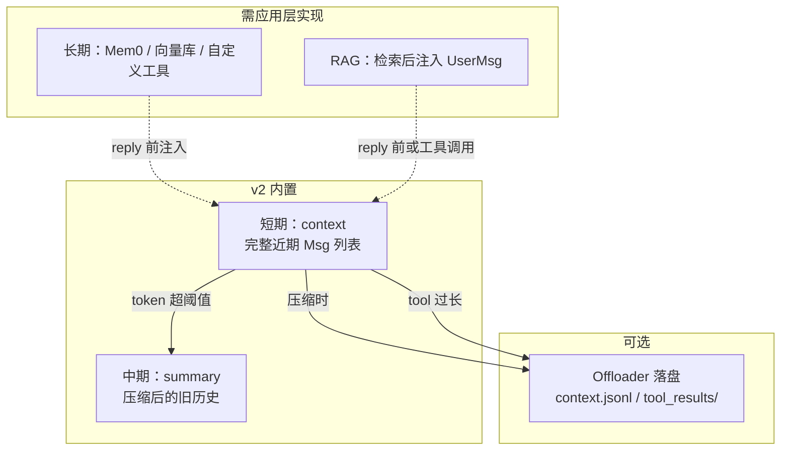
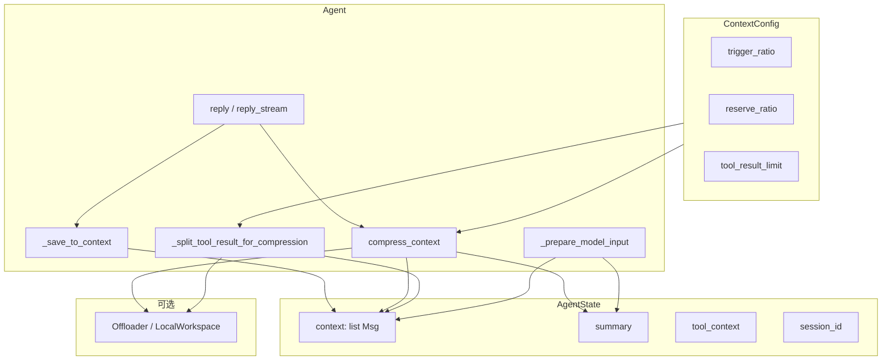
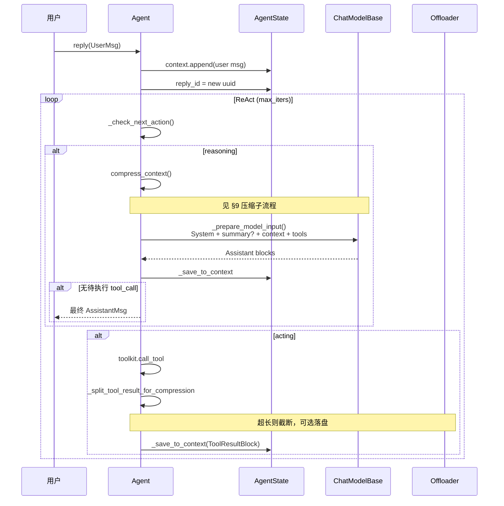
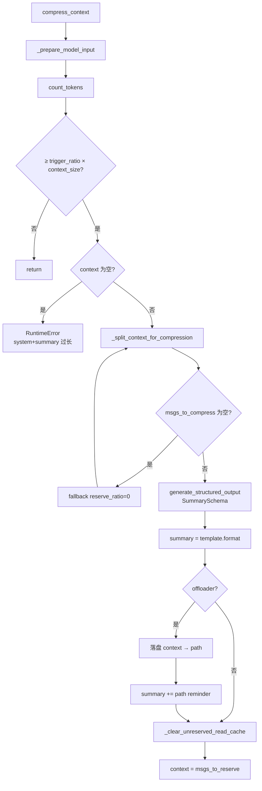
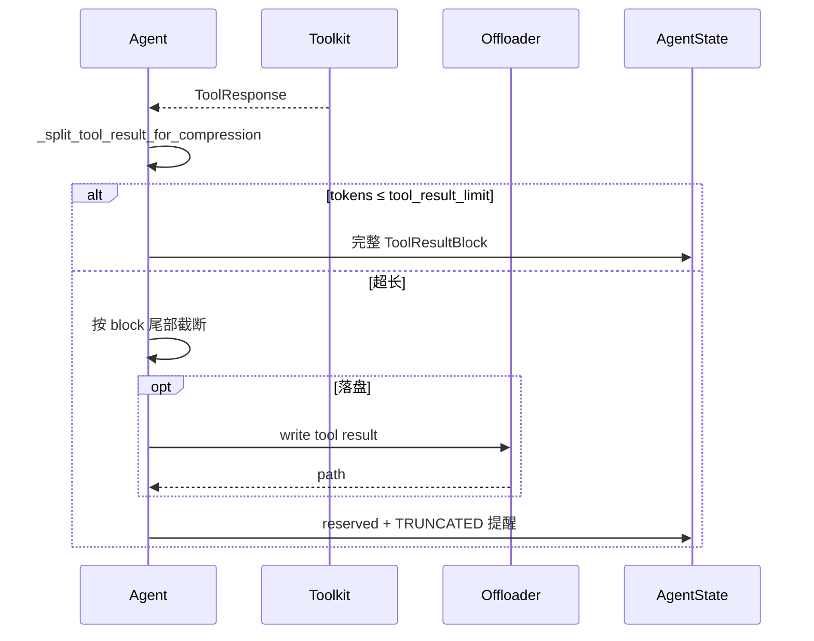
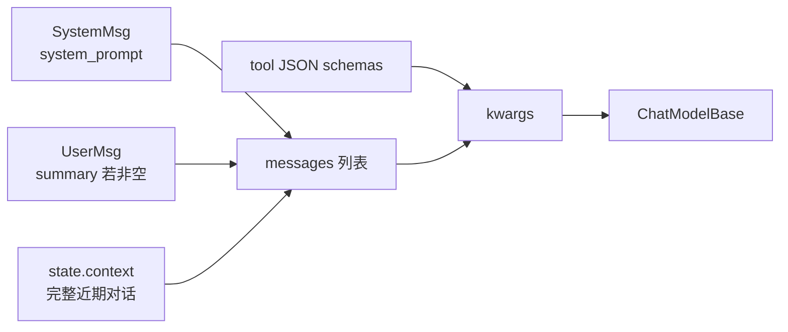
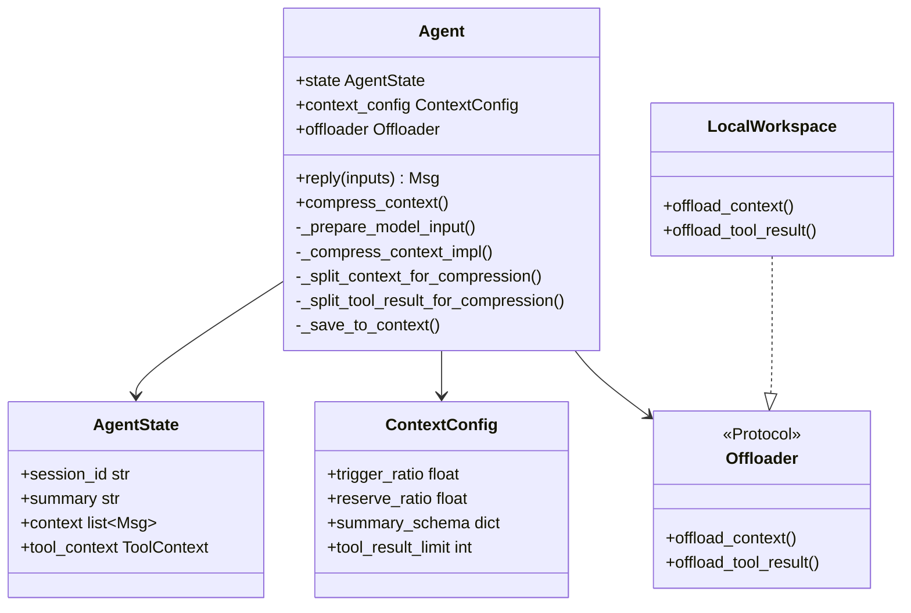

# AgentScope Memory 系统完整指南

> **文档状态**: Canonical（AgentScope v2 Memory 唯一权威文档）  
> **版本**: 2.2（与 AgentScope v2 `main` 源码对齐）  
> **适合人群**: 应用开发者、框架定制者、需要理解压缩与持久化的工程师  
> **核心源码**:  
> - `src/agentscope/state/_state.py` — `AgentState`、`ToolContext`  
> - `src/agentscope/agent/_config.py` — `ContextConfig`、`SummarySchema`  
> - `src/agentscope/agent/_agent.py` — `compress_context`、context 读写、tool 截断  
> - `src/agentscope/workspace/_offload_protocol.py` — `Offloader` 协议  
> - `src/agentscope/workspace/_local_workspace.py` — 本地卸载实现  

---

## 目录

- [1. 三分钟心智模型](#1-三分钟心智模型)
- [2. v2 有什么、没有什么](#2-v2-有什么没有什么)
- [3. 与传统压缩策略对比](#3-与传统压缩策略对比)
- [4. 短期 / 长期 / 外部存储](#4-短期--长期--外部存储)
- [5. MEMORY.md、USER.md、Session？](#5-memorymdusermdsession)
- [6. 数据模型](#6-数据模型)
- [7. 端到端流程：reply() 时间线](#7-端到端流程reply-时间线)
- [8. 完整实例：state 属性逐步变化](#8-完整实例state-属性逐步变化)
- [9. 上下文压缩算法](#9-上下文压缩算法)
- [10. summary 固定格式](#10-summary-固定格式)
- [11. 工具结果截断](#11-工具结果截断)
- [12. Offloader 落盘](#12-offloader-落盘)
- [13. LLM 实际看到什么](#13-llm-实际看到什么)
- [14. 配置与调参](#14-配置与调参)
- [15. 会话持久化](#15-会话持久化)
- [16. 长期记忆与 RAG 扩展](#16-长期记忆与-rag-扩展)
- [17. 反模式](#17-反模式)
- [18. 与 v0.x 的差异](#18-与-v0x-的差异)
- [19. 源码索引与 Middleware](#19-源码索引与-middleware)
- [20. 相关文档](#20-相关文档)

---

## 1. 三分钟心智模型

AgentScope v2 **没有独立的 `memory/` 子包**。所有「记忆」都是 **`Agent` 运行时状态 `AgentState`** 的一部分：

```text
LLM 每次看到的输入 =
    system_prompt（固定，不进 context）
  + summary（可选，压缩后的旧历史）
  + context（当前会话完整近期对话）
  + tool schemas
```

**三件事记住即可**：

1. **当前对话** → 自动写入 `agent.state.context`，无需手动 `memory.add()`。
2. **对话太长** → `compress_context()` 把**头部旧消息**压进 `summary`，**尾部近期**留在 `context`。
3. **断点续聊** → 序列化整个 `AgentState`（至少 `context` + `summary` + `session_id`）。

压缩策略一句话：**去头（压成固定格式 summary）+ 保尾（留近期 context）**，不是传统的「去头去尾、中间压缩」。

---

## 2. v2 有什么、没有什么

### 2.1 内置能力

| 机制 | 载体 | 解决什么问题 |
|------|------|----------------|
| 对话上下文（短期） | `AgentState.context: list[Msg]` | 用户输入、Assistant 输出、tool_call / tool_result |
| 压缩摘要（中期） | `AgentState.summary` | 被压缩掉的旧历史，结构化续写文本 |
| 上下文压缩 | `ContextConfig` + `compress_context()` | token 超阈值时 LLM 摘要并**物理删除**旧 context |
| 工具结果截断 | `ContextConfig.tool_result_limit` | 防止单次 tool result 撑爆 context |
| 上下文卸载（可选） | `Offloader`（如 `LocalWorkspace`） | 被删/被截断内容落盘，路径写入 summary 或 tool 提醒 |
| 状态序列化 | `AgentState.model_dump_json()` | 应用层自行持久化 |

### 2.2 非目标（v2 框架级 Session / 旧 MemoryBase）

- 跨会话向量记忆的内置 **Mem0/ReMe 集成**（可用 `AgenticMemoryMiddleware` 等，见 `middleware/`）
- 框架级 `JSONSession` / `RedisSession`（**`app/storage`** 提供生产 Session，见 [APP_ARCHITECTURE.md](./APP_ARCHITECTURE.md)）
- 对话历史的 mark / exclude_mark 过滤（旧版 `MemoryBase`）

> **RAG**：库级 `rag.KnowledgeBase` 与 `RAGMiddleware` **已存在**，见 [RAG_AND_KNOWLEDGE.md](./RAG_AND_KNOWLEDGE.md)。下文 §16 中「应用层自建 RAG」描述仍可作为模式参考，但不再表示「框架无 KB」。
- `MEMORY.md` / `USER.md` 等文件记忆原语

---

## 3. 与传统压缩策略对比

很多框架采用 **sliding window** 或 **三段式**：

```text
传统三段式：
[删掉最老 N 条] + [保留最近 M 条] + [中间段 LLM 自由摘要]
或：只保留尾部，头部直接丢弃（无摘要）
```

AgentScope v2 的策略：

```text
context 时间线：
|---- msgs_to_compress（头部旧消息）----|==== 分界 ====|---- msgs_to_reserve（尾部近期）----|
         ↓ LLM 结构化摘要
    state.summary（固定五段格式，覆盖写入）
         ↓ 物理删除
context = msgs_to_reserve only
```

| 维度 | AgentScope v2 | 常见传统方案 |
|------|---------------|--------------|
| 保留段 | **尾部** `reserve_ratio`（默认约 10% context） | 常保留头+尾，或只留尾 |
| 压缩段 | **头部**旧消息 | 常压「中间」或直接丢弃 |
| 压缩产物 | **固定 schema** 的 `summary` 字符串 | 常为自由文本或多段摘要 |
| 旧消息 | 从 `context` **物理删除** | 有的只打 `compressed` mark 仍留 storage |
| 完整备份 | 可选 `Offloader` 写 JSONL | 视框架而定 |

---

## 4. 短期 / 长期 / 外部存储



| 类型 | 载体 | 生命周期 | 谁维护 |
|------|------|----------|--------|
| **短期记忆** | `state.context` | 当前会话 | `reply()` 自动 `_save_to_context` |
| **压缩记忆** | `state.summary` | 跨多轮直到下次覆盖 | `compress_context()` 自动 |
| **卸载备份** | workspace 文件 | 磁盘持久 | `Offloader`（可选） |
| **长期记忆** | ❌ 无内置 | 跨会话 | 工具 / Middleware / 外部 DB |
| **RAG** | ❌ 无内置 | 跨文档 | 应用层检索 + 注入 |

**没有「短期类 + 长期类」两个独立子系统**——只有 `AgentState` 上的 context/summary 两层，长期能力需自己接。

---

## 5. MEMORY.md、USER.md、Session？

| 概念 | AgentScope v2 | 说明 |
|------|---------------|------|
| `MEMORY.md` | ❌ | 无文件记忆；可用自定义工具模拟 |
| `USER.md` | ❌ | 无用户画像文件 |
| `system_prompt` | ✅ | 构造 `Agent` 时传入，**不进 `context`**，每次 reasoning 由 `_get_system_prompt()` 注入 |
| `session_id` | ✅ | `AgentState` 字段，用于 Offloader 路径隔离，**不是**框架 Session |
| `JSONSession` | ❌（v2 未迁移） | v0.x 有；v2 用手动 `model_dump_json()` |
| 外部存储 | 可选 | `LocalWorkspace` 落盘压缩/截断备份，非语义 LTM |

持久化 = **你自己写 JSON 文件**（或 Redis 等），框架只提供 `AgentState` 序列化 API。

---

## 6. 数据模型

### 6.1 `AgentState`

**位置**: `state/_state.py`

```python
class AgentState(BaseModel):
    session_id: str
    summary: str | list[TextBlock | DataBlock] = ""
    context: list[Msg] = []
    reply_id: str
    cur_iter: int = 0
    permission_context: PermissionContext
    tool_context: ToolContext      # Read 缓存、activated_groups
    tasks_context: TaskContext
```

| 字段 | 参与 LLM prompt？ | 含义 |
|------|-------------------|------|
| `context` | ✅（经 `_prepare_model_input`） | 当前会话对话轨迹 |
| `summary` | ✅（作为额外 `UserMsg` 注入） | 压缩后的旧历史 |
| `session_id` | ❌ | Offloader 路径、多租户隔离 |
| `reply_id` | ❌ | 同一 `reply` 周期内 AssistantMsg 的 id |
| `tool_context` | ❌（间接：Read 缓存影响工具） | Read LRU、工具组激活状态 |

### 6.2 `context` 写入规则

| 来源 | 写入方式 |
|------|----------|
| 用户输入 | `_handle_incoming_messages` → `context.append(msg)` |
| 模型输出 | `_save_to_context` → 追加到最后一条同名 `AssistantMsg.content` |
| 工具结果 | acting 完成后 `_save_to_context([ToolResultBlock])` |

**同一 reply 周期**：`AssistantMsg.id == state.reply_id`，thinking / text / tool_call / tool_result 都在同一 `AssistantMsg.content` 列表中。

**输入限制**：仅接受 `role` 为 `user` 或 `assistant` 的 `Msg`，且不得含 `tool_call` / `tool_result` / `thinking` 块（这些由框架内部写入）。

### 6.3 `ContextConfig` 默认值

**位置**: `agent/_config.py`

```python
class ContextConfig(BaseModel):
    trigger_ratio: float = 0.8      # 0 < x < 0.9
    reserve_ratio: float = 0.1        # 0 < x < 0.9
    compression_prompt: str = ...
    summary_template: str = ...
    summary_schema: dict = SummarySchema.model_json_schema()
    tool_result_limit: int = 3000
```

| 字段 | 默认 | 含义 |
|------|------|------|
| `trigger_ratio` | `0.8` | `count_tokens` ≥ 该比例 × `model.context_size` 时触发压缩 |
| `reserve_ratio` | `0.1` | 压缩时从**尾部**保留约该比例的 context token |
| `tool_result_limit` | `3000` | 单条 tool result 最大 token |
| `summary_schema` | `SummarySchema` | 压缩 LLM 结构化输出 schema |

- `trigger_ratio` 上限 **0.9**：为压缩 LLM 调用预留至少约 10% context。
- `reserve_ratio` 过大导致「无消息可压缩」时，源码 **fallback 到 0** 并打 warning。

### 6.4 架构全景



---

## 7. 端到端流程：reply() 时间线



**关键点**：

1. 用户消息在 ReAct 循环**前**写入 `context`。
2. **每次 reasoning 前**调用 `compress_context()`（非 reply 开头一次性检查）。
3. 压缩后旧消息**不再保留**在 `context` 中，信息沉淀在 `summary`（及可选 offloaded 文件）。

### 7.1 压缩子流程



---

## 8. 完整实例：state 属性逐步变化

以下用**虚构 token 数**说明属性如何变；实际阈值由 `model.count_tokens()` 决定。

**假设**：`context_size = 100_000`，`trigger_ratio = 0.8`，`reserve_ratio = 0.1`，已配置 `LocalWorkspace`。

### 8.1 初始状态

```python
AgentState(
    session_id="sess-001",
    summary="",
    context=[],
    reply_id="",
    cur_iter=0,
)
```

### 8.2 Turn 1 — 用户：「读 config.yaml」

```python
await agent(UserMsg(name="user", content="读 config.yaml"))
```

| 步骤 | `context` | `summary` | `reply_id` |
|------|-----------|-----------|------------|
| 用户消息入队后 | `[UserMsg("读 config.yaml")]` | `""` | `"uuid-aaa"` |
| reasoning：token 50k < 80k，不压缩 | 不变 | 不变 | 不变 |
| LLM 返回 `tool_call: read_file` | `+ AssistantMsg(id=uuid-aaa, [ToolCallBlock])` | 不变 | 不变 |
| acting：read 返回 5k token | `+ ToolResultBlock(yaml...)` 追加到同一 AssistantMsg | 不变 | 不变 |

### 8.3 Turn 2 — 用户：「把 debug 改成 true」

| 步骤 | `context` | `summary` | `reply_id` |
|------|-----------|-----------|------------|
| 新用户消息 | `+[UserMsg("把 debug 改成 true")]` | 不变 | `"uuid-bbb"` |
| 多轮 tool 后 context 约 85k token | 15 条 Msg | `""` | — |
| **compress_context 触发** | 见下表 | **覆盖写入** | — |

**压缩瞬间**（`_split_context_for_compression`）：

```text
msgs_to_compress = context[0:10]   # 头部旧消息，约 75k token
msgs_to_reserve  = context[10:]    # 尾部近期，约 10k token
```

| 属性 | 压缩前 | 压缩后 |
|------|--------|--------|
| `summary` | `""` | `"<system-info>\nTask Overview: 用户要修改 config.yaml 的 debug 字段\nCurrent State: 已读取 config.yaml，debug=false\n...\n</system-info>\n<system-reminder>...context.jsonl...</system-reminder>"` |
| `context` | 15 条 Msg | **5 条**（仅 `msgs_to_reserve`） |
| 磁盘 | — | `agent_workspace/sessions/sess-001/context.jsonl` 追加 10 条完整 Msg |

### 8.4 压缩后 LLM 看到的 messages

```text
1. SystemMsg(system_prompt)          ← 不进 context，每次注入
2. UserMsg(summary)                  ← 压缩摘要（伪装成 user 消息）
3. ...context 尾部 5 条 Msg          ← 近期完整对话
4. tool schemas
```

模型**看不到**被删的 10 条原文，只能靠 `summary`、尾部 context、或 Read offloaded 文件。

### 8.5 Turn 3 — 断点续聊

```python
# 保存
with open("sess-001.json", "w") as f:
    f.write(agent.state.model_dump_json(indent=2))

# 恢复（需同步拷贝 agent_workspace/ 若用了 Offloader）
state = AgentState.model_validate_json(open("sess-001.json").read())
agent = Agent(name="Friday", system_prompt="...", model=model, state=state)
```

恢复后 `context` + `summary` 与保存时一致；**不会**自动做语义检索或合并其他会话记忆。

### 8.6 超长 tool result 示例

`read_file` 返回 8000 token，`tool_result_limit=3000`：

```text
acting 阶段：
  _split_tool_result_for_compression
    → reserved: 前 3000 token 等价内容 + <<<TRUNCATED>>> 提醒
    → offload: 剩余部分写入 tool_results/xxx.txt
  仅 reserved 进入 context
```

---

## 9. 上下文压缩算法

**入口**: `compress_context()` → `_compress_context_impl()`（可被 `on_compress_context` 中间件包裹）

### 9.1 触发条件

```python
kwargs = await self._prepare_model_input()
estimated_tokens = await self.model.count_tokens(**kwargs)
threshold = cfg.trigger_ratio * self.model.context_size
if estimated_tokens < threshold:
    return  # 不压缩
```

计 token 时已包含 `system_prompt + summary + context + tools`。

### 9.2 拆分：`_split_context_for_compression`

输入：`to_reserved_tokens = reserve_ratio * context_size`

1. 从 `context` **尾部**向前扫描，找到保留段 token ≥ `to_reserved_tokens` 的分界 `msg_index`。
2. 对分界消息内的 **content blocks** 再细粒度拆分，避免 reserved 段出现**孤立的 tool_result**（无对应 tool_call）。
3. 返回 `(msgs_to_compress, msgs_to_reserve)`。

若 `msgs_to_compress` 为空，**fallback**：`reserve_ratio → 0` 重试。

### 9.3 生成摘要

1. 组装压缩输入：`system_prompt + 旧 summary? + msgs_to_compress + compression_prompt`。
2. 调用 `model.generate_structured_output(..., structured_model=summary_schema)`。
3. 若输入超长，**逐条丢弃** `msgs_to_compress` 最旧消息直到 token 低于 `context_size * trigger_ratio`，再重试。

### 9.4 写回状态

```python
self.state.summary = cfg.summary_template.format(**res.content)

if self.offloader:
    path = await self.offloader.offload_context(session_id, msgs_to_compress)
    self.state.summary += f"\n<system-reminder>... '{path}' ...</system-reminder>"

await self._clear_unreserved_read_cache(msgs_to_reserve)
self.state.context = msgs_to_reserve  # 旧消息物理删除
```

### 9.5 失败场景

| 条件 | 行为 |
|------|------|
| `context` 为空但 token 仍超阈值 | `RuntimeError`：system prompt（± summary）过长 |
| 压缩 LLM 失败且非 overflow | 异常向上抛出 |
| overflow 且丢弃全部可压缩消息后仍失败 | 异常向上抛出 |

---

## 10. summary 固定格式

压缩 LLM 必须输出 `SummarySchema` 五字段，再套入 `summary_template`：

| 字段 | 含义 |
|------|------|
| `task_overview` | 用户核心请求与成功标准 |
| `current_state` | 已完成工作与产出 |
| `important_discoveries` | 约束、决策、错误与修复 |
| `next_steps` | 待办与阻塞 |
| `context_to_preserve` | 偏好、领域细节、承诺 |

默认渲染结果形如：

```text
<system-info>
Task Overview: ...
Current State: ...
Important Discoveries: ...
Next Steps: ...
Context to Preserve: ...
</system-info>
```

- 每次压缩**覆盖** `state.summary`（不是 append 多段）。
- 可自定义 `compression_prompt`、`summary_template`、`summary_schema` 适配领域。
- 有 `offloader` 时末尾追加文件路径 `<system-reminder>`。

---

## 11. 工具结果截断

**入口**: acting 完成、`ToolResponse` 转 `ToolResultBlock` 之后

```python
reserved, offload = await self._split_tool_result_for_compression(tool_result)
```



### 11.1 算法概要

1. 对 `tool_result.output` 计 token；若 ≤ `tool_result_limit`，原样保留。
2. 否则按 **content block** 从尾部向前找边界；对边界 `TextBlock` 按比例截断文本。
3. 返回 `(reserved_block, offload_block | None)`。

### 11.2 提醒格式

若存在 offload 部分，reserved 块末尾追加：

```text
<<<TRUNCATED>>>
<system-reminder>The remaining content has been omitted for limited context.
[ You can refer to the file in '{path}' for the truncated content if needed. ]
</system-reminder>
```

仅 **`reserved`** 部分经 `_save_to_context` 进入 `context`。

---

## 12. Offloader 落盘

**协议**: `workspace/_offload_protocol.py`

```python
class Offloader(Protocol):
    async def offload_context(self, session_id: str, msgs: list[Msg]) -> str: ...
    async def offload_tool_result(self, session_id: str, tool_result: ToolResultBlock) -> str: ...
```

**`LocalWorkspace` 实现**:

| 方法 | 输出路径 |
|------|----------|
| `offload_context` | `{workdir}/sessions/{session_id}/context.jsonl`（JSONL 追加） |
| `offload_tool_result` | `{workdir}/sessions/{session_id}/tool_results/` 下文件 |

大数据 `DataBlock`（base64）会先转为 workspace 内文件引用再写入 JSONL。

Agent 可在后续轮次通过 **Read 工具**读取 offloaded 文件（路径出现在 `summary` 或 tool result 的 `<system-reminder>` 中）。

---

## 13. LLM 实际看到什么



```python
# _prepare_model_input() 逻辑
messages = [SystemMsg(content=await self._get_system_prompt())]
if self.state.summary:
    messages.append(UserMsg(name="user", content=self.state.summary))
messages.extend(self.state.context)
tools = await self.toolkit.get_tool_schemas(groups=activated_groups)
return {"messages": messages, "tools": tools}
```

| 部分 | 在 `AgentState` 中？ | 可压缩？ |
|------|----------------------|----------|
| `system_prompt` | ❌（Agent 属性） | 需开发者自行控制长度 |
| `summary` | ✅ | 下次压缩时作为「旧 summary」参与再压缩 |
| `context` | ✅ | 超阈值时头部被压进 summary |

Middleware 可在 `on_system_prompt` 修改 system 内容；**不会**自动修改 `summary` 或 `context`。

---

## 14. 配置与调参

### 14.1 最小可用

```python
import agentscope
from agentscope.agent import Agent
from agentscope.message import UserMsg
from agentscope.model import OpenAIChatModel

agentscope.init(project="demo")

agent = Agent(
    name="Friday",
    system_prompt="You are a helpful assistant.",
    model=OpenAIChatModel(model_name="gpt-4.1", api_key="..."),
)

reply = await agent(UserMsg(name="user", content="你好"))
# agent.state.context 已包含本轮对话
```

- `await agent(msg)` 等价于 `await agent.reply(msg)`。
- 流式：`async for event in agent.reply_stream(msg)`，context 更新逻辑相同。
- 传入 `state=AgentState(...)` 可恢复已有会话。

### 14.2 启用压缩

```python
from agentscope.agent import Agent, ContextConfig

agent = Agent(
    name="Coder",
    system_prompt="You are a coding assistant.",
    model=model,
    context_config=ContextConfig(
        trigger_ratio=0.75,
        reserve_ratio=0.15,
        tool_result_limit=2500,
    ),
)
```

| 场景 | `trigger_ratio` | `reserve_ratio` | 说明 |
|------|-----------------|-----------------|------|
| 短对话 / 低成本 | `0.85`–`0.9` | `0.1` | 少压缩，延迟低 |
| 长工具链 / coding | `0.7`–`0.8` | `0.1`–`0.15` | 更早压缩，留足近期 tool 对 |
| 超大 system prompt | 降低 `trigger_ratio` | 降低 `reserve_ratio` | 否则可能「无消息可压缩」而抛错 |

### 14.3 手动触发压缩

```python
await agent.compress_context()
await agent.compress_context(context_config=ContextConfig(trigger_ratio=0.6))
```

适合在长工具批处理前主动释放 context。

### 14.4 配置 Offloader

```python
from agentscope.workspace import LocalWorkspace

workspace = LocalWorkspace(workdir="./agent_workspace")

agent = Agent(
    name="Friday",
    system_prompt="...",
    model=model,
    offloader=workspace,
)
```

---

## 15. 会话持久化

v2 无 `JSONSession` 子包。推荐直接持久化 `AgentState`：

```python
from agentscope.state import AgentState

# 保存
path = f"./sessions/{agent.state.session_id}.json"
with open(path, "w", encoding="utf-8") as f:
    f.write(agent.state.model_dump_json(indent=2))

# 恢复
with open(path, encoding="utf-8") as f:
    state = AgentState.model_validate_json(f.read())

agent = Agent(name="Friday", system_prompt="...", model=model, state=state)
```

**建议一并持久化**：

| 字段 | 必要性 | 说明 |
|------|--------|------|
| `context` + `summary` | 必需 | 对话连续性 |
| `session_id` | 推荐 | Offloader 路径、多租户 |
| `tool_context` | 可选 | 依赖 Read 缓存时 |
| `permission_context` | 可选 | 有未完成 ASK 工具时 |

**注意**：持久化的是**快照**，不会做历史语义检索；迁移时需同步拷贝 `agent_workspace/`（若使用 Offloader）。

---

## 16. 长期记忆与 RAG 扩展

v2 **未提供** `LongTermMemoryBase`、`KnowledgeBase`。常见扩展方式：

### 16.1 自定义记忆工具（推荐）

```python
from agentscope.tool import Toolkit, ToolResponse

store: dict[str, str] = {}

async def save_memory(key: str, content: str) -> ToolResponse:
    store[key] = content
    return ToolResponse(content=f"Saved {key}")

async def search_memory(query: str) -> ToolResponse:
    hits = [f"[{k}] {v}" for k, v in store.items() if query.lower() in v.lower()]
    return ToolResponse(content="\n".join(hits) or "No matches.")

toolkit = Toolkit()
toolkit.register_tool_function(save_memory)
toolkit.register_tool_function(search_memory)

agent = Agent(..., toolkit=toolkit)
```

生产环境将 `store` 换为 Redis、向量库或 Mem0 客户端。

### 16.2 Middleware 自动注入

在 `on_reply` / `on_reasoning` 钩子中检索外部记忆，向 `agent.state.context` 追加带标签的 `UserMsg`（如 `<retrieved_memory>...</retrieved_memory>`），避免与真实用户输入混淆。

### 16.3 RAG

reply 前由应用层检索文档，将结果作为 `UserMsg` 传入，或注册 `search_docs` 工具供 Agent 按需调用。v2 的 `embedding/` 子包可用于自建向量流程，但无内置 `KnowledgeBase` 编排。

### 16.4 多 Agent

每个 `Agent` 持有独立 `AgentState`。**不要**默认共享同一 `state` 对象。共享记忆由编排层显式转发 `Msg`，或共用外部存储 + 记忆工具。

---

## 17. 反模式

| 反模式 | 原因 | 建议 |
|--------|------|------|
| 自建 `list` 存消息，不用 `AgentState` | 与 `_save_to_context` / 压缩 / tool 对逻辑脱节 | 始终通过 `agent(msg)` 驱动 |
| 向 `context` 直接 append 含 `tool_call` 的 Msg | `_handle_incoming_messages` 会拒绝 | 仅传入 user/assistant 纯对话 Msg |
| `trigger_ratio` 设过低 | 频繁 LLM 压缩，延迟与成本上升 | 结合日志实测 |
| 超大 system prompt + 高 `reserve_ratio` | 可能 `RuntimeError: cannot be compressed` | 缩短 system prompt 或降低 reserve |
| 期望内置 LTM/RAG | v2 未迁移 | 工具或 Middleware 扩展 |
| 压缩后仍假设旧消息在 context | v2 物理删除旧 Msg | 依赖 `summary` 或 offloaded 文件 |
| 只持久化 context 不持久化 summary | 恢复后丢失压缩历史 | 两者一起序列化 |

---

## 18. 与 v0.x 的差异

| 旧版概念 | v2 对应 |
|----------|---------|
| `MemoryBase` / `InMemoryMemory` | `AgentState.context` |
| `ReActAgent.CompressionConfig` | 独立 `ContextConfig` |
| `_compressed_summary` + mark `COMPRESSED` | `summary` + 旧消息从 context **物理删除** |
| `memory.get_memory()` → Formatter | `_prepare_model_input()` |
| `JSONSession` / `RedisSession` | `AgentState.model_dump_json()` |
| `LongTermMemoryBase` / Mem0 | ❌ 需应用层扩展 |
| `rag.KnowledgeBase` | ❌ 需应用层扩展 |
| mark 过滤 | ❌ 多份 state 或过滤 context |

---

## 19. 源码索引与 Middleware

### 19.1 类关系



### 19.2 Middleware 钩子

| 钩子 | 与 Memory 的关系 |
|------|------------------|
| `on_compress_context` | 包裹 `compress_context()`，可记录指标或强制压缩 |
| `on_reply` / `on_reasoning` / `on_acting` | 可观测 context 变化；勿与内置 `_save_to_context` 冲突 |
| `on_system_prompt` | 修改 system 内容（不计入 `context`） |

---

## 20. 相关文档

| 文档 | 内容 |
|------|------|
| [ARCHITECTURE.md](./ARCHITECTURE.md) §4、§6 | ReAct 循环与 Memory 在架构中的位置 |
| [_archive/ARCHITECTURE.md](./_archive/ARCHITECTURE.md) | 历史 Memory 章节全文 |
| [AGENT_AND_LTM_ANALYSIS.md](./AGENT_AND_LTM_ANALYSIS.md) | v0.x 长期记忆能力矩阵（v2 未迁移部分） |

---

**最后更新**: 2026-06-08
