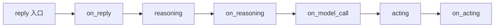
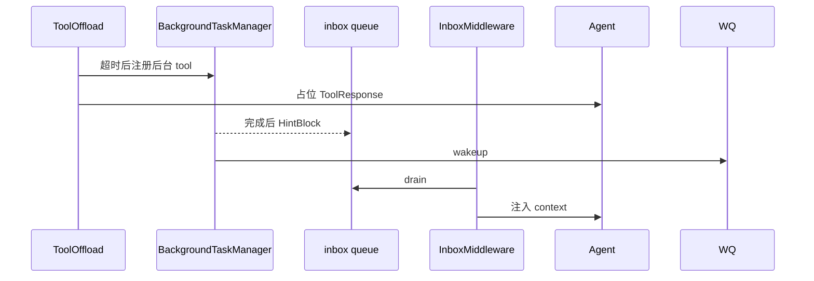

# Middleware 全目录

> **定位**：库级 `middleware/` + App 级 `app/middleware/` 钩子与专用中间件  
> **前置**：[ARCHITECTURE.md](./ARCHITECTURE.md) §8 · [APP_ARCHITECTURE.md](./APP_ARCHITECTURE.md)  
> **最后更新**：2026-09-08

---

## 1. 钩子模型（库层）

`MiddlewareBase` 提供 **7 个可选钩子**（`middleware/_base.py`）：

| 钩子 | 模式 | 典型用途 |
|------|------|----------|
| `on_reply` | 洋葱 | 整段 reply 包裹；可吞 `ReplyEndEvent` 强制多轮 |
| `on_reasoning` | 洋葱 | 每步推理前/后；注入 context |
| `on_acting` | 洋葱 | 单 tool 执行前后 |
| `on_check_permission` | 洋葱 | 改写 ALLOW/ASK/DENY |
| `on_model_call` | 洋葱 | 原始 LLM API 前后 |
| `on_compress_context` | 洋葱 | 压缩前后 |
| `on_system_prompt` | **流水线** | 顺序变换 system 字符串 |

运行时检测 `is_implemented(hook_name)` — 只链接已实现的钩子。

---

## 2. 库级专用 Middleware

| 类 | 钩子 | 作用 |
|----|------|------|
| **`AgenticMemoryMiddleware`** | `on_system_prompt`, `on_reasoning` | 工作区 Markdown 记忆库；`MEMORY.md` 索引注入；异步检索 topic 文件 → `HintBlock` |
| **`Mem0Middleware`** | 同族 | 接 Mem0 外部记忆服务 |
| **`ReMeMiddleware`** | 同族 | 接 ReMe 外部记忆服务 |
| **`RAGMiddleware`** | `on_reasoning`, `list_tools` | KB 检索：`static` 自动注入 / `agentic` 暴露 `search_knowledge` 工具 |
| **`ReplyBudgetControlMiddleware`** | `on_reasoning`, `on_model_call` | 单 reply token 预算；超限注入 hint + `tool_choice=none` |
| **`TTSMiddleware`** | `on_reasoning` | 文本块 → `DATA_BLOCK_*` 音频事件 |
| **`TracingMiddleware`** | `on_reply`, `on_model_call`, `on_acting` | OpenTelemetry span（LLM / tool / agent） |

导出：`middleware/__init__.py`

### 2.1 AgenticMemory（要点）

- 记忆目录：workspace 内 Markdown + frontmatter（`user` / `feedback` / `project` / `reference`）  
- **索引进 system**，正文 **on-demand** 检索注入  
- 依赖 `BackendBase` 读写记忆文件  

### 2.2 RAGMiddleware（要点）

| 模式 | 行为 |
|------|------|
| `static` | `cur_iter==0` 时用用户 query 检索，注入 `HintBlock` |
| `agentic` | 注册 `search_knowledge` 工具，模型自选何时查 |

支持多 KB、不同 embedding 模型并存；可选 rerank。  
**不负责索引** — 见 [RAG_AND_KNOWLEDGE.md](./RAG_AND_KNOWLEDGE.md)。

### 2.3 ReplyBudgetControl

- 状态在 `agent.state.middle_context`（HITL resume 可续）  
- `ReplyEndEvent` 时清理  
- 加权：`input_token_weight * in + output_token_weight * out`

---

## 3. App 级 Middleware

由 `ChatService` 每轮装配（`app/middleware/`）：

| 类 | 钩子 | 作用 |
|----|------|------|
| **`InboxMiddleware`** | `on_reasoning` | drain `MessageBus` inbox → `HintBlock` 进 context + `HintBlockEvent` |
| **`StateChangeMiddleware`** | 状态同步 | Session 持久化触发 |
| **`ToolOffloadMiddleware`** | `on_acting` | tool 超时 → 后台任务 + inbox 占位 + wakeup |
| **`TeamMemberLoopMiddleware`** | `on_reply` | worker 必须以 `TeamSay(leader)` 成功结束 |
| **`AGUIProtocolMiddleware`** | 协议 | AG-UI 事件投影 |

### 3.1 Inbox + ToolOffload 协作

与 [APP_ARCHITECTURE.md](./APP_ARCHITECTURE.md) §5–§7 一致：Team 消息、调度任务、渠道忙时 hint 均走 **inbox**。

---

## 4. ChatService 装配顺序（概念）

每轮 `ChatService._run_impl` 大致：

1. **App 固定**：`InboxMiddleware` → `StateChangeMiddleware` → `ToolOffloadMiddleware`  
2. **Team worker**：`TeamMemberLoopMiddleware`  
3. **Session 配置**：`TTSMiddleware`、`RAGMiddleware`（若配置 KB/TTS）  
4. **用户自定义**：`AgentMiddlewareFactory` 注入  

库级 middleware 在构造 `Agent(..., middlewares=[...])` 时传入。

---

## 5. 选型表

| 需求 | 选用 |
|------|------|
| 跨会话 Markdown 记忆 | `AgenticMemoryMiddleware` |
| 已有 Mem0/ReMe 投资 | `Mem0Middleware` / `ReMeMiddleware` |
| 知识库问答 | `RAGMiddleware` |
| 控费 / 防无限 tool | `ReplyBudgetControlMiddleware` |
| 语音播报 | `TTSMiddleware` + `tts/` 模型 |
| 可观测 | `TracingMiddleware` |
| 生产 IM/调度/Team | App `InboxMiddleware` + `ToolOffloadMiddleware`（随 `create_app`） |

---

## 6. 设计法则

1. **App middleware 依赖 MessageBus** — 仅 `create_app` 场景；脚本嵌入用库级即可。  
2. **Inbox 用 HintBlock** — 统一跨 turn 注入形态。  
3. **Budget 状态放 middle_context** — 不要放 middleware 实例字段。  
4. **RAG static 只首轮** — 避免每 iter 重复检索。  
5. **Tracing 最外层** — 通常 `middlewares` 列表靠前注册（先包 on_reply）。

---

## 7. 源码索引

| 路径 | 内容 |
|------|------|
| `middleware/_base.py` | 钩子定义 |
| `middleware/_longterm_memory/` | Agentic / Mem0 / ReMe |
| `middleware/_rag.py` | RAG |
| `middleware/_budget.py` | Token 预算 |
| `middleware/_tts_middleware.py` | TTS |
| `middleware/_tracing/` | OTel |
| `app/middleware/` | Inbox、Team、ToolOffload、AG-UI |
