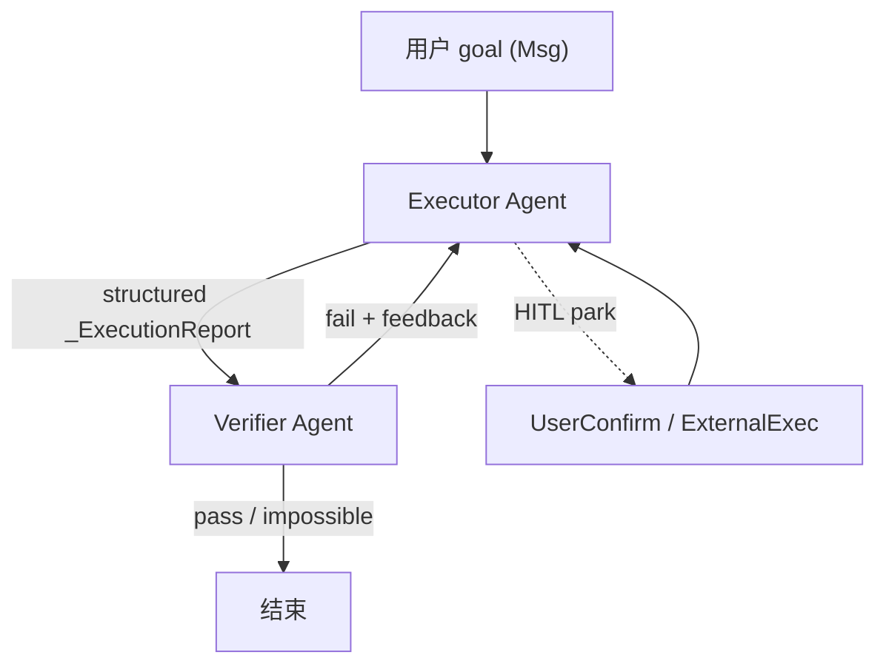
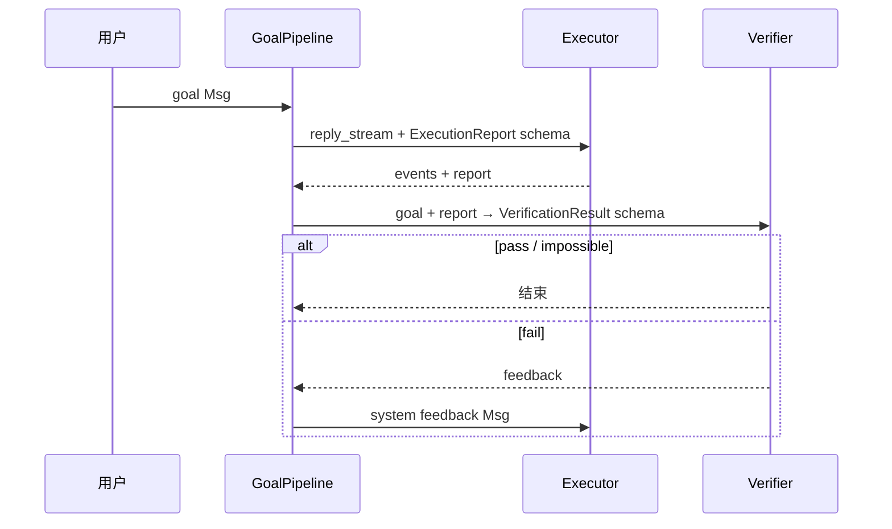

# Pipeline 与 Goal 编排

> **定位**：库级 `pipeline/` — **非** v0.x `MsgHub`（已移除）  
> **前置**：[ARCHITECTURE.md](./ARCHITECTURE.md) §4 · [APP_ARCHITECTURE.md](./APP_ARCHITECTURE.md) §7（App 层 Team 是另一套编排）  
> **最后更新**：2026-09-08

---

## 1. 一句话

v2 的 `pipeline` 包目前核心是 **`GoalPipeline`**：两个 `Agent`（executor + verifier）在结构化输出约束下循环，直到验证 **pass** / **impossible** / 达上限。  
与 App 层 `AgentCreate` Team、与旧版 `MsgHub` 广播 **不是同一机制**。

---

## 2. 历史对照

| 机制 | 状态 | 语义 |
|------|------|------|
| **MsgHub / FanoutPipeline** | ❌ main 已移除 | 多 Agent 顺序/并行传 `Msg` |
| **GoalPipeline** | ✅ `pipeline/_goal_pipeline.py` | Executor ↔ Verifier 质量环 |
| **App Team** | ✅ `app/_tool/` | Leader 创建 worker session + inbox |
| **脚本 `asyncio.gather`** | ✅ 应用自行 | 扁平多 Agent，无框架编排 |

---

## 3. GoalPipeline 设计



### 3.1 角色

| 角色 | Agent | 结构化输出 |
|------|-------|------------|
| **Executor** | 干活 | `_ExecutionReport.report`（路径、入口、环境等可验证信息） |
| **Verifier** | 审稿 | `_VerificationResult`: `pass` \| `fail` \| `impossible` + `message` |

### 3.2 关键参数

| 参数 | 默认 | 含义 |
|------|------|------|
| `verifier_reset_context` | `True` | 每轮验证后清空 verifier 上下文 |
| `max_iters` | `10` | fail 后最多重试轮次 |
| `max_retries` | `3` | 单步结构化输出无效时的重试（schema 提示） |

### 3.3 与单 Agent 的差异

- 实现 **`reply_stream`**，与 `Agent` 一样可接入事件流  
- **`_iters` 在实例上**：HITL resume 不重置轮次预算  
- HITL 事件按 `reply_id` 路由到 executor 或 verifier  
- `UserInterruptEvent` 转发给当前 parked 的 Agent  

---

## 4. 时序（概念）



**Executor 提示**：首次 goal 会追加 `<system-reminder>`，要求产出可供 verifier 检查的 report。

---

## 5. 何时用 GoalPipeline

| 适合 | 不适合 |
|------|--------|
| 代码/任务需 **客观验收**（测试、lint、文件存在） | 开放式聊天 |
| 同一 workspace 上迭代修错 | 需要 >2 个固定角色 SOP |
| 希望 verifier **独立上下文**（防 executor 自证） | 已有 App Team 分工（用 Team 工具） |

---

## 6. 与 Plan 模式的关系

| | GoalPipeline | Plan（产品语义） |
|--|--------------|------------------|
| **编排** | 双 Agent 外环 | Todo / 只读模式 / Flow |
| **状态** | 两个 `AgentState` | 通常单 Agent |
| **停止条件** | verifier 结构化判定 | 模型自觉或工具门禁 |

→ Harness 对比：[OpenHarness framework-comparison 05-plan-mode](../../OpenHarness/docs/framework-comparison/05-plan-mode.md)

---

## 7. 最小用法（概念）

```python
from agentscope.pipeline import GoalPipeline

pipeline = GoalPipeline(executor=executor_agent, verifier=verifier_agent)

async for event in pipeline.reply_stream(goal_user_msg):
    ...  # 与 Agent.reply_stream 相同事件类型
```

---

## 8. 设计法则

1. **Verifier 要独立 system prompt** — 不要与 executor 共用「自嗨」上下文。  
2. **Report 必须可验证** — 路径、命令、入口写清楚，否则 fail 循环空转。  
3. **`impossible` 要当真** — 避免无限 executor 重试。  
4. **HITL 时记住 reply_id** — pipeline 靠它区分 executor/verifier resume。  
5. **不要与 Team worker 混用** — Team 是 session 级；GoalPipeline 是单进程双 Agent。

---

## 9. 源码索引

| 路径 | 内容 |
|------|------|
| `pipeline/_goal_pipeline.py` | `GoalPipeline` 全文 |
| `pipeline/_base.py` | `PipelineProtocol` |
| `pipeline/__init__.py` | 导出 |
