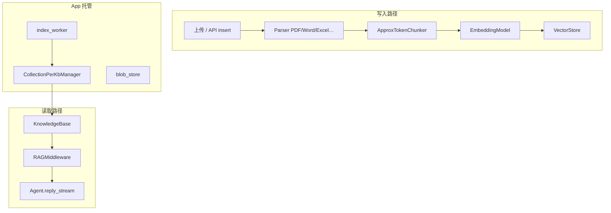
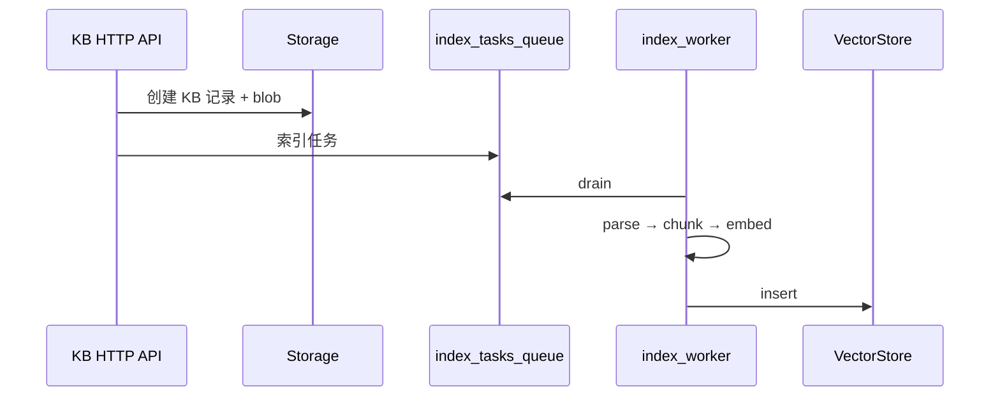

# RAG 与知识库

> **定位**：库级 `rag/` + `RAGMiddleware` + App `app/rag/`  
> **前置**：[APP_ARCHITECTURE.md](./APP_ARCHITECTURE.md) · [MIDDLEWARE_CATALOG.md](./MIDDLEWARE_CATALOG.md) §2.2  
> **最后更新**：2026-09-08

---

## 1. 一句话

**索引与检索算法**在 `rag.KnowledgeBase`；**何时注入上下文**由 `RAGMiddleware` 决定；**托管多租户 KB 生命周期**在 `app/rag/KnowledgeBaseManager` + 异步 `index_worker`。

> 旧文档「v2 无 KnowledgeBase」已作废。

---

## 2. 两层结构



| 层 | 职责 |
|----|------|
| **`KnowledgeBase`** | 单库运行时句柄：`search` / `insert_document` / `delete_document` / `list_documents` |
| **`RAGMiddleware`** | 把检索结果送进 loop（static / agentic） |
| **`KnowledgeBaseManager`** | 记录 CRUD、向量 collection 分配、维度策略、构造 KB 句柄 |
| **`index_worker`** | 消费 `index_tasks_queue`，异步建索引 |

---

## 3. KnowledgeBase（库级）

源码：`rag/_knowledge.py`

```python
kb = KnowledgeBase(
    name="handbook",
    description="HR 与 onboarding 文档",
    embedding_model=embedding_model,
    vector_store=vector_store,
    collection="handbook",
    metadata_filter={"tenant_id": "t1"},  # 可选，构造时固定
)
```

| 设计点 | 说明 |
|--------|------|
| **懒建 collection** | 首次操作 `ensure_collection`，部署零配置 |
| **metadata_filter** | 同物理 collection 多逻辑库；search/insert 强制 scope |
| **name/description** | 给 LLM 与前端；agentic 模式靠 description 决定是否检索 |

### 3.1 组件导出（`rag/__init__.py`）

| 类别 | 类 |
|------|-----|
| **Parser** | `PDFParser`, `WordParser`, `ExcelParser`, `PPTParser`, `TextParser`, `ImageParser` |
| **Chunker** | `ApproxTokenChunker` |
| **VectorStore** | `QdrantStore`, `MilvusLiteStore`, `ElasticsearchStore`, `MongoDBStore` |
| **模型** | `Chunk`, `Section`, `VectorRecord`, `VectorSearchResult`, `DocumentSummary` |

`embedding/` 包提供 `EmbeddingModelBase` 实现，与 KB 绑定。

---

## 4. RAGMiddleware 模式

源码：`middleware/_rag.py`

| 模式 | 行为 | 适用 |
|------|------|------|
| **`static`** | 每 reply 首轮（`cur_iter==0`）用用户 query 检索，合并结果 → `HintBlock` 进 `context` | 问答、助手必带资料 |
| **`agentic`** | 暴露 `search_knowledge` 工具；模型自选 KB 与时机 | 复杂任务、多 KB |

可选：**rerank**（独立 prompt + candidate cap）、`HintBlockEvent` 给前端展示引用。

**非职责**：解析 PDF、chunk、embed、insert — 由调用方或 index worker 完成后再把 `KnowledgeBase` 传给 middleware。

---

## 5. App 托管流程

### 5.1 KnowledgeBaseManager

`app/rag/knowledge_base_manager/`：

- `KnowledgeBaseManagerBase` — ABC  
- `CollectionPerKbManager` — MVP：每 KB 独立 collection  
- `DimensionPolicy` — embedding 维度校验  

职责：KB 记录持久化、分配 vector store、credential 解析、为 `ChatService` 构造运行时 `KnowledgeBase`。

### 5.2 异步索引



Bus 键：`MessageBusKeys.index_tasks_queue()` / `index_tasks_signal()`（见 [APP_ARCHITECTURE.md](./APP_ARCHITECTURE.md) §5.1）。

### 5.3 ChatService 装配

Session `config` 指定 KB id → `get_toolkit` / middleware 工厂 → 注入 `RAGMiddleware(knowledge_bases=[...])`。

---

## 6. 与 Memory 的边界

| | Session Memory | RAG |
|--|----------------|-----|
| **载体** | `AgentState.context/summary` | 向量库 + blob |
| **生命周期** | 单会话为主 | 跨会话文档库 |
| **大结果** | compress + Offloader | chunk + 引用；避免全文进 L |
| **Middleware** | `AgenticMemoryMiddleware` | `RAGMiddleware` |

二者可同时挂载在同一 `Agent` 上。

---

## 7. 端到端（自建脚本，无 App）

```text
1. 配置 EmbeddingModel + VectorStore
2. KnowledgeBase(...) → insert_document(parsed chunks)
3. Agent(..., middlewares=[RAGMiddleware(kbs=[kb], config=SearchConfig(mode="static"))])
4. await agent(user_msg)
```

托管部署改为：HTTP 上传 → manager 建记录 → worker 索引 → session config 绑定 KB。

---

## 8. 设计法则

1. **索引与检索分层** — Middleware 不做 parse。  
2. **metadata_filter 构造时固定** — 防租户串库。  
3. **static 只首轮** — 省 token。  
4. **description 写给模型** — agentic 模式选型靠它。  
5. **大文档走 worker** — 避免阻塞 `ChatService.run`。

---

## 9. 测试与源码

| 路径 | 内容 |
|------|------|
| `tests/rag_parser_test.py` | Parser |
| `rag/_knowledge.py` | KB 算法 |
| `middleware/_rag.py` | Middleware |
| `app/rag/knowledge_base_manager/` | 托管 manager |
| `app/rag/index_worker/` | 异步消费者 |
| `app/rag/blob_store/` | 原始文件存储 |
