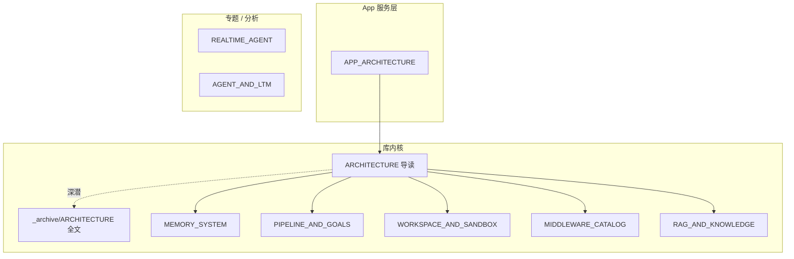

# AgentScope 架构文档

> **源码**: `src/agentscope/` · **最后更新**: 2026-09-08

---

## 文档地图

---

## 文档分层

| 层级 | 读什么 | 跳过什么 |
|------|--------|----------|
| **导读** | `ARCHITECTURE.md`、各专题前 2 节 | — |
| **专题** | APP / Memory / RAG / Workspace… | — |
| **归档** | `_archive/ARCHITECTURE.md` | 除非改代码要搜路径 |

---

## 完整清单

| 文档 | 说明 |
|------|------|
| **[ARCHITECTURE.md](./ARCHITECTURE.md)** | 库内核导读：ReAct、Model、Tool、Permission（~280 行） |
| [_archive/ARCHITECTURE.md](./_archive/ARCHITECTURE.md) | 原合并长文 ~3150 行（路径 / v0.x / 类图全文） |
| **[MEMORY_SYSTEM.md](./MEMORY_SYSTEM.md)** | `AgentState`、压缩、Offloader、持久化 |
| **[APP_ARCHITECTURE.md](./APP_ARCHITECTURE.md)** | **生产服务**：`create_app`、`ChatService`、Channel、MessageBus、Team、Scheduler |
| **[PIPELINE_AND_GOALS.md](./PIPELINE_AND_GOALS.md)** | `GoalPipeline`（executor+verifier）；非 MsgHub |
| **[WORKSPACE_AND_SANDBOX.md](./WORKSPACE_AND_SANDBOX.md)** | Workspace、Backend、沙箱谱系、MCP Gateway、`WorkspaceManager` |
| **[MIDDLEWARE_CATALOG.md](./MIDDLEWARE_CATALOG.md)** | 库级 + App 级中间件全目录 |
| **[RAG_AND_KNOWLEDGE.md](./RAG_AND_KNOWLEDGE.md)** | `KnowledgeBase`、`RAGMiddleware`、KB Manager、索引 worker |
| [REALTIME_AGENT_ARCHITECTURE.md](./REALTIME_AGENT_ARCHITECTURE.md) | Realtime 语音（v1 分支，main 未迁回） |
| [AGENT_AND_LTM_ANALYSIS.md](./AGENT_AND_LTM_ANALYSIS.md) | 核心无子 Agent；LTM 边界；→ App Team 见 APP §7 |

---

## 阅读路径

### 脚本 / SDK 嵌入

1. [ARCHITECTURE.md](./ARCHITECTURE.md) §1–§8  
2. [MEMORY_SYSTEM.md](./MEMORY_SYSTEM.md) §1–§7  
3. 按需：[PIPELINE_AND_GOALS](./PIPELINE_AND_GOALS.md) · [WORKSPACE_AND_SANDBOX](./WORKSPACE_AND_SANDBOX.md) · [MIDDLEWARE_CATALOG](./MIDDLEWARE_CATALOG.md) · [RAG_AND_KNOWLEDGE](./RAG_AND_KNOWLEDGE.md)

### 自建 FastAPI / 多渠道服务

1. [APP_ARCHITECTURE.md](./APP_ARCHITECTURE.md) 全文  
2. [ARCHITECTURE.md](./ARCHITECTURE.md) §4、§7–§8  
3. [WORKSPACE_AND_SANDBOX.md](./WORKSPACE_AND_SANDBOX.md) + [MIDDLEWARE_CATALOG.md](./MIDDLEWARE_CATALOG.md) §3  
4. 若用知识库：[RAG_AND_KNOWLEDGE.md](./RAG_AND_KNOWLEDGE.md)

### 质量环 / 验收式任务

1. [PIPELINE_AND_GOALS.md](./PIPELINE_AND_GOALS.md)  
2. [WORKSPACE_AND_SANDBOX.md](./WORKSPACE_AND_SANDBOX.md)

### 查实现路径 / v0.x 历史

→ [_archive/ARCHITECTURE.md](./_archive/ARCHITECTURE.md) 全文搜索

---

## 与源码不一致时的核对清单

| 文档旧称 | 源码现称 / 说明 |
|----------|-----------------|
| `MemoryBase` | `AgentState.context` |
| `MsgHub` / `FanoutPipeline` | **已移除** → `GoalPipeline` |
| 「无 `KnowledgeBase`」 | ❌ 过时 → [RAG_AND_KNOWLEDGE.md](./RAG_AND_KNOWLEDGE.md) |
| 「`app/` 空」 | ❌ 过时 → [APP_ARCHITECTURE.md](./APP_ARCHITECTURE.md) |
| `workspace` = 仅 Offloader | → [WORKSPACE_AND_SANDBOX.md](./WORKSPACE_AND_SANDBOX.md) |
| 同步 `agent.reply()` | `reply_stream` / `await agent(msg)` |

---

## 官方资源

- API: https://doc.agentscope.io/
- GitHub: https://github.com/agentscope-ai/agentscope
