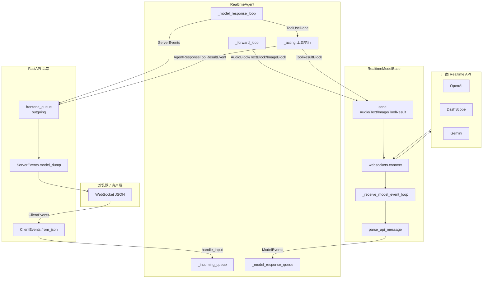
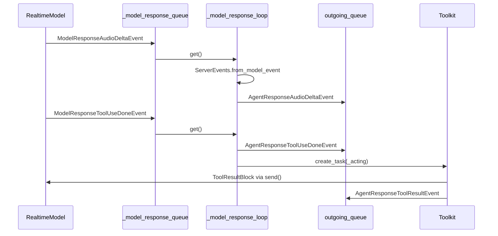
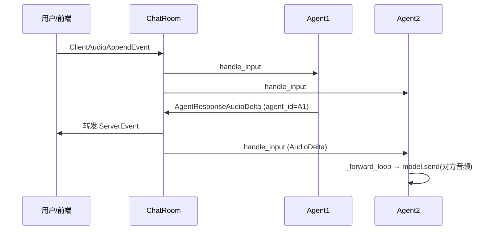

# AgentScope RealtimeAgent 完整流程与实现

> **源码版本说明**：`RealtimeAgent` 完整实现位于 **`origin/v1`** 分支（约 2025 年底）。当前 **`main`（v2）** 已重构为统一 `Agent` 类，Realtime 子系统**尚未迁移**（见 [roadmap.md](./roadmap.md) Phase 3）。本文基于 `v1` 源码撰写，便于理解设计与后续迁移。

---

## 1. 设计定位

| 维度 | `Agent` / ReAct（v2 main） | `RealtimeAgent`（v1） |
|------|---------------------------|------------------------|
| 交互模式 | 请求-响应，逐轮 `reply()` | 长连接 WebSocket，双向流式 |
| 输入模态 | 文本为主，可扩展多模态块 | 音频流、文本、图像（实时 append） |
| 输出 | 完整 `Msg` / 事件流 | 音频 delta、转写 delta、工具调用 delta |
| 编排 | 手动 `asyncio.gather` / 未来 MsgHub | `ChatRoom` 广播 Client/Server 事件 |
| 模型层 | `ChatModelBase` HTTP/SSE | `RealtimeModelBase` WebSocket |
| 状态 | `AgentState` + context | 无对话 history 抽象，依赖模型 session |

RealtimeAgent **不继承** v2 的 `Agent`，而是独立的 `StateModule` 子类，通过 **asyncio Queue + 统一事件协议** 解耦「前端 / 多 Agent / 模型 API」。

---

## 2. 模块与文件索引（v1）

```
src/agentscope/
├── agent/
│   └── _realtime_agent.py          # RealtimeAgent 核心
├── pipeline/
│   └── _chat_room.py               # 多 Agent 实时房间
└── realtime/
    ├── __init__.py                 # 导出 Model / Events
    ├── _base.py                      # RealtimeModelBase
    ├── _openai_realtime_model.py
    ├── _dashscope_realtime_model.py
    ├── _gemini_realtime_model.py
    └── _events/
        ├── _model_event.py           # 模型 API → Agent 层
        ├── _server_event.py          # Agent → 前端 / 其他 Agent
        └── _client_event.py          # 前端 → Agent / ChatRoom

examples/
├── agent/realtime_voice_agent/     # 单 Agent + FastAPI WebSocket
└── workflows/multiagent_realtime/  # ChatRoom 多 Agent
```

---

## 3. 总体架构



**三条数据通路**：

1. **Client → Model**：`handle_input` → `_incoming_queue` → `_forward_loop` → `model.send()`
2. **Model → Client**：WebSocket 收包 → `parse_api_message` → `_model_response_queue` → `_model_response_loop` → `outgoing_queue`
3. **Agent ↔ Agent**（ChatRoom）：某 Agent 的 `ServerEvents` 广播给其他 Agent 的 `_incoming_queue`（例如把对方语音 delta 当输入音频）

---

## 4. 三层事件协议

AgentScope 用 **Pydantic BaseModel** 定义三类事件，避免各厂商 WebSocket JSON 直接泄漏到业务层。

### 4.1 ModelEvents（模型 API 内部）

- **方向**：`RealtimeModelBase._receive_model_event_loop` → `RealtimeAgent._model_response_queue`
- **Session 含义**：与 **厂商 Realtime WebSocket 会话**，不是浏览器 session
- **典型类型**：
  - 生命周期：`ModelSessionCreatedEvent` / `ModelSessionEndedEvent`
  - 响应：`ModelResponseCreatedEvent` / `ModelResponseDoneEvent`
  - 音频输出：`ModelResponseAudioDeltaEvent` / `ModelResponseAudioDoneEvent`
  - 输出转写：`ModelResponseAudioTranscriptDeltaEvent` / `…DoneEvent`
  - 工具：`ModelResponseToolUseDeltaEvent` / `ModelResponseToolUseDoneEvent`
  - 输入转写 / VAD：`ModelInputTranscription*`, `ModelInputStartedEvent`, `ModelInputDoneEvent`
  - 错误：`ModelErrorEvent`

各 `*RealtimeModel` 的 `parse_api_message()` 负责把厂商原始 JSON **映射** 为上述类型。例如 OpenAI 的 `response.audio.delta` → `ModelResponseAudioDeltaEvent`。

### 4.2 ServerEvents（Agent → 外部）

- **方向**：`RealtimeAgent._model_response_loop` → `outgoing_queue` → WebSocket / 其他 Agent
- **转换规则**：`ServerEvents.from_model_event()` 做两件事：
  1. `type` 字段前缀 `model_` → `agent_`
  2. 注入 `agent_id`, `agent_name`
- **特殊映射**：
  - `ModelSessionCreatedEvent` → `AgentReadyEvent`（对前端表示 Agent 可接收输入）
  - `ModelSessionEndedEvent` → `AgentEndedEvent`
- **工具结果**：`_acting()` 完成后额外发送 `AgentResponseToolResultEvent`

### 4.3 ClientEvents（外部 → Agent）

- **方向**：WebSocket `receive_json` → `ClientEvents.from_json()` → `handle_input()`
- **典型类型**：
  - `ClientSessionCreateEvent` / `ClientSessionEndEvent` — 由 **应用层**（如 `run_server.py`）处理，用于创建/销毁 Agent，**不进入** `_forward_loop`
  - `ClientAudioAppendEvent` — base64 PCM 音频块
  - `ClientTextAppendEvent` / `ClientImageAppendEvent`
  - `ClientResponseCreateEvent` / `ClientResponseCancelEvent` — 打断/强制响应（依模型支持）
  - `ClientAudioCommitEvent` — 提交音频缓冲区

---

## 5. RealtimeAgent 生命周期

### 5.1 构造

```python
agent = RealtimeAgent(
    name="Friday",
    sys_prompt="You are a helpful assistant.",
    model=DashScopeRealtimeModel(...),
    toolkit=toolkit,  # 可选；OpenAI/Gemini 支持工具
)
```

内部状态：

| 字段 | 作用 |
|------|------|
| `id` | `shortuuid`，多 Agent 广播时识别发送方 |
| `_incoming_queue` | 外部事件入口 |
| `_model_response_queue` | 模型事件入口 |
| `_external_event_handling_task` | `_forward_loop` 协程 |
| `_model_response_handling_task` | `_model_response_loop` 协程 |

### 5.2 `start(outgoing_queue)`

```python
await agent.start(frontend_queue)
```

顺序：

1. **`model.connect(_model_response_queue, instructions=sys_prompt, tools=...)`**
   - `websockets.connect(url, headers=...)`
   - 启动 `_receive_model_event_loop`（持续 `async for message in websocket`）
   - 发送 `_build_session_config()` 生成的 session 初始化 JSON（各厂商格式不同）
2. **`asyncio.create_task(_forward_loop())`** — 消费 `_incoming_queue`，调用 `model.send()`
3. **`asyncio.create_task(_model_response_loop(outgoing_queue))`** — 消费模型事件，写入 `outgoing_queue`

### 5.3 `stop()`

- `cancel` `_external_event_handling_task`（注意：**未** cancel `_model_response_handling_task`，disconnect 后该 loop 可能仍阻塞在 `queue.get()`）
- `await model.disconnect()` — cancel 收包 task，关闭 WebSocket

### 5.4 `handle_input(event)`

```python
await agent.handle_input(client_event)  # 非阻塞入队
```

---

## 6. `_forward_loop`：外部输入 → 模型

`match/case` 分发（Python 3.10+）：

| 输入事件 | 动作 |
|----------|------|
| `ClientAudioAppendEvent` | `AudioBlock` + `Base64Source` → `model.send()` |
| `ClientTextAppendEvent` | `TextBlock` → `model.send()` |
| `ClientImageAppendEvent` | `ImageBlock` → `model.send()` |
| `ServerEvents.AgentResponseAudioDeltaEvent` | **多 Agent**：对方 Agent 的音频 delta，经 `_resample_pcm_delta` 对齐 `model.input_sample_rate` 后送入本模型 |
| `ServerEvents.AgentResponseAudioDoneEvent` | 当前为 `pass`（可扩展发送静音结束标记） |

**采样率**：OpenAI/Gemini 常用 24kHz；DashScope 可能不同。跨 Agent 转发音频时必须重采样。

---

## 7. `_model_response_loop`：模型输出 → 外部



**直接映射**的事件：`ResponseCreated/Done`、音频/转写 delta/done、工具 delta、输入转写、VAD、错误等。

**需特殊处理**：

- `ModelSessionCreatedEvent` → `AgentReadyEvent`
- `ModelSessionEndedEvent` → `AgentEndedEvent`
- `ModelResponseToolUseDoneEvent` → 先推送 `AgentResponseToolUseDoneEvent`，再 `asyncio.create_task(_acting(...))`

### 7.1 工具调用 `_acting`

```python
res = await self.toolkit.call_tool_function(tool_use)
async for chunk in res:
    last_chunk = chunk
# 1. ToolResultBlock → model.send()  让模型继续生成
# 2. AgentResponseToolResultEvent → outgoing_queue  通知前端
```

与 ReAct Agent 不同：**工具在独立 task 中异步执行**，不阻塞事件 loop 收音频 delta。

---

## 8. RealtimeModelBase

抽象基类定义 Realtime 模型的 **最小契约**：

| 方法/属性 | 说明 |
|-----------|------|
| `websocket_url` / `websocket_headers` | 连接参数 |
| `input_sample_rate` / `output_sample_rate` | 音频格式 |
| `support_input_modalities` | 如 `["audio","text","tool_result"]` |
| `connect(outgoing_queue, instructions, tools)` | 建连 + 收包 loop + session 配置 |
| `disconnect()` | 关连 |
| `send(data)` | 抽象；子类把 Block 序列化为厂商 JSON |
| `_build_session_config(instructions, tools)` | 抽象；生成首包或 `session.update` |
| `parse_api_message(message)` | 抽象；原始 JSON → `ModelEvents` |

**收包 loop**（`_base.py`）：

```python
async for message in self._websocket:
    events = await self.parse_api_message(message)
    for event in (events if list else [events]):
        await outgoing_queue.put(event)
```

### 8.1 厂商实现对比

| 类 | 模型示例 | 输入 | 工具 | 采样率 |
|----|----------|------|------|--------|
| `DashScopeRealtimeModel` | `qwen3-omni-flash-realtime` | 文本、音频、图像 | ❌ | 依 API |
| `OpenAIRealtimeModel` | `gpt-4o-realtime-preview` | 文本、音频 | ✅ | 24kHz |
| `GeminiRealtimeModel` | `gemini-2.5-flash-native-audio-preview-09-2025` | 文本、音频、图像 | ✅ | 依 API |

**OpenAI 特有逻辑**（示例）：

- Session：`session.update` + `server_vad` turn detection + `whisper-1` 输入转写
- 工具 schema：Chat API 的 `{"type":"function","function":{...}}`  flatten 为 Realtime API 格式
- 工具参数：`_tool_args_accumulator` 累积 `function_call_arguments.delta` 直至 `done`
- 发送：`input_audio_buffer.append`、`conversation.item.create`（文本/工具结果）

---

## 9. ChatRoom 多 Agent 流程

```python
chat_room = ChatRoom(agents=[agent1, agent2])
await chat_room.start(frontend_queue)
await chat_room.handle_input(client_event)
await chat_room.stop()
```

### 9.1 内部结构

- 每个 Agent 的 `outgoing_queue` **共用** ChatRoom 内部 `_queue`（不是直接的 `frontend_queue`）
- `_forward_loop(outgoing_queue)` 从 `_queue` 取事件：
  - **`ClientEvents`**：分发给 **所有** Agent 的 `handle_input`（用户说话，人人听到）
  - **`ServerEvents`**：
    1. 转发到 `outgoing_queue`（前端 UI）
    2. 按 `agent_id` 广播给 **除发送者外** 的 Agent（Agent 间听对方说话）



多 Agent 示例在 session 创建后常向 `agent1.model.send(TextBlock("<system>Now you can talk.</system>"))` 触发开场。

---

## 10. 典型部署：FastAPI + WebSocket

参考 `examples/agent/realtime_voice_agent/run_server.py`。

### 10.1 连接与双协程

```python
@app.websocket("/ws/{user_id}/{session_id}")
async def single_agent_endpoint(websocket, user_id, session_id):
    await websocket.accept()
    frontend_queue = asyncio.Queue()
    asyncio.create_task(frontend_receive(websocket, frontend_queue))

    agent = None
    while True:
        data = await websocket.receive_json()
        client_event = ClientEvents.from_json(data)

        if isinstance(client_event, ClientEvents.ClientSessionCreateEvent):
            # 按 config 选择 DashScope / OpenAI / Gemini，创建 RealtimeAgent
            agent = RealtimeAgent(name=..., sys_prompt=..., model=..., toolkit=...)
            await agent.start(frontend_queue)
            await websocket.send_json(
                ServerEvents.ServerSessionCreatedEvent(session_id=session_id).model_dump()
            )
        elif client_event.type == ClientEventType.CLIENT_SESSION_END:
            await agent.stop()
            agent = None
        else:
            await agent.handle_input(client_event)
```

`frontend_receive` 独立 task：`frontend_queue.get()` → `websocket.send_json(msg.model_dump())`，避免阻塞收客户端消息。

### 10.2 前端职责（`chatbot.html`）

- 麦克风 PCM → base64 → `ClientAudioAppendEvent`
- 播放 `AgentResponseAudioDeltaEvent` 的 delta
- 展示 `AgentInputTranscription*` / `AgentResponseAudioTranscript*`
- 可选：摄像头 JPEG → `ClientImageAppendEvent`（1 fps）

---

## 11. 与 ReAct `Agent` 的对比（迁移视角）

v2 `main` 上的 `Agent`（`src/agentscope/agent/_agent.py`）使用：

- `ModelCallStartEvent` / `ToolCallStartEvent` 等 **LangGraph 风格事件**
- `Toolkit` + `reply()` 循环 + `AgentState.context`

v1 `RealtimeAgent` 使用：

- **Queue 驱动** 的双 loop，无 `reply()` 单次调用
- **Server/Client/Model** 三套事件，专为 WebSocket 全双工设计
- 工具结果通过 `model.send(ToolResultBlock)` 回灌，而非写入 `AgentState`

**roadmap Phase 3** 目标：在 v2 上实现低延迟 streaming、打断、并发多模态，并统一编程范式。迁移时需决定：

1. RealtimeAgent 是否重新接入 v2 `Agent` 事件体系
2. `ChatRoom` 是否与未来 `MsgHub` 合并或保持独立
3. DashScope 工具支持是否补齐

---

## 12. 时序：单次语音轮次（单 Agent）

```mermaid
sequenceDiagram
    participant B as 浏览器
    participant S as run_server
    participant A as RealtimeAgent
    participant M as RealtimeModel
    participant API as 厂商 API

    B->>S: ClientSessionCreateEvent
    S->>A: RealtimeAgent + start()
    A->>M: connect(session_config)
    M->>API: WebSocket + session.update
    API-->>M: session.created
    M-->>A: ModelSessionCreatedEvent
    A-->>S: AgentReadyEvent
    S-->>B: JSON

    loop 用户说话
        B->>S: ClientAudioAppendEvent
        S->>A: handle_input
        A->>M: send(AudioBlock)
        M->>API: input_audio_buffer.append
    end

    API-->>M: speech_started / transcription.delta
    M-->>A-->>S-->>B: AgentInput*

    API-->>M: response.audio.delta
    M-->>A-->>S-->>B: AgentResponseAudioDelta

    API-->>M: response.done
    M-->>A-->>S-->>B: AgentResponseDone
```

---

## 13. 本地查看源码

当前 workspace 的 `main` 分支不含 Realtime 实现，可用：

```bash
cd agentscope
git show origin/v1:src/agentscope/agent/_realtime_agent.py
git show origin/v1:src/agentscope/realtime/_base.py
git checkout v1   # 或 git worktree add ../agentscope-v1 v1
```

运行示例（v1）：

```bash
export DASHSCOPE_API_KEY=...
cd examples/agent/realtime_voice_agent
python run_server.py
# 浏览器 http://localhost:8000
```

---

## 14. 相关文档

- [roadmap.md](./roadmap.md) — Voice Agent 三阶段路线（TTS → 非实时多模态 → Realtime）
- [ARCHITECTURE.md](./ARCHITECTURE.md) — Agent 类型总览（§3）
- [_archive/ARCHITECTURE.md](./_archive/ARCHITECTURE.md) — v0.x 编排与 Realtime 迁移（§9）
- 官方教程（v1）：`docs/tutorial/zh_CN/src/task_realtime.py`

---

*文档基于 `agentscope` `origin/v1` 源码整理；若 main 完成迁移，请以实际 API 为准并更新本文。*
