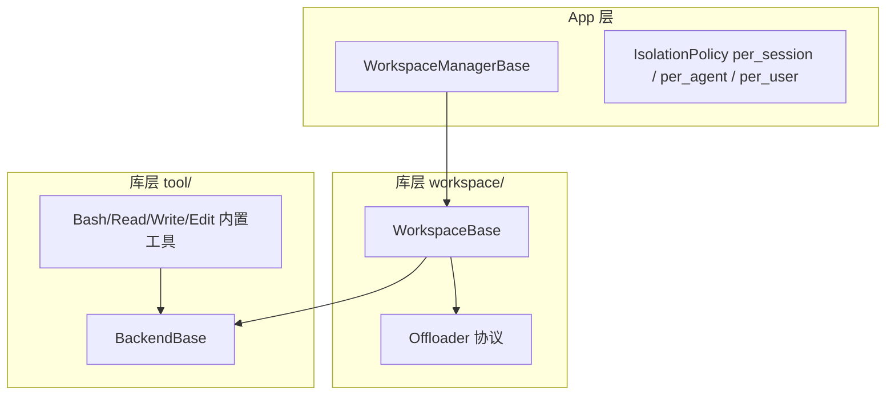
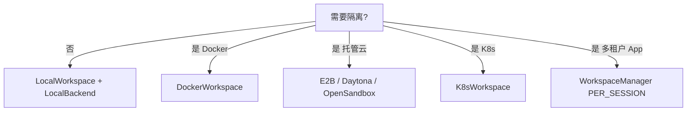

# Workspace 与沙箱执行

> **定位**：`workspace/`（库）+ `app/workspace_manager/`（托管隔离）+ `tool` 内置 Backend  
> **前置**：[MEMORY_SYSTEM.md](./MEMORY_SYSTEM.md) §12（Offloader）· [APP_ARCHITECTURE.md](./APP_ARCHITECTURE.md)  
> **最后更新**：2026-09-08

---

## 1. 一句话

**Workspace** = Agent 可见的文件系统根 + Skill/MCP 声明 + **卸载（Offload）** 落盘；**Backend** = bash/read/write 真正执行的位置（本机 / 容器 / 云沙箱）。  
App 层 **`WorkspaceManager`** 按 user/agent/session 策略分配 workspace 实例。

---

## 2. 三层概念



| 层 | 问什么 |
|----|--------|
| **WorkspaceManager** | 哪个用户/会话绑定哪个 workspace id |
| **WorkspaceBase** | 目录布局、MCP 声明、skill 分区、offload 路径 |
| **BackendBase** | 命令与文件 I/O 落在哪 |

---

## 3. Workspace 目录布局

`WorkspaceBase` 在 `workdir` 下约定（见 `workspace/_base.py` 文档块）：

```text
{workdir}/
├── .mcp          # MCP 声明（按 agent/session 懒连接）
├── data/         # 卸载的多模态 payload
├── skills/       # 按 agent 分区；.seed 为模板
└── sessions/     # 每 session 的 context / tool-result 文件
```

| 能力 | 设计要点 |
|------|----------|
| **MCP** | 声明在 `.mcp`；**按 session 懒实例化**，避免跨 session 状态泄漏 |
| **Skill** | 每 agent 独立分区；首次从 `.seed` 装备 |
| **Offload** | 压缩 context、大 tool result、`DataBlock` base64 → `workspace://` URL |

---

## 4. 实现谱系

### 4.1 Workspace 实现

| 类 | 场景 |
|----|------|
| `LocalWorkspace` | 开发 / 单机 |
| `DockerWorkspace` | 容器隔离 |
| `E2BWorkspace` | E2B 云沙箱 |
| `DaytonaWorkspace` | Daytona 开发环境 |
| `K8sWorkspace` | K8s Pod |
| `OpenSandboxWorkspace` | OpenSandbox 远端 |
| `AppleContainerWorkspace` | Apple Container（macOS） |
| `BubblewrapWorkspace` | bwrap 轻量隔离 |

导出见 `workspace/__init__.py`。

### 4.2 Backend 实现

内置工具（`tool/_builtin/_backend.py`）通过 **`BackendBase`** 三原语抽象：

- `exec_shell` — argv 执行（无 shell；需 shell 时 `sh -c`）
- `read_file` / `write_file`

| Backend | 绑定 Workspace |
|---------|----------------|
| `LocalBackend` | 本机 |
| `DockerBackend` | Docker exec/archive |
| `E2BBackend` | E2B SDK |

**原则**：工具代码不分支 workspace 类型，只调 Backend。

---

## 5. Offloader 协议

```python
# workspace/_offload_protocol.py — 协议方法
offload_data_block(block) -> DataBlock      # base64 → workspace://
offload_context(session_id, msgs) -> str    # 压缩删除前的备份
offload_tool_result(session_id, result) -> str
```

与 [MEMORY_SYSTEM.md](./MEMORY_SYSTEM.md) 的关系：

- **压缩物理删除** `context` 前可 offload → summary 里留引用  
- **大 tool result** 截断前 offload → Agent 可用路径再读  

---

## 6. MCP Gateway（沙箱内）

`workspace/_mcp_gateway/_mcp_gateway_app.py`：在 **workspace 环境内** 跑的 FastAPI 网关。

| 设计点 | 说明 |
|--------|------|
| **空启动注册表** | 不读 `.mcp` 文件；由 workspace 按需 `POST /mcps` 注册 |
| **会话隔离** | `?agent_id=&session_id=`；同 MCP 名不同 session 独立 client 状态 |
| **可选 bearer** | 共享 host 网络时防跨 workspace 访问 |
| **端点** | health、list/register MCP、list/call tools |

上游：`workspace/_gateway_client.py`、`_gateway_shim.py`。

---

## 7. App：WorkspaceManager

`app/workspace_manager/_base.py`：

| `IsolationPolicy` | 粒度 |
|-------------------|------|
| `PER_SESSION` | 每会话独立 workspace |
| `PER_AGENT` | 同 agent 多 session 共享（默认） |
| `PER_USER` | 用户级共享 |

- `bind_storage(storage)` — 持久化 workspace id 绑定  
- `get_workspace(user_id, agent_id, session_id)` — ChatService 每轮调用  
- 并发 **bind lock** + `_reserved` — 防双 session 同时 mint 两个 workspace  

`ChatService` 将 workdir 合并进 **permission context**，供工具路径校验。

---

## 8. 选型决策树



| 场景 | 建议 |
|------|------|
| 本地 demo | `LocalWorkspace` |
| Coding Agent 产品 | Docker 或 E2B + `PER_AGENT` |
| 强多租户 | `PER_SESSION` + 远端沙箱 |
| 有状态 MCP（浏览器） | 必须 session 级 MCP 实例 + 可选 in-sandbox gateway |

---

## 9. 设计法则

1. **Backend 与 Workspace 分离** — 换沙箱不换工具实现。  
2. **MCP 懒连接** — 启动成本与 agent 数量解耦。  
3. **Offload 引用进 summary** — 删了还能找回。  
4. **permission context 带 workdir** — 防止路径逃逸。  
5. **Gateway 在沙箱内** — 远端 MCP 不直接暴露宿主机。

---

## 10. 源码索引

| 主题 | 路径 |
|------|------|
| Workspace 抽象 | `workspace/_base.py` |
| Offloader | `workspace/_offload_protocol.py` |
| Local | `workspace/_local_workspace.py` |
| Docker | `workspace/_docker/` |
| MCP Gateway | `workspace/_mcp_gateway/` |
| Backend | `tool/_builtin/_backend.py` |
| App 管理器 | `app/workspace_manager/_base.py` |
