# AgentScope 完整架构文档

> **合并版** · 2026-08-05 · 合并自 FLOW + PART1–3。  
> **App 服务层**：[APP_ARCHITECTURE.md](./APP_ARCHITECTURE.md)  
> **专题**：[PIPELINE_AND_GOALS](./PIPELINE_AND_GOALS.md) · [WORKSPACE_AND_SANDBOX](./WORKSPACE_AND_SANDBOX.md) · [MIDDLEWARE_CATALOG](./MIDDLEWARE_CATALOG.md) · [RAG_AND_KNOWLEDGE](./RAG_AND_KNOWLEDGE.md) · MEMORY_SYSTEM · REALTIME · AGENT_AND_LTM  
> 源码：`src/agentscope/`

---


<!-- ===== 总体流程（原 ARCHITECTURE_FLOW） ===== -->

> **版本**: 2.1（源码级完整版：流程图 + 时序图 + 模型模块设计）  
> **分析时间**: 2026-05-22（全面扩写 2026-06-01）  
> **源码**: `src/agentscope/`（v2.0.0，全异步 API）  
> **配套**: [Part 1]) · [PART2](./ARCHITECTURE_PART2.md) · [PART3](./ARCHITECTURE_PART3.md)

> **文档原则**：本文是**流程设计主文档**，含完整 mermaid 图与时序图；章节内**不**用「详见 XX」替代实现细节。Memory / Tool 深度见 PART1/2 对应章节。

---

## 📋 目录

1. [设计定位](#1-设计定位)
2. [包结构与模块依赖](#2-包结构与模块依赖)
3. [应用启动与 Agent 构造](#3-应用启动与-agent-构造)
4. [单 Agent：ReAct 主循环（完整时序）](#4-单-agentreact-主循环完整时序)
5. [Model 模块设计](#5-model-模块设计)
6. [Memory 在循环中的位置](#6-memory-在循环中的位置)
7. [Tool / MCP / Permission 时序](#7-tool--mcp--permission-时序)
8. [Middleware 拦截链](#8-middleware-拦截链)
9. [多智能体编排（v0.x 参考）](#9-多智能体编排v0x-参考)
10. [会话持久化](#10-会话持久化)
11. [端到端场景对照](#11-端到端场景对照)

---

## 1. 设计定位

AgentScope v2 是 **消息驱动（Msg-centric）、全异步** 的智能体框架：

| 维度 | 设计选择 |
|------|----------|
| 核心循环 | 单一 `Agent` 类，`reply()` 内 ReAct（reasoning ↔ acting） |
| 状态 | `AgentState`（`context` + `summary` + `permission` + `tool`） |
| 模型 | `ChatModelBase` 直接消费 `list[Msg]`，无独立 Memory→Formatter 链 |
| 工具 | `Toolkit` + `ToolGroup` + `MCPClient` + Skill |
| 横切 | `MiddlewareBase`（6 钩子）+ `PermissionEngine` |
| 可观测 | `AgentEvent` 流式事件（17+ 类型） |
| 部署 | 无内置生产 Server；配合 [agentscope-runtime](https://github.com/agentscope-ai/agentscope-runtime) |

> ⚠️ v2 main 中 `memory/`、`pipeline/`、`session/`、`rag/`、`plan/`、`a2a/` **尚未迁移**（v0.x 参考见 PART1 §3、PART2 §6–7）。

---

## 2. 包结构与模块依赖

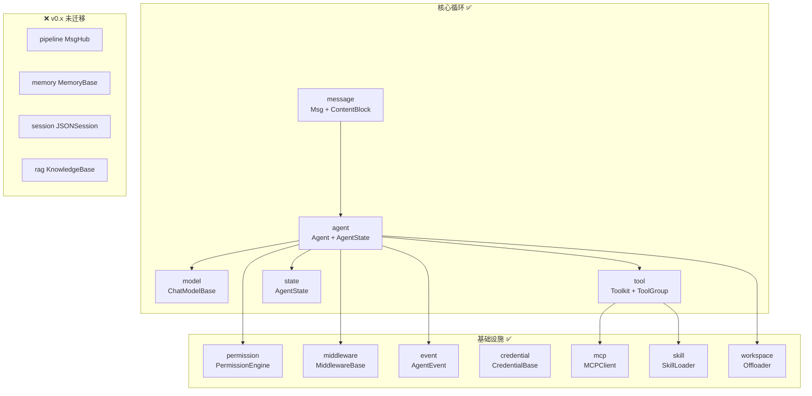
```mermaid
graph TB
    subgraph core["核心循环 ✅"]
        MSG[message<br/>Msg + ContentBlock]
        AGENT[agent<br/>Agent + AgentState]
        MODEL[model<br/>ChatModelBase]
        TOOL[tool<br/>Toolkit + ToolGroup]
        STATE[state<br/>AgentState]
    end

    subgraph infra["基础设施 ✅"]
        PERM[permission<br/>PermissionEngine]
        MID[middleware<br/>MiddlewareBase]
        EVENT[event<br/>AgentEvent]
        CRED[credential<br/>CredentialBase]
        MCP[mcp<br/>MCPClient]
        SKILL[skill<br/>SkillLoader]
        WORK[workspace<br/>Offloader]
    end

    subgraph unmigrated["❌ v0.x 未迁移"]
        HUB[pipeline MsgHub]
        MEM[memory MemoryBase]
        SESS[session JSONSession]
        RAG[rag KnowledgeBase]
    end

    MSG --> AGENT
    AGENT --> MODEL
    AGENT --> TOOL
    AGENT --> STATE
    AGENT --> PERM
    AGENT --> MID
    AGENT --> EVENT
    TOOL --> MCP
    TOOL --> SKILL
    AGENT --> WORK
```

### 模块职责表

| 模块 | 路径 | 核心类 | 职责 |
|------|------|--------|------|
| `agent` | `agent/` | `Agent`, `ContextConfig`, `ReActConfig` | ReAct 循环、压缩、reply 入口 |
| `message` | `message/` | `Msg`, `*Block`, `UserMsg` 等 | 消息信封 + 6 种 ContentBlock |
| `model` | `model/` | `ChatModelBase`, `*ChatModel` | LLM API、token 计数、结构化输出 |
| `tool` | `tool/` | `Toolkit`, `ToolGroup`, `ToolBase` | 工具注册、执行、分组 |
| `state` | `state/` | `AgentState`, `ToolContext` | 运行时状态 |
| `event` | `event/` | `AgentEvent` 子类 | 流式 UI / SSE |
| `permission` | `permission/` | `PermissionEngine` | ALLOW/ASK/DENY |
| `middleware` | `middleware/` | `MiddlewareBase` | 6 钩子洋葱链 |
| `mcp` | `mcp/` | `MCPClient` | MCP stdio/HTTP |
| `workspace` | `workspace/` | `Offloader`, `LocalWorkspace` | 压缩/截断落盘 |

---

## 3. 应用启动与 Agent 构造

### 3.1 v2 启动流程（无 `agentscope.init()`）

```mermaid
sequenceDiagram
    participant App as 应用 main
    participant Log as setup_logger
    participant Cred as CredentialBase
    participant Model as ChatModelBase
    participant TK as Toolkit
    participant MCP as MCPClient
    participant Agent as Agent

    App->>Log: setup_logger(level, path)
    App->>Cred: OpenAICredential(api_key=...)
    App->>Model: OpenAIChatModel(credential, model, stream=True)
    opt MCP 工具
        App->>MCP: MCPClient(...); await connect()
        App->>TK: Toolkit(mcps=[mcp_client])
    end
    opt 恢复会话
        App->>App: AgentState.model_validate_json(...)
    end
    App->>Agent: Agent(name, system_prompt, model, toolkit, state=...)
    App->>App: await agent.reply(UserMsg(...))
```

```python
from agentscope import setup_logger
from agentscope.agent import Agent
from agentscope.model import OpenAIChatModel
from agentscope.credential import OpenAICredential
from agentscope.tool import Toolkit, Bash, Read, Write

setup_logger(level="INFO")

agent = Agent(
    name="Friday",
    system_prompt="You are a helpful assistant.",
    model=OpenAIChatModel(
        credential=OpenAICredential(api_key="..."),
        model="gpt-4o",
        stream=True,
        context_size=128000,
    ),
    toolkit=Toolkit(tools=[Bash(), Read(), Write()]),
)
```

### 3.2 与 v0.x 启动差异

| 步骤 | v0.x | v2 |
|------|------|-----|
| 全局初始化 | `agentscope.init(project, studio_url, tracing_url)` | `setup_logger()` 即可 |
| Formatter | 必须 `DashScopeChatFormatter()` 等 | Model 内部处理 `Msg` |
| Memory | `InMemoryMemory()` | `AgentState.context`（自动） |
| Session | `JSONSession.load_state(agent)` | `Agent(..., state=restored)` |
| 调用 | `await agent(msg)` 经 `__call__` | `await agent.reply(msg)` |

---

## 4. 单 Agent：ReAct 主循环（完整时序）

### 4.1 顶层流程图

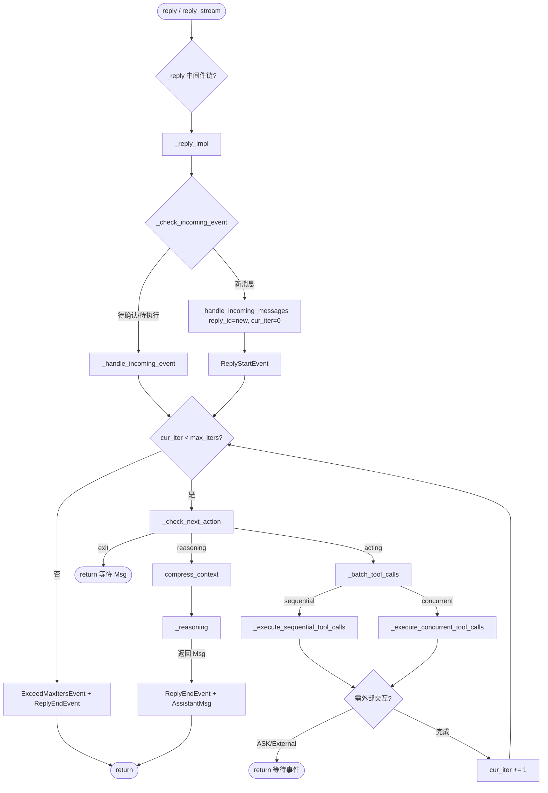
```mermaid
flowchart TD
    START([reply / reply_stream]) --> WRAP{_reply 中间件链?}
    WRAP --> IMPL[_reply_impl]

    IMPL --> E1{_check_incoming_event}
    E1 -->|待确认/待执行| HE[_handle_incoming_event]
    E1 -->|新消息| HM[_handle_incoming_messages<br/>reply_id=new, cur_iter=0]
    HE --> LOOP
    HM --> RS[ReplyStartEvent]
    RS --> LOOP

    LOOP{cur_iter < max_iters?}
    LOOP -->|否| MAX[ExceedMaxItersEvent + ReplyEndEvent]
    LOOP -->|是| CNA[_check_next_action]

    CNA -->|exit| EXIT([return 等待 Msg])
    CNA -->|reasoning| COMP[compress_context]
    COMP --> REAS[_reasoning]
    REAS -->|返回 Msg| DONE[ReplyEndEvent + AssistantMsg]
    CNA -->|acting| BATCH[_batch_tool_calls]

    BATCH -->|sequential| SEQ[_execute_sequential_tool_calls]
    BATCH -->|concurrent| CONC[_execute_concurrent_tool_calls]
    SEQ --> PERM{需外部交互?}
    CONC --> PERM
    PERM -->|ASK/External| WAIT([return 等待事件])
    PERM -->|完成| INC[cur_iter += 1]
    INC --> LOOP

    DONE --> END([return])
    MAX --> END
```

### 4.2 完整端到端时序图（单次 `reply`）

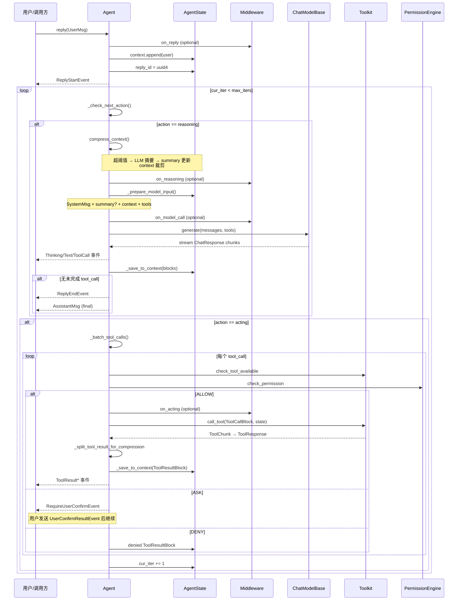
```mermaid
sequenceDiagram
    participant U as 用户/调用方
    participant A as Agent
    participant S as AgentState
    participant M as Middleware
    participant Model as ChatModelBase
    participant TK as Toolkit
    participant PE as PermissionEngine

    U->>A: reply(UserMsg)
    A->>M: on_reply (optional)
    A->>S: context.append(user)
    A->>S: reply_id = uuid4
    A-->>U: ReplyStartEvent

    loop cur_iter < max_iters
        A->>A: _check_next_action()

        alt action == reasoning
            A->>A: compress_context()
            Note over A,S: 超阈值 → LLM 摘要 → summary 更新<br/>context 裁剪

            A->>M: on_reasoning (optional)
            A->>S: _prepare_model_input()
            Note over A: SystemMsg + summary? + context + tools

            A->>M: on_model_call (optional)
            A->>Model: generate(messages, tools)
            Model-->>A: stream ChatResponse chunks
            A-->>U: Thinking/Text/ToolCall 事件
            A->>S: _save_to_context(blocks)

            alt 无未完成 tool_call
                A-->>U: ReplyEndEvent
                A-->>U: AssistantMsg (final)
            end
        end

        alt action == acting
            A->>A: _batch_tool_calls()
            loop 每个 tool_call
                A->>TK: check_tool_available
                A->>PE: check_permission
                alt ALLOW
                    A->>M: on_acting (optional)
                    A->>TK: call_tool(ToolCallBlock, state)
                    TK-->>A: ToolChunk → ToolResponse
                    A->>A: _split_tool_result_for_compression
                    A->>S: _save_to_context(ToolResultBlock)
                    A-->>U: ToolResult* 事件
                else ASK
                    A-->>U: RequireUserConfirmEvent
                    Note over U,A: 用户发送 UserConfirmResultEvent 后继续
                else DENY
                    A->>S: denied ToolResultBlock
                end
            end
            A->>S: cur_iter += 1
        end
    end
```

### 4.3 `_check_next_action` 决策

| 未完成 tool_call 状态 | 有可执行 (PENDING/ALLOWED) | 仅等待 (ASKING/SUBMITTED) | 无未完成 |
|----------------------|---------------------------|--------------------------|---------|
| **下一步** | `acting` | `exit`（暂停 reply） | `reasoning` |

### 4.4 `reply()` 方法索引（`agent/_agent.py`）

| 阶段 | 方法 | 说明 |
|------|------|------|
| 入口 | `reply` / `reply_stream` | 公开 API |
| 包装 | `_reply` | `on_reply` 中间件链 |
| 核心 | `_reply_impl` | 四步：事件检查 → 消息写入 → ReAct 循环 → max_iters |
| 动作判断 | `_check_next_action` | reasoning / acting / exit |
| 压缩 | `compress_context` → `_compress_context_impl` | reasoning **前**每次调用 |
| 推理 | `_reasoning` → `_reasoning_impl` | `_prepare_model_input` → `_call_model` → 事件转换 |
| 行动 | `_acting` → `_acting_impl` | 委托 `toolkit.call_tool` |
| 单工具 | `_execute_tool_call` | 校验 → 权限 → 执行 → context 写入 |
| 输入组装 | `_prepare_model_input` | System + summary + context + tool schemas |
| 上下文写入 | `_save_to_context` | 追加到 `reply_id` 对应 `AssistantMsg` |

### 4.5 Reasoning 流式事件时序

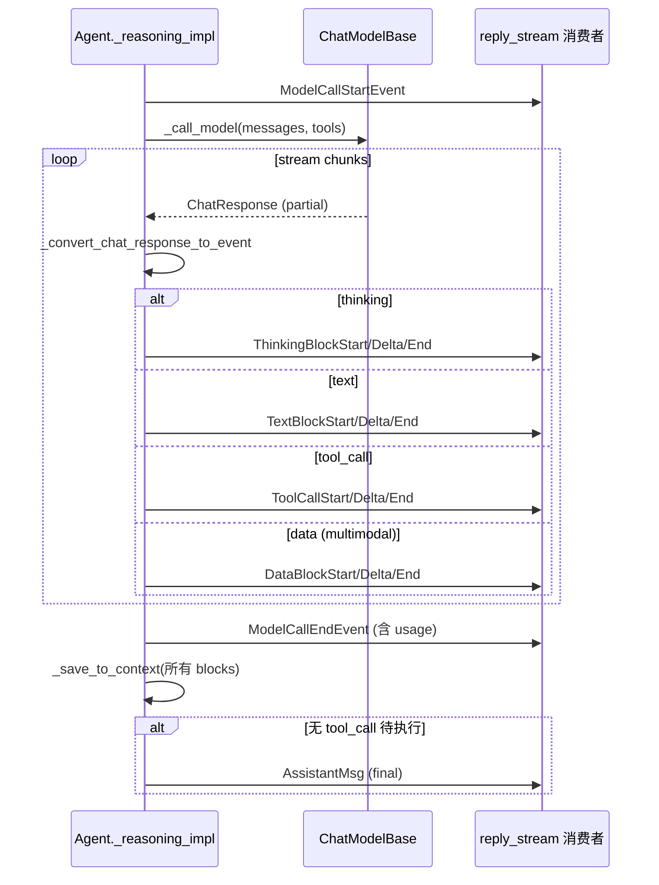
```mermaid
sequenceDiagram
    participant A as Agent._reasoning_impl
    participant Model as ChatModelBase
    participant UI as reply_stream 消费者

    A->>UI: ModelCallStartEvent
    A->>Model: _call_model(messages, tools)
    
    loop stream chunks
        Model-->>A: ChatResponse (partial)
        A->>A: _convert_chat_response_to_event
        alt thinking
            A->>UI: ThinkingBlockStart/Delta/End
        else text
            A->>UI: TextBlockStart/Delta/End
        else tool_call
            A->>UI: ToolCallStart/Delta/End
        else data (multimodal)
            A->>UI: DataBlockStart/Delta/End
        end
    end

    A->>UI: ModelCallEndEvent (含 usage)
    A->>A: _save_to_context(所有 blocks)
    alt 无 tool_call 待执行
        A->>UI: AssistantMsg (final)
    end
```

---

## 5. Model 模块设计

### 5.1 类层次与职责

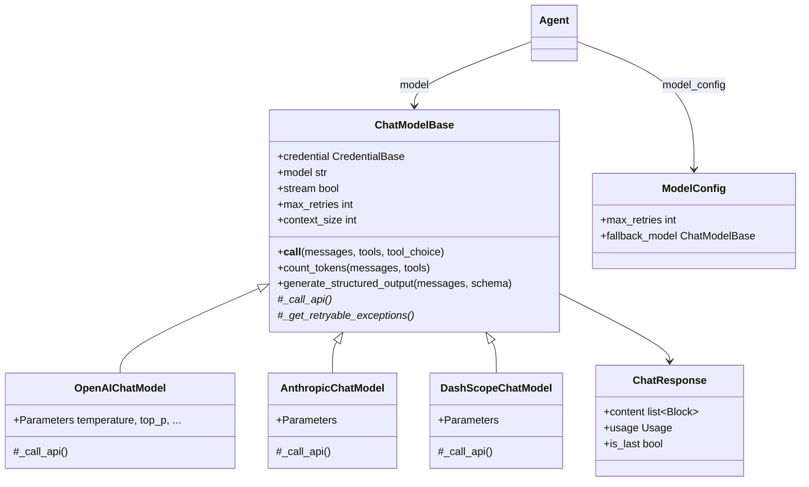
```mermaid
classDiagram
    class ChatModelBase {
        +credential CredentialBase
        +model str
        +stream bool
        +max_retries int
        +context_size int
        +__call__(messages, tools, tool_choice)
        +count_tokens(messages, tools)
        +generate_structured_output(messages, schema)
        #_call_api()*
        #_get_retryable_exceptions()*
    }

    class OpenAIChatModel {
        +Parameters temperature, top_p, ...
        #_call_api()
    }

    class AnthropicChatModel {
        +Parameters
        #_call_api()
    }

    class DashScopeChatModel {
        +Parameters
        #_call_api()
    }

    class ModelConfig {
        +max_retries int
        +fallback_model ChatModelBase
    }

    class ChatResponse {
        +content list~Block~
        +usage Usage
        +is_last bool
    }

    ChatModelBase <|-- OpenAIChatModel
    ChatModelBase <|-- AnthropicChatModel
    ChatModelBase <|-- DashScopeChatModel
    ChatModelBase --> ChatResponse
    Agent --> ChatModelBase : model
    Agent --> ModelConfig : model_config
```

**位置**: `src/agentscope/model/_base.py`、各 provider 子模块、`model/_models/*.yaml`

### 5.2 `ChatModelBase` 核心 API

| 方法 | 用途 | 调用方 |
|------|------|--------|
| `__call__(messages, tools, tool_choice)` | 聊天补全（流式或非流式） | `Agent._call_model` |
| `count_tokens(messages, tools)` | 估算 token（压缩触发） | `compress_context` |
| `generate_structured_output(messages, structured_model)` | 结构化 JSON 输出 | `compress_context`（SummarySchema） |
| `list_models()` | 从 `_models/*.yaml` 加载 ModelCard | CLI / 配置 UI |
| `_call_api(...)` | 子类实现的具体 API 调用 | 内部 |
| `_get_retryable_exceptions()` | 可重试异常类型 | `__call__` 重试循环 |

### 5.3 模型调用与重试时序

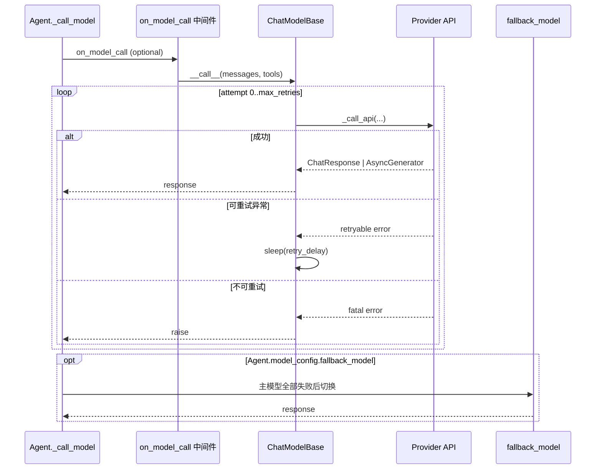
```mermaid
sequenceDiagram
    participant A as Agent._call_model
    participant MW as on_model_call 中间件
    participant M as ChatModelBase
    participant API as Provider API
    participant FB as fallback_model

    A->>MW: on_model_call (optional)
    MW->>M: __call__(messages, tools)

    loop attempt 0..max_retries
        M->>API: _call_api(...)
        alt 成功
            API-->>M: ChatResponse | AsyncGenerator
            M-->>A: response
        else 可重试异常
            API-->>M: retryable error
            M->>M: sleep(retry_delay)
        else 不可重试
            API-->>M: fatal error
            M-->>A: raise
        end
    end

    opt Agent.model_config.fallback_model
        A->>FB: 主模型全部失败后切换
        FB-->>A: response
    end
```

### 5.4 流式 vs 非流式

```python
# Agent._reasoning_impl 内
res = await self._call_model(tool_choice=tool_choice, **kwargs)

if inspect.isasyncgen(res):
    async for chunk in res:
        if chunk.is_last:
            completed_response = chunk
        else:
            async for evt in self._convert_chat_response_to_event(block_ids, chunk):
                yield evt
elif isinstance(res, ChatResponse):
    completed_response = res
    async for evt in self._convert_chat_response_to_event(block_ids, res):
        yield evt
```

- `stream=True`（默认）：`__call__` 返回 `AsyncGenerator[ChatResponse]`
- 每个 `ChatResponse` chunk 含增量 `content` blocks；`is_last=True` 的 chunk 携带完整 `usage`

### 5.5 Credential 与 ModelCard

| 组件 | 位置 | 说明 |
|------|------|------|
| `CredentialBase` | `credential/` | API Key / OAuth 等 |
| `ModelCard` | `model/_model_card.py` | 从 YAML 描述模型能力（vision、context_size 等） |
| `Parameters` | 各 Model 内部类 | Pydantic 参数（temperature、top_p 等） |

### 5.6 Provider 一览

| 实现类 | 文件 | 典型模型 |
|--------|------|----------|
| `OpenAIChatModel` | `model/_openai.py` | gpt-4o, o-series |
| `AnthropicChatModel` | `model/_anthropic.py` | claude-sonnet-4, claude-opus-4 |
| `DashScopeChatModel` | `model/_dashscope.py` | qwen-max, qwen-plus |
| `GeminiChatModel` | `model/_gemini.py` | gemini-2.5-flash |
| `DeepSeekChatModel` | `model/_deepseek.py` | deepseek-chat |
| `OllamaChatModel` | `model/_ollama.py` | 本地模型 |
| `MoonshotChatModel` | `model/_moonshot.py` | moonshot-v1 |
| `XAIChatModel` | `model/_xai.py` | grok |

---

## 6. Memory 在循环中的位置

### 6.1 数据流

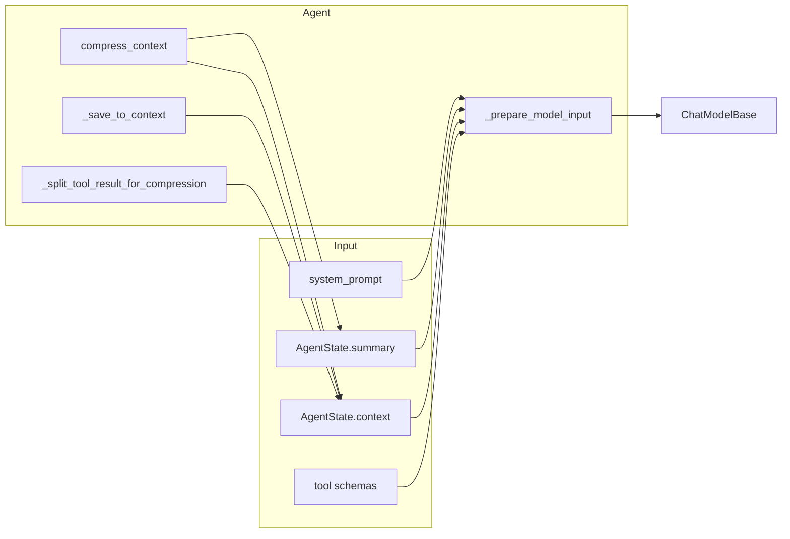
```mermaid
graph LR
    subgraph Input
        SP[system_prompt]
        SUM[AgentState.summary]
        CTX[AgentState.context]
        TOOLS[tool schemas]
    end

    subgraph Agent
        PREP[_prepare_model_input]
        COMP[compress_context]
        SAVE[_save_to_context]
        TRUNC[_split_tool_result_for_compression]
    end

    SP --> PREP
    SUM --> PREP
    CTX --> PREP
    TOOLS --> PREP
    PREP --> Model[ChatModelBase]
    COMP --> SUM
    COMP --> CTX
    SAVE --> CTX
    TRUNC --> CTX
```

### 6.2 压缩触发时序

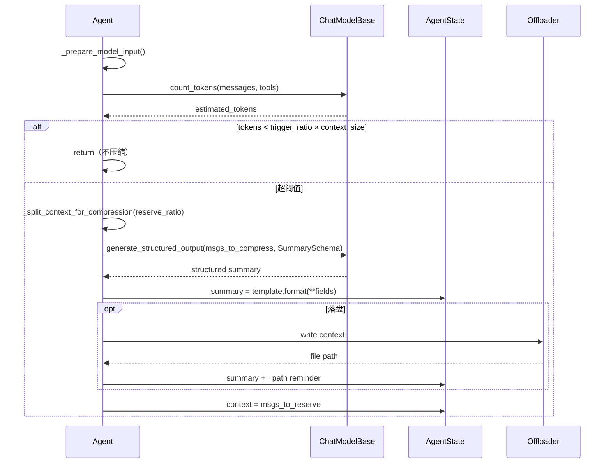
```mermaid
sequenceDiagram
    participant A as Agent
    participant Model as ChatModelBase
    participant S as AgentState
    participant OFL as Offloader

    A->>A: _prepare_model_input()
    A->>Model: count_tokens(messages, tools)
    Model-->>A: estimated_tokens

    alt tokens < trigger_ratio × context_size
        A->>A: return（不压缩）
    else 超阈值
        A->>A: _split_context_for_compression(reserve_ratio)
        A->>Model: generate_structured_output(msgs_to_compress, SummarySchema)
        Model-->>A: structured summary
        A->>S: summary = template.format(**fields)
        opt 落盘
            A->>OFL: write context
            OFL-->>A: file path
            A->>S: summary += path reminder
        end
        A->>S: context = msgs_to_reserve
    end
```

完整算法见 [§4 Memory](#第4章memory-记忆系统v2-源码级完整)。

---

## 7. Tool / MCP / Permission 时序

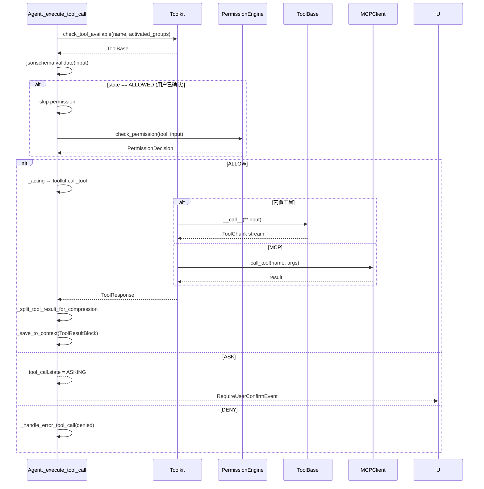
```mermaid
sequenceDiagram
    participant A as Agent._execute_tool_call
    participant TK as Toolkit
    participant PE as PermissionEngine
    participant Tool as ToolBase
    participant MCP as MCPClient

    A->>TK: check_tool_available(name, activated_groups)
    TK-->>A: ToolBase
    A->>A: jsonschema.validate(input)

    alt state == ALLOWED (用户已确认)
        A->>A: skip permission
    else
        A->>PE: check_permission(tool, input)
        PE-->>A: PermissionDecision
    end

    alt ALLOW
        A->>A: _acting → toolkit.call_tool
        alt 内置工具
            TK->>Tool: __call__(**input)
            Tool-->>TK: ToolChunk stream
        else MCP
            TK->>MCP: call_tool(name, args)
            MCP-->>TK: result
        end
        TK-->>A: ToolResponse
        A->>A: _split_tool_result_for_compression
        A->>A: _save_to_context(ToolResultBlock)
    else ASK
        A-->>A: tool_call.state = ASKING
        A-->>U: RequireUserConfirmEvent
    else DENY
        A->>A: _handle_error_tool_call(denied)
    end
```

**要点**：
- 工具通过构造 `Toolkit(tools=[...], mcps=[...], tool_groups=[...])` 注册，**非** `register_tool_function`
- MCP 工具名：`mcp__{client_name}__{tool_name}`
- 权限模式：`DEFAULT` / `EXPLORE` / `ACCEPT_EDITS` / `BYPASS` / `DONT_ASK`

---

## 8. Middleware 拦截链

```mermaid
graph TB
    subgraph reply["on_reply 链"]
        R1[MW[0].on_reply] --> R2[MW[1].on_reply] --> RIMPL[_reply_impl]
    end

    subgraph reasoning["on_reasoning 链"]
        RE1[MW[0].on_reasoning] --> RE2[...] --> REIMPL[_reasoning_impl]
    end

    subgraph model["on_model_call 链"]
        M1[MW[0].on_model_call] --> M2[...] --> MCALL[_call_model]
    end

    subgraph acting["on_acting 链"]
        A1[MW[0].on_acting] --> A2[...] --> AIMPL[_acting_impl]
    end

    subgraph compress["on_compress_context 链"]
        C1[MW[0].on_compress_context] --> CIMPL[_compress_context_impl]
    end

    subgraph sysprompt["on_system_prompt 管道"]
        S1[MW[0].on_system_prompt] --> S2[...] --> SPROMPT[_get_system_prompt]
    end

    RIMPL --> REASONING[_reasoning]
    REASONING --> MCALL
    REASONING --> ACTING[_acting]
    REASONING --> COMPRESS[compress_context]
```

| 钩子 | 模式 | 可 yield 事件 |
|------|------|--------------|
| `on_reply` | 洋葱 | ✅ |
| `on_reasoning` | 洋葱 | ✅ |
| `on_acting` | 洋葱 | ✅ |
| `on_model_call` | 洋葱 | ✅ |
| `on_compress_context` | 洋葱 | ❌（async 完成） |
| `on_system_prompt` | 管道 | ❌（返回 str） |

---

## 9. 多智能体编排（v0.x 参考）

v2 main **无** `pipeline/`。应用层手动编排：

```python
# 顺序
plan = await planner.reply(msg)
result = await executor.reply(plan)

# 并行（各 Agent 独立 AgentState）
results = await asyncio.gather(*[a.reply(msg) for a in experts])
```

v0.x 参考（详见 [PART1 §3](#第3章pipeline-多智能体编排v0x-参考)）：

| 组件 | 模式 |
|------|------|
| `MsgHub` | `async with` + subscriber 自动 observe |
| `SequentialPipeline` | A→B→C 顺序 |
| `FanoutPipeline` | 同一消息并行 fan-out |
| `ChatRoom` | RealtimeAgent 语音房间 |

---

## 10. 会话持久化

### v2（main）

```python
# 保存
state_json = agent.state.model_dump_json()

# 恢复
agent = Agent(..., state=AgentState.model_validate_json(state_json))
```

### v0.x（未迁移）

`JSONSession` / `RedisSession` 通过 `StateModule.state_dict()` 持久化 memory/toolkit。

---

## 11. 端到端场景对照

| 场景 | v2 推荐组件 | 主流程 |
|------|-------------|--------|
| 单助手 + 工具 | `Agent` + `Toolkit` | `reply(UserMsg)` → ReAct 循环 |
| 单助手 + MCP | `Agent` + `Toolkit(mcps=[...])` | MCP connect → reply |
| 需用户确认危险操作 | `PermissionEngine` ASK 模式 | `RequireUserConfirmEvent` → `UserConfirmResultEvent` → 继续 reply |
| 外部执行工具 | `is_external_tool=True` | `RequireExternalExecutionEvent` → `ExternalExecutionResultEvent` |
| 长对话防溢出 | `ContextConfig` + `Offloader` | 每次 reasoning 前 `compress_context` |
| 流式 UI | `reply_stream` | 消费 `AgentEvent` |
| 多 Agent 文本讨论 | 应用层 `asyncio` + 独立 `AgentState` | 或 v0.x `MsgHub` |
| 可恢复会话 | `AgentState.model_dump_json` | 自建存储 |
| 实时语音 | v0.x `RealtimeAgent` + `ChatRoom` | 见 [REALTIME_AGENT_ARCHITECTURE.md](./REALTIME_AGENT_ARCHITECTURE.md) |

---

## 12. 与官方教程的关系

| 文档 | 用途 |
|------|------|
| **本文** | 流程 + 时序 + 模型模块设计（本地维护） |
| PART1–3 | 各子系统源码级详解 |
| `docs/tutorial/` | Sphinx 教程 → https://doc.agentscope.io/ |

**阅读顺序**：**FLOW（本文）→ PART1 → PART2 → PART3**

---

## 13. 与竞品框架对比（原 OVERVIEW §6）

> 合并自原 `AgentScope_ARCHITECTURE_OVERVIEW.md` §6（2026-08-05）。子 Agent / LTM 对比见 [AGENT_AND_LTM_ANALYSIS.md §6](./AGENT_AND_LTM_ANALYSIS.md#第6章与竞品对比)。

### 13.1 架构对比

| 特性 | AgentScope | OpenHands | OpenHarness | hermes-agent |
|------|-----------|-----------|-------------|--------------|
| **核心循环** | ReAct (`reply`) | ReAct (Controller+Agent) | ReAct (QueryEngine) | ReAct (AIAgent) |
| **沙箱** | ❌ 无内置 | ✅ Docker/K8s | ✅ srt (bubblewrap) | subprocess |
| **多Agent** | ✅ MsgHub编排 | ✅ Delegation机制 | ✅ Coordinator-Worker | ✅ Subagents |
| **Memory** | Working + Long-Term | ConversationMemory + Condenser | 4-Layer Model | File-based |
| **Tools** | Toolkit (统一接口) | Event-driven Actions | Tool Registry | Tool Functions |
| **Skills** | ✅ anthropics/skills | ❌ | ✅ anthropics/skills | ✅ Skills |
| **MCP** | ✅ 内置支持 | ✅ 内置支持 | ❌ | ✅ 内置支持 |
| **前端** | ❌ 仅SDK | ✅ React SPA + Textual TUI | Textual TUI | CLI |
| **特色功能** | Realtime Voice · Agentic RL · A2A | 企业级RBAC · 多租户 | Harness测试框架 | Delegation模式 |
| **开源协议** | Apache 2.0 | MIT | MIT | MIT |

### 13.2 技术亮点与适用场景

**AgentScope 优势**：极简 API、Realtime Voice、Agentic RL、A2A、多 Provider、中文文档完善。

**AgentScope 劣势**：无内置沙箱、无 Web UI、企业功能（RBAC/多租户）较弱。

| 选型 | 倾向 |
|------|------|
| AgentScope | 快速原型、Realtime Voice、Agentic RL、只需 SDK |
| OpenHands | Web GUI、Docker 沙箱、企业部署、复杂软件工程 |
| OpenHarness | Harness 评测、Benchmark、轻量 TUI |

---

**文档版本**: 2.2（2026-08-05，§13 竞品对比自 OVERVIEW 并入）  
**最后更新**: 2026-08-05

---


<!-- ===== Part 1 — Agent/Memory/Pipeline ===== -->

> **版本**: 2.1（源码级完整版，非摘要）  
> **分析时间**: 2026-05-17（全面扩写 2026-06-01）  
> **分析方法**: 对照 `src/agentscope/` 源码逐行阅读  
> **流程总览**: [总体流程])

> **API 约定**：AgentScope v2 为 **全异步**。调用 Agent 使用 `await agent.reply(msg)` 或 `async for event in agent.reply_stream(msg)`。v2 中统一 `Agent` 类替代 v0.x 的 `AgentBase` + `ReActAgent`；`memory/`、`pipeline/`、`session/`、`rag/`、`plan/`、`a2a/` 子包在 **main 分支尚未迁移**（实现见 `origin/v1` 或官方历史版本）。本文 **第 2、4 章** 以 v2 源码为准；**第 3 章** 保留 v0.x Pipeline 完整设计供多 Agent 场景参考。

---

## 📋 目录

- [第1章：项目概览与核心架构](#第1章项目概览与核心架构)
- [第2章：Agent 核心系统（v2 源码级）](#第2章agent-核心系统v2-源码级)
  - [2.1 统一 `Agent` 类](#21-统一-agent-类)
  - [2.2 `AgentState` 状态模型](#22-agentstate-状态模型)
  - [2.3 `reply()` / `reply_stream()` 完整流程](#23-reply--reply_stream-完整流程)
  - [2.4 `_check_next_action` 与 ReAct 分支](#24-_check_next_action-与-react-分支)
  - [2.5 Middleware 中间件（6 钩子）](#25-middleware-中间件6-钩子)
  - [2.6 PermissionEngine 权限引擎](#26-permissionengine-权限引擎)
  - [2.7 配置类：`ModelConfig` / `ReActConfig` / `ContextConfig`](#27-配置类modelconfig--reactconfig--contextconfig)
  - [2.8 流式事件体系](#28-流式事件体系)
  - [2.9 附录：v0.x `ReActAgent` / `RealtimeAgent` / `UserAgent`](#29-附录v0x-reactagent--realtimeagent--useragent)
- [第3章：Pipeline 多智能体编排（v0.x 参考）](#第3章pipeline-多智能体编排v0x-参考)
- [第4章：Memory 记忆系统（v2 源码级完整）](#第4章memory-记忆系统v2-源码级完整)

---

## 第1章：项目概览与核心架构

### 1.1 项目定位

**AgentScope** 是阿里巴巴达摩院开源的智能体开发框架。v2.0.0 已完成核心异步化重构，统一 `Agent` 类承载 ReAct 循环、上下文压缩、权限与中间件；部分 v0.x 子系统尚未迁移到 main：

| 能力 | v2 main 状态 | 说明 |
|------|-------------|------|
| 统一 `Agent` + ReAct 循环 | ✅ | `agent/_agent.py`，~2500 行 |
| `Toolkit` + MCP + Skill | ✅ | `tool/` + `mcp/` + `skill/` |
| `PermissionEngine` | ✅ | ALLOW / ASK / DENY + 5 种模式 |
| `Middleware` | ✅ | 6 钩子（含 `on_compress_context`） |
| `ContextConfig` 压缩 + `Offloader` | ✅ | 内建于 `AgentState` |
| `AgentEvent` 流式事件 | ✅ | 17+ 事件类型 |
| Multi-Agent Pipeline | ❌ 未迁移 | MsgHub / FanoutPipeline 见 §3 |
| `MemoryBase` / LTM | ❌ 未迁移 | 由 `AgentState.context/summary` 替代 |
| RAG / Plan / A2A | ❌ 未迁移 | 见 PART2 |
| `JSONSession` / Tracing / `init()` | ❌ 未迁移 | 见 PART3 §11 |

---

### 1.2 核心模块架构

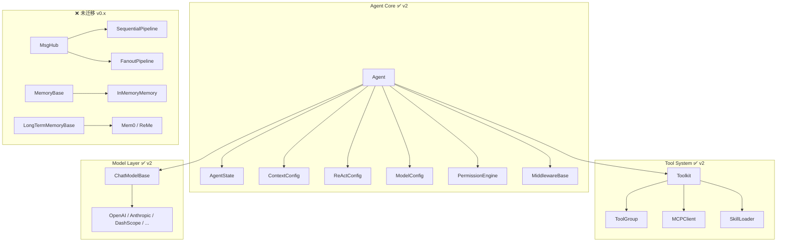
```mermaid
graph TB
    subgraph "Agent Core ✅ v2"
        A[Agent] --> AS[AgentState]
        A --> CC[ContextConfig]
        A --> RC[ReActConfig]
        A --> MC[ModelConfig]
        A --> PE[PermissionEngine]
        A --> MW[MiddlewareBase]
    end

    subgraph "Tool System ✅ v2"
        N[Toolkit] --> TG[ToolGroup]
        N --> MCP[MCPClient]
        N --> SK[SkillLoader]
    end

    subgraph "Model Layer ✅ v2"
        R[ChatModelBase] --> S[OpenAI / Anthropic / DashScope / ...]
    end

    subgraph "❌ 未迁移 v0.x"
        E[MsgHub] --> G[SequentialPipeline]
        E --> H[FanoutPipeline]
        I[MemoryBase] --> J[InMemoryMemory]
        K[LongTermMemoryBase] --> L[Mem0 / ReMe]
    end

    A --> N
    A --> R
```

---

### 1.3 关键组件关系

| 组件 | 位置 | v2 状态 | 职责 |
|------|------|---------|------|
| `Agent` | `agent/_agent.py` | ✅ | 统一 Agent：reply / reasoning / acting / compress |
| `AgentState` | `state/_state.py` | ✅ | context / summary / permission / tool / tasks |
| `ContextConfig` | `agent/_config.py` | ✅ | 压缩阈值、摘要 schema、tool result 上限 |
| `ReActConfig` | `agent/_config.py` | ✅ | `max_iters`、`stop_on_reject` |
| `ModelConfig` | `agent/_config.py` | ✅ | `fallback_model`、`max_retries` |
| `MiddlewareBase` | `middleware/_base.py` | ✅ | 洋葱式拦截 reply/reasoning/acting/model_call |
| `PermissionEngine` | `permission/_engine.py` | ✅ | 工具执行权限决策 |
| `Toolkit` | `tool/_toolkit.py` | ✅ | ToolGroup + MCP + Skill + `call_tool` |
| `ChatModelBase` | `model/_base.py` | ✅ | 聊天模型抽象 + `count_tokens` |
| `Offloader` | `workspace/_offload_protocol.py` | ✅ | 压缩 context / 截断 tool result 落盘 |
| `MsgHub` | `pipeline/`（v0.x） | ❌ | 多 Agent 订阅广播 |
| `MemoryBase` | `memory/`（v0.x） | ❌ | 工作记忆（v2 由 `AgentState.context` 替代） |

---

### 1.4 数据流转全景图

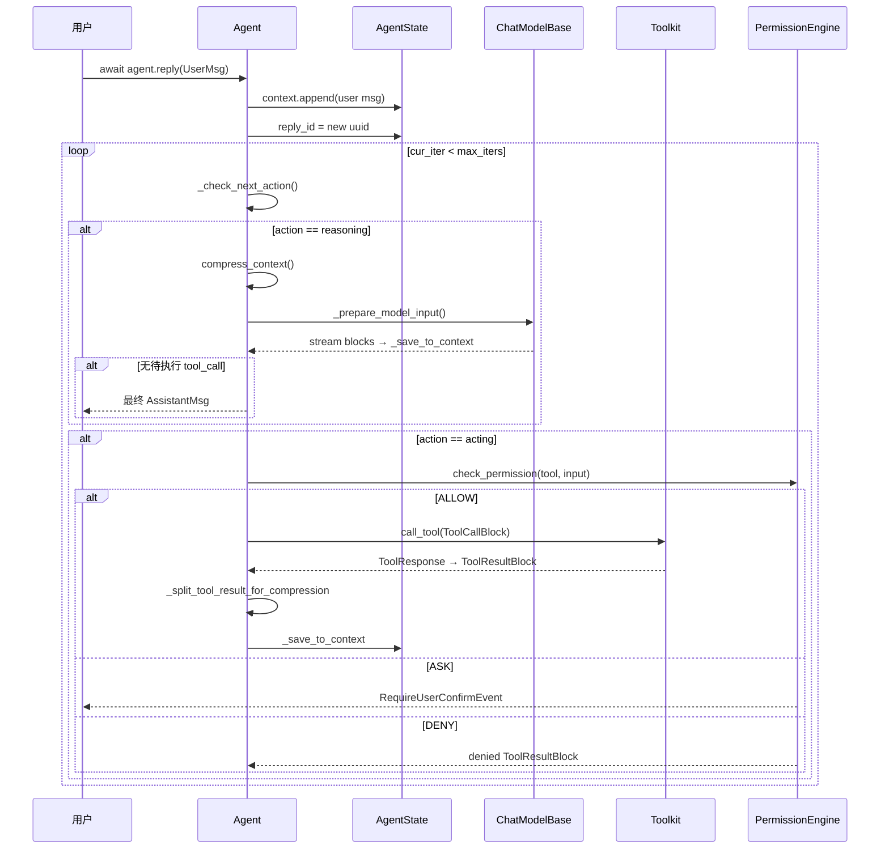
```mermaid
sequenceDiagram
    participant User as 用户
    participant Agent as Agent
    participant State as AgentState
    participant Model as ChatModelBase
    participant Tool as Toolkit
    participant Perm as PermissionEngine

    User->>Agent: await agent.reply(UserMsg)
    Agent->>State: context.append(user msg)
    Agent->>State: reply_id = new uuid

    loop cur_iter < max_iters
        Agent->>Agent: _check_next_action()
        alt action == reasoning
            Agent->>Agent: compress_context()
            Agent->>Model: _prepare_model_input()
            Model-->>Agent: stream blocks → _save_to_context
            alt 无待执行 tool_call
                Agent-->>User: 最终 AssistantMsg
            end
        end
        alt action == acting
            Agent->>Perm: check_permission(tool, input)
            alt ALLOW
                Agent->>Tool: call_tool(ToolCallBlock)
                Tool-->>Agent: ToolResponse → ToolResultBlock
                Agent->>Agent: _split_tool_result_for_compression
                Agent->>State: _save_to_context
            else ASK
                Perm-->>User: RequireUserConfirmEvent
            else DENY
                Perm-->>Agent: denied ToolResultBlock
            end
        end
    end
```

---

## 第2章：Agent 核心系统（v2 源码级）

### 2.1 统一 `Agent` 类

**位置**: `src/agentscope/agent/_agent.py`（约 2500 行）

v2 **不再**区分 `AgentBase` / `ReActAgent`。所有 ReAct 逻辑内建于单一 `Agent` 类。

```python
class Agent:
    def __init__(
        self,
        name: str,
        system_prompt: str,
        model: ChatModelBase,
        toolkit: Toolkit | None = None,
        middlewares: list[MiddlewareBase] | None = None,
        state: AgentState | None = None,
        offloader: Offloader | None = None,
        model_config: ModelConfig = ModelConfig(),
        context_config: ContextConfig = ContextConfig(),
        react_config: ReActConfig = ReActConfig(),
    ) -> None:
        self.name = name
        self._system_prompt = system_prompt
        self.model = model
        self.state = state or AgentState()
        self.model_config = model_config
        self.context_config = context_config
        self.react_config = react_config
        self._engine = PermissionEngine(self.state.permission_context)
        self.offloader = offloader
        self.toolkit = toolkit or Toolkit()
        # 按实现的钩子预过滤 middleware 列表（6 组）
        self._reply_middlewares = [...]
        self._reasoning_middlewares = [...]
        self._acting_middlewares = [...]
        self._model_call_middlewares = [...]
        self._system_prompt_middlewares = [...]
        self._compress_context_middlewares = [...]
```

**与 v0.x 的关键差异**：

| v0.x | v2 |
|------|-----|
| `sys_prompt` 参数 | `system_prompt` |
| 独立 `formatter: FormatterBase` | 模型直接消费 `Msg` 列表 |
| 独立 `memory: MemoryBase` | `AgentState.context` + `summary` |
| `ReActAgent(max_iters=10)` | `react_config=ReActConfig(max_iters=20)` |
| Hook（`pre_reasoning` 等） | `MiddlewareBase` 洋葱链 |
| `await agent(msg)` 经 `__call__` | 直接 `await agent.reply(msg)` |

**公开 API**：

| 方法 | 签名 | 说明 |
|------|------|------|
| `reply` | `async def reply(inputs) -> Msg` | 消费全部流式事件，返回最终 `AssistantMsg` |
| `reply_stream` | `async def reply_stream(inputs) -> AsyncGenerator[AgentEvent]` | 流式产出事件（不含最终 `Msg` 以外的中间态需自行处理） |
| `observe` | `async def observe(msgs) -> None` | 将外部观察写入 `context`（不产生回复） |
| `compress_context` | `async def compress_context(cfg?) -> None` | 手动触发压缩（通常由 reasoning 前自动调用） |

**`inputs` 联合类型**（`reply` / `reply_stream` 均支持）：

```python
inputs: Msg
      | list[Msg]
      | UserConfirmResultEvent      # 用户确认 ASK 工具后继续
      | ExternalExecutionResultEvent  # 外部执行工具后继续
      | None                          # 从当前状态继续（无新输入）
```

---

### 2.2 `AgentState` 状态模型

**位置**: `src/agentscope/state/_state.py`

```python
class AgentState(BaseModel):
    session_id: str = Field(default_factory=lambda: uuid.uuid4().hex)
    summary: str | list[TextBlock | DataBlock] = ""
    context: list[Msg] = []
    reply_id: str = ""
    cur_iter: int = 0
    permission_context: PermissionContext = Field(default_factory=PermissionContext)
    tool_context: ToolContext = Field(default_factory=ToolContext)
    tasks_context: TaskContext = Field(default_factory=TaskContext)
```

#### `context` 写入规则

| 来源 | 写入路径 |
|------|----------|
| 用户输入 | `_handle_incoming_messages` → `context.append(msg)` |
| 模型流式输出 | `_save_to_context` → 追加到 `reply_id` 对应的 `AssistantMsg.content` |
| 工具结果 | acting 完成后 `_save_to_context([ToolResultBlock])` |

**同一 `reply` 周期**：新建或扩展的 `AssistantMsg.id == state.reply_id`，与流式事件 `reply_id` 一致。

**输入限制**（`_handle_incoming_messages`）：
- 仅接受 `role` 为 `user` 或 `assistant` 的 `Msg`
- 不得含 `tool_call` / `tool_result` / `thinking` 块（这些由 Agent 内部生成）

#### `ToolContext`

```python
class ToolContext(BaseModel):
    max_cache_files: int = 100
    max_cache_bytes: float = 25000   # KB
    read_file_cache: list[ReadCacheEntry] = []
    activated_groups: list[str] = []
```

- **`read_file_cache`**：Read 工具 LRU 缓存，按文件 `mtime` 校验有效性
- **`activated_groups`**：当前激活的工具组名列表
- 压缩完成后 `_clear_unreserved_read_cache` 删除 reserved context 未引用的 Read 路径缓存

#### 序列化

```python
json_str = agent.state.model_dump_json()
restored = AgentState.model_validate_json(json_str)
agent = Agent(..., state=restored)
```

`Msg` 嵌套在 `context` 内一并序列化。若使用 `Offloader`，迁移会话时需同步拷贝 workspace 目录。

---

### 2.3 `reply()` / `reply_stream()` 完整流程

**入口链**：`reply()` → `_reply()`（可被 `on_reply` 中间件包裹）→ `_reply_impl()`

#### `_reply_impl` 四步结构

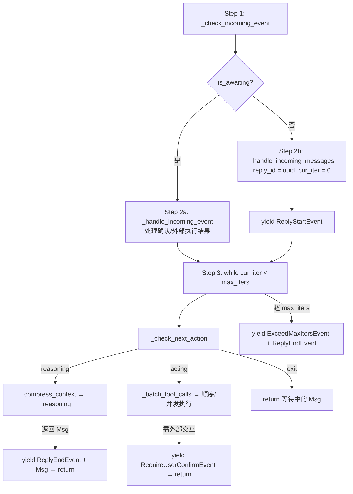
```mermaid
flowchart TD
    A[Step 1: _check_incoming_event] --> B{is_awaiting?}
    B -->|是| C[Step 2a: _handle_incoming_event<br/>处理确认/外部执行结果]
    B -->|否| D[Step 2b: _handle_incoming_messages<br/>reply_id = uuid, cur_iter = 0]
    D --> E[yield ReplyStartEvent]
    C --> F[Step 3: while cur_iter < max_iters]
    E --> F
    F --> G[_check_next_action]
    G -->|reasoning| H[compress_context → _reasoning]
    H -->|返回 Msg| I[yield ReplyEndEvent + Msg → return]
    G -->|acting| J[_batch_tool_calls → 顺序/并发执行]
    J -->|需外部交互| K[yield RequireUserConfirmEvent → return]
    G -->|exit| L[return 等待中的 Msg]
    F -->|超 max_iters| M[yield ExceedMaxItersEvent + ReplyEndEvent]
```

**Step 3 循环体源码逻辑**（`agent/_agent.py` L595–670）：

```python
while self.state.cur_iter < self.react_config.max_iters:
    action, data = self._check_next_action()
    if action == "exit" and isinstance(data, Msg):
        yield data
        return

    if action == "reasoning":
        await self.compress_context()
        async for evt in self._reasoning():
            if isinstance(evt, Msg):
                yield ReplyEndEvent(...)
                yield evt
                return
            yield evt

    for batch in await self._batch_tool_calls():
        if batch.type == "sequential":
            evt_generator = self._execute_sequential_tool_calls(batch.tool_calls)
        elif batch.type == "concurrent":
            evt_generator = self._execute_concurrent_tool_calls(batch.tool_calls)
        # ... 处理 RequireUserConfirmEvent / RequireExternalExecutionEvent
    self.state.cur_iter += 1
```

**`_prepare_model_input()`**（LLM 输入组装）：

```python
messages = [SystemMsg(content=await self._get_system_prompt())]
if self.state.summary:
    messages.append(UserMsg(name="user", content=self.state.summary))
messages.extend(self.state.context)
tools = await self.toolkit.get_tool_schemas(
    groups=self.state.tool_context.activated_groups or None,
)
return {"messages": messages, "tools": tools}
```

`on_system_prompt` 中间件可修改 system 内容；**不会**自动修改 `summary` 或 `context`。

---

### 2.4 `_check_next_action` 与 ReAct 分支

**位置**: `agent/_agent.py` L2240

Agent 根据最后一条 `AssistantMsg` 中 **未完成** 的 `ToolCallBlock` 状态决定下一步：

| ToolCallBlock.state | 含义 |
|---------------------|------|
| `PENDING` / `ALLOWED` | 可执行 |
| `ASKING` | 等待用户确认（`RequireUserConfirmEvent` 已发出） |
| `SUBMITTED` | 等待外部执行结果 |
| 已有对应 `tool_result` | 已完成，不再处理 |

**决策表**（源码 docstring）：

| | 有待执行 tool_call | 无待执行 tool_call |
|--|-------------------|-------------------|
| **有可执行 tool_call** | `acting` | `acting` |
| **无可执行 tool_call** | `exit`（等待外部事件） | `reasoning` |

```python
def _check_next_action(self) -> (
    tuple[Literal["exit"], Msg]
    | tuple[Literal["reasoning"], None]
    | tuple[Literal["acting"], None]
):
    last_msg = self._get_last_msg()
    if last_msg is None:
        return "reasoning", None
    # 过滤已有 tool_result 的 tool_call
    unfinished_tool_calls = [...]
    executable = [tc for tc in unfinished if tc.state in (PENDING, ALLOWED)]
    awaiting = [tc for tc in unfinished if tc.state in (ASKING, SUBMITTED)]
    if executable:
        return "acting", None
    if awaiting:
        return "exit", waiting_msg
    return "reasoning", None
```

**工具批处理**（`_batch_tool_calls`）：将待执行 tool_call 分为 `sequential` 与 `concurrent` 批次；同一批次内并发执行使用 `asyncio` gather。

---

### 2.5 Middleware 中间件（6 钩子）

**位置**: `src/agentscope/middleware/_base.py`

中间件采用 **洋葱模式**（onion）：外层 `on_*` 可在 `next_handler()` 前后插入逻辑；`on_system_prompt` 为 **变换器模式**（顺序管道）。

| 钩子 | 拦截点 | 模式 | `input_kwargs` 关键字段 |
|------|--------|------|------------------------|
| `on_reply` | 整个 `_reply_impl` | 洋葱 | `inputs` |
| `on_reasoning` | `_reasoning` 模型推理 | 洋葱 | `tool_choice` |
| `on_acting` | 单次 tool 执行 | 洋葱 | `tool_call` |
| `on_model_call` | 原始模型 API 调用 | 洋葱 | `messages`, `tools` |
| `on_system_prompt` | `_get_system_prompt` | 变换器 | 无（返回修改后的 str） |
| `on_compress_context` | `compress_context` | 洋葱 | `context_config` |

**实现检测**：构造时 `is_implemented(hook_name)` 比较子类是否覆写基类方法；未实现的钩子不参与链。

**示例**（日志中间件）：

```python
class LoggingMiddleware(MiddlewareBase):
    async def on_reasoning(self, agent, input_kwargs, next_handler):
        logger.info("Before reasoning: iter=%d", agent.state.cur_iter)
        async for event in next_handler():
            yield event
        logger.info("After reasoning")

agent = Agent(
    name="Friday",
    system_prompt="...",
    model=model,
    middlewares=[LoggingMiddleware()],
)
```

**注意**：自定义中间件修改 `context` 时勿与内置 `_save_to_context` 冲突；观测用 `on_reply` / `on_reasoning` 只读访问更安全。

---

### 2.6 PermissionEngine 权限引擎

**位置**: `src/agentscope/permission/_engine.py`

每个 `Agent` 构造时创建 `PermissionEngine(self.state.permission_context)`。

#### 三种行为

| `PermissionBehavior` | 效果 |
|---------------------|------|
| `ALLOW` | 直接执行工具 |
| `ASK` | 发出 `RequireUserConfirmEvent`，等待 `UserConfirmResultEvent` |
| `DENY` | 生成 denied `ToolResultBlock`，不调用工具 |

#### 五种模式

| `PermissionMode` | 策略概要 |
|------------------|----------|
| `DEFAULT` | 先查 deny → ask → allow 规则 |
| `EXPLORE` | 读操作宽松，写/执行更严格 |
| `ACCEPT_EDITS` | 自动允许文件编辑类工具 |
| `BYPASS` | 跳过所有检查 |
| `DONT_ASK` | ASK 规则视为 DENY |

#### 规则匹配

```python
engine.add_rule(PermissionRule(
    tool_name="Bash",
    rule_content="git:*",
    behavior=PermissionBehavior.ALLOW,
))
decision = await engine.check_permission(tool, tool_input)
```

匹配策略委托给各 `ToolBase.match_rule`：
- **Bash**：命令子串 / 前缀通配
- **Write/Read/Edit**：文件路径 glob
- **其他**：通用模式或仅工具名级

`ReActConfig.stop_on_reject=True` 时，工具被拒绝后 Agent **停止** reasoning，等待用户介入。

---

### 2.7 配置类：`ModelConfig` / `ReActConfig` / `ContextConfig`

**位置**: `src/agentscope/agent/_config.py`

#### `ReActConfig`

```python
class ReActConfig(BaseModel):
    max_iters: int = 20          # 单次 reply 内最大 reasoning-acting 轮数
    stop_on_reject: bool = False # 工具被拒后是否停止循环
```

#### `ModelConfig`

```python
class ModelConfig(BaseModel):
    max_retries: int = 0                    # 主模型失败重试次数（0 = 不重试）
    fallback_model: ChatModelBase | None = None  # 失败后的备用模型
```

#### `ContextConfig`（详见第 4 章）

```python
class ContextConfig(BaseModel):
    trigger_ratio: float = 0.8       # 0 < x < 0.9
    reserve_ratio: float = 0.1       # 0 < x < 0.9
    compression_prompt: str = "..."  # 引导 LLM 生成续写摘要
    summary_template: str = "..."      # 格式化 summary 的 Jinja 风格模板
    summary_schema: dict = SummarySchema.model_json_schema()
    tool_result_limit: int = 3000    # 单条 tool result 最大 token
```

#### `SummarySchema`（压缩 LLM 结构化输出）

| 字段 | max_length | 含义 |
|------|------------|------|
| `task_overview` | 300 | 用户核心请求与成功标准 |
| `current_state` | 300 | 已完成工作与产出 |
| `important_discoveries` | 300 | 约束、决策、错误与修复 |
| `next_steps` | 200 | 待办与阻塞 |
| `context_to_preserve` | 300 | 偏好、领域细节、承诺 |

---

### 2.8 流式事件体系

**位置**: `src/agentscope/event/`

`reply_stream()` 产出 `AgentEvent` 子类，供 UI / SSE 实时渲染：

| 事件类 | 触发时机 |
|--------|----------|
| `ReplyStartEvent` / `ReplyEndEvent` | reply 周期起止 |
| `ModelCallStartEvent` / `ModelCallEndEvent` | 模型 API 调用 |
| `ThinkingBlockStart/Delta/EndEvent` | thinking 块流式 |
| `TextBlockStart/Delta/EndEvent` | 文本块流式 |
| `ToolCallStart/Delta/EndEvent` | tool_call 块流式 |
| `ToolResultStart/TextDelta/DataDelta/EndEvent` | tool_result 流式 |
| `RequireUserConfirmEvent` | 权限 ASK |
| `RequireExternalExecutionEvent` | 需外部执行 |
| `ExceedMaxItersEvent` | 超过 `max_iters` |

所有事件的 `reply_id` 与当前 `AssistantMsg.id` 对齐。

---

### 2.9 附录：v0.x `ReActAgent` / `RealtimeAgent` / `UserAgent`

> 以下类在 **v2 main 不存在**，实现位于 `origin/v1` 或历史版本。保留完整说明供迁移与对照。

#### `ReActAgent`（v0.x）

**位置（v0.x）**: `src/agentscope/agent/_react_agent.py`

```python
class ReActAgent(AgentBase):
    async def reply(self, msg, structured_model=None) -> Msg:
        await self.memory.add(msg)
        await self._retrieve_from_long_term_memory(msg)
        await self._retrieve_from_knowledge(msg)
        for _ in range(self.max_iters):
            await self._compress_memory_if_needed()
            msg_reasoning = await self._reasoning(tool_choice)
            await self._acting(...)
```

**v0.x 独有参数**：`long_term_memory`、`knowledge`（RAG）、`compression_config`、`plan_notebook`、`parallel_tool_calls`、`enable_meta_tool`。

#### `RealtimeAgent`（v0.x）

> 完整流程见 **[REALTIME_AGENT_ARCHITECTURE.md](./REALTIME_AGENT_ARCHITECTURE.md)**

- 独立 `StateModule`，**无** `reply()` 接口
- 双 loop：`_forward_loop`（外部→模型）、`_model_response_loop`（模型→外部）
- 配合 `ChatRoom` 实现多 Agent 语音房间

#### `UserAgent`（v0.x）

```python
class UserAgent(AgentBase):
    async def reply(self, x: Msg | None = None) -> Msg:
        # TerminalUserInput / StudioUserInput 获取人类输入
```

用于 MsgHub 多 Agent 对话中的人类角色。

---

## 第3章：Pipeline 多智能体编排（v0.x 参考）

> ⚠️ **迁移状态**：`pipeline/` 子包在 v2 main **尚未迁移**。本章内容基于 v0.x / `origin/v1` 源码，供多 Agent 应用设计参考。v2 当前需应用层自行编排多个 `Agent` 实例。

### 3.1 MsgHub 消息中心

**位置（v0.x）**: `src/agentscope/pipeline/_msghub.py`

`MsgHub` 是 **async 上下文管理器**，通过 Agent 的 **subscriber** 机制实现自动广播：

```python
async with MsgHub(
    participants=[agent_a, agent_b, user],
    announcement=intro_msg,           # 进入时全员 observe
    enable_auto_broadcast=True,       # 某 participant reply 后自动 observe 给他人
) as hub:
    x = await agent_a(user_msg)
    y = await agent_b(x)

await hub.broadcast(msg)  # 手动广播
```

#### Subscriber 机制（v0.x `AgentBase`）

```python
class AgentBase(StateModule):
    _subscribers: dict[str, list[Callable]]

    def reset_subscribers(self, subscribers: list[AgentBase]):
        """MsgHub 进入时注册；退出时 remove_subscribers"""

    async def __call__(self, msg) -> Msg:
        reply_msg = await self.reply(msg)
        await self.print(reply_msg)
        # 自动 notify subscribers → observe(reply_msg)
        return reply_msg
```

**设计要点**：
- ❌ **无** `run()` 循环调度器；由应用层控制「谁何时 `await agent(...)`」
- ✅ `add()` / `delete()` 可动态调整 participants
- ✅ `enable_auto_broadcast=False` 时仅手动 `broadcast`

#### 典型模式：多 Agent 辩论

```python
async with MsgHub(participants=[pro_agent, con_agent, moderator]):
    for round in range(5):
        pro_msg = await pro_agent(debate_topic)
        con_msg = await con_agent(pro_msg)
        summary = await moderator([pro_msg, con_msg])
```

---

### 3.2 ChatRoom（Realtime 多 Agent 房间）

**位置（v0.x）**: `src/agentscope/pipeline/_chat_room.py`

`ChatRoom` **不继承** `MsgHub`，专用于 **`RealtimeAgent`** 语音/实时多模态：

```python
room = ChatRoom(agents=[realtime_a, realtime_b])
await room.start(outgoing_queue)  # 各 agent connect + 事件转发
# 处理 ClientEvents / ServerEvents ...
await room.stop()
```

| 场景 | 推荐编排 |
|------|----------|
| 文本多 Agent | MsgHub + `ReActAgent` / v2 `Agent` |
| 语音多 Agent | ChatRoom + `RealtimeAgent` |

---

### 3.3 SequentialPipeline 顺序执行

**位置（v0.x）**: `src/agentscope/pipeline/_class.py`、`_functional.py`

```python
pipe = SequentialPipeline(agents=[planner, executor, reviewer])
result = await pipe(initial_msg)
# 等价于：
# msg = initial_msg
# for agent in agents:
#     msg = await agent(msg)
```

**应用场景**：规划 → 执行 → 审核；ETL 式多阶段处理。

---

### 3.4 FanoutPipeline 扇出执行

> 旧文档 `ParallelPipeline` 在源码中名为 **`FanoutPipeline`**。

```python
pipe = FanoutPipeline(agents=[expert_a, expert_b, expert_c], enable_gather=True)
results: list[Msg] = await pipe(same_msg)
# enable_gather=False 时顺序执行各 agent
```

**应用场景**：多专家并行作答、投票、多样性候选、辩论备稿。

**v2 替代方案**（无 Pipeline 时）：

```python
results = await asyncio.gather(
    agent_a.reply(msg),
    agent_b.reply(msg),
    agent_c.reply(msg),
)
```

注意：各 Agent 需独立 `AgentState`，避免共享 `context`。

---

### 3.5 Pipeline 函数式 API（v0.x）

```python
from agentscope.pipeline import sequential_pipeline, fanout_pipeline

result = await sequential_pipeline([a, b, c], msg)
results = await fanout_pipeline([a, b, c], msg, enable_gather=True)
```

---

## 第4章：Memory 记忆系统（v2 源码级完整）

> v2 **无** `memory/` 子包。对话与上下文由 **`AgentState`** 承载，**`ContextConfig`** 驱动压缩，可选 **`Offloader`** 落盘被删内容。  
> 配置示例与反模式另见 [MEMORY_SYSTEM.md](./MEMORY_SYSTEM.md) §14–§17。

### 4.1 设计定位

#### 问题定义

v2 将「记忆」收敛为 **Agent 运行时状态**，而非可插拔的 `MemoryBase` 存储层：

1. **`AgentState.context`** — 当前会话完整对话轨迹（`Msg` 列表）
2. **`AgentState.summary`** — 超长时由 LLM 生成的结构化续写摘要
3. **`ContextConfig`** — 压缩触发条件、摘要 schema、tool result 上限
4. **`Offloader`**（可选）— 被移出 context 的内容落盘，路径写回摘要或 tool 提醒

#### 设计目标

- **单一真相源**：LLM 所见 history 即 `system_prompt + summary + context`，无二次转换层
- **压缩保 tool 对完整**：拆分时从尾部保留 token 预算内的消息，且不在 reserved 段留下「孤立的 tool_result」
- **流式友好**：同一 `reply_id` 下 thinking / text / tool_call / tool_result 追加到同一 `AssistantMsg`
- **可观测**：`compress_context` 支持 Middleware 钩子 `on_compress_context`

#### 非目标（v2 当前不提供）

- 跨会话向量记忆（Mem0 / ReMe 等）的内置集成
- 文档 RAG 检索管线（`KnowledgeBase`）
- 框架级 `Session` 持久化（`JSONSession` / `RedisSession`）
- 对话历史的 mark / exclude_mark 过滤（旧版 `MemoryBase` 机制）

---

### 4.2 架构全景

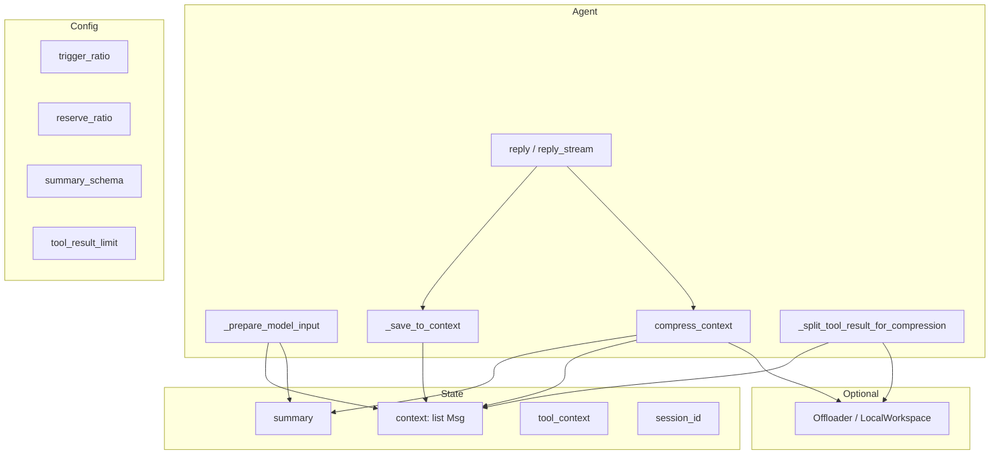
```mermaid
graph TB
    subgraph Agent
        REPLY[reply / reply_stream]
        PREP[_prepare_model_input]
        COMP[compress_context]
        SAVE[_save_to_context]
        TRUNC[_split_tool_result_for_compression]
    end

    subgraph State
        CTX[context: list Msg]
        SUM[summary]
        TC[tool_context]
        SID[session_id]
    end

    subgraph Config
        TR[trigger_ratio]
        RR[reserve_ratio]
        SCH[summary_schema]
        TRL[tool_result_limit]
    end

    subgraph Optional
        OFF[Offloader / LocalWorkspace]
    end

    REPLY --> SAVE --> CTX
    REPLY --> COMP
    COMP --> SUM
    COMP --> CTX
    COMP --> OFF
    TRUNC --> CTX
    TRUNC --> OFF
    PREP --> CTX
    PREP --> SUM
```

| 组件 | 负责 | 不负责 |
|------|------|--------|
| `AgentState.context` | 存对话与 tool 轨迹 | token 计数、压缩决策 |
| `AgentState.summary` | 存压缩摘要文本 | 单独持久化（随 state 一起序列化） |
| `ContextConfig` | 阈值、模板、schema、tool 上限 | 存储 Msg |
| `compress_context()` | 超阈值时 LLM 摘要 + 裁剪 context | 跨会话检索 |
| `Offloader` | 落盘被删/被截断内容 | 自动读回 context |

---

### 4.3 与 v0.x Memory 对比

| 旧版概念 | v2 对应 |
|----------|---------|
| `MemoryBase` / `InMemoryMemory` | `AgentState.context` |
| `ReActAgent.CompressionConfig` | `ContextConfig` |
| `_compressed_summary` + `mark=COMPRESSED` | `AgentState.summary` + 旧消息**物理删除** |
| `memory.get_memory()` → Formatter | `_prepare_model_input()` 直接组装 |
| `JSONSession` 持久化 memory | `AgentState.model_dump_json()` |
| Marks（`HINT` / `COMPRESSED`） | 无；hint 由应用层自行管理 |

#### v0.x `InMemoryMemory` 参考（未迁移）

```python
class InMemoryMemory(MemoryBase):
    def __init__(self):
        self.content: list[tuple[Msg, list[str]]] = []  # (Msg, marks)
        self._compressed_summary: str | None = None

    async def add(self, memories, marks=None, allow_duplicates=False): ...
    async def get_memory(self, mark=None, exclude_mark=None, prepend_summary=True) -> list[Msg]: ...
    async def delete_by_mark(self, mark) -> int: ...
```

v0.x 压缩后旧消息可标记 `COMPRESSED` 仍留在 storage；v2 直接从 `context` 移除。

---

### 4.4 `reply()` 与 Memory 的交互时序

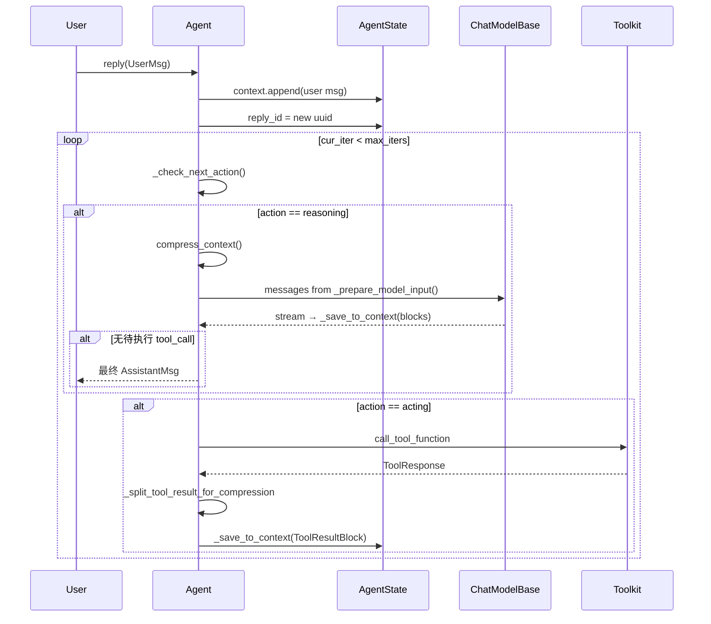
```mermaid
sequenceDiagram
    participant User
    participant Agent
    participant State as AgentState
    participant Model as ChatModelBase
    participant Tool as Toolkit

    User->>Agent: reply(UserMsg)
    Agent->>State: context.append(user msg)
    Agent->>State: reply_id = new uuid

    loop cur_iter < max_iters
        Agent->>Agent: _check_next_action()

        alt action == reasoning
            Agent->>Agent: compress_context()
            Agent->>Model: messages from _prepare_model_input()
            Model-->>Agent: stream → _save_to_context(blocks)

            alt 无待执行 tool_call
                Agent-->>User: 最终 AssistantMsg
            end
        end

        alt action == acting
            Agent->>Tool: call_tool_function
            Tool-->>Agent: ToolResponse
            Agent->>Agent: _split_tool_result_for_compression
            Agent->>State: _save_to_context(ToolResultBlock)
        end
    end
```

**关键点**：
1. 用户消息在循环**前**写入 `context`
2. **每次 reasoning 前**调用 `compress_context()`（非 reply 开头一次性检查）
3. 压缩后旧消息**不再保留**在 `context` 中

---

### 4.5 上下文压缩算法

**入口**: `compress_context()` → `_compress_context_impl()`（可被 `on_compress_context` 中间件包裹）

#### 4.5.1 触发条件

```python
kwargs = await self._prepare_model_input()
estimated_tokens = await self.model.count_tokens(**kwargs)
threshold = cfg.trigger_ratio * self.model.context_size
if estimated_tokens < threshold:
    return  # 不压缩
```

#### 4.5.2 拆分：`_split_context_for_compression`

输入：`to_reserved_tokens = reserve_ratio * context_size`

1. 从 `context` **尾部**向前扫描，找到满足「保留段 token ≥ to_reserved_tokens」的分界 `msg_index`
2. 对分界消息内的 **content blocks** 再细粒度拆分（避免 reserved 段出现无对应 `tool_call` 的 `tool_result`）
3. 返回 `(msgs_to_compress, msgs_to_reserve)`

若 `msgs_to_compress` 为空（`reserve_ratio` 过大），**fallback**：`reserve_ratio → 0` 重试。

#### 4.5.3 生成摘要

1. 组装压缩输入：

```python
messages = [
    SystemMsg(content=await self._get_system_prompt()),
    # 若有旧 summary：
    UserMsg("user", self.state.summary),
    *msgs_to_compress,
    UserMsg("user", cfg.compression_prompt),
]
```

2. 调用 `model.generate_structured_output(..., structured_model=cfg.summary_schema)`
3. 若输入超长导致失败，**逐条丢弃** `msgs_to_compress` 最旧消息直到 token 低于 `context_size * trigger_ratio`，再重试

#### 4.5.4 写回状态

```python
self.state.summary = cfg.summary_template.format(**res.content)

if self.offloader:
    path = await self.offloader.offload_context(self.state.session_id, msgs_to_compress)
    self.state.summary += (
        f"\n<system-reminder>The compressed context is offloaded to "
        f"'{path}', you can refer to it when needed.</system-reminder>"
    )

await self._clear_unreserved_read_cache(msgs_to_reserve)
self.state.context = msgs_to_reserve
```

#### 4.5.5 失败场景

| 条件 | 行为 |
|------|------|
| `context` 为空但 token 仍超阈值 | `RuntimeError`：system prompt（± summary）过长 |
| 压缩 LLM 失败且非 overflow | 异常向上抛出 |
| overflow 且丢弃全部可压缩消息后仍失败 | 异常向上抛出 |

---

### 4.6 工具结果截断

**入口**: acting 完成、`ToolResponse` 转 `ToolResultBlock` 之后

```python
reserved, offload = await self._split_tool_result_for_compression(tool_result)
```

#### 算法概要

1. 对 `tool_result.output` 计 token；若 ≤ `tool_result_limit`，原样保留
2. 否则按 **content block** 从尾部向前找边界；对边界 `TextBlock` 按比例截断文本
3. 返回 `(reserved_block, offload_block | None)`

#### 提醒与卸载

若存在 `offload` 部分，reserved 块末尾追加：

```text
<<<TRUNCATED>>>
<system-reminder>The remaining content has been omitted for limited context.
[ You can refer to the file in '{path}' for the truncated content if needed. ]
</system-reminder>
```

仅 **`reserved`** 部分经 `_save_to_context` 进入 `context`。

---

### 4.7 `Offloader` 协议与 `LocalWorkspace`

**位置**: `workspace/_offload_protocol.py`、`_local_workspace.py`

```python
class Offloader(Protocol):
    async def offload_context(self, session_id: str, msgs: list[Msg]) -> str: ...
    async def offload_tool_result(self, session_id: str, tool_result: ToolResultBlock) -> str: ...
```

| 方法 | `LocalWorkspace` 输出路径 |
|------|--------------------------|
| `offload_context` | `{workdir}/sessions/{session_id}/context.jsonl`（JSONL 追加） |
| `offload_tool_result` | `{workdir}/sessions/{session_id}/tool_results/` 下文件 |

大数据 `DataBlock`（base64）会先转为 workspace 内文件引用再写入 JSONL。

---

### 4.8 Middleware 与 Memory 扩展点

| 钩子 | 与 Memory 的关系 |
|------|------------------|
| `on_compress_context` | 包裹 `compress_context()`，可记录指标或强制压缩 |
| `on_reply` / `on_reasoning` / `on_acting` | 可观测 context 变化 |
| `on_system_prompt` | 修改 system 内容（不计入 `context`） |

---

### 4.9 使用示例

```python
from agentscope.agent import Agent, ContextConfig
from agentscope.message import UserMsg
from agentscope.workspace import LocalWorkspace

workspace = LocalWorkspace(workdir="./ws")

agent = Agent(
    name="Friday",
    system_prompt="You are a helpful assistant.",
    model=model,
    context_config=ContextConfig(
        trigger_ratio=0.75,
        reserve_ratio=0.15,
        tool_result_limit=2000,
    ),
    offloader=workspace,
)

reply = await agent.reply(UserMsg(name="user", content="继续之前的任务"))
# agent.state.context — 近期对话
# agent.state.summary   — 压缩摘要（若已触发）
```

### 4.10 未迁移能力与扩展路径

| 能力 | v2 状态 | 扩展方式 |
|------|---------|----------|
| Mem0 / ReMe LTM | ❌ | reply 前/后应用层检索注入 `UserMsg` |
| RAG `KnowledgeBase` | ❌ | 应用层检索后 prepend context |
| `JSONSession` | ❌ | `AgentState.model_dump_json()` + 自建存储 |
| mark 过滤 | ❌ | 应用层维护多份 state 或过滤 context |

详见 [MEMORY_SYSTEM.md](./MEMORY_SYSTEM.md) §16。

---

## 总结

本文档（第一部分）提供 **源码级完整** 的 AgentScope 核心架构说明，**非摘要版**：

✅ **第1章** — 项目概览、模块关系、数据流转  
✅ **第2章** — v2 统一 `Agent`：reply 流程、Middleware、Permission、配置、事件  
✅ **第3章** — v0.x Pipeline 完整参考（MsgHub / Fanout / ChatRoom）  
✅ **第4章** — v2 Memory 完整实现：压缩算法、tool 截断、Offloader  

**关键洞察**：
1. v2 将 ReAct + Memory + Permission 收敛到单一 `Agent` 类
2. `AgentState.context/summary` 替代 `MemoryBase`；压缩是**物理删除**而非 mark
3. Middleware 6 钩子 + Permission 5 模式构成横切能力
4. Pipeline / LTM / Session 需参考 v0.x 或应用层自建

**下一步**：
- [总体流程]) — 总体流程
- [Part 2]) — Tool、MCP、A2A、RAG
- [Part 3]) — Msg/Formatter、Session、Tracing
- [MEMORY_SYSTEM.md](./MEMORY_SYSTEM.md) — Memory 唯一权威文档（与 §4 同步，含端到端实例）
- 官方教程：https://doc.agentscope.io/

---

**文档版本**: 2.1  
**最后更新**: 2026-06-01  
**维护者**: Deep Agents Team

---


<!-- ===== Part 2 — Tool/MCP/Plan/RAG ===== -->

> **版本**: 2.2（源码级完整版，非摘要）  
> **分析时间**: 2026-05-17（全面扩写 2026-06-01；Plan/RAG 章节更新 2026-06-08）  
> **分析方法**: 对照 `src/agentscope/` 源码逐行阅读  
> **源码路径**: `src/agentscope/`  
> **流程总览**: [总体流程]) · **前置**: [Part 1])

> **迁移说明**：**第 5 章**（Tool / MCP / Skill）与 **第 7 章**（Plan 模式 / RAG 扩展边界）以 **v2 main** 源码为准；**第 6、8、9 章**仍包含 v0.x 子包与部署模式参考。

---

## 📋 目录

- [第5章：Tool 系统与MCP集成](#第5章tool-系统与mcp集成)
- [第6章：A2A 协议详解](#第6章a2a-协议详解)
- [第7章：Plan 模式与 RAG 扩展边界](#第7章plan-模式与-rag-扩展边界)
- [第8章：Evaluation & Testing](#第8章evaluation--testing)
- [第9章：Deployment & Performance](#第9章deployment--performance)

---

## 第5章：Tool 系统与 MCP 集成（v2 源码级）

### 5.1 架构概览

v2 工具系统由三层组成：

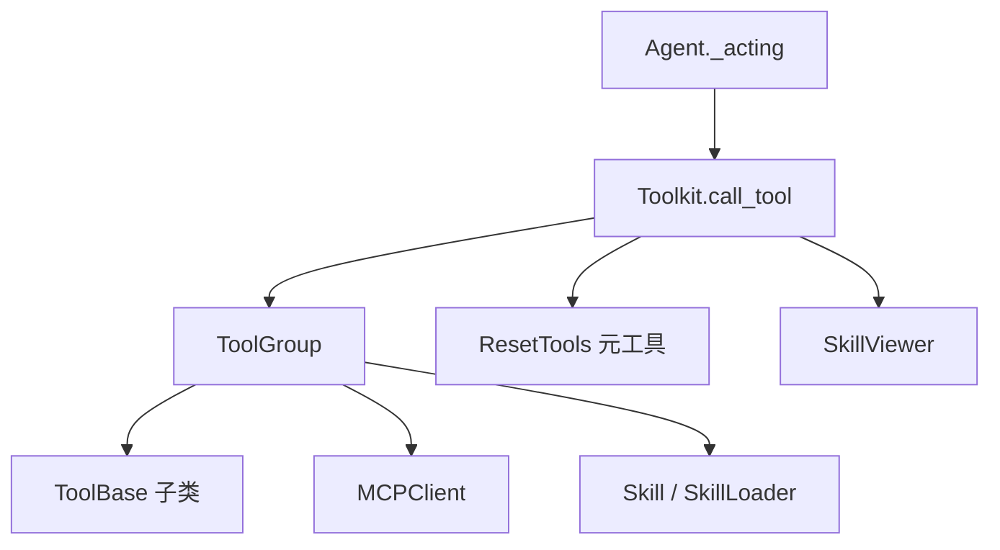
```mermaid
graph TB
    Agent[Agent._acting] --> TK[Toolkit.call_tool]
    TK --> TG[ToolGroup]
    TG --> T[ToolBase 子类]
    TG --> MCP[MCPClient]
    TG --> SK[Skill / SkillLoader]
    TK --> META[ResetTools 元工具]
    TK --> SV[SkillViewer]
```

| 组件 | 位置 | 职责 |
|------|------|------|
| `Toolkit` | `tool/_toolkit.py` | 工具组管理、schema 导出、`call_tool` 执行 |
| `ToolGroup` | `tool/_tool_group.py` | 逻辑分组：tools + mcps + skills |
| `ToolBase` | `tool/_base.py` | 工具协议：权限检查、schema、流式 `__call__` |
| `MCPClient` | `mcp/_mcp_client.py` | 统一 MCP 连接（STDIO / HTTP SSE / Streamable HTTP） |
| `SkillLoaderBase` | `skill/` | Agent Skill 目录加载（Anthropic skills 格式） |

---

### 5.2 `Toolkit` 构造与工具组

**位置**: `tool/_toolkit.py`

```python
class Toolkit:
    def __init__(
        self,
        tools: list[ToolBase] | None = None,
        skills_or_loaders: Sequence[str | Skill | SkillLoaderBase] | None = None,
        mcps: list[MCPClient] | None = None,
        tool_groups: list[ToolGroup] | None = None,
        meta_tool_response_template: str = DEFAULT_META_TOOL_RESPONSE_TEMPLATE,
        skill_instruction_template: str = DEFAULT_SKILL_INSTRUCTION,
    ) -> None:
        self.tool_groups = [
            ToolGroup(
                name="basic",
                tools=tools or [],
                skills_or_loaders=skills_or_loaders or [],
                mcps=mcps or [],
            ),
        ] + (tool_groups or [])
        # 内置元工具
        self.builtin_meta_tool = RegisteredTool(tool=ResetTools(...))
        self.builtin_skill_viewer = RegisteredTool(tool=SkillViewer(...))
```

**设计要点**：
- **`basic` 组保留名**：构造时不可在 `tool_groups` 中重复声明 `basic`
- **有状态 MCP 须先 `connect()`**：构造时检查 `is_stateful and not is_connected` 则抛错
- **动态激活**：非 `basic` 组默认未激活；Agent 通过 `ResetTools` 元工具切换 `tool_context.activated_groups`

#### `ToolGroup`

```python
class ToolGroup:
    name: Literal["basic"] | str
    description: str          # 非 basic 组必填
    instructions: str | None  # 激活时注入给 Agent 的使用说明
    tools: list[ToolBase]
    skills_or_loaders: list[Skill | SkillLoaderBase]
    mcps: list[MCPClient]
```

---

### 5.3 `ToolBase` 协议

**位置**: `tool/_base.py`

```python
class ToolBase(ABC):
    name: str
    description: str
    input_schema: dict[str, Any]   # JSON Schema
    is_concurrency_safe: bool
    is_read_only: bool
    is_external_tool: bool = False   # True → Agent yield RequireExternalExecutionEvent
    is_state_injected: bool = False  # True → 调用时注入 _agent_state
    is_mcp: bool = False
    mcp_name: str | None = None

    @abstractmethod
    async def check_permissions(tool_input, context) -> PermissionDecision: ...

    @abstractmethod
    async def __call__(**kwargs) -> AsyncGenerator[ToolChunk, None]: ...
```

**内置工具**（`tool/_builtin/`）：

| 工具类 | 说明 | `is_read_only` |
|--------|------|----------------|
| `Bash` | 执行 shell 命令 | False |
| `Read` | 读文件（带 LRU 缓存） | True |
| `Write` | 写文件 | False |
| `Edit` | 编辑文件 | False |
| `Glob` / `Grep` | 文件搜索 | True |
| `Task` | 子任务 Agent | False |

**Task 工具**（`tool/_task/`）：在 Agent 内启动子 Agent 执行独立子任务，状态写入 `AgentState.tasks_context`。

---

### 5.4 Schema 导出与工具调用

#### `get_tool_schemas`

```python
async def get_tool_schemas(self, groups: list[str] | None = None) -> list[dict]:
    """返回当前激活工具组的 JSON function schemas。
    groups 未指定时仅含 basic 组；basic 组始终包含。"""
```

Agent 在 `_prepare_model_input()` 中调用，传入 `state.tool_context.activated_groups`。

#### `call_tool`

```python
async def call_tool(
    self,
    tool_call: ToolCallBlock,
    state: AgentState,
) -> AsyncGenerator[ToolChunk | ToolResponse, None]:
    """执行工具，流式 yield ToolChunk，最终返回 ToolResponse。
    累积逻辑在 Toolkit 内部完成；工具只需增量 yield ToolChunk。"""
```

**执行流程**（`call_tool` 内部）：

1. `check_tool_available` — 工具名是否在激活组中
2. `get_tool` — 解析 `ToolBase` 实例（含 MCP 包装）
3. `PermissionEngine.check_permission` — 权限决策（在 Agent 层，acting 前）
4. 调用 `tool.__call__(**validated_input)`，收集 `ToolChunk` → `ToolResponse`
5. 外部工具（`is_external_tool=True`）不执行 `__call__`，由 Agent 发出 `RequireExternalExecutionEvent`

#### `ToolResponse` / `ToolChunk`

**位置**: `tool/_response.py`

```python
class ToolChunk(BaseModel):
    output: list[ContentBlock]   # 增量内容块

class ToolResponse(BaseModel):
    output: list[ContentBlock]   # 完整输出
    is_error: bool = False
```

---

### 5.5 元工具：`ResetTools` 与 `SkillViewer`

#### `ResetTools`（动态切换工具组）

Agent 面向模型的工具名：`reset_equipped_tools`

```python
# Agent 调用示例（模型生成 tool_call）
{
    "name": "reset_equipped_tools",
    "arguments": {"groups": ["coding", "web_search"]}
}
```

激活后：
- 更新 `state.tool_context.activated_groups`
- 返回新激活组的 description + instructions + 可用工具列表摘要

#### `SkillViewer`

查看已注册 Skill 的指令内容（`get_skill_instructions`），供 Agent 按需加载 skill 工作流。

---

### 5.6 `MCPClient` 统一实现

**位置**: `mcp/_mcp_client.py`、`mcp/_config.py`

```python
class MCPClient(BaseModel):
    name: str
    is_stateful: bool
    mcp_config: StdioMCPConfig | HttpMCPConfig
    enable_tools: list[str] | None = None   # 白名单
    disable_tools: list[str] | None = None  # 黑名单
    execution_timeout: float | None = None

    async def connect(self) -> None: ...    # 有状态连接必须调用
    async def close(self) -> None: ...
    async def list_tools(self) -> list[mcp.types.Tool]: ...
    async def call_tool(self, name: str, arguments: dict) -> Any: ...
```

#### 连接类型

| 配置类 | 传输 | `is_stateful` |
|--------|------|---------------|
| `StdioMCPConfig` | 子进程 stdio | **必须** True |
| `HttpMCPConfig`（SSE） | HTTP SSE | True 或 False |
| `HttpMCPConfig`（Streamable HTTP） | HTTP 流式 | True 或 False |

- **有状态**：`connect()` 后维持 `ClientSession`，适合 STDIO 长连接
- **无状态**：每次 `call_tool` 创建临时 session，适合 HTTP 无状态服务

#### 工具命名规则

MCP 工具暴露给模型的名称格式：

```text
mcp__{mcp_client_name}__{tool_name}
```

`mcp_client_name` 须匹配 `^[a-zA-Z0-9_-]+$`。

#### 集成到 Toolkit

```python
from agentscope.mcp import MCPClient, StdioMCPConfig
from agentscope.tool import Toolkit

fs_client = MCPClient(
    name="filesystem",
    is_stateful=True,
    mcp_config=StdioMCPConfig(command="npx", args=["-y", "@modelcontextprotocol/server-filesystem", "/tmp"]),
)
await fs_client.connect()

toolkit = Toolkit(mcps=[fs_client])
agent = Agent(name="Friday", system_prompt="...", model=model, toolkit=toolkit)
```

MCP 工具在 `list_tools` 时自动包装为 `MCPTool`（`is_mcp=True`），权限检查走 MCP 专用规则。

---

### 5.7 Agent Skill 集成

**位置**: `skill/`

```python
from agentscope.skill import LocalSkillLoader

toolkit = Toolkit(
    skills_or_loaders=["./skills/deep-research", LocalSkillLoader("./skills")],
)
```

- Skill 目录含 `SKILL.md`（Anthropic Agent Skills 格式）
- 激活对应 ToolGroup 后，Agent 可通过 `SkillViewer` 读取 skill 指令
- `skill_instruction_template`（Jinja2）控制 skill 说明注入格式

---

### 5.8 完整使用示例

```python
from agentscope.agent import Agent
from agentscope.model import OpenAIChatModel
from agentscope.tool import Toolkit, ToolGroup, Bash, Read, Write
from agentscope.mcp import MCPClient, StdioMCPConfig
from agentscope.message import UserMsg

# 自定义工具组
coding_group = ToolGroup(
    name="coding",
    description="Tools for code editing and execution",
    tools=[Bash(), Read(), Write()],
)

mcp_client = MCPClient(
    name="brave_search",
    is_stateful=True,
    mcp_config=StdioMCPConfig(command="npx", args=["-y", "@anthropic/mcp-server-brave-search"]),
)
await mcp_client.connect()

toolkit = Toolkit(
    tool_groups=[coding_group],
    mcps=[mcp_client],
)

agent = Agent(
    name="DevAgent",
    system_prompt="You are a coding assistant.",
    model=OpenAIChatModel(model_name="gpt-4o", api_key="..."),
    toolkit=toolkit,
)

reply = await agent.reply(UserMsg(name="user", content="Search for AgentScope docs"))
```

---

### 5.9 与 v0.x Toolkit 的差异

| v0.x | v2 |
|------|-----|
| `register_tool_function(callable)` | 构造时传入 `ToolBase` 子类实例 |
| `Toolkit(StateModule)` + `state_dict` | 普通类；状态在 `AgentState.tool_context` |
| MCP 手动包装注册 | `MCPClient` 直接传入 `Toolkit(mcps=[...])` |
| `enable_meta_tool` 构造参数 | 内置 `ResetTools` 始终注册 |

---

## 第6章：A2A 协议详解（v0.x 参考，v2 未迁移）

> ⚠️ `a2a/` 子包在 v2 main **不存在**。本章保留 v0.x 完整设计，供跨 Agent 互操作场景参考。v2 应用层可自建 HTTP/gRPC 客户端调用远程 Agent。

### 6.1 A2A 通信架构

**位置（v0.x）**: `src/agentscope/a2a/`

#### **Agent-to-Agent 协议**

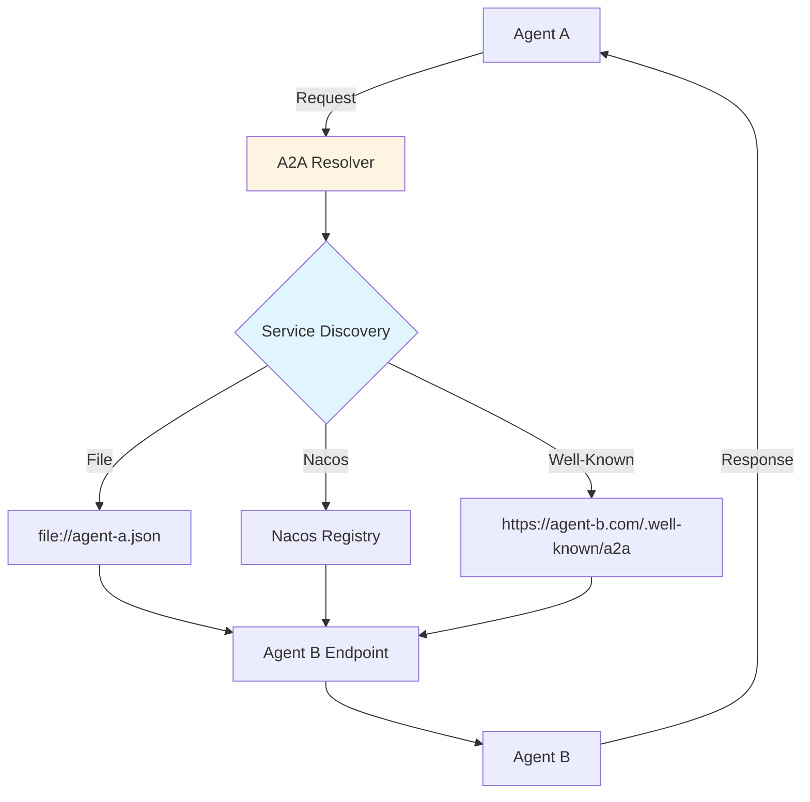
```mermaid
graph TB
    A[Agent A] -->|Request| B[A2A Resolver]
    B --> C{Service Discovery}
    C -->|File| D[file://agent-a.json]
    C -->|Nacos| E[Nacos Registry]
    C -->|Well-Known| F[https://agent-b.com/.well-known/a2a]
    
    D --> G[Agent B Endpoint]
    E --> G
    F --> G
    
    G --> H[Agent B]
    H -->|Response| A
    
    style B fill:#fff4e1
    style C fill:#e1f5ff
```

**服务发现实现**：

```python
class A2AResolver(ABC):
    """A2A解析器基类"""
    
    @abstractmethod
    async def resolve(self, agent_id: str) -> AgentEndpoint:
        pass


class FileResolver(A2AResolver):
    """文件-based服务发现"""
    
    def __init__(self, directory: str):
        self.directory = Path(directory)
    
    async def resolve(self, agent_id: str) -> AgentEndpoint:
        filepath = self.directory / f"{agent_id}.json"
        
        if not filepath.exists():
            raise AgentNotFoundError(f"Agent '{agent_id}' not found")
        
        with open(filepath, 'r') as f:
            data = json.load(f)
        
        return AgentEndpoint.model_validate(data)


class NacosResolver(A2AResolver):
    """Nacos服务发现"""
    
    def __init__(self, server_addr: str, namespace: str = ""):
        self.client = nacos.NacosClient(server_addr, namespace)
    
    async def resolve(self, agent_id: str) -> AgentEndpoint:
        # 从Nacos获取服务信息
        service_info = self.client.get_service(agent_id)
        
        if not service_info:
            raise AgentNotFoundError(f"Agent '{agent_id}' not found in Nacos")
        
        # 选择健康实例
        healthy_instances = [
            inst for inst in service_info.instances
            if inst.healthy
        ]
        
        if not healthy_instances:
            raise AgentUnavailableError(f"No healthy instances for '{agent_id}'")
        
        # 负载均衡（随机选择）
        instance = random.choice(healthy_instances)
        
        return AgentEndpoint(
            url=f"http://{instance.ip}:{instance.port}",
            metadata=instance.metadata,
        )


class WellKnownResolver(A2AResolver):
    """Well-Known URI服务发现"""
    
    async def resolve(self, agent_id: str) -> AgentEndpoint:
        # 从agent_id提取域名
        domain = self._extract_domain(agent_id)
        
        # 访问.well-known端点
        url = f"https://{domain}/.well-known/a2a"
        
        async with httpx.AsyncClient() as client:
            response = await client.get(url, timeout=5)
            
            if response.status_code != 200:
                raise AgentNotFoundError(f"Failed to fetch A2A config from {url}")
            
            data = response.json()
        
        return AgentEndpoint.model_validate(data)
```

---

### 6.2 A2A 消息格式

```python
class A2AMessage(BaseModel):
    """A2A消息"""
    
    message_id: str = Field(default_factory=lambda: str(uuid.uuid4()))
    sender: str  # 发送者Agent ID
    receiver: str  # 接收者Agent ID
    content: str  # 消息内容
    timestamp: datetime = Field(default_factory=datetime.utcnow)
    metadata: dict = Field(default_factory=dict)


class A2AClient:
    """A2A客户端"""
    
    def __init__(self, resolver: A2AResolver):
        self.resolver = resolver
    
    async def send_message(self, message: A2AMessage) -> A2AMessage:
        """发送消息到另一个Agent"""
        
        # Step 1: 解析接收者地址
        endpoint = await self.resolver.resolve(message.receiver)
        
        # Step 2: 发送HTTP请求
        async with httpx.AsyncClient() as client:
            response = await client.post(
                f"{endpoint.url}/a2a/messages",
                json=message.model_dump(mode="json"),
                timeout=30,
            )
            
            if response.status_code != 200:
                raise A2AError(f"Failed to send message: {response.text}")
            
            # Step 3: 返回响应
            return A2AMessage.model_validate(response.json())
```

---

## 第7章：Plan 模式与 RAG 扩展边界（v2 源码级）

> ✅ v2 main 中已没有 `src/agentscope/plan/` 与 `src/agentscope/rag/` 子包。旧版 `PlanNotebook`、`PlanStorage`、`SimpleKnowledgeBase` 等类不再是当前实现的一部分。本章改为说明 **v2 如何通过 Agent 状态、ToolGroup、Agent Skill、Task 子 Agent、Middleware 和 Workspace/Offloader 组合出 Plan 模式与 RAG 能力边界**。

### 7.1 Plan 模式的重新定位

v2 的 Plan 不再是一个内置 notebook 对象，而是一种 **运行时编排模式**：

1. **计划生成**：由模型在普通对话中输出 plan，或通过 Skill 指令要求先规划再执行。
2. **计划持久化**：框架不提供专用 `PlanStorage`；可用文件工具、业务数据库、外部 MCP 或应用层状态保存。
3. **计划执行**：由 Agent 的 reasoning-acting loop、工具调用、Task 子 Agent 和 ToolGroup 动态激活完成。
4. **计划观测**：通过 `AgentState.context`、`AgentState.tasks_context`、Middleware 事件、日志或外部报告文件追踪。

这意味着 Plan 是 **上层协议 / Skill SOP**，不是核心库里的强制抽象。v2 核心只提供可组合的基础设施，避免把某一种 planning 形态固化到框架内。

---

### 7.2 Plan 模式可用构件

| 构件 | 位置 | 在 Plan 模式中的作用 |
|------|------|----------------------|
| `AgentState.context` | `state/_state.py` | 保存用户目标、计划文本、执行结果、修正记录 |
| `AgentState.summary` | `state/_state.py` | 长任务压缩后保留计划进展与关键上下文 |
| `AgentState.tasks_context` | `state/_state.py` | 记录通过 `Task` 工具启动的子任务上下文 |
| `ToolContext.activated_groups` | `state/_state.py` | 记录当前激活的工具组，实现阶段性工具切换 |
| `Toolkit` / `ToolGroup` | `tool/_toolkit.py`、`tool/_tool_group.py` | 把“研究 / 编码 / 浏览 / 发布”等能力拆成可动态激活的组 |
| `ResetTools` | `tool/_builtin/` | 允许模型在执行计划时切换工具集 |
| `SkillViewer` / `LocalSkillLoader` | `tool/_builtin/`、`skill/_local_loader.py` | 按需读取 `SKILL.md`，把复杂 SOP 注入当前任务 |
| `Task` | `tool/_task/` | 将计划中的独立步骤交给子 Agent 执行 |
| `MiddlewareBase` | `middleware/` | 在 reply / reasoning / acting / model call 等节点记录或校验计划进度 |
| `Offloader` / `WorkspaceBase` | `workspace/` | 长上下文或大工具结果落盘，避免计划执行被上下文窗口截断 |

核心数据结构在 `AgentState` 中集中：

```python
class AgentState(BaseModel):
    session_id: str
    summary: str | list[TextBlock | DataBlock]
    context: list[Msg]
    reply_id: str
    cur_iter: int
    permission_context: PermissionContext
    tool_context: ToolContext
    tasks_context: TaskContext
```

`ToolContext` 则保存 Plan 执行时最重要的动态工具状态：

```python
class ToolContext(BaseModel):
    read_file_cache: list[ReadCacheEntry]
    activated_groups: list[str]
```

---

### 7.3 推荐的 Plan Skill 结构

在 v2 中，最自然的 Plan 模式是写成 Agent Skill，而不是新增框架类。一个典型 `SKILL.md` 可以规定：

```markdown
---
name: plan
description: 复杂任务先规划、再分阶段执行、最后验证。
---

# Plan Mode

## 触发条件
- 用户请求“计划 / 方案 / 架构 / 大改动”
- 任务涉及多文件、多阶段或不可逆操作

## 执行流程
1. 读取相关文件，确认当前状态
2. 输出目标、约束、风险和分阶段计划
3. 等待用户确认或选择方案
4. 执行时每次只推进一个阶段
5. 每阶段结束后更新进度并运行验证

## 输出要求
- 不把猜测写成事实
- 不跳过风险和回滚策略
- 不在未确认时执行 destructive 操作
```

加载方式由 `LocalSkillLoader` 完成：扫描包含 `SKILL.md` 的目录，解析 frontmatter 中的 `name` / `description`，并把正文作为 skill 指令缓存。Agent 并不“调用 Skill”本身，而是通过 `SkillViewer` 读取说明后，按说明使用工具和资源。

```python
class LocalSkillLoader(SkillLoaderBase):
    async def list_skills(self) -> list[Skill]:
        # 查找 SKILL.md，读取 frontmatter，返回 Skill(name, description, dir, markdown)
```

---

### 7.4 Plan 执行状态如何保存

v2 没有专用 `PlanNotebook.current_plan`，保存策略应由应用层决定：

| 需求 | 推荐位置 | 说明 |
|------|----------|------|
| 短任务临时计划 | `AgentState.context` | 直接保存在对话上下文中，模型可见 |
| 长任务进度摘要 | `AgentState.summary` | 压缩上下文时保留目标、已完成步骤、待办、风险 |
| 可恢复工程任务 | 工作区文件，如 `task_plan.md` / `progress.md` | 最容易审查和恢复，也适合 git diff |
| 多 Agent 子任务 | `AgentState.tasks_context` | `Task` 工具启动的子任务需要可追踪 |
| 产品级调度 | 外部数据库 / MCP / 业务 API | 适合跨会话、跨设备、多人协作 |

推荐实践是：**短计划留在 context，长计划落盘，关键状态写进 summary**。这样既不依赖未迁移的 v0.x `PlanStorage`，又能利用 v2 已有的上下文压缩和 workspace/offloader 能力。

---

### 7.5 ToolGroup 驱动的阶段化执行

Plan 模式通常需要不同阶段使用不同工具。v2 的 `ToolGroup` 正好承担这个角色：

```python
Toolkit(
    tools=[Read(), Glob()],
    tool_groups=[
        ToolGroup(
            name="coding",
            description="Code editing tools",
            instructions="Use only after the implementation plan is confirmed.",
            tools=[Write(), Edit(), Bash()],
        ),
        ToolGroup(
            name="research",
            description="Research tools",
            instructions="Use for documentation and evidence gathering.",
            mcps=[docs_mcp],
        ),
    ],
)
```

执行时，模型可通过内置元工具 `reset_equipped_tools` 激活阶段所需工具组：

```json
{
  "name": "reset_equipped_tools",
  "arguments": {"groups": ["research"]}
}
```

这种设计比旧 `PlanNotebook.get_next_step()` 更灵活：计划不是固定在一个 Python 对象里，而是通过工具组、Skill 指令和状态共同约束执行。

---

### 7.6 RAG 在 v2 中的边界

v2 main 不再内置 `rag/` 子包，也没有 `SimpleKnowledgeBase`、`VectorStoreBase` 这类统一抽象。当前可用的是更底层的能力：

1. **Embedding 包**：`embedding/` 提供 embedding model 相关实现，可作为外部知识库的组件。
2. **MCP**：通过 `MCPClient` 接入已有检索服务、向量库、文档库或公司知识系统。
3. **Skill**：把某个知识库的查询 SOP 写成 `SKILL.md`，让 Agent 按需读取和执行。
4. **Workspace / Offloader**：将长文档、检索结果或工具输出落盘，避免塞满上下文。
5. **应用层 RAG**：业务应用在调用 Agent 前完成检索，把结果作为 system prompt、user context 或 tool result 注入。

因此，v2 推荐的 RAG 形态是 **外置知识库 + AgentScope 工具/MCP 接入**，而不是框架内置向量库。

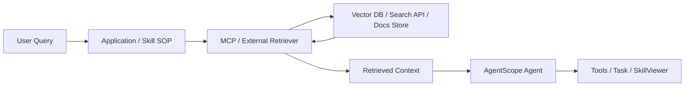
```mermaid
flowchart LR
    Q[User Query] --> APP[Application / Skill SOP]
    APP --> RET[MCP / External Retriever]
    RET --> DOCS[Vector DB / Search API / Docs Store]
    DOCS --> RET
    RET --> CTX[Retrieved Context]
    CTX --> AG[AgentScope Agent]
    AG --> TOOL[Tools / Task / SkillViewer]
```

---

### 7.7 推荐实现模式

#### 模式 A：轻量 Plan（纯 Skill）

适合文档写作、代码审查、简单多步骤任务：

1. `SKILL.md` 定义计划模板和质量门禁。
2. 计划文本保存在对话上下文中。
3. 每个阶段完成后在回复中更新进度。
4. 结束前运行验证命令或阅读 lints。

优点是成本低、侵入小；缺点是跨会话恢复能力弱。

#### 模式 B：文件化 Plan（推荐）

适合工程任务、调研任务和长链路自动化：

```text
task_plan.md     # 目标、阶段、验收条件
findings.md      # 调研发现和引用
progress.md      # 已完成 / 当前 / 阻塞
```

Agent 每次恢复任务时先读取这些文件，再继续执行。这是 v2 里替代旧 `PlanNotebook + PlanStorage` 的最稳妥方案。

#### 模式 C：产品级 Plan 服务

适合 Hermes、dashboard、cron、多人协作等场景：

1. Plan 存在外部数据库或任务服务中。
2. AgentScope 通过 MCP 或业务 Tool 读取/更新状态。
3. Middleware 记录每次 step 状态变化。
4. UI 根据外部状态展示计划进度。

这种模式把 AgentScope 保持为执行引擎，把产品状态交给产品后端管理。

---

### 7.8 与旧版设计的迁移关系

| 旧 v0.x 概念 | v2 推荐替代 |
|--------------|-------------|
| `PlanNotebook` | `SKILL.md` + 文件化计划 + `AgentState.context` |
| `PlanStorage` | 工作区文件 / 外部 DB / MCP Tool |
| `PlanStep.status` | `progress.md`、外部任务状态、Middleware 日志 |
| `get_next_step()` | 模型按 Skill SOP 选择下一步，或由应用层调度 |
| `SimpleKnowledgeBase` | 外部检索服务 + MCP / Tool 接入 |
| `VectorStoreBase` | 业务侧向量库或搜索系统 |

迁移原则：

1. **不要在 v2 文档中继续引用不存在的 `src/agentscope/plan/`、`src/agentscope/rag/`。**
2. **不要把 Plan 状态塞进隐藏全局变量。** 要么让模型看见，要么落盘，要么由外部服务管理。
3. **不要让 RAG 结果绕过上下文管理。** 大结果应通过 workspace/offloader 落盘，并在摘要里保留路径和结论。
4. **复杂任务优先 Skill 化。** Skill 是 v2 中承载 SOP、质量门禁和跨项目复用知识的主要机制。

---

## 第8章：Evaluation & Testing（v0.x 参考，v2 未迁移）

> ⚠️ `evaluate/`、`tuner/` 子包在 v2 main **不存在**。

### 8.1 ACE Benchmark

**位置**: `src/agentscope/evaluate/`

```python
class ACEBenchmark:
    """ACE (Agent Capability Evaluation) Benchmark"""
    
    def __init__(self, tasks: list[Task]):
        self.tasks = tasks
    
    async def evaluate(self, agent: AgentBase) -> EvaluationResult:
        """评估Agent能力"""
        
        results = []
        
        for task in self.tasks:
            # 运行任务
            result = await self._run_task(agent, task)
            results.append(result)
        
        # 计算总分
        total_score = sum(r.score for r in results) / len(results)
        
        return EvaluationResult(
            task_results=results,
            overall_score=total_score,
        )
    
    async def _run_task(self, agent: AgentBase, task: Task) -> TaskResult:
        """运行单个任务"""
        
        start_time = time.time()
        
        try:
            # 发送任务给Agent
            response = await agent.reply(Msg(name="User", content=task.instruction))
            
            # 验证结果
            is_correct = self._verify_result(response.content, task.expected_output)
            
            duration = time.time() - start_time
            
            return TaskResult(
                task_id=task.id,
                success=is_correct,
                score=1.0 if is_correct else 0.0,
                duration=duration,
            )
        
        except Exception as e:
            return TaskResult(
                task_id=task.id,
                success=False,
                score=0.0,
                error=str(e),
            )
```

---

## 第9章：Deployment & Performance

> v2 无内置生产 Server；部署见 [agentscope-runtime](https://github.com/agentscope-ai/agentscope-runtime)。以下含 v0.x 部署模式参考。

### 9.1 Docker 部署

```dockerfile
# Dockerfile
FROM python:3.11-slim

WORKDIR /app

COPY requirements.txt .
RUN pip install --no-cache-dir -r requirements.txt

COPY src/ ./src/

EXPOSE 8000

CMD ["python", "-m", "uvicorn", "src.main:app", "--host", "0.0.0.0", "--port", "8000"]
```

### 9.2 性能优化

```python
# ✅ 启用连接池
db = AsyncDatabase(pool_size=20)

# ✅ 使用缓存
from cachetools import TTLCache
cache = TTLCache(maxsize=1000, ttl=3600)

# ✅ 异步并发
import asyncio
results = await asyncio.gather(*tasks)

# ✅ 批量操作
await db.batch_insert(records)
```

---

## 总结

本文档完成了 AgentScope 的全面分析：

✅ **PART1** - Agent核心、Pipeline编排、Memory系统  
✅ **PART2** - Tool/MCP、A2A协议、Plan模式/RAG边界、Evaluation、Deployment  

**关键洞察**：
1. ✅ **模块化设计** - Tool、Memory、Skill/Plan SOP 可独立替换
2. ✅ **A2A标准化** - 支持多种服务发现机制
3. ✅ **RAG边界清晰** - v2 不内置向量库，推荐外部检索服务通过 Tool/MCP/Skill 接入
4. ✅ **评估框架** - ACE Benchmark系统化测试

---

**文档版本**: 2.2  
**最后更新**: 2026-06-08  
**维护者**: Deep Agents Team

---


<!-- ===== Part 3 — Msg/Session/Tracing ===== -->

> **版本**: 2.1（源码级完整版，非摘要）  
> **分析时间**: 2026-05-22（全面扩写 2026-06-01）  
> **源码路径**: `src/agentscope/`  
> **前置阅读**: [总体流程]) · [Part 1]) · [PART2](./ARCHITECTURE_PART2.md)

> **迁移说明**：**第 10 章** 以 v2 `message/`、`formatter/`、`model/` 为准；**第 11–12 章** 中 `init()` / `session/` / `tracing/` / `evaluate/` 描述 v0.x 能力，v2 main **尚未迁移**（v2 状态持久化见 §11.2 v2 小节）。

---

## 📋 目录

- [第10章：消息与格式化层](#第10章消息与格式化层)
- [第11章：运行时横切（init / Session / Tracing）](#第11章运行时横切init--session--tracing)
- [第12章：评估与调优](#第12章评估与调优)
- [第13章：模块索引与扩展阅读](#第13章模块索引与扩展阅读)

---

## 第10章：消息与格式化层

### 10.1 Msg 与 ContentBlock

**位置**: `src/agentscope/message/`（`_base.py` + `_block.py`）

AgentScope 的消息系统采用 **Msg + ContentBlock** 两层结构：`Msg` 是消息信封，`ContentBlock` 是消息体内的结构化内容块。所有 Agent 与 Model 之间的通信、Agent 内部状态存储均基于此体系。

#### 10.1.1 Msg 类

```python
class Msg(BaseModel):
    name: str                                      # 发送者名称
    content: list[ContentBlock]                    # 内容块列表（非 str）
    role: Literal["user", "assistant", "system"]   # 角色
    id: str                                        # 消息唯一 ID（uuid hex）
    metadata: dict                                 # 附加元数据
    created_at: str                                # 创建时间（ISO 格式）
    finished_at: str | None                        # 完成时间（流式结束后填充）
    usage: Usage | None                            # token 用量
```

**关键设计**：
- `content` 类型为 `list[ContentBlock]`，**不是** `str`。传入 `str` 时由工厂函数自动包装为 `[TextBlock(text=...)]`
- `role` 严格限定为 `user` / `assistant` / `system` 三种
- `id` 用于关联流式事件（`AgentEvent.reply_id` 与 `Msg.id` 对应）
- `usage` 在流式过程中逐次累加（`MODEL_CALL_END` 事件触发）

#### 10.1.2 工厂函数

不同角色的消息通过工厂函数创建，**自动校验 content block 类型的合法性**：

| 工厂函数 | role | 允许的 ContentBlock 类型 | 说明 |
|----------|------|--------------------------|------|
| `UserMsg(name, content)` | `"user"` | `TextBlock`、`DataBlock` | 用户消息，可含多模态数据 |
| `AssistantMsg(name, content)` | `"assistant"` | **所有** ContentBlock 类型 | Agent 回复，可含 thinking / tool_call / tool_result 等 |
| `SystemMsg(name, content)` | `"system"` | 仅 `TextBlock` | 系统提示，纯文本 |

```python
# 使用示例
msg1 = UserMsg("Alice", "你好")                          # str 自动包装为 TextBlock
msg2 = AssistantMsg("Friday", [TextBlock(text="...")])   # 显式 block 列表
msg3 = SystemMsg("system", "You are a helpful assistant.")
```

**校验逻辑**（`model_validator`）：
- `user` 消息含 `tool_call` / `thinking` 等块 → `ValueError`
- `system` 消息含非 `TextBlock` → `ValueError`
- `assistant` 消息无限制

#### 10.1.3 ContentBlock 类型体系

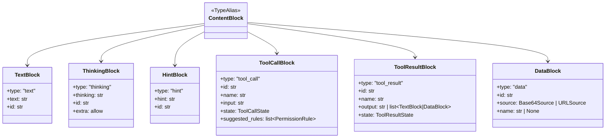
```mermaid
classDiagram
    class ContentBlock {
        <<TypeAlias>>
    }

    class TextBlock {
        +type: "text"
        +text: str
        +id: str
    }

    class ThinkingBlock {
        +type: "thinking"
        +thinking: str
        +id: str
        +extra: allow
    }

    class HintBlock {
        +type: "hint"
        +hint: str
        +id: str
    }

    class ToolCallBlock {
        +type: "tool_call"
        +id: str
        +name: str
        +input: str
        +state: ToolCallState
        +suggested_rules: list~PermissionRule~
    }

    class ToolResultBlock {
        +type: "tool_result"
        +id: str
        +name: str
        +output: str | list~TextBlock|DataBlock~
        +state: ToolResultState
    }

    class DataBlock {
        +type: "data"
        +id: str
        +source: Base64Source | URLSource
        +name: str | None
    }

    ContentBlock --> TextBlock
    ContentBlock --> ThinkingBlock
    ContentBlock --> HintBlock
    ContentBlock --> ToolCallBlock
    ContentBlock --> ToolResultBlock
    ContentBlock --> DataBlock
```

各 Block 详细说明：

| Block 类型 | 字段 | 用途 | 出现场景 |
|------------|------|------|----------|
| **TextBlock** | `text: str` | 纯文本内容 | 所有角色消息 |
| **ThinkingBlock** | `thinking: str` + `extra="allow"` | 模型思维链（如 Claude extended thinking） | assistant 消息；支持 provider 特有字段（如 Anthropic `signature`） |
| **HintBlock** | `hint: str` | 推理循环中的临时提示（如 PlanNotebook hint） | assistant 消息；Formatter 将其转为 user 消息注入 |
| **ToolCallBlock** | `name`, `input`(JSON str), `state`, `suggested_rules` | 工具调用请求 | assistant 消息 |
| **ToolResultBlock** | `name`, `output`(str 或 block 列表), `state` | 工具执行结果 | assistant 消息 |
| **DataBlock** | `source`(Base64Source / URLSource) | 二进制/多模态数据（图片、音频、视频） | user / assistant 消息 |

#### 10.1.4 ToolCallBlock 状态机

`ToolCallBlock.state` 是工具调用的核心状态，控制 ReAct 循环的执行流程：

```mermaid
stateDiagram-v2
    [*] --> pending : LLM 生成 tool_call

    pending --> finished : 权限 DENY / 输入校验失败
    pending --> asking : 权限 ASK（需用户确认）
    pending --> allowed : 权限 ALLOW

    asking --> finished : 用户拒绝
    asking --> allowed : 用户批准

    allowed --> finished : 本地工具执行完成
    allowed --> submitted : 外部工具（需外部执行）

    submitted --> finished : 收到 ExternalExecutionResultEvent

    finished --> [*]
```

| 状态 | 值 | 含义 |
|------|-----|------|
| `PENDING` | `"pending"` | 初始状态，LLM 刚生成，尚未经权限系统处理 |
| `ASKING` | `"asking"` | 权限系统要求用户确认，等待 `UserConfirmResultEvent` |
| `ALLOWED` | `"allowed"` | 权限系统/用户批准，等待执行 |
| `SUBMITTED` | `"submitted"` | 外部工具已提交执行，等待 `ExternalExecutionResultEvent` |
| `FINISHED` | `"finished"` | 执行完成（成功/失败/拒绝均归于此） |

#### 10.1.5 ToolResultBlock 状态

| 状态 | 值 | 含义 |
|------|-----|------|
| `RUNNING` | `"running"` | 工具正在执行中（流式场景） |
| `SUCCESS` | `"success"` | 执行成功 |
| `ERROR` | `"error"` | 执行出错（输入校验失败等） |
| `DENIED` | `"denied"` | 被权限系统或用户拒绝 |
| `INTERRUPTED` | `"interrupted"` | 执行被中断 |

#### 10.1.6 DataBlock 与多模态

`DataBlock` 通过 `source` 字段支持两种数据来源：

```python
# Base64 内嵌数据
DataBlock(source=Base64Source(data="<base64>", media_type="image/png"))

# URL 引用
DataBlock(source=URLSource(url="https://...", media_type="image/png"))
```

| Source 类型 | 字段 | 适用场景 |
|-------------|------|----------|
| `Base64Source` | `data: str` + `media_type: str` | 小图片、短音频等内嵌数据 |
| `URLSource` | `url: AnyUrl` + `media_type: str` | 大文件、外部资源链接 |

`media_type` 遵循 MIME 规范（如 `image/png`、`audio/mpeg`、`video/mp4`）。

#### 10.1.7 Msg 的核心方法

| 方法 | 签名 | 用途 |
|------|------|------|
| `get_content_blocks` | `(block_type=None) -> Sequence[ContentBlock]` | 按类型筛选内容块，支持 `"text"` / `"thinking"` / `"tool_call"` / `"tool_result"` / `"data"` / `"hint"` |
| `has_content_blocks` | `(block_type=None) -> bool` | 检查是否含指定类型的内容块 |
| `get_text_content` | `(separator="\n") -> str | None` | 提取所有 TextBlock 的文本拼接 |
| `append_event` | `(event: AgentEvent) -> Self` | 将流式事件应用到消息，增量更新 content / usage / finished_at |

**`append_event` 的流式更新逻辑**：

| 事件类型 | 操作 |
|----------|------|
| `TEXT_BLOCK_START` | 追加新 `TextBlock(id=..., text="")` |
| `TEXT_BLOCK_DELTA` | 找到对应 block，`text += delta` |
| `THINKING_BLOCK_START` | 追加新 `ThinkingBlock(id=..., thinking="")` |
| `THINKING_BLOCK_DELTA` | 找到对应 block，`thinking += delta` |
| `TOOL_CALL_START` | 追加新 `ToolCallBlock(id=..., name=..., input="")` |
| `TOOL_CALL_DELTA` | 找到对应 block，`input += delta` |
| `TOOL_RESULT_START` | 追加新 `ToolResultBlock(id=..., output=[], state=RUNNING)` |
| `TOOL_RESULT_TEXT_DELTA` | 找到对应 block，追加/拼接文本 |
| `TOOL_RESULT_DATA_DELTA` | 找到对应 block，追加 `DataBlock` |
| `TOOL_RESULT_END` | 更新 `state` 为最终状态 |
| `MODEL_CALL_END` | 累加 `usage`（input_tokens / output_tokens） |
| `REPLY_END` | 设置 `finished_at` |
| `REQUIRE_USER_CONFIRM` | 更新 `ToolCallBlock.state` → `ASKING` |
| `USER_CONFIRM_RESULT` | 更新 `ToolCallBlock.state` → `ALLOWED` / `FINISHED` |
| `REQUIRE_EXTERNAL_EXECUTION` | 更新 `ToolCallBlock.state` → `SUBMITTED` |

#### 10.1.8 Msg 在 ReAct 循环中的流转

```mermaid
sequenceDiagram
    participant User
    participant Agent
    participant LLM
    participant Tool

    User->>Agent: UserMsg("user", "帮我写代码")
    Note over Agent: state.context.append(UserMsg)

    loop ReAct 循环
        Agent->>LLM: [SystemMsg, summary?, ...context]
        LLM-->>Agent: AssistantMsg(content=[ThinkingBlock, TextBlock, ToolCallBlock...])
        Note over Agent: state.context 追加 AssistantMsg

        alt 有 ToolCallBlock
            Agent->>Tool: 执行工具
            Tool-->>Agent: ToolResultBlock
            Note over Agent: 追加到同一 AssistantMsg.content
        else 无 ToolCall（纯文本回复）
            Agent-->>User: AssistantMsg
        end
    end
```

**关键点**：
- 一个 `reply` 周期内，Agent 的所有输出（thinking、text、tool_call、tool_result）**存储在同一个 `AssistantMsg` 的 `content` 列表**中
- `_save_to_context()` 方法将 block 追加到 `context` 中最后一个 `AssistantMsg`；若最后一条非 assistant 消息，则创建新的 `AssistantMsg`
- `get_content_blocks("tool_call")` 用于 ReAct 行动阶段提取待执行的工具调用
- `get_content_blocks("tool_result")` 用于判断哪些工具调用已有结果

#### 10.1.9 Usage 类

```python
class Usage(BaseModel):
    input_tokens: int
    output_tokens: int
```

- 仅 `AssistantMsg` 携带 `usage`
- 流式过程中，每次 `MODEL_CALL_END` 事件累加 token 数
- 一个 `reply` 可能包含多次模型调用（多轮 ReAct），`usage` 是所有调用的累计值

### 10.2 Model 层（v2）

**位置**: `src/agentscope/model/`

v2 中 `ChatModelBase` **直接消费 `Msg` 列表**，不再经独立 Formatter 转换历史：

```python
class ChatModelBase(ABC):
    context_size: int
    async def count_tokens(self, messages: list[Msg], tools: list[dict] | None = None) -> int: ...
    async def generate(self, messages, tools, tool_choice, ...) -> AsyncGenerator[ChatResponse, None]: ...
    async def generate_structured_output(self, messages, structured_model, ...) -> ChatResponse: ...
```

**支持的 Provider**（`model/_openai.py` 等）：

| 类 | Provider |
|----|----------|
| `OpenAIChatModel` | OpenAI / 兼容 API |
| `AnthropicChatModel` | Anthropic Claude |
| `DashScopeChatModel` | 阿里云 DashScope |
| `GeminiChatModel` | Google Gemini |
| `DeepSeekChatModel` | DeepSeek |
| `OllamaChatModel` | 本地 Ollama |
| `MoonshotChatModel` | Moonshot |
| `XAIChatModel` | xAI Grok |

`ModelConfig.fallback_model` + `max_retries` 在 Agent 层处理主模型失败切换。

### 10.3 Formatter 层（v2 定位变化）

**位置**: `src/agentscope/formatter/`

v2 中 Formatter 主要用于 **模型 provider 特定的消息序列化细节**（如 tool_call 格式差异），而非从 `MemoryBase` 组装历史。Agent 的 `_prepare_model_input()` 直接构建 `list[Msg]` 传给 Model。

| v0.x | v2 |
|------|-----|
| `formatter.format(memory.get_memory())` | `_prepare_model_input()` → `messages.extend(state.context)` |
| 每 Agent 必配 Formatter | Model 内部处理 provider 格式 |
| `MultiAgentFormatter` 区分发言者 | `Msg.name` 字段区分 Agent |

---

## 第11章：运行时横切（Logging / 持久化 / Tracing）

### 11.1 v2 日志配置

**位置**: `src/agentscope/_logging.py`、`__init__.py`

v2 **`agentscope` 包无 `init()` 全局函数**（v0.x 有）。日志通过：

```python
from agentscope import setup_logger, logger

setup_logger(level="INFO", path="./logs/agentscope.log")
```

`Agent` 内部关键路径（压缩触发、超 max_iters 等）使用 `logger.info` / `logger.warning`。

### 11.2 状态持久化

#### v2：`AgentState` 序列化（main 已实现）

```python
import json
from agentscope.state import AgentState

# 保存
state_json = agent.state.model_dump_json()
with open(f"sessions/{agent.state.session_id}.json", "w") as f:
    f.write(state_json)

# 恢复
with open("sessions/abc123.json") as f:
    restored = AgentState.model_validate_json(f.read())
agent = Agent(name="Friday", system_prompt="...", model=model, state=restored)
```

**注意**：
- `context` 内嵌套完整 `Msg` 对象
- 若使用 `Offloader`，须同步拷贝 `{workdir}/sessions/` 目录
- `permission_context` 规则一并序列化

#### v0.x：`JSONSession` / `RedisSession`（未迁移）

> ⚠️ `session/` 子包在 v2 main **不存在**。以下为 v0.x 完整设计。

**位置（v0.x）**: `src/agentscope/session/`

```mermaid
sequenceDiagram
    participant App
    participant S as JSONSession
    participant A as StateModule

    App->>S: load_session_state(session_id, agent)
    Note over A: memory / toolkit state_dict
    App->>A: 多轮 await agent(msg)
    App->>S: save_session_state(session_id, agent)
```

| 类 | 后端 | 序列化对象 |
|----|------|-----------|
| `JSONSession` | 本地 JSON 文件 | `StateModule.state_dict()` |
| `RedisSession` | Redis | 同上 |
| `TablestoreSession` | 阿里云 Tablestore | 同上 |

v0.x 中 `AgentBase`、`MemoryBase`、`Toolkit` 继承 **`module.StateModule`**，通过 `state_dict()` / `load_state_dict()` 实现组件级持久化。v2 改为单一 `AgentState` Pydantic 模型。

### 11.3 Tracing（v0.x 参考，v2 未迁移）

> ⚠️ `tracing/` 子包在 v2 main **不存在**。

**位置（v0.x）**: `src/agentscope/tracing/`

- OpenTelemetry 集成
- `trace_reply` 等装饰器包裹 `AgentBase.reply` 关键路径
- 在 `agentscope.init(tracing_url=...)` 时启用 OTLP 导出

**v2 替代**：应用层用 OpenTelemetry SDK 包裹 `agent.reply()` / `reply_stream()`，或监听 `AgentEvent` 流自行上报。

### 11.4 Middleware vs v0.x Hooks

| 机制 | v2 | v0.x |
|------|-----|------|
| 拦截点 | `MiddlewareBase` 6 钩子 | `AgentBase` 内置 hook（`pre_reply` / `post_reasoning` 等） |
| 注册 | `Agent(middlewares=[...])` | `agent.register_hook("pre_reasoning", fn)` |
| Studio 可视化 | 未内置 | `hooks/` + `init(studio_url=...)` |

v2 Middleware 采用洋葱链，可 yield 事件；v0.x Hook 为前后回调函数。

---

## 第12章：评估与调优（v0.x 参考，v2 未迁移）

> ⚠️ `evaluate/`、`tuner/` 子包在 v2 main **不存在**。

### 12.1 Evaluation

**位置（v0.x）**: `src/agentscope/evaluate/`

- `EvaluatorBase`、`RayEvaluator`：分布式评测。
- ACE 等 benchmark 集成（见 `tests/` 与 `examples/evaluation/`）。

### 12.2 Tuner

**位置（v0.x）**: `src/agentscope/tuner/`

| API | 用途 |
|-----|------|
| `tune` | 模型微调（RL/SFT 等） |
| `tune_prompt` | 提示词优化 |
| `select_model` | 模型选择 |

> `import agentscope.tune` 已废弃，会抛出迁移提示，请使用 **`agentscope.tuner`**。

---

## 第13章：模块索引与扩展阅读

### 13.1 完整子包一览（v2 main vs v0.x）

| 子包 | v2 main | 说明 |
|------|---------|------|
| `agent` | ✅ | 统一 `Agent` + `_config` |
| `message` | ✅ | `Msg` + 6 种 `ContentBlock` |
| `model` | ✅ | `ChatModelBase` 多 Provider |
| `formatter` | ✅ | Provider 格式辅助（非 Memory 组装） |
| `tool` / `mcp` | ✅ | `Toolkit` + `MCPClient` |
| `state` | ✅ | `AgentState` + `TaskContext` |
| `permission` | ✅ | `PermissionEngine` |
| `middleware` | ✅ | `MiddlewareBase` 6 钩子 |
| `event` | ✅ | `AgentEvent` 流式事件 |
| `workspace` | ✅ | `Offloader` / `LocalWorkspace` + Docker/E2B/K8s 等 Backend（见 workspace 包） |
| `skill` | ✅ | Agent Skill 加载 |
| `credential` | ✅ | 凭证管理 |
| `embedding` | ✅ | 嵌入模型 |
| `app` | ✅ | **生产 Harness**：`create_app`、ChatService、Channel、Storage（见 [APP_ARCHITECTURE.md](./APP_ARCHITECTURE.md)） |
| `memory` | ❌ v0.x | `MemoryBase` / LTM → 现为 `AgentState` + middleware |
| `pipeline` | ✅ | `GoalPipeline`（executor+verifier）；v0.x `MsgHub` 已移除 |
| `session` | ⚠️ | 框架级 `JSONSession` 无；**`app/storage`** 提供 Session 持久化 |
| `rag` | ✅ | `KnowledgeBase`、Parser、VDB、`RAGMiddleware`（见 [RAG_AND_KNOWLEDGE.md](./RAG_AND_KNOWLEDGE.md)） |
| `plan` / `a2a` | ❌ v0.x | Plan 用 ToolGroup/文件；A2A 包未迁回 |
| `tracing` | ❌ v0.x | OpenTelemetry |
| `evaluate` / `tuner` | ❌ v0.x | 评测与调优 |
| `realtime` / `tts` | ❌ v0.x | 实时语音（见 REALTIME_AGENT_ARCHITECTURE.md） |

### 13.2 示例入口

| 路径 | 内容 |
|------|------|
| `examples/agent/react_agent/` | 最小 ReAct Agent |
| `examples/workflows/multiagent/` | MsgHub、辩论、并发 |
| `examples/functionality/` | MCP、memory、structured output |
| `examples/deployment/` | 部署相关 |
| `docs/tutorial/en`、`zh_CN` | 官方教程源码 |

### 13.3 部署说明

框架本体 **库**无内置生产 Server；**`agentscope.app.create_app`** 提供完整服务层（见 [APP_ARCHITECTURE.md](./APP_ARCHITECTURE.md)）。其他部署选项：

- 自建 FastAPI/脚本循环 + `await agent(msg)`
- [agentscope-runtime](https://github.com/agentscope-ai/agentscope-runtime)（官方运行时生态）
- 结合 `JSONSession`、Redis、Tablestore 做有状态服务

---

## 总结

✅ **第10章** - `Msg` / `Formatter` 与 Model 分层  
✅ **第11章** - `init`、Session、Tracing 横切能力  
✅ **第12章** - Evaluate / Tuner  
✅ **第13章** - 模块索引与示例路径  

---

**文档版本**: 2.1  
**最后更新**: 2026-06-01

---

