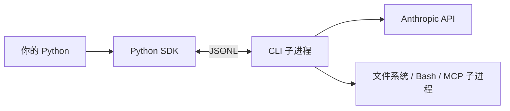
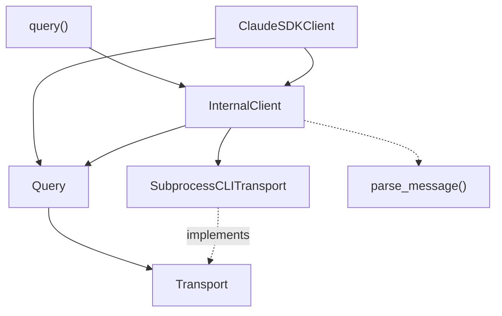

# Claude Agent SDK (Python) 架构与实现指南

> **唯一文档** · `claude-agent-sdk` v0.2.95+ · bundled CLI v2.1.x  
> **Python 源码**: `src/claude_agent_sdk/`（本仓库可读）  
> **CLI 源码**: **不在本仓库**（见 §0.2）  
> **最后更新**: 2026-06-11

---

## 目录

- [0. 先回答两个问题](#0-先回答两个问题)
  - [0.1 这 SDK 到底有什么用？](#01-这-sdk-到底有什么用)
  - [0.2 Claude Code CLI 在哪？本仓库有什么？](#02-claude-code-cli-在哪本仓库有什么)
- [1. 边界：SDK 做什么、CLI 做什么](#1-边界sdk-做什么cli-做什么)
- [2. 源码文件地图](#2-源码文件地图)
- [3. 类图与引用关系](#3-类图与引用关系)
- [4. 协议：stdin/stdout 上跑什么 JSONL](#4-协议stdinstdout-上跑什么-jsonl)
- [5. 实现：`query()` 逐步源码导读](#5-实现query-逐步源码导读)
- [6. 实现：`Query` 控制平面（SDK 最核心）](#6-实现query-控制平面sdk-最核心)
- [7. 实现：`SubprocessCLITransport`](#7-实现subprocessclitransport)
- [8. 实现：`parse_message`](#8-实现parse_message)
- [9. 实现：`ClaudeSDKClient` 多轮](#9-实现claudesdkclient-多轮)
- [10. Hooks · MCP · 权限 · Session（实现链）](#10-hooks--mcp--权限--session实现链)
- [11. 配置 `ClaudeAgentOptions` 三类去向](#11-配置-claudeagentoptions-三类去向)
- [12. 错误处理与测试](#12-错误处理与测试)
- [附录 A. 与 nanobot 对照](#附录-a-与-nanobot-对照)
- [附录 B. 调试 demo](#附录-b-调试-demo)

---

## 0. 先回答两个问题

### 0.1 这 SDK 到底有什么用？

CLI 已经能写代码、跑 tool 了，Python SDK 不是重复造 Agent，而是给 **要在 Python 里程序化驱动 Claude Code** 的人用的：

| 需求 | 没有 SDK 时 | 有 SDK 时 |
|------|------------|-----------|
| 在 Python 服务/CI 里调 Agent | 自己 `subprocess` 拼 argv、解析 JSONL | `async for msg in query(...)` |
| 类型安全的消息 | 手写 dict 解析 | `AssistantMessage` / `ToolUseBlock` 等 dataclass |
| 业务逻辑 Hook（拦 Bash、改 tool 输入） | 难 | `PreToolUse` Python 回调 |
| 程序化权限（不弹 TUI） | 难 | `can_use_tool` / `permission_mode` |
| 同进程 MCP（连你的 DB/业务 API） | 不行 | `@tool` + `create_sdk_mcp_server` |
| 远程 Session（Redis/S3 resume） | 自己拷 JSONL | `SessionStore` + materialize |
| 聊天产品多轮 + `interrupt` | 自己管 stdin 协议 | `ClaudeSDKClient` |
| 与 TypeScript Agent SDK 对齐 | — | 同一套 CLI wire 协议 |

**一句话**：SDK = **Python 侧的 typed 驱动层 + 控制面**；Agent 能力（Loop、内置 tool、调 API）仍靠 CLI。

若你只想终端里跟 Claude 聊天 → 装 CLI 即可，**不必**装 SDK。  
若你要 **FastAPI 后端、批处理脚本、带 Hook 的自动化** → 用 SDK。

### 0.2 Claude Code CLI 在哪？本仓库有什么？

```text
┌─────────────────────────────────────────────────────────────┐
│  claude-agent-sdk-python（本仓库）                            │
│  ✅ Python 源码：query.py, client.py, _internal/query.py …   │
│  ⚠️  _bundled/claude：预编译二进制，git 忽略，pip 安装后才有    │
│  ❌  没有 Agent Loop 源码，没有 Read/Bash 工具实现              │
└─────────────────────────────────────────────────────────────┘
                              │ spawn
                              ▼
┌─────────────────────────────────────────────────────────────┐
│  Claude Code CLI（独立产品）                                  │
│  npm: @anthropic-ai/claude-code                               │
│  安装: npm i -g @anthropic-ai/claude-code  或官方 install.sh  │
│  文档: https://code.claude.com/docs  / platform.claude.com    │
│  源码: 不随 Python SDK 开源分发（PyPI wheel 只含二进制）         │
└─────────────────────────────────────────────────────────────┘
```

| 产物 | 位置 | git 里有没有 |
|------|------|:------------:|
| Python SDK 源码 | `src/claude_agent_sdk/` | ✅ |
| CLI 二进制 | `_bundled/claude` 或 PATH 里的 `claude` | ❌（build 时下载） |
| CLI TypeScript 源码 | Anthropic 独立仓库/闭源分发 | ❌ 不在本 repo |
| Session 文件 | `~/.claude/projects/.../session.jsonl` | 运行时 CLI 写入 |

发 PyPI 时 `scripts/build_wheel.py` 会 **按平台下载 CLI 打进 wheel**；本地 clone 后 `_bundled/` 往往是空的，需 `pip install claude-agent-sdk` 或自己装 `claude`。

---

## 1. 边界：SDK 做什么、CLI 做什么

| 能力 | Python SDK（本仓库代码） | Claude Code CLI（子进程） |
|------|:------------------------:|:-------------------------:|
| while LLM→tool→LLM **实现** | ❌ | ✅ |
| 对外多轮 tool **行为** | ✅ 透传 stdout | ✅ |
| 调 Anthropic API | ❌ | ✅ |
| Read/Write/Bash/Grep 执行 | ❌ | ✅ |
| spawn CLI、拼 argv | ✅ `SubprocessCLITransport` | 消费 argv |
| 读写 stdin/stdout JSONL | ✅ Transport | 消费/产出 JSONL |
| Control 握手 hooks/agents | ✅ `Query.initialize` | 存储并在生命周期触发 |
| Python Hook 回调执行 | ✅ `_handle_control_request` | 发 `hook_callback` |
| SDK 内嵌 MCP | ✅ `_handle_sdk_mcp_request` | 发 `mcp_message` |
| 解析 Message dataclass | ✅ `parse_message` | 输出 raw JSON |
| Session JSONL 权威 | mirror 辅助 | ✅ 读写磁盘 |
| 压缩 / Memory | ❌ | ✅ |



---

## 2. 源码文件地图

| 路径 | 核心符号 | 职责（实现原理层面） |
|------|----------|---------------------|
| `query.py` | `query()` | 薄封装：建 `InternalClient`，yield 消息 |
| `client.py` | `ClaudeSDKClient` | 长连接：持有 `Query`，多轮 `write`，动态 control API |
| `_internal/client.py` | `InternalClient` | 共用启动链：materialize → connect → Query → 写首条 user |
| `_internal/query.py` | `Query` | **multiplex 读循环** + control 双向 + SDK MCP 桥 |
| `_internal/transport/subprocess_cli.py` | `SubprocessCLITransport` | `_find_cli` + `_build_command` + `open_process` |
| `_internal/message_parser.py` | `parse_message` | wire dict → typed Message |
| `_internal/session_resume.py` | `materialize_resume_session` | 远程 Store → 临时 `CLAUDE_CONFIG_DIR` |
| `types.py` | `ClaudeAgentOptions` 等 | 全部配置与消息类型 |

**读 Loop 别找 `_internal/query.py` 里的 while max_turns** — 那里只有 I/O 与控制；Loop 在 CLI 进程内。

---

## 3. 类图与引用关系



调用链：

```text
query(prompt)
  → InternalClient.process_query()
      → _process_query_inner()
          → SubprocessCLITransport.connect()
          → Query.start()           # 后台 _read_messages
          → Query.initialize()      # control 握手
          → transport.write(user)   # stdin JSONL
          → async for query.receive_messages()
                → parse_message()
```

---

## 4. 协议：stdin/stdout 上跑什么 JSONL

SDK 与 CLI 之间是 **NDJSON**（一行一个 JSON），**两类帧混在同一 stdout**：

### 4.1 主消息流（CLI → SDK，给你看的）

**User 输入**（SDK 写 stdin）：

```json
{
  "type": "user",
  "session_id": "",
  "message": {"role": "user", "content": "用三句话解释递归"},
  "parent_tool_use_id": null
}
```

**Assistant 输出**（CLI 写 stdout）：

```json
{
  "type": "assistant",
  "message": {
    "role": "assistant",
    "content": [{"type": "text", "text": "..."}]
  }
}
```

**Tool 调用**（content 里含 `tool_use` block）— Loop 在 CLI 内决定何时发：

```json
{
  "type": "assistant",
  "message": {
    "content": [
      {"type": "tool_use", "id": "toolu_01", "name": "Read", "input": {"file_path": "/tmp/x"}}
    ]
  }
}
```

**一轮结束**：

```json
{
  "type": "result",
  "subtype": "success",
  "num_turns": 3,
  "total_cost_usd": 0.012,
  "is_error": false
}
```

### 4.2 Control 流（SDK ↔ CLI，应用层通常看不到）

**SDK → CLI**（写 stdin，与 user 消息同一管道）：

```json
{
  "type": "control_request",
  "request_id": "req_1_a1b2c3d4",
  "request": {
    "subtype": "initialize",
    "hooks": {"PreToolUse": [{"matcher": "Bash", "hookCallbackIds": ["hook_0"]}]},
    "agents": null,
    "skills": []
  }
}
```

**CLI → SDK**（stdout）：

```json
{
  "type": "control_response",
  "response": {
    "subtype": "success",
    "request_id": "req_1_a1b2c3d4",
    "response": {}
  }
}
```

**CLI 请求 Python 执行 Hook**：

```json
{
  "type": "control_request",
  "request_id": "req_hook_xxx",
  "request": {
    "subtype": "hook_callback",
    "callback_id": "hook_0",
    "input": {"tool_name": "Bash", "tool_input": {"command": "rm -rf /"}},
    "tool_use_id": "toolu_01"
  }
}
```

SDK 在 `_handle_control_request` 里 `await` 你的 Python 函数，再写 `control_response` 回 stdin。

---

## 5. 实现：`query()` 逐步源码导读

### 5.1 入口极薄

`query.py` 只做三件事：默认 options、建 client、转发 generator：

```python
client = InternalClient()
async for message in client.process_query(prompt=prompt, options=options, transport=transport):
    yield message
```

### 5.2 `InternalClient.process_query` — cleanup 顺序

源码：`_internal/client.py`

```python
materialized = await materialize_resume_session(options) if transport is None else None
inner = self._process_query_inner(...)
try:
    async for msg in inner:
        yield msg
finally:
    await inner.aclose()          # 先杀 CLI 子进程
    if materialized:
        await materialized.cleanup()  # 再删临时 CLAUDE_CONFIG_DIR
```

**为什么顺序重要**：子进程可能还在写 materialize 出来的临时 session 目录；先删目录会导致 CLI 读写失败或丢 transcript。

### 5.3 `_process_query_inner` — 逐步表

| 步 | 代码做什么 | 文件位置 |
|:--:|-----------|----------|
| 1 | `can_use_tool` + str prompt → `ValueError` | client.py ~100 |
| 2 | 有 `can_use_tool` → 强制 `permission_prompt_tool_name="stdio"` | client.py ~116 |
| 3 | materialize 后 `apply_materialized_options` | client.py ~118 |
| 4 | `SubprocessCLITransport(prompt, options)` 或 custom transport | client.py ~127 |
| 5 | `await transport.connect()` spawn `claude ...` | client.py ~133 |
| 6 | 从 `mcp_servers` 抽出 `type=="sdk"` 的 `instance` 字典 | client.py ~136 |
| 7 | `agents` → `asdict` 去 None | client.py ~154 |
| 8 | `Query(..., is_streaming_mode=True)` **永远 streaming** | client.py ~170 |
| 9 | `await query.start()` 启动 `_read_messages` 后台任务 | client.py ~201 |
| 10 | `await query.initialize()` control 握手 | client.py ~204 |
| 11 | str prompt → 构造 user dict → `transport.write(json+"\n")` | client.py ~207-216 |
| 12 | `spawn_task(wait_for_result_and_end_input)` 等 result 后关 stdin | client.py ~217 |
| 13 | `async for data in query.receive_messages()` → `parse_message` | client.py ~223 |
| 14 | `finally: await query.close()` | client.py ~228 |

**str prompt 写入的 user 消息**（源码原文结构）：

```python
user_message = {
    "type": "user",
    "session_id": "",
    "message": {"role": "user", "content": prompt},
    "parent_tool_use_id": None,
}
await chosen_transport.write(json.dumps(user_message) + "\n")
```

写完后 CLI 开始在**其进程内**跑 Agent Loop；SDK 侧 `_read_messages` 已在并行读 stdout。

---

## 6. 实现：`Query` 控制平面（SDK 最核心）

文件：`_internal/query.py`（约 900 行）。**这是本仓库里最值得精读的类** — 但仍不是 Agent Loop，而是 **multiplex I/O + control 路由**。

### 6.1 构造时建立的状态

```python
# control 等待表
self.pending_control_responses: dict[str, anyio.Event] = {}
self.pending_control_results: dict[str, dict | Exception] = {}
self.hook_callbacks: dict[str, Callable] = {}   # hook_0 → 你的 Python 函数

# 给应用层的消息队列（buffer 100）
self._message_send, self._message_receive = anyio.create_memory_object_stream(100)

self._read_task          # 后台读 transport
self._child_tasks        # stream_input、control handler 等
self._inflight_requests  # 可被 control_cancel_request 取消
self._first_result_event # str prompt 路径用来 end_input
self._last_error_result_text  # 替换笼统 ProcessError
```

### 6.2 `initialize()` — hooks/agents 如何注册

逻辑（简化）：

```python
for event, matchers in self.hooks.items():
    for matcher in matchers:
        callback_ids = []
        for callback in matcher["hooks"]:
            cid = f"hook_{self.next_callback_id}"
            self.hook_callbacks[cid] = callback      # Python 函数存 SDK 内存
            callback_ids.append(cid)
        hooks_config[event].append({
            "matcher": matcher["matcher"],
            "hookCallbackIds": callback_ids,
        })

request = {"subtype": "initialize", "hooks": hooks_config, "agents": self._agents, ...}
response = await self._send_control_request(request, timeout=initialize_timeout)
```

要点：**Python 函数从不序列化给 CLI**；CLI 只拿到 `hook_0` 等 ID，运行时发 `hook_callback` 让 SDK 查表调用。

### 6.3 `_read_messages()` — 分流实现（核心循环）

```python
async for message in self.transport.read_messages():
    msg_type = message.get("type")

    if msg_type == "control_response":
        # 唤醒 _send_control_request 里 event.wait() 的协程
        request_id = message["response"]["request_id"]
        self.pending_control_results[request_id] = ...
        self.pending_control_responses[request_id].set()
        continue   # 不进入应用层

    elif msg_type == "control_request":
        self._spawn_control_request_handler(message)  # 异步处理 hook/mcp/can_use_tool
        continue

    elif msg_type == "control_cancel_request":
        self._inflight_requests[request_id].cancel()
        continue

    elif msg_type == "transcript_mirror":
        self._transcript_mirror_batcher.enqueue(...)
        continue

    if msg_type == "result":
        await self._transcript_mirror_batcher.flush()
        self._first_result_event.set()
        if message.get("is_error"):
            self._last_error_result_text = ...  # 供 ProcessError 替换

    await self._message_send.send(message)  # 其余帧 → 应用层 receive_messages()
```

读循环异常时：若 CLI 先发了 `result.is_error=true` 再故意非零退出，SDK 把 `ProcessError(exit 1)` 替换成 CLI 已报告的结构化错误文本（与 TS SDK 的 `lastErrorResultText` 对齐）。

### 6.4 `_send_control_request()` — SDK 主动问 CLI

```python
request_id = f"req_{counter}_{random_hex}"
self.pending_control_responses[request_id] = anyio.Event()
await self.transport.write(json.dumps({
    "type": "control_request",
    "request_id": request_id,
    "request": request,  # e.g. {"subtype": "interrupt"}
}) + "\n")
await event.wait()  # 等 stdout 上的 control_response
return self.pending_control_results.pop(request_id)
```

`ClaudeSDKClient.interrupt()` / `set_model()` 最终都走这条路。

### 6.5 `_handle_control_request()` — 三分支

| subtype | 实现 |
|---------|------|
| `can_use_tool` | 调 `self.can_use_tool(name, input, context)` → `PermissionResultAllow/Deny` → wire `behavior: allow/deny` |
| `hook_callback` | `hook_callbacks[callback_id](input, tool_use_id, ctx)` → `_convert_hook_output_for_cli`（`async_`→`async`） |
| `mcp_message` | `_handle_sdk_mcp_request(server_name, jsonrpc)` |

响应写回 **stdin**（与 user 消息同管道）：

```python
await self.transport.write(json.dumps({
    "type": "control_response",
    "response": {"subtype": "success", "request_id": request_id, "response": response_data}
}) + "\n")
```

### 6.6 `_handle_sdk_mcp_request()` — 同进程 MCP 桥

CLI 不能 import 你的 Python；约定是 CLI 发 JSON-RPC，SDK 手动路由到 `mcp.server` handler：

```python
if method == "initialize":
    return hardcoded capabilities.tools
elif method == "tools/list":
    result = await server.request_handlers[ListToolsRequest](...)
elif method == "tools/call":
    result = await server.request_handlers[CallToolRequest](...)
```

源码注释说明：Python MCP SDK 尚无 TS 那种 Transport 抽象，所以 **手写路由**；加新 MCP 能力要改 SDK。

工具在 CLI 侧名称：`mcp__{server}__{tool}`。

---

## 7. 实现：`SubprocessCLITransport`

文件：`_internal/transport/subprocess_cli.py`

### 7.1 `_find_cli()` 顺序

1. `Path(__file__).parent.parent.parent / "_bundled" / "claude"`
2. `shutil.which("claude")`
3. `~/.npm-global/bin/claude`、`~/.local/bin/claude` 等

找不到 → `CLINotFoundError`（提示 `npm install -g @anthropic-ai/claude-code`）。

### 7.2 `_build_command()` — argv 怎么拼

固定前缀：

```python
cmd = [cli_path, "--output-format", "stream-json", "--verbose"]
# ... 映射 options ...
cmd.extend(["--input-format", "stream-json"])  # 必须：持续 stdin JSONL 模式
```

节选映射（源码 `_build_command`）：

```python
if self._options.model:
    cmd.extend(["--model", self._options.model])
if self._options.max_turns:
    cmd.extend(["--max-turns", str(self._options.max_turns)])
if self._options.permission_mode:
    cmd.extend(["--permission-mode", self._options.permission_mode])
# mcp_servers: SDK type 条目剥离 instance 后 JSON 进 --mcp-config
# agents 不进 argv — 只走 initialize control
```

`skills=="all"` 时 `_apply_skills_defaults()` 自动把 `Skill` 加进 `allowedTools`，并默认 `setting_sources=["user","project"]`。

### 7.3 子进程环境

```python
process_env = {
    **os.environ,  # 但删除 CLAUDECODE（防嵌套 CLI 误判）
    "CLAUDE_CODE_ENTRYPOINT": "sdk-py",
    "CLAUDE_AGENT_SDK_VERSION": __version__,
    **self._options.env,  # ANTHROPIC_API_KEY 等
}
```

### 7.4 `write()` / `read_messages()`

- 所有写入：`json.dumps(obj) + "\n"`，`_write_lock` 防与 `close()` 竞态  
- 读 stdout：按行累积，长 JSON 可能被拆行，内部 `json_buffer` 拼完再 `json.loads`  
- 超 `max_buffer_size`（默认 1MB）→ `CLIJSONDecodeError`

### 7.5 `close()` 与孤儿进程

stdin EOF → 等 graceful 5s → SIGTERM → 再等 → kill。  
模块级 `atexit.register(_kill_active_children)` 防止 Python 崩溃留下 CLI 子进程。

---

## 8. 实现：`parse_message`

文件：`_internal/message_parser.py`

入口：`parse_message(data: dict) -> Message | None`

- 用 `match message_type` 分支（Python 3.10+）  
- `assistant` → 解析 content 为 `TextBlock` / `ThinkingBlock` / `ToolUseBlock` …  
- `result` → `ResultMessage(num_turns=..., total_cost_usd=...)`  
- 未知 type → log + 返回 `None`（前向兼容）  
- SDK 合成的 `system/mirror_error` → `MirrorErrorMessage`

**Turn 边界**：见到 `ResultMessage` 表示 CLI 认为本轮结束（不论内部调了几轮 tool）。

---

## 9. 实现：`ClaudeSDKClient` 多轮

文件：`client.py`

与 `query()` 共用 `_connect_inner` 逻辑，差异：

| | `query()` | `ClaudeSDKClient` |
|--|-----------|-------------------|
| `Query` 寿命 | 一轮 generator 结束 | `connect()` 到 `disconnect()` |
| 后续 user | ❌ | `client.query(text)` → 再 `transport.write(user JSONL)` |
| `session_id` | str 首条常为 `""` | 多轮应传一致 `session_id` |

`client.query()` 写入格式：

```json
{
  "type": "user",
  "message": {"role": "user", "content": "follow-up"},
  "parent_tool_use_id": null,
  "session_id": "chat-1"
}
```

动态 API（均 `Query._send_control_request`）：

| 方法 | control subtype |
|------|-----------------|
| `interrupt()` | `interrupt` |
| `set_model(m)` | `set_model` |
| `set_permission_mode(m)` | `set_permission_mode` |
| `get_context_usage()` | `get_context_usage` |

**限制**：`connect()` 后 `_read_task` 绑定当前 anyio 上下文，不能跨 TaskGroup 复用同一 client 实例。

---

## 10. Hooks · MCP · 权限 · Session（实现链）

### 10.1 Hooks 全链路

```text
ClaudeAgentOptions.hooks
  → InternalClient._convert_hooks_to_internal_format
  → Query.__init__(hooks=...)
  → Query.initialize()  # hook 函数 → hook_N id 注册到 hook_callbacks
  → CLI 在 PreToolUse 等时机发 control_request hook_callback
  → Query._handle_control_request → await 你的 async 函数
  → control_response 写 stdin
```

`include_hook_events=True`：CLI 额外在 stdout 发 `system/hook_started` 等 → `HookEventMessage`（只观测，不改变行为）。

### 10.2 MCP 全链路

**外部 MCP**：`mcp_servers` dict → `_build_command` → `--mcp-config` JSON（无 `instance`）→ CLI 起 stdio/SSE/HTTP 子进程。

**SDK MCP**：

```text
@tool → create_sdk_mcp_server → options.mcp_servers["x"] = {type:"sdk", instance: server}
  → InternalClient 提取 instance 到 Query.sdk_mcp_servers
  → _build_command 传给 CLI 的配置不含 instance
  → CLI 调工具时 control_request mcp_message
  → _handle_sdk_mcp_request
```

### 10.3 `can_use_tool`

- CLI 权限系统决定「要不要问」→ 问时发 `can_use_tool` control  
- 与 `PreToolUse` 区别：后者可看**所有** tool；前者仅「需显式批准」时  
- 配置时 prompt 必须是 `AsyncIterable`，不能是 str

### 10.4 Session materialize（resume 远程 Store）

```text
materialize_resume_session(options)
  → session_store.load(SessionKey)
  → 写入 temp_dir（布局同 ~/.claude/projects/...）
  → options.env["CLAUDE_CONFIG_DIR"] = temp_dir
  → options.resume = session_id
  → CLI --resume 从 temp 恢复
子进程退出 → materialized.cleanup() 删 temp
```

**Mirror**（≠ memory）：CLI `--session-mirror` → stdout `transcript_mirror` → batcher → `session_store.append`。不替代 CLI 内压缩。

---

## 11. 配置 `ClaudeAgentOptions` 三类去向

| 去向 | 字段示例 | 机制 |
|------|----------|------|
| **CLI argv** | `model`, `max_turns`, `tools`, `permission_mode`, `resume` | `_build_command()` |
| **CLI 环境** | `env["ANTHROPIC_API_KEY"]` | `open_process(env=...)` |
| **initialize control** | `hooks`, `agents`, `skills` | `Query.initialize()` |
| **纯 SDK** | `can_use_tool`, sdk `instance`, `session_store`, custom `transport` | 不传给 CLI 或仅部分 meta |

---

## 12. 错误处理与测试

### 12.1 异常

```text
ClaudeSDKError
├── CLINotFoundError      # 无 claude 二进制
├── CLIConnectionError    # 未 connect / 写已死进程
├── ProcessError          # CLI 非零退出（可能被 result 错误替换文案）
├── CLIJSONDecodeError    # stdout 畸形 JSON
└── MessageParseError
```

### 12.2 测试策略

| 目录 | 做法 |
|------|------|
| `tests/` | Mock `Transport`，`read_messages` yield 预制 dict，不 spawn CLI |
| `e2e-tests/` | 真 CLI + API key，测 hooks/MCP/interrupt 等 |

关键测试文件：`test_query.py`, `test_transport.py`, `test_sdk_mcp_integration.py`, `test_hooks.py`, `test_session_resume.py`

---

## 附录 A. 与 nanobot 对照

| | nanobot | Claude Agent SDK |
|--|---------|------------------|
| Loop 代码位置 | Python `AgentRunner` | CLI 子进程（源码不在本 repo） |
| 模型配置 | `modelPresets` + providers | `ClaudeAgentOptions.model` + `env` |
| 读源码学 Loop | ✅ 本仓库 | ❌ 只能学 SDK 控制面 + 协议 |
| IM | 15+ channels | 无 |
| Memory | Dream/Consolidator | CLI PreCompact |

---

## 附录 B. 调试 demo

```bash
cd claude-agent-sdk-python
uv run python examples/mytest/debug_quick.py
```

`examples/mytest/debug_quick.py` — 通过 `ClaudeAgentOptions(model=..., env={ANTHROPIC_API_KEY: ...})` 驱动 CLI。

---

**阅读顺序建议**：§0 → §4 协议 → §5–§6 源码 → §7 Transport → 按需 §10 Session/Hooks。
