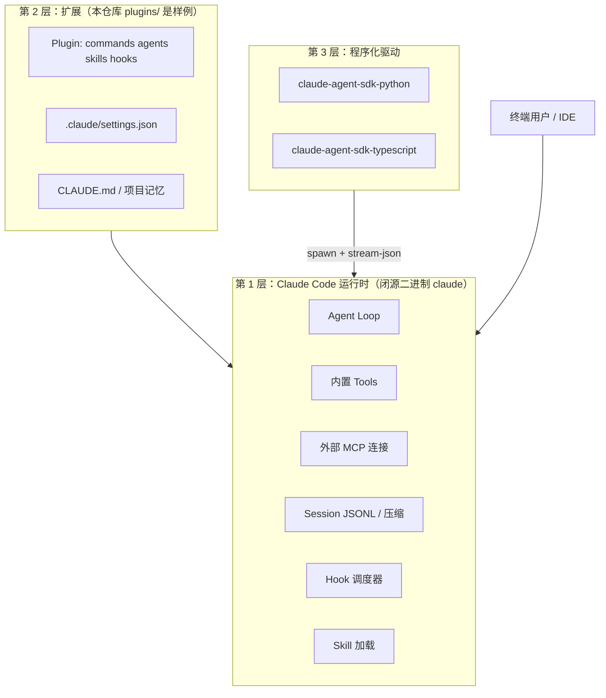

# Claude Code 架构与实现指南

> **版本**: 对齐仓库 `main`（CHANGELOG 至 2.1.x）  
> **分析范围**: 本 GitHub 仓库内**实际存在的文件** + 与 Agent SDK 的协议对照  
> **最后更新**: 2026-06-12

---

## 目录

- [0. 先读：本仓库能分析什么](#0-先读本仓库能分析什么)
- [1. 产品是什么：三层架构](#1-产品是什么三层架构)
- [2. Agent Loop 概念模型](#2-agent-loop-概念模型)
- [3. 三种运行模式](#3-三种运行模式)
- [4. 扩展点总览：Plugin / Hook / Skill / Agent / MCP](#4-扩展点总览)
- [5. Hook 协议（本仓库有完整示例）](#5-hook-协议本仓库有完整示例)
- [6. Skill 与 Slash Command](#6-skill-与-slash-command)
- [7. Subagent（Agent 工具）](#7-subagentagent-工具)
- [8. Settings 与权限](#8-settings-与权限)
- [9. 本仓库 13 个官方插件地图](#9-本仓库-13-个官方插件地图)
- [10. 案例：security-guidance 嵌套 Agent SDK](#10-案例security-guidance-嵌套-agent-sdk)
- [11. 与 claude-agent-sdk-python 的关系](#11-与-claude-agent-sdk-python-的关系)
- [12. 本仓库目录索引](#12-本仓库目录索引)
- [13. 继续深挖的路径](#13-继续深挖的路径)

---

## 0. 先读：本仓库能分析什么

### 0.1 重要结论

**[anthropics/claude-code](https://github.com/anthropics/claude-code) 这个 GitHub 仓库 ≠ Claude Code 核心运行时源码。**

| 在本仓库里 | 不在本仓库里 |
|-----------|-------------|
| 13 个官方**插件**（hooks/agents/skills/commands） | Agent Loop 的 TypeScript/Go 实现 |
| `examples/` 配置与 Hook 示例 | `while (turn < maxTurns)` 主循环源码 |
| `CHANGELOG.md`（行为变更记录，极有价值） | 内置 Read/Bash/Grep 工具实现 |
| `plugin-dev` 里的**扩展机制文档**（SKILL.md） | `package.json` + `src/` 核心 CLI 工程 |
| 少量 Python Hook 实现（hookify、security-guidance） | 完整 stream-json / control 协议规范 |

核心 **`claude` 二进制**通过安装脚本 / Homebrew / PyPI wheel 内 bundle 分发，**不在 git 里**。

### 0.2 那这份文档分析的是什么？

1. **扩展架构** — 插件、Hook、Skill、Subagent 如何挂到运行时上（本仓库有完整样例）。  
2. **Agent Loop 概念模型** — 从 CHANGELOG、插件行为、SDK 协议**反推**运行时逻辑，并标明推断边界。  
3. **可读的 Hook/MCP/Settings 协议** — 来自 `examples/`、`plugins/plugin-dev/`、各插件源码。  
4. **与 Python SDK 的衔接** — `security-guidance/hooks/llm.py` 是唯一「CLI 里再 spawn SDK」的实现级样本。

---

## 1. 产品是什么：三层架构



| 层 | 谁维护 | 你能在哪读源码 |
|----|--------|----------------|
| 运行时 | Anthropic 闭源二进制 | ❌ 不在本 repo；看 [官方文档](https://code.claude.com/docs/en/overview) |
| 扩展 | 你 / 社区 / 本仓库 plugins | ✅ `plugins/`、`examples/` |
| SDK 驱动 | `claude-agent-sdk-*` | ✅  sibling 仓库 `claude-agent-sdk-python` |

### 1.1 和「CLI」命名的关系

- **Claude Code** = 产品名；可执行文件叫 **`claude`**。  
- **CLI** = 你在终端里直接运行它（交互 TUI）。  
- **SDK 模式** = 同一个 `claude` 二进制，加 `--input-format stream-json`，用 stdin/stdout JSONL 驱动，**无 TUI**。  
- 另有一个 **[anthropic-cli](https://github.com/anthropics/anthropic-cli)**（Go），是 **API 命令行客户端**，**不是** Claude Code Agent。

---

## 2. Agent Loop 概念模型

> 以下 Loop 描述来自 CHANGELOG 行为 + 插件表现 + Agent SDK wire 协议；**非本仓库逐行源码**。

### 2.1 一轮（Turn）里发生什么

```text
User 消息进入
  → 组装 system prompt（CLAUDE.md、Skills、Plugin 注入、settings）
  → 调 Anthropic API（带 tools schema）
  → 模型返回 text 和/或 tool_use
  → 若 tool_use：
       → 权限检查（permission_mode / allowedTools / can_use_tool / hooks）
       → PreToolUse Hook（可 deny / 改 input）
       → 执行工具（Read/Bash/MCP/Agent/Skill…）
       → PostToolUse Hook
       → tool_result 追加到上下文
       → 再次调 API … 直到无 tool 或达 max_turns / budget
  → Stop Hook（可 continue 阻止结束）
  → 写 session.jsonl；可能 PreCompact 压缩
  → 输出 result 帧（headless/SDK 模式）
```

### 2.2 职责归属（回答「Loop/MCP/Skill 在谁那里」）

| 能力 | 运行时（二进制） | 扩展配置（本仓库可见） | SDK 侧 |
|------|:----------------:|:----------------------:|:------:|
| LLM↔tool 循环 | ✅ | — | 透传 stdout |
| 内置 tool 执行 | ✅ | `allowedTools` 等 settings | `--allowedTools` flag |
| 外部 MCP 连接 | ✅ | `.mcp.json`、`mcpServers` | `--mcp-config` |
| Skill 发现与注入 | ✅ | `skills/*/SKILL.md` | `initialize.skills` |
| Hook 触发与调度 | ✅ | `hooks.json`、settings hooks | SDK `hooks` + control 回调 |
| Subagent 调度 | ✅ | `agents/*.md` AgentDefinition | `initialize.agents` |
| Session/压缩 | ✅ | resume、fork settings | SessionStore mirror |

### 2.3 从 CHANGELOG 可见的运行时特性（节选）

`CHANGELOG.md` 是理解闭源行为的最佳**侧证**之一：

- **Subagent 嵌套**可达 5 层（2.1.173）。  
- **`max_turns` / `max_budget_usd` / `task_budget`** 在 CLI 侧 enforce。  
- **PreCompact** hook 在上下文压缩前触发。  
- **`--output-format stream-json`** + **`--input-format stream-json`** 为 SDK/headless 模式。  
- **`error_max_turns`** 等：先 emit `result.is_error`，再非零退出（SDK 会替换 ProcessError 文案）。

---

## 3. 三种运行模式

| 模式 | 你怎么启动 | stdin/stdout | 典型场景 |
|------|-----------|--------------|----------|
| **交互 TUI** | 项目目录执行 `claude` | 终端 UI | 日常编码 |
| **Headless 打印** | `claude -p "..."` / print 模式 | 较少交互 | 脚本、CI |
| **SDK stream-json** | Python/TS SDK spawn 子进程 | **NDJSON 双向** | 后端服务、自动化 |

SDK 模式固定 argv 片段（见 `claude-agent-sdk-python` 的 `SubprocessCLITransport._build_command`）：

```text
claude --output-format stream-json --verbose ... --input-format stream-json
```

**为何必须 `--input-format stream-json`**：`security-guidance/hooks/llm.py` 注释说明 — str prompt 会进 argv，Linux 单参数超过 ~128KiB 会 `E2BIG`；改 async iterable prompt 走 stdin 可避免。

---

## 4. 扩展点总览

本仓库 `plugins/README.md` + `plugin-dev/skills/` 是扩展机制的**权威样例**。

### 4.1 标准 Plugin 目录结构

```text
plugin-name/
├── .claude-plugin/plugin.json    # 必需 manifest
├── commands/                     # 斜杠命令 *.md
├── agents/                       # Subagent 定义 *.md
├── skills/skill-name/SKILL.md    # Agent Skills
├── hooks/hooks.json              # 事件钩子
├── hooks/*.py                    # 可选：command hook 脚本
├── .mcp.json                     # 可选：MCP 配置
└── README.md
```

**硬规则**（`plugin-dev/skills/plugin-structure/SKILL.md`）：

- `plugin.json` 必须在 `.claude-plugin/` 下。  
- `commands/`、`agents/`、`skills/`、`hooks/` 必须在**插件根目录**，不能塞进 `.claude-plugin/`。  
- 路径用 `${CLAUDE_PLUGIN_ROOT}` 保证可移植。

### 4.2 扩展点对比

| 扩展点 | 文件形式 | 运行时何时用 | 能否 block tool |
|--------|----------|--------------|:---------------:|
| **Hook** | `hooks.json` + 脚本 | 固定生命周期事件 | ✅ PreToolUse/Stop 等 |
| **Skill** | `SKILL.md` | 模型按需加载领域知识 | ❌ |
| **Agent** | `agents/*.md` frontmatter | 主 Agent 调 Agent tool | 间接 |
| **Command** | `commands/*.md` | 用户 `/xxx` | ❌ |
| **MCP** | `.mcp.json` | 模型调 `mcp__*` 工具 | 权限系统 |

### 4.3 Marketplace

`.claude-plugin/marketplace.json` 注册本仓库 13 个 bundled 插件，`source` 指向 `./plugins/*`。

---

## 5. Hook 协议（本仓库有完整示例）

Hook 是理解「运行时如何介入 Loop」的**最佳切入点** — 协议在文档和示例里是完整的。

### 5.1 支持的事件

来自 `plugins/plugin-dev/skills/hook-development/SKILL.md`：

`PreToolUse`, `PostToolUse`, `PostToolUseFailure`, `UserPromptSubmit`, `Stop`, `SubagentStop`, `SessionStart`, `SessionEnd`, `PreCompact`, `Notification`

### 5.2 Hook 类型

| 类型 | 配置 | 执行体 |
|------|------|--------|
| **command** | `"type": "command", "command": "python3 ..."` | bash/python 读 stdin JSON |
| **prompt** | `"type": "prompt", "prompt": "..."` | 运行时内嵌 LLM 判定 |

### 5.3 stdin 输入格式（公共字段）

```json
{
  "session_id": "abc123",
  "transcript_path": "/path/to/session.jsonl",
  "cwd": "/project",
  "permission_mode": "default",
  "hook_event_name": "PreToolUse"
}
```

**PreToolUse / PostToolUse 额外字段**：`tool_name`, `tool_input`, `tool_result`

### 5.4 输出与 exit code

| exit code | 含义 |
|-----------|------|
| `0` | 成功；stdout 可进 transcript |
| `2` | **阻止**当前操作；stderr 反馈给模型 |
| 其他 | 非阻塞错误 |

**stdout JSON（可选）**：

```json
{
  "continue": true,
  "suppressOutput": false,
  "systemMessage": "给 Claude 的提示"
}
```

### 5.5 源码示例 A：`examples/hooks/bash_command_validator_example.py`

PreToolUse 拦截 Bash：把 `grep` 换成 `rg`。

```python
input_data = json.load(sys.stdin)
tool_name = input_data.get("tool_name", "")
if tool_name != "Bash":
    sys.exit(0)

command = input_data.get("tool_input", {}).get("command", "")
if issues:
    print("• ...", file=sys.stderr)
    sys.exit(2)  # 阻止 tool，stderr 给模型
```

配置片段见该文件头部注释（写入 settings 的 `hooks.PreToolUse`）。

### 5.6 源码示例 B：`plugins/hookify/hooks/pretooluse.py`

- 读 stdin → 按 `tool_name` 分类 bash/file 事件 → 加载 `.claude/hookify.*.local.md` 规则 → `RuleEngine.evaluate_rules` → **stdout 打印 JSON**。  
- **故意 always exit 0** — hook 脚本崩溃不应 block 用户工作流。

### 5.7 源码示例 C：`plugins/ralph-wiggum/hooks/stop-hook.sh`

展示 **Stop Hook 如何「假退出、真继续」**：

1. 读 stdin 得 `transcript_path`。  
2. 若 `.claude/ralph-loop.local.md` 存在且未达 `max_iterations`。  
3. 从 transcript 取最后一轮 assistant 输出，**作为下一轮 user 输入喂回**（自指 loop）。  
4. 用 Stop hook 的 advanced API 阻止 session 结束。

这是「在用户态用 Hook **模拟外层 Loop**」的范例 — 与运行时内置 Loop 不同层。

### 5.8 Plugin hooks.json vs settings.json 格式

| 位置 | 格式 |
|------|------|
| 插件 `hooks/hooks.json` | `{"description": "...", "hooks": {"PreToolUse": [...]}}` |
| 用户 `.claude/settings.json` | `{"PreToolUse": [...]}` 直接顶层 |

---

## 6. Skill 与 Slash Command

### 6.1 Skill（Agent Skills）

目录：`skills/<name>/SKILL.md`，YAML frontmatter 必填 `name`、`description`。

**加载原理**（概念）：

1. 运行时扫描 enabled skills（plugin + project + user）。  
2. `description` 进入 system/tool 可见性 — 模型**按需**调用 `Skill` tool。  
3. 正文是领域工作流；大内容放 `references/` 做 progressive disclosure。

示例：`plugins/frontend-design/skills/frontend-design/SKILL.md`

SDK 侧通过 `ClaudeAgentOptions.skills` + `initialize` 控制 listing；`"all"` 会自动加 `Skill` 到 allowedTools（SDK 源码 `_apply_skills_defaults`）。

### 6.2 Slash Command

`commands/*.md` — YAML frontmatter + Markdown 指令体。

- 用户输入 `/feature-dev` 触发。  
- 可编排多 Agent、多阶段（见 `plugins/feature-dev/commands/`）。  
- 与 Skill 区别：Command 是**显式用户入口**；Skill 是**模型自主选用**的知识包。

---

## 7. Subagent（Agent 工具）

### 7.1 定义方式

`agents/*.md` frontmatter 示例（`plugins/feature-dev/agents/code-architect.md`）：

```yaml
---
name: code-architect
description: Designs feature architectures by analyzing...
tools: Glob, Grep, Read, ...
model: sonnet
color: green
---
```

正文 = 该 subagent 的 system prompt。

### 7.2 运行时行为（概念）

```text
主 Agent 调用 Agent tool（传入 subagent 名 + task）
  → 运行时 spawn 子 loop（独立 transcript：subagents/agent-*.jsonl）
  → SDK 流：TaskStartedMessage → TaskProgressMessage → TaskNotificationMessage
  → SubagentStop Hook
  → 结果返回主 Agent 上下文
```

CHANGELOG：子 agent 可再 spawn 子 agent（最深 5 层）。

### 7.3 SDK 注册

`AgentDefinition` 经 **`initialize` control 请求**注入，**无** CLI argv flag — 见 `claude-agent-sdk-python` 指南 §11。

---

## 8. Settings 与权限

### 8.1 配置层级

官方 hierarchy（见 `examples/settings/README.md`）：

`managed-settings` → `settings.json` → `settings.local.json` → 项目级 ...

本仓库示例：

| 文件 | 用途 |
|------|------|
| `examples/settings/settings-lax.json` | 禁 bypass、禁 marketplace |
| `examples/settings/settings-strict.json` | 严格 deny/ask、禁 WebFetch、仅 managed hooks |
| `examples/settings/settings-bash-sandbox.json` | Bash 沙箱 |
| `examples/mdm/managed-settings.json` | 企业 MDM 模板 |

### 8.2 权限评估顺序（概念）

README + SDK 文档一致：

1. `disallowed_tools`  
2. `allowed_tools`（自动批准列表，**不**从 toolset 移除工具）  
3. `permission_mode`（default / acceptEdits / bypassPermissions / plan …）  
4. `can_use_tool`（SDK）或交互式询问  
5. **PreToolUse Hook** 可再 deny

### 8.3 Sandbox

`settings-bash-sandbox.json` — **仅作用于 Bash tool**，不自动沙箱 Read/Write/MCP（README 明确说明）。

---

## 9. 本仓库 13 个官方插件地图

| 插件 | 学什么 |
|------|--------|
| **plugin-dev** | 扩展机制「教科书」— 7 个 meta-skills |
| **hookify** | 用 markdown 规则 + Python PreToolUse 实现策略 Hook |
| **security-guidance** | 复杂 Hook + **嵌套 Agent SDK**（`llm.py`） |
| **ralph-wiggum** | Stop Hook 实现自指迭代 loop |
| **feature-dev** | Command 编排 + 3 个专业 Agent |
| **code-review / pr-review-toolkit** | 多 Agent 并行审查 |
| **frontend-design** | Skill 范例 |
| **agent-sdk-dev** | `/new-sdk-app` 脚手架命令 |
| **commit-commands** | Git slash commands |
| **explanatory/learning-output-style** | SessionStart Hook 改输出风格 |
| **claude-opus-4-5-migration** | 迁移 Skill |

**推荐精读顺序**：`plugin-dev` → `hookify` → `security-guidance` → `ralph-wiggum` → `feature-dev`

---

## 10. 案例：security-guidance 嵌套 Agent SDK

路径：`plugins/security-guidance/hooks/llm.py`

### 10.1 场景

Stop / PostToolUse 等 Hook 内需要 **LLM 审查 git diff** — 在 Hook 子进程里再 **spawn 一层 Claude Code（经 Python SDK）** 做 agentic 调查。

### 10.2 关键实现点（源码注释提炼）

```python
from claude_agent_sdk import query, ClaudeAgentOptions, AssistantMessage, ResultMessage

async def _once():
    yield {"type": "user", "message": {"role": "user", "content": prompt}}

async for msg in query(prompt=_once(), options=opts):
    ...
```

| 话题 | 源码里的处理 |
|------|-------------|
| 为何 async iterable prompt | 强制 `--input-format stream-json`，避免 Linux argv 128KiB 限制 |
| OAuth vs API key | `_agentic_spawn_env()` 清 `ANTHROPIC_AUTH_TOKEN` 等，防内层 CLI 401 |
| CCR remote fd | 清 `WEBSOCKET_AUTH_FILE_DESCRIPTOR` 等，防 `Control request timeout: initialize` |
| 多阶段 | Stage1 investigate schema → Stage2 汇总（`_FINDINGS_SCHEMA`） |
| 成本 | 读 `ResultMessage.total_cost_usd` / usage |

这是本仓库里**唯一**把「Claude Code → SDK → 再 spawn Claude Code」串起来的长文档级样本。

---

## 11. 与 claude-agent-sdk-python 的关系

```text
你的 Python 服务
    → claude_agent_sdk.query() / ClaudeSDKClient
    → spawn claude（与本仓库插件扩展的同一个二进制）
    → Agent Loop + 加载 plugins/hooks/skills
    → stdout JSONL 回 Python
```

| 话题 | Claude Code（本仓库 + 二进制） | Python SDK |
|------|----------------------------------|------------|
| Loop 实现 | 二进制内 | ❌ |
| Plugin/Hook/Skill | 运行时加载 `plugins/` | 通过 CLI 间接生效 |
| SDK 专属 Hook 回调 | 触发在 CLI | **Python 函数**经 control |
| SDK 内嵌 MCP | CLI 发 `mcp_message` | Python `@tool` 执行 |

详细 SDK 侧协议：[`../claude-agent-sdk-python/docs/CLAUDE_AGENT_SDK_GUIDE.md`](../claude-agent-sdk-python/docs/CLAUDE_AGENT_SDK_GUIDE.md)

---

## 12. 本仓库目录索引

```text
claude-code/
├── plugins/              # 13 个官方插件（扩展架构主体）
├── examples/
│   ├── settings/         # 企业 settings JSON 样例
│   ├── hooks/            # PreToolUse Python 最小示例
│   └── mdm/              # macOS/Windows 部署模板
├── .claude-plugin/
│   └── marketplace.json  # bundled 插件市场清单
├── scripts/              # GitHub Issue 自动化（与 Agent 无关）
├── CHANGELOG.md          # 运行时行为变更（闭源侧证）
├── feed.xml              # CHANGELOG RSS
└── docs/                 # 本文档
```

**没有**：根级 `src/`、`package.json`（CLI 工程）、Agent Loop TypeScript 源码。

---

## 13. 继续深挖的路径

| 目标 | 去哪里 |
|------|--------|
| 扩展 Hook/Plugin/Skill | 本仓库 `plugins/plugin-dev/skills/` |
| Hook stdin/exit code | `examples/hooks/` + `plugin-dev/skills/hook-development/` |
| 企业 settings | `examples/settings/` + `examples/mdm/` |
| SDK wire 协议 | `claude-agent-sdk-python` 源码 + 指南 |
| 闭源 Loop 行为 | [code.claude.com 文档](https://code.claude.com/docs/en/overview) + `CHANGELOG.md` |
| 安装 CLI 二进制 | `curl -fsSL https://claude.ai/install.sh \| bash` 或 Homebrew `claude-code` |

---

**阅读建议**：先 §0 建立预期 → §5 Hook 协议（有源码）→ §2 Loop 概念 → §10 嵌套 SDK 案例 → 需要驱动时读 SDK 指南 §4–§6。
