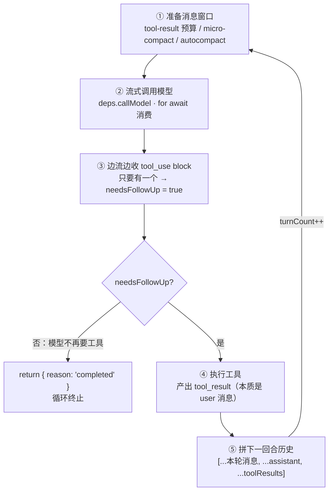
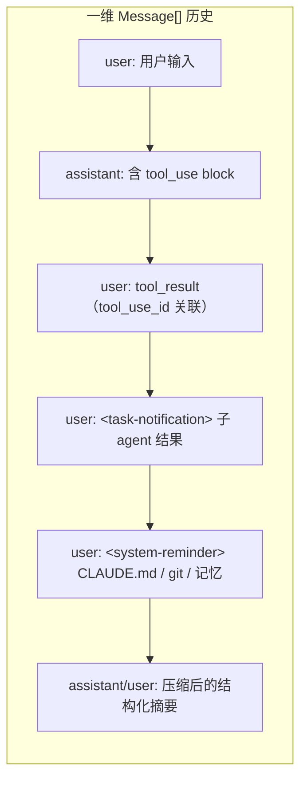
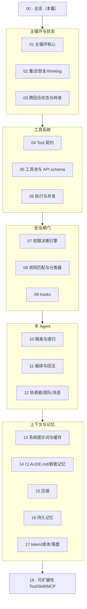

# 00 · 总览：心智模型与全局设计哲学

本篇覆盖：一句话内核 ｜ 三层同心圆架构 ｜ 单回合控制流 ｜ "万物皆消息"原则 ｜ 八条贯穿全局的设计决策 ｜ 18 篇深度讲解的地图
上一篇：（无，本篇是入口）｜ 下一篇：[01-agent-loop-core.md](01-agent-loop-core.md)

> 这套应用就是 **Claude Code 自身的源码**（2026-03-31 经 npm 包内 source map 暴露的公开快照，~1900 文件 / 51 万行，Bun + TypeScript，终端 UI 用 React + Ink）。本套文档逐层拆解它的内核，供学习"如何设计与实现一个 agentic 系统"。所有 `file:line` 引用均相对仓库根，可边看边翻源码。

---

## 一句话内核

> **一个用 async generator 串起来的「思考 → 行动 → 观察」循环，围绕一个极完备的 `Tool` 插件契约展开，每一次工具调用都要穿过「校验 → 权限 → hook → 执行」的安全闸门。**

把 LLM 想成一个只会说话的大脑，它唯一能"做事"的方式是**请求调用工具**。主循环干的就是：把大脑的话流式接出来 → 发现它想调工具 → 替它把工具跑了 → 把结果塞回它嘴边 → 再问一遍。直到它不再要工具。

---

## 三层同心圆

每一层都是一个 `AsyncGenerator<Message>`，外层用 `yield*` 把内层的消息流"接"出来。没有回调地狱，天然背压，模型输出 / 工具执行 / 对外 SDK 消息全从同一根管子流过。

```mermaid
flowchart TB
    subgraph L1["会话/回合编排 · QueryEngine.submitMessage()"]
        L1desc["持有跨回合状态（mutableMessages / usage / 权限拒绝）<br/>组装 system prompt + 上下文 · 翻译成对外 SDK 消息"]
        subgraph L2["Agent 主循环 · query.ts queryLoop() —— 脊柱"]
            L2desc["一次 while 迭代 = 一次模型调用 + 它请求的整批工具"]
            subgraph L3["模型 + 工具 · callModel / StreamingToolExecutor"]
                L3desc["流式 API 调用 · 工具的调度/权限/执行"]
            end
        end
    end
    L1 -.->|"依赖注入接缝：callModel / autocompact / uuid 全可注入 → 主循环脱网可单测"| L2
```

| 层 | 入口 | 职责 | 深入 |
|---|---|---|---|
| 会话/回合编排 | `QueryEngine.submitMessage` | 跨回合状态、组装 prompt、翻译 SDK 消息 | [03](03-state-persistence.md) · [13](13-system-prompt-cache.md) |
| **Agent 主循环** | `query.ts queryLoop()` | 「思考→行动→观察」的 `while(true)` | [01](01-agent-loop-core.md) · [02](02-agent-loop-recovery.md) |
| 模型 + 工具 | `callModel` / `StreamingToolExecutor` | 流式调用；工具调度/权限/执行 | [06](06-tool-execution.md) · [07](07-permission-engine.md) |

---

## 单回合控制流



**唯一的退出信号是「本轮模型还请求工具吗」（`needsFollowUp`），不是 `stop_reason`**——源码注释明确指出 `stop_reason:'tool_use'` 不可靠，所以改用"是否存在 tool_use block"判断回合结束。

---

## 贯穿全局的原则：万物皆消息

整个系统几乎不区分"对话历史"和"状态"——绝大部分跨回合要记住的东西，都被编码成历史里的一条消息。历史始终是一维的 `Message[]`，可随意切片、压缩、持久化。



- `tool_result` → 一条 **user 消息**（带 `tool_use_id`）→ 见 [01](01-agent-loop-core.md)
- 子 agent 完成结果 → 注入的 **`<task-notification>` user 消息** → 见 [11](11-multi-agent-orchestration.md)
- CLAUDE.md / git status / 召回的记忆 → 包在 **`<system-reminder>`** 里的 user 消息（`isMeta`）→ 见 [13](13-system-prompt-cache.md) · [14](14-claudemd-nested-memory.md) · [16](16-persistent-memory.md)
- 上下文压缩后的摘要 → 一条合成消息 → 见 [15](15-compaction.md)

真正**不在**消息数组里、但跨回合持续存在的，是一小撮"控制簿记"（`readFileState`、`loadedNestedMemoryPaths`、`turnCount`、`autoCompactTracking`……）——它们不代表"说过的话"，而是驱动循环怎么走的数据，多数不落盘。详见 [03](03-state-persistence.md)。

---

## 八条贯穿全局的设计决策

把 18 个子系统摊开看，同样几条原则一遍遍出现。**它们才是"为什么好用"的真正答案。**

| | 原则 | 体现 | 深入 |
|---|---|---|---|
| P1 | **Async generator 作脊柱** | 每层都是 `AsyncGenerator<Message>`，`yield*` 组合，共用一根管子、天然背压 | [01](01-agent-loop-core.md) |
| P2 | **循环 + 显式 State，别递归** | 跨迭代状态装进一个类型化对象；`transition` 字段记录"为什么继续" | [01](01-agent-loop-core.md) |
| P3 | **一个不含糊的退出信号** | "还有 tool_use 吗"，而非脆弱的 `stop_reason` | [01](01-agent-loop-core.md) |
| P4 | **万物皆消息** | tool_result / 子 agent 结果 / 记忆都是注入的消息，历史永远线性可切片 | [11](11-multi-agent-orchestration.md) · [14](14-claudemd-nested-memory.md) |
| P5 | **Fail-closed 默认** | 并发/只读/权限/分类器投影，安全相关默认值全取最保守一侧 | [04](04-tool-contract.md) · [07](07-permission-engine.md) |
| P6 | **I/O 边界做依赖注入** | `callModel`/`autocompact`/`uuid` 全可注入；不可变 config 快照 vs 可变 State | [01](01-agent-loop-core.md) |
| P7 | **为 prompt 缓存偏执** | 工具排序、动态边界哨兵、agent 列表进 attachment、落盘决策跨轮冻结 | [05](05-tool-registry-schema.md) · [13](13-system-prompt-cache.md) · [17](17-tokens-cost-spill.md) |
| P8 | **可恢复错误先"扣住"** | 413/输出触顶等错误在决定能否恢复前不流给消费者 | [02](02-agent-loop-recovery.md) |

> **最容易被低估的一点**：这套代码里数量惊人的复杂度，都是在伺候两件"看不见"的事——**prompt 缓存命中率**，和**上下文预算**。功能逻辑往往几十行就写完，真正的工程量在"如何让缓存前缀稳定"和"如何在不丢关键信息的前提下把 token 压下去"。要认真做 agent，请从第一天就把这两件事当一等公民。

---

## 18 篇深度讲解的地图



**建议阅读顺序**：先读本篇建立心智模型 → `01/03`（主循环与状态是一切的地基）→ `04/06`（Tool 契约与执行）→ `07`（安全闸门）→ 其余按兴趣。想直接照着搭原型的，看根目录 `ARCHITECTURE-NOTES.md` 的"分阶段落地"清单。
