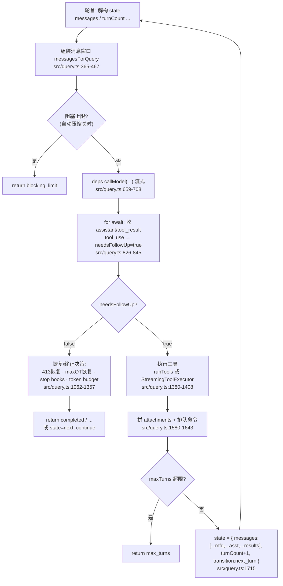
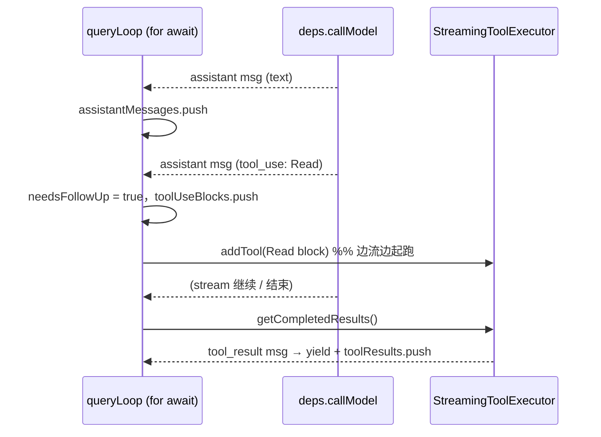
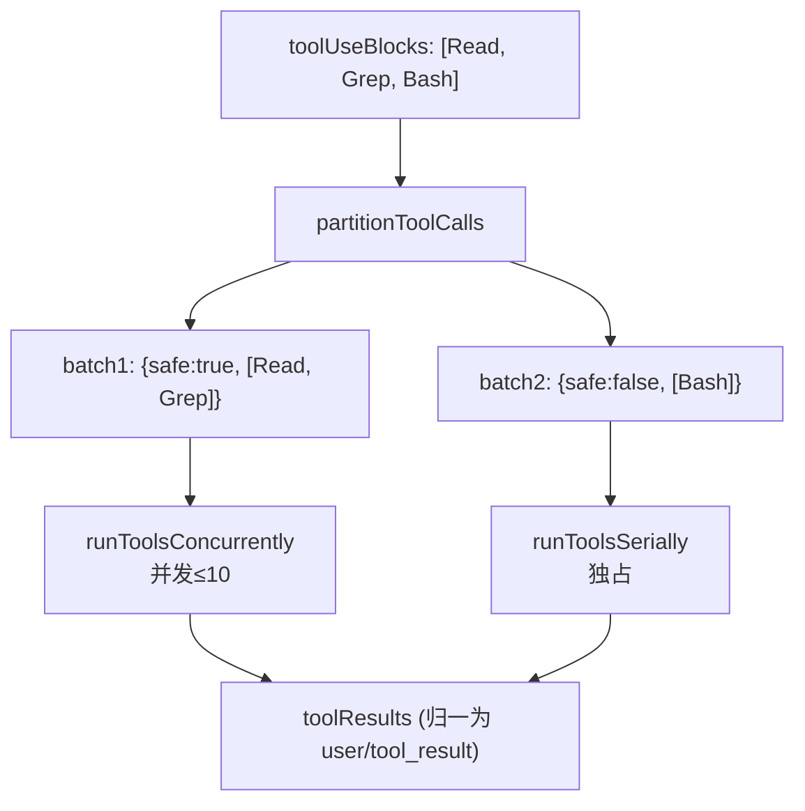
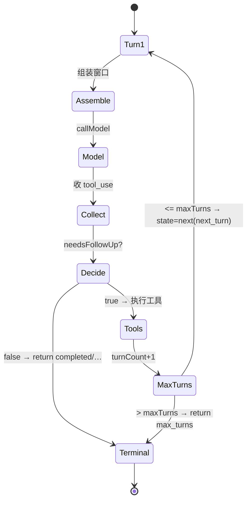
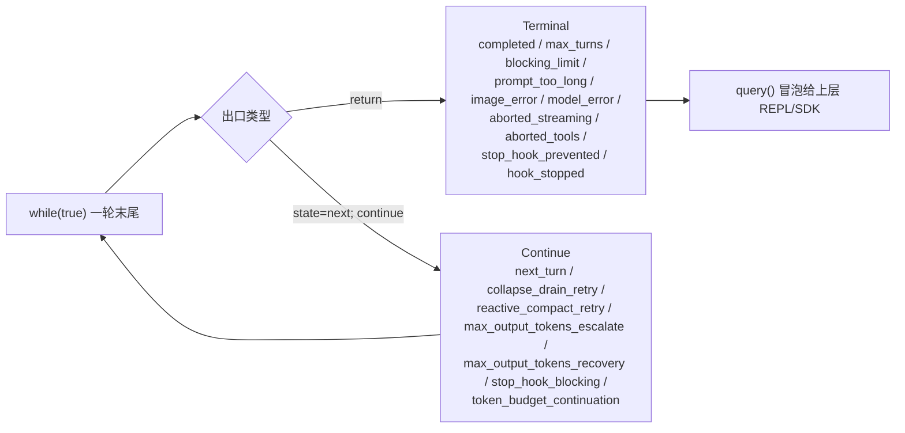

# 01 · Agent 主循环（核心）

本篇覆盖：`query()`/`queryLoop()` 生成器外壳 ｜ `State` 跨迭代可变状态 ｜ `while(true)` 单回合流水线 ｜ 每回合消息窗口组装 ｜ `deps.callModel` 流式消费 ｜ `tool_use` 收集与 `needsFollowUp` ｜ 终止/续跑决策 ｜ `runTools` vs `StreamingToolExecutor` ｜ 下一回合历史拼接与 `maxTurns` ｜ `buildQueryConfig`/`productionDeps` ｜ `Terminal`/`Continue` 出口分类
关键源文件：`src/query.ts`（~1729 行，本篇主体）、`src/query/config.ts`、`src/query/deps.ts`、`src/query/tokenBudget.ts`、`src/query/stopHooks.ts`、`src/services/tools/toolOrchestration.ts`、`src/services/tools/StreamingToolExecutor.ts`、`src/utils/api.ts`（`prependUserContext`）、`src/utils/messages.ts`（消息构造）
上一篇：00-overview.md ｜ 下一篇：02-agent-loop-recovery.md

> 说明：本篇聚焦"正常一回合怎么走通"这条主干——组装上下文 → 调模型 → 收 tool_use → 跑工具 → 拼历史 → 再来一轮。压缩/恢复（autocompact、reactive compact、context collapse、max_output_tokens 恢复、fallback 模型）只在主干里点到为止，细节留给 `02-agent-loop-recovery.md`。
> 注：本快照中 `query.ts` 的类型 import `./query/transitions.js`（`Terminal`/`Continue`）对应的源文件未随快照落地，故这两个类型的字段以 `query.ts` 内所有 `return { reason: ... }` / `transition: { reason: ... }` 的实际取值反推，见最后一节。

---

### query() / queryLoop() —— 生成器外壳与命令生命周期

- **触发 / 记录**：整个 agent 的入口是一个 `async function*`。外层 `query()` 只做两件事：调 `queryLoop()`、在其**正常返回**后逐个把消费掉的排队命令标记 `completed`。真正的循环体在 `queryLoop()`。

```ts
export async function* query(
  params: QueryParams,
): AsyncGenerator<
  StreamEvent | RequestStartEvent | Message | TombstoneMessage | ToolUseSummaryMessage,
  Terminal
> {
  const consumedCommandUuids: string[] = []
  const terminal = yield* queryLoop(params, consumedCommandUuids)
  // Only reached if queryLoop returned normally. Skipped on throw ... and on .return()
  for (const uuid of consumedCommandUuids) {
    notifyCommandLifecycle(uuid, 'completed')
  }
  return terminal
}
```
`src/query.ts:219`（`queryLoop` 定义在 `src/query.ts:241`）

- **使用 / 注入**：`query()` 产出的每个值分两类——`yield` 出去的是"过程增量"（`StreamEvent`、`Message`、`TombstoneMessage`、`ToolUseSummaryMessage`，供 UI/SDK 实时消费），`return` 的是**终止原因** `Terminal`（`{ reason: 'completed' }` 等），供上层判断这一整个 user turn 怎么收场。注意签名里 `AsyncGenerator<Yield, Return>` 的第二个类型参数 `Terminal` 就是 `return` 值类型。

- **为什么（设计意图）**：把"命令生命周期回执"放在 `queryLoop()` **之外**、用 `yield*` 委托，是刻意的——注释点明：只有 `queryLoop` **正常 return** 时才回执 `completed`；`throw`（错误经 `yield*` 向上传播）和调用方 `.return()`（`Return` 完成态同时关掉两个生成器）都会跳过这段。于是"命令被消费了但没回执 completed"这个非对称信号，天然标记了"这一回合失败/被打断"，和 `print.ts` 的 `drainCommandQueue` 语义对齐。

- **示例数据**：`Terminal` 的实际取值全集（据 `query.ts` 内所有 `return { reason }` 反推）：

| reason | 触发点（行） | 含义 |
|---|---|---|
| `completed` | 1264 / 1357 | 模型不再要工具，正常收尾 |
| `max_turns` | 1711 | 达到 `maxTurns` 上限 |
| `blocking_limit` | 646 | 关掉自动压缩时命中硬阻塞 token 上限 |
| `prompt_too_long` | 1175 / 1182 | 413 恢复全部失败 |
| `image_error` | 977 / 1175 | 图片尺寸/媒体错误不可恢复 |
| `model_error` | 996 | 流式过程抛异常（带 `error`） |
| `aborted_streaming` | 1051 | 模型流式期间被打断 |
| `aborted_tools` | 1515 | 工具执行期间被打断 |
| `stop_hook_prevented` | 1279 | stop hook 主动阻止继续 |
| `hook_stopped` | 1520 | 工具 hook 返回 `hook_stopped_continuation` |

- **生命周期**：`query()` 每次调用对应"一个 user turn"（含其内部所有工具往返）。`consumedCommandUuids` 是本次调用的进程内数组，不落盘。

---

### State —— 跨迭代可变状态

- **触发 / 记录**：`queryLoop` 把"回合之间需要携带"的一切收进单个 `State` 对象，入口初始化一次：

```ts
type State = {
  messages: Message[]
  toolUseContext: ToolUseContext
  autoCompactTracking: AutoCompactTrackingState | undefined
  maxOutputTokensRecoveryCount: number
  hasAttemptedReactiveCompact: boolean
  maxOutputTokensOverride: number | undefined
  pendingToolUseSummary: Promise<ToolUseSummaryMessage | null> | undefined
  stopHookActive: boolean | undefined
  turnCount: number
  // Why the previous iteration continued. Undefined on first iteration.
  transition: Continue | undefined
}
```
`src/query.ts:204`（初始化在 `src/query.ts:268`：`turnCount: 1`，其余大多 `undefined`/`0`/`false`）

- **使用 / 注入**：每轮循环体**头部把 `state` 解构成裸名**（`messages`、`turnCount`……），这样回合内部读状态都是短名；要"继续下一轮"时不是逐字段赋值，而是整体 `state = { ... }` 写回一个全新 `State`（源码里 7 个 `const next: State = { ... }` 站点）。唯独 `toolUseContext` 在回合内会被重新赋值（塞 `queryTracking`、`messages`），所以它用 `let` 单独解构：

```ts
let { toolUseContext } = state
const {
  messages, autoCompactTracking, maxOutputTokensRecoveryCount,
  hasAttemptedReactiveCompact, maxOutputTokensOverride,
  pendingToolUseSummary, stopHookActive, turnCount,
} = state
```
`src/query.ts:311`

- **为什么（设计意图）**：注释直说目标是"未来把 `step()` 抽成纯 reducer"——`config`（不可变快照）+ `State`（每轮可变）+ `ToolUseContext`（回合内可变）三层分离，让 `(state, event, config) => state'` 成为可能。整体替换而非 9 处零散赋值，杜绝了"忘了更新某个字段导致状态泄漏到下一轮"的经典 bug；`transition` 字段专门给测试断言"上一轮是哪条恢复路径续的跑"，无需翻消息内容。

- **示例数据**：第一回合入口的 `State` 快照（据 `src/query.ts:268` 结构构造）：

```jsonc
{
  "messages": [ /* 初始 params.messages：user turn 的输入 */ ],
  "toolUseContext": { /* options.tools / abortController / getAppState ... */ },
  "autoCompactTracking": undefined,
  "maxOutputTokensRecoveryCount": 0,
  "hasAttemptedReactiveCompact": false,
  "maxOutputTokensOverride": undefined,
  "pendingToolUseSummary": undefined,
  "stopHookActive": undefined,
  "turnCount": 1,
  "transition": undefined
}
```

一次带工具的回合结束、准备第二轮时，写回的 `State`（据 `src/query.ts:1715` 构造）：

```jsonc
{
  "messages": [ /* ...messagesForQuery, ...assistantMessages, ...toolResults */ ],
  "toolUseContext": { /* toolUseContextWithQueryTracking：刷新了 tools + queryTracking */ },
  "autoCompactTracking": undefined,          // 若本轮触发过 compact 则为 { compacted, turnId, turnCounter, consecutiveFailures }
  "turnCount": 2,                            // turnCount + 1
  "maxOutputTokensRecoveryCount": 0,         // 每个正常回合重置
  "hasAttemptedReactiveCompact": false,      // 每个正常回合重置
  "pendingToolUseSummary": /* Promise<ToolUseSummaryMessage|null> */,
  "maxOutputTokensOverride": undefined,
  "stopHookActive": undefined,               // 透传，不重置
  "transition": { "reason": "next_turn" }
}
```

- **生命周期**：`State` 存活于单次 `query()` 调用（一个 user turn）的多轮循环之间；不落盘。`messages` 里持久的部分由上层 REPL 持有；resume 时是把历史 `Message[]` 作为新的 `params.messages` 重新喂进 `query()`，`State` 从头初始化。

---

### while(true) —— 单回合流水线骨架

- **触发 / 记录**：`queryLoop` 主体是唯一一个 `while (true)`，没有递归——早期版本是递归调用自己，现在改成显式循环 + 整体状态替换。每一轮就是"一个 assistant turn"（一次模型调用 + 其请求的工具）。

```ts
// eslint-disable-next-line no-constant-condition
while (true) {
  let { toolUseContext } = state
  const { messages, /* ... */ turnCount } = state
  // ... 组装上下文 → 调模型 → 收 tool_use → 决策 → 跑工具 → 拼历史 → state = next
}
```
`src/query.ts:307`

- **使用 / 注入**：循环有且只有三种离开方式：`return {reason}`（→ `Terminal`，结束整个 turn）、`continue`（先 `state = next` 再回到轮首，续跑）、`throw`（异常向上传播）。没有 `break`。

- **为什么（设计意图）**：`State` 那节已述——去递归化是为了把每轮变成"纯函数式状态转移"，`continue` 前必写 `state = next`，`return` 直接给终止原因。循环内所有分支要么 `return` 要么 `state=…;continue`，形成闭合。

- **图（一轮 iteration 的数据流）**：



- **生命周期**：单次 `query()` 内循环 N 轮；`turnCount` 从 1 递增。

---

### 每回合消息窗口的组装（messagesForQuery）

- **触发 / 记录**：轮首先把 `state.messages` 切到"最近一次 compact 边界之后"，得到本轮真正要发给模型的窗口 `messagesForQuery`，再经一串**只在需要时才生效**的变换：

```ts
let messagesForQuery = [...getMessagesAfterCompactBoundary(messages)]
// ...
messagesForQuery = await applyToolResultBudget(messagesForQuery, /* contentReplacementState, ... */)
// snip（feature HISTORY_SNIP）
if (feature('HISTORY_SNIP')) { const snipResult = snipModule!.snipCompactIfNeeded(messagesForQuery); messagesForQuery = snipResult.messages; /* ... */ }
// microcompact
const microcompactResult = await deps.microcompact(messagesForQuery, toolUseContext, querySource)
messagesForQuery = microcompactResult.messages
// context collapse（feature CONTEXT_COLLAPSE）
// autocompact
const { compactionResult, consecutiveFailures } = await deps.autocompact(messagesForQuery, toolUseContext, { systemPrompt, userContext, systemContext, toolUseContext, forkContextMessages: messagesForQuery }, querySource, tracking, snipTokensFreed)
if (compactionResult) { /* ... */ messagesForQuery = buildPostCompactMessages(compactionResult) }
```
`src/query.ts:365`（预算 `:379`；snip `:401`；microcompact `:414`；collapse `:440`；autocompact `:454`；compact 落地 `:528-535`）

- **使用 / 注入**：`messagesForQuery` 是本轮 `deps.callModel({ messages: prependUserContext(messagesForQuery, userContext), ... })` 的直接输入（下一节）。变换顺序被注释反复强调是**有意的**：`applyToolResultBudget` 在 microcompact 前跑（cached MC 只按 `tool_use_id` 操作，看不见内容替换，二者正交）；snip/microcompact 在 autocompact 前跑（先做便宜的、保留粒度的裁剪，能压到阈值下就让 autocompact 空转，避免损失细节）。

- **为什么（设计意图）**：把"喂给模型的窗口"与"持久历史 `state.messages`"解耦。`getMessagesAfterCompactBoundary` 保证一旦发生过 compact，模型只看到摘要后的窗口而非全量历史；一层层的 budget/snip/microcompact/collapse 都是"读时投影"，不改 `state.messages`（collapse 的注释：summary 存在 collapse store，REPL 数组不动，`projectView()` 每次入口重放 commit log）。这样 UI/transcript 仍能显示完整历史，而 API 侧只承受压缩后的 token。

- **图（组装管线，全是可选变换）**：


- **生命周期**：`messagesForQuery` 是回合内局部变量，每轮重算。compact 的边界会持久化进历史（后续回合 `getMessagesAfterCompactBoundary` 依赖它）；`taskBudgetRemaining` 是 loop-local，跨 compact 边界累减，故意不放进 `State`（"避免动 7 个 continue 站点"）。

---

### 调用模型：deps.callModel 与流式 for-await

- **触发 / 记录**：模型调用通过依赖注入的 `deps.callModel`（生产实现是 `queryModelWithStreaming`），用 `for await` 消费其产出的流：

```ts
for await (const message of deps.callModel({
  messages: prependUserContext(messagesForQuery, userContext),
  systemPrompt: fullSystemPrompt,
  thinkingConfig: toolUseContext.options.thinkingConfig,
  tools: toolUseContext.options.tools,
  signal: toolUseContext.abortController.signal,
  options: {
    async getToolPermissionContext() { /* ... */ },
    model: currentModel,
    /* fastMode / fallbackModel / querySource / maxOutputTokensOverride / taskBudget ... */
  },
})) {
  // ... 见下一节
}
```
`src/query.ts:659`（`messages` 参数 `:660`；`systemPrompt` `:661`）

- **使用 / 注入**：两个关键 prompt 侧输入在这里定形：
  - `fullSystemPrompt = asSystemPrompt(appendSystemContext(systemPrompt, systemContext))`（`src/query.ts:449`）——`systemContext`（如 `gitStatus`）被拼成 `key: value` 追加到 system prompt 数组尾部。
  - `prependUserContext(messagesForQuery, userContext)`（`src/utils/api.ts:449`）——把 `userContext`（如 `claudeMd`、`userEmail`、`currentDate`）包成**一条 `isMeta:true` 的 user 消息**，插到 `messages` **最前面**，正文是 `<system-reminder>...</system-reminder>`：

```ts
return [
  createUserMessage({
    content: `<system-reminder>\nAs you answer the user's questions, you can use the following context:\n${Object.entries(context)
      .map(([key, value]) => `# ${key}\n${value}`).join('\n')}\n\n      IMPORTANT: this context may or may not be relevant ...\n</system-reminder>\n`,
    isMeta: true,
  }),
  ...messages,
]
```
`src/utils/api.ts:461`（注：`NODE_ENV==='test'` 或 context 为空时原样返回，不注入）

- **为什么（设计意图）**：`callModel` 走 `deps` 注入而非直接 import，是为了测试可替换（`deps.ts` 注释：`callModel`/`autocompact` 在 6–8 个测试文件里都要 mock）。`userContext` 每轮**即时重建并前插**、不进 `state.messages`，保证它永远在窗口最前、且不被 compact 吞掉——它是"环境提醒"而非对话内容。

- **示例数据**：`userContext` 注入后的首条消息（据 `src/utils/api.ts:461` 模板构造；正是你此刻在对话顶部看到的那种块）：

```jsonc
{
  "type": "user",
  "isMeta": true,
  "message": {
    "role": "user",
    "content": "<system-reminder>\nAs you answer the user's questions, you can use the following context:\n# currentDate\nToday's date is 2026-07-04.\n# userEmail\nThe user's email address is xiaolei.lian@outlook.com.\n\n      IMPORTANT: this context may or may not be relevant to your tasks. ...\n</system-reminder>\n"
  }
}
```

- **生命周期**：`fullSystemPrompt`、注入后的 `messages` 都是回合内构造，不落盘。`fallbackModel` 触发时（`FallbackTriggeredError`）会 `currentModel = fallbackModel` 并 `attemptWithFallback` 重试整个流（`src/query.ts:894`），细节见 `02`。

---

### 流式收集 tool_use 与 needsFollowUp

- **触发 / 记录**：`for await` 每收到一条 `assistant` 消息，就 push 进 `assistantMessages`，抽出其中的 `tool_use` block；只要有至少一个 tool_use，就把 `needsFollowUp` 从 `false` 翻成 `true`。这是**唯一的循环续跑信号**：

```ts
if (message.type === 'assistant') {
  assistantMessages.push(message)
  const msgToolUseBlocks = message.message.content.filter(
    content => content.type === 'tool_use',
  ) as ToolUseBlock[]
  if (msgToolUseBlocks.length > 0) {
    toolUseBlocks.push(...msgToolUseBlocks)
    needsFollowUp = true          // ← false→true 的那一行
  }
  if (streamingToolExecutor && !toolUseContext.abortController.signal.aborted) {
    for (const toolBlock of msgToolUseBlocks) {
      streamingToolExecutor.addTool(toolBlock, message)   // 边流边起跑
    }
  }
}
```
`src/query.ts:826`（`needsFollowUp = true` 在 `:834`；声明 `let needsFollowUp = false` 在 `:558`）

- **使用 / 注入**：`needsFollowUp` 在流结束后被 `if (!needsFollowUp)` 消费（`src/query.ts:1062`）——`false` 走终止/恢复分支，`true` 走工具执行分支。`toolUseBlocks` 累积所有待执行工具，交给 `runTools`/`StreamingToolExecutor`。若开了 streaming 执行，工具**在流还没收完时就已 `addTool` 起跑**，并在流循环里顺带 `getCompletedResults()` 把已完成的结果 `yield` 出去、push 进 `toolResults`（`src/query.ts:847-862`）。

- **为什么（设计意图）**：注释直言不用 `stop_reason === 'tool_use'` 判定——"it's not always set correctly"（不可靠）。改为"流里只要出现过 tool_use block 就置位"，是纯内容驱动、与 stop_reason 解耦的稳健判据。`toolUseBlocks` 用独立数组而非从 `assistantMessages` 现算，是为让 streaming 执行器能边收边喂。

- **示例数据**：一条含单个 `tool_use` block 的流式 assistant 消息（据 `AssistantMessage` 结构 `src/utils/messages.ts:386-408` + Anthropic SDK `ToolUseBlock` 构造；真实流式响应里 `stop_reason` 为 `"tool_use"`）：

```jsonc
{
  "type": "assistant",
  "uuid": "b1e7…-…-…",
  "timestamp": "2026-07-04T09:12:33.201Z",
  "requestId": "req_01Xy…",
  "message": {
    "id": "msg_01ABc…",
    "type": "message",
    "role": "assistant",
    "model": "claude-…",
    "stop_reason": "tool_use",
    "stop_sequence": null,
    "container": null,
    "context_management": null,
    "usage": { "input_tokens": 4123, "output_tokens": 78, "cache_read_input_tokens": 3900 },
    "content": [
      { "type": "text", "text": "I'll read the hosts file." },
      {
        "type": "tool_use",
        "id": "toolu_01Read9xQ…",
        "name": "Read",
        "input": { "file_path": "/etc/hosts" }
      }
    ]
  }
}
```
这条消息一到，`msgToolUseBlocks.length === 1` → `needsFollowUp = true`，`toolUseBlocks` 里现在有 `toolu_01Read9xQ…`。

- **图（流式消费的时序）**：



- **生命周期**：`assistantMessages`/`toolResults`/`toolUseBlocks`/`needsFollowUp` 均为回合内局部；fallback 或 streaming fallback 发生时会被整体清空重来（`src/query.ts:725-728`、`904-907`）。

---

### needsFollowUp === false：终止与恢复决策

- **触发 / 记录**：流收完且没有任何 tool_use，进入 `if (!needsFollowUp)` 大分支。它不是直接 return，而是一串**优先级恢复检查**，全部落空才算真正结束：

```ts
if (!needsFollowUp) {
  const lastMessage = assistantMessages.at(-1)
  // 1) 413 恢复：先 context-collapse drain，再 reactive compact（见 02）
  // 2) max_output_tokens 恢复：8k→64k 升配，或注入“继续写”meta 消息重试（见 02）
  // 3) lastMessage 是 API error → executeStopFailureHooks + return completed
  const stopHookResult = yield* handleStopHooks(
    messagesForQuery, assistantMessages, systemPrompt, userContext, systemContext, toolUseContext, querySource, stopHookActive,
  )
  if (stopHookResult.preventContinuation) return { reason: 'stop_hook_prevented' }
  if (stopHookResult.blockingErrors.length > 0) { state = { /* ...+blockingErrors, stopHookActive:true, transition:'stop_hook_blocking' */ }; continue }
  // 4) TOKEN_BUDGET：未到预算 → 注入 nudge 续跑
  return { reason: 'completed' }
}
```
`src/query.ts:1062`（stop hooks `:1267`；token budget `:1308`；两处 `return completed` `:1264`/`:1357`）

- **使用 / 注入**：
  - **stop hooks**：`handleStopHooks` 返回 `{ blockingErrors: Message[], preventContinuation: boolean }`（`src/query/stopHooks.ts:60`）。`preventContinuation` → `return stop_hook_prevented`；`blockingErrors` 非空 → 把这些错误消息追加进历史、置 `stopHookActive:true`、`transition:'stop_hook_blocking'` 后 `continue`（让模型看到 hook 的反馈再答一轮）。
  - **token budget**（`feature('TOKEN_BUDGET')`）：`checkTokenBudget` 返回 `continue`/`stop`（`src/query/tokenBudget.ts:45`）。`continue` 时注入一条 `isMeta` 的 `nudgeMessage`（"你还有预算，继续干"）续跑：

```ts
const decision = checkTokenBudget(budgetTracker!, toolUseContext.agentId, getCurrentTurnTokenBudget(), getTurnOutputTokens())
if (decision.action === 'continue') {
  incrementBudgetContinuationCount()
  state = { messages: [...messagesForQuery, ...assistantMessages, createUserMessage({ content: decision.nudgeMessage, isMeta: true })], /* ... transition:'token_budget_continuation' */ }
  continue
}
```
`src/query.ts:1308`

- **为什么（设计意图）**：注释点出两个反模式。其一：`lastMessage.isApiErrorMessage` 时**跳过 stop hooks 直接 completed**——模型没产出真实回答，让 hook 去评它会造成"error → hook 阻塞 → 重试 → error"的死循环（`src/query.ts:1258`）。其二：stop hook 阻塞续跑时**保留 `hasAttemptedReactiveCompact`**，不重置为 `false`——否则 compact 已跑过仍太长时会陷入"compact → 还太长 → error → hook 阻塞 → compact → …"烧掉上千次 API 调用（`src/query.ts:1292`）。token budget 的 `COMPLETION_THRESHOLD=0.9`、`DIMINISHING_THRESHOLD=500`，`continuationCount>=3` 且本次与上次两次增量都 <500 才判"收益递减"提前停（`src/query/tokenBudget.ts:3-4,59-62`）。

- **示例数据**：`TokenBudgetDecision`（据 `src/query/tokenBudget.ts:22-41` 类型构造）：

```jsonc
// 未到 90% → 继续
{ "action": "continue", "nudgeMessage": "…还剩预算，继续…", "continuationCount": 2, "pct": 61, "turnTokens": 610000, "budget": 1000000 }
// 收益递减 → 停
{ "action": "stop", "completionEvent": { "continuationCount": 4, "pct": 88, "turnTokens": 880000, "budget": 1000000, "diminishingReturns": true, "durationMs": 41200 } }
```

- **生命周期**：`budgetTracker` 存活于单次 `query()`（`createBudgetTracker` 在 loop 前建，`src/query.ts:280`）；`stopHookActive` 通过 `State` 跨轮透传，防止 stop hook 反复触发。

---

### 工具执行：runTools 与 StreamingToolExecutor

- **触发 / 记录**：`needsFollowUp === true` 时进入工具执行。两条实现按 `config.gates.streamingToolExecution` 二选一：streaming 版在流里已 `addTool` 起跑，这里 `getRemainingResults()` 收尾；非 streaming 版在流全收完后一把 `runTools(...)`：

```ts
const toolUpdates = streamingToolExecutor
  ? streamingToolExecutor.getRemainingResults()
  : runTools(toolUseBlocks, assistantMessages, canUseTool, toolUseContext)

for await (const update of toolUpdates) {
  if (update.message) {
    yield update.message
    if (update.message.type === 'attachment' &&
        update.message.attachment.type === 'hook_stopped_continuation') {
      shouldPreventContinuation = true
    }
    toolResults.push(
      ...normalizeMessagesForAPI([update.message], toolUseContext.options.tools).filter(_ => _.type === 'user'),
    )
  }
  if (update.newContext) {
    updatedToolUseContext = { ...update.newContext, queryTracking }
  }
}
```
`src/query.ts:1380`（消费循环 `:1384-1408`）

- **使用 / 注入**：每个 `update.message` 既 `yield` 给 UI，又经 `normalizeMessagesForAPI(...).filter(type==='user')` 归一成 `tool_result` 的 user 消息 push 进 `toolResults`——这是下一节拼历史的原料。`update.newContext` 让工具能修改 `ToolUseContext`（如新建文件后更新 `readFileState`），逐个工具串起来。`hook_stopped_continuation` 附件置 `shouldPreventContinuation`，之后 `return hook_stopped`（`src/query.ts:1519`）。

- **为什么（设计意图）**：`runTools` 的核心是 `partitionToolCalls`——把工具序列切成"单个非并发安全工具"或"连续的只读并发安全工具"批次；并发批用 `runToolsConcurrently`（`all(..., getMaxToolUseConcurrency())`，默认并发 10），非并发批 `runToolsSerially` 串行（`src/services/tools/toolOrchestration.ts:91,152,118`）。并发安全性来自 `tool.isConcurrencySafe(parsedInput)`，抛错则保守当作不安全（`toolOrchestration.ts:99-108`）。StreamingToolExecutor 更激进：工具边流边跑，用 `siblingAbortController`（父 abortController 的子）在某个 Bash 工具报错时**只**杀同批兄弟子进程、不误伤整轮（`StreamingToolExecutor.ts:45-48`）。

- **示例数据**：`Read` 工具产出的 `tool_result` user 消息（据 `yieldMissingToolResultBlocks`/`createUserMessage` 的 `tool_result` 结构 `src/query.ts:135-147` 构造）：

```jsonc
{
  "type": "user",
  "message": {
    "role": "user",
    "content": [
      {
        "type": "tool_result",
        "tool_use_id": "toolu_01Read9xQ…",
        "content": "     1\t127.0.0.1 localhost\n     2\t::1 localhost\n",
        "is_error": false
      }
    ]
  },
  "uuid": "…",
  "timestamp": "2026-07-04T09:12:34.010Z"
}
```
`tool_use_id` 与上一节 assistant 消息里的 `toolu_01Read9xQ…` 精确配对——API 靠这个 id 把结果接回请求。

- **图（并发分批）**：



- **生命周期**：`toolResults`/`updatedToolUseContext` 回合内局部。streaming 执行器在 fallback / streaming fallback 时 `discard()` 并重建，防止旧 `tool_use_id` 的孤儿结果泄漏进重试（`src/query.ts:733-740`、`912-919`）。abort 时必须消费 `getRemainingResults()` 让执行器为排队/在跑工具补齐合成 `tool_result`，否则 tool_use 没有配对结果会让 API 报错（`src/query.ts:1015-1023`）。

---

### 拼接下一回合历史与 turnCount / maxTurns

- **触发 / 记录**：工具跑完、attachments 拼好后，把三段拼成下一轮的 `messages`，`turnCount + 1`，写回 `State` 并回到轮首。这是主干续跑的唯一正常路径：

```ts
const nextTurnCount = turnCount + 1
// Check if we've reached the max turns limit
if (maxTurns && nextTurnCount > maxTurns) {
  yield createAttachmentMessage({ type: 'max_turns_reached', maxTurns, turnCount: nextTurnCount })
  return { reason: 'max_turns', turnCount: nextTurnCount }
}
const next: State = {
  messages: [...messagesForQuery, ...assistantMessages, ...toolResults],
  toolUseContext: toolUseContextWithQueryTracking,
  autoCompactTracking: tracking,
  turnCount: nextTurnCount,
  maxOutputTokensRecoveryCount: 0,
  hasAttemptedReactiveCompact: false,
  pendingToolUseSummary: nextPendingToolUseSummary,
  maxOutputTokensOverride: undefined,
  stopHookActive,
  transition: { reason: 'next_turn' },
}
state = next
```
`src/query.ts:1704`（`maxTurns` 检查 `:1705-1712`；拼历史 `:1715-1727`）

- **使用 / 注入**：`[...messagesForQuery, ...assistantMessages, ...toolResults]` 成为下一轮 `state.messages`，下一轮轮首再经 `getMessagesAfterCompactBoundary` + prepend/append context 变成 API 请求。注意顺序：**先本轮发出去的窗口，再模型的 assistant 回复，最后所有 tool_result/attachment**——注释强调"attachments 必须在工具调用全部结束后再拼，否则 tool_result 与普通 user 消息交错会让 API 报错"（`src/query.ts:1535`）。`toolResults` 里还包含本轮末尾拼进来的 attachments：排队命令快照、内存预取、skill 预取（`src/query.ts:1580-1628`）。

- **为什么（设计意图）**：`maxOutputTokensRecoveryCount` 和 `hasAttemptedReactiveCompact` 在每个**正常回合**重置为 0/false——恢复计数只在"同一次卡住的连续重试"内有意义，正常推进一回合就该清零。`stopHookActive` 反而透传不重置。`nextPendingToolUseSummary` 是本轮工具结束后 fire-and-forget 起的 Haiku 摘要 Promise，塞进下一轮 `State`，在下一轮流式期间（5–30s）才 `await`（`src/query.ts:1054-1060`），把 ~1s 的摘要延迟藏在模型流之下。

- **示例数据**：下一回合 `messages` 数组的形状（据 `src/query.ts:1716` 构造）：

```jsonc
[
  // ...messagesForQuery（本轮发给模型的窗口，含此前所有 user/assistant/tool_result）
  { "type": "assistant", "message": { "stop_reason": "tool_use",
      "content": [ { "type": "text", "text": "I'll read the hosts file." },
                   { "type": "tool_use", "id": "toolu_01Read9xQ…", "name": "Read", "input": { "file_path": "/etc/hosts" } } ] } },
  // ...toolResults：
  { "type": "user", "message": { "role": "user",
      "content": [ { "type": "tool_result", "tool_use_id": "toolu_01Read9xQ…", "content": "…/etc/hosts…", "is_error": false } ] } }
  // 之后可能还有 attachment 消息（排队命令 / 内存预取 / skill 预取）
]
```
不变量：每个 `assistantMessages` 里的 `tool_use.id` 都有一条 `toolResults` 里 `tool_use_id` 相同的 `tool_result` 与之配对（abort/错误路径由 `yieldMissingToolResultBlocks` 补齐 `src/query.ts:123`）。

- **图（回合推进的状态机）**：



- **生命周期**：拼好的 `messages` 是"本轮之前的完整 API 视图"的延续，随 `State` 传递；上层 REPL 把 `yield` 出的每条消息落进 transcript/session 文件用于 resume。

---

### buildQueryConfig 与 productionDeps —— 快照与依赖注入

- **触发 / 记录**：`queryLoop` 入口各调一次：`config` 是入口快照的**不可变** env/statsig 状态，`deps` 是可被测试覆盖的 I/O 依赖（默认 `productionDeps()`）：

```ts
const deps = params.deps ?? productionDeps()
// ...
const config = buildQueryConfig()
```
`src/query.ts:263`（`config` 在 `:295`）

```ts
export function buildQueryConfig(): QueryConfig {
  return {
    sessionId: getSessionId(),
    gates: {
      streamingToolExecution: checkStatsigFeatureGate_CACHED_MAY_BE_STALE('tengu_streaming_tool_execution2'),
      emitToolUseSummaries: isEnvTruthy(process.env.CLAUDE_CODE_EMIT_TOOL_USE_SUMMARIES),
      isAnt: process.env.USER_TYPE === 'ant',
      fastModeEnabled: !isEnvTruthy(process.env.CLAUDE_CODE_DISABLE_FAST_MODE),
    },
  }
}
```
`src/query/config.ts:29`

```ts
export function productionDeps(): QueryDeps {
  return { callModel: queryModelWithStreaming, microcompact: microcompactMessages, autocompact: autoCompactIfNeeded, uuid: randomUUID }
}
```
`src/query/deps.ts:33`

- **使用 / 注入**：`config.gates.streamingToolExecution` 决定用 StreamingToolExecutor 还是 `runTools`（`src/query.ts:561`）；`config.gates.emitToolUseSummaries` 决定是否起 Haiku 摘要（`src/query.ts:1416`）；`config.gates.isAnt` 决定是否挂 `dumpPromptsFetch`（`src/query.ts:588`）。`deps.callModel/microcompact/autocompact/uuid` 分别在调模型、窗口组装处被调用。

- **为什么（设计意图）**：`QueryConfig` 注释说明目的是"把不可变值从每轮 `State` 和可变 `ToolUseContext` 里分出来，让未来抽 `step()` 纯 reducer 变得可行——`(state, event, config)` 里 config 是纯数据"。**故意排除 `feature()` gate**：那些是 bundler tree-shaking 边界，必须内联在守卫处才能死代码消除。`deps` 注释解释注入点：最常被 mock 的 `callModel`/`autocompact` 各在 6–8 个测试文件里被 spy，注入 fake 比 per-module spyOn 干净；用 `typeof fn` 让签名自动跟实现同步；作用域刻意窄（4 个）以先验证模式。

- **示例数据**：`QueryConfig` 一次快照（据 `src/query/config.ts:15-27` 类型构造）：

```jsonc
{
  "sessionId": "0ef6a29f-…",
  "gates": {
    "streamingToolExecution": true,
    "emitToolUseSummaries": false,
    "isAnt": true,
    "fastModeEnabled": true
  }
}
```

- **生命周期**：`config` 每次 `query()` 快照一次、整轮循环复用（statsig 用 `_CACHED_MAY_BE_STALE` 变体，"每次 query 快照一次"仍在既有 staleness 契约内）；`deps` 同理，进程级实现，测试可 per-call 覆盖。

---

### Terminal / Continue —— 循环出口与续跑分类

- **触发 / 记录**：这两个 union 是主循环的"出口语言"。`Terminal`（`return { reason }`）终结整个 user turn；`Continue`（写进 `state.transition`，随后 `continue`）记录"上一轮为什么续跑"。本快照未含 `./query/transitions.ts`，下表据 `query.ts` 内实际字面量整理：

- **使用 / 注入**：`Terminal` 由 `query()`/`queryLoop()` 的 `return` 冒泡给上层；`Continue` 只写进下一轮 `State.transition`，供恢复逻辑判前一步（如 413 恢复用 `state.transition?.reason !== 'collapse_drain_retry'` 判"是否已 drain 过"，`src/query.ts:1092`）和测试断言。

- **示例数据**：`Continue.reason` 全集（据 7 个 `transition: { reason }` 站点）：

| reason | 站点（行） | 语义 | 携带字段 |
|---|---|---|---|
| `next_turn` | 1725 | 正常推进下一回合 | — |
| `collapse_drain_retry` | 1109 | 413 后排空 context-collapse 重试 | `committed` |
| `reactive_compact_retry` | 1162 | 413/媒体错误后整段 reactive compact 重试 | — |
| `max_output_tokens_escalate` | 1217 | 8k→64k 升配同请求重试 | — |
| `max_output_tokens_recovery` | 1247 | 注入"继续写"meta 消息多轮恢复 | `attempt` |
| `stop_hook_blocking` | 1302 | stop hook 返回阻塞错误后重试 | — |
| `token_budget_continuation` | 1338 | 未耗预算，注入 nudge 续跑 | — |

- **图（出口分类）**：



- **为什么（设计意图）**：把"续跑原因"物化成 `Continue` 存进 `State`，而非用散落的布尔标志，是"去递归 + 可测试"设计的收尾——`transition` 字段的注释明说是"让测试断言恢复路径触发过，而无需检查消息内容"。`next_turn` 与六种恢复 reason 并列，使"正常推进"和"卡住重试"在类型层面一视同仁，都走 `state = next; continue` 这一条闭合路径。

- **生命周期**：`Terminal` 是 `query()` 的返回值，随即被上层用于结束 turn / 决定是否回执命令 `completed`；`Continue` 仅活在相邻两轮之间。

---

（恢复路径——autocompact / microcompact / reactive compact / context collapse / max_output_tokens 升配与多轮恢复 / 模型 fallback / abort 处理——的完整机制见下一篇 `02-agent-loop-recovery.md`。）
