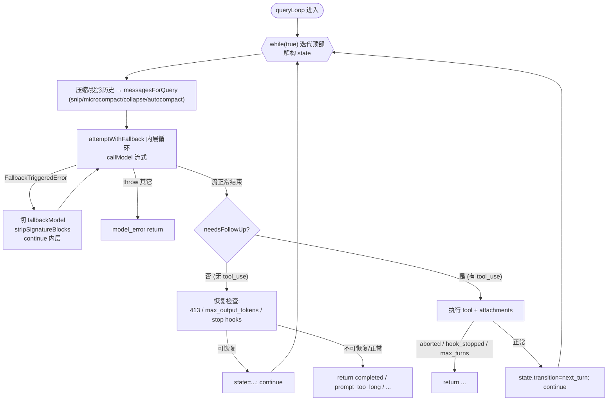
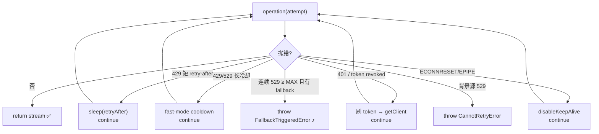
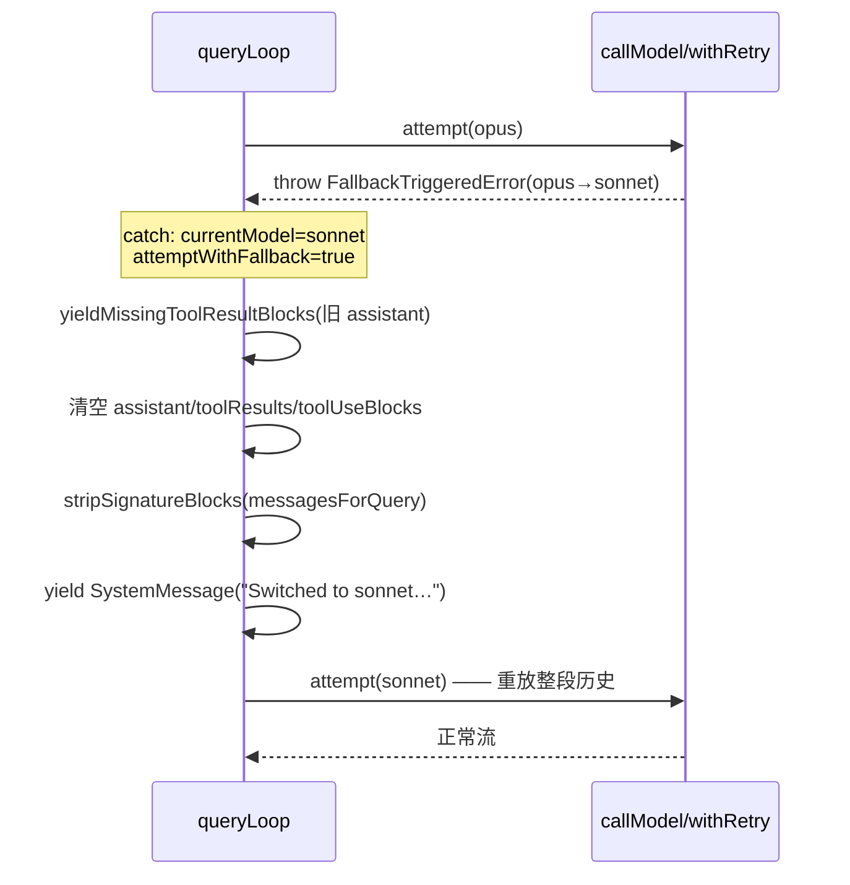
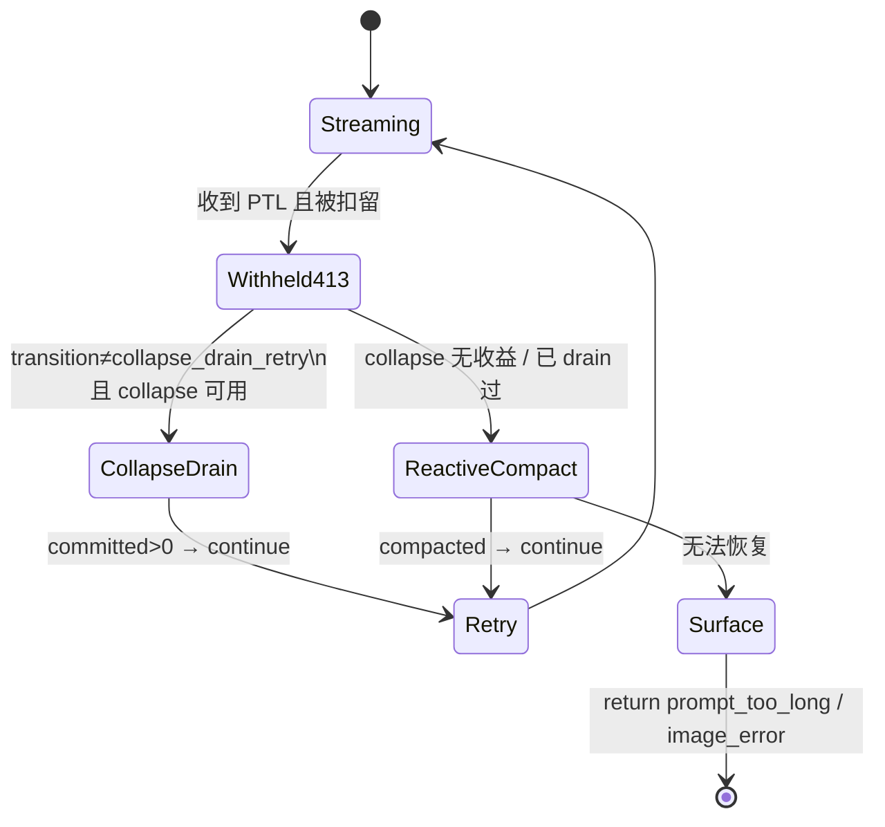
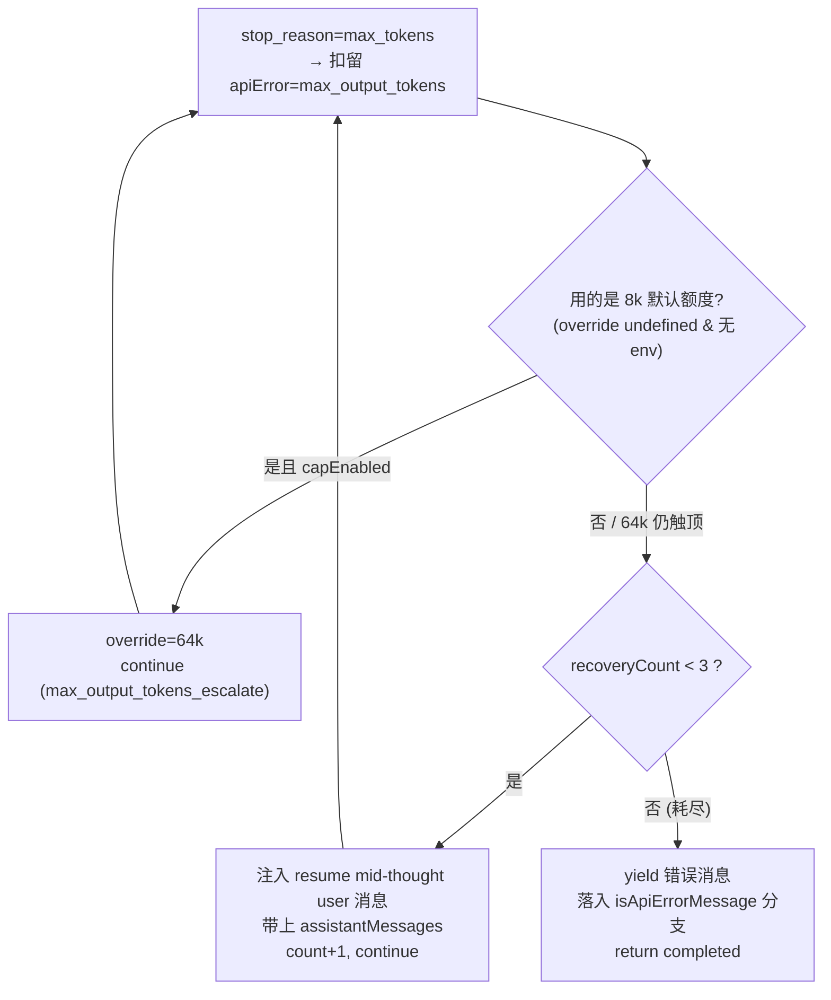
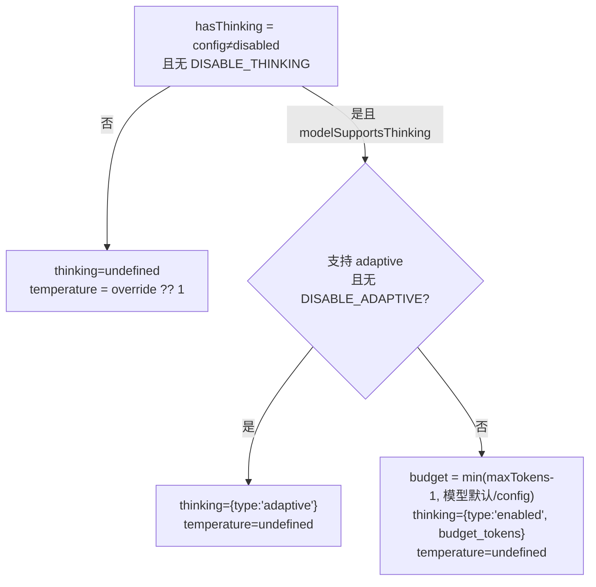
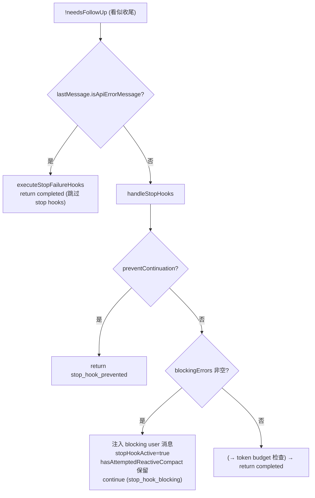
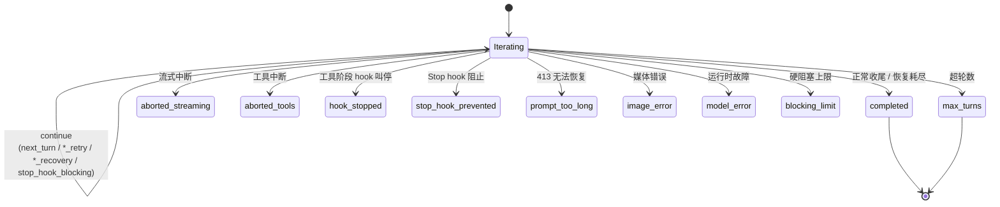

# 02 · Agent 主循环（重试 / 恢复 / thinking / 终止）

本篇覆盖：`queryLoop` 的 State/transition/Terminal 骨架 ｜ `withRetry` 底层重试与 529/认证/超时 ｜ 模型 fallback（`FallbackTriggeredError`）与 `stripSignatureBlocks` ｜ 流式→非流式 fallback 与 tombstone 孤儿消息 ｜ `yieldMissingToolResultBlocks` 配对修复 ｜ prompt-too-long/413 反应式恢复 ｜ `max_output_tokens` 升档 + resume mid-thought ｜ thinking 规则/adaptive-budget 选择/temperature ｜ Stop hooks 阻塞重注入与 death-spiral 防护 ｜ Terminal reason 全枚举
关键源文件：`src/query.ts`、`src/services/api/claude.ts`、`src/services/api/withRetry.ts`、`src/utils/messages.ts`、`src/services/api/errors.ts`、`src/utils/context.ts`、`src/query/stopHooks.ts`
上一篇：01-agent-loop-core.md ｜ 下一篇：03-state-persistence.md

---

整个 agent 主循环是 `queryLoop`（`src/query.ts:241`）里的**一个** `while (true)`（`:307`），没有递归。每次迭代做三件事：把历史压缩/投影成 `messagesForQuery` → 调 `deps.callModel` 流式拿模型响应 → 执行 tool。迭代之间靠一个可变的 `State` 对象承接（`:204-217`），循环体在顶部把它解构成裸名变量（`:308-321`）。

所有"继续下一轮"的地方都写 `state = { ... }; continue`，其中 `transition` 字段记录了**这一轮是被什么触发继续的**（`next_turn` / `reactive_compact_retry` / `max_output_tokens_recovery` …）；所有"结束"的地方都 `return { reason: ... }`，返回类型是 `Terminal`。本篇讲的"重试/恢复"全部是若干种特殊的 `continue`，而"终止"就是那十来个 `return`。



下面逐个机制展开。三套"恢复"（fallback、413、max_output_tokens）与两套"重试"（withRetry、attemptWithFallback）是本章主线，thinking 与 stop hooks 是穿插其中的两个横切关注点。

---

### withRetry：底层网络重试与模型 fallback 的触发点

- **触发 / 记录**：`callModel` 内部对每次 API attempt 都包在 `withRetry` 生成器里。它禁用了 SDK 自带重试（`maxRetries: 0`），自己实现一个 `for (let attempt = 1; attempt <= maxRetries + 1; attempt++)` 循环，逐类错误决定"重试 / 冷却 / 抛 fallback / 放弃"。

```ts
const generator = withRetry(
  () =>
    getAnthropicClient({
      maxRetries: 0, // Disabled auto-retry in favor of manual implementation
      model: options.model,
      fetchOverride: options.fetchOverride,
      source: options.querySource,
    }),
  async (anthropic, attempt, context) => { /* 发一次流式请求 */ },
  { model: options.model, fallbackModel: options.fallbackModel, thinkingConfig, signal, querySource: options.querySource },
)
```
`src/services/api/claude.ts:1778`

- **使用 / 注入**：`withRetry` 是 `AsyncGenerator<SystemAPIErrorMessage, T>`——它 **yield 中间的错误提示消息**（用户能看到"正在重试"之类），**return 最终的成功结果**（这里是流对象 `Stream<...>`）。`callModel` 用一个 `do { e = await generator.next() } while (!e.done)` 把中间错误消息透传出去，最后拿 `e.value` 当作真正的 stream（`claude.ts:1849-1857`）。关键分叉：当连续 529（过载）达到 `MAX_529_RETRIES` 且配置了 `fallbackModel` 时，它**不是**继续重试，而是 `throw new FallbackTriggeredError(...)`——把"换模型"这件事**上抛给 `query.ts` 处理**，因为换模型要重放整段历史、要清 tool_use，withRetry 这一层看不到那些状态。

```ts
if (consecutive529Errors >= MAX_529_RETRIES) {
  if (options.fallbackModel) {
    logEvent('tengu_api_opus_fallback_triggered', { /* ... */ })
    // Throw special error to indicate fallback was triggered
    throw new FallbackTriggeredError(options.model, options.fallbackModel)
  }
  // ... 否则对 external 用户抛 CannotRetryError
}
```
`src/services/api/withRetry.ts:335-350`

- **为什么（设计意图）**：把"可以就地重试的错误"（短 `retry-after` 的 429、fast-mode 冷却、stale keep-alive socket、认证 401/403 刷 token）和"必须换模型才能恢复的错误"（Opus 持续过载）分层。前者在 withRetry 里 `continue` 消化掉，用户无感；后者用一个专门的 `Error` 子类冒泡到主循环。注释点明了这条边界：*"FallbackTriggeredError must propagate to query.ts, which performs the …"*（`claude.ts:2599`）。认证错误的处理也在这层——401/token-revoked 会强制 `handleOAuth401Error` 刷新后 `getClient()` 再试（`withRetry.ts:240-251`）。

- **示例数据**：`FallbackTriggeredError` 的形状（据 `withRetry.ts:160-168` 构造）：

```jsonc
// （示例，据源码构造）new FallbackTriggeredError('claude-opus-4-…', 'claude-sonnet-4-…')
{
  "name": "FallbackTriggeredError",
  "message": "Model fallback triggered: claude-opus-4-… -> claude-sonnet-4-…",
  "originalModel": "claude-opus-4-…",
  "fallbackModel": "claude-sonnet-4-…"
}
```

- **图**：



- **生命周期**：`withRetry` 作用域是**单次 API attempt 的重试簇**，进程内不持久化。`consecutive529Errors` 可通过 `initialConsecutive529Errors` 从上一次（如流式失败转非流式）携带过来，让"总 529 预算"跨流式/非流式一致（`claude.ts:2559`）。

---

### 模型 Fallback：`FallbackTriggeredError` → `attemptWithFallback` 重试

- **触发 / 记录**：主循环里有一个专门的内层 `while (attemptWithFallback)`（`query.ts:654`）。正常情况下 `attemptWithFallback` 一进去就被置 `false`，只跑一遍。当 `callModel` 抛出 `FallbackTriggeredError` 且 `fallbackModel` 存在时，`catch` 把它翻回 `true` 并 `continue` 内层：

```ts
} catch (innerError) {
  if (innerError instanceof FallbackTriggeredError && fallbackModel) {
    // Fallback was triggered - switch model and retry
    currentModel = fallbackModel
    attemptWithFallback = true

    // Clear assistant messages since we'll retry the entire request
    yield* yieldMissingToolResultBlocks(assistantMessages, 'Model fallback triggered')
    assistantMessages.length = 0
    toolResults.length = 0
    toolUseBlocks.length = 0
    needsFollowUp = false
    // ... 丢弃 streamingToolExecutor 里的半成品结果、重建 executor
    toolUseContext.options.mainLoopModel = fallbackModel
```
`src/query.ts:894-922`

- **使用 / 注入**：换模型后要**重放整段 `messagesForQuery`**给新模型。这里有一个关键的历史清洗——`stripSignatureBlocks`：

```ts
// Thinking signatures are model-bound: replaying a protected-thinking
// block (e.g. capybara) to an unprotected fallback (e.g. opus) 400s.
// Strip before retry so the fallback model gets clean history.
if (process.env.USER_TYPE === 'ant') {
  messagesForQuery = stripSignatureBlocks(messagesForQuery)
}
```
`src/query.ts:924-929`

`stripSignatureBlocks` 遍历 assistant 消息，滤掉所有 `thinking` / `redacted_thinking` block（以及 `CONNECTOR_TEXT` 开启时的 connector_text block），只有真的删了东西才返回新数组（`src/utils/messages.ts:5066-5099`）。之后还 `yield createSystemMessage("Switched to … due to high demand for …", 'warning')`（`query.ts:945-948`）让用户看到降级提示。

- **为什么（设计意图）**：thinking block 的 `signature` 是**模型绑定**的加密签名，A 模型产生的签名回放给 B 模型会 400（注释直说 *"Thinking signatures are model-bound … Strip before retry"*）。而且换模型等于**整个请求重来**，之前那次流式已 push 进 `assistantMessages` 的半成品（可能含 tool_use）必须清空，否则会出现"有 tool_use 没配对 tool_result"或 id 错位的 orphan tool_result。所以这段做了两件事：清签名、清半成品。注意 `stripSignatureBlocks` 目前门控在 `USER_TYPE === 'ant'`。

- **示例数据**：一个带签名的 thinking block（据 `claude.ts:2030-2037`、`2127-2147` 的累积逻辑构造，`signature` 由 `signature_delta` 累积、`thinking` 由 `thinking_delta` 累积）：

```jsonc
// （示例，据源码构造）stripSignatureBlocks 会把下面这个 block 整个删掉
{
  "type": "thinking",
  "thinking": "The user asked me to refactor the retry loop. Let me first check…",
  "signature": "EqoBCkgIBBABGAIiQC…（模型绑定的 base64 加密签名）…"
}
// redacted 变体（同样被删）：
{ "type": "redacted_thinking", "data": "Encd…（不可读的加密载荷）…" }
```

- **图**：



- **生命周期**：`attemptWithFallback` 是**单轮迭代内**的局部 flag（每次迭代顶部重建）。`currentModel` 也是迭代内变量，但 `toolUseContext.options.mainLoopModel = fallbackModel` 是**跨迭代**的——一旦降级，后续 turn 都用 fallback 模型。

---

### 流式 → 非流式 fallback 与 tombstone 孤儿消息

- **触发 / 记录**：`callModel` 里流式请求若中途出错（代理返回非 SSE、只发了 `message_start` 就断、idle watchdog 超时等），会**退到非流式**再试一遍。退回时调用主循环传下来的回调 `onStreamingFallback`，主循环用它把一个 `streamingFallbackOccured` 布尔翻真：

```ts
onStreamingFallback: () => {
  streamingFallbackOccured = true
},
```
`src/query.ts:678-680`

在 `claude.ts` 一侧，进入非流式前先置 `didFallBackToNonStreaming = true` 并触发回调：

```ts
didFallBackToNonStreaming = true
if (options.onStreamingFallback) {
  options.onStreamingFallback()
}
// ... 随后 yield* executeNonStreamingRequest(...)  （claude.ts:2551, 定义在 :818）
```
`src/services/api/claude.ts:2508-2511`

- **使用 / 注入**：`streamingFallbackOccured` 一旦为真，主循环在 **for-await 收到非流式的最终消息那一刻**，先给上一段流式已经 push 进 `assistantMessages` 的每条消息发一个 **tombstone**，再把三个累加数组清零：

```ts
if (streamingFallbackOccured) {
  // Yield tombstones for orphaned messages so they're removed from UI and transcript.
  // These partial messages (especially thinking blocks) have invalid signatures
  // that would cause "thinking blocks cannot be modified" API errors.
  for (const msg of assistantMessages) {
    yield { type: 'tombstone' as const, message: msg }
  }
  logEvent('tengu_orphaned_messages_tombstoned', { orphanedMessageCount: assistantMessages.length, /* ... */ })

  assistantMessages.length = 0
  toolResults.length = 0
  toolUseBlocks.length = 0
  needsFollowUp = false
  // ... streamingToolExecutor.discard() + 重建
}
```
`src/query.ts:712-740`

`TombstoneMessage` 是 `query` 生成器声明的产出类型之一（`:225`），下游 UI / transcript 收到后把对应 message 从界面和记录里抹掉。

- **为什么（设计意图）**：流式失败到一半，可能已经 yield 出去、也已 push 进 `assistantMessages` 一些**残缺的 block**——尤其是 thinking block，它们的 `signature` 是无效/不完整的。如果不清理，非流式那次的完整响应会和这些残片并存，回放给 API 时会报 *"thinking blocks cannot be modified"*（注释原话）。tombstone 的作用就是把这些孤儿从 UI 与 transcript 双向删除，`assistantMessages.length = 0` 则保证下面 `assistantMessages.push` 拿到的是干净起点。这和模型 fallback 的清理是**同构**的两套逻辑（一个针对换模型，一个针对换传输模式）。

- **示例数据**：tombstone 消息形状（据 `query.ts:717` 的字面量构造）：

```jsonc
// （示例，据源码构造）
{ "type": "tombstone", "message": { /* 被作废的那条 AssistantMessage 原样引用 */ } }
```

- **图**：


- **生命周期**：`streamingFallbackOccured` 是**单次 API attempt** 局部；tombstone 是**持久化影响**（写进 transcript 的删除标记），resume 时看到的历史里这些孤儿已经不存在。

---

### `yieldMissingToolResultBlocks`：tool_use / tool_result 配对修复

- **触发 / 记录**：Anthropic API 要求每个 `tool_use` block 必须有配对的 `tool_result`，否则回放整段历史时 400。凡是"已经发出 tool_use 但接下来不会正常执行 tool"的路径，都要补发合成的 error tool_result。这个生成器就是干这个的：

```ts
function* yieldMissingToolResultBlocks(assistantMessages: AssistantMessage[], errorMessage: string) {
  for (const assistantMessage of assistantMessages) {
    const toolUseBlocks = assistantMessage.message.content.filter(c => c.type === 'tool_use') as ToolUseBlock[]
    for (const toolUse of toolUseBlocks) {
      yield createUserMessage({
        content: [{ type: 'tool_result', content: errorMessage, is_error: true, tool_use_id: toolUse.id }],
        toolUseResult: errorMessage,
        sourceToolAssistantUUID: assistantMessage.uuid,
      })
    }
  }
}
```
`src/query.ts:123-149`

- **使用 / 注入**：它变成一条条 **`user` 消息**（内含 `is_error: true` 的 `tool_result` block），被三处调用：模型 fallback 清理前（`:900`，errorMessage `'Model fallback triggered'`）、`callModel` 意外 throw 的兜底 catch（`:984`，用真实 `errorMessage`）、以及非 streaming-executor 的用户中断路径（`:1025`，`'Interrupted by user'`）。这些 tool_result 直接进入下一次发给模型的 messages，凑齐配对。

- **为什么（设计意图）**：注释点破了兜底路径的意图——*"queryModelWithStreaming should not throw errors but instead yield them as synthetic assistant messages. However if it does throw … we may end up in a state where we have already emitted a tool_use block but will stop before emitting the tool_result."*（`:980-983`）。缺配对会让**下一次请求**直接 400，所以宁可补一个 `is_error` 的假结果保证结构完整。

- **示例数据**：

```jsonc
// （示例，据源码构造）为一个 orphan tool_use 合成的 user 消息
{
  "type": "user",
  "message": { "role": "user", "content": [
    { "type": "tool_result", "content": "Model fallback triggered", "is_error": true, "tool_use_id": "toolu_01ABC…" }
  ]},
  "toolUseResult": "Model fallback triggered"
}
```

- **生命周期**：单次调用内展开，产出的消息随主消息流持久化。

---

### prompt-too-long / 413 反应式恢复（withheld → collapse drain → reactive compact）

- **触发 / 记录**：当上下文超限，模型侧会返回一个 `isApiErrorMessage` 且文本以 `'Prompt is too long'` 开头的 assistant 消息（`isPromptTooLongMessage`，`src/services/api/errors.ts:62-77`）。这类"可恢复错误"在流式循环里会被**扣留（withheld）**——push 进 `assistantMessages` 供后面检查，但**不 yield 给 SDK 消费者**：

```ts
let withheld = false
if (feature('CONTEXT_COLLAPSE')) {
  if (contextCollapse?.isWithheldPromptTooLong(message, isPromptTooLongMessage, querySource)) withheld = true
}
if (reactiveCompact?.isWithheldPromptTooLong(message)) withheld = true
if (mediaRecoveryEnabled && reactiveCompact?.isWithheldMediaSizeError(message)) withheld = true
if (isWithheldMaxOutputTokens(message)) withheld = true
if (!withheld) { yield yieldMessage }
```
`src/query.ts:799-825`

- **使用 / 注入**：流式结束、`!needsFollowUp`（没有 tool_use）时，检查最后一条消息是否是被扣的 413。若是，走**两级恢复**——先 collapse drain（便宜，保留细粒度上下文），失败再 reactive compact（整段摘要）：

```ts
if (isWithheld413) {
  if (feature('CONTEXT_COLLAPSE') && contextCollapse &&
      state.transition?.reason !== 'collapse_drain_retry') {
    const drained = contextCollapse.recoverFromOverflow(messagesForQuery, querySource)
    if (drained.committed > 0) {
      state = { messages: drained.messages, /* ... */ transition: { reason: 'collapse_drain_retry', committed: drained.committed } }
      continue
    }
  }
}
if ((isWithheld413 || isWithheldMedia) && reactiveCompact) {
  const compacted = await reactiveCompact.tryReactiveCompact({ hasAttempted: hasAttemptedReactiveCompact, /* ... */ })
  if (compacted) {
    const postCompactMessages = buildPostCompactMessages(compacted)
    for (const msg of postCompactMessages) yield msg
    state = { messages: postCompactMessages, hasAttemptedReactiveCompact: true, /* ... */ transition: { reason: 'reactive_compact_retry' } }
    continue
  }
  // No recovery — surface the withheld error and exit.
  yield lastMessage
  void executeStopFailureHooks(lastMessage, toolUseContext)
  return { reason: isWithheldMedia ? 'image_error' : 'prompt_too_long' }
}
```
`src/query.ts:1085-1175`

collapse drain 成功时消息变成 `drained.messages`（保留细粒度历史）；reactive compact 成功时变成 `buildPostCompactMessages(compacted)`（一段摘要 user 消息 + attachments）。两者都是 `continue` 回循环顶部重发。

- **为什么（设计意图）**：扣留的核心动机在 `isWithheldMaxOutputTokens` 的注释里说得最清楚（413 同理）——*"Yielding early leaks an intermediate error to SDK callers (e.g. cowork/desktop) that terminate the session on any `error` field — the recovery loop keeps running but nobody is listening."*（`:166-172`）。即：SDK 消费者一见 `error` 字段就杀会话，所以必须等到确定恢复不了才把错误吐出去。两级顺序也有讲究：collapse 保留粒度、只在"上一轮不是 collapse_drain_retry"时才试（`state.transition?.reason` 守卫防止死循环），失败才 fallback 到破坏性更大的整段摘要。恢复失败时**故意不走 stop hooks**（`:1168-1172`），注释警告那会造成 *"death spiral: error → hook blocking → retry → error"*。

- **示例数据**：被扣留的 413 assistant 消息（据 `createAssistantAPIErrorMessage` `messages.ts:435` 与 `isPromptTooLongMessage` 判定构造）：

```jsonc
// （示例，据源码构造）
{
  "type": "assistant",
  "isApiErrorMessage": true,
  "apiError": "prompt_too_long",
  "message": { "role": "assistant", "content": [
    { "type": "text", "text": "Prompt is too long: 210000 tokens > 200000 maximum" }
  ]}
}
```

- **图**：



- **生命周期**：`hasAttemptedReactiveCompact` 跨迭代传递（`continue` 时置 `true`），是防"compact→仍超长→再 compact"死循环的闸；`transition` 字段承担 collapse 的一次性守卫。二者都不落盘，仅进程内。

---

### `max_output_tokens` 恢复：升档 escalate + resume mid-thought

- **触发 / 记录**：模型输出触顶（`stop_reason === 'max_tokens'` 或 `'model_context_window_exceeded'`）时，`callModel` 合成一条 `apiError: 'max_output_tokens'` 的 assistant 错误消息：

```ts
if (stopReason === 'max_tokens') {
  logEvent('tengu_max_tokens_reached', { max_tokens: maxOutputTokens })
  yield createAssistantAPIErrorMessage({
    content: `${API_ERROR_MESSAGE_PREFIX}: Claude's response exceeded the ${maxOutputTokens} output token maximum. To configure this behavior, set the CLAUDE_CODE_MAX_OUTPUT_TOKENS environment variable.`,
    apiError: 'max_output_tokens',
    error: 'max_output_tokens',
  })
}
```
`src/services/api/claude.ts:2266-2277`（context-window 变体在 `:2279-2292`，注释说复用同一恢复路径）

主循环用 `isWithheldMaxOutputTokens` 识别它（`msg.type === 'assistant' && msg.apiError === 'max_output_tokens'`，`query.ts:175-179`），同样先扣留不 yield。

- **使用 / 注入**：`!needsFollowUp` 后进入两段式恢复。第一段是**升档**：若这次用的是被 cap 到 8k 的默认额度（`maxOutputTokensOverride === undefined` 且无环境变量覆盖），直接把**同一请求**改用 `ESCALATED_MAX_TOKENS = 64_000` 重发，无元消息、无多轮对话：

```ts
if (capEnabled && maxOutputTokensOverride === undefined && !process.env.CLAUDE_CODE_MAX_OUTPUT_TOKENS) {
  logEvent('tengu_max_tokens_escalate', { escalatedTo: ESCALATED_MAX_TOKENS })
  state = { messages: messagesForQuery, maxOutputTokensOverride: ESCALATED_MAX_TOKENS, /* ... */ transition: { reason: 'max_output_tokens_escalate' } }
  continue
}
```
`src/query.ts:1199-1221`

第二段是**多轮 resume**：若升档后仍触顶（或本就不走升档），且 `maxOutputTokensRecoveryCount < MAX_OUTPUT_TOKENS_RECOVERY_LIMIT`（=3，`:164`），注入一条 `isMeta` 的 user 消息、把**已生成的 assistantMessages 一起带上**，让模型接着上一句往下写：

```ts
if (maxOutputTokensRecoveryCount < MAX_OUTPUT_TOKENS_RECOVERY_LIMIT) {
  const recoveryMessage = createUserMessage({
    content:
      `Output token limit hit. Resume directly — no apology, no recap of what you were doing. ` +
      `Pick up mid-thought if that is where the cut happened. Break remaining work into smaller pieces.`,
    isMeta: true,
  })
  state = {
    messages: [...messagesForQuery, ...assistantMessages, recoveryMessage],
    maxOutputTokensRecoveryCount: maxOutputTokensRecoveryCount + 1,
    /* ... */ transition: { reason: 'max_output_tokens_recovery', attempt: maxOutputTokensRecoveryCount + 1 },
  }
  continue
}
// Recovery exhausted — surface the withheld error now.
yield lastMessage
```
`src/query.ts:1223-1255`

- **为什么（设计意图）**：默认额度被 cap 到 8k 是"槽位预留"优化——BQ p99 输出仅 4,911 tokens，32k/64k 默认过度预留 8-16 倍（`context.ts:20-24`, `claude.ts:3402-3410`）。所以策略是"绝大多数请求用小额度，触顶的 <1% 给一次干净的 64k 重试"。升档为什么放在多轮 resume 之前？因为升档只是改一个参数重发**同一请求**，比"注入 user 消息拼接残响应再发一轮"便宜得多，注释叫它 *"no meta message, no multi-turn dance"*。多轮 resume 的措辞刻意压制模型的道歉与复述（"no apology, no recap"），因为那会浪费又一次的输出预算；`MAX_OUTPUT_TOKENS_RECOVERY_LIMIT = 3` 是防无限续写的闸。thinking 相关注释（`:151-163`）在这里格外相关：resume 时把上一段（可能含 thinking）的 `assistantMessages` 原样带上，必须遵守"thinking block 不能是消息末块、要在整个 trajectory 里保留"的规则。

- **示例数据**：注入的 resume 消息（据 `:1224-1229` 字面量构造）与被扣留的错误消息：

```jsonc
// （示例，据源码构造）注入的 resume mid-thought user 消息
{
  "type": "user",
  "isMeta": true,
  "message": { "role": "user", "content":
    "Output token limit hit. Resume directly — no apology, no recap of what you were doing. Pick up mid-thought if that is where the cut happened. Break remaining work into smaller pieces."
  }
}
// （示例，据源码构造）被扣留、恢复耗尽后才 yield 的错误消息（默认 8k 额度）
{
  "type": "assistant",
  "isApiErrorMessage": true,
  "apiError": "max_output_tokens",
  "error": "max_output_tokens",
  "message": { "role": "assistant", "content": [
    { "type": "text", "text": "API Error: Claude's response exceeded the 8000 output token maximum. To configure this behavior, set the CLAUDE_CODE_MAX_OUTPUT_TOKENS environment variable." }
  ]}
}
```

- **图**：



- **生命周期**：`maxOutputTokensRecoveryCount` 跨迭代累加，但每次正常 `next_turn`（`:1720`）与 stop-hook blocking（`:1291`）都会**重置为 0**——计数只在同一段"续写"里有效。`maxOutputTokensOverride` 也是迭代间携带，升档后下一轮读到 64k。注意：耗尽后 `yield lastMessage` 落入下面的 `lastMessage?.isApiErrorMessage` 分支（`:1262`），最终 `return { reason: 'completed' }` 而非专门的 error reason。

---

### thinking：规则、adaptive / budget 选择与 temperature

- **触发 / 记录**：thinking 的配置在 `callModel` 组装请求参数时决定。先判定是否启用（config 非 disabled 且无 `CLAUDE_CODE_DISABLE_THINKING`），再在"adaptive"与"固定 budget"之间二选一：

```ts
if (hasThinking && modelSupportsThinking(options.model)) {
  if (!isEnvTruthy(process.env.CLAUDE_CODE_DISABLE_ADAPTIVE_THINKING) &&
      modelSupportsAdaptiveThinking(options.model)) {
    // For models that support adaptive thinking, always use adaptive thinking without a budget.
    thinking = { type: 'adaptive' }
  } else {
    let thinkingBudget = getMaxThinkingTokensForModel(options.model)
    if (thinkingConfig.type === 'enabled' && thinkingConfig.budgetTokens !== undefined) {
      thinkingBudget = thinkingConfig.budgetTokens
    }
    thinkingBudget = Math.min(maxOutputTokens - 1, thinkingBudget)
    thinking = { budget_tokens: thinkingBudget, type: 'enabled' }
  }
}
```
`src/services/api/claude.ts:1596-1630`

- **使用 / 注入**：`thinking` 直接成为 API 请求体的 `thinking` 字段。与之联动的是 `temperature`——**只有 thinking 关闭时**才发 temperature：

```ts
// Only send temperature when thinking is disabled — the API requires
// temperature: 1 when thinking is enabled, which is already the default.
const temperature = !hasThinking ? (options.temperatureOverride ?? 1) : undefined
```
`src/services/api/claude.ts:1691-1695`

流式侧把返回的 thinking block 累积起来：`content_block_start` 时初始化 `{ ...part.content_block, thinking: '', signature: '' }`（`:2030-2037`，注释：*"initialize signature to ensure field exists even if signature_delta never arrives"*），随后 `thinking_delta` 追加 `thinking`、`signature_delta` 覆盖 `signature`（`:2148-2160` / `:2127-2147`）。

- **为什么（设计意图）**：adaptive-vs-budget 的选择被标注为**高度敏感**，源码顶着一条硬注释：*"IMPORTANT: Do not change the adaptive-vs-budget thinking selection below without notifying the model launch DRI and research. This is a sensitive setting that can greatly affect model quality and bashing."*（`:1601-1603`）。temperature 的门控是 API 约束：thinking 开启时 API 要求 `temperature: 1`（即默认值），显式再发一个反而多余甚至冲突。至于 thinking block 在历史里的处理规则，`query.ts:151-163` 那段"thinking 的规则"注释是全篇的宪法：① 含 thinking block 的消息其 query 必须 `max_thinking_length > 0`；② thinking block 不能是消息的末块；③ 一段 assistant trajectory 期间（单轮，或含 tool_use 时连带其 tool_result 与随后的 assistant 消息）thinking block 必须保留。前面所有恢复路径带 `assistantMessages` 续写、`stripSignatureBlocks` 换模型清签名、tombstone 清孤儿，本质都是在满足这三条。

- **示例数据**：请求体里 `thinking` 字段的两种形态（据 `:1611`、`:1625-1628` 构造）：

```jsonc
// （示例，据源码构造）adaptive 模型
{ "thinking": { "type": "adaptive" } }               // 注意：无 temperature（thinking 开启）
// （示例，据源码构造）非 adaptive 模型，固定预算
{ "thinking": { "type": "enabled", "budget_tokens": 12287 } }  // = min(maxOutputTokens-1, 模型默认预算)
```

- **图**：



- **生命周期**：thinking 配置每次 attempt 重新计算（进程内，不落盘）；产生的 thinking block 作为 assistant 消息内容**持久化**进 transcript，resume 时按上面三条规则回放。

---

### Stop hooks：阻塞错误重注入与 death-spiral 防护

- **触发 / 记录**：当一轮流式结束、`!needsFollowUp`（模型没再调 tool，看似要收尾）时，主循环调用 `handleStopHooks`，让用户配置的 Stop hook 决定"这轮到底能不能结束"：

```ts
const stopHookResult = yield* handleStopHooks(
  messagesForQuery, assistantMessages, systemPrompt, userContext, systemContext,
  toolUseContext, querySource, stopHookActive,
)
```
`src/query.ts:1267-1276`

`handleStopHooks`（`src/query/stopHooks.ts:65`）消费 `executeStopHooks` 生成器，把 hook 的 progress/attachment 透传，并收集两种结果：`blockingError`（hook 要求"别停，带着这条错误再想想"）与 `preventContinuation`（hook 要求"就此打住"）。

- **使用 / 注入**：`handleStopHooks` 返回 `{ blockingErrors, preventContinuation }`。主循环据此三分叉：

```ts
if (stopHookResult.preventContinuation) {
  return { reason: 'stop_hook_prevented' }               // 终止
}
if (stopHookResult.blockingErrors.length > 0) {
  state = {
    messages: [...messagesForQuery, ...assistantMessages, ...stopHookResult.blockingErrors],
    maxOutputTokensRecoveryCount: 0,
    hasAttemptedReactiveCompact,   // 故意保留，不重置
    stopHookActive: true,
    /* ... */ transition: { reason: 'stop_hook_blocking' },
  }
  continue                                               // 带着 blockingErrors 再跑一轮
}
```
`src/query.ts:1278-1306`

`blockingError` 在 `stopHooks.ts:257-267` 里被包成 `isMeta: true` 的 user 消息（内容来自 `getStopHookMessage`），拼到消息尾部重发给模型。`preventContinuation` 则额外 yield 一个 `hook_stopped_continuation` attachment（`:273-279`）。

- **为什么（设计意图）**：Stop hook 是"用户可编程的收尾闸"——比如"没跑测试不许结束"。blocking 分支必须回环让模型响应 hook 的诉求，但两处防死循环设计很关键：① `hasAttemptedReactiveCompact` **故意不重置**，注释详述了教训——*"Resetting to false here caused an infinite loop: compact → still too long → error → stop hook blocking → compact → … burning thousands of API calls."*（`:1292-1296`）；② 传 `stopHookActive: true` 进下一轮，`executeStopHooks` 收到这个 flag 后不会无限重触发同一 hook。另外，主循环在调 stop hooks **之前**先拦了一道 API 错误消息：

```ts
if (lastMessage?.isApiErrorMessage) {
  void executeStopFailureHooks(lastMessage, toolUseContext)
  return { reason: 'completed' }
}
```
`src/query.ts:1262-1265`——注释同样点名 death spiral：*"The model never produced a real response — hooks evaluating it create a death spiral: error → hook blocking → retry → error"*。前面 413 / max_output_tokens 恢复耗尽时"故意不 fall through 到 stop hooks"也是同一防线。

- **示例数据**：`handleStopHooks` 的返回结构（`stopHooks.ts:60-63`）与注入的 blocking user 消息：

```jsonc
// （示例，据源码构造）handleStopHooks 返回
{ "blockingErrors": [ /* UserMessage[] */ ], "preventContinuation": false }
// （示例，据源码构造）单条 blockingError 被包成的 isMeta user 消息
{ "type": "user", "isMeta": true,
  "message": { "role": "user", "content": "Stop hook blocked: run the test suite before finishing." } }
```

- **图**：



- **生命周期**：`stopHookActive` 跨迭代传递（blocking 后置 true；`next_turn` 时按原值透传，`:1724`），防止同一 hook 在续跑里反复触发。`saveCacheSafeParams`（`stopHooks.ts:96-98`）会把本轮上下文快照落盘，供 `/btw`、side-question 等复用——这条是 resume 相关的持久化副作用。

---

### Terminal reason 全枚举与终止语义

- **触发 / 记录 / 使用**：`queryLoop` 是 `AsyncGenerator<..., Terminal>`，唯一的"值"就是那个 `return { reason }`。`query`（`:219`）把它透传，并在**正常 return 后**才补发 `notifyCommandLifecycle(uuid, 'completed')`——注释强调这个 completed 信号在 throw 或 `.return()` 时**不会**发出（`:230-238`），是队列命令生命周期的"善终"标记。下面是全部返回点（逐个核对自源码）：

| reason | 触发点 | 语义 | file:line |
|---|---|---|---|
| `blocking_limit` | 自动压缩关闭且已达硬阻塞上限，先 yield PTL 错误消息 | 上下文满、留空间给手动 /compact | `query.ts:646` |
| `image_error` | 捕获 `ImageSizeError`/`ImageResizeError`；或 withheld media 恢复失败 | 图片/媒体过大不可恢复 | `query.ts:977` / `1175` |
| `model_error` | `callModel` 意外 throw 的兜底 catch，携带 `error` | 模型/运行时故障，先补 tool_result 再 yield 真错误 | `query.ts:996` |
| `aborted_streaming` | 流式期间 `abortController.signal.aborted` | 用户在模型输出阶段中断 | `query.ts:1051` |
| `prompt_too_long` | 413 恢复（collapse + reactive compact）全失败 | 上下文超限且无法恢复 | `query.ts:1175` / `1182` |
| `completed` | 无 tool_use 且非 API 错误、stop hooks 放行；或 max_output_tokens 恢复耗尽落入 isApiError 分支 | 正常收尾（含 token-budget 完成事件） | `query.ts:1264` / `1357` |
| `stop_hook_prevented` | `handleStopHooks` 返回 `preventContinuation` | 用户 Stop hook 明确要求停止 | `query.ts:1279` |
| `aborted_tools` | 执行 tool 期间被中断（先耗尽 executor 生成合成 tool_result） | 用户在工具执行阶段中断 | `query.ts:1515` |
| `hook_stopped` | tool 输出里出现 `hook_stopped_continuation` attachment | hook 在工具阶段叫停续跑 | `query.ts:1520` |
| `max_turns` | `maxTurns && nextTurnCount > maxTurns`，先 yield `max_turns_reached` attachment | 达到轮数上限 | `query.ts:1711` |

对照的**非终止 transition**（`continue` 时写入 `state.transition`，仅用于测试断言恢复路径与守卫）：`collapse_drain_retry`（`:1109`）、`reactive_compact_retry`（`:1162`）、`max_output_tokens_escalate`（`:1217`）、`max_output_tokens_recovery`（`:1245`）、`stop_hook_blocking`（`:1302`）、`token_budget_continuation`（`:1338`）、`next_turn`（`:1725`）。

- **为什么（设计意图）**：把所有出口收敛成一个带 `reason` 的判别联合，让上层（print.ts / SDK）能对"正常完成 / 用户中断 / 不可恢复错误 / 轮数耗尽"做不同善后。`transition` 与 `reason` 分离的意义：`reason` 是**对外的终止原因**，`transition` 是**对内的续跑原因**——注释说后者是为了 *"Lets tests assert recovery paths fired without inspecting message contents."*（`:214-216`）。两个 `completed`（`:1264` 与 `:1357`）值得注意：max_output_tokens 恢复耗尽后并不返回专门的 error reason，而是把错误 yield 出去、落入 `isApiErrorMessage` 分支收敛成 `completed`——因为"模型确实产出了（截断的）内容，只是没写完"，语义上更接近正常收尾而非崩溃。

- **示例数据**：`Terminal` 判别联合的几个代表值（据各 return 站点构造）：

```jsonc
// （示例，据源码构造）
{ "reason": "completed" }
{ "reason": "max_turns", "turnCount": 51 }
{ "reason": "model_error", "error": { "name": "APIConnectionTimeoutError", "message": "Request timed out" } }
{ "reason": "aborted_tools" }
{ "reason": "prompt_too_long" }
```

- **图**：



- **生命周期**：`Terminal` 是**单次 `query()` 调用**的最终产物，不落盘；但它决定了 `consumedCommandUuids` 是否被标记 `completed`（`query.ts:235-238`）——只有正常 return 的分支才会发这个信号，throw / `.return()` 都不会，这个"started-without-completed 的非对称信号"是队列命令失败检测的依据。
