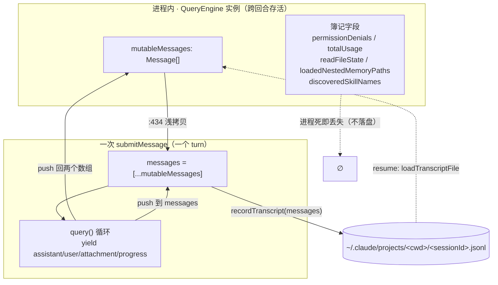
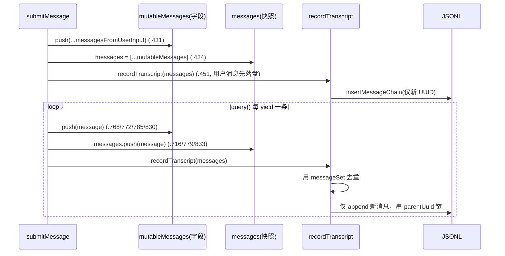
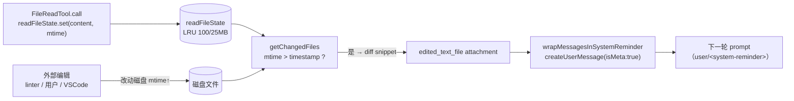
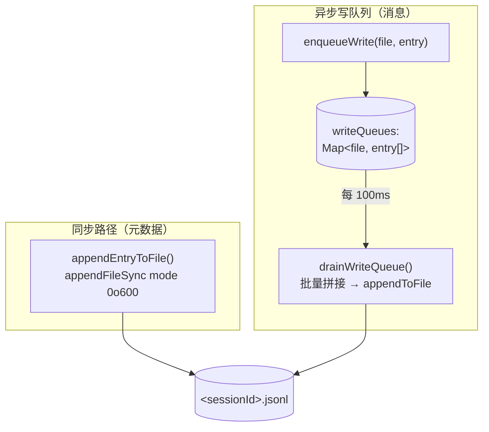
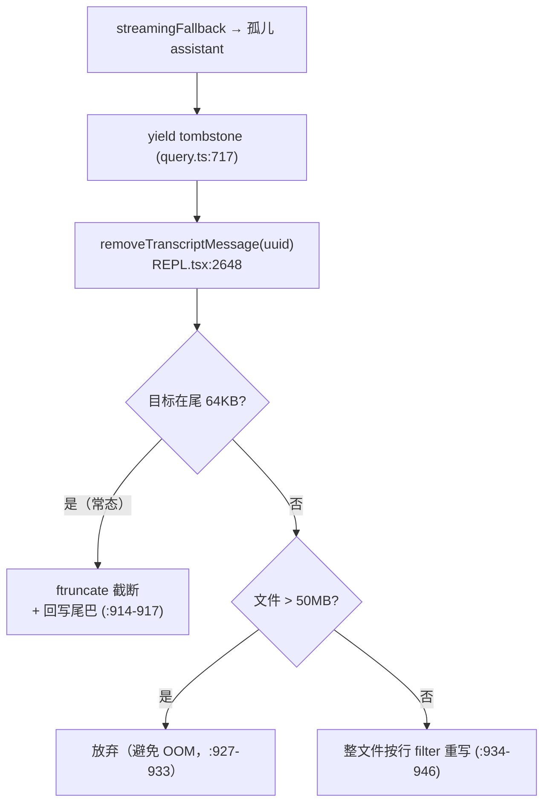
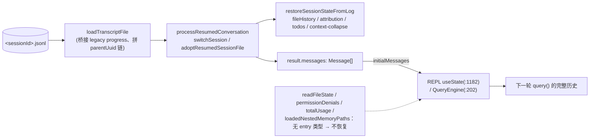

# 03 · 跨回合状态与转录持久化

> 本篇覆盖：QueryEngine 的进程内跨回合状态（`mutableMessages` 与 5 个簿记字段）、`recordTranscript` 的去重链接、JSONL 转录落盘底座（`appendEntryToFile` + 写队列）、转录路径推导、tombstone 尾部截断、以及 resume 重建 ｜ 关键源文件：`src/QueryEngine.ts`、`src/utils/sessionStorage.ts`、`src/utils/sessionStoragePortable.ts`、`src/utils/fileStateCache.ts`、`src/utils/attachments.ts`、`src/utils/sessionRestore.ts`、`src/screens/REPL.tsx` ｜ 上一篇：02-agent-loop-recovery.md ｜ 下一篇：04-tool-contract.md

一个 agentic 系统的"记忆"分成两层，本篇要讲清这两层各自的机制以及它们之间的桥：

1. **进程内跨回合状态**——`QueryEngine` 实例持有的可变字段。它们在一次 `submitMessage()`（一个 turn）内被读写，并**跨多个 `submitMessage()` 存活**（`QueryEngine` 的注释原话：`State (messages, file cache, usage, etc.) persists across turns.`，`QueryEngine.ts:181-182`）。进程一死，它们全部消失。
2. **磁盘上的持久转录**——`~/.claude/projects/<sanitized-cwd>/<sessionId>.jsonl`，每条消息是一行 JSON（JSONL）。它是 resume/`--continue`/`--resume` 唯一的真相来源。

两层之间的桥是 `recordTranscript(messages)`：它把内存里的 `Message[]` 增量写进 JSONL。理解本篇的关键，是分清**哪些状态落盘、哪些只活在进程里、resume 后各自会变成什么**。先给一张总表，后面逐条展开。

## 簿记字段 × 作用域 × 是否落盘 × resume 后行为

| 字段（`QueryEngine.ts`） | 作用域 | 是否落盘 | resume 后行为 |
|---|---|---|---|
| `mutableMessages` (`:186`) | 每 QueryEngine，跨回合 | **是**（经 `recordTranscript` 写入 `<sessionId>.jsonl`） | 由 `loadTranscriptFile` 从 JSONL 重建为 `Message[]` |
| `messages`（`submitMessage` 内局部，`:434`） | 每回合（一次 `submitMessage`） | 否（是 `mutableMessages` 的浅拷贝，回合末丢弃） | N/A |
| `permissionDenials` (`:188`) | 每 QueryEngine，跨回合，只增 | 否 | 归空（新进程从 `[]` 起，`:204`） |
| `totalUsage` (`:189`) | 每 QueryEngine，跨回合累加 | 否 | 归零（`EMPTY_USAGE`，`:206`） |
| `readFileState` (`:191`，`FileStateCache`) | 每 QueryEngine / 每进程 | 否（文件内容不进 JSONL） | 空缓存重建，模型"已读视图"不复存在 |
| `discoveredSkillNames` (`:197`) | 每回合（`submitMessage` 开头 `.clear()`，`:238`） | 否 | N/A（回合级） |
| `loadedNestedMemoryPaths` (`:198`) | 每 QueryEngine，跨回合，非淘汰 | 否 | 空集合重建 → 每个 `CLAUDE.md` 会被重新注入一次 |
| `hasHandledOrphanedPermission` (`:190`) | 每 QueryEngine，一次性 | 否 | 重置为 `false` |

下图是两层状态的总体数据流，后面每个小节各自放大其中一环：



---

### mutableMessages —— 进程内跨回合会话数组

- **触发 / 记录**：`QueryEngine` 构造时把它初始化为 `config.initialMessages ?? []`；这是整个会话在内存中的权威消息数组，每一条来自模型/工具/用户的消息都要 `push` 进来。

```ts
export class QueryEngine {
  private config: QueryEngineConfig
  private mutableMessages: Message[]
  ...
  constructor(config: QueryEngineConfig) {
    this.config = config
    this.mutableMessages = config.initialMessages ?? []
    ...
  }
```
`src/QueryEngine.ts:184-207`

  turn 内共有 5 个 push 点，覆盖用户输入与 `query()` 流出的每种消息类型：

```ts
    // Push new messages, including user input and any attachments
    this.mutableMessages.push(...messagesFromUserInput)   // :431 用户输入 + 附件
    ...
        case 'assistant':
          ...
          this.mutableMessages.push(message)              // :768
          yield* normalizeMessage(message)
          break
        case 'progress':
          this.mutableMessages.push(message)              // :772
          ...
        case 'user':
          this.mutableMessages.push(message)              // :785
          ...
        case 'attachment':
          this.mutableMessages.push(message)              // :830
```
`src/QueryEngine.ts:431 / 768 / 772 / 785 / 830`

- **使用 / 注入**：每次 `submitMessage()` 开头，它被浅拷贝成本回合的工作副本 `messages`，这份副本作为 `messages` 传给 `query()`——即**下一个 turn 的完整上下文**，最终成为发给模型 API 的消息序列。

```ts
    // Push new messages, including user input and any attachments
    this.mutableMessages.push(...messagesFromUserInput)

    // Update params to reflect updates from processing /slash commands
    const messages = [...this.mutableMessages]
    ...
    for await (const message of query({
      messages,
      systemPrompt,
      ...
```
`src/QueryEngine.ts:431-434 / 675-676`

  它也是簿记与只读出口：`getMessages()` 直接返回它，`countToolCalls(this.mutableMessages, ...)` 在其上统计工具调用做重试限流。

```ts
  getMessages(): readonly Message[] {
    return this.mutableMessages
  }
```
`src/QueryEngine.ts:1162-1164`

- **为什么（设计意图）**：`QueryEngine` 的类注释点明了它的定位——`One QueryEngine per conversation. Each submitMessage() call starts a new turn within the same conversation.`（`QueryEngine.ts:180-181`）。把消息数组做成实例字段而非局部变量，是"跨回合记忆"的物理载体：REPL/headless 只需持有同一个 `QueryEngine`，多轮对话的上下文就自动累积，不需要每回合从磁盘重读。局部 `messages` 快照则隔离了"本回合正在生长的数组"与"权威字段"，让 `/slash` 命令能改 `messages` 而不污染跨回合状态（`:337-346` 的 `setMessages` 注释）。

- **示例数据**：`mutableMessages` 在一次简单问答后（用户 + 助手各一条）的内存形态（`Message` 联合类型，`（示例，据源码构造）`）：

```jsonc
[
  { "type": "user",
    "message": { "role": "user", "content": "Explain QueryEngine" },
    "uuid": "0f2c…-user", "timestamp": "2026-07-04T09:00:01.000Z", "isMeta": undefined },
  { "type": "assistant",
    "message": { "id": "msg_01…", "role": "assistant", "model": "claude-opus-4-…",
      "content": [{ "type": "text", "text": "QueryEngine owns the query lifecycle…" }],
      "stop_reason": "end_turn", "usage": { "input_tokens": 812, "output_tokens": 143 } },
    "uuid": "7a91…-asst", "timestamp": "2026-07-04T09:00:03.400Z" }
]
```

- **生命周期**：作用域为**每 QueryEngine（跨回合）**；进程内唯一权威。resume 时不是"恢复这个对象"，而是由 `loadTranscriptFile` 从 JSONL 重建出一个新的 `Message[]` 作为下一个 `QueryEngine` 的 `initialMessages`。

---

### messages 快照与 recordTranscript 的去重链接

- **触发 / 记录**：`recordTranscript(messages)` 是内存→磁盘的唯一桥。它在 turn 内被调用多次：用户消息一进来先落盘一次（`:451`），之后每条 assistant/user/compact_boundary 落盘一次（`:728/:730`），progress/attachment 内联落盘（`:780/:834`）。注意 assistant 用 `void`（fire-and-forget），user/compact 用 `await`：

```ts
        messages.push(message)
        if (persistSession) {
          if (message.type === 'assistant') {
            void recordTranscript(messages)      // fire-and-forget，见 :718-726 注释
          } else {
            await recordTranscript(messages)
          }
        }
```
`src/QueryEngine.ts:716-732`

- **使用 / 注入**：`recordTranscript` 内部按 `getSessionMessages(sessionId)`（已落盘 UUID 集合）**去重**，只把新消息交给 `insertMessageChain` 写盘，并维护 `parentUuid` 链：

```ts
export async function recordTranscript(
  messages: Message[],
  ...
): Promise<UUID | null> {
  const cleanedMessages = cleanMessagesForLogging(messages, allMessages)
  const sessionId = getSessionId() as UUID
  const messageSet = await getSessionMessages(sessionId)
  const newMessages: typeof cleanedMessages = []
  let startingParentUuid: UUID | undefined = startingParentUuidHint
  let seenNewMessage = false
  for (const m of cleanedMessages) {
    if (messageSet.has(m.uuid as UUID)) {
      // 只把「构成前缀」的已落盘消息当作 parent（compaction 后不成前缀→不追踪）
      if (!seenNewMessage && isChainParticipant(m)) {
        startingParentUuid = m.uuid as UUID
      }
    } else {
      newMessages.push(m)
      seenNewMessage = true
    }
  }
  if (newMessages.length > 0) {
    await getProject().insertMessageChain(
      newMessages, false, undefined, startingParentUuid, teamInfo,
    )
  }
  ...
}
```
`src/utils/sessionStorage.ts:1408-1448`

  `insertMessageChain` 逐条把内存 `Message` 包装成 `TranscriptMessage`（补 `parentUuid` / `isSidechain` / `cwd` / `sessionId` / `version` / `gitBranch` 等），并让下一条挂到上一条的 `uuid` 上，形成一条单链：

```ts
        const transcriptMessage: TranscriptMessage = {
          parentUuid: isCompactBoundary ? null : effectiveParentUuid,
          logicalParentUuid: isCompactBoundary ? parentUuid : undefined,
          isSidechain,
          ...
          ...message,
          userType: getUserType(),
          entrypoint: getEntrypoint(),
          cwd: getCwd(),
          sessionId,
          version: VERSION,
          gitBranch,
          slug,
        }
        await this.appendEntry(transcriptMessage)
        if (isChainParticipant(message)) {
          parentUuid = message.uuid
        }
```
`src/utils/sessionStorage.ts:1039-1068`

- **为什么（设计意图）**：三点动机都写在源码里。① 为什么用户消息要在进入 query 循环**前**先落盘（`:436-449`）：因为 `recordTranscript` 只在 `ask()` yield 出 assistant/user 时才被调用，而那要等 API 响应；若进程在响应前被杀（cowork 里用户点 Stop），转录就只剩 `queue-operation`，`getLastSessionLog` 会过滤掉它们返回 `null`，`--resume` 报 "No conversation found"。② 为什么去重（`messageSet.has`）：turn 内 `recordTranscript(messages)` 被反复调用，每次传的都是"全量增长数组"，去重保证同一 UUID 只落一次。③ 为什么"只追踪前缀"（`:1400-1407`）：compaction 场景里新 summary 出现在保留消息之前，不成前缀 → 不当 parent → compact boundary 的 `parentUuid=null`，正确地在压缩点截断 `--continue` 链。

- **示例数据**：一条真实的用户 JSONL entry（`TranscriptMessage`，`（示例，据源码构造）`）：

```json
{"parentUuid":null,"isSidechain":false,"promptId":"prompt_8f3a","type":"user","message":{"role":"user","content":"Explain QueryEngine"},"uuid":"0f2c1a4e-1111-4c2b-9a01-user0000","timestamp":"2026-07-04T09:00:01.000Z","userType":"external","entrypoint":"cli","cwd":"/home/lian/Projects/claude-code-agent/claude-code-main","sessionId":"a1b2c3d4-5566-4778-9900-sessionaaaa","version":"1.0.0","gitBranch":"main"}
```

  紧接着的助手 entry，`parentUuid` 指回上一行的 `uuid`：

```json
{"parentUuid":"0f2c1a4e-1111-4c2b-9a01-user0000","isSidechain":false,"type":"assistant","message":{"id":"msg_01AB","role":"assistant","model":"claude-opus-4-…","content":[{"type":"text","text":"QueryEngine owns the query lifecycle…"}],"stop_reason":"end_turn","usage":{"input_tokens":812,"output_tokens":143}},"uuid":"7a91b2c0-2222-4d3e-8b12-asst0000","timestamp":"2026-07-04T09:00:03.400Z","userType":"external","entrypoint":"cli","cwd":"/home/lian/Projects/claude-code-agent/claude-code-main","sessionId":"a1b2c3d4-5566-4778-9900-sessionaaaa","version":"1.0.0","gitBranch":"main"}
```

- **图**：一个 turn 内 `messages` 与 `mutableMessages` 并行生长、并被去重落盘的时序：



- **生命周期**：`messages` 是**回合级**工作副本，回合末即弃；`recordTranscript` 的效果（JSONL 行）是**持久**的。resume 读的正是这些行。

---

### wrappedCanUseTool → permissionDenials

- **触发 / 记录**：`submitMessage` 把配置里的 `canUseTool` 包一层 `wrappedCanUseTool`，凡是判定结果不是 `allow` 的，就记一条 denial 到实例数组：

```ts
    const wrappedCanUseTool: CanUseToolFn = async (
      tool, input, toolUseContext, assistantMessage, toolUseID, forceDecision,
    ) => {
      const result = await canUseTool(...)
      // Track denials for SDK reporting
      if (result.behavior !== 'allow') {
        this.permissionDenials.push({
          tool_name: sdkCompatToolName(tool.name),
          tool_use_id: toolUseID,
          tool_input: input,
        })
      }
      return result
    }
```
`src/QueryEngine.ts:244-271`

- **使用 / 注入**：它不进 prompt、也不落盘，只出现在 SDK 结果消息的 `permission_denials` 字段里，供上层（SDK 消费者）审计：

```ts
      yield {
        type: 'result',
        ...
        usage: this.totalUsage,
        permission_denials: this.permissionDenials,
        ...
      }
```
`src/QueryEngine.ts:618-637`（同样出现在 `:861/:991/:1034/:1093/:1146` 各 result 分支）

- **为什么（设计意图）**：这是**只增的 SDK 遥测**，不是控制状态。它跨回合累加（构造时 `this.permissionDenials = []`，`:204`，之后再不清空），让最终 result 能一次性汇报"这个 conversation 里模型试图用但被拦下的工具"。因为它只影响返回给调用方的结构、不影响给模型的下一轮上下文，所以没有落盘的必要——resume 出来的新进程从空数组重新计数即可。

- **示例数据**：`permission_denials` 数组中的一项（`SDKPermissionDenial`，`（示例，据源码构造）`）：

```json
{ "tool_name": "Bash",
  "tool_use_id": "toolu_01Xy…",
  "tool_input": { "command": "rm -rf /", "description": "clean" } }
```

- **生命周期**：每 QueryEngine 跨回合、只增；不落盘；resume 归空。

---

### totalUsage —— 跨回合用量累加

- **触发 / 记录**：token 用量在 `stream_event` 分支里累加。`message_start` 重置本条消息用量，`message_delta` 累加，`message_stop` 把本条消息用量并入 `totalUsage`：

```ts
          if (message.event.type === 'message_stop') {
            // Accumulate current message usage into total
            this.totalUsage = accumulateUsage(
              this.totalUsage,
              currentMessageUsage,
            )
          }
```
`src/QueryEngine.ts:810-816`（`currentMessageUsage` 在 `:789-801` 由 `updateUsage` 维护）

- **使用 / 注入**：同样只进 result 消息的 `usage` 字段，不进 prompt、不落盘：

```ts
        usage: this.totalUsage,
```
`src/QueryEngine.ts:629`（各 result 分支同名字段）

- **为什么（设计意图）**：`QueryEngine` 类注释把 `usage` 列为跨回合状态之一（`:181-182`）。累加放在实例字段而非局部，是为了让"整段对话共花了多少 token"能随每回合滚动更新，任何一个 result 都拿到迄今为止的累计值。构造初值为 `EMPTY_USAGE`（`:206`）。

- **示例数据**：`NonNullableUsage`（`（示例，据源码构造）`）：

```json
{ "input_tokens": 4210, "output_tokens": 356,
  "cache_creation_input_tokens": 1800, "cache_read_input_tokens": 12044 }
```

- **生命周期**：每 QueryEngine 跨回合累加；不落盘；resume 归零（成本另有 `restoreCostStateForSession` 从别处恢复，见 `sessionRestore.ts:450`，但 `totalUsage` 这个字段本身不恢复）。

---

### readFileState（FileStateCache）—— 跨回合文件视图缓存

- **触发 / 记录**：`readFileState` 是一个按路径归一化的 LRU（100 条 / 25MB 上限），构造时从 `config.readFileCache` 注入。写入方是各读/改文件的工具——`FileReadTool`、`FileEditTool`、以及内存文件注入器：

```ts
    readFileState.set(fullFilePath, {
      content: cellsJson,
      timestamp: Math.floor(stats.mtimeMs),
      offset,
      limit,
    })
```
`src/tools/FileReadTool/FileReadTool.ts:842-847`（`FileEditTool.ts:520`、`attachments.ts:1742` 同构）

  `FileStateCache` 的条目结构与容量常量：

```ts
export type FileState = {
  content: string
  timestamp: number
  offset: number | undefined
  limit: number | undefined
  isPartialView?: boolean   // 注入内容与磁盘不一致时为 true：Edit/Write 必须先真读一次
}
export const READ_FILE_STATE_CACHE_SIZE = 100
const DEFAULT_MAX_CACHE_SIZE_BYTES = 25 * 1024 * 1024
```
`src/utils/fileStateCache.ts:4-22`

- **使用 / 注入**：每回合 `getChangedFiles` 遍历缓存里每个路径，`stat` 出 mtime，若 `mtime > fileState.timestamp` 说明文件在 Claude 读过之后被外部改动，就取 diff 片段生成一个 `edited_text_file` attachment：

```ts
export async function getChangedFiles(toolUseContext: ToolUseContext): Promise<Attachment[]> {
  const filePaths = cacheKeys(toolUseContext.readFileState)
  ...
      const mtime = await getFileModificationTimeAsync(normalizedPath)
      if (mtime <= fileState.timestamp) { return null }
      ...
      const snippet = getSnippetForTwoFileDiff(fileState.content, result.data.file.content)
      if (snippet === '') { return null }
      return { type: 'edited_text_file' as const, filename: normalizedPath, snippet }
```
`src/utils/attachments.ts:2063-2121`

  这个 attachment 最终被 `wrapMessagesInSystemReminder` 包成一条 `isMeta` 的 **user 消息**注入到下一轮 prompt：

```ts
    case 'edited_text_file':
      return wrapMessagesInSystemReminder([
        createUserMessage({
          content: `Note: ${attachment.filename} was modified, either by the user or by a linter. This change was intentional, so make sure to take it into account as you proceed (ie. don't revert it unless the user asks you to). Don't tell the user this, since they are already aware. Here are the relevant changes (shown with line numbers):\n${attachment.snippet}`,
          isMeta: true,
        }),
      ])
```
`src/utils/messages.ts:3538-3544`

- **为什么（设计意图）**：这是"文件真相"层。缓存里存的是**模型上次看到的字节 + 那一刻的 mtime**，于是系统能在每回合廉价地检测"文件在模型背后被改了"，并把差异主动喂回去，避免模型基于陈旧内容做编辑。注释还点出两个精细约束：① `isPartialView`——当注入内容经过裁剪（去 HTML 注释 / 去 frontmatter / 截断 `MEMORY.md`）时缓存原始磁盘字节但打标记，让 Edit/Write 强制先真读一次（`fileStateCache.ts:9-14`）；② `getChangedFiles` 只在 ENOENT（文件真被删）时 evict，`stat` 瞬时失败（编辑器 tmp→rename 竞态、EACCES 抖动）绝不 evict，否则下次 Edit 会 code-6 误报（`attachments.ts:2145-2156`）。

- **示例数据**：缓存内一条 `FileState`（`（示例，据源码构造）`）：

```json
{ "content": "export const A = 1\n", "timestamp": 1751619600000,
  "offset": undefined, "limit": undefined, "isPartialView": false }
```

  下一回合注入模型的 `<system-reminder>`（`（示例，据源码构造）`，文案取自 `messages.ts:3541`）：

```
<system-reminder>
Note: /home/lian/…/src/a.ts was modified, either by the user or by a linter.
This change was intentional, … Here are the relevant changes (shown with line numbers):
   1  export const A = 2
</system-reminder>
```

- **图**：



- **生命周期**：作用域为每 QueryEngine / 每进程；**内容不进 JSONL**。resume 时 `sessionRestore` 不重建它——新进程的 `readFileState` 从空开始，模型对任何文件的"已读视图"归零；直到它重新 `Read`，`getChangedFiles` 才对该文件恢复变更侦测（写工具的 read-before-write 校验也需要这次重读）。

---

### loadedNestedMemoryPaths 与 discoveredSkillNames —— 非淘汰去重集合

- **触发 / 记录**：两者都是 `Set<string>` 实例字段，构造为空集（`:197-198`）。`discoveredSkillNames` 在**每次** `submitMessage` 开头被清空，`loadedNestedMemoryPaths` 则跨回合只增：

```ts
  private discoveredSkillNames = new Set<string>()
  private loadedNestedMemoryPaths = new Set<string>()
  ...
    this.discoveredSkillNames.clear()   // 每回合清空，防止 SDK 多轮无界增长
```
`src/QueryEngine.ts:197-198 / 238`

  `loadedNestedMemoryPaths` 在注入嵌套 `CLAUDE.md` 时被填充：

```ts
    if (toolUseContext.loadedNestedMemoryPaths?.has(memoryFile.path)) {
      continue   // 已注入过 → 跳过
    }
    if (!toolUseContext.readFileState.has(memoryFile.path)) {
      attachments.push({ type: 'nested_memory', path: memoryFile.path, ... })
      toolUseContext.loadedNestedMemoryPaths?.add(memoryFile.path)
      ...
      toolUseContext.readFileState.set(memoryFile.path, { ... })
```
`src/utils/attachments.ts:1718-1750`

- **使用 / 注入**：`loadedNestedMemoryPaths.has(path)` 是嵌套内存文件注入的第一道去重闸——命中就 `continue`，不再产生 `nested_memory` attachment。`discoveredSkillNames` 喂 `tengu_skill_tool_invocation` 遥测的 `was_discovered` 字段（`:192-196` 注释）。两者都经 `processUserInputContext` 透传给工具上下文（`:371/:373`、`:519/:521`）。

- **为什么（设计意图）**：注释把两者的差异讲得很直白（`attachments.ts:1719-1721`）——`loadedNestedMemoryPaths is a non-evicting Set; readFileState is a 100-entry LRU that drops entries in busy sessions, so relying on it alone re-injects the same CLAUDE.md on every eviction cycle.`。也就是：`readFileState` 会 LRU 淘汰，繁忙会话里同一个 `CLAUDE.md` 会被反复重注入；专门用一个**永不淘汰**的 Set 记"这个内存文件本进程已经喂过了"，才能真正去重。`discoveredSkillNames` 反过来必须**每回合清空**，否则 SDK 多轮跑下来会无界增长（`:194-196`）——两个 Set 的清空策略正好相反，对应各自的语义。

- **示例数据**（`（示例，据源码构造）`）：

```jsonc
loadedNestedMemoryPaths = Set { "/home/lian/…/src/CLAUDE.md", "/home/lian/…/src/tools/CLAUDE.md" }
discoveredSkillNames   = Set { "code-review", "verify" }   // 本回合内触发过的 skill
```

- **生命周期**：`loadedNestedMemoryPaths` 每 QueryEngine 跨回合、非淘汰、不落盘 → resume 后空集合，导致每个 `CLAUDE.md` 在新进程首轮被重新注入一次（符合预期，因为新进程模型确实还没见过它们）。`discoveredSkillNames` 回合级，与持久化无关。

---

### 转录落盘底座：appendEntryToFile 与写队列

- **触发 / 记录**：存在两条写盘路径。① 元数据类 entry（`custom-title`/`tag`/`mode`/`last-prompt` 等）走**同步** `appendEntryToFile`——直接 `appendFileSync` 一行 JSON，失败则建目录重试：

```ts
function appendEntryToFile(fullPath: string, entry: Record<string, unknown>): void {
  const fs = getFsImplementation()
  const line = jsonStringify(entry) + '\n'
  try {
    fs.appendFileSync(fullPath, line, { mode: 0o600 })
  } catch {
    fs.mkdirSync(dirname(fullPath), { mode: 0o700 })
    fs.appendFileSync(fullPath, line, { mode: 0o600 })
  }
}
```
`src/utils/sessionStorage.ts:2572-2584`

  ② 消息类 entry（`insertMessageChain → appendEntry`）走**异步、按文件分队列、100ms 批量 drain** 的写队列：

```ts
  private FLUSH_INTERVAL_MS = 100
  ...
  private enqueueWrite(filePath: string, entry: Entry): Promise<void> {
    return new Promise<void>(resolve => {
      let queue = this.writeQueues.get(filePath)
      if (!queue) { queue = []; this.writeQueues.set(filePath, queue) }
      queue.push({ entry, resolve })
      this.scheduleDrain()
    })
  }
```
`src/utils/sessionStorage.ts:567 / 606-616`（drain 见 `:645-655`，落盘 `appendToFile` 用 `mode: 0o600`，`:634-643`）

- **使用 / 注入**：这层只写盘，不进 prompt。`appendEntry`（`:1128`）是所有 entry 类型的分派中心：`summary`/`custom-title`/`tag`/`file-history-snapshot`/… 各自 `enqueueWrite`，消息类 entry 走 UUID 去重后再入队（`:1216-1247`）。`flush()`（`:841-861`）在退出/关键节点等待队列排空。

- **为什么（设计意图）**：分两条路径是权衡。同步 `appendEntryToFile` 用于小而关键、必须"立刻在 EOF"的元数据（`reAppendSessionMetadata` 靠它把 title/tag 顶到文件尾，`:767-838`）。异步写队列用于高频消息：`claude.ts` 每个 content block yield 一条 assistant，再在 `message_delta` 回填 usage/stop_reason，依赖写队列 100ms 的惰性 `jsonStringify`（`QueryEngine.ts:718-726` 注释）——若同步 await 会卡住生成器让 `message_delta` 跑不动。`enqueueWrite` 保序，所以 assistant 消息 fire-and-forget 也安全。文件权限统一 `0o600`（目录 `0o700`），转录含对话内容，只对属主可读。

- **示例数据**：一条元数据 entry（`CustomTitleMessage`，`（示例，据源码构造）`）：

```json
{"type":"custom-title","customTitle":"Refactor QueryEngine","sessionId":"a1b2c3d4-5566-4778-9900-sessionaaaa"}
```

- **图**：



- **生命周期**：写盘即持久。`flush()` 保证进程退出前队列排空（`:841-861`）；`CLAUDE_CODE_EAGER_FLUSH` / cowork 会在关键点强制 `flushSessionStorage()`（`QueryEngine.ts:456-461` 等）。

---

### 转录路径推导：getProjectsDir / getTranscriptPath / getAgentTranscriptPath

- **触发 / 记录**：所有路径从 `~/.claude/projects` 下按"净化后的 cwd"分目录，会话文件名是 `<sessionId>.jsonl`：

```ts
export function getProjectsDir(): string {
  return join(getClaudeConfigHomeDir(), 'projects')
}
export function getTranscriptPath(): string {
  const projectDir = getSessionProjectDir() ?? getProjectDir(getOriginalCwd())
  return join(projectDir, `${getSessionId()}.jsonl`)
}
```
`src/utils/sessionStorage.ts:198-205`

  `getProjectDir` = `projects/<sanitizePath(cwd)>`，净化规则是把每个非字母数字字符替换成 `-`：

```ts
export function sanitizePath(name: string): string {
  const sanitized = name.replace(/[^a-zA-Z0-9]/g, '-')
  if (sanitized.length <= MAX_SANITIZED_LENGTH) { return sanitized }
  const hash = ...
  return `${sanitized.slice(0, MAX_SANITIZED_LENGTH)}-${hash}`
}
```
`src/utils/sessionStoragePortable.ts:311-319`

  子 agent 转录挂在 `<sessionId>/subagents/` 下，文件名 `agent-<id>.jsonl`，可选 subdir 分组：

```ts
export function getAgentTranscriptPath(agentId: AgentId): string {
  const projectDir = getSessionProjectDir() ?? getProjectDir(getOriginalCwd())
  const sessionId = getSessionId()
  const subdir = agentTranscriptSubdirs.get(agentId)
  const base = subdir
    ? join(projectDir, sessionId, 'subagents', subdir)
    : join(projectDir, sessionId, 'subagents')
  return join(base, `agent-${agentId}.jsonl`)
}
```
`src/utils/sessionStorage.ts:247-258`

- **使用 / 注入**：这些路径被 `appendEntryToFile` / 写队列 / `loadTranscriptFile` / hook 的 `transcript_path` 消费。`getTranscriptPathForSession`（`:207-225`）特意对"当前 session"复用 `getSessionProjectDir`，避免 hook 拿到用 originalCwd 算出的路径而实际文件写在 `sessionProjectDir`（gh-30217）。

- **为什么（设计意图）**：以 cwd 净化名分目录，让 `--resume` 的候选列表天然按项目隔离；`sessionId.jsonl` 一会话一文件。子 agent 独立 `.jsonl` + `.meta.json` sidecar（`:283-289`），是为了 AgentTool resume 能拿回子 agent 的完整历史与 `agentType`，且不改主 JSONL 的 schema（`:274-282` 注释）。`getSessionProjectDir() ?? getProjectDir(getOriginalCwd())` 的 fallback 让 resume 到别的项目目录（worktree/跨项目）时路径仍然一致。

- **示例数据**：本仓库（cwd `/home/lian/Projects/claude-code-agent/claude-code-main`）的目录树（`（示例，据源码构造）`）：

```text
~/.claude/projects/
└── -home-lian-Projects-claude-code-agent-claude-code-main/     ← sanitizePath(cwd)
    ├── a1b2c3d4-5566-4778-9900-sessionaaaa.jsonl               ← 主会话转录
    └── a1b2c3d4-5566-4778-9900-sessionaaaa/                    ← 与 sessionId 同名的子目录
        └── subagents/
            ├── agent-7f00…-code-reviewer.jsonl                 ← 子 agent 转录
            └── agent-7f00…-code-reviewer.meta.json             ← agentType/worktreePath sidecar
```

- **生命周期**：目录/文件持久。`switchSession` 在 resume/branch 时把 sessionId 与 `sessionProjectDir` 原子切换（`:212-214` 注释 CC-34），保证之后所有路径推导一致。

---

### tombstone 尾部截断：removeMessageByUuid

- **触发 / 记录**：当流式 fallback 发生，先前那批带无效签名的 assistant 消息（尤其 thinking 块）会成为孤儿，`query.ts` 为它们 yield `tombstone`；REPL 收到后从 UI 过滤并调 `removeTranscriptMessage`：

```ts
              for (const msg of assistantMessages) {
                yield { type: 'tombstone' as const, message: msg }
              }
```
`src/query.ts:716-718`

```ts
    }, setStreamMode, setStreamingToolUses, tombstonedMessage => {
      setMessages(oldMessages => oldMessages.filter(m => m !== tombstonedMessage));
      void removeTranscriptMessage(tombstonedMessage.uuid);
```
`src/screens/REPL.tsx:2646-2648`

  `removeMessageByUuid` 分**快路径**（目标几乎总是最后一行：只读文件尾 64KB，定位后 `ftruncate` 截掉，必要时把尾巴回写）与**慢路径**（目标不在尾部：整文件读进来按行 filter 重写，但超过 50MB 直接放弃）：

```ts
          const needle = `"uuid":"${targetUuid}"`
          const matchIdx = tail.lastIndexOf(needle)
          if (matchIdx >= 0) {
            const prevNl = tail.lastIndexOf(0x0a, matchIdx)
            if (prevNl >= 0 || tailStart === 0) {
              ...
              await fh.truncate(absLineStart)
              if (afterLen > 0) { await fh.write(tail, lineEnd, afterLen, absLineStart) }
              return
            }
          }
        ...
        // Slow path
        if (fileSize > MAX_TOMBSTONE_REWRITE_BYTES) {
          logForDebugging(`Skipping tombstone removal: session file too large …`)
          return
        }
        const content = await readFile(this.sessionFile, { encoding: 'utf-8' })
        const lines = content.split('\n').filter((line: string) => {
          ...
          return entry.uuid !== targetUuid
        })
```
`src/utils/sessionStorage.ts:871-950`（`MAX_TOMBSTONE_REWRITE_BYTES = 50 * 1024 * 1024`，`:123`；尾读窗口 `LITE_READ_BUF_SIZE = 65536`，`sessionStoragePortable.ts:17`）

- **使用 / 注入**：从转录里物理删掉孤儿消息，让 resume 不会把带坏签名的 thinking 块喂回 API（那会触发 `thinking blocks cannot be modified` 错误，`query.ts:714-715` 注释）。

- **为什么（设计意图）**：孤儿消息几乎总是刚 append 的最后一行，所以默认走"读尾 64KB + 定位 + `ftruncate`"的 O(尾部) 路径，避免为删一行重写整个可能达数 GB 的 JSONL。needle 用完整 `"uuid":"…"` 而非裸 UUID，是为了不误伤子 entry 的 `parentUuid`（`:888-893` 注释）。慢路径设 50MB 上限，是宁可漏删也不 OOM。

- **图**：



- **生命周期**：直接改磁盘文件，持久生效；因此 resume 读到的已是剔除孤儿后的转录。

---

### resume 重建：sessionRestore

- **触发 / 记录**：resume（`--continue` / `--resume` / 交互 `/resume`）从 JSONL 把状态"倒灌"回内存。`processResumedConversation` 是 CLI 路径的总入口：复用/切换 sessionId、恢复元数据、cd 回 worktree、认领已存在的转录文件：

```ts
  if (!opts.forkSession) {
    const sid = opts.sessionIdOverride ?? result.sessionId
    if (sid) {
      switchSession(asSessionId(sid), opts.transcriptPath ? dirname(opts.transcriptPath) : null)
      ...
      await resetSessionFilePointer()
      restoreCostStateForSession(sid)
    }
  }
  ...
  restoreSessionMetadata(opts.forkSession ? { ...result, worktreeSession: undefined } : result)
  if (!opts.forkSession) {
    restoreWorktreeForResume(result.worktreeSession)
    adoptResumedSessionFile()
  }
```
`src/utils/sessionRestore.ts:436-488`

  `restoreSessionStateFromLog` 从加载出的 `Message[]` / 快照恢复 fileHistory、attribution、context-collapse、以及从最后一个 TodoWrite 提取 todos：

```ts
  if (!isTodoV2Enabled() && result.messages && result.messages.length > 0) {
    const todos = extractTodosFromTranscript(result.messages)
    if (todos.length > 0) {
      const agentId = getSessionId()
      setAppState(prev => ({ ...prev, todos: { ...prev.todos, [agentId]: todos } }))
    }
  }
```
`src/utils/sessionRestore.ts:99-150`（`extractTodosFromTranscript` 反向扫最后一个 TodoWrite `tool_use`，`:77-93`）

- **使用 / 注入**：重建出的 `result.messages`（`Message[]`）作为新 `QueryEngine`/REPL 的 `initialMessages`——在 REPL 里就是 `const [messages, rawSetMessages] = useState<MessageType[]>(initialMessages ?? [])`（`REPL.tsx:1182`）；在 QueryEngine 里就是 `config.initialMessages`（`QueryEngine.ts:202`）。也就是说 resume 后**下一轮 prompt 的历史就是这些从 JSONL 读回来的消息**，与从未中断的会话等价。

- **为什么（设计意图）**：这印证了本篇的核心分层——**只有落进 JSONL 的东西能跨进程复活**。消息、todo（v1）、fileHistory、attribution、context-collapse commit 都有对应的 entry 类型持久化，因而能重建；而 `readFileState` / `permissionDenials` / `totalUsage` / `loadedNestedMemoryPaths` 没有 entry 类型，resume 后一律从初值起（见首表最后一列）。`switchSession(sid, sessionProjectDir)` 让 sessionId 与项目目录原子切换，`adoptResumedSessionFile()` 把 `sessionFile` 指到已存在的转录并立即重贴元数据，让"resume 后不发消息就退出"也不会丢 title（`:1516-1522` 注释）。读端也有护栏：会话 JSONL 可涨到数 GB（inc-3930），所有直接读原始转录的 caller 都要在 `MAX_TRANSCRIPT_READ_BYTES = 50 * 1024 * 1024`（`sessionStorage.ts:227-229`）阈值以上直接 bail 以防 OOM。

- **示例数据**：resume 后 REPL 的 `messages` state 初值（就是上文那两条 entry 反序列化回 `Message[]`，`（示例，据源码构造）`）：

```jsonc
initialMessages = [
  { type: "user", message: { role: "user", content: "Explain QueryEngine" }, uuid: "0f2c…-user", … },
  { type: "assistant", message: { role: "assistant", content: [{ type: "text", text: "QueryEngine owns…" }], … }, uuid: "7a91…-asst", … }
]
```

- **图**：



- **生命周期**：resume 是"进程边界"上的重建动作；它把持久层（JSONL + 快照 entry）读回，重新填充进程内跨回合状态的**可持久子集**，其余进程内字段从初值重新开始积累。
