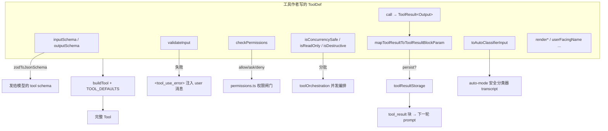
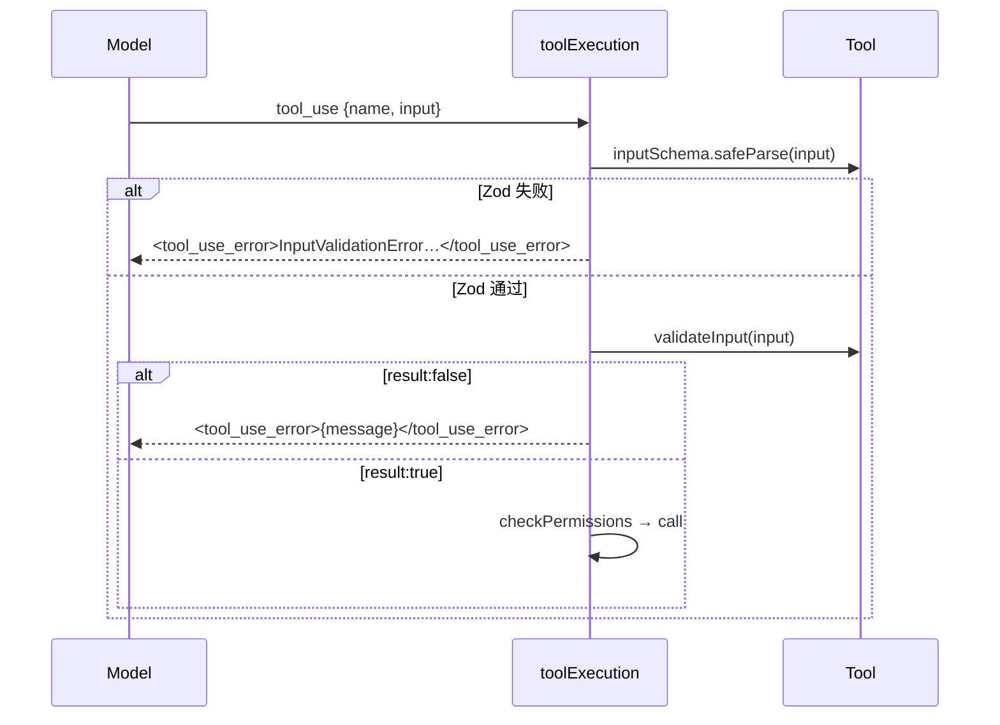
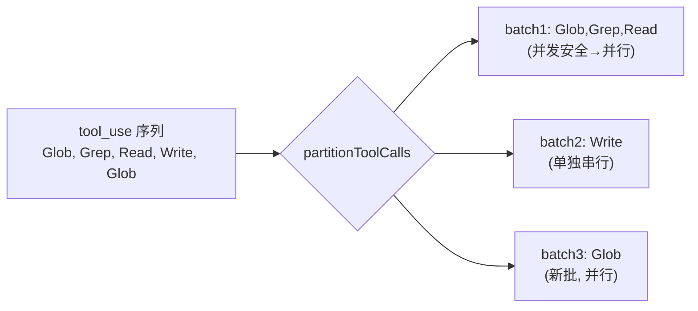
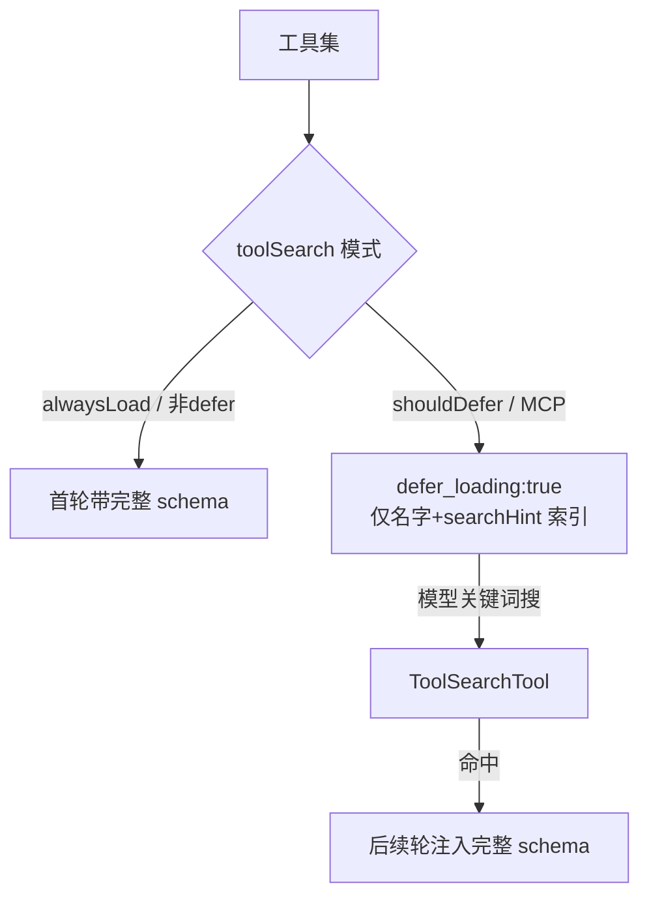
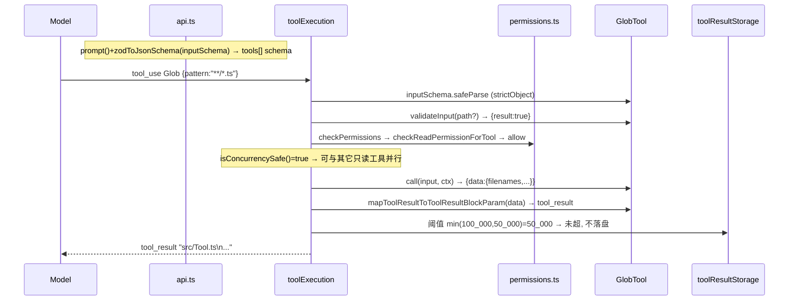

# 04 · Tool 契约与 buildTool

> 本篇覆盖：`Tool<Input,Output,P>` 接口的每一个契约方法、`buildTool` + `TOOL_DEFAULTS` 的默认值填充、`ToolDef`/`BuiltTool` 的类型级 spread、`inputSchema→API schema`、`validateInput`、`checkPermissions`、`isConcurrencySafe/isReadOnly/isDestructive`、`call→ToolResult`、`mapToolResultToToolResultBlockParam`、`maxResultSizeChars` 与结果持久化、`toAutoClassifierInput`、`shouldDefer/searchHint/alwaysLoad`，并以 `GlobTool` 全程做样本。 ｜ 关键源文件：`src/Tool.ts`、`src/tools/GlobTool/GlobTool.ts`、`src/types/permissions.ts`、`src/services/tools/toolExecution.ts`、`src/services/tools/toolOrchestration.ts`、`src/utils/toolResultStorage.ts`、`src/utils/api.ts`、`src/utils/permissions/yoloClassifier.ts` ｜ 上一篇：03-state-persistence.md ｜ 下一篇：05-tool-registry-schema.md

一个工具在 Claude Code 里不是一个函数，而是一份**契约**：它要能把自己序列化成发给模型的 schema、能自证输入合法、能自证权限、能声明并发/只读语义、能执行并产出结果、能把结果映射成 API 的 `tool_result` 块、能被 UI 渲染。`Tool.ts` 把这份契约固化成一个巨大的 TS 类型 `Tool<Input, Output, P>`（`src/Tool.ts:362-695`），`buildTool` 则负责把"作者只写关心的那几个方法"补齐成一份完整契约。本篇逐个拆开这些方法，讲清楚每个字段"在哪产生、被谁消费、为什么这么设计"。

先给一张全景，标出契约的三类职责与它们各自被谁调用：



---

### Tool 接口：三个类型参数与方法族

- **触发 / 记录**：`Tool` 是一个泛型对象类型，三个参数把"输入 / 输出 / 进度"三条数据流各自钉死：

```ts
export type Tool<
  Input extends AnyObject = AnyObject,
  Output = unknown,
  P extends ToolProgressData = ToolProgressData,
> = {
  call(args: z.infer<Input>, context: ToolUseContext, canUseTool: CanUseToolFn,
       parentMessage: AssistantMessage, onProgress?: ToolCallProgress<P>): Promise<ToolResult<Output>>
  description(input: z.infer<Input>, options: {...}): Promise<string>
  readonly inputSchema: Input
  readonly inputJSONSchema?: ToolInputJSONSchema
  outputSchema?: z.ZodType<unknown>
  isConcurrencySafe(input: z.infer<Input>): boolean
  isEnabled(): boolean
  isReadOnly(input: z.infer<Input>): boolean
  isDestructive?(input: z.infer<Input>): boolean
  checkPermissions(input: z.infer<Input>, context: ToolUseContext): Promise<PermissionResult>
  toAutoClassifierInput(input: z.infer<Input>): unknown
  mapToolResultToToolResultBlockParam(content: Output, toolUseID: string): ToolResultBlockParam
  readonly name: string
  maxResultSizeChars: number
  // ... validateInput?, prompt, render*, searchHint?, shouldDefer?, alwaysLoad? ...
}
```
`src/Tool.ts:362-466`（截取；完整定义到 :695）

- `Input extends AnyObject`：`AnyObject = z.ZodType<{ [key: string]: unknown }>`（`src/Tool.ts:343`）。所有方法的 `input` 形参统一写成 `z.infer<Input>`——作者定义一次 Zod schema，输入类型就自动流经 `call`/`validateInput`/`checkPermissions`/`isReadOnly`/`toAutoClassifierInput` 等每一个方法，无需重复声明。
- `Output` 是 `call` 结果里 `data` 的类型，也是 `mapToolResultToToolResultBlockParam` 的入参类型——工具内部数据结构与"发给模型的文本"解耦。
- `P extends ToolProgressData` 是流式进度事件类型，`onProgress`/`render*` 共用它。

- **使用 / 注入**：接口的方法被三批消费者调用（见全景图）：schema 序列化（`api.ts`）、权限/编排（`permissions.ts`、`toolOrchestration.ts`）、渲染（各 `render*`，UI 层）。`Tools = readonly Tool[]`（`src/Tool.ts:701`）是全局工具集类型，`findToolByName`（`:358`）按 `name` 或 `aliases` 查表。

- **为什么**：把所有横切能力收敛到一个类型上，好处是"新增一个工具 = 实现一份契约"，编排/权限/持久化/UI 全部是**面向接口**的通用代码，永远不需要 `if (tool.name === ...)` 去特判（少数安全兜底除外）。`readonly inputSchema` 保证 schema 在会话内稳定，利于 prompt 缓存。

- **生命周期**：工具对象是**进程级单例**——`GlobTool` 等都是模块顶层 `export const`。`call` 的每次调用属于某一回合（queryLoop）；`context: ToolUseContext` 才是每回合/每子代理重建的可变载体（`src/Tool.ts:158-300`），工具本身无状态。

---

### buildTool 与 TOOL_DEFAULTS：默认值填充

- **触发 / 记录**：所有工具导出都走 `buildTool(def)`（仓库内 43 个文件引用）。它把 `TOOL_DEFAULTS` 与作者的 `def` 做运行时 spread：

```ts
const TOOL_DEFAULTS = {
  isEnabled: () => true,
  isConcurrencySafe: (_input?: unknown) => false,
  isReadOnly: (_input?: unknown) => false,
  isDestructive: (_input?: unknown) => false,
  checkPermissions: (input, _ctx?): Promise<PermissionResult> =>
    Promise.resolve({ behavior: 'allow', updatedInput: input }),
  toAutoClassifierInput: (_input?: unknown) => '',
  userFacingName: (_input?: unknown) => '',
}

export function buildTool<D extends AnyToolDef>(def: D): BuiltTool<D> {
  return {
    ...TOOL_DEFAULTS,
    userFacingName: () => def.name,
    ...def,
  } as BuiltTool<D>
}
```
`src/Tool.ts:757-792`

注意 spread 顺序有个易错点：`TOOL_DEFAULTS.userFacingName` 是 `() => ''`，但紧接着被 `userFacingName: () => def.name` 覆盖，最后才轮到 `...def`。所以**未提供 `userFacingName` 的工具，其默认返回值是 `def.name` 而不是空串**——`TOOL_DEFAULTS` 里那行 `() => ''` 在运行时被吃掉，仅为类型形状存在。

- **使用 / 注入**：`buildTool` 的返回值 `BuiltTool<D>` 是完整 `Tool`，直接进工具表。可被默认填充的键集中在一处：

```ts
type DefaultableToolKeys =
  | 'isEnabled' | 'isConcurrencySafe' | 'isReadOnly' | 'isDestructive'
  | 'checkPermissions' | 'toAutoClassifierInput' | 'userFacingName'

export type ToolDef<...> =
  Omit<Tool<Input, Output, P>, DefaultableToolKeys> &
  Partial<Pick<Tool<Input, Output, P>, DefaultableToolKeys>>
```
`src/Tool.ts:707-726`

`ToolDef` = 完整 `Tool` 但把这 7 个方法变成可选。`BuiltTool<D>`（`:735-741`）是一个类型级的 `{...TOOL_DEFAULTS, ...def}` 镜像：逐键判断——`def` 显式给了就用 `def` 的类型，否则回落到 `ToolDefaults[K]`。这样调用方拿到的永远是"每个键都必然存在"的 `Tool`，而作者只写自己关心的。

- **为什么**：注释直言 "Defaults (fail-closed where it matters)"（`src/Tool.ts:748`）。默认值刻意**保守**：`isConcurrencySafe→false`（假设不安全，不并发）、`isReadOnly→false`（假设会写）、`checkPermissions→allow` 但把判定**下放**给通用权限系统（`// defer to general permission system`）、`toAutoClassifierInput→''`（跳过分类器，安全相关工具必须自己覆盖，`src/Tool.ts:754`）。集中默认值消除了散落各处的 `tool.isReadOnly?.(x) ?? false` 这类防御式写法。

- **示例数据**（一个"最小 ToolDef"字面量，据 `buildTool` 契约构造，示例）：

```ts
export const PingTool = buildTool({
  name: 'Ping',
  maxResultSizeChars: 10_000,
  inputSchema: z.strictObject({ host: z.string() }),
  async description() { return 'Ping a host' },
  async prompt() { return 'Ping a host' },
  renderToolUseMessage(input) { return input.host ?? '' },
  async call(input) { return { data: { alive: true } } },
  mapToolResultToToolResultBlockParam(out, id) {
    return { tool_use_id: id, type: 'tool_result',
             content: out.alive ? 'ok' : 'down' }
  },
} satisfies ToolDef<...>)
// buildTool 补齐：isEnabled→true, isConcurrencySafe→false, isReadOnly→false,
// isDestructive→false, checkPermissions→allow, toAutoClassifierInput→'',
// userFacingName→() => 'Ping'
```

- **buildTool 默认值表**：

| 键 | `TOOL_DEFAULTS` 默认 | 语义 | 谁必须覆盖 |
|---|---|---|---|
| `isEnabled` | `() => true` | 工具启用 | 需要按 flag/平台关闭的工具 |
| `isConcurrencySafe` | `() => false` | 不可并发 | 只读/幂等工具（如 Glob→true） |
| `isReadOnly` | `() => false` | 假设会写 | 只读工具 |
| `isDestructive` | `() => false` | 非破坏 | 删除/覆盖/发送类工具 |
| `checkPermissions` | `→ {behavior:'allow', updatedInput:input}` | 交给通用权限系统 | 文件/命令类安全工具 |
| `toAutoClassifierInput` | `() => ''` | 分类器跳过 | 安全相关工具 |
| `userFacingName` | 覆盖为 `() => def.name` | UI 显示名 | 想显示别名的工具 |

---

### inputSchema / inputJSONSchema → 发给模型的 tool schema

- **触发 / 记录**：`GlobTool` 用 `lazySchema` 包一个 `z.strictObject`，`inputSchema` 是一个 getter：

```ts
const inputSchema = lazySchema(() =>
  z.strictObject({
    pattern: z.string().describe('The glob pattern to match files against'),
    path: z.string().optional().describe('The directory to search in. ...'),
  }),
)
// ...
get inputSchema(): InputSchema { return inputSchema() },
```
`src/tools/GlobTool/GlobTool.ts:26-36, 70-72`

- **使用 / 注入**：`getToolDefinition`（`src/utils/api.ts`）把工具编译成 API 的 `BetaTool`：`input_schema` 用 `inputJSONSchema`（若有，MCP 工具走这条）否则 `zodToJsonSchema(tool.inputSchema)`；`description` 字段来自 **`tool.prompt(...)`**（不是 `tool.description`）：

```ts
let input_schema = (
  'inputJSONSchema' in tool && tool.inputJSONSchema
    ? tool.inputJSONSchema
    : zodToJsonSchema(tool.inputSchema)
) as Anthropic.Tool.InputSchema
base = {
  name: tool.name,
  description: await tool.prompt({ ... }),
  input_schema,
}
```
`src/utils/api.ts:157-178`

这份 `{name, description, input_schema}` 就是模型在 `tools` 数组里看到的工具定义，属于 API 请求体的 `tools` 字段。schema 被 `getToolSchemaCache()` 按 `name`（或含 `inputJSONSchema` 的复合键）缓存，避免会话中途 GrowthBook flip 改动序列化字节而破坏 prompt 缓存。

- **为什么**：`readonly inputSchema` + 会话级缓存 = schema 字节稳定。`lazySchema` 延迟构造 Zod 对象（`.describe(...)` 里的长文案不在模块加载时求值），降低冷启动成本。`z.strictObject` 关键：多余字段直接被拒，模型若发 `path: "undefined"`/额外键会在解析阶段就报 `InputValidationError`（见下一节）。

- **示例数据**（`zodToJsonSchema(GlobTool.inputSchema)` 的等价 JSON，据 Zod schema 构造，示例）：

```json
{
  "type": "object",
  "properties": {
    "pattern": { "type": "string", "description": "The glob pattern to match files against" },
    "path": { "type": "string", "description": "The directory to search in. ... simply omit it ..." }
  },
  "required": ["pattern"],
  "additionalProperties": false
}
```

---

### description / prompt：两种描述的分工

- **触发 / 记录**：接口里有两个描述方法，职责不同：
  - `prompt(options): Promise<string>`——**发给模型**的工具说明（进 API `tools[].description`）。
  - `description(input, options): Promise<string>`——**针对某次具体调用**的一句话描述，给权限 UI / `canUseTool` 用。

`GlobTool` 两者恰好都返回同一个 `DESCRIPTION` 常量：

```ts
async description() { return DESCRIPTION },
// ...
async prompt() { return DESCRIPTION },
```
`src/tools/GlobTool/GlobTool.ts:61-63, 143-145`

- **使用 / 注入**：`prompt()` → `api.ts:171` 进模型 schema。`description(input, ...)` → `hooks/useCanUseTool.tsx:56`、`components/mcp/MCPToolDetailView.tsx:70` 等 UI/权限路径。二者分离，是因为很多工具（如 Bash）的 `prompt()` 是长篇静态说明，而 `description(input)` 要带上本次的实际参数（"运行 `git status`"）。

- **示例数据**：`GlobTool.prompt()` 返回（`src/tools/GlobTool/prompt.ts:3-7`，原文）：

```
- Fast file pattern matching tool that works with any codebase size
- Supports glob patterns like "**/*.js" or "src/**/*.ts"
- Returns matching file paths sorted by modification time
- Use this tool when you need to find files by name patterns
- When you are doing an open ended search that may require multiple rounds of globbing and grepping, use the Agent tool instead
```

---

### validateInput：工具自定义前置校验

- **触发 / 记录**：Zod 解析通过后，`toolExecution` 调用 `tool.validateInput?.(...)` 做**语义级**校验（Zod 只管形状）。`GlobTool` 校验 `path` 存在且是目录：

```ts
async validateInput({ path }): Promise<ValidationResult> {
  if (path) {
    const fs = getFsImplementation()
    const absolutePath = expandPath(path)
    if (absolutePath.startsWith('\\\\') || absolutePath.startsWith('//')) {
      return { result: true }   // SECURITY: skip UNC to avoid NTLM leak
    }
    let stats
    try { stats = await fs.stat(absolutePath) }
    catch (e) {
      if (isENOENT(e)) {
        return { result: false, message: `Directory does not exist: ${path}. ...`, errorCode: 1 }
      }
      throw e
    }
    if (!stats.isDirectory())
      return { result: false, message: `Path is not a directory: ${path}`, errorCode: 2 }
  }
  return { result: true }
}
```
`src/tools/GlobTool/GlobTool.ts:94-134`

`ValidationResult = { result: true } | { result: false; message: string; errorCode: number }`（`src/Tool.ts:95-101`）。

- **使用 / 注入**：`services/tools/toolExecution.ts:683` 调用；若 `result === false`，工具**不执行**，直接给模型注入一条 `user` 消息，内容是 `tool_result` + `is_error: true`，正文包在 `<tool_use_error>` 标签里：

```ts
const isValidCall = await tool.validateInput?.(parsedInput.data, toolUseContext)
if (isValidCall?.result === false) {
  return [{ message: createUserMessage({ content: [{
    type: 'tool_result',
    content: `<tool_use_error>${isValidCall.message}</tool_use_error>`,
    is_error: true,
    tool_use_id: toolUseID,
  }], toolUseResult: `Error: ${isValidCall.message}`, ... }) }]
}
```
`src/services/tools/toolExecution.ts:683-732`

- **为什么**：接口注释说得很准——"informs the model of why the tool use failed, and does not directly display any UI"（`src/Tool.ts:485`）。它是给**模型看的自纠错通道**：目录不存在时把提示（甚至 `Did you mean ...?`）回给模型，模型下一轮自己改。`?` 可选——纯粹靠 Zod 就够的工具可以不实现。UNC 路径直接放行是刻意的安全兜底（避免 `fs.stat` 触发 NTLM 凭据外泄）。

- **示例数据**（`{pattern:"*.ts", path:"/nope"}` 且该目录不存在，据源码构造，示例）：

```json
{
  "type": "tool_result",
  "tool_use_id": "toolu_01AbC...",
  "is_error": true,
  "content": "<tool_use_error>Directory does not exist: /nope. ... /home/lian/Projects/....</tool_use_error>"
}
```



---

### checkPermissions：工具内权限判定

- **触发 / 记录**：仅在 `validateInput` 通过后调用，返回 `PermissionResult`。`GlobTool` 复用文件系统读权限逻辑：

```ts
async checkPermissions(input, context): Promise<PermissionDecision> {
  const appState = context.getAppState()
  return checkReadPermissionForTool(GlobTool, input, appState.toolPermissionContext)
}
```
`src/tools/GlobTool/GlobTool.ts:135-142`

配套的 `preparePermissionMatcher` 把规则模式（如 `Glob(src/**)`）编译成一个匹配闭包：

```ts
async preparePermissionMatcher({ pattern }) {
  return rulePattern => matchWildcardPattern(rulePattern, pattern)
}
```
`src/tools/GlobTool/GlobTool.ts:91-93`

- **使用 / 注入**：`utils/permissions/permissions.ts:1120 / 1216 / 607` 调用 `tool.checkPermissions(parsedInput, context)`。返回值是三态（外加 passthrough）判决：

```ts
export type PermissionResult<...> =
  | PermissionAllowDecision   // { behavior:'allow', updatedInput?, ... }
  | PermissionAskDecision     // { behavior:'ask', message, suggestions?, ... }
  | PermissionDenyDecision    // { behavior:'deny', message, decisionReason }
  | { behavior:'passthrough', message, ... }
```
`src/types/permissions.ts:251-266`

`allow` 里的 `updatedInput` 可被回写覆盖模型原始输入（默认实现就是原样回填 `input`，见 `TOOL_DEFAULTS.checkPermissions`）；`ask` 会弹权限对话框并可带 `suggestions`（把这次批准固化成规则）；`deny` 直接拒并把 `message` 回给模型。

- **为什么**：接口注释——"General permission logic is in permissions.ts. This method contains tool-specific logic."（`src/Tool.ts:496`）。通用闸门（模式、规则、hooks、分类器）在 `permissions.ts`；工具只回答"就这次输入、这个上下文，该不该问"。默认 `allow` + 下放，是为了让绝大多数无害工具零样板通过，把把关集中到文件/命令类工具。

- **示例数据**（Glob 命中只读规则，`checkReadPermissionForTool` 的 allow 判决，据类型构造，示例）：

```json
{ "behavior": "allow",
  "updatedInput": { "pattern": "**/*.ts", "path": "/repo/src" },
  "decisionReason": { "type": "mode", "mode": "default" } }
```

- **生命周期**：判决作用于**单次 tool_use**。`ToolPermissionContext`（规则集、mode、附加工作目录）随 `AppState` 存活于会话，resume 后从落盘设置重建；`session` 来源的临时规则不跨进程。

---

### isConcurrencySafe / isReadOnly / isDestructive：并发与写入分类

- **触发 / 记录**：三个同步谓词声明工具的执行语义。`GlobTool` 是只读且并发安全：

```ts
isConcurrencySafe() { return true },
isReadOnly() { return true },
// isDestructive 未实现 → buildTool 默认 () => false
```
`src/tools/GlobTool/GlobTool.ts:76-81`

- **使用 / 注入**：`isConcurrencySafe` 是**并发编排的开关**。`toolOrchestration.partitionToolCalls` 把连续的并发安全工具打包成一个 batch 并行跑，其余各自单独串行：

```ts
const isConcurrencySafe = parsedInput?.success
  ? (() => { try { return Boolean(tool?.isConcurrencySafe(parsedInput.data)) }
             catch { return false } })()  // 抛错则保守当作不安全
  : false
if (isConcurrencySafe && acc[acc.length - 1]?.isConcurrencySafe) {
  acc[acc.length - 1]!.blocks.push(toolUse)   // 并入上一批
} else {
  acc.push({ isConcurrencySafe, blocks: [toolUse] })
}
```
`src/services/tools/toolOrchestration.ts:95-115`（`StreamingToolExecutor.ts:108` 同款判断）

`isReadOnly` 用于权限（`extractMemories`、文件系统权限 UI、Bash 只读判定 `bashPermissions.ts:1154`）与打印模式的 `readOnly` 标注（`cli/print.ts:1660`）。`isDestructive?` 是可选的，供 UI 打 `[destructive]` 标记（`MCPToolListView.tsx`、`cli/print.ts:1661`）。

- **为什么**：默认全部保守（`false`）——注释 "assume not safe"/"assume writes"（`src/Tool.ts:750-751`）。并发只在工具**主动**声明安全时才发生；`partition` 里 `try/catch` 把任何谓词异常降级为"不安全"，宁可串行也不误并发。只读工具（Glob/Grep/Read）因此能一批并行，显著压缩多工具回合的墙钟时间。



---

### call → ToolResult<Output>：执行与副作用通道

- **触发 / 记录**：闸门全过后，`toolExecution` 调用 `tool.call(...)`。`GlobTool.call` 跑 glob、把绝对路径相对化以省 token，返回 `{ data: Output }`：

```ts
async call(input, { abortController, getAppState, globLimits }) {
  const start = Date.now()
  const appState = getAppState()
  const limit = globLimits?.maxResults ?? 100
  const { files, truncated } = await glob(
    input.pattern, GlobTool.getPath(input),
    { limit, offset: 0 }, abortController.signal, appState.toolPermissionContext)
  const filenames = files.map(toRelativePath)
  const output: Output = { filenames, durationMs: Date.now() - start,
                           numFiles: filenames.length, truncated }
  return { data: output }
}
```
`src/tools/GlobTool/GlobTool.ts:154-176`

`ToolResult<T>` 是 `call` 的返回契约：

```ts
export type ToolResult<T> = {
  data: T
  newMessages?: (UserMessage | AssistantMessage | AttachmentMessage | SystemMessage)[]
  // contextModifier is only honored for tools that aren't concurrency safe.
  contextModifier?: (context: ToolUseContext) => ToolUseContext
  mcpMeta?: { _meta?: Record<string, unknown>; structuredContent?: Record<string, unknown> }
}
```
`src/Tool.ts:321-336`

- **使用 / 注入**：`toolExecution.ts:1207` 调用 `call`，注入的第二参是 `{...toolUseContext, toolUseId, userModified}`（把权限判决的 `userModified` 透进上下文）。返回后：
  - `data` → `mapToolResultToToolResultBlockParam`（下节）。
  - `newMessages` 被逐条塞进本回合返回的消息流（`toolExecution.ts:1566-1569`），成为模型下一轮能看到的额外 user/assistant/attachment/system 消息——工具借此"追加对话",而不只是回一个结果块。
  - `contextModifier` 由 `toolOrchestration.ts:42-43,140-141` 应用于后续工具的 `ToolUseContext`；注释强调**只对非并发安全工具生效**（`src/Tool.ts:329`），因为并发批次共享上下文，改上下文会互相踩。
  - `mcpMeta` 透传 MCP 协议的 `structuredContent`/`_meta` 给 SDK 消费者。

- **为什么**：把"结果数据"、"追加消息"、"改上下文"、"MCP 元数据"拆成四个正交字段，让 `call` 既能是纯函数式的返回值，也能产生受控副作用——而副作用（改上下文）被并发语义门控，避免竞态。`abortController.signal` 一路传进 `glob`，保证工具可被中断。

- **示例数据**（`GlobTool.call` 的 `ToolResult.data`，据 `outputSchema` 构造，示例）：

```json
{ "data": {
    "filenames": ["src/Tool.ts", "src/tools/GlobTool/GlobTool.ts"],
    "durationMs": 12,
    "numFiles": 2,
    "truncated": false } }
```

---

### mapToolResultToToolResultBlockParam：Output → API tool_result

- **触发 / 记录**：把工具内部 `Output` 翻译成 Anthropic API 的 `ToolResultBlockParam`（模型真正读到的文本）。`GlobTool` 把文件名 join，空结果特判：

```ts
mapToolResultToToolResultBlockParam(output, toolUseID) {
  if (output.filenames.length === 0) {
    return { tool_use_id: toolUseID, type: 'tool_result', content: 'No files found' }
  }
  return { tool_use_id: toolUseID, type: 'tool_result',
    content: [ ...output.filenames,
      ...(output.truncated
        ? ['(Results are truncated. Consider using a more specific path or pattern.)']
        : []) ].join('\n') }
}
```
`src/tools/GlobTool/GlobTool.ts:177-197`

- **使用 / 注入**：`toolExecution.ts:1292` 调用一次并缓存该块（同时据其长度算 `toolResultSizeBytes` 供分析）；实际入库经 `toolResultStorage.processToolResultBlock`（`:217`）再包一层持久化。这个块进入 user 消息的 `content`，即模型下一轮请求里的 `tool_result` 输入。

- **为什么**：`Output`（结构化，含 `durationMs`/`numFiles` 等 UI 用得着的字段）与"发给模型的文本"必须解耦——模型只需要文件名列表，`durationMs` 属于 UI chrome。空结果给 `No files found` 而非空串，是给模型明确信号。截断提示直接写进正文，引导模型缩小范围。

- **示例数据**（对上面的 `data`，据源码构造，示例）：

```json
{ "type": "tool_result",
  "tool_use_id": "toolu_01AbC...",
  "content": "src/Tool.ts\nsrc/tools/GlobTool/GlobTool.ts" }
```

---

### maxResultSizeChars 与结果持久化

- **触发 / 记录**：每个工具声明 `maxResultSizeChars`——超阈值的结果落盘、模型只拿到预览+文件路径。`GlobTool` 声明 `100_000`：

```ts
maxResultSizeChars: 100_000,
```
`src/tools/GlobTool/GlobTool.ts:60`

- **使用 / 注入**：`addToolResult` 调 `processPreMappedToolResultBlock(block, tool.name, tool.maxResultSizeChars)`（`toolExecution.ts:1413`），内部用 `getPersistenceThreshold` 求真实阈值：

```ts
export function getPersistenceThreshold(toolName, declaredMaxResultSizeChars): number {
  // Infinity = hard opt-out (Read 用它避免 Read→file→Read 死循环)
  if (!Number.isFinite(declaredMaxResultSizeChars)) return declaredMaxResultSizeChars
  const override = getFeatureValue_CACHED_MAY_BE_STALE<Record<string, number>|null>(
    PERSIST_THRESHOLD_OVERRIDE_FLAG, {})?.[toolName]
  if (typeof override === 'number' && Number.isFinite(override) && override > 0) return override
  return Math.min(declaredMaxResultSizeChars, DEFAULT_MAX_RESULT_SIZE_CHARS)
}
```
`src/utils/toolResultStorage.ts:55-78`（`DEFAULT_MAX_RESULT_SIZE_CHARS = 50_000`，`src/constants/toolLimits.ts:13`）

关键推论：Glob 虽声明 `100_000`，但 `Math.min(100_000, 50_000) = 50_000` 才是**实际落盘阈值**——常量注释说 `DEFAULT_MAX_RESULT_SIZE_CHARS` "acts as a system-wide cap regardless of what tools declare"（`src/constants/toolLimits.ts:10-11`）。反向的 `Infinity` 则是硬退出：`Read` 用它，因为把 Read 的输出落盘再让模型用 Read 读回是循环（接口注释 `src/Tool.ts:462-464`）。`query.ts:391` 也用 `!Number.isFinite(t.maxResultSizeChars)` 识别这类工具。

- **为什么**：单工具阈值防止一次结果撑爆上下文；系统级 cap 防止工具自行声明过大绕过；`Infinity` 给自限工具开后门；GrowthBook override 允许线上按工具名微调。落盘后模型拿 `<persisted-output>` 预览+路径，可按需再取。

- **示例数据**（阈值判定，据源码常量构造，示例）：

| 工具 | 声明 `maxResultSizeChars` | 实际阈值 = `min(declared, 50_000)` |
|---|---|---|
| Glob | `100_000` | `50_000` |
| Read | `Infinity` | `Infinity`（永不落盘） |
| 某默认工具 | `20_000` | `20_000` |

---

### toAutoClassifierInput：auto-mode 安全分类器输入

- **触发 / 记录**：把一次 tool_use 压成给"自动模式安全分类器"看的紧凑表示。`GlobTool` 只交出 `pattern`：

```ts
toAutoClassifierInput(input) { return input.pattern },
```
`src/tools/GlobTool/GlobTool.ts:82-84`

- **使用 / 注入**：`yoloClassifier.ts` 构建分类器 transcript 时对每个 `tool_use` 调用它：

```ts
try { encoded = tool.toAutoClassifierInput(input) ?? input }
catch (e) { /* 记 tengu_auto_mode_malformed_tool_input, 回落原始 input */ encoded = input }
if (encoded === '') return ''      // 空串 = 该工具对安全无关，跳过
// JSONL 模式: jsonStringify({ [block.name]: encoded }) + '\n'
// 否则:       `${block.name} ${s}\n`
```
`src/utils/permissions/yoloClassifier.ts:398-416`

返回 `''` 的工具（即 `TOOL_DEFAULTS` 默认）**不进** transcript——分类器看不到它们。所以安全相关工具**必须**覆盖此方法（默认值那行注释：`skip classifier — security-relevant tools must override`，`src/Tool.ts:754`）。Glob 交 `pattern` 而非整个 input，是因为 `path` 对判危无意义、`pattern` 才是分类器要看的。

- **为什么**：auto/YOLO 模式让一个分类器模型决定要不要放行工具序列。给它一个**去噪**的紧凑视图（`ls -la`、`/tmp/x: new content`、Glob 的 `pattern`），既省 token 又聚焦安全信号。`?? input` 与 `try/catch` 双重兜底：历史 transcript 里的非法输入不会让分类器构建崩溃。

- **示例数据**（分类器 transcript 中一行，据 `yoloClassifier` 构造，示例）：

```
Glob **/*.env
```
JSONL 模式下：`{"Glob":"**/*.env"}`

---

### shouldDefer / searchHint / alwaysLoad：ToolSearch 延迟加载

- **触发 / 记录**：三个 `readonly` 元字段决定工具在 ToolSearch 模式下是否"延迟加载"。`GlobTool` 提供 `searchHint`：

```ts
searchHint: 'find files by name pattern or wildcard',
```
`src/tools/GlobTool/GlobTool.ts:59`

接口定义（`src/Tool.ts:373-378, 442-449`）：`searchHint` 是 3–10 词的能力短语，供关键词检索；`shouldDefer:true` 表示该工具带 `defer_loading:true` 发送、需先经 ToolSearch 才能调用；`alwaysLoad:true` 表示**永不延迟**，首轮 prompt 就带完整 schema。

- **使用 / 注入**：`api.ts` 按需在 per-request overlay 里打 `defer_loading`：

```ts
if (options.deferLoading) { schema.defer_loading = true }
```
`src/utils/api.ts:223-225`

哪些工具被 defer 由 `utils/toolSearch.ts` 的模式决定——默认 `'tst'`："always defer MCP and shouldDefer tools"（`src/utils/toolSearch.ts:170,197`）。MCP 工具的 `searchHint`/`alwaysLoad` 从 `_meta['anthropic/searchHint']` / `_meta['anthropic/alwaysLoad']` 读取（`services/mcp/client.ts:1779`）。`searchHint` 本身不进 prompt 文本，只喂 ToolSearch 的关键词匹配（`ToolSearchTool/prompt.ts:112`）。

- **为什么**：工具越多，首轮 prompt 里的 schema 字节越大、越占上下文/越拖缓存。ToolSearch 让"不常用/MCP"工具延迟到模型用关键词搜到时才展开 schema，`searchHint` 提升命中率，`alwaysLoad` 给"模型第一轮就必须能看到、不容一次 ToolSearch 往返"的工具开白名单。`CLAUDE_CODE_DISABLE_EXPERIMENTAL_BETAS` 会在 `api.ts:243` 把 `defer_loading` 等非标准字段整体剥掉，兼容 LiteLLM/Bedrock 代理。



- **生命周期**：defer 决策是 per-request overlay（每次 API 调用即时决定，不入会话级缓存的 base schema）；`searchHint`/`shouldDefer`/`alwaysLoad` 是工具静态属性，进程级不变。

---

### render* 家族：结果到 UI（与模型无关）

- **触发 / 记录**：契约里还有一大批 `render*` 与展示辅助方法，只服务终端 UI，**不影响发给模型的内容**。`GlobTool` 复用 Grep 的渲染：

```ts
renderToolUseMessage, renderToolUseErrorMessage, renderToolResultMessage,
extractSearchText({ filenames }) { return filenames.join('\n') },
userFacingName, getToolUseSummary,
getActivityDescription(input) {
  const summary = getToolUseSummary(input)
  return summary ? `Finding ${summary}` : 'Finding files'
},
```
`src/tools/GlobTool/GlobTool.ts:64-69, 146-153`

- **使用 / 注入**：这些方法被 REPL/transcript 组件调用，产出 React 节点或字符串——`renderToolUseMessage`（工具调用行）、`renderToolResultMessage`（结果块）、`renderToolUseErrorMessage`（错误 UI）、`renderToolUseRejectedMessage`（拒绝 UI）、`getActivityDescription`（spinner "Finding …"）、`userFacingName`（显示名）。`extractSearchText` 特殊：给 transcript **搜索索引**用，接口注释警告它必须与屏幕上真正渲染的文本一致，否则出 count≠highlight 的 bug（`src/Tool.ts:581-599`）。

- **为什么**：把"模型可读序列化"（`mapToolResultToToolResultBlockParam`）与"人可读渲染"（`render*`）彻底分开——同一个 `Output`，一条路给模型（省 token、纯文本），一条路给用户（富交互、可折叠）。多数 `render*` 是可选的：省略即不渲染（如 `TodoWrite` 结果走独立面板，不进 transcript）。

- **示例数据**（Glob spinner 文案，据 `getActivityDescription` 构造，示例）：`Finding *.ts`（有 summary 时）或 `Finding files`（无 summary 时）。

---

## 小结：一次 Glob 调用穿过契约的完整路径



契约的价值就在这条链上：`toolExecution`/`permissions`/`toolOrchestration`/`toolResultStorage`/`api.ts` 全是**面向 `Tool` 接口**的通用代码，`GlobTool` 只填了自己那份 `ToolDef`，`buildTool` 把其余 7 个默认方法补齐——新增一个工具，等于实现一份契约，其余系统零改动。
