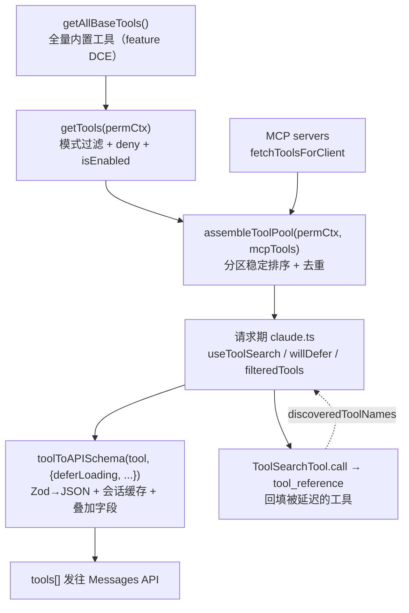
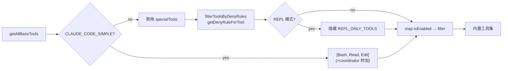
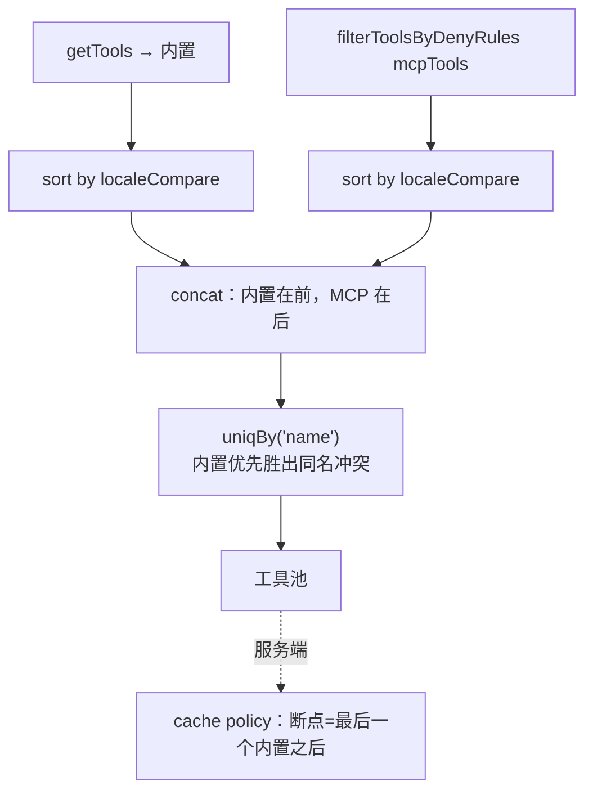
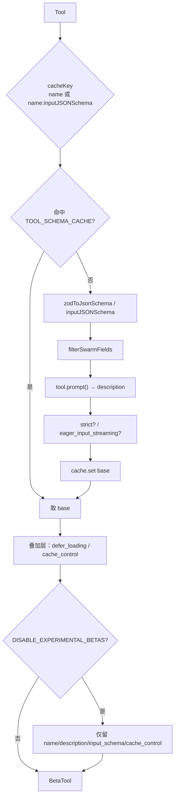
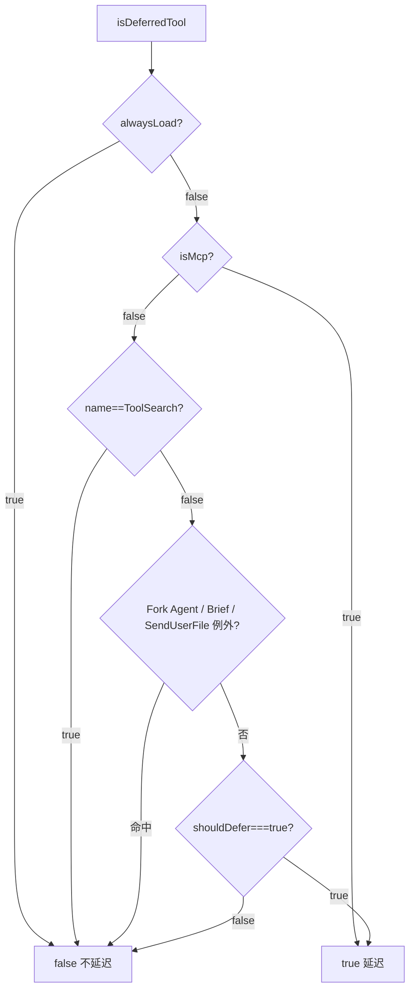
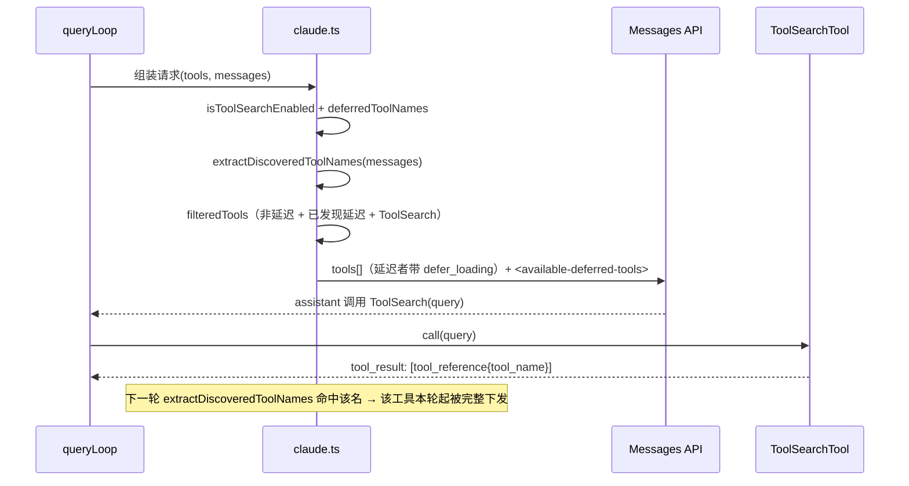
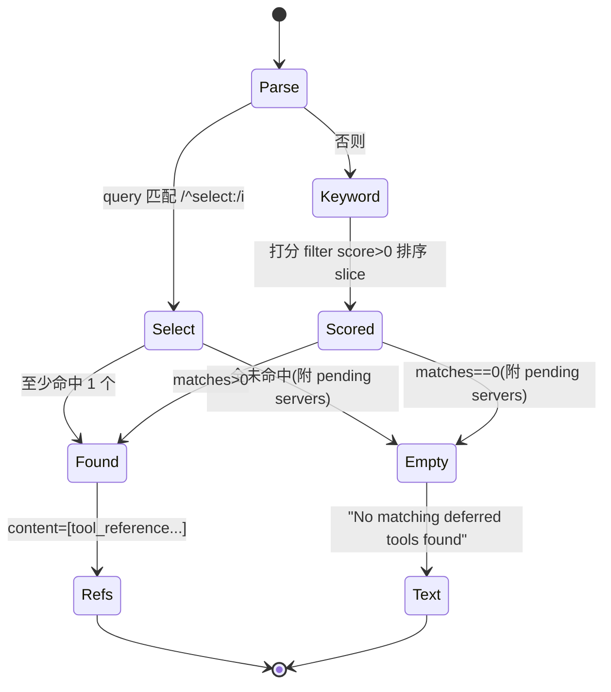
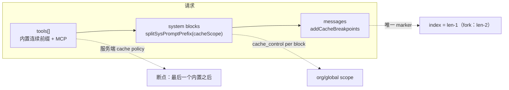

# 05 · 工具池组装、API schema 与 ToolSearch 延迟加载

本篇覆盖：`getAllBaseTools` 的 feature() DCE 静态裁剪 ｜ `getTools` / `filterToolsByDenyRules` 的模式与 deny 过滤 ｜ `assembleToolPool` 的分区稳定排序（内置工具连续前缀）｜ `toolToAPISchema` 的 Zod→JSON schema 转换、会话级缓存、`strict` / `eager_input_streaming` / `defer_loading` / `cache_control` 叠加 ｜ MCP 工具的 `mcp__server__tool` 结构与 `mcpInfo` / `isMcp` / `searchHint` / `alwaysLoad` ｜ `isDeferredTool` 的延迟判定 ｜ 请求期 `claude.ts` 里 `willDefer` / `extractDiscoveredToolNames` / `<available-deferred-tools>` 的动态装配 ｜ `ToolSearchTool` 的 `select:` / 关键词检索与 `tool_reference` 回填 ｜ `splitSysPromptPrefix` / `addCacheBreakpoints` 的缓存断点。
关键源文件：`src/tools.ts`、`src/utils/api.ts`、`src/Tool.ts`、`src/tools/ToolSearchTool/`、`src/utils/toolSearch.ts`、`src/services/mcp/client.ts`、`src/services/api/claude.ts`、`src/utils/toolPool.ts`、`src/utils/toolSchemaCache.ts`。
上一篇：04-tool-contract.md ｜ 下一篇：06-tool-execution.md

---

从"一堆 `Tool` 对象"到"发给 API 的 `tools` 数组"，中间有一条固定的流水线。它决定了三件互相耦合的事：**哪些工具被暴露给模型**（模式过滤 + deny 规则 + isEnabled）、**它们以什么顺序排列**（prompt cache 稳定性）、以及**每个工具的 schema 长什么样**（Zod→JSON、`defer_loading`、`cache_control`）。整条链路的隐藏主轴是 **prompt 缓存**：工具块渲染在服务端 position 2（在 system prompt 之前），任何一个字节的抖动都会击穿约 11K token 的工具块以及其后的全部缓存。本篇的大量设计取舍都是为了让这块字节保持稳定。



---

### getAllBaseTools —— 全量内置工具花名册（feature DCE 静态裁剪）

- **触发 / 记录**：`getTools`、`getToolsForDefaultPreset`、以及各处 token 计算最终都要先拿到"这个环境下所有可能存在的内置工具"。`getAllBaseTools` 是**唯一的真相源**（single source of truth），返回一个静态数组。它上面顶着一条硬约束注释：

```ts
/**
 * NOTE: This MUST stay in sync with https://console.statsig.com/.../claude_code_global_system_caching,
 * in order to cache the system prompt across users.
 */
export function getAllBaseTools(): Tools {
  return [
    AgentTool,
    TaskOutputTool,
    BashTool,
    ...(hasEmbeddedSearchTools() ? [] : [GlobTool, GrepTool]),
    ExitPlanModeV2Tool,
    FileReadTool,
    FileEditTool,
    FileWriteTool,
    NotebookEditTool,
    WebFetchTool,
    // ...
    ...(process.env.USER_TYPE === 'ant' ? [ConfigTool] : []),
    ...(isTodoV2Enabled() ? [TaskCreateTool, TaskGetTool, TaskUpdateTool, TaskListTool] : []),
    ...(isWorktreeModeEnabled() ? [EnterWorktreeTool, ExitWorktreeTool] : []),
    // ...
    ListMcpResourcesTool,
    ReadMcpResourceTool,
    ...(isToolSearchEnabledOptimistic() ? [ToolSearchTool] : []),
  ]
}
```
`src/tools.ts:193-251`

- **使用 / 注入**：数组里两类条件项要分清。一类是**编译期死代码消除（DCE）**：文件顶部用 `feature('X')`（`bun:bundle`）+ 三元 `require(...)` 决定一个符号是 `Tool` 还是 `null`，如 `SleepTool`、`cronTools`、`MonitorTool`、`WorkflowTool` 等（`src/tools.ts:25-52,107-134`）。构建时 `feature()` 折叠为常量，未启用的分支连同 `require` 一起被 bundler 删掉——**这些工具的代码根本不会进包**。另一类是**运行期开关**：`hasEmbeddedSearchTools()`、`isTodoV2Enabled()`、`isWorktreeModeEnabled()`、`process.env.USER_TYPE === 'ant'`、`isToolSearchEnabledOptimistic()` 等，在调用时求值决定是否 push。

- **为什么（设计意图）**：注释点破了核心动机——**跨用户系统提示缓存**。服务端 `claude_code_global_system_caching` 用一份工具名单做前缀匹配放置全局缓存断点；只要每个用户在相同 feature 下算出的内置工具集合与顺序一致，服务端就能把工具块 + 静态 system prompt 命中同一份缓存。因此这个数组的顺序不是随意的，改动它等于改动所有用户的缓存 key。DCE 与运行期开关的区别也在此：DCE 让"某构建变体里根本不存在这个工具"成为编译期事实，避免运行期 if 把死工具的 schema 泄进 prompt。

- **示例数据**（示例，据源码构造，外部默认构建、无 embedded search、非 ant、todo v2 关闭）：

```text
[ AgentTool, TaskOutputTool, BashTool, GlobTool, GrepTool, ExitPlanModeV2Tool,
  FileReadTool, FileEditTool, FileWriteTool, NotebookEditTool, WebFetchTool,
  TodoWriteTool, WebSearchTool, TaskStopTool, AskUserQuestionTool, SkillTool,
  EnterPlanModeTool, ... , BriefTool, ListMcpResourcesTool, ReadMcpResourceTool,
  ToolSearchTool ]
```

- **生命周期**：进程级、纯函数、无状态；每次调用重新构造数组。feature 分支在构建期即固定，运行期开关每次调用重新求值（因此同进程内 env 变更会反映到下次调用）。

---

### getTools / filterToolsByDenyRules / CLAUDE_CODE_SIMPLE —— 面向权限上下文的内置工具过滤

- **触发 / 记录**：`getTools(permissionContext)` 是"内置工具"的对外入口，被 `assembleToolPool`、`getMergedTools`、`logContextMetrics` 等调用。它在 `getAllBaseTools` 之上叠三层过滤，并有一个 bare 模式短路：

```ts
export const getTools = (permissionContext: ToolPermissionContext): Tools => {
  // Simple mode: only Bash, Read, and Edit tools
  if (isEnvTruthy(process.env.CLAUDE_CODE_SIMPLE)) {
    if (isReplModeEnabled() && REPLTool) { /* REPL 包裹 Bash/Read/Edit */ }
    const simpleTools: Tool[] = [BashTool, FileReadTool, FileEditTool]
    if (feature('COORDINATOR_MODE') && coordinatorModeModule?.isCoordinatorMode()) {
      simpleTools.push(AgentTool, TaskStopTool, getSendMessageTool())
    }
    return filterToolsByDenyRules(simpleTools, permissionContext)
  }

  const specialTools = new Set([
    ListMcpResourcesTool.name, ReadMcpResourceTool.name, SYNTHETIC_OUTPUT_TOOL_NAME,
  ])
  const tools = getAllBaseTools().filter(tool => !specialTools.has(tool.name))
  let allowedTools = filterToolsByDenyRules(tools, permissionContext)
  if (isReplModeEnabled()) { /* 隐藏 REPL_ONLY_TOOLS，它们只在 VM 内可用 */ }
  const isEnabled = allowedTools.map(_ => _.isEnabled())
  return allowedTools.filter((_, i) => isEnabled[i])
}
```
`src/tools.ts:271-327`（`TOOL_PRESETS = ['default']` 见 `:161`）

- **使用 / 注入**：三层过滤按顺序作用——
  1. **specialTools 剔除**：`ListMcpResourcesTool` / `ReadMcpResourceTool` / `SyntheticOutput` 从 base 里滤掉，它们由别处按需再加（避免在普通对话里污染工具集）。
  2. **deny 规则**：`filterToolsByDenyRules` 复用运行期权限检查同一个匹配器 `getDenyRuleForTool`。凡是"整体 deny 且无 `ruleContent`"（blanket deny）的工具，在模型看到之前就被剥掉；MCP 的 `mcp__server` 服务器前缀规则也会在这里一次性抹掉该 server 的全部工具，而不是等到调用时才拦。
  3. **isEnabled()**：先 map 后 filter（一次性求值，避免 filter 回调里重复调用副作用型 `isEnabled`）。

```ts
export function filterToolsByDenyRules<T extends { name: string; mcpInfo?: {...} }>(
  tools: readonly T[], permissionContext: ToolPermissionContext,
): T[] {
  return tools.filter(tool => !getDenyRuleForTool(permissionContext, tool))
}
```
`src/tools.ts:262-269`

- **为什么（设计意图）**：注释写明——"Uses the same matcher as the runtime permission check (step 1a), so MCP server-prefix rules like `mcp__server` strip all tools from that server before the model sees them — not just at call time."把 deny 前移到 schema 装配阶段，一是省 token（被禁工具连 schema 都不发），二是避免模型看到一个会在调用时被拒的工具而反复尝试。`CLAUDE_CODE_SIMPLE` 是极简子集（`--bare`），只留 Bash/Read/Edit；REPL 模式下这三者被 REPL 工具包裹进 VM，因此改为返回 REPL 并隐藏 `REPL_ONLY_TOOLS`——两条路径都保证"原语要么直接暴露、要么只在 VM 内"，不双份出现。

- **示例数据**（示例，据源码构造）：`alwaysDenyRules` 含 `{ toolName: 'mcp__github', ruleContent: undefined }` 时——

```text
getAllBaseTools() 输出 …          → 经 filterToolsByDenyRules →  mcp__github__* 全部消失
{ toolName: 'WebFetch', ruleContent: undefined } → WebFetch 从内置集里被剥离（模型看不到其 schema）
```

- **图**：



- **生命周期**：每次 `getTools` 调用重算；`permissionContext` 随会话/回合可变（plan mode、`/permissions` 改动都会改它），因此工具集是**每回合可能变化**的量。

---

### assembleToolPool / mergeAndFilterTools / getMergedTools —— 内置 + MCP 合并与"连续前缀"稳定排序

- **触发 / 记录**：这是"内置 + MCP"合并的唯一真相源，REPL（经 `useMergedTools`）与 `runAgent.ts`（coordinator worker）都走它：

```ts
export function assembleToolPool(permissionContext, mcpTools): Tools {
  const builtInTools = getTools(permissionContext)
  const allowedMcpTools = filterToolsByDenyRules(mcpTools, permissionContext)
  // Sort each partition for prompt-cache stability, keeping built-ins as a
  // contiguous prefix. ... a flat sort would interleave MCP tools into built-ins
  // and invalidate all downstream cache keys ... uniqBy preserves insertion
  // order, so built-ins win on name conflict.
  const byName = (a: Tool, b: Tool) => a.name.localeCompare(b.name)
  return uniqBy(
    [...builtInTools].sort(byName).concat(allowedMcpTools.sort(byName)),
    'name',
  )
}
```
`src/tools.ts:345-367`

- **使用 / 注入**：产出的数组直接决定 `tools[]` 里各工具的**相对顺序**。关键是**两个分区各自排序、再拼接**，而不是拼接后整体排序。`uniqBy(..., 'name')` 从前往后保留首次出现，所以同名冲突时**内置工具赢过 MCP 工具**（防止外部 MCP server 用同名工具劫持内置）。`toolPool.ts` 里 `mergeAndFilterTools` 用 `partition(uniqBy(...), isMcpTool)` 做了等价的分区稳定排序，并在 coordinator 模式下再套一层 `applyCoordinatorToolFilter`（`src/utils/toolPool.ts:55-79`）。`getMergedTools` 则相反——`[...builtInTools, ...mcpTools]` **不排序不去重**，因为它只服务 token 计数 / 阈值判断，不进 wire：

```ts
export function getMergedTools(permissionContext, mcpTools): Tools {
  const builtInTools = getTools(permissionContext)
  return [...builtInTools, ...mcpTools]
}
```
`src/tools.ts:383-389`

- **为什么（设计意图）**：注释是最好的佐证——服务端 `claude_code_system_cache_policy` 把全局缓存断点放在"最后一个前缀匹配到的内置工具之后"。如果做扁平排序，一个恰好按字母序落在两个内置工具之间的 MCP 工具就会**插进内置前缀里**，把断点后移、令所有下游缓存 key 失效。分区排序保证内置工具永远是一段连续前缀，MCP 工具永远在其后。另一个细节：注释特意说明**不用 `Array.toSorted`**（Node 20+），因为要支持 Node 18，故 `[...builtInTools].sort()` 先拷贝再排（`builtInTools` 是 readonly）。

- **示例数据（排序前后对比）**（示例，据源码构造）：内置 `[Bash, Read, Edit]`、MCP `[mcp__slack__send, mcp__github__create_issue]`。

```text
分区排序（assembleToolPool 实际行为）：
  built-in.sort → [Bash, Edit, Read]
  mcp.sort      → [mcp__github__create_issue, mcp__slack__send]
  concat        → [Bash, Edit, Read | mcp__github__create_issue, mcp__slack__send]
                                    ↑ 内置前缀在此收尾，缓存断点落在 Read 之后

假想的扁平排序（[...all].sort by localeCompare，反例）：
  → [Bash, Edit, mcp__github__create_issue, mcp__slack__send, Read]
                 ↑ MCP 插进了 Edit 与 Read 之间，内置前缀被打断 → 断点前移，Read 起全部缓存失效
```
（`localeCompare` 大小写不敏感地把 `m...` 排在 `R...`/`Read` 之前，正是它会插进内置中间的原因。）

- **图**：



- **生命周期**：每回合装配；MCP server 连上/断开会改变 `mcpTools`，进而改变池子——这正是延迟加载与缓存断点要一起考虑的原因。

---

### toolToAPISchema —— Zod→JSON schema、会话级缓存与按请求叠加字段

- **触发 / 记录**：请求期 `claude.ts` 对每个待发工具并发调用它，把 `Tool` 对象转成 API 的 `BetaToolUnion`。函数分**会话稳定基座**与**按请求叠加**两段：

```ts
const cacheKey =
  'inputJSONSchema' in tool && tool.inputJSONSchema
    ? `${tool.name}:${jsonStringify(tool.inputJSONSchema)}`
    : tool.name
const cache = getToolSchemaCache()
let base = cache.get(cacheKey)
if (!base) {
  const strictToolsEnabled = checkStatsigFeatureGate_CACHED_MAY_BE_STALE('tengu_tool_pear')
  let input_schema = (
    'inputJSONSchema' in tool && tool.inputJSONSchema
      ? tool.inputJSONSchema
      : zodToJsonSchema(tool.inputSchema)
  ) as Anthropic.Tool.InputSchema
  if (!isAgentSwarmsEnabled()) {
    input_schema = filterSwarmFieldsFromSchema(tool.name, input_schema)
  }
  base = { name: tool.name, description: await tool.prompt({...}), input_schema }
  if (strictToolsEnabled && tool.strict === true && options.model &&
      modelSupportsStructuredOutputs(options.model)) {
    base.strict = true
  }
  if (getAPIProvider() === 'firstParty' && isFirstPartyAnthropicBaseUrl() &&
      (getFeatureValue_CACHED_MAY_BE_STALE('tengu_fgts', false) ||
       isEnvTruthy(process.env.CLAUDE_CODE_ENABLE_FINE_GRAINED_TOOL_STREAMING))) {
    base.eager_input_streaming = true
  }
  cache.set(cacheKey, base)
}
```
`src/utils/api.ts:147-209`

- **使用 / 注入**：`base` 命中会话缓存 `TOOL_SCHEMA_CACHE`（`src/utils/toolSchemaCache.ts`）。随后**每请求叠加**层从 `base` 显式逐字段拷贝出一个新对象，再挂上随请求变化的 `defer_loading` 与 `cache_control`——注释强调"explicit field copy avoids mutating the cached base"：

```ts
const schema: BetaToolWithExtras = {
  name: base.name, description: base.description, input_schema: base.input_schema,
  ...(base.strict && { strict: true }),
  ...(base.eager_input_streaming && { eager_input_streaming: true }),
}
if (options.deferLoading) schema.defer_loading = true
if (options.cacheControl) schema.cache_control = options.cacheControl
```
`src/utils/api.ts:215-230`

最后一道是 **beta kill switch**：`CLAUDE_CODE_DISABLE_EXPERIMENTAL_BETAS=1` 时，只保留 allowlist `{name, description, input_schema, cache_control}`，其余（含 `defer_loading` / `eager_input_streaming` / `strict`）在这个"所有工具 schema 都要经过的唯一咽喉"处一次性剥掉，防止 LiteLLM/Bedrock 之类代理网关因 "Extra inputs are not permitted" 报 400（`src/utils/api.ts:243-260`）。

- **为什么（设计意图）**：
  - **会话缓存的动机**（`toolSchemaCache.ts` 注释）：工具 schema 渲染在服务端 position 2，任何字节变化击穿约 11K token 工具块及下游。`tengu_tool_pear`/`tengu_fgts` 这类 GrowthBook gate 会在会话中途冷→热翻转，`tool.prompt()` 里也可能含动态内容——把基座 schema 在首次渲染时锁死到 session Map，中途 GB 刷新不再抖动缓存。
  - **cacheKey 为何含 `inputJSONSchema`**：注释记录了一次真实事故——`StructuredOutput` 多个实例共享同名但每次 workflow 调用 schema 不同，只用 name 做 key 会返回过期 schema（错误率 5.4%→51%，PR#25424）。MCP 工具也设 `inputJSONSchema` 但各自稳定，纳入 key 既修 bug 又保持它们的 GB-flip 缓存稳定性。
  - **`eager_input_streaming` 仅限直连 first-party**：无 FGTS 时 API 会缓冲完整工具入参再吐 `input_json_delta`，大入参会多分钟卡死；但该字段在代理/Bedrock/Vertex 上被 400 拒，所以门控在 `getAPIProvider()==='firstParty' && isFirstPartyAnthropicBaseUrl()`。

- **示例数据（发给 API 的 `tools[]` 片段）**（示例，据源码 `BetaToolWithExtras` 与 `toolToAPISchema` 输出结构构造）：

```jsonc
[
  {
    "name": "Bash",
    "description": "Executes a bash command ...",   // 来自 tool.prompt()
    "input_schema": {                                // zodToJsonSchema(inputSchema)
      "type": "object",
      "properties": {
        "command": { "type": "string", "description": "The command to execute" },
        "timeout": { "type": "number" },
        "run_in_background": { "type": "boolean" }
      },
      "required": ["command"]
    }
    // 无 defer_loading：内置且非 deferred，缓存断点由服务端 cache policy 放置
  },
  {
    "name": "NotebookEdit",
    "description": "...",
    "input_schema": { "type": "object", "properties": { /* ... */ } },
    "defer_loading": true          // shouldDefer: true，本回合未被发现 → 只发占位
  }
]
```

> 关于 `cache_control`：`toolToAPISchema` 支持 `options.cacheControl` 叠加到工具上，但**默认 query 路径并不传它**——工具块缓存交给服务端 `claude_code_system_cache_policy` 的前缀匹配。因此普通请求里工具对象通常不带 `cache_control`（若显式传入，形如 `"cache_control": { "type": "ephemeral", "ttl": "1h" }`）。

- **图**：



- **生命周期**：`base` 会话级持久（`TOOL_SCHEMA_CACHE` 进程内 Map，`clearToolSchemaCache()` / auth 变更时清）；叠加层每请求重算。

---

### mcpInfo / isMcp / inputJSONSchema / searchHint / alwaysLoad —— MCP 工具的结构

- **触发 / 记录**：MCP 工具由 `fetchToolsForClient` 把 server 的 `tools/list` 结果映射成 `Tool`：

```ts
const fullyQualifiedName = buildMcpToolName(client.name, tool.name)   // mcp__server__tool
return {
  ...MCPTool,
  name: skipPrefix ? tool.name : fullyQualifiedName,
  mcpInfo: { serverName: client.name, toolName: tool.name },
  isMcp: true,
  searchHint:
    typeof tool._meta?.['anthropic/searchHint'] === 'string'
      ? tool._meta['anthropic/searchHint'].replace(/\s+/g, ' ').trim() || undefined
      : undefined,
  alwaysLoad: tool._meta?.['anthropic/alwaysLoad'] === true,
  async description() { return tool.description ?? '' },
  async prompt() { /* 超 MAX_MCP_DESCRIPTION_LENGTH 则截断 + '… [truncated]' */ },
  inputJSONSchema: tool.inputSchema as Tool['inputJSONSchema'],
  // ...
}
```
`src/services/mcp/client.ts:1768-1813`；名字拼装 `buildMcpToolName` → `mcp__${normalizeNameForMCP(server)}__${normalizeNameForMCP(tool)}`（`src/services/mcp/mcpStringUtils.ts:50-52`）

- **使用 / 注入**：
  - `name`（`mcp__server__tool`）是模型看到、也是 wire 上用于调用的标识；`mcpInfo` 保留未规范化的 `serverName`/`toolName`，权限检查 `getToolNameForPermissionCheck` 用它重建前缀名，避免 deny 内置 `Write` 误伤同名 MCP 替身（`mcpStringUtils.ts:60-67`）。
  - `inputJSONSchema`：MCP 直接给 JSON Schema，`toolToAPISchema` 走"有 `inputJSONSchema` 就直接用、否则 `zodToJsonSchema`"分支（`api.ts:157-160`），并把它纳入 cacheKey。
  - `isMcp: true` 使 `isDeferredTool` 一律判定为 deferred（见下节）。
  - `searchHint` / `alwaysLoad` 来自 server 的 `_meta`，分别喂给 ToolSearch 打分与"跳过延迟"。

- **为什么（设计意图）**：`Tool.ts` 对这两个字段有权威说明——`alwaysLoad`："its full schema appears in the initial prompt even when ToolSearch is enabled. For MCP tools, set via `_meta['anthropic/alwaysLoad']`. Use for tools the model must see on turn 1 without a ToolSearch round-trip."`searchHint`："One-line capability phrase used by ToolSearch for keyword matching ... 3–10 words, no trailing period. Prefer terms not already in the tool name (e.g. 'jupyter' for NotebookEdit)."（`src/Tool.ts:373-378,443-455`）。`searchHint` 里做 `replace(/\s+/g, ' ')` 折叠空白，因为 `_meta` 对外部 server 开放，换行会污染 `formatDeferredToolLine`（按 `\n` join）的延迟工具清单。

- **示例数据（一个 MCP 工具的内部结构 + 其 API schema）**（示例，据源码构造）：

```jsonc
// 内部 Tool 对象（节选）
{
  "name": "mcp__github__create_issue",
  "mcpInfo": { "serverName": "github", "toolName": "create_issue" },
  "isMcp": true,
  "searchHint": "open a GitHub issue",
  "alwaysLoad": false,
  "inputJSONSchema": {
    "type": "object",
    "properties": { "title": { "type": "string" }, "body": { "type": "string" } },
    "required": ["title"]
  }
}

// 经 toolToAPISchema 后发往 API（tool search 开启、未被发现时）
{
  "name": "mcp__github__create_issue",
  "description": "Create a new issue ...",
  "input_schema": { "type": "object", "properties": { "title": {...}, "body": {...} }, "required": ["title"] },
  "defer_loading": true
}
```

- **生命周期**：随 MCP server 连接产生（`fetchToolsForClient` 带 LRU memoize）；server 断开则工具从池中消失，触发延迟工具 delta 与缓存断点重算。

---

### isDeferredTool / shouldDefer / alwaysLoad —— 单个工具是否被延迟

- **触发 / 记录**：`isDeferredTool` 是"这个工具要不要带 `defer_loading` 发出"的判定核心，按固定优先级短路：

```ts
export function isDeferredTool(tool: Tool): boolean {
  if (tool.alwaysLoad === true) return false          // _meta['anthropic/alwaysLoad'] 显式退出，最先判
  if (tool.isMcp === true) return true                // MCP 一律延迟（workflow-specific）
  if (tool.name === TOOL_SEARCH_TOOL_NAME) return false // 永不延迟自己
  if (feature('FORK_SUBAGENT') && tool.name === AGENT_TOOL_NAME) {
    if (require('../AgentTool/forkSubagent.js').isForkSubagentEnabled()) return false
  }
  if ((feature('KAIROS') || feature('KAIROS_BRIEF')) && BRIEF_TOOL_NAME &&
      tool.name === BRIEF_TOOL_NAME) return false     // Brief 是首要沟通通道
  if (feature('KAIROS') && SEND_USER_FILE_TOOL_NAME &&
      tool.name === SEND_USER_FILE_TOOL_NAME && isReplBridgeActive()) return false
  return tool.shouldDefer === true                    // 兜底：内置工具显式 opt-in
}
```
`src/tools/ToolSearchTool/prompt.ts:62-108`

- **使用 / 注入**：请求期 `claude.ts` 先把它算成一个名字集合（因为它每次调用做 2 次 GrowthBook 查询，预计算省开销）：

```ts
const deferredToolNames = new Set<string>()
if (useToolSearch) {
  for (const t of tools) { if (isDeferredTool(t)) deferredToolNames.add(t.name) }
}
```
`src/services/api/claude.ts:1128-1134`

被判 deferred 的内置工具，是那些显式声明 `shouldDefer: true` 的低频/情境化工具，如 `NotebookEdit`、`WebFetch`、`TaskStop`、`WebSearch`、`ExitPlanModeV2`、`EnterWorktree`/`ExitWorktree`、`Cron*`、`SendMessage`、`Task*` 等（各自 `*.ts` 里的 `shouldDefer: true`）。

- **为什么（设计意图）**：延迟加载的目的是**把不常用工具从 turn-1 的工具块里挪走**，换取更小的常驻 schema 与更稳定的缓存前缀；模型需要时通过 ToolSearch 现取。几个"永不延迟"的例外都带明确理由注释：ToolSearch 自身若被延迟就无法自举；`FORK_SUBAGENT` 下 Agent 必须 turn-1 可用；`Brief`/`SendUserFile` 是沟通通道，其 prompt 含"文本可见性契约"，必须无 round-trip 即见。`searchHint` 不参与是否延迟的判定，只参与被延迟后如何被搜到（下一节 `renderHint` 曾做 A/B，`formatDeferredToolLine` 现在只渲染 name，见 `prompt.ts:110-117`）。

- **示例数据**（示例，据源码构造）：

| 工具 | 关键属性 | isDeferredTool |
|------|----------|----------------|
| `Bash` | 内置，无 shouldDefer | `false`（常驻） |
| `NotebookEdit` | `shouldDefer: true` | `true` |
| `ToolSearch` | name === TOOL_SEARCH_TOOL_NAME | `false` |
| `mcp__github__create_issue` | `isMcp: true` | `true` |
| `mcp__foo__bar`（`_meta.alwaysLoad`） | `alwaysLoad: true` | `false`（常驻） |

- **图**：



---

### 请求期动态装配 —— willDefer / discoveredToolNames / filteredTools / `<available-deferred-tools>`

- **触发 / 记录**：`claude.ts` 在拿到工具池后，决定 tool search 是否启用、哪些延迟工具本回合"已被发现"因而要真正下发。核心是三步：

```ts
let useToolSearch = await isToolSearchEnabled(options.model, tools, ..., 'query')
// ...若 useToolSearch 且无 deferred 工具且无 pending MCP → 关闭
if (useToolSearch) {
  const discoveredToolNames = extractDiscoveredToolNames(messages)
  filteredTools = tools.filter(tool => {
    if (!deferredToolNames.has(tool.name)) return true         // 非延迟：始终发
    if (toolMatchesName(tool, TOOL_SEARCH_TOOL_NAME)) return true
    return discoveredToolNames.has(tool.name)                  // 延迟：仅发已发现的
  })
} else {
  filteredTools = tools.filter(t => !toolMatchesName(t, TOOL_SEARCH_TOOL_NAME))
}
const willDefer = (t: Tool) =>
  useToolSearch && (deferredToolNames.has(t.name) || shouldDeferLspTool(t))
```
`src/services/api/claude.ts:1120-1172,1208-1209`

`extractDiscoveredToolNames` 扫历史消息里 `tool_result` 内的 `tool_reference` 块，凑出"迄今被 ToolSearch 拉起过的工具名"；compact 会把该集合快照到边界标记的 `preCompactDiscoveredTools` 上再读回（`src/utils/toolSearch.ts:545-592`）。

- **使用 / 注入**：`filteredTools` 决定**真正进 `tools[]` 的工具**；`willDefer(tool)` 决定每个工具是否带 `defer_loading`——注意传给 `toolToAPISchema` 的是**全量 `tools`**（不是 filteredTools），好让 ToolSearch 的 prompt 能列出所有 MCP 工具：

```ts
const toolSchemas = await Promise.all(
  filteredTools.map(tool => toolToAPISchema(tool, {
    getToolPermissionContext: options.getToolPermissionContext,
    tools, agents: options.agents, allowedAgentTypes: options.allowedAgentTypes,
    model: options.model, deferLoading: willDefer(tool),
  })),
)
```
`src/services/api/claude.ts:1235-1246`

启用后还要加 beta header（`getToolSearchBetaHeader()`，1P/Foundry 用 advanced-tool-use，Vertex/Bedrock 用 tool-search-tool，`:1174-1182`）。最后，**延迟工具清单如何告诉模型**分两条路：delta 关闭时，每请求前置一条 `isMeta` 用户消息：

```ts
if (useToolSearch && !isDeferredToolsDeltaEnabled()) {
  const deferredToolList = tools.filter(t => deferredToolNames.has(t.name))
    .map(formatDeferredToolLine).sort().join('\n')
  if (deferredToolList) {
    messagesForAPI = [
      createUserMessage({
        content: `<available-deferred-tools>\n${deferredToolList}\n</available-deferred-tools>`,
        isMeta: true,
      }),
      ...messagesForAPI,
    ]
  }
}
```
`src/services/api/claude.ts:1330-1345`

delta 开启（ant 或 `tengu_glacier_2xr`）时改由持久化 `deferred_tools_delta` attachment 承载（增量宣告，避免每次前置头把缓存打穿）；ToolSearch 的 prompt 里 `getToolLocationHint()` 也据此在"`<system-reminder>`"与"`<available-deferred-tools>`"两种措辞间切换（`prompt.ts:35-42`）。

- **为什么（设计意图）**：注释点明"Dynamic tool loading ... eliminates the need to predeclare all deferred tools upfront and removes limits on tool quantity"。只发"已发现"的延迟工具，让常驻工具块最小；`willDefer` 里并入 `shouldDeferLspTool`——LSP 初始化未完成时也临时 `defer_loading`（`claude.ts:783-793`）。此外 `PROMPT_CACHE_BREAK_DETECTION` 时会把 `defer_loading` 工具排除出缓存 hash，因为 API 会把它们从 prompt 剥掉，纳入会造成"工具 schema 变了"的假阳性缓存中断（`claude.ts:1460-1467`）。

- **图（时序）**：



- **生命周期**：`discoveredToolNames` 从消息历史重建，属**会话级累积**；compact 经边界标记 `preCompactDiscoveredTools` 保留，resume 后由历史里的 `tool_reference` 块重新扫出，无需持久化额外状态。

---

### ToolSearchTool.call —— `select:` 直选、关键词打分与 `tool_reference` 回填

- **触发 / 记录**：模型调用 `ToolSearch(query, max_results=5)`。输入/输出 schema：

```ts
inputSchema = z.object({
  query: z.string().describe('... Use "select:<tool_name>" for direct selection, or keywords to search.'),
  max_results: z.number().optional().default(5),
})
outputSchema = z.object({
  matches: z.array(z.string()), query: z.string(),
  total_deferred_tools: z.number(), pending_mcp_servers: z.array(z.string()).optional(),
})
```
`src/tools/ToolSearchTool/ToolSearchTool.ts:21-44`

`call` 先取 `deferredTools = tools.filter(isDeferredTool)`，再分两条路：`select:` 前缀走精确直选（支持逗号多选 `select:A,B,C`），否则走关键词检索：

```ts
const selectMatch = query.match(/^select:(.+)$/i)
if (selectMatch) {
  const requested = selectMatch[1]!.split(',').map(s => s.trim()).filter(Boolean)
  for (const toolName of requested) {
    const tool = findToolByName(deferredTools, toolName) ?? findToolByName(tools, toolName)
    if (tool) { if (!found.includes(tool.name)) found.push(tool.name) } else missing.push(toolName)
  }
  // found.length===0 → 空结果（附 pending servers）；否则 buildSearchResult(found, ...)
}
```
`src/tools/ToolSearchTool/ToolSearchTool.ts:363-406`

- **使用 / 注入**：结果经 `mapToolResultToToolResultBlockParam` 变成**`tool_reference` 块数组**回给模型；API 端把这些引用展开成完整工具定义注入上下文，正是上一节 `extractDiscoveredToolNames` 要扫的东西：

```ts
return {
  type: 'tool_result', tool_use_id: toolUseID,
  content: content.matches.map(name => ({ type: 'tool_reference' as const, tool_name: name })),
}
```
`src/tools/ToolSearchTool/ToolSearchTool.ts:462-469`（无匹配时退回纯文本 "No matching deferred tools found"，并把 `pending_mcp_servers` 提示拼进去，`:448-461`）

关键词检索 `searchToolsWithKeywords` 的打分：MCP part 精确命中 +12（非 MCP +10）、部分命中 +6/+5、`searchHint` 命中 +4、description 命中 +2；`+term` 前缀是必需项，先 AND 预过滤再打分（`ToolSearchTool.ts:186-302`）。还有 fast-path：query 恰是某工具名时直接返回它（应对模型漏写 `select:`）。

- **为什么（设计意图）**：`tool_reference` 是把"工具发现"变成一次**工具往返**而非重发全量 schema 的关键——只回工具名引用，API 负责展开，省 token。`select:` 允许模型在系统提示里看到延迟工具名后直接点名加载（本会话文首的 system-reminder 就演示了 `select:<name>` 用法）。注释也交代兼容性："This format works on 1P/Foundry. Bedrock/Vertex may not support client-side tool_reference expansion yet."描述缓存 `getToolDescriptionMemoized` 按工具名 memoize，`maybeInvalidateCache` 在延迟工具集合变化时清（server 连断），保证打分文本不过期。

- **示例数据（一次 `call` 的输出）**（示例，据 output schema 构造）：

```jsonc
// query="select:NotebookEdit,WebFetch"
{ "matches": ["NotebookEdit", "WebFetch"], "query": "select:NotebookEdit,WebFetch", "total_deferred_tools": 14 }
// → mapToolResultToToolResultBlockParam →
{ "type": "tool_result", "tool_use_id": "toolu_x",
  "content": [ { "type": "tool_reference", "tool_name": "NotebookEdit" },
               { "type": "tool_reference", "tool_name": "WebFetch" } ] }

// query="jupyter notebook"（关键词，NotebookEdit.searchHint='edit Jupyter notebook cells (.ipynb)'）
{ "matches": ["NotebookEdit"], "query": "jupyter notebook", "total_deferred_tools": 14 }
```

- **图（状态）**：



- **生命周期**：`isConcurrencySafe`/`isReadOnly` 均 true，可并发只读执行；描述缓存进程内、随延迟集合变化失效（`clearToolSearchDescriptionCache`）。

---

### splitSysPromptPrefix / addCacheBreakpoints —— system prompt 分块缓存与唯一消息级断点

- **触发 / 记录**：工具块之后是 system prompt 与消息序列的缓存放置。`splitSysPromptPrefix` 把 system prompt 切成带 `cacheScope` 的块（`buildSystemPromptBlocks` 据此挂 `cache_control`）；`addCacheBreakpoints` 决定消息序列上唯一的消息级 `cache_control`：

```ts
const markerIndex = skipCacheWrite ? messages.length - 2 : messages.length - 1
const result = messages.map((msg, index) => {
  const addCache = index === markerIndex
  // user/assistant → *MessageToMessageParam(msg, addCache, enablePromptCaching, querySource)
})
```
`src/services/api/claude.ts:3089-3106`

- **使用 / 注入**：`splitSysPromptPrefix` 有三种模式（`api.ts:321-435`）：
  - **MCP 在场**（`skipGlobalCacheForSystemPrompt=true`，即 `needsToolBasedCacheMarker`）：≤3 块，attribution(`null`) / prefix(`org`) / rest(`org`)——**不给 system prompt 用 global scope**，因为全局缓存断点改由工具块承载。
  - **global cache + boundary**：≤4 块，用 `SYSTEM_PROMPT_DYNAMIC_BOUNDARY` 把 boundary 前的静态内容标 `global`、之后动态内容标 `null`。
  - **默认（3P 或无 boundary）**：≤3 块 org 级。

`needsToolBasedCacheMarker` 的判定在 `claude.ts:1212-1214`——`useGlobalCacheFeature && filteredTools.some(t => t.isMcp && !willDefer(t))`：只有当某 MCP 工具**真的会渲染**（非 defer_loading）时，才把 system prompt 的全局缓存让位给工具块。这把本篇三条线（延迟加载、工具排序、system 缓存）拧到了一处。

- **为什么（设计意图）**：`addCacheBreakpoints` 的注释解释了"为何只放一个断点"：Mycro 的逐回合驱逐会释放任何"不在 `cache_store_int_token_boundaries` 的已缓存前缀位置"的 local-attention KV 页；两个断点会保护倒数第二个位置、白白多留一回合永不会被 resume 的 locals，一个断点则立即释放。fire-and-forget fork（`skipCacheWrite`）把断点移到倒数第二条——那是最后的共享前缀点，写入变成 Mycro 上的 no-op merge，fork 不在 KVCC 留尾巴。`enablePromptCaching` 时还会给"最后一个 `cache_control` 之前"的 `tool_result` 块补 `cache_reference`（`claude.ts:3164-3207`）——API 要求 `cache_reference` 出现在最后一个 `cache_control`"之前或之上"，这里用严格"之前"以避开 cache_edits 拼接导致的索引漂移。

- **示例数据（system prompt 分块，MCP 在场模式）**（示例，据源码构造）：

```jsonc
[
  { "type": "text", "text": "x-anthropic-billing-header: ..." },                 // cacheScope=null → 无 cache_control
  { "type": "text", "text": "You are Claude Code ...", "cache_control": { "type": "ephemeral" } }, // prefix, org
  { "type": "text", "text": "<env>...</env>\n\n# gitStatus ...", "cache_control": { "type": "ephemeral" } } // rest, org
]
```

- **图（缓存断点全景）**：



- **生命周期**：`splitSysPromptPrefix` 每请求算；`buildSystemPromptBlocks` 注释警告"Do not add any more blocks for caching or you will get a 400"——块数量是硬约束。`addCacheBreakpoints` 每请求重放，断点位置随消息数与 `skipCacheWrite` 变化。

---

## 小结：三条相互纠缠的不变量

1. **内置工具必须是连续前缀且顺序稳定**（`getAllBaseTools` 的固定序 + `assembleToolPool`/`mergeAndFilterTools` 的分区排序），否则服务端 `claude_code_system_cache_policy` 的工具块断点位置漂移，击穿约 11K token。
2. **工具 schema 字节要会话稳定**（`toolSchemaCache` 锁基座 + `toolToAPISchema` 叠加层只碰 `defer_loading`/`cache_control`），GB gate 中途翻转不抖缓存；`inputJSONSchema` 纳入 cacheKey 修复了 StructuredOutput 同名异 schema 的事故。
3. **延迟加载把低频/MCP 工具移出 turn-1**（`isDeferredTool` + `willDefer` + `extractDiscoveredToolNames` + ToolSearch 的 `tool_reference` 回填），既缩小常驻 schema，又让工具发现只花一次工具往返而非重发全量定义。

这三者共同的敌人都是"不必要的缓存失效"，而共同的手段是"把易变部分收敛到少数几个可控的叠加点"。下一篇 06 进入工具的**执行**阶段：validateInput / checkPermissions / call 的调度与并发。
