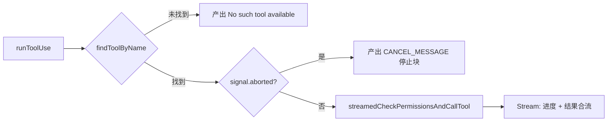
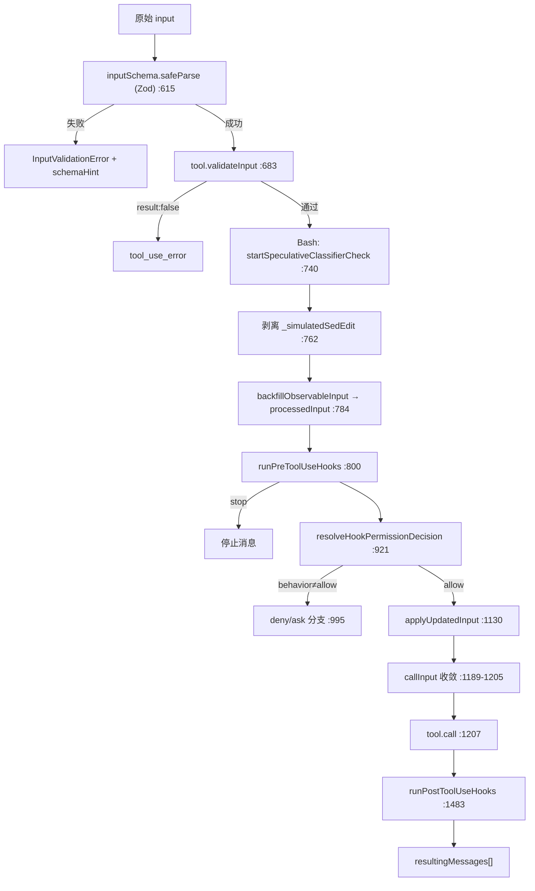
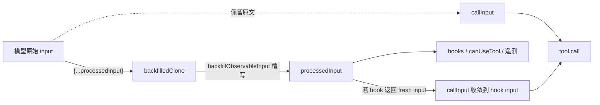
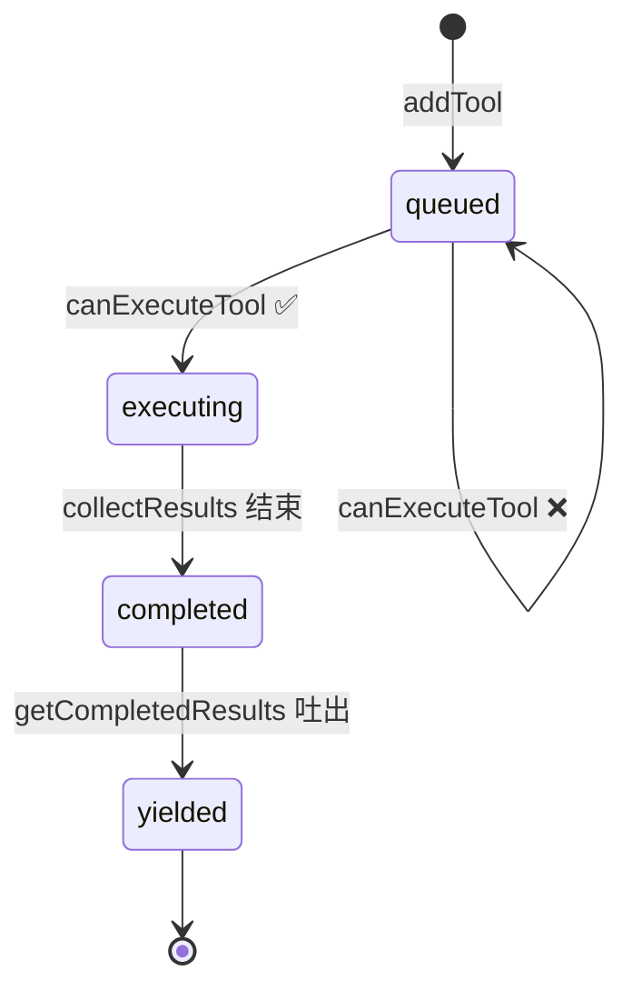
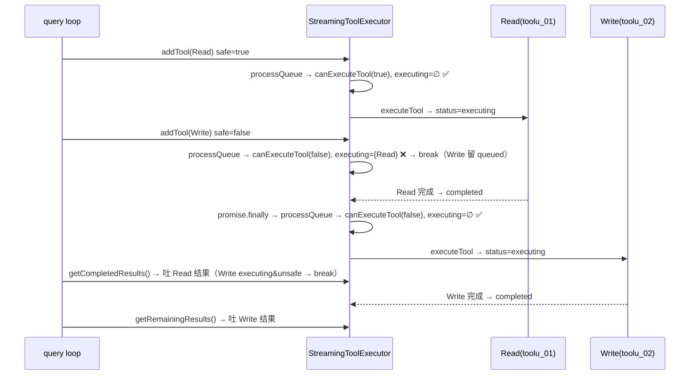
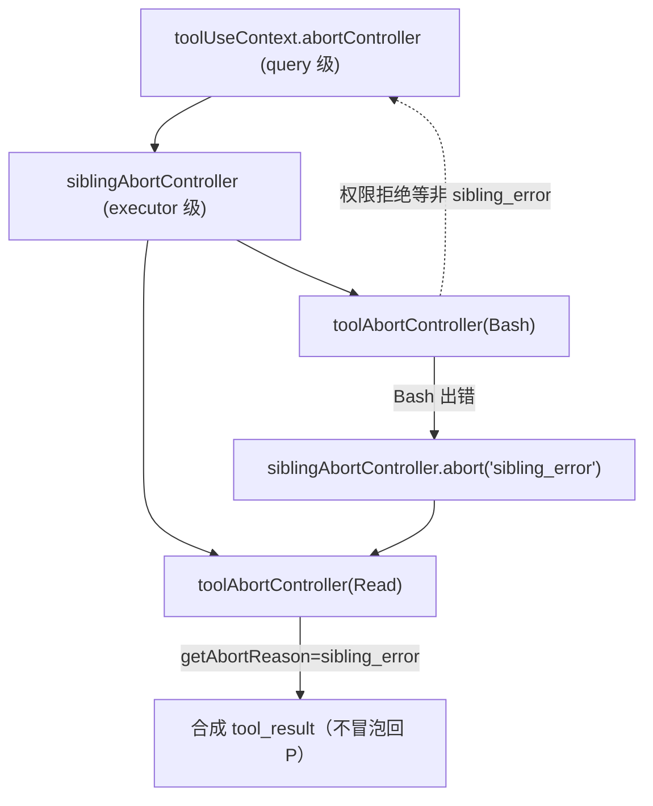
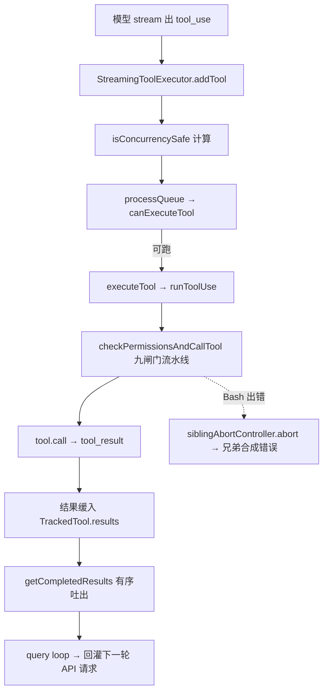

# 06 · 工具执行编排与并发调度

> 本篇覆盖：单个 `tool_use` 的执行生命周期（`runToolUse` → `checkPermissionsAndCallTool` 全流水线）、`StreamingToolExecutor` 的边流边跑并发调度、`isConcurrencySafe`/`canExecuteTool` 的独占-并行判定、sibling abort 级联与合成错误、以及遗留的 `runTools`/`partitionToolCalls` 编排器与 `generators.all` 合流 ｜ 关键源文件：`src/services/tools/toolExecution.ts`、`src/services/tools/StreamingToolExecutor.ts`、`src/services/tools/toolOrchestration.ts`、`src/utils/generators.ts`、`src/utils/abortController.ts` ｜ 上一篇：05-tool-registry-schema.md ｜ 下一篇：07-permission-engine.md

模型一轮回复里可能夹带多个 `tool_use` block。系统要回答两个正交的问题：

1. **单个工具怎么跑？** —— 从模型给的原始 JSON 到一条 `tool_result` 消息，中间要过 Zod 解析、值级校验、PreToolUse 钩子、权限闸门、`tool.call`、PostToolUse 钩子。这条流水线由 `runToolUse` / `checkPermissionsAndCallTool` 承载。
2. **多个工具怎么调度？** —— 谁能并行、谁必须独占、结果怎么保序发回给模型。这由两套编排器二选一承担：**新版 `StreamingToolExecutor`（边流边跑）** 和 **遗留 `runTools`（等 block 收齐再批处理）**。

选谁由一个 gate 决定：

```ts
const useStreamingToolExecution = config.gates.streamingToolExecution
let streamingToolExecutor = useStreamingToolExecution
  ? new StreamingToolExecutor(toolUseContext.options.tools, canUseTool, toolUseContext)
  : null
// ...
const toolUpdates = streamingToolExecutor
  ? streamingToolExecutor.getRemainingResults()
  : runTools(toolUseBlocks, assistantMessages, canUseTool, toolUseContext)
```
`src/query.ts:561`、`src/query.ts:1380-1382`

两条路径最终都调用同一个 `runToolUse`。下面先讲**单工具流水线**（两条编排器共享），再分别讲**两套调度器**。

---

## 单工具流水线

### runToolUse —— 单个 tool_use 的入口

- **触发 / 记录**：编排器对每个 `ToolUseBlock` 调一次 `runToolUse`，它是一个 `AsyncGenerator<MessageUpdateLazy>`。开头做三件“廉价拒绝”的事：按名字找工具（含 alias 回退到废弃名）、工具不存在 → 立刻产出 `No such tool available` 错误、已 abort → 产出 `CANCEL_MESSAGE` 停止块。

```ts
let tool = findToolByName(toolUseContext.options.tools, toolName)
if (!tool) {
  const fallbackTool = findToolByName(getAllBaseTools(), toolName)
  if (fallbackTool && fallbackTool.aliases?.includes(toolName)) {
    tool = fallbackTool
  }
}
```
`src/services/tools/toolExecution.ts:345-356`

- **使用 / 注入**：通过后，进入 `streamedCheckPermissionsAndCallTool`，把“进度事件”和“最终结果”这两种异步来源合并成一个 `AsyncIterable`。做法是一个 `Stream<MessageUpdateLazy>`：`checkPermissionsAndCallTool` 的 `onToolProgress` 回调 `stream.enqueue` 进度，Promise resolve 后把返回的 `MessageUpdateLazy[]` 逐条 `enqueue`，最后 `stream.done()`。

```ts
const stream = new Stream<MessageUpdateLazy>()
checkPermissionsAndCallTool(/* ... */, progress => {
  stream.enqueue({ message: createProgressMessage({ /* ... */ }) })
})
  .then(results => { for (const result of results) stream.enqueue(result) })
  .catch(error => { stream.error(error) })
  .finally(() => { stream.done() })
return stream
```
`src/services/tools/toolExecution.ts:509-569`

- **为什么**：注释直言这是“a bit of a hack”——进度报告和结果报告本应走两套机制，但为了让上游用一个 `for await` 统一消费，把它们缝进同一个 iterable。产出类型叫 `MessageUpdateLazy`：`message` + 可选 `contextModifier`（延迟到编排层再 apply，见下文并发批的处理）。

- **生命周期**：每个 `tool_use` block 一次，作用域是当前 queryLoop 回合。abort 检查读的是 `toolUseContext.abortController.signal`（在 `StreamingToolExecutor` 里会被替换成 per-tool 子控制器，见 sibling abort 一节）。



---

### checkPermissionsAndCallTool —— 权限与调用全流水线

这是整篇的核心函数（`src/services/tools/toolExecution.ts:599`）。它 `Promise<MessageUpdateLazy[]>`，把一个工具从“模型给的原始 input”推到“一条或多条结果消息”。流水线按顺序有九个闸门，任一闸门失败都会**提前 return** 一个错误/停止消息数组：



下面逐个拆闸门。

#### Zod 解析与 buildSchemaNotSentHint

- **触发 / 记录**：第一道闸门。模型生成的 JSON 未必合 schema，用 `tool.inputSchema.safeParse` 兜底。

```ts
const parsedInput = tool.inputSchema.safeParse(input)
if (!parsedInput.success) {
  let errorContent = formatZodValidationError(tool.name, parsedInput.error)
  const schemaHint = buildSchemaNotSentHint(tool, toolUseContext.messages, toolUseContext.options.tools)
  if (schemaHint) { /* logEvent tengu_deferred_tool_schema_not_sent */ errorContent += schemaHint }
  // ... return 一条 is_error tool_result
}
```
`src/services/tools/toolExecution.ts:615-680`

- **使用 / 注入**：失败时产出的消息 `content` 是 `<tool_use_error>InputValidationError: …</tool_use_error>`，`is_error: true`，直接作为 `tool_result` 回给模型。`buildSchemaNotSentHint` 是一个精妙补丁：**deferred 工具**（需先 `ToolSearch` 载入 schema 才会把 schema 发给 API）如果没被载入，模型会把数组/数字当字符串发，Zod 必然报“expected array, got string”——但原始 Zod 报错不会告诉模型“去重新载入工具”。这个 hint 就补上这句话。

```ts
if (!isToolSearchEnabledOptimistic()) return null
if (!isToolSearchToolAvailable(tools)) return null
if (!isDeferredTool(tool)) return null
const discovered = extractDiscoveredToolNames(messages)
if (discovered.has(tool.name)) return null
return `\n\nThis tool's schema was not sent to the API — ... Load the tool first: call ${TOOL_SEARCH_TOOL_NAME} with query "select:${tool.name}", then retry this call.`
```
`src/services/tools/toolExecution.ts:587-596`

- **为什么**：注释点出 Zod 报错“doesn't tell the model to re-load the tool; this hint does”。三道乐观 gate（tool search 开启 / 可调 / 是 deferred 且未 discovered）避免指向一个不可调的 ToolSearch；偶尔误报只多花一轮往返。

#### validateInput —— 值级校验

- **触发 / 记录**：Zod 保证**类型**合法后，`tool.validateInput?.()` 做**值**级校验（文件是否存在、命令是否被 policy 禁等），返回 `{ result: false, message, errorCode }` 即拒绝。

```ts
const isValidCall = await tool.validateInput?.(parsedInput.data, toolUseContext)
if (isValidCall?.result === false) {
  // ... return <tool_use_error>${isValidCall.message}</tool_use_error> is_error
}
```
`src/services/tools/toolExecution.ts:683-733`

- **为什么**：注释一句到位——“surprisingly, the model is not great at generating valid input”。类型与值分两层，是因为 Zod 只能表达结构约束，业务约束（路径存在性、越界等）必须每个工具自己实现。

#### 推测式 bash 分类器（提前预热）

- **触发 / 记录**：对 Bash 工具，在权限判定**之前**就把 allow-classifier 的检查启动起来，让它和 PreToolUse 钩子、deny/ask 分类器、权限对话框搭建并行跑。

```ts
if (tool.name === BASH_TOOL_NAME && parsedInput.data && 'command' in parsedInput.data) {
  const appState = toolUseContext.getAppState()
  startSpeculativeClassifierCheck(
    (parsedInput.data as BashToolInput).command,
    appState.toolPermissionContext,
    toolUseContext.abortController.signal,
    toolUseContext.options.isNonInteractiveSession,
  )
}
```
`src/services/tools/toolExecution.ts:740-752`

- **为什么**：注释强调 UI 指示器 `setClassifierChecking` **不**在这里设——它只在权限返回 `ask` 且带 `pendingClassifierCheck` 时由 `interactiveHandler.ts` 设。这样对“靠前缀规则自动放行”的命令，不会闪一下“classifier running”。本质是把网络/计算延迟藏进后面必然要等的权限阶段里。

#### backfillObservableInput 与 callInput 双输入

- **触发 / 记录**：这是整条流水线里最微妙的设计。系统区分**两份 input**：`processedInput`（给 hooks / canUseTool “观察”用，字段被补全/派生）与 `callInput`（真正传给 `tool.call` 用，保留模型原样值）。先剥离防御字段 `_simulatedSedEdit`，再在浅克隆上 `backfillObservableInput`：

```ts
let callInput = processedInput
const backfilledClone =
  tool.backfillObservableInput && typeof processedInput === 'object' && processedInput !== null
    ? ({ ...processedInput } as typeof processedInput)
    : null
if (backfilledClone) {
  tool.backfillObservableInput!(backfilledClone as Record<string, unknown>)
  processedInput = backfilledClone
}
```
`src/services/tools/toolExecution.ts:783-793`

- **使用 / 注入**：`processedInput` 一路喂给 `runPreToolUseHooks`、`resolveHookPermissionDecision`、遥测。而 `callInput` 在 `tool.call` 之前做一次“收敛”：如果没有 hook/permission 换过 input，就用 backfill **之前**的 `callInput`；如果换过、且被换的 `file_path` 恰好等于 backfill 展开后的值，就把模型原始 `file_path` 塞回去；否则 hook 的修改整体透传。

```ts
if (backfilledClone && processedInput !== callInput && /* file_path 都在 */
    (processedInput as Record<string, unknown>).file_path === (backfilledClone as Record<string, unknown>).file_path) {
  callInput = { ...processedInput, file_path: (callInput as Record<string, unknown>).file_path } as typeof processedInput
} else if (processedInput !== backfilledClone) {
  callInput = processedInput
}
```
`src/services/tools/toolExecution.ts:1189-1205`

- **为什么**：注释说得清楚——文件工具会用 `expandPath` 覆写 `file_path`，但这个改动**绝不能进 `call()`**：因为 tool result 字符串会把 input 路径逐字嵌进去（`"File created successfully at: {path}"`），改路径就改了序列化 transcript 和 VCR fixture 的哈希。而如果 hook/permission 真的返回了 fresh `updatedInput`，`callInput` 会主动收敛到它——这是有意的替换。一句话：**可观测输入可被派生字段污染，API 绑定输入必须与模型原文逐字对齐**。

- **示例数据（示例，据源码构造）**：模型发 `{"file_path":"src/x.ts","content":"..."}`，`backfillObservableInput` 把 `file_path` 展开为 `/home/u/proj/src/x.ts`：

```
processedInput（喂 hooks/permission）: { file_path: "/home/u/proj/src/x.ts", content: "..." }
callInput（喂 tool.call）:            { file_path: "src/x.ts",              content: "..." }
tool_result 文本:                     "File created successfully at: src/x.ts"   ← 用的是原文路径
```



#### PreToolUse 钩子

- **触发 / 记录**：backfill 之后、权限之前。`runPreToolUseHooks` 是异步生成器，逐条产出不同类型的结果，`switch` 分派：`message`（进度或普通消息）、`hookPermissionResult`（钩子直接给出权限决定，缓存起来给下一步）、`hookUpdatedInput`（钩子改写 input，透传更新 `processedInput`）、`preventContinuation`/`stopReason`（阻断后续）、`stop`（立刻终止并回 `createToolResultStopMessage`）。

```ts
for await (const result of runPreToolUseHooks(toolUseContext, tool, processedInput, toolUseID, /* ... */)) {
  switch (result.type) {
    case 'hookPermissionResult': hookPermissionResult = result.hookPermissionResult; break
    case 'hookUpdatedInput': processedInput = result.updatedInput; break
    case 'preventContinuation': shouldPreventContinuation = result.shouldPreventContinuation; break
    case 'stop': /* observe + return 停止消息 */ return resultingMessages
    // ...
  }
}
```
`src/services/tools/toolExecution.ts:800-862`

- **使用 / 注入**：`hookPermissionResult` 会传入下一步的 `resolveHookPermissionDecision`；`hookUpdatedInput` 直接改 `processedInput`；耗时用 `getStatsStore()?.observe('pre_tool_hook_duration_ms', …)` 记录，超过 `HOOK_TIMING_DISPLAY_THRESHOLD_MS`（500ms，`:134`）且 `USER_TYPE==='ant'` 时插一条 `createStopHookSummaryMessage` 内联时间条。注意注释：用 wall-clock 而非各 hook 时长之和，“since hooks run in parallel”。

#### 权限闸门与 deny/ask 分支

- **触发 / 记录**：核心闸门。`resolveHookPermissionDecision` 综合“PreToolUse 钩子给的决定”与 `canUseTool`（交互对话框 / auto 分类器）产出最终 `PermissionResult`，并可能返回被修改的 input。

```ts
const resolved = await resolveHookPermissionDecision(
  hookPermissionResult, tool, processedInput, toolUseContext, canUseTool, assistantMessage, toolUseID,
)
const permissionDecision = resolved.decision
processedInput = resolved.input
```
`src/services/tools/toolExecution.ts:921-931`

- **使用 / 注入**：`behavior !== 'allow'` 即走拒绝分支（`:995`）：结束 span、发 `tengu_tool_use_can_use_tool_rejected`、构造 `is_error` 的 `tool_result`（文本用 `permissionDecision.message`；若是 PreToolUse 阻断且无消息则 `Execution stopped by PreToolUse hook: …`）。`ask` 决定携带的 `contentBlocks`（如粘贴图片）在顶层附加，并按 `getNextImagePasteId` 生成顺序 `imagePasteIds`。auto-mode 分类器拒绝时还会跑 `executePermissionDeniedHooks`，若钩子返回 `{retry:true}` 追加一条 meta 消息告诉模型可重试。

```ts
if (permissionDecision.behavior !== 'allow') {
  // ... endToolBlockedOnUserSpan('reject', ...); endToolSpan()
  let errorMessage = permissionDecision.message
  if (shouldPreventContinuation && !errorMessage)
    errorMessage = `Execution stopped by PreToolUse hook${stopReason ? `: ${stopReason}` : ''}`
  const messageContent: ContentBlockParam[] = [{ type: 'tool_result', content: errorMessage, is_error: true, tool_use_id: toolUseID }]
  // ... 追加 rejectContentBlocks / imagePasteIds
  return resultingMessages
}
```
`src/services/tools/toolExecution.ts:995-1103`

- **为什么**：图片必须放在**顶层** content 而非塞进 `tool_result`——注释：`tool_result` rejects non-text with is_error。tool_decision 的 OTel 事件仅在交互权限路径没记过时补记（headless 模式绕过 permission logging），`decisionReasonToOTelSource` 把决策原因映射到 config/hook/user_* 词表（`:207`）。

#### applyUpdatedInput —— 采纳权限修改后的 input

- **触发 / 记录**：放行后，若权限决定带 `updatedInput`（例如用户在对话框里改了命令、或 sed-edit 注入），采纳它。

```ts
if (permissionDecision.updatedInput !== undefined) {
  processedInput = permissionDecision.updatedInput
}
```
`src/services/tools/toolExecution.ts:1130-1132`

- **使用 / 注入**：更新后的 `processedInput` 参与遥测参数抽取和上文的 `callInput` 收敛。注释强调 `undefined` 时**不覆盖**——因为 passthrough 钩子可能已经改过 `processedInput`，不能被 `undefined` 抹掉。

#### tool.call 与结果落库

- **触发 / 记录**：真正执行。`startSessionActivity('tool_exec')`、`startTime` 计时，然后 `await tool.call(callInput, ctx, canUseTool, assistantMessage, onProgress)`。注意传的是 **`callInput`**（API 绑定输入），并注入 `toolUseId`、`userModified`。

```ts
const result = await tool.call(
  callInput,
  { ...toolUseContext, toolUseId: toolUseID, userModified: permissionDecision.userModified ?? false },
  canUseTool, assistantMessage,
  progress => { onToolProgress({ toolUseID: progress.toolUseID, data: progress.data }) },
)
const durationMs = Date.now() - startTime
addToToolDuration(durationMs)
```
`src/services/tools/toolExecution.ts:1207-1224`

- **使用 / 注入**：结果 `result.data` 经 `tool.mapToolResultToToolResultBlockParam(result.data, toolUseID)` 映射成 API 的 `tool_result` block（映射一次并缓存，`addToolResult` 复用）。`result.structured_output` 会额外产一条 `structured_output` attachment。`result.contextModifier` 被包进 `MessageUpdateLazy.contextModifier`，延迟到编排层 apply。成功发 `tengu_tool_use_success`（带 `durationMs`/`preToolHookDurationMs`/`toolResultSizeBytes`/`fileExtension`）与 OTel `tool_result`。

- **为什么**：`addToolResult` 里还会把权限决定的 `acceptFeedback`（用户批准时的附言）和 `contentBlocks`（图片）追加到 `tool_result` 之后。非 MCP 工具在 PostToolUse **之前** `addToolResult`，MCP 工具在 PostToolUse **之后**（因为 PostToolUse 可能改 MCP 输出 `updatedMCPToolOutput`）。

#### PostToolUse 钩子

- **触发 / 记录**：`tool.call` 成功返回后，跑 `runPostToolUseHooks`，可读取工具输出、追加上下文、或对 MCP 工具改写输出。

```ts
for await (const hookResult of runPostToolUseHooks(
  toolUseContext, tool, toolUseID, assistantMessage.message.id, processedInput, toolOutput, /* ... */)) {
  if ('updatedMCPToolOutput' in hookResult) {
    if (isMcpTool(tool)) toolOutput = hookResult.updatedMCPToolOutput
  } else if (isMcpTool(tool)) { hookResults.push(hookResult) /* ... */ }
  else { resultingMessages.push(hookResult) /* ... */ }
}
```
`src/services/tools/toolExecution.ts:1483-1531`

- **使用 / 注入**：非 MCP 钩子消息直接进 `resultingMessages`（含 attachment）；MCP 钩子消息缓存进 `hookResults`，等 `addToolResult(toolOutput)` 后再追加。`shouldPreventContinuation` 为真时追加 `hook_stopped_continuation` attachment。整个 `catch` 分支（`:1589`）负责失败路径：`AbortError` 静默、`McpAuthError` 把客户端状态改 `needs-auth`、跑 `runPostToolUseFailureHooks`，最后回一条 `is_error` 的 `tool_result`（`formatError(error)`）。`finally` 里 `stopSessionActivity` 并清理 `toolDecisions`。

- **生命周期**：整条流水线的作用域是单次 `tool.call`，不跨回合持久化。span（`startToolSpan`/`endToolSpan`）与 session activity 在此闭合。

---

## StreamingToolExecutor —— 边流边跑的并发调度器

新版调度器不等一轮 `tool_use` 收齐：模型每 stream 出一个 block 就 `addTool`，满足并发条件立即开跑，结果按接收顺序回吐。类的 docstring 概括三条不变量：

```ts
/**
 * - Concurrent-safe tools can execute in parallel with other concurrent-safe tools
 * - Non-concurrent tools must execute alone (exclusive access)
 * - Results are buffered and emitted in the order tools were received
 */
```
`src/services/tools/StreamingToolExecutor.ts:34-40`

每个工具用 `TrackedTool` 跟踪，状态机是 `'queued' → 'executing' → 'completed' → 'yielded'`。

### addTool 与 isConcurrencySafe 计算

- **触发 / 记录**：query loop 在 streaming 中对每个到达的 `tool_use` block 调 `addTool`（`src/query.ts:842`）。找不到工具定义 → 直接压一个 `status:'completed'` 且 `isConcurrencySafe:true` 的 `No such tool available` 错误项（不阻塞后续）。找到 → 用 `inputSchema.safeParse` 后调 `isConcurrencySafe(parsed.data)` 求值，**任何异常都保守判为 false**，压 `queued` 并触发 `processQueue`。

```ts
const parsedInput = toolDefinition.inputSchema.safeParse(block.input)
const isConcurrencySafe = parsedInput?.success
  ? (() => { try { return Boolean(toolDefinition.isConcurrencySafe(parsedInput.data)) } catch { return false } })()
  : false
this.tools.push({ id: block.id, block, assistantMessage, status: 'queued', isConcurrencySafe, pendingProgress: [] })
void this.processQueue()
```
`src/services/tools/StreamingToolExecutor.ts:104-124`

- **为什么**：`isConcurrencySafe` 是每个工具自报的谓词（`Tool.ts:402`），默认 `false`（保守，`Tool.ts:759`）。几个关键实现：

| 工具 | `isConcurrencySafe` | 出处 |
|---|---|---|
| Read（FileRead） | `() => true`（永远只读安全） | `src/tools/FileReadTool/FileReadTool.ts:373` |
| Bash | `input => this.isReadOnly?.(input) ?? false`（只读命令才安全） | `src/tools/BashTool/BashTool.tsx:434` |
| Write（FileWrite） | 未定义 → 走默认 `false` | `src/Tool.ts:759` |

即 **Read 恒并发安全、Write 恒独占、Bash 视命令是否只读而定**（`ls`/`grep` 安全，`rm`/`git commit` 独占）。

### canExecuteTool —— 独占/并行判定

- **触发 / 记录**：`processQueue` 对每个候选工具问一次“现在能不能开跑”。逻辑只有两行，但含义关键：

```ts
private canExecuteTool(isConcurrencySafe: boolean): boolean {
  const executingTools = this.tools.filter(t => t.status === 'executing')
  return (
    executingTools.length === 0 ||
    (isConcurrencySafe && executingTools.every(t => t.isConcurrencySafe))
  )
}
```
`src/services/tools/StreamingToolExecutor.ts:129-135`

- **示例数据 —— 判定真值表（示例，据源码构造）**：设候选工具的 `isConcurrencySafe` 为列，当前 `executing` 集合为行：

| 当前 executing 集合 | 候选 safe=true | 候选 safe=false |
|---|---|---|
| ∅（空） | ✅ 可跑（并入并发批） | ✅ 可跑（独占开始） |
| {全部 safe}（如若干 Read） | ✅ 可跑（加入并发批） | ❌ 等待（要独占，得先排空） |
| {含一个 unsafe}（正独占中的 Write） | ❌ 等待 | ❌ 等待 |

> 注意：unsafe 工具只可能在 executing 集合为空时开始，所以“{含 unsafe}”实际上永远是“恰好一个 unsafe 在独占跑”。这保证了写操作永远看不到任何并发兄弟。

### processQueue —— 顺序推进调度

- **触发 / 记录**：`addTool` 与每个工具完成的 `promise.finally` 都会重入 `processQueue`。它按**接收顺序**遍历 `queued` 工具，能跑就跑；遇到**跑不了的 unsafe 工具就 `break`**——因为要为它保留位置，不能让它后面的工具越过它先跑。

```ts
private async processQueue(): Promise<void> {
  for (const tool of this.tools) {
    if (tool.status !== 'queued') continue
    if (this.canExecuteTool(tool.isConcurrencySafe)) {
      await this.executeTool(tool)
    } else {
      if (!tool.isConcurrencySafe) break
    }
  }
}
```
`src/services/tools/StreamingToolExecutor.ts:140-151`

- **为什么**：`break`（而非 `continue`）是保序的关键。若一个 Write 卡在 `queued`（因为前面 Read 还在跑），它后面所有工具都必须等 Write——否则模型看到的 `tool_result` 顺序就和它发出的 `tool_use` 顺序错位了。而 safe 工具跑不了时用 `continue`（不 break），允许后面别的 safe 工具……实际上 safe 工具跑不了当且仅当有 unsafe 正独占，此时前面必有那个 unsafe 尚未完成，遍历早已 break，走不到这里。

### executeTool / collectResults 与结果收集

- **触发 / 记录**：`executeTool` 把状态置 `executing`、登记 `inProgressToolUseIDs`、启 `collectResults()`（异步）并把 promise 存到 `tool.promise`，`finally` 里重跑 `processQueue`。`collectResults` 内先查 `getAbortReason`——若已 abort 直接产合成错误、不跑工具；否则建 per-tool 子控制器并驱动 `runToolUse` 生成器，逐条把结果收进 `messages`、进度收进 `pendingProgress`。

```ts
const promise = collectResults()
tool.promise = promise
void promise.finally(() => { void this.processQueue() })
```
`src/services/tools/StreamingToolExecutor.ts:398-404`

- **使用 / 注入**：`runToolUse` 收到的 context 里 `abortController` 被换成 `toolAbortController`（下一节）。生成器产出的 `progress` 消息进 `tool.pendingProgress` 并唤醒 `progressAvailableResolve`；普通消息进 `messages`。完成后置 `tool.results`/`tool.status='completed'`。注释指出并发工具**不支持** contextModifier（`:388-395`），仅 unsafe 工具会 apply。

### getCompletedResults / getRemainingResults —— 有序发出

- **触发 / 记录**：query loop 每处理完一个 streaming chunk 就 drain 一次 `getCompletedResults()`（`src/query.ts:851`），流式吐已完成结果；最终用 `getRemainingResults()`（async）等剩余工具跑完。

```ts
*getCompletedResults(): Generator<MessageUpdate, void> {
  if (this.discarded) return
  for (const tool of this.tools) {
    while (tool.pendingProgress.length > 0) { yield { message: tool.pendingProgress.shift()!, newContext: this.toolUseContext } }
    if (tool.status === 'yielded') continue
    if (tool.status === 'completed' && tool.results) {
      tool.status = 'yielded'
      for (const message of tool.results) yield { message, newContext: this.toolUseContext }
      markToolUseAsComplete(this.toolUseContext, tool.id)
    } else if (tool.status === 'executing' && !tool.isConcurrencySafe) {
      break
    }
  }
}
```
`src/services/tools/StreamingToolExecutor.ts:412-440`

- **为什么/精确语义**：进度消息**无视顺序、立即**吐（`while` 循环 shift）。结果消息则受一个 `break` 约束：遇到**正在执行的 unsafe 工具**就停——它后面的结果绝不能先于它发出。反过来，正在执行的**safe** 工具不触发 break，于是若干并发 Read 里先完成的会先吐（相对彼此不严格保序）——这无所谓，因为 `tool_result` 靠 `tool_use_id` 配对，并发只读间的相对次序对模型无语义影响。真正被严格保序的是**跨 unsafe 边界**：任何 unsafe 工具的结果，以及它之后的一切，都排在它之前工具之后。

- **`getRemainingResults` 的等待策略**：无完成结果、无进度、仍有 executing 时，`Promise.race([...executingPromises, progressPromise])`——要么某工具跑完，要么进度到达（`progressAvailableResolve`）就醒来，避免空转。



### 示例数据 —— Read + Write 到达的执行时间线（示例，据源码构造）

模型依次 stream 出两个 block：`Read`（`toolu_01`，只读，safe=true）、`Write`（`toolu_02`，写，safe=false）。设 Read 耗时 30ms、Write 20ms。



时间线要点：**Read 与 Write 从不重叠**（Write 必须独占）；吐出顺序 = 接收顺序（Read 结果先于 Write 结果）。作为对照，若两个 block 都是 Read，`addTool(Read2)` 时 `canExecuteTool(true)` 且 executing={Read1}（全 safe）→ 立即并行，二者的 30ms 窗口重叠，总墙钟约 30ms 而非 60ms。

### sibling abort 级联与合成错误消息

- **触发 / 记录 / 三层 AbortController**：`StreamingToolExecutor` 在构造时建一个 `siblingAbortController`，它是 `toolUseContext.abortController` 的**子控制器**（`createChildAbortController`，WeakRef 实现，abort 子不影响父）。每个工具再从 `siblingAbortController` 派生 `toolAbortController`。

```ts
this.siblingAbortController = createChildAbortController(toolUseContext.abortController)
```
`src/services/tools/StreamingToolExecutor.ts:48/59`

只有 **Bash 出错**才触发 sibling 级联——注释解释 Bash 命令间常有隐式依赖链（`mkdir` 失败 → 后续命令无意义），而 Read/WebFetch 相互独立，一个失败不该殃及其余：

```ts
if (isErrorResult) {
  thisToolErrored = true
  if (tool.block.name === BASH_TOOL_NAME) {
    this.hasErrored = true
    this.erroredToolDescription = this.getToolDescription(tool)
    this.siblingAbortController.abort('sibling_error')
  }
}
```
`src/services/tools/StreamingToolExecutor.ts:354-364`

- **使用 / 注入**：`siblingAbortController.abort('sibling_error')` 让所有并发兄弟的 `toolAbortController` 立刻 fire，正在跑的 Bash 子进程听到信号即死。被取消的兄弟（非肇事者，`thisToolErrored` 为 false）在其生成器循环里检测到 `getAbortReason` 返回 `'sibling_error'`，产出一条合成 `tool_result`。合成消息由 `createSyntheticErrorMessage`（`:153`）按 reason 生成三种文案：`sibling_error`（并发兄弟报错）、`user_interrupted`（用户 ESC → `REJECT_MESSAGE`）、`streaming_fallback`（回退丢弃）。

- **示例数据 —— sibling_error 合成 tool_result（示例，据源码构造）**：两个并发只读 Bash（`grep -r foo .` / `cat missing.txt`）同跑，后者报错触发级联，前者被取消。`erroredToolDescription = getToolDescription(肇事 Bash)`（取 `input.command`，>40 字符截断加 `…`）：

```json
{
  "type": "user",
  "message": {
    "role": "user",
    "content": [
      {
        "type": "tool_result",
        "content": "<tool_use_error>Cancelled: parallel tool call Bash(cat missing.txt) errored</tool_use_error>",
        "is_error": true,
        "tool_use_id": "toolu_grep_01"
      }
    ]
  },
  "toolUseResult": "Cancelled: parallel tool call Bash(cat missing.txt) errored"
}
```

对照 `createSyntheticErrorMessage` 源码：无 `erroredToolDescription` 时退化为 `'Cancelled: parallel tool call errored'`（`:189-192`）。

- **为什么/关键取舍**：`toolAbortController` 的 abort listener 会在 reason **不是** `'sibling_error'` 时把 abort **冒泡回** `toolUseContext.abortController`（`:304-316`）——因为权限对话框拒绝走的也是这条子控制器，那种 abort 必须让 query loop 的 post-tool 检查结束整轮（注释点名这是 #21056 回归修复）；而 `sibling_error` 不冒泡，只杀兄弟、不结束整轮。



- **生命周期**：`discard()` 置 `discarded=true`，用于 streaming fallback / model fallback——query loop 会丢弃当前 executor、新建一个（`src/query.ts:733-739`），防止旧 `tool_use_id` 的孤儿 `tool_result` 泄漏到重试里。作用域限当前回合。

---

## 遗留编排器 runTools（非 streaming 路径）

当 gate 关闭（`streamingToolExecutor` 为 `null`）时走 `runTools`。它等一轮 `tool_use` block **全部收齐**后再批处理，语义上等价但没有“边流边跑”。

### partitionToolCalls —— 把 tool_use 切成批

- **触发 / 记录**：`runTools` 先把整轮 block 切成若干批，每批要么是**单个非并发工具**，要么是**连续多个并发安全工具**。

```ts
function partitionToolCalls(toolUseMessages, toolUseContext): Batch[] {
  return toolUseMessages.reduce((acc, toolUse) => {
    const tool = findToolByName(toolUseContext.options.tools, toolUse.name)
    const parsedInput = tool?.inputSchema.safeParse(toolUse.input)
    const isConcurrencySafe = parsedInput?.success
      ? (() => { try { return Boolean(tool?.isConcurrencySafe(parsedInput.data)) } catch { return false } })()
      : false
    if (isConcurrencySafe && acc[acc.length - 1]?.isConcurrencySafe) acc[acc.length - 1]!.blocks.push(toolUse)
    else acc.push({ isConcurrencySafe, blocks: [toolUse] })
    return acc
  }, [])
}
```
`src/services/tools/toolOrchestration.ts:91-116`

- **使用 / 注入**：`runTools` 遍历批：`isConcurrencySafe` 批走 `runToolsConcurrently`，否则走 `runToolsSerially`。并发批的 `contextModifier` 被缓进 `queuedContextModifiers[toolUseID]`，等整批吐完后再按 block 顺序 apply、再 `yield { newContext }`——因为并发结果乱序到达，contextModifier 不能即时 apply。

- **示例数据（示例，据源码构造）**：一轮 block `[Read, Grep, Write, Read]`（Grep 只读安全）切成 → `[{safe:true,[Read,Grep]}, {safe:false,[Write]}, {safe:true,[Read]}]`：前两个只读并成一批并发，Write 独占一批，末尾 Read 单独一批。

### runToolsSerially / runToolsConcurrently

- **runToolsSerially**（`:118`）：`for` 逐个 `await` 驱动 `runToolUse`，`contextModifier` **即时** apply（串行安全），完成即 `markToolUseAsComplete`。
- **runToolsConcurrently**（`:152`）：把每个 block 包成 `async function*`，交给 `all(generators, getMaxToolUseConcurrency())` 合流。并发上限来自 `CLAUDE_CODE_MAX_TOOL_USE_CONCURRENCY`，默认 **10**（`:8-12`）。

```ts
yield* all(
  toolUseMessages.map(async function* (toolUse) {
    toolUseContext.setInProgressToolUseIDs(prev => new Set(prev).add(toolUse.id))
    yield* runToolUse(toolUse, assistantMessages.find(/* 配对 assistant */)!, canUseTool, toolUseContext)
    markToolUseAsComplete(toolUseContext, toolUse.id)
  }),
  getMaxToolUseConcurrency(),
)
```
`src/services/tools/toolOrchestration.ts:152-177`

### generators.all —— 并发生成器合流

- **触发 / 记录**：`all` 是并发原语：同时驱动多个 `AsyncGenerator`，最多 `concurrencyCap` 个在飞，谁先产出谁先 `yield`。

```ts
export async function* all<A>(generators: AsyncGenerator<A, void>[], concurrencyCap = Infinity): AsyncGenerator<A, void> {
  const next = generator => generator.next().then(({ done, value }) => ({ done, value, generator, promise }))
  const waiting = [...generators]
  const promises = new Set<Promise<QueuedGenerator<A>>>()
  while (promises.size < concurrencyCap && waiting.length > 0) { promises.add(next(waiting.shift()!)) }
  while (promises.size > 0) {
    const { done, value, generator, promise } = await Promise.race(promises)
    promises.delete(promise)
    if (!done) { promises.add(next(generator)); if (value !== undefined) yield value }
    else if (waiting.length > 0) { promises.add(next(waiting.shift()!)) }
  }
}
```
`src/utils/generators.ts:32-72`

- **为什么/机制**：先启动一批（≤cap），`Promise.race` 拿到最先 resolve 的那个生成器的一步：未 done 就再排它下一步 `next` 并 yield 当前值（`value !== undefined` 才 yield，过滤空推进）；done 且还有等待中的生成器就顶上一个。因此**并发是流式合流的**——各 `runToolUse` 的进度/结果消息交错吐出，次序由完成时间决定（同 StreamingToolExecutor 的并发只读语义：靠 `tool_use_id` 配对，相对次序无碍）。

- **对比**：`StreamingToolExecutor` 与 `runTools` 都用同一个 `runToolUse` 单工具流水线、都用 `isConcurrencySafe` 划分独占/并行；差别在于前者**边收 block 边跑**、用状态机+`canExecuteTool` 动态调度并显式保序发出，后者**收齐再批处理**、用 `partitionToolCalls` 静态切批 + `all` 合流。新版能更早启动第一个只读工具、更快回吐首个结果。

---

## 小结：一次工具执行的完整数据流



- **保序不变量**：unsafe 工具独占执行 + `processQueue`/`getCompletedResults` 的 `break`，共同保证跨写边界的严格顺序；并发只读间不强制保序（`tool_use_id` 配对即可）。
- **失败隔离**：仅 Bash 错误级联杀兄弟；三层 AbortController 让“杀兄弟”与“结束整轮”解耦。
- **输入双份**：`processedInput`（可观测、可被派生字段污染）与 `callInput`（API 绑定、逐字对齐模型原文）分离，保护 transcript/VCR 哈希稳定。
