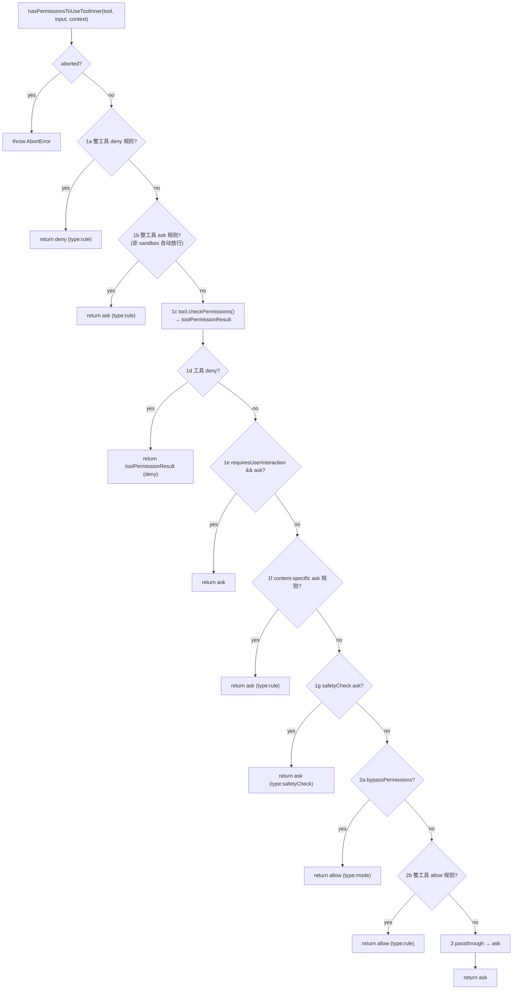
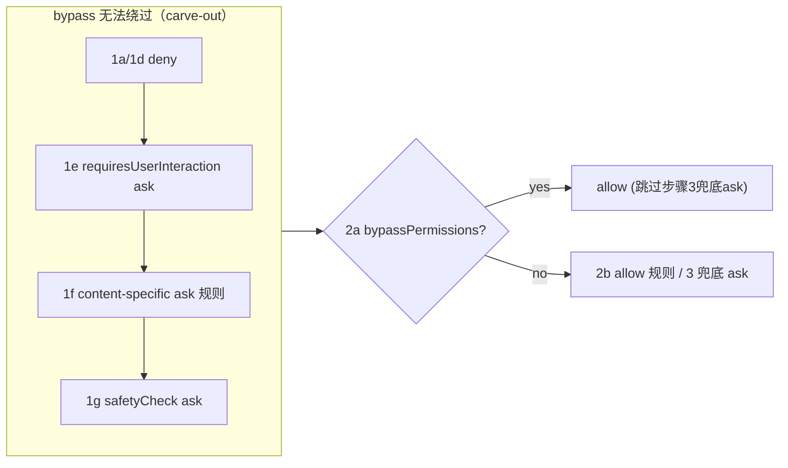
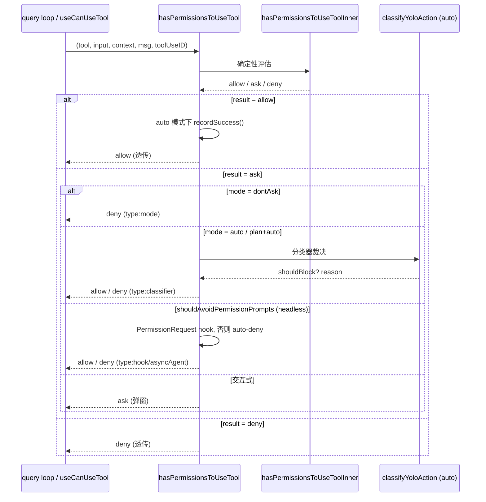
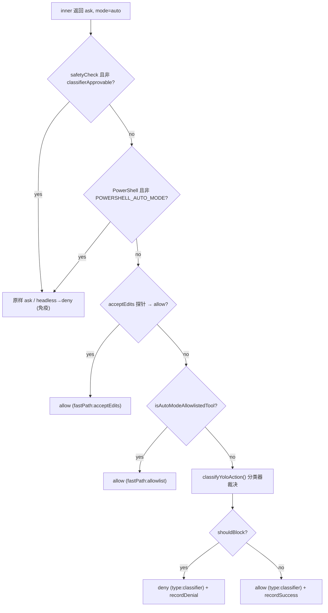
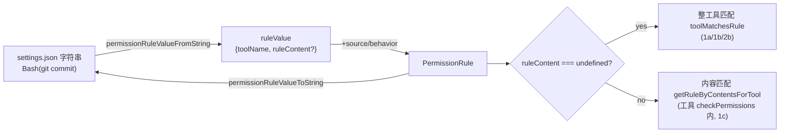
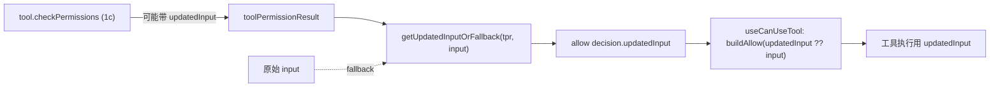
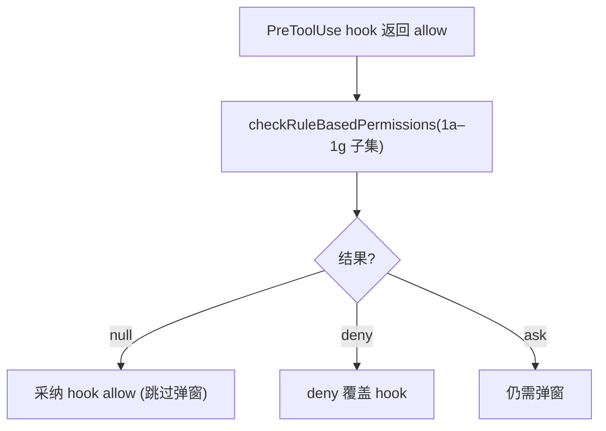
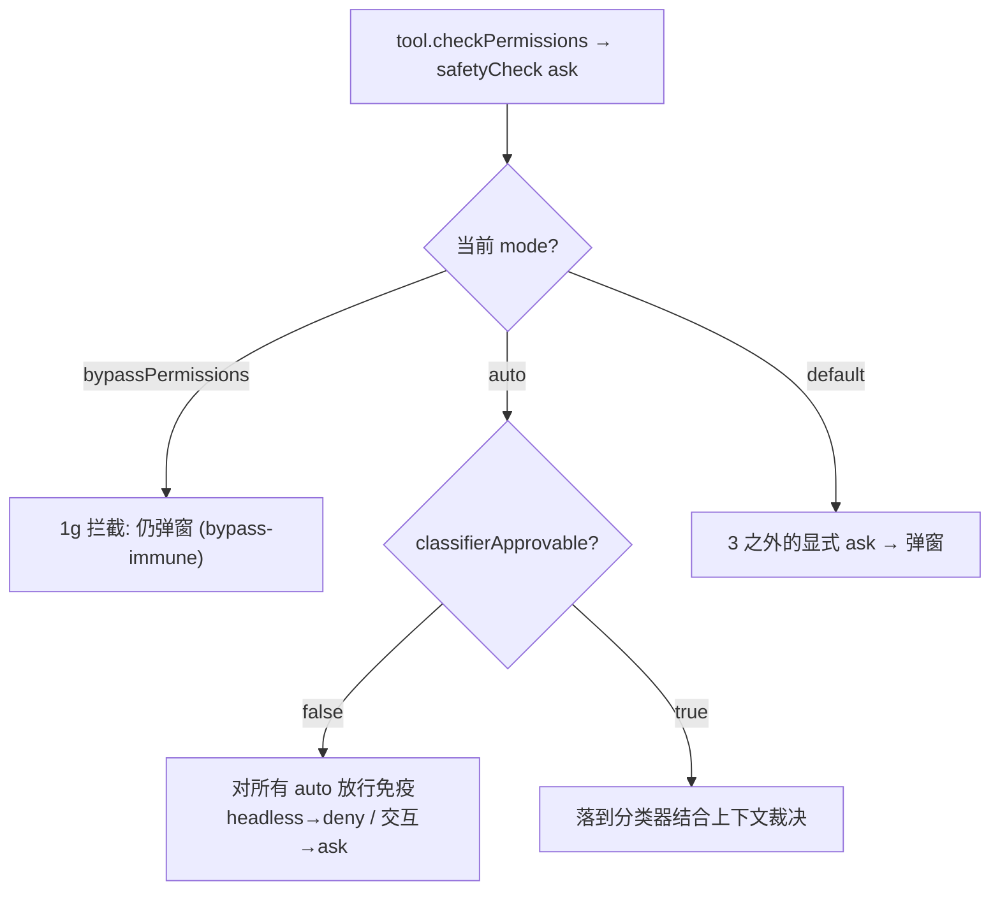
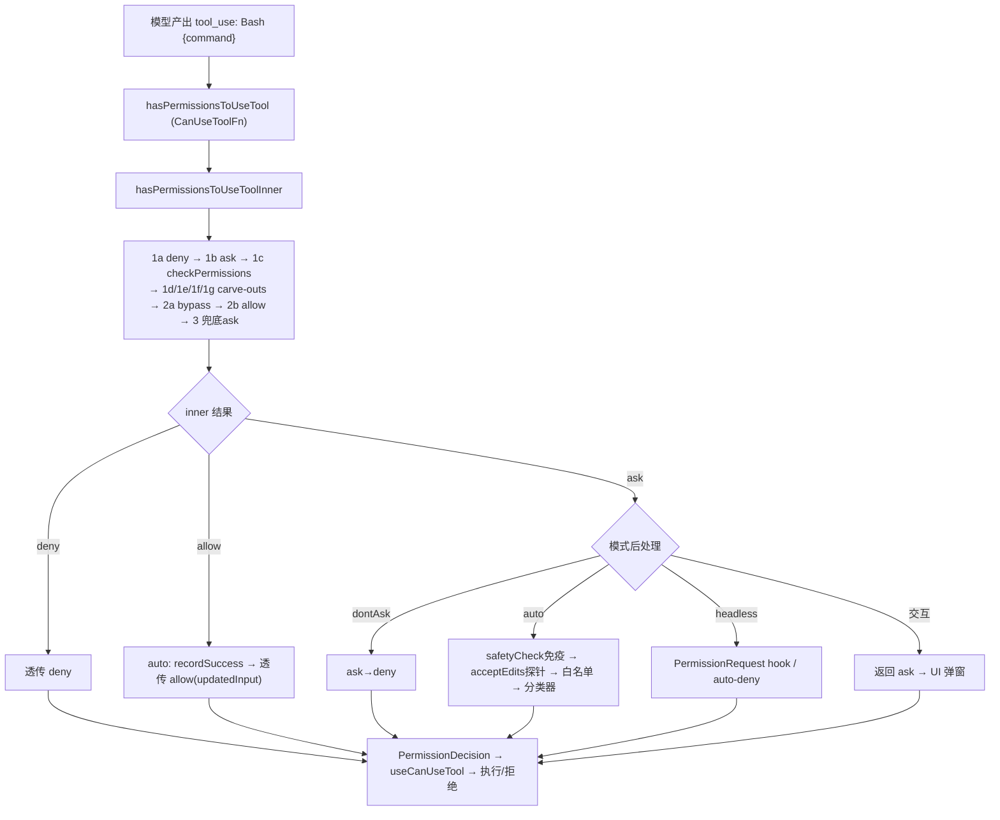

# 07 · 权限决策引擎

本篇覆盖：`hasPermissionsToUseTool` 入口与模式后处理层 ｜ `hasPermissionsToUseToolInner` 的确定性评估流水线（1a→3）｜ deny > ask > allow 优先级与 bypass carve-out ｜ 四种 PermissionMode 变换（dontAsk / auto 分类器 / acceptEdits 探针 / bypassPermissions）｜ `PermissionRule` 结构 ↔ 字符串（permissionRuleParser）｜ `PermissionResult.updatedInput` 与 `getUpdatedInputOrFallback` ｜ `checkRuleBasedPermissions` 子集 ｜ `safetyCheck` / `classifierApprovable` 安全闸
关键源文件：`src/utils/permissions/permissions.ts`、`src/types/permissions.ts`、`src/utils/permissions/permissionRuleParser.ts`、`src/utils/permissions/PermissionMode.ts`、`src/utils/permissions/PermissionResult.ts`、`src/utils/permissions/filesystem.ts`
上一篇：06-tool-execution.md ｜ 下一篇：08-rule-matching-classifier.md

---

权限决策引擎回答一个问题：**模型请求调用某个工具、带着一组具体入参，允许吗？** 答案只有三种终态——`allow` / `ask` / `deny`——外加一个内部临时态 `passthrough`（"我这层没意见，交给下一层裁决"）。整个引擎是 `CanUseToolFn` 这一契约的具体实现，被 query loop 在每次分发 `tool_use` 之前调用一次。

引擎分成两层，职责严格分离：

- **`hasPermissionsToUseToolInner`**（`permissions.ts:1158`）——**纯确定性**的规则流水线。只看规则表、工具自身的 `checkPermissions`、以及当前 mode 里"确定性"的那部分（bypass）。不发网络请求、不弹窗、不跑分类器。它的输出是 `allow` / `ask` / `deny`。
- **`hasPermissionsToUseTool`**（`permissions.ts:473`）——**外层包装 + 模式后处理**。先调 inner 拿确定性结果，再对 `ask` 结果施加"非确定性"的模式变换：`dontAsk` 把 ask 变 deny；`auto` 用 AI 分类器代替人工弹窗；headless 场景用 hook 或 auto-deny 兜底。`allow`/`deny` 结果基本原样透传。

这个分层不是偶然：inner 是可复用、可单测、可被 `bypassPermissions` 精确 carve-out 的"硬规则"；outer 承载所有"软策略"和副作用（分类器 API 调用、denial 计数、analytics）。下面逐个机制展开。

---

### `hasPermissionsToUseToolInner`：确定性评估流水线

- **触发 / 记录**：由外层 `hasPermissionsToUseTool` 在第一行无条件调用（`permissions.ts:480`）。它按一个**固定编号的顺序**（源码注释就是 1a、1b、1c…2a、2b、3）逐条求值，任何一条命中就短路返回。这个顺序即是权限语义的全部真相。

```ts
async function hasPermissionsToUseToolInner(
  tool: Tool,
  input: { [key: string]: unknown },
  context: ToolUseContext,
): Promise<PermissionDecision> {
  if (context.abortController.signal.aborted) {
    throw new AbortError()
  }

  let appState = context.getAppState()

  // 1. Check if the tool is denied
  // 1a. Entire tool is denied
  const denyRule = getDenyRuleForTool(appState.toolPermissionContext, tool)
  if (denyRule) {
    return {
      behavior: 'deny',
      decisionReason: { type: 'rule', rule: denyRule },
      message: `Permission to use ${tool.name} has been denied.`,
    }
  }
```
`src/utils/permissions/permissions.ts:1158`（1a deny 在 `:1171`）

- **使用 / 注入**：完整的评估顺序如下，每一步都在源码里有对应编号注释：

  | 步骤 | 源码行 | 检查内容 | 命中结果 |
  |------|--------|----------|----------|
  | 1a | `:1171` | 整工具 deny 规则（`getDenyRuleForTool`）| `deny` |
  | 1b | `:1184` | 整工具 ask 规则（`getAskRuleForTool`）| `ask`（除非 sandbox 自动放行）|
  | 1c | `:1216` | `tool.checkPermissions(parsedInput, context)` | 得到 `toolPermissionResult` |
  | 1d | `:1226` | 工具返回 `deny` | `deny` |
  | 1e | `:1231` | `tool.requiresUserInteraction() && ask` | `ask`（bypass 也拦）|
  | 1f | `:1244` | 工具返回的 content-specific ask 规则 | `ask`（bypass 也拦）|
  | 1g | `:1255` | 工具返回的 `safetyCheck` ask | `ask`（bypass 也拦）|
  | 2a | `:1268` | `bypassPermissions` 模式（或 plan+bypass 可用）| `allow` |
  | 2b | `:1284` | 整工具 allow 规则（`toolAlwaysAllowedRule`）| `allow` |
  | 3 | `:1300` | 兜底：`passthrough` → `ask` | `ask` |

  1c 是整条流水线的支点——它把入参交给工具自己的 `checkPermissions`，Bash 的子命令前缀匹配、Edit 的路径安全检查都在这一层产生（详见 08 篇）。工具返回的是一个 `PermissionResult`，可能是 `deny`/`ask`/`allow`/`passthrough` 四种之一，随后 1d–1g 把其中"即使 bypass 也必须尊重"的几种 ask 单独拎出来提前返回。

```ts
  // 1c. Ask the tool implementation for a permission result
  let toolPermissionResult: PermissionResult = {
    behavior: 'passthrough',
    message: createPermissionRequestMessage(tool.name),
  }
  try {
    const parsedInput = tool.inputSchema.parse(input)
    toolPermissionResult = await tool.checkPermissions(parsedInput, context)
  } catch (e) {
    if (e instanceof AbortError || e instanceof APIUserAbortError) {
      throw e
    }
    logError(e)
  }
```
`src/utils/permissions/permissions.ts:1208`（`checkPermissions` 调用在 `:1216`）

  注意 1c 的默认值：`toolPermissionResult` 初始化为 `{ behavior: 'passthrough' }`。如果 `inputSchema.parse(input)` 抛错（入参不合法）或 `checkPermissions` 抛非 abort 异常，就保留 passthrough——最终在步骤 3 兜底成 `ask`，而不是崩溃或误放行。这是"fail-safe 默认拒绝放行"的体现。

- **为什么（设计意图）**：把顺序编号写进注释、并让 deny 永远排在 allow 之前，是为了让"安全 > 便利"这条铁律在代码结构上不可绕过。特别地，`hasPermissionsToUseToolInner` **不含** 任何模式变换（dontAsk/auto/asyncAgent）、分类器、或 PermissionRequest hook——`checkRuleBasedPermissions` 的注释（`:1060`）明确点出这一分工："this does NOT run the auto mode classifier, mode-based transformations…, PermissionRequest hooks, or bypassPermissions / always-allowed checks"。inner 是可被精确复用的"硬规则核"。

- **示例数据**：给定 `tool = Bash`、`input = { command: "git status" }`，`ToolPermissionContext` 含：

```jsonc
// alwaysDenyRules.projectSettings = ["Bash"]        // 整工具 deny
// alwaysAllowRules.userSettings   = ["Bash(git status)"]  // 精确 allow
```

  评估 trace（据源码构造）：

  | 步 | 判定 | 说明 |
  |----|------|------|
  | 1a | **命中** | `getDenyRuleForTool` 找到 tool-wide `Bash` deny 规则 → 立即返回 |
  | —  | 跳过 | 后续 1b…2b（含那条精确 `Bash(git status)` allow）**永不求值** |

  返回值：

```json
{
  "behavior": "deny",
  "decisionReason": {
    "type": "rule",
    "rule": {
      "source": "projectSettings",
      "ruleBehavior": "deny",
      "ruleValue": { "toolName": "Bash" }
    }
  },
  "message": "Permission to use Bash has been denied."
}
```

  即使用户在 userSettings 里精确 allow 了 `Bash(git status)`，整工具 deny 也会在 1a 先命中——**deny 永远赢 allow**。

- **图（流水线控制流）**：



---

### deny > ask > allow 优先级 与 bypass carve-out

- **触发 / 记录**：优先级不是一个显式的比较函数，而是**编码在步骤顺序里**：1a(deny) 在 1b(ask) 前，1b(ask) 在 2b(allow) 前。此外，1d/1e/1f/1g 这四步把工具产生的 deny 和"必须弹窗"的 ask，插在 `bypassPermissions`（2a）**之前**，形成 bypass 的 carve-out（例外豁免）。

```ts
  // 1f. Content-specific ask rules from tool.checkPermissions take precedence
  // over bypassPermissions mode. ... This must be respected even in bypass mode,
  // just as deny rules are respected at step 1d.
  if (
    toolPermissionResult?.behavior === 'ask' &&
    toolPermissionResult.decisionReason?.type === 'rule' &&
    toolPermissionResult.decisionReason.rule.ruleBehavior === 'ask'
  ) {
    return toolPermissionResult
  }

  // 1g. Safety checks (e.g. .git/, .claude/, .vscode/, shell configs) are
  // bypass-immune — they must prompt even in bypassPermissions mode.
  if (
    toolPermissionResult?.behavior === 'ask' &&
    toolPermissionResult.decisionReason?.type === 'safetyCheck'
  ) {
    return toolPermissionResult
  }
```
`src/utils/permissions/permissions.ts:1238`（1f 在 `:1244`，1g 在 `:1255`）

- **使用 / 注入**：因为这些 return 在 2a（bypass）之前，所以 `bypassPermissions` 模式**无法**放行：整工具 deny 规则（1a）、工具级 deny（1d）、`requiresUserInteraction` 工具的 ask（1e，如 ExitPlanMode/AskUserQuestion）、用户显式配置的 content-specific ask 规则（1f，如 `Bash(npm publish:*)`）、以及路径安全闸的 ask（1g，如写 `.git/`、`.claude/`、`.bashrc`）。bypass 的真正含义是"跳过**默认弹窗**（步骤 3 的兜底 ask）"，而非"关闭所有安全检查"。

- **为什么（设计意图）**：`inc-4788` 类事故的教训——一个"全放行"开关若真的全放行，会让恶意或误配置的 deny 规则形同虚设。carve-out 的设计让 deny 和"用户明确要求二次确认"的意图凌驾于便利开关之上。1g 注释直言这些路径 "bypass-immune"。

- **示例数据**：deny > ask > allow 的完整优先级表（据步骤顺序构造）：

  | 优先级 | behavior | 产生于 | 是否被 bypassPermissions 豁免绕过 |
  |--------|----------|--------|-----------------------------------|
  | 最高 | `deny` | 1a 整工具 deny / 1d 工具 deny | 否（在 2a 之前）|
  | 中 | `ask` | 1b 整工具 ask / 1e 交互工具 / 1f content-ask / 1g safetyCheck | 否（1e/1f/1g 在 2a 之前）|
  | 低 | `allow` | 2a bypass / 2b 整工具 allow | —— |
  | 兜底 | `ask` | 3 passthrough→ask | **是**（bypass 在 2a 提前放行）|

  关键对比：**1b 的整工具 ask 规则** 也在 2a 之前，但它可被 sandbox carve-out（Bash + 沙箱 + `autoAllowBashIfSandboxed`）放行；而 **1f/1g** 无此豁免。

- **图（bypass carve-out 的位置）**：



---

### `hasPermissionsToUseTool`：入口与模式后处理层

- **触发 / 记录**：这是导出的 `CanUseToolFn`，由 query loop 通过 `useCanUseTool` 包装后调用（`src/hooks/useCanUseTool.tsx:37`），也被 swarm 的 in-process runner 直接调用（`src/utils/swarm/inProcessRunner.ts:143`）。它先取 inner 的确定性结果，再对 `allow`/`ask` 分别后处理。

```ts
export const hasPermissionsToUseTool: CanUseToolFn = async (
  tool, input, context, assistantMessage, toolUseID,
): Promise<PermissionDecision> => {
  const result = await hasPermissionsToUseToolInner(tool, input, context)

  // Reset consecutive denials on any allowed tool use in auto mode.
  if (result.behavior === 'allow') {
    const appState = context.getAppState()
    if (feature('TRANSCRIPT_CLASSIFIER')) { /* recordSuccess ... */ }
    return result
  }

  // Apply dontAsk mode transformation: convert 'ask' to 'deny'
  // This is done at the end so it can't be bypassed by early returns
  if (result.behavior === 'ask') {
    const appState = context.getAppState()
    if (appState.toolPermissionContext.mode === 'dontAsk') {
      return {
        behavior: 'deny',
        decisionReason: { type: 'mode', mode: 'dontAsk' },
        message: DONT_ASK_REJECT_MESSAGE(tool.name),
      }
    }
    // ... auto-mode classifier, headless fallback ...
  }
  return result
}
```
`src/utils/permissions/permissions.ts:473`（dontAsk 变换在 `:508`）

- **使用 / 注入**：`ask` 分支按顺序尝试三条"软策略"路径，任何一条命中即返回，否则原样返回 `ask`（交给 UI 弹窗）：
  1. **dontAsk**（`:508`）：整体把 ask 变 deny，消息用 `DONT_ASK_REJECT_MESSAGE(tool.name)`。放最后是为了"不能被早返回绕过"（注释原文）。
  2. **auto / plan+auto**（`:520`，仅 `TRANSCRIPT_CLASSIFIER` 构建）：用 AI 分类器代替人工弹窗——见下一节。
  3. **headless**（`shouldAvoidPermissionPrompts`，`:932`）：无法弹窗的后台/async agent，先跑 `PermissionRequest` hook 给它一次放行/拒绝机会，hook 没定就 auto-deny，消息 `AUTO_REJECT_MESSAGE(tool.name)`，`decisionReason.type = 'asyncAgent'`。

  `allow` 分支（`:486`）只做一件事：auto 模式下若之前有连续 denial，调 `recordSuccess` 清零 denial 计数（打破 denial streak），然后透传。

- **为什么（设计意图）**：把模式变换全部放在 inner 之外、且放在函数**末尾**，保证它们作用于"最终 ask 结果"而不是中间态——正如注释 "This is done at the end so it can't be bypassed by early returns" 所说。同时确保确定性核心（inner）永远可被 headless / swarm / hook 解析路径复用而语义一致。

- **图（外层后处理时序）**：



- **生命周期**：无自身持久化。denial 计数（`denialTracking`）作用域是**每会话进程**：交互式经 `context.setAppState` 写入 appState；async 子 agent 因 `setAppState` 是 no-op，改用 `context.localDenialTracking` 就地 `Object.assign`（`persistDenialState`，`:963`）。denial 计数不落盘，resume 后从 0 重新计。

---

### PermissionMode 与四种模式变换

- **触发 / 记录**：`PermissionMode` 定义于 `src/types/permissions.ts:16-38`。外部可寻址模式（settings.json `defaultMode`、`--permission-mode`、会话恢复）是 `EXTERNAL_PERMISSION_MODES`；内部再加 `auto` / `bubble` 两个 ant-only 模式。

```ts
export const EXTERNAL_PERMISSION_MODES = [
  'acceptEdits', 'bypassPermissions', 'default', 'dontAsk', 'plan',
] as const
export type InternalPermissionMode = ExternalPermissionMode | 'auto' | 'bubble'
export type PermissionMode = InternalPermissionMode
export const INTERNAL_PERMISSION_MODES = [
  ...EXTERNAL_PERMISSION_MODES,
  ...(feature('TRANSCRIPT_CLASSIFIER') ? (['auto'] as const) : ([] as const)),
] as const satisfies readonly PermissionMode[]
```
`src/types/permissions.ts:16`（mode 存于 `ToolPermissionContext.mode`，`:428`）

- **使用 / 注入**：mode 在两处被消费。**inner 里**只有 `bypassPermissions` 是确定性的（2a）：

```ts
  const shouldBypassPermissions =
    appState.toolPermissionContext.mode === 'bypassPermissions' ||
    (appState.toolPermissionContext.mode === 'plan' &&
      appState.toolPermissionContext.isBypassPermissionsModeAvailable)
  if (shouldBypassPermissions) {
    return {
      behavior: 'allow',
      updatedInput: getUpdatedInputOrFallback(toolPermissionResult, input),
      decisionReason: { type: 'mode', mode: appState.toolPermissionContext.mode },
    }
  }
```
`src/utils/permissions/permissions.ts:1268`（2a）

  注意 plan 模式的特判：`plan + isBypassPermissionsModeAvailable` 也走 bypass——即用户本来就以 bypass 启动、临时进 plan 模式时保留 bypass 能力。

  **outer 里**处理其余三种软模式。`auto` / `plan+auto` 的分类器分支（`:520`）在跑分类器**之前**先做两道"快速放行"探针，避免为安全操作白花分类器 API 调用：

```ts
    if (
      feature('TRANSCRIPT_CLASSIFIER') &&
      (appState.toolPermissionContext.mode === 'auto' ||
        (appState.toolPermissionContext.mode === 'plan' &&
          (autoModeStateModule?.isAutoModeActive() ?? false)))
    ) {
      // 非 classifierApprovable 的 safetyCheck 对所有 auto 放行路径免疫
      if (
        result.decisionReason?.type === 'safetyCheck' &&
        !result.decisionReason.classifierApprovable
      ) { /* headless→deny, 否则原样 ask */ }
```
`src/utils/permissions/permissions.ts:520`（safetyCheck 免疫在 `:532`）

  **acceptEdits 探针**（`:600-649`）：用一个"假装 mode=acceptEdits"的 context 重新调 `tool.checkPermissions`，若结果是 allow 就直接放行（如工作目录内的文件编辑），记 `fastPath: 'acceptEdits'`：

```ts
      if (
        result.behavior === 'ask' &&
        tool.name !== AGENT_TOOL_NAME &&
        tool.name !== REPL_TOOL_NAME
      ) {
        try {
          const parsedInput = tool.inputSchema.parse(input)
          const acceptEditsResult = await tool.checkPermissions(parsedInput, {
            ...context,
            getAppState: () => {
              const state = context.getAppState()
              return {
                ...state,
                toolPermissionContext: {
                  ...state.toolPermissionContext,
                  mode: 'acceptEdits' as const,
                },
              }
            },
          })
          if (acceptEditsResult.behavior === 'allow') {
            // recordSuccess + return allow (type:mode, mode:'auto')
```
`src/utils/permissions/permissions.ts:600`（acceptEdits 探针）

  两道探针（外加 `isAutoModeAllowlistedTool` 安全工具白名单，`:660`）都没放行，才真正调 `classifyYoloAction`（`:693`）。分类器结果再经 iron_gate（不可用时 fail-closed/open）、denialTracking 限流等分支处理（`:818`–`:926`）。

- **为什么（设计意图）**：`auto` 模式的核心矛盾是"既要无人值守自动放行、又不能对危险操作放水"。分层探针把成本从高到低倒排——先零成本的规则/白名单，再本地 acceptEdits 复算，最后才是昂贵的分类器 API 调用。注释（`:593`）明说这是为了 "avoid expensive classifier API calls for safe operations"。而 `Agent`/`REPL` 被显式排除出 acceptEdits 探针（`:602`），因为 REPL 的胶水 JS 可能在内部工具调用之间藏 VM 逃逸，分类器必须看到完整代码。

- **示例数据**：`PermissionMode` 与其外部映射（据 `PermissionMode.ts:42-91` 的 `PERMISSION_MODE_CONFIG` 构造）：

  | mode | title | symbol | external | 引擎行为 |
  |------|-------|--------|----------|----------|
  | `default` | Default | （空）| default | 3 兜底 ask |
  | `plan` | Plan Mode | `PAUSE_ICON` | plan | 只读；bypass 可用时走 2a |
  | `acceptEdits` | Accept edits | `⏵⏵` | acceptEdits | 工具级 checkPermissions 自放行编辑 |
  | `bypassPermissions` | Bypass Permissions | `⏵⏵` | bypassPermissions | 2a allow（deny/ask carve-out 除外）|
  | `dontAsk` | Don't Ask | `⏵⏵` | dontAsk | outer 把 ask→deny |
  | `auto`（ant-only）| Auto mode | `⏵⏵` | default | outer 用分类器代替弹窗 |

- **图（auto 模式的分层快速放行）**：



- **生命周期**：`mode` 存于 `ToolPermissionContext`，作用域随 appState（每会话进程），可经 `/mode` 切换或 `setMode` 更新持久化到 settings。resume 恢复会话时按 `INTERNAL_PERMISSION_MODES` 校验并回填（非法值降级为 `default`，见 `permissionModeFromString`，`PermissionMode.ts:117`）。

---

### `PermissionRule` 结构 ↔ 字符串（permissionRuleParser）

- **触发 / 记录**：规则在磁盘/settings 里是**字符串**（如 `"Bash(git commit)"`），在内存里是**结构体** `PermissionRule`。转换由 `permissionRuleValueFromString` / `permissionRuleValueToString` 承担。结构定义：

```ts
export type PermissionRuleValue = {
  toolName: string
  ruleContent?: string
}
export type PermissionRule = {
  source: PermissionRuleSource
  ruleBehavior: PermissionBehavior   // 'allow' | 'deny' | 'ask'
  ruleValue: PermissionRuleValue
}
```
`src/types/permissions.ts:67`（`PermissionRuleValue`）与 `:75`（`PermissionRule`）

  `getAllowRules` / `getDenyRules` / `getAskRules`（`permissions.ts:122/213/223`）把 `ToolPermissionContext` 里按 source 分组的字符串数组，逐条 `permissionRuleValueFromString` 解析成 `PermissionRule[]`，附上 `source` 与 `ruleBehavior`。

- **使用 / 注入**：解析器要处理"工具名 + 可选括号内容 + 转义括号"三种情况：

```ts
export function permissionRuleValueFromString(
  ruleString: string,
): PermissionRuleValue {
  const openParenIndex = findFirstUnescapedChar(ruleString, '(')
  if (openParenIndex === -1) {
    return { toolName: normalizeLegacyToolName(ruleString) }
  }
  const closeParenIndex = findLastUnescapedChar(ruleString, ')')
  // ... 校验闭括号在末尾、toolName 非空 ...
  const rawContent = ruleString.substring(openParenIndex + 1, closeParenIndex)
  // Empty content ("Bash()") or standalone wildcard ("Bash(*)")
  // should be treated as just the tool name (tool-wide rule)
  if (rawContent === '' || rawContent === '*') {
    return { toolName: normalizeLegacyToolName(toolName) }
  }
  const ruleContent = unescapeRuleContent(rawContent)
  return { toolName: normalizeLegacyToolName(toolName), ruleContent }
}
```
`src/utils/permissions/permissionRuleParser.ts:93`

  解析结果直接决定 inner 的匹配路径：`ruleContent === undefined` 的**整工具规则**由 `toolMatchesRule`（`permissions.ts:238`）在 1a/1b/2b 命中；带 `ruleContent` 的**内容规则**则由 `getRuleByContentsForTool`（`:349`）交给工具的 `checkPermissions` 在 1c 内部匹配。注意 `Bash(*)` 和 `Bash()` 都被规整为 tool-wide 规则（去掉 `ruleContent`）——这是"通配即整工具"的语义约定。

- **为什么（设计意图）**：字符串形式便于人写进 settings.json、便于展示（`createPermissionRequestMessage` 用 `permissionRuleValueToString` 回显规则原文，`:157`）；结构体形式便于精确匹配。括号转义（`escapeRuleContent` 先转义 `\` 再转义 `()`）保证像 `python -c "print(1)"` 这样含括号的命令能无歧义往返。`normalizeLegacyToolName` 则把 `Task`→`Agent`、`KillShell`→`TaskStop` 等历史名归一，让旧规则不失效。

- **示例数据**：`"Bash(git commit)"` 的往返（据 parser 逻辑构造）：

```jsonc
// 字符串（磁盘/settings）
"Bash(git commit)"

// permissionRuleValueFromString(...) →
{ "toolName": "Bash", "ruleContent": "git commit" }

// 挂上 source/behavior 后的完整 PermissionRule（示例，projectSettings 的 allow 规则）
{
  "source": "projectSettings",
  "ruleBehavior": "allow",
  "ruleValue": { "toolName": "Bash", "ruleContent": "git commit" }
}

// permissionRuleValueToString({toolName:"Bash", ruleContent:"git commit"}) → "Bash(git commit)"
```

  几个规整边界（据 `:124-128`）：

  | 输入字符串 | 解析结果 | 含义 |
  |------------|----------|------|
  | `"Bash"` | `{toolName:"Bash"}` | 整工具规则 |
  | `"Bash(*)"` | `{toolName:"Bash"}` | 通配 = 整工具 |
  | `"Bash()"` | `{toolName:"Bash"}` | 空内容 = 整工具 |
  | `"Bash(git commit)"` | `{toolName:"Bash", ruleContent:"git commit"}` | 内容规则 |
  | `"mcp__server1"` | `{toolName:"mcp__server1"}` | 匹配该 server 全部工具 |

- **图（字符串 ↔ 结构 ↔ 匹配路径）**：



---

### `PermissionResult.updatedInput` 与 `getUpdatedInputOrFallback`

- **触发 / 记录**：工具的 `checkPermissions` 返回的不只是 behavior，还可能带一个**改写后的入参** `updatedInput`——即"允许，但用我修正过的参数执行"。这是 `PermissionAllowDecision` / `PermissionAskDecision` 的可选字段：

```ts
export type PermissionAllowDecision<
  Input extends { [key: string]: unknown } = { [key: string]: unknown },
> = {
  behavior: 'allow'
  updatedInput?: Input
  userModified?: boolean
  decisionReason?: PermissionDecisionReason
  toolUseID?: string
  acceptFeedback?: string
  contentBlocks?: ContentBlockParam[]
}
```
`src/types/permissions.ts:174`（`updatedInput` 在 `:178`；`passthrough` 变体**无** `updatedInput`，见 `:251-266`）

- **使用 / 注入**：inner 在 2a（bypass）和 2b（allow 规则）两处放行时，都要把工具 1c 阶段算出的 `updatedInput` 透传进去，但 `toolPermissionResult` 可能是 `passthrough`（没有该字段）。`getUpdatedInputOrFallback` 就是安全提取器：

```ts
function getUpdatedInputOrFallback(
  permissionResult: PermissionResult,
  fallback: Record<string, unknown>,
): Record<string, unknown> {
  return (
    ('updatedInput' in permissionResult
      ? permissionResult.updatedInput
      : undefined) ?? fallback
  )
}
```
`src/utils/permissions/permissions.ts:1477`

  它用 `'updatedInput' in permissionResult` 先判字段存在（避免访问 passthrough 上不存在的属性），再 `?? fallback` 兜底原始 `input`。最终 `updatedInput` 沿 `PermissionDecision` 一路回到 `useCanUseTool`，`resolve(ctx.buildAllow(result.updatedInput ?? input, ...))`（`useCanUseTool.tsx:50`）——**执行阶段真正用的入参**是这个 `updatedInput`，而非模型原始输出。

- **为什么（设计意图）**：让权限层不仅能"批准/拒绝"，还能"规范化后批准"——例如把相对路径解析成绝对路径、剥掉危险的 redirection。`getUpdatedInputOrFallback` 的注释（`:1473`）点明动机："Handles the case where some PermissionResult variants don't have updatedInput"（passthrough 变体没有该字段），是一处防御性取值。

- **示例数据**：一个 `allow + updatedInput` 的 `PermissionResult`（据 acceptEdits 探针放行路径 `:641` 构造）：

```json
{
  "behavior": "allow",
  "updatedInput": {
    "file_path": "/home/user/repo/src/app.ts",
    "old_string": "const x = 1",
    "new_string": "const x = 2"
  },
  "decisionReason": { "type": "mode", "mode": "auto" }
}
```

  另一例：2b 整工具 allow 规则放行时，`updatedInput` 来自 `getUpdatedInputOrFallback(toolPermissionResult, input)`——若工具 1c 返回过 `updatedInput` 就用它，否则回落到原始 `input`。

- **图（updatedInput 的流转）**：



---

### `checkRuleBasedPermissions`：bypass 尊重的规则子集

- **触发 / 记录**：这是 inner 的一个**剥离版孪生**——只保留 `bypassPermissions` 会尊重的那部分（步骤 1a–1g，即 2a 之前的全部），不含 mode 变换、分类器、hook、allow 规则。签名返回 `ask` / `deny` / `null`（null 表示"无规则异议"）。

```ts
export async function checkRuleBasedPermissions(
  tool: Tool,
  input: { [key: string]: unknown },
  context: ToolUseContext,
): Promise<PermissionAskDecision | PermissionDenyDecision | null> {
  const appState = context.getAppState()
  // 1a. Entire tool is denied by rule
  const denyRule = getDenyRuleForTool(appState.toolPermissionContext, tool)
  if (denyRule) { return { behavior: 'deny', /* type:rule */ } }
  // 1b. ask rule (+ sandbox carve-out) ... 1c tool.checkPermissions ...
  // 1d deny / 1f content-ask / 1g safetyCheck ...
  return null   // No rule-based objection
}
```
`src/utils/permissions/permissions.ts:1071`

- **使用 / 注入**：唯一调用者是 `resolveHookPermissionDecision`（`src/services/tools/toolHooks.ts:373`）。当一个 `PreToolUse` hook 返回 `allow` 时，它**不能**因此绕过 settings.json 的 deny/ask 规则——所以先跑 `checkRuleBasedPermissions`：返回 `null` 才真正采纳 hook 的 allow；返回 `deny` 则 deny 覆盖 hook；返回 `ask` 则仍需弹窗。注释（`toolHooks.ts:324`）称之为 "inc-4788 analog"。

```ts
    // Hook allow skips the interactive prompt, but deny/ask rules still apply.
    const ruleCheck = await checkRuleBasedPermissions(tool, hookInput, toolUseContext)
    if (ruleCheck === null) { return { decision: hookPermissionResult, input: hookInput } }
    if (ruleCheck.behavior === 'deny') { return { decision: ruleCheck, input: hookInput } }
    // ask rule — dialog required despite hook approval
```
`src/services/tools/toolHooks.ts:372`

- **为什么（设计意图）**：把"bypass 会尊重的硬规则"抽成独立函数，是为了让 hook 放行路径和主 permission 路径**语义在锁步**（注释 `:329` 原文 "so the permission semantics stay in lockstep"）。若直接复用完整 inner，会把 hook allow 当成新一次工具调用重跑一遍模式变换/分类器，语义错乱且重复付费。剥离版精确表达了 "hook 可以省掉弹窗、但不能凌驾 deny/ask 规则"。

- **图（hook allow 的规则复核）**：



---

### `safetyCheck` / `classifierApprovable`：bypass-immune 安全闸

- **触发 / 记录**：写文件类工具在 `checkPermissions` 里对目标路径跑 `checkPathSafetyForAutoEdit`，命中敏感路径就返回 `{type:'safetyCheck'}` 的 ask，并带一个布尔 `classifierApprovable`：

```ts
export function checkPathSafetyForAutoEdit(
  path: string,
  precomputedPathsToCheck?: readonly string[],
):
  | { safe: true }
  | { safe: false; message: string; classifierApprovable: boolean } {
  // 可疑 Windows 路径 → classifierApprovable: false
  // .claude 配置文件 → classifierApprovable: true
  // 危险文件(.bashrc/.git/.vscode/...) → classifierApprovable: true
}
```
`src/utils/permissions/filesystem.ts:620`（三处 `classifierApprovable` 分别在 `:636`/`:647`/`:658`）

  `PermissionDecisionReason` 的 `safetyCheck` 变体因此携带这个位：

```ts
  | {
      type: 'safetyCheck'
      reason: string
      // When true, auto mode lets the classifier evaluate this instead of
      // forcing a prompt. ... False for Windows path bypass attempts ...
      classifierApprovable: boolean
    }
```
`src/types/permissions.ts:312`

- **使用 / 注入**：`safetyCheck` 在两条路径上被特殊对待。一是 inner 的 **1g**（`:1255`）：即使 `bypassPermissions` 也必须弹窗（bypass-immune）。二是 outer 的 **auto 模式**（`:532`）：`classifierApprovable === false` 的 safetyCheck 对**所有** auto 放行路径免疫（acceptEdits 探针、白名单、分类器都不能放行它）——headless 场景直接 deny，交互场景原样 ask；而 `classifierApprovable === true` 的（`.claude/`、`.git/`、shell 配置等敏感文件）则允许落到分类器去结合上下文裁决。

- **为什么（设计意图）**：区分"绝不可自动放行"与"可让 AI 结合上下文判断"两类风险。类型注释直言：`classifierApprovable=false` 用于 Windows 路径绕过尝试和跨机 bridge 消息（`:315-320`）——这些是明确的攻击面，不给任何自动放行余地；`true` 用于敏感文件，分类器 "can see context and decide"。这让 auto 模式在"尽量无人值守"和"关键攻击面绝不松口"之间取得平衡。

- **示例数据**：`checkPathSafetyForAutoEdit` 对不同路径的返回（据 `:631-661` 构造）：

```jsonc
// 写 /repo/.git/config → 危险文件
{ "safe": false,
  "message": "Claude requested permissions to edit /repo/.git/config which is a sensitive file.",
  "classifierApprovable": true }

// 写 C:\..\..\Windows\System32\... → 可疑 Windows 路径
{ "safe": false,
  "message": "... suspicious Windows path pattern that requires manual approval.",
  "classifierApprovable": false }

// 写 /repo/src/app.ts → 安全
{ "safe": true }
```

  对应到 `PermissionDecisionReason`（示例，1g 返回的 ask）：

```json
{
  "behavior": "ask",
  "decisionReason": {
    "type": "safetyCheck",
    "reason": "... which is a sensitive file.",
    "classifierApprovable": true
  },
  "message": "Claude requested permissions to edit /repo/.git/config which is a sensitive file."
}
```

- **图（safetyCheck 在两种模式下的分叉）**：



- **生命周期**：`safetyCheck` 是每次调用即时计算（无缓存决策），但底层的工作目录解析被 `getResolvedWorkingDirPaths` 记忆化（`filesystem.ts:681`，每会话进程内有效），以省去重复的 `realpathSync` syscall。

---

## 小结：一次评估的完整数据流

把上面各机制串起来，一次 `hasPermissionsToUseTool(Bash, {command}, ctx)` 的端到端形态：



三条要牢记的不变式：

1. **deny > ask > allow**，且顺序编码在步骤编号里——allow 规则（2b）永远排在所有 deny/ask（1a–1g）之后。
2. **`bypassPermissions` 只跳过步骤 3 的兜底弹窗**；1a/1d 的 deny、1e/1f/1g 的 ask 都是 bypass-immune 的 carve-out。
3. **所有非确定性策略（dontAsk/auto/分类器/hook）都在 inner 之外、函数末尾施加**，作用于 inner 产出的 `ask` 终态，确保它们无法被早返回绕过、也无法污染可复用的确定性核心（`checkRuleBasedPermissions` 正是靠这一分层被 hook 路径复用）。
