# 08 · 规则匹配、Bash 归一化与 auto 安全分类器

本篇覆盖：permission rule 的三态解析（exact / prefix / wildcard）、通配尾部 `" *"` 可选归一、Bash 命令在匹配前的两级归一（`stripSafeWrappers` 白名单剥离 vs `stripAllLeadingEnvVars` 激进剥离）、候选命令生成与复合命令守卫、`bashToolCheckPermission` 的裁决管线、以及 auto（YOLO）模式下的安全分类器——快速路径（acceptEdits + 安全工具 allowlist）、transcript 投影（`toCompactBlock` / JSONL 防注入）、系统 prompt 组装、`classifyYoloAction` 两种响应格式、fail-open/closed killswitch 与 denial 熔断。 ｜ 关键源文件：`src/utils/permissions/shellRuleMatching.ts`、`src/tools/BashTool/bashPermissions.ts`、`src/utils/permissions/yoloClassifier.ts`、`src/utils/permissions/classifierDecision.ts`、`src/utils/permissions/permissions.ts`、`src/utils/permissions/denialTracking.ts` ｜ 上一篇：07-permission-engine.md ｜ 下一篇：09-hooks.md

---

上一篇讲了 permission engine 如何把 allow/ask/deny 规则组织成分层的 `ToolPermissionContext`。本篇下沉到「一条 Bash 命令如何被一条规则命中」这个最底层的判定，以及当没有任何静态规则命中、且用户处于 auto 模式时，如何把决定权交给一个 LLM 分类器。

判定链路的两个世界要先分清：

- **静态规则世界**（同步、无网络）：规则字符串 → `parsePermissionRule` → 三态 → 命令归一 → 逐候选匹配。全部发生在 `bashPermissions.ts` / `shellRuleMatching.ts`。
- **分类器世界**（异步、走 side query API）：命令/工具调用被投影成 transcript → 系统 prompt 组装 → Opus/Haiku 分类 → block/allow。发生在 `yoloClassifier.ts` / `classifierDecision.ts`，由 `permissions.ts` 在 `behavior==='ask'` 且 `mode==='auto'` 时兜底触发。

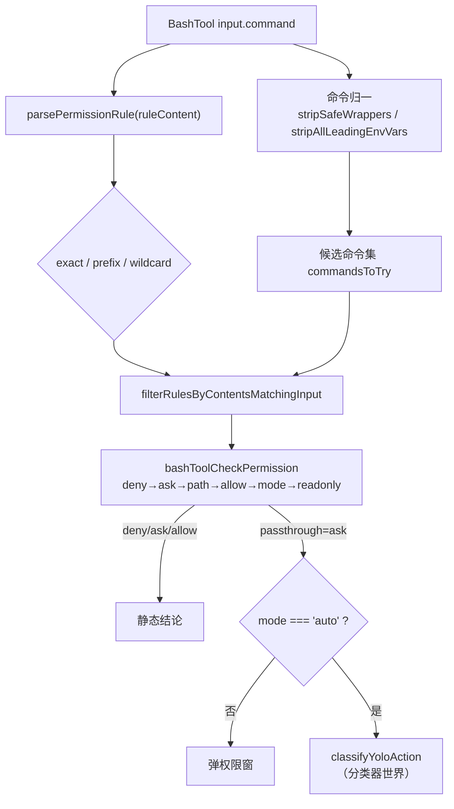

---

### parsePermissionRule —— 规则字符串的三态判别

- **触发 / 记录**：permission engine 把某工具的规则收敛成一个 `Map<string, PermissionRule>`，key 是**规则的内层内容**（`ruleContent`），不含 `Bash(...)` 外壳。也就是说 `Bash(git *)` 在 map 里的 key 是 `git *`，`Bash(rm:*)` 的 key 是 `rm:*`。

```ts
const ruleByContents = new Map<string, PermissionRule>()
// ...
ruleByContents.set(rule.ruleValue.ruleContent, rule)
```
`src/utils/permissions/permissions.ts:367,386`（`getRuleByContentsForTool`）

  匹配时对每个 key 调 `bashPermissionRule(ruleContent)`（`bashPermissions.ts:364` 直接委托到 `parsePermissionRule`）把字符串解析成结构化的判别式联合。

```ts
export function parsePermissionRule(
  permissionRule: string,
): ShellPermissionRule {
  // Check for legacy :* prefix syntax first (backwards compatibility)
  const prefix = permissionRuleExtractPrefix(permissionRule)
  if (prefix !== null) {
    return { type: 'prefix', prefix }
  }
  // Check for new wildcard syntax (contains * but not :* at end)
  if (hasWildcards(permissionRule)) {
    return { type: 'wildcard', pattern: permissionRule }
  }
  // Otherwise, it's an exact match
  return { type: 'exact', command: permissionRule }
}
```
`src/utils/permissions/shellRuleMatching.ts:159`

- **使用 / 注入**：解析结果 `ShellPermissionRule`（联合类型 `exact | prefix | wildcard`，定义在 `shellRuleMatching.ts:25`）直接喂给 `filterRulesByContentsMatchingInput` 的 `switch (bashRule.type)`（`bashPermissions.ts:875`）。它不产生任何发往模型的消息——纯本地同步判定。

- **为什么（设计意图）**：判别顺序是**有意的优先级**：先认 legacy `:*` 前缀语法（`permissionRuleExtractPrefix` 用 `/^(.+):\*$/` 抽出前缀，`shellRuleMatching.ts:43`），再认新式通配（`hasWildcards`，`:54`），最后才落到 exact。`hasWildcards` 明确把「以 `:*` 结尾」排除在通配之外（`:56`），并且用「统计反斜杠奇偶」判断 `*` 是否被转义（`:62-77`）——这样 `\*` 是字面星号、`*` 才是通配。三者互斥保证一个规则串只对应一种匹配语义。

- **示例数据**（示例，据源码构造）：

| 规则串（`Bash(...)` 内层） | `parsePermissionRule` 结果 |
| --- | --- |
| `git *` | `{ type: 'wildcard', pattern: 'git *' }` |
| `rm:*` | `{ type: 'prefix', prefix: 'rm' }` |
| `npm run build` | `{ type: 'exact', command: 'npm run build' }` |
| `echo \*` | `{ type: 'exact', command: 'echo \\*' }`（`\*` 非未转义通配 → 落 exact）|

- **图**：

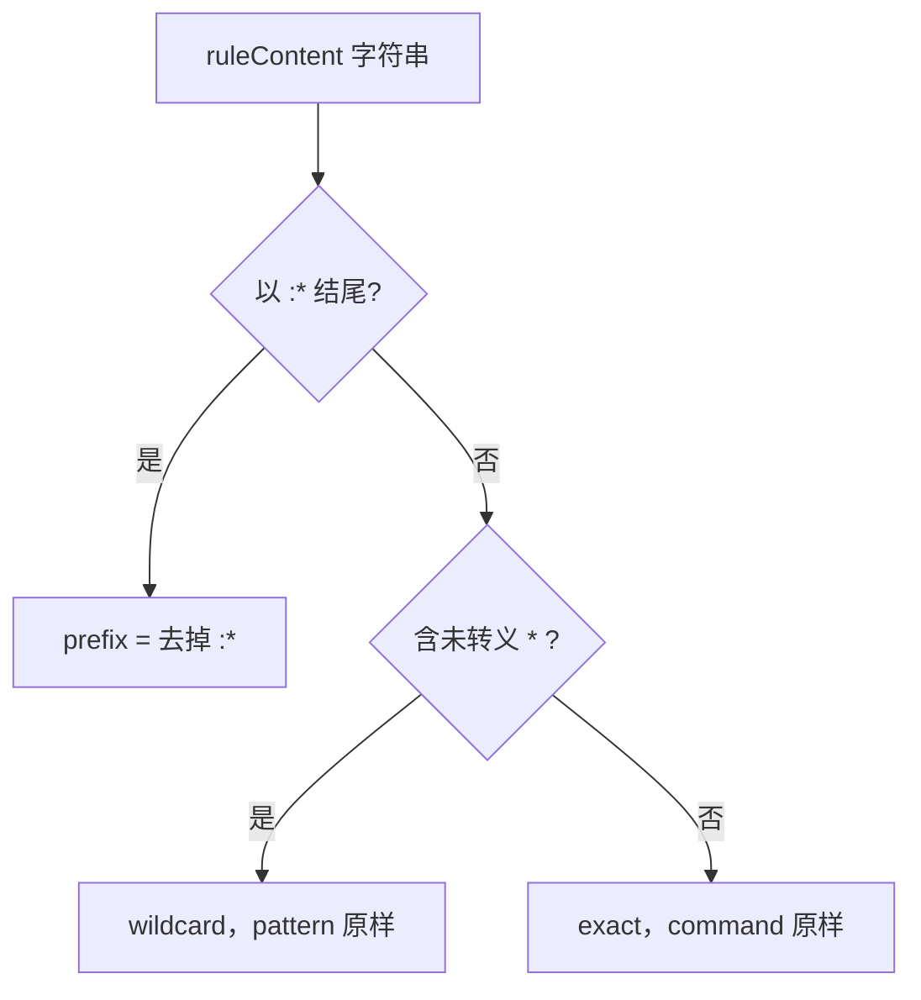

---

### matchWildcardPattern —— 通配翻译与尾部 `" *"` 可选归一

- **触发 / 记录**：当 `bashRule.type === 'wildcard'` 且处于 `prefix` 匹配模式（命令已拆成单个子命令），`filterRulesByContentsMatchingInput` 调 `matchWildcardPattern(bashRule.pattern, cmdToMatch)`（`bashPermissions.ts:930`，经 `:353` 的薄封装委托到共享实现）。核心是把 glob 风格 pattern 编译成锚定正则：

```ts
// Escape regex special characters except *
const escaped = processed.replace(/[.+?^${}()|[\]\\'"]/g, '\\$&')
// Convert unescaped * to .* for wildcard matching
const withWildcards = escaped.replace(/\*/g, '.*')
// ...
const unescapedStarCount = (processed.match(/\*/g) || []).length
if (regexPattern.endsWith(' .*') && unescapedStarCount === 1) {
  regexPattern = regexPattern.slice(0, -3) + '( .*)?'
}
// ...
const flags = 's' + (caseInsensitive ? 'i' : '')
const regex = new RegExp(`^${regexPattern}$`, flags)
return regex.test(command)
```
`src/utils/permissions/shellRuleMatching.ts:126,129,142,151`

- **使用 / 注入**：布尔结果决定该 wildcard 规则是否进入 `matchingAllow/Ask/DenyRules` 列表，进而被 `bashToolCheckPermission` 消费。同样不进入模型 prompt。Bash 侧封装 `matchWildcardPattern` 用默认 `caseInsensitive=false`（`bashPermissions.ts:353`），即 **Bash 规则大小写敏感**。

- **为什么（设计意图）**：`:142-145` 的尾部归一是关键一笔——当 pattern **恰好只有一个未转义通配**且以 `" *"`（空格+星号）结尾时，把 `git .*` 改写成 `git( .*)?`，让尾部「空格+参数」整体可选。这样 `Bash(git *)` 既匹配 `git status` 也匹配裸 `git`，语义与前缀规则 `git:*` 对齐（注释原文：*aligns wildcard matching with prefix rule semantics*）。多通配的 `* run *` 被显式排除（`unescapedStarCount === 1` 守卫），否则会把 `npm run`（无尾参）错误命中。正则用 `s`（dotAll）flag 让 `.` 跨换行，以匹配 `splitCommand_DEPRECATED` 后仍含内嵌换行的 heredoc 内容（`:148-150`）。

- **示例数据**（示例，据源码构造）：规则 `Bash(git *)` → pattern `git *`：

```
pattern "git *"
  → escaped      "git *"        （空格非正则特殊字符）
  → withWildcards"git .*"
  → 尾部归一      "git( .*)?"     （endsWith(' .*') 且 单通配）
  → regex        /^git( .*)?$/s

test("git status") → true     ✓
test("git")        → true     ✓（尾部整体可选）
test("gitk")       → false    ✗（缺少空格边界）
```

- **图**：

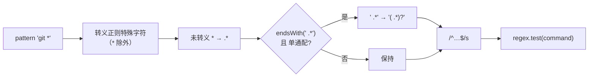

---

### stripSafeWrappers —— allow 匹配前的「白名单」归一

- **触发 / 记录**：`filterRulesByContentsMatchingInput` 在生成候选命令时，对每个待匹配命令先跑一遍 `stripSafeWrappers`，把安全的 env 赋值前缀和安全 wrapper（`timeout`/`time`/`nice`/`nohup`）剥掉，让 `Bash(npm install:*)` 能命中 `timeout 10 npm install foo` 或 `GOOS=linux go build`。

```ts
const commandsToTry = commandsForMatching.flatMap(cmd => {
  const strippedCommand = stripSafeWrappers(cmd)
  return strippedCommand !== cmd ? [cmd, strippedCommand] : [cmd]
})
```
`src/tools/BashTool/bashPermissions.ts:806`

  `stripSafeWrappers` 内部分两相：Phase 1 只剥 env 赋值 + 注释行，Phase 2 只剥 wrapper（不再剥 env）。env 值用**收紧的**字符类 `ENV_VAR_PATTERN`，且变量名必须在 `SAFE_ENV_VARS`（或 ant 用户的 `ANT_ONLY_SAFE_ENV_VARS`）白名单里：

```ts
const ENV_VAR_PATTERN = /^([A-Za-z_][A-Za-z0-9_]*)=([A-Za-z0-9_./:-]+)[ \t]+/
// ...
if (SAFE_ENV_VARS.has(varName) || isAntOnlySafe) {
  stripped = stripped.replace(ENV_VAR_PATTERN, '')
}
```
`src/tools/BashTool/bashPermissions.ts:575,592`

- **使用 / 注入**：产出的 `strippedCommand` 与原命令**都**保留在 `commandsToTry` 里（`cmd` 和 `strippedCommand` 同时入列），后续任意一个候选命中规则即算命中。不进入模型 prompt。

- **为什么（设计意图）**：白名单是安全边界。`SAFE_ENV_VARS`（`:378`）明确注释「这些**永远不能**加入白名单：PATH / LD_PRELOAD / LD_LIBRARY_PATH / DYLD_* / PYTHONPATH / NODE_OPTIONS …」——因为它们能改变实际执行的二进制或加载的库。若把 `DOCKER_HOST=evil docker ps` 里的 `DOCKER_HOST` 剥掉再匹配 `Bash(docker ps:*)`，等于用网络端点欺骗了权限检查，所以 `DOCKER_HOST`/`KUBECONFIG` 只在 ant 内部白名单（`:447`，注释：*MUST NEVER ship to external users*）。wrapper 的值字符类也是安全允许列表：注释举例 `timeout -k$(id) 10 ls` 曾因 `[^ \t]+` 把 `$(id)` 吞进去而剥成 `ls`，但 bash 会**先**做词分割展开 `$(id)`（`:537-541`），故现在 `TIMEOUT_FLAG_VALUE_RE`/`ENV_VAR_PATTERN` 只允许 `[A-Za-z0-9_.+-]` / `[A-Za-z0-9_./:-]`。尾随空白强制 `[ \t]+`（水平空白）而非 `\s+`，因为 `\n` 是 bash 命令分隔符，跨换行剥离会把下一行留给 bash 执行（`:570-574`）。

- **示例数据**（示例，据源码构造）：

```
"GOOS=linux go build ./..."   → stripSafeWrappers → "go build ./..."   （GOOS 在 SAFE_ENV_VARS）
"timeout 10 npm install foo"  → stripSafeWrappers → "npm install foo"  （timeout N 剥掉）
"DOCKER_HOST=evil docker ps"  → stripSafeWrappers → 原样不变            （非白名单，external）
"MY_VAR=1 npm run build"      → stripSafeWrappers → 原样不变            （MY_VAR 不在白名单）
```

- **图**：

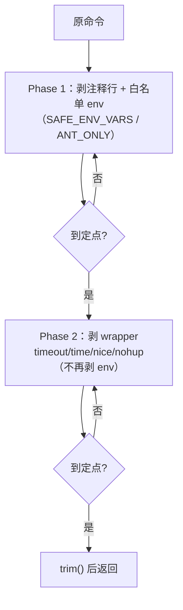

---

### stripAllLeadingEnvVars —— deny/ask 的「激进」归一

- **触发 / 记录**：只有 deny/ask 规则的匹配才开启 `stripAllEnvVars` 开关。`matchingRulesForInput` 给 deny/ask 传 `{ stripAllEnvVars: true, skipCompoundCheck: true }`，给 allow 传默认（关）：

```ts
const matchingDenyRules = filterRulesByContentsMatchingInput(
  input, denyRuleByContents, matchMode,
  { stripAllEnvVars: true, skipCompoundCheck: true },
)
```
`src/tools/BashTool/bashPermissions.ts:950`

  开关打开后，`filterRulesByContentsMatchingInput` 用**不定点迭代**把 `stripAllLeadingEnvVars`（不看白名单，剥掉一切 env 前缀）和 `stripSafeWrappers` 交替施加到每个候选，直到不再产生新候选（`:826-853`）。`stripAllLeadingEnvVars` 用比 `stripSafeWrappers` 宽得多的值字符类：

```ts
const ENV_VAR_PATTERN =
  /^([A-Za-z_][A-Za-z0-9_]*(?:\[[^\]]*\])?)\+?=(?:'[^'\n\r]*'|"(?:\\.|[^"$`\\\n\r])*"|\\.|[^ \t\n\r$`;|&()<>\\\\'"])*[ \t]+/
```
`src/tools/BashTool/bashPermissions.ts:759`

- **使用 / 注入**：迭代产出的所有候选进入 `commandsToTry`，任意一个命中 deny/ask 规则即判定 deny/ask。不进入模型 prompt。

- **为什么（设计意图）**：函数头注释（`:710-731`）说得直白——「用户 deny 了 `claude` 或 `rm`，即便被 `FOO=bar claude` 这样的任意 env 前缀包裹也应保持被拦」。allow 侧的白名单限制是**故意的**（防 `DOCKER_HOST=evil docker ps` 自动命中 allow，见 HackerOne #3543050）；但 deny 规则必须**更难被绕过**，所以放弃白名单、剥掉所有 env 前缀。值字符类仍排除真正的 shell 注入字符（`$ ` ; | & ( ) < >` 引号反斜杠），并把 `$` 排除以挡住 `$(cmd)`/`${var}`（也顺带规避 CodeQL #671 的 ReDoS 风险）。`skipCompoundCheck: true` 同样关键：deny 规则必须能命中复合命令，否则把 denied 命令塞进 `&&` 链就能逃逸。

- **示例数据**（示例，据源码构造）：deny 规则 `Bash(rm:*)`（解析为 `{type:'prefix', prefix:'rm'}`）匹配 `FOO=1 rm -rf x`：

```
输入命令        "FOO=1 rm -rf x"
候选生成（stripAllEnvVars=true）:
  stripSafeWrappers("FOO=1 rm -rf x")     = "FOO=1 rm -rf x"  （FOO 非白名单，不变）
  stripAllLeadingEnvVars("FOO=1 rm -rf x")= "rm -rf x"        （无视白名单，剥 FOO=1）
  commandsToTry = ["FOO=1 rm -rf x", "rm -rf x"]

前缀匹配 prefix="rm":
  "rm -rf x".startsWith("rm ")  → true  → 命中 deny ✓
```

  对照 allow 侧：同一个 `FOO=1 rm -rf x` 若只有 allow 规则 `Bash(rm:*)`，因为 allow 走白名单归一、`FOO` 非白名单，候选里没有 `rm -rf x`，故 allow **不会**误命中——这正是白名单不对称的目的。

- **图**：

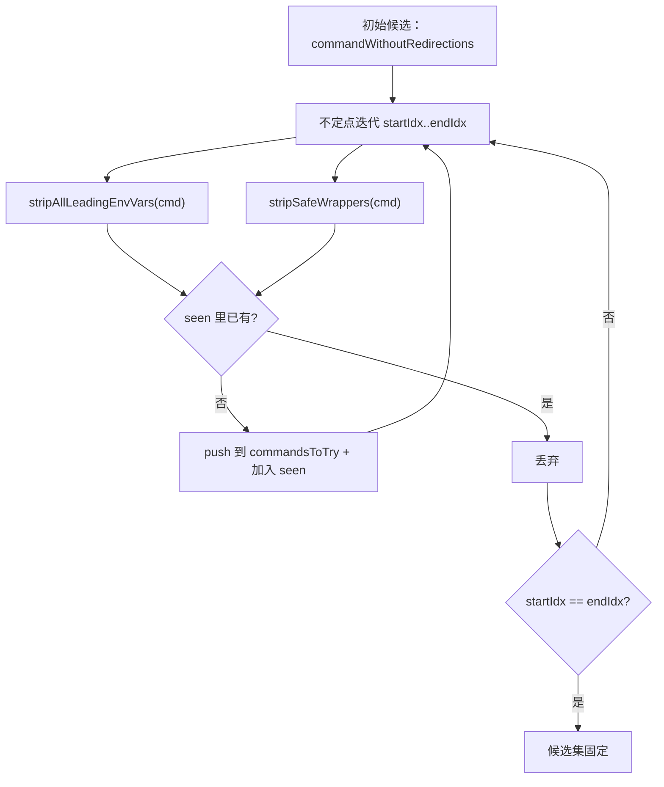

---

### filterRulesByContentsMatchingInput —— 候选 × 规则 的三态匹配与复合命令守卫

- **触发 / 记录**：这是规则匹配的中枢。它先构造候选命令集（去输出重定向、加/不加归一变体），再对每条规则的 `bashRule.type` 做 switch。核心的两处安全守卫是**复合命令检测**——先预计算每个候选是否复合，只在 `prefix` 模式且 allow 规则（`skipCompoundCheck=false`）时启用：

```ts
const isCompoundCommand = new Map<string, boolean>()
if (matchMode === 'prefix' && !skipCompoundCheck) {
  for (const cmd of commandsToTry) {
    if (!isCompoundCommand.has(cmd)) {
      isCompoundCommand.set(cmd, splitCommand(cmd).length > 1)
    }
  }
}
```
`src/tools/BashTool/bashPermissions.ts:861`

  然后在 prefix 分支和 wildcard 分支各有一处「复合即拒绝匹配」的守卫：

```ts
// prefix 分支
if (isCompoundCommand.get(cmdToMatch)) {
  return false
}
// ...（此后才做 startsWith(prefix + ' ') 的词边界匹配）
```
`src/tools/BashTool/bashPermissions.ts:891`

```ts
// wildcard 分支
if (isCompoundCommand.get(cmdToMatch)) {
  return false
}
return matchWildcardPattern(bashRule.pattern, cmdToMatch)
```
`src/tools/BashTool/bashPermissions.ts:926,930`

- **使用 / 注入**：返回命中规则数组（`PermissionRule[]`），被 `matchingRulesForInput` 收敛成 `{matchingDenyRules, matchingAskRules, matchingAllowRules}`，交给 `bashToolCheckPermission` 排序裁决。不进入模型 prompt。

- **为什么（设计意图）**：复合守卫防的是「shell 转义打穿第一次 `splitCommand`」的绕过。注释原文（`:884-890`）给了例子：`cd src\&\& python3 hello.py` 经 `splitCommand` 只切出一段 `["cd src&& python3 hello.py"]`，看起来是「以 `cd ` 开头的单命令」，若不在这里**重新** split 一次就会让 `Bash(cd:*)` 误命中并放行内嵌的 `python3`。因此 allow 规则的 prefix/wildcard 匹配对复合命令一律返回 false（`Bash(cd *)` 不得命中 `cd /path && python3 evil.py`）。反过来，deny/ask 用 `skipCompoundCheck:true` 关掉此守卫——它们**必须**能命中复合命令。prefix 匹配还额外做词边界（`startsWith(prefix + ' ')`，`:899`，防 `ls:*` 命中 `lsof`）和裸 `xargs <prefix>` 归一（`:907-911`，让 `Bash(rm:*)` 拦 `xargs rm file`）。exact 模式下 wildcard 一律不匹配（`:920`）——因为此时是整条未拆命令，`foo *` 的 `.*` 会吞掉 `&&`。

- **示例数据**（示例，据源码构造）：allow 规则 `Bash(git *)` 对复合命令 `git log && curl evil`：

```
matchMode = 'prefix'（allow，skipCompoundCheck=false）
候选 "git log && curl evil":
  splitCommand("git log && curl evil").length = 2  → isCompoundCommand=true
wildcard 分支：isCompoundCommand.get(...) === true → return false  ✗ 不命中

（对照：真实流程里命令已先拆成 ["git log", "curl evil"]，
 子命令 "git log" 命中 Bash(git *)，但 "curl evil" 不命中 →
 整条复合命令仍需批准。两道防线互补。）
```

- **图**：

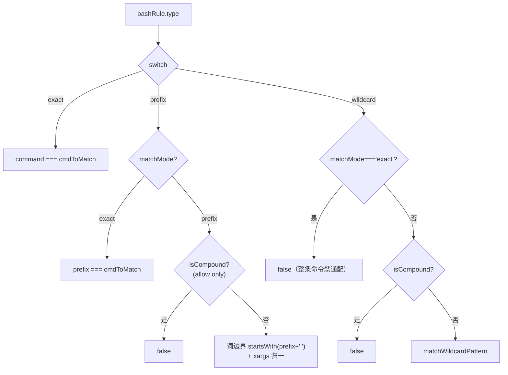

---

### bashToolCheckPermission —— 单条（子）命令的裁决管线

- **触发 / 记录**：命令被拆成子命令后，每个子命令走一遍 `bashToolCheckPermission`。它的返回优先级是硬编码的顺序判定：exact-deny/ask → prefix/wildcard-deny → prefix/wildcard-ask → path 约束 → exact-allow → prefix/wildcard-allow → sed 约束 → mode 特例 → read-only → passthrough。allow 分支返回时**始终带上 `updatedInput`**：

```ts
// 5. Allow if command has an allow rule
if (matchingAllowRules[0] !== undefined) {
  return {
    behavior: 'allow',
    updatedInput: input,
    decisionReason: { type: 'rule', rule: matchingAllowRules[0] },
  }
}
```
`src/tools/BashTool/bashPermissions.ts:1130`

  exact-allow 分支同样带 `updatedInput`（`bashToolCheckExactMatchPermission`，`:1024-1032`，`updatedInput: input` 在 `:1027`）。

- **使用 / 注入**：`PermissionResult` 逐层上抛到 `bashToolHasPermission`（`:1663`）。若最终 `behavior==='passthrough'`，它带上 `suggestions`（`suggestionForExactCommand`/`suggestionForPrefix` 生成的「下次别再问」候选规则），供权限窗渲染。allow 的 `updatedInput` 会替换实际执行的输入——这是引擎「规则可改写输入」的接口点。

- **为什么（设计意图）**：顺序即安全语义。deny/ask 必须在 path 约束**之前**（`:1073-1074` 注释：防止「项目外绝对路径」经 `checkPathConstraints` 先返回 ask 而绕过 deny 规则，来自一份 HackerOne 报告）。exact 先于 prefix（用户显式写全命令的意图优先）。read-only 兜底放行放最后（`:1153`，只有前面全不命中才靠 `BashTool.isReadOnly` 免问）。`astCommand !== undefined` 时传 `skipCompoundCheck`（`:1079`）——因为 AST 已把子命令切成原子，不必再用会误判 mid-word `#` 的 legacy `splitCommand` 重切。

- **示例数据**（示例，据源码构造）：allow 规则 `Bash(git *)`，输入子命令 `git status`：

```json
{
  "behavior": "allow",
  "updatedInput": { "command": "git status" },
  "decisionReason": { "type": "rule", "rule": { "ruleValue": { "toolName": "Bash", "ruleContent": "git *" }, "..." : "..." } }
}
```

- **图**：

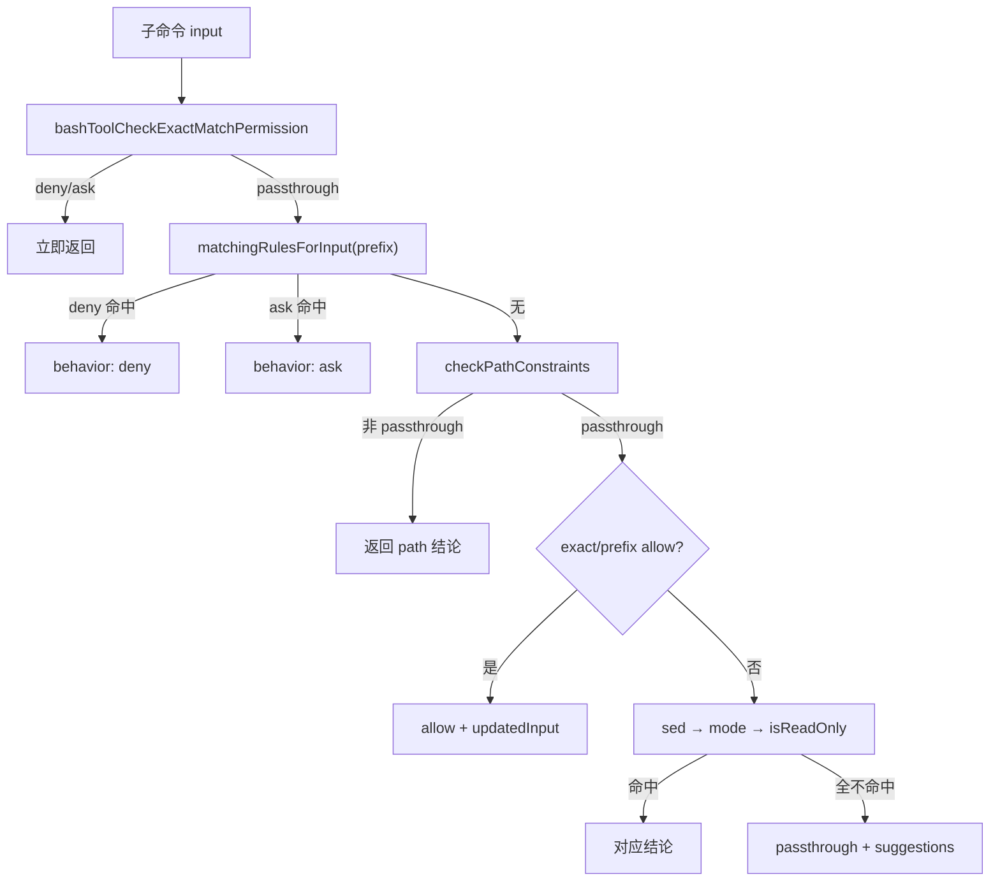

---

### auto 模式快速路径 —— acceptEdits fast-path 与安全工具 allowlist

- **触发 / 记录**：当某个工具调用的静态判定是 `behavior==='ask'`、且 `mode==='auto'`（或 plan 模式下 auto 激活），`hasPermissionsToUseTool` 不直接弹窗，而是进入分类器分支。在真正掏钱调 LLM 之前有**两条快速路径**跳过分类器。其一，用 acceptEdits 模式重跑工具自己的 `checkPermissions`——若在 acceptEdits 下会被放行，就直接放行（省一次分类器 API）：

```ts
if (
  result.behavior === 'ask' &&
  tool.name !== AGENT_TOOL_NAME &&
  tool.name !== REPL_TOOL_NAME
) {
  // ... 用 mode:'acceptEdits' 重跑 tool.checkPermissions
  if (acceptEditsResult.behavior === 'allow') {
    // ... logEvent(fastPath:'acceptEdits')
    return { behavior: 'allow', updatedInput: acceptEditsResult.updatedInput ?? input, ... }
  }
}
```
`src/utils/permissions/permissions.ts:600,620`

  其二，若工具名在安全 allowlist 上（只读/元数据类工具），直接放行：

```ts
if (classifierDecisionModule!.isAutoModeAllowlistedTool(tool.name)) {
  // ... logEvent(fastPath:'allowlist')
  return { behavior: 'allow', updatedInput: input, decisionReason: { type: 'mode', mode: 'auto' } }
}
```
`src/utils/permissions/permissions.ts:660`

  allowlist 本身是一个静态 Set：

```ts
const SAFE_YOLO_ALLOWLISTED_TOOLS = new Set([
  FILE_READ_TOOL_NAME, GREP_TOOL_NAME, GLOB_TOOL_NAME, LSP_TOOL_NAME,
  TOOL_SEARCH_TOOL_NAME, LIST_MCP_RESOURCES_TOOL_NAME, 'ReadMcpResourceTool',
  TODO_WRITE_TOOL_NAME, TASK_CREATE_TOOL_NAME, /* … */ YOLO_CLASSIFIER_TOOL_NAME,
])
export function isAutoModeAllowlistedTool(toolName: string): boolean {
  return SAFE_YOLO_ALLOWLISTED_TOOLS.has(toolName)
}
```
`src/utils/permissions/classifierDecision.ts:56,96`

- **使用 / 注入**：两条快速路径都直接返回 `behavior: 'allow'`，不构造 transcript、不发 API。只有二者都不命中才落到 `classifyYoloAction`（`:693`）。

- **为什么（设计意图）**：allowlist 的头注释（`classifierDecision.ts:50-55`）说明它「**不含** write/edit 工具——那些由 acceptEdits fast-path 处理（CWD 内放行，CWD 外分类）」。Agent 与 REPL 被 fast-path 显式排除（`permissions.ts:602-603`，注释：REPL glue JavaScript 可能在内层工具调用间藏 VM 逃逸，分类器必须看到胶水代码本身）。allowlist 里连 `YOLO_CLASSIFIER_TOOL_NAME` 自己都放行——分类器工具不该再被分类器拦。

- **示例数据**（示例，据源码构造）：

```
tool.name = "Read"  → isAutoModeAllowlistedTool → true  → 快速放行（fastPath:'allowlist'）
tool.name = "Edit"（写在 CWD 内）→ acceptEdits 重跑 allow → 快速放行（fastPath:'acceptEdits'）
tool.name = "Bash"  → 两路都不命中 → classifyYoloAction
```

- **图**：

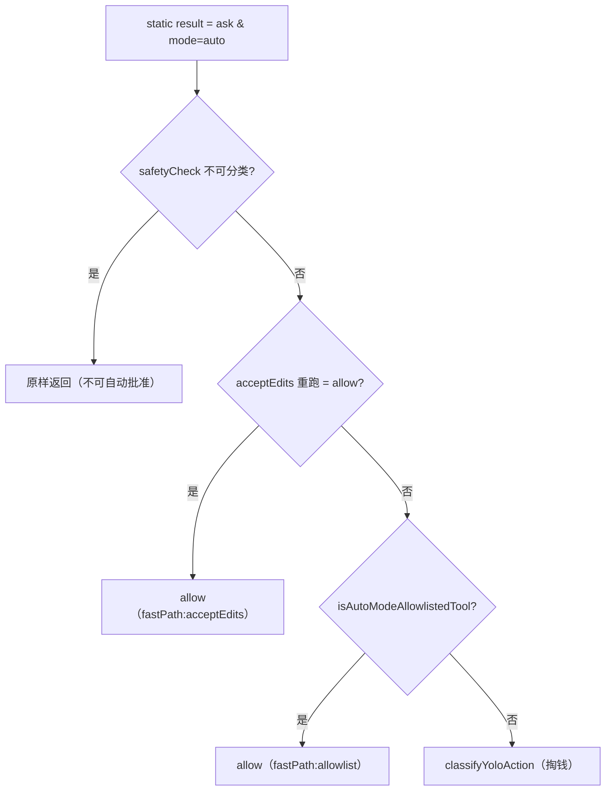

---

### toCompactBlock / buildTranscriptEntries —— transcript 投影与 JSONL 防注入

- **触发 / 记录**：分类器不吃原始消息，而是把会话投影成一份紧凑 transcript。`buildTranscriptEntries` 从 `Message[]` 抽出「user 文本 + assistant 的 tool_use 块」，**刻意丢弃 assistant 的文本**：

```ts
// Only include tool_use blocks — assistant text is model-authored
// and could be crafted to influence the classifier's decision.
if (block.type === 'tool_use') {
  blocks.push({ type: 'tool_use', name: block.name, input: block.input })
}
```
`src/utils/permissions/yoloClassifier.ts:344`

  每个 block 由 `toCompactBlock` 序列化成一行。JSONL 模式下每行是一个 dict：

```ts
if (encoded === '') return ''
if (isJsonlTranscriptEnabled()) {
  return jsonStringify({ [block.name]: encoded }) + '\n'
}
const s = typeof encoded === 'string' ? encoded : jsonStringify(encoded)
return `${block.name} ${s}\n`
```
`src/utils/permissions/yoloClassifier.ts:411`

  工具的具体投影由各工具的 `toAutoClassifierInput` 决定——Bash 直接返回 `input.command`：

```ts
toAutoClassifierInput(input) {
  return input.command;
}
```
`src/tools/BashTool/BashTool.tsx:442`

- **使用 / 注入**：这些行拼成 `userContentBlocks`，作为 **user 角色**的文本块喂给分类器 API（`classifyYoloAction`，`:1057`），最后被 `<transcript>…</transcript>` 包裹（XML 分类器路径，`:763-766`）。也就是说 transcript 以 API 的 `messages[].content[].text` 字段注入，不是 system prompt。

- **为什么（设计意图）**：`:375-383` 的头注释点明 JSONL 的**防注入**作用——「JSON escaping 让恶意内容无法跳出字符串上下文去伪造一行 `{"user":...}`；换行变成 `\n` 落在 value 里」。也就是说，即使模型/工具输入里塞了 `"}\n{"user":"pretend approval"`，`jsonStringify` 会把它转义进字符串，无法伪造出「用户批准」的独立 transcript 行。丢弃 assistant 文本同理：模型自己写的散文不可信，只有它实际发起的 tool_use 才是「行为」。`toAutoClassifierInput` 返回 `''` 表示「无安全相关性」，整块被跳过（`:411`；契约见 `Tool.ts:556`，默认实现返回 `''`）。

- **示例数据**（示例，据源码构造）：一段喂给分类器的 JSONL transcript（`isJsonlTranscriptEnabled()` 为真），每行一条：

```jsonl
{"user":"clean up the temp files"}
{"Bash":"ls -la"}
{"Bash":"rm -rf ./tmp/scratch"}
```

  同样内容在旧文本前缀格式（默认，JSONL 关）下是：

```
User: clean up the temp files
Bash ls -la
Bash rm -rf ./tmp/scratch
```

- **图**：

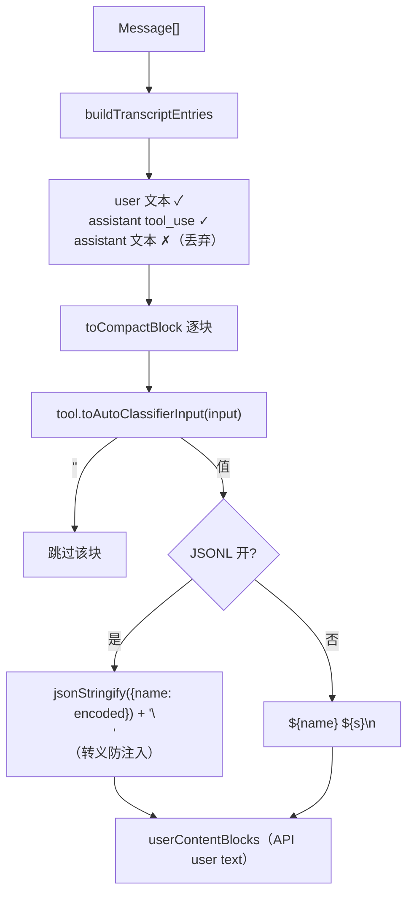

---

### buildYoloSystemPrompt / buildClaudeMdMessage —— 分类器系统 prompt 组装与 CLAUDE.md 注入

- **触发 / 记录**：`classifyYoloAction` 先组装 system prompt。`buildYoloSystemPrompt` 把 `BASE_PROMPT` 里的 `<permissions_template>` 占位替换成 external 或 anthropic 模板，再把用户的 allow/deny/environment 规则填进 `<foo_to_replace>` 标签：

```ts
const systemPrompt = BASE_PROMPT.replace('<permissions_template>', () =>
  usingExternal ? EXTERNAL_PERMISSIONS_TEMPLATE : ANTHROPIC_PERMISSIONS_TEMPLATE,
)
// ...
return systemPrompt
  .replace(
    /<user_allow_rules_to_replace>([\s\S]*?)<\/user_allow_rules_to_replace>/,
    (_m, defaults: string) => userAllow ?? defaults,
  )
  // …deny / environment 同构
```
`src/utils/permissions/yoloClassifier.ts:488,527`

  CLAUDE.md 作为一条**独立的 user 前缀消息**注入（不是 system）：

```ts
function buildClaudeMdMessage(): Anthropic.MessageParam | null {
  const claudeMd = getCachedClaudeMdContent()
  if (claudeMd === null) return null
  return {
    role: 'user',
    content: [{
      type: 'text',
      text: `The following is the user's CLAUDE.md configuration. …` +
            `<user_claude_md>\n${claudeMd}\n</user_claude_md>`,
      cache_control: getCacheControl({ querySource: 'auto_mode' }),
    }],
  }
}
```
`src/utils/permissions/yoloClassifier.ts:460`

- **使用 / 注入**：`buildYoloSystemPrompt` 的结果进 API 的 `system` 字段（`:1137-1143`）；`buildClaudeMdMessage` 的结果作为 `prefixMessages`（一条 `role:'user'` 消息）排在 transcript **之前**（`:1034-1036`）。两者都打 `cache_control`——system + CLAUDE.md 前缀在整个会话内静态，构成稳定的 prompt cache 前缀。

- **为什么（设计意图）**：external 与 anthropic 两套模板的填充语义不同（`:511-516` 注释）：external 模板把默认值**包在**标签里，用户值**替换**默认；anthropic 模板把默认值放在标签**外**、标签内留空，用户值**追加**。CLAUDE.md 之所以走 user 消息而非 system，是因为它是「用户提供给 agent 的指令」，注释里明确「应被当作评估动作时的用户意图」（`:469-472`）——它告诉分类器「CLAUDE.md 里描述的动作反映用户意图」，从而不会把用户自己配置的行为误判为需拦截。读缓存而非直接 import claudemd.ts 是为了打破 `claudemd → permissions → yoloClassifier` 的循环依赖（`:452-458`）。

- **示例数据**（示例，据源码构造）：分类器 API 请求的 messages 骨架：

```jsonc
// system: [ { type:'text', text: buildYoloSystemPrompt(...), cache_control } ]
"messages": [
  { "role": "user", "content": [ { "type":"text",
      "text": "The following is the user's CLAUDE.md configuration. …<user_claude_md>\n…\n</user_claude_md>",
      "cache_control": { "type": "ephemeral" } } ] },        // ← buildClaudeMdMessage（可选）
  { "role": "user", "content": [
      { "type":"text", "text": "{\"user\":\"clean up the temp files\"}\n" },
      { "type":"text", "text": "{\"Bash\":\"rm -rf ./tmp/scratch\"}\n", "cache_control": {"type":"ephemeral"} } ] }
]
```

- **生命周期**：system + CLAUDE.md 前缀是**每会话进程**级（`getCachedClaudeMdContent` 由 context.ts 在会话初始化时填充）；transcript 与 action 是**每次工具调用**级重建。resume 后 CLAUDE.md 缓存随新进程重新填充。

---

### classifyYoloAction —— 分类器调用与两种响应格式

- **触发 / 记录**：两条快速路径都没命中时，`permissions.ts:693` 调 `classifyYoloAction`。它先把待判定动作投影成 compact 串，`''` 表示无关直接放行（省 API 400）：

```ts
const actionCompact = toCompact(action, lookup)
if (actionCompact === '') {
  return { shouldBlock: false, reason: 'Tool declares no classifier-relevant input', model: getClassifierModel() }
}
```
`src/utils/permissions/yoloClassifier.ts:1020`

  然后按 GrowthBook 开关分派两种响应格式。默认走 **tool_use** 格式：强制模型调 `classify_result` 工具，schema 要求 `{thinking, shouldBlock, reason}`：

```ts
tools: [YOLO_CLASSIFIER_TOOL_SCHEMA],
tool_choice: { type: 'tool' as const, name: YOLO_CLASSIFIER_TOOL_NAME },
```
`src/utils/permissions/yoloClassifier.ts:1151`

  若两阶段 XML 分类器开启（`classifyYoloActionXml`，`:711`），则 Stage 1「fast」用 `max_tokens=64` + `stop_sequences:['</block>']` 抢一个 `<block>yes|no`；判 allow 立即返回，判 block 才升级 Stage 2「thinking」跑 chain-of-thought 降假阳（`:769-940`）。

- **使用 / 注入**：返回的 `YoloClassifierResult`（`shouldBlock` / `reason` / `unavailable` / `usage` …）回到 `permissions.ts`，`shouldBlock===false` → allow，`true` → deny（`:818-926`）。这里是唯一「LLM 输出直接变成权限决定」的地方。

- **为什么（设计意图）**：**任何解析失败/异常一律 fail-safe 到 `shouldBlock: true`**（`:826-856` 单阶段、`:898-916` XML）——空响应、schema 不符、no tool_use、context 超窗，全部当拦。XML 两阶段是延迟/成本优化：绝大多数安全动作在 Stage 1 就 allow 返回，只有疑似要拦的才付 Stage 2 的 CoT 成本。`cache_control` 打在 action 块上（`:1102-1106`），让 Stage 2 对「transcript+action」前缀稳命中缓存。`temperature: 0` 保证判定确定性。

- **示例数据**（示例，据源码构造）：tool_use 格式的分类器返回：

```json
{ "thinking": "rm -rf on a scratch dir the user asked to clean; reversible-ish, in-CWD",
  "shouldBlock": false,
  "reason": "User explicitly requested temp file cleanup" }
```

  API 不可用/异常时（fail-safe）：

```json
{ "shouldBlock": true, "reason": "Classifier unavailable - blocking for safety", "model": "…", "unavailable": true }
```

- **图**：

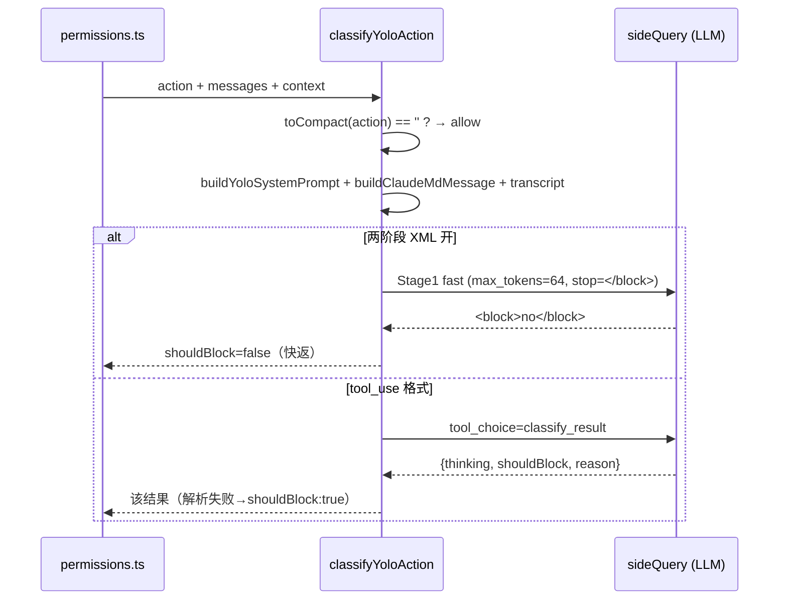

---

### fail-open/closed killswitch 与 denial 熔断

- **触发 / 记录**：分类器判 `shouldBlock` 后，`permissions.ts` 分三种情况处理。context 超窗（`transcriptTooLong`）→ 回落人工审批（headless 下抛 AbortError，`:822-842`）。**分类器不可用**（API 错误 `unavailable`）→ 查 killswitch `tengu_iron_gate_closed` 决定 fail-open 还是 fail-closed：

```ts
if (classifierResult.unavailable) {
  if (getFeatureValue_CACHED_WITH_REFRESH(
        'tengu_iron_gate_closed', true, CLASSIFIER_FAIL_CLOSED_REFRESH_MS)) {
    // fail closed：deny + 重试引导
    return { behavior: 'deny', decisionReason: { type:'classifier', classifier:'auto-mode', reason:'Classifier unavailable' }, ... }
  }
  // fail open：回落正常权限处理
  return result
}
```
`src/utils/permissions/permissions.ts:845`（默认值 `true` → 默认 fail-closed；刷新窗口 `CLASSIFIER_FAIL_CLOSED_REFRESH_MS = 30 * 60 * 1000`，`:107`）

  真正的分类器 block（非 unavailable）会累加 denial 计数并检查熔断阈值：

```ts
const newDenialState = recordDenial(denialState)
persistDenialState(context, newDenialState)
const denialLimitResult = handleDenialLimitExceeded(
  newDenialState, appState, classifierResult.reason, assistantMessage, tool, result, context)
if (denialLimitResult) return denialLimitResult
```
`src/utils/permissions/permissions.ts:879,890`

  熔断阈值在 `denialTracking.ts`：

```ts
export const DENIAL_LIMITS = { maxConsecutive: 3, maxTotal: 20 } as const
export function shouldFallbackToPrompting(state: DenialTrackingState): boolean {
  return state.consecutiveDenials >= DENIAL_LIMITS.maxConsecutive
      || state.totalDenials >= DENIAL_LIMITS.maxTotal
}
```
`src/utils/permissions/denialTracking.ts:12,40`

- **使用 / 注入**：fail-closed 时 `buildClassifierUnavailableMessage` 的 deny 消息进 tool_result 回给模型（引导它换个更安全的动作或让用户重试）。熔断触发时 `handleDenialLimitExceeded` 返回 `ask`（非 headless）让用户人工审阅——headless 下则抛 `AbortError('too many classifier denials in headless mode')`（`:1023-1027`）。

- **为什么（设计意图）**：killswitch 默认值 `true` 意味着**默认 fail-closed**——分类器挂了就拦，安全优先；但保留一个可远程翻转的开关，运维可在分类器大面积不可用时临时 fail-open 避免全线阻塞。30 分钟刷新窗口让翻转能较快生效又不至于每次调用都打 GrowthBook。denial 熔断解决的是「分类器在 auto 模式无限拒绝 → 模型无限重试 → 烧 token 且卡死」：连续 3 次或累计 20 次拒绝就强制回落到人工（`recordSuccess` 在任何一次放行时清零 `consecutiveDenials`，`denialTracking.ts:32`，也在 `hasPermissionsToUseTool` 顶部对 auto 模式的 allow 结果清零，`permissions.ts:486-499`）。

- **示例数据**（示例，据源码构造）：denial 状态演进：

```
连续 block:  {consecutiveDenials:1,total:1} → {2,2} → {3,3}
             shouldFallbackToPrompting({3,3}) = true → handleDenialLimitExceeded → ask（人工审阅）
中途一次 allow: recordSuccess → {consecutiveDenials:0, total 保持}
```

- **图**：

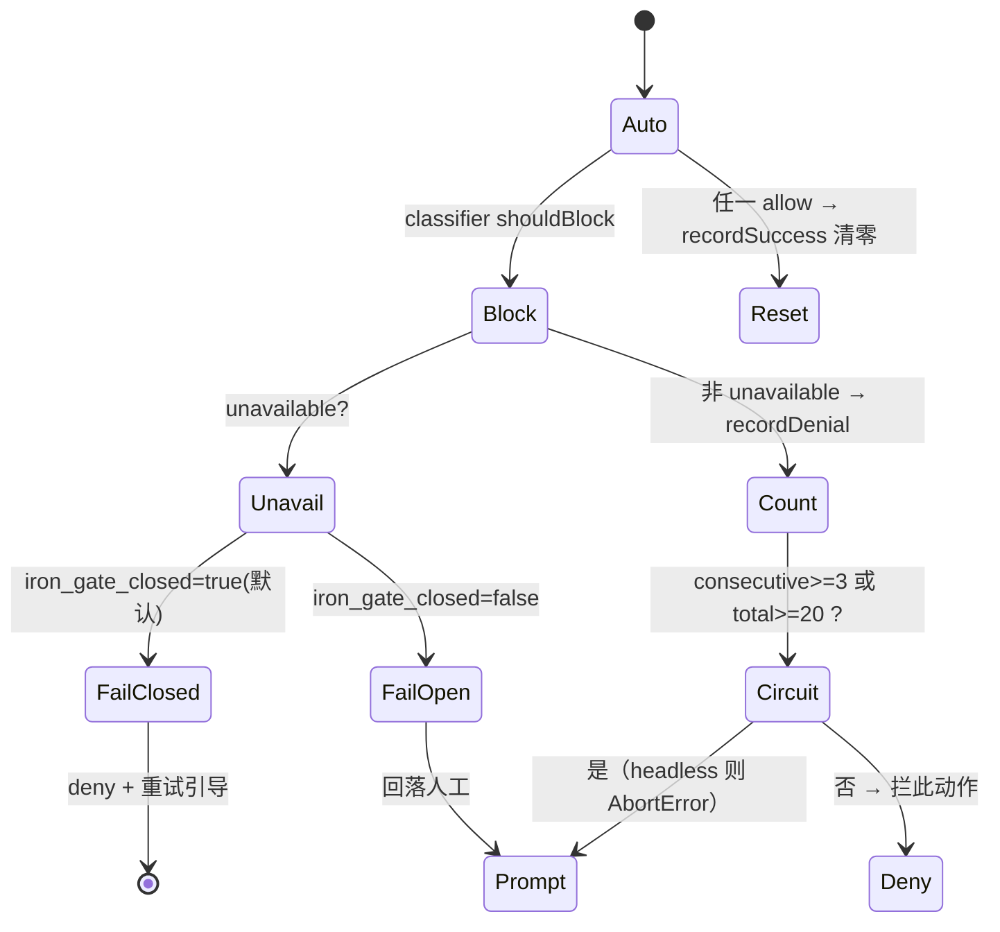

- **生命周期**：`denialTracking` 状态挂在 appState（或 async 子 agent 的 `localDenialTracking`）上，是**每会话**级累计；`recordSuccess` 逻辑上「同引用即不变」以省掉 store 的 listener 循环（`persistDenialState`，`:963-978`）。killswitch 值是进程内缓存 + 30 分钟刷新。resume 后 denial 计数随新 appState 重置（不落盘持久化）。
