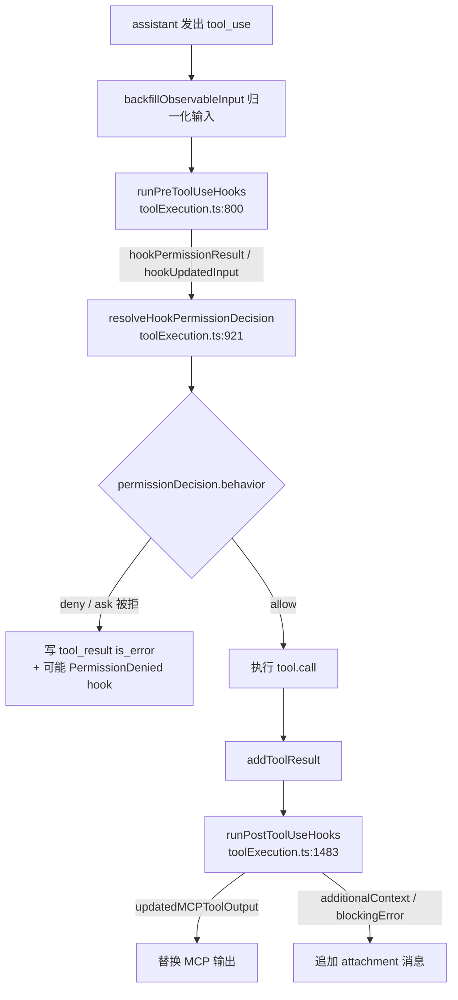
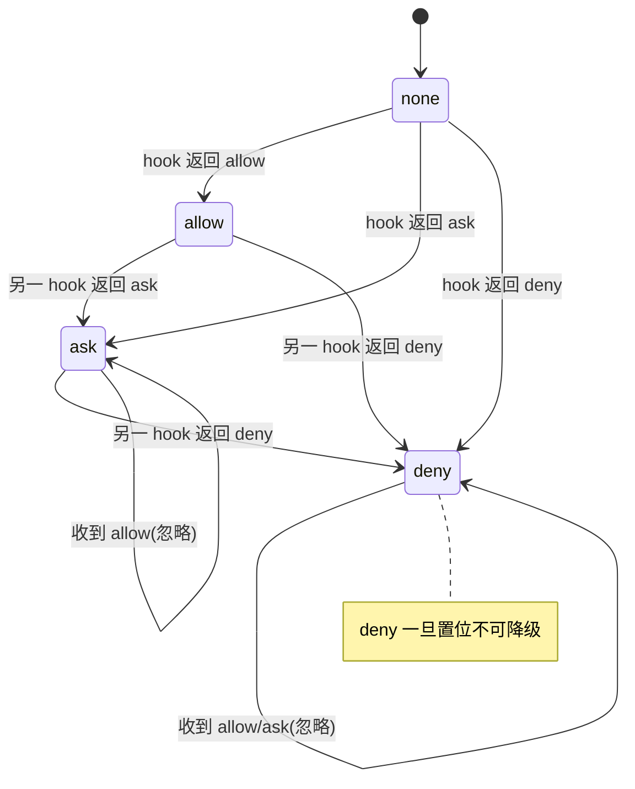
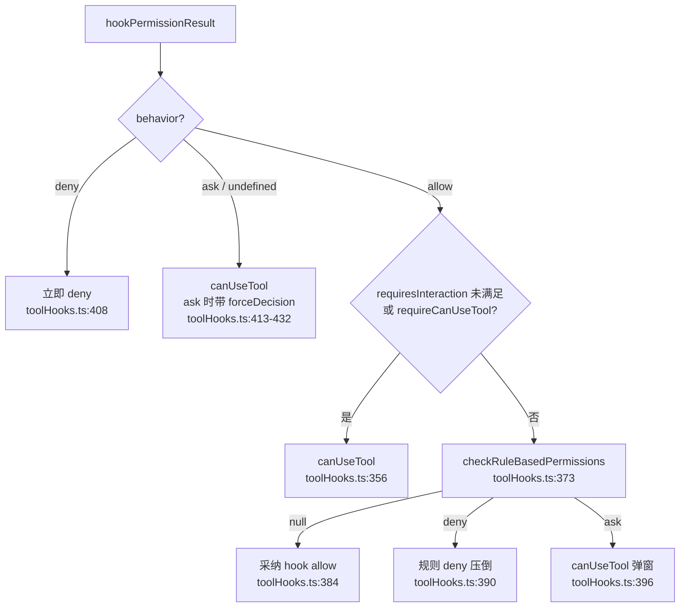
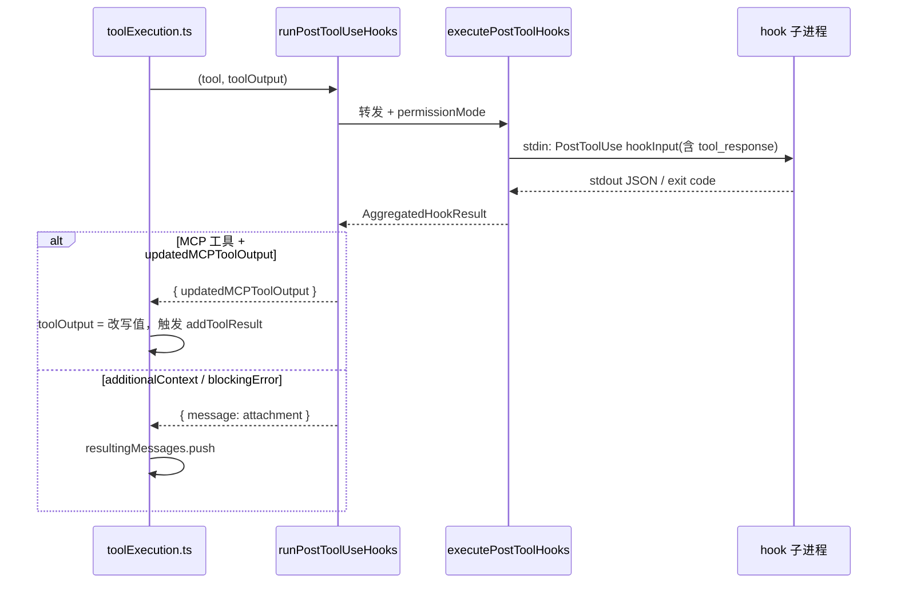
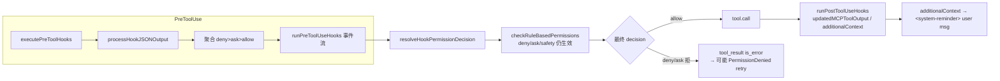

# 09 · PreToolUse / PostToolUse Hook 与闸门协调

本篇覆盖：hook 配置与 matcher 匹配 ｜ 子进程 stdout → JSON 解析（`processHookJSONOutput`）｜ 多 hook 聚合与 `deny > ask > allow` 优先级 ｜ `runPreToolUseHooks` 事件流 ｜ **闸门协调核心 `resolveHookPermissionDecision`（allow 仍过规则 / deny 立即 / ask forceDecision）** ｜ `checkRuleBasedPermissions` 规则子集与 bypass-immune 安全检查 ｜ `runPostToolUseHooks` 与 `updatedMCPToolOutput` ｜ `additionalContext` 注入为 `<system-reminder>` ｜ `PermissionDenied` 的 retry 信号
关键源文件：`src/services/tools/toolHooks.ts`、`src/utils/hooks.ts`、`src/utils/permissions/permissions.ts`、`src/services/tools/toolExecution.ts`、`src/utils/messages.ts`、`src/schemas/hooks.ts`
上一篇：08-rule-matching-classifier.md ｜ 下一篇：10-multi-agent-isolation.md

---

Hook 子系统的设计目标是：**让外部脚本在工具执行的关键节点（执行前 / 执行后 / 失败后 / 权限被拒）插入自定义逻辑**，既能观测又能干预——修改工具输入、否决执行、注入上下文、改写 MCP 输出。本篇聚焦 `PreToolUse` / `PostToolUse` 这条主链路，并把重点放在 **hook 决策与 settings.json 规则之间的闸门协调**：一个核心不变式是——**hook 返回 `allow` 并不能绕过 `deny` / `ask` 规则**，这条语义被封装在 `resolveHookPermissionDecision` 中，由主循环和 REPL 内层调用共享。

整条链路在 `toolExecution.ts` 的单次工具调用里的位置：



---

### hook 配置与 matcher 匹配

- **触发 / 记录**：hook 来自 `settings.json` 的 `hooks` 字段，按事件名分组，每组是若干 `{ matcher, hooks[] }` 配置。schema 定义在 `src/schemas/hooks.ts`：

```ts
export const HookMatcherSchema = lazySchema(() =>
  z.object({
    matcher: z
      .string()
      .optional()
      .describe('String pattern to match (e.g. tool names like "Write")'),
    hooks: z
      .array(HookCommandSchema())
      .describe('List of hooks to execute when the matcher matches'),
  }),
)

export const HooksSchema = lazySchema(() =>
  z.partialRecord(z.enum(HOOK_EVENTS), z.array(HookMatcherSchema())),
)
```
`src/schemas/hooks.ts:194-213`

单个 hook 命令（最常见的 `type: 'command'`）的 schema：

```ts
const BashCommandHookSchema = z.object({
  type: z.literal('command').describe('Shell command hook type'),
  command: z.string().describe('Shell command to execute'),
  if: IfConditionSchema(),
  shell: z.enum(SHELL_TYPES).optional(),
  timeout: z.number().positive().optional(),
  statusMessage: z.string().optional(),
  once: z.boolean().optional(),
  async: z.boolean().optional(),
  asyncRewake: z.boolean().optional(),
})
```
`src/schemas/hooks.ts:32-65`

- **使用 / 注入**：进入 `executePreToolHooks` 时，会用工具名作为 `matchQuery`，逐个 matcher 调 `matchesPattern` 过滤：

```ts
function matchesPattern(matchQuery: string, matcher: string): boolean {
  if (!matcher || matcher === '*') {
    return true
  }
  // Check if it's a simple string or pipe-separated list (no regex special chars except |)
  if (/^[a-zA-Z0-9_|]+$/.test(matcher)) {
    // Handle pipe-separated exact matches
    if (matcher.includes('|')) {
      const patterns = matcher
        .split('|')
        .map(p => normalizeLegacyToolName(p.trim()))
      return patterns.includes(matchQuery)
    }
    // Simple exact match
    return matchQuery === normalizeLegacyToolName(matcher)
  }
  // Otherwise treat as regex
  try {
    const regex = new RegExp(matcher)
    ...
```
`src/utils/hooks.ts:1346-1381`

- **为什么（设计意图）**：matcher 三种写法（空/`*` 全匹配、`Write|Edit` 管道精确匹配、正则）覆盖了从"所有工具"到"精确一组工具"到"命名模式"的所有粒度。`normalizeLegacyToolName` 让旧工具名（历史别名）仍能命中——这是长期兼容性的必要妥协。注释里点明 matcher 的作用是 "Avoids spawning hooks for non-matching commands"，即**在 fork 子进程之前先剪枝**，把无关工具的 hook 开销压到零。

- **示例数据**（示例，据源码构造）：一段拦截写文件的 `PreToolUse` 配置。

```json
{
  "hooks": {
    "PreToolUse": [
      {
        "matcher": "Write|Edit",
        "hooks": [
          {
            "type": "command",
            "command": "python3 .claude/guard_writes.py",
            "timeout": 10
          }
        ]
      }
    ]
  }
}
```

- **生命周期**：hook 配置在会话启动时从 settings 层级（user / project / local / plugin）合并进 `appState`，属于**每会话进程**级；`hasHookForEvent('PreToolUse', appState, sessionId)` 是每次工具调用的快速短路——没有该事件的 hook 就直接 return，不进入 fork 路径。

---

### executePreToolHooks 与 hookInput 构造

- **触发 / 记录**：`runPreToolUseHooks`（`toolHooks.ts`）委托给 `executePreToolHooks`（`hooks.ts`），后者先做存在性短路，再拼装标准 hook 输入：

```ts
export async function* executePreToolHooks<ToolInput>(
  toolName: string,
  toolUseID: string,
  toolInput: ToolInput,
  toolUseContext: ToolUseContext,
  permissionMode?: string,
  ...
): AsyncGenerator<AggregatedHookResult> {
  const appState = toolUseContext.getAppState()
  const sessionId = toolUseContext.agentId ?? getSessionId()
  if (!hasHookForEvent('PreToolUse', appState, sessionId)) {
    return
  }
  ...
  const hookInput: PreToolUseHookInput = {
    ...createBaseHookInput(permissionMode, undefined, toolUseContext),
    hook_event_name: 'PreToolUse',
    tool_name: toolName,
    tool_input: toolInput,
    tool_use_id: toolUseID,
  }
  yield* executeHooks({ hookInput, toolUseID, matchQuery: toolName, ... })
}
```
`src/utils/hooks.ts:3394-3435`

- **使用 / 注入**：`hookInput` 被序列化成 JSON，写到 hook 子进程的 **stdin**。基础字段来自 `createBaseHookInput`：

```ts
return {
  session_id: resolvedSessionId,
  transcript_path: getTranscriptPathForSession(resolvedSessionId),
  cwd: getCwd(),
  permission_mode: permissionMode,
  agent_id: agentInfo?.agentId,
  agent_type: resolvedAgentType,
}
```
`src/utils/hooks.ts:320-327`

`PreToolUse` 输入的 zod schema（SDK 侧对外契约）：

```ts
export const PreToolUseHookInputSchema = lazySchema(() =>
  BaseHookInputSchema().and(
    z.object({
      hook_event_name: z.literal('PreToolUse'),
      tool_name: z.string(),
      tool_input: z.unknown(),
      tool_use_id: z.string(),
    }),
  ),
)
```
`src/entrypoints/sdk/coreSchemas.ts:414-423`

- **为什么（设计意图）**：`agent_id` / `agent_type` 让 hook 能区分「主线程调用」和「子 agent 调用」——注释明确："Hooks use agent_id presence to distinguish subagent calls from main-thread calls"。`sessionId` 取 `toolUseContext.agentId ?? getSessionId()`：子 agent 用自己的 id 做 hook 作用域，保证多 agent 隔离（详见第 10 篇）。

- **示例数据**（示例，据源码构造）：写给 hook stdin 的 JSON。

```json
{
  "session_id": "a1b2c3d4-...",
  "transcript_path": "/home/you/.claude/projects/-repo/a1b2c3d4.jsonl",
  "cwd": "/home/you/repo",
  "permission_mode": "default",
  "hook_event_name": "PreToolUse",
  "tool_name": "Write",
  "tool_input": { "file_path": "/home/you/repo/src/a.ts", "content": "..." },
  "tool_use_id": "toolu_01ABC"
}
```

---

### stdout JSON 解析（processHookJSONOutput）

- **触发 / 记录**：hook 子进程退出后，其 stdout 若是 JSON，就交给 `processHookJSONOutput` 翻译成内部 `HookResult`。`PreToolUse` 的核心字段在 `hookSpecificOutput` 分支里被抽取：

```ts
case 'PreToolUse':
  // Override with more specific permission decision if provided
  if (json.hookSpecificOutput.permissionDecision) {
    switch (json.hookSpecificOutput.permissionDecision) {
      case 'allow':
        result.permissionBehavior = 'allow'
        break
      case 'deny':
        result.permissionBehavior = 'deny'
        result.blockingError = {
          blockingError:
            json.hookSpecificOutput.permissionDecisionReason ||
            json.reason ||
            'Blocked by hook',
          command,
        }
        break
      case 'ask':
        result.permissionBehavior = 'ask'
        break
    }
  }
  result.hookPermissionDecisionReason =
    json.hookSpecificOutput.permissionDecisionReason
  // Extract updatedInput if provided
  if (json.hookSpecificOutput.updatedInput) {
    result.updatedInput = json.hookSpecificOutput.updatedInput
  }
  // Extract additionalContext if provided
  result.additionalContext = json.hookSpecificOutput.additionalContext
  break
```
`src/utils/hooks.ts:592-623`

对应的对外 schema（决定了 hook 作者能写哪些字段）：

```ts
z.object({
  hookEventName: z.literal('PreToolUse'),
  permissionDecision: permissionBehaviorSchema().optional(),
  permissionDecisionReason: z.string().optional(),
  updatedInput: z.record(z.string(), z.unknown()).optional(),
  additionalContext: z.string().optional(),
}),
```
`src/types/hooks.ts:73-77`

- **使用 / 注入**：解析出的 `permissionBehavior` / `updatedInput` / `additionalContext` / `blockingError` 汇入 `HookResult`，再经 `executeHooks` 聚合后由 `runPreToolUseHooks` 消费（下一节）。注意除 `hookSpecificOutput` 这条现代路径外，还有两条**遗留兼容路径**同时存在：顶层 `decision: 'approve' | 'block'`（`hooks.ts:525-543`）和顶层 `hookSpecificOutput.permissionDecision`（`hooks.ts:551-575`）。三者可叠加，`hookSpecificOutput` 分支写在最后，因此**它的决定会覆盖前面的**（注释："Override with more specific permission decision if provided"）。

- **为什么（设计意图）**：`deny` 分支同时设置 `permissionBehavior='deny'` 和 `blockingError`——前者驱动闸门否决，后者携带给模型的可读原因，缺省链 `permissionDecisionReason || reason || 'Blocked by hook'` 保证任何情况下都有一句反馈文字。非 JSON 输出 / exit code 2 走另一条路：`blocked = result.status === 2 || jsonBlocked`（`hooks.ts:3334`），即**退出码 2 等价于 `decision: 'block'`**，这是给不想输出 JSON 的简单脚本留的后门。

- **示例数据**（示例，据源码构造）：hook stdout 返回的四字段 JSON。

```json
{
  "hookSpecificOutput": {
    "hookEventName": "PreToolUse",
    "permissionDecision": "allow",
    "permissionDecisionReason": "path is inside an allowed workspace",
    "updatedInput": {
      "file_path": "/home/you/repo/src/a.ts",
      "content": "// linted\n..."
    },
    "additionalContext": "Reminder: this file is covered by CI formatting."
  }
}
```

---

### 多 hook 聚合与 permissionBehavior 优先级

- **触发 / 记录**：一个 matcher 组里可以有多个 hook，多个 matcher 也可能同时命中同一工具。`executeHooks` 把各 hook 的 `HookResult` 归并成流，其中权限决定按固定优先级折叠：

```ts
// Check for permission behavior with precedence: deny > ask > allow
if (result.permissionBehavior) {
  ...
  switch (result.permissionBehavior) {
    case 'deny':
      // deny always takes precedence
      permissionBehavior = 'deny'
      break
    case 'ask':
      // ask takes precedence over allow but not deny
      if (permissionBehavior !== 'deny') {
        permissionBehavior = 'ask'
      }
      break
    case 'allow':
      // allow only if no other behavior set
      if (!permissionBehavior) {
        permissionBehavior = 'allow'
      }
      break
    case 'passthrough':
      // passthrough doesn't set permission behavior
      break
  }
}
```
`src/utils/hooks.ts:2820-2846`

- **使用 / 注入**：折叠后的 `permissionBehavior` 连同 `updatedInput`（仅当本 hook 是 `allow` / `ask` 时才带）一起 `yield` 出去：

```ts
if (permissionBehavior !== undefined) {
  const updatedInput =
    result.updatedInput &&
    (result.permissionBehavior === 'allow' ||
      result.permissionBehavior === 'ask')
      ? result.updatedInput
      : undefined
  ...
  yield { permissionBehavior, hookPermissionDecisionReason: ..., hookSource: ..., updatedInput }
}
```
`src/utils/hooks.ts:2850-2868`

- **为什么（设计意图）**：`deny > ask > allow` 是"**最保守者胜出**"的安全默认：任何一个 hook 说 deny，整组就 deny；没人否决但有人要求确认（ask），就升级为 ask；只有全体一致 allow 才 allow。`passthrough` 显式不改变权限，只用来携带 `updatedInput`——这是"只想改输入、不想表态权限"的中立档位。

- **图**：



---

### runPreToolUseHooks — 聚合结果 → orchestration 事件流

- **触发 / 记录**：`runPreToolUseHooks` 是 `toolHooks.ts` 对 `executePreToolHooks` 的一层适配器，把聚合结果翻译成一个带 `type` 判别的联合类型事件流，供 `toolExecution.ts` 用 `switch` 消费。核心是把 `permissionBehavior` 变成结构化的 `PermissionResult`：

```ts
if (result.permissionBehavior === 'allow') {
  yield {
    type: 'hookPermissionResult',
    hookPermissionResult: {
      behavior: 'allow',
      updatedInput: result.updatedInput,
      decisionReason,
    },
  }
} else if (result.permissionBehavior === 'ask') {
  yield {
    type: 'hookPermissionResult',
    hookPermissionResult: {
      behavior: 'ask',
      updatedInput: result.updatedInput,
      message:
        result.hookPermissionDecisionReason ||
        `Hook PreToolUse:${tool.name} ${getRuleBehaviorDescription(result.permissionBehavior)} this tool`,
      decisionReason,
    },
  }
} else {
  // deny - updatedInput is irrelevant since tool won't run
  yield {
    type: 'hookPermissionResult',
    hookPermissionResult: {
      behavior: result.permissionBehavior,
      message: ...,
      decisionReason,
    },
  }
}
```
`src/services/tools/toolHooks.ts:520-553`

`updatedInput` 无权限决定时（passthrough）单独走一条事件：

```ts
// Yield updatedInput for passthrough case (no permission decision)
if (result.updatedInput && result.permissionBehavior === undefined) {
  yield {
    type: 'hookUpdatedInput',
    updatedInput: result.updatedInput,
  }
}
```
`src/services/tools/toolHooks.ts:558-563`

- **使用 / 注入**：`toolExecution.ts` 的循环把每种事件落地——`hookPermissionResult` 存进局部变量待协调，`hookUpdatedInput` 直接替换 `processedInput`：

```ts
case 'hookPermissionResult':
  hookPermissionResult = result.hookPermissionResult
  break
case 'hookUpdatedInput':
  // Hook provided updatedInput without making a permission decision (passthrough)
  // Update processedInput so it's used in the normal permission flow
  processedInput = result.updatedInput
  break
```
`src/services/tools/toolExecution.ts:831-838`

`blockingError`（来自 exit code 2 或 `decision:'block'`）在这一层被就地转成一个 `behavior:'deny'` 的 `hookPermissionResult`，deny 文案由 `getPreToolHookBlockingMessage` 生成（`hooks.ts:1882` → `` `${hookName} hook error: ${blockingError.blockingError}` ``）：`toolHooks.ts:481-498`。

- **为什么（设计意图）**：这一层的价值是**把"hook 语义"与"权限系统语义"解耦**。`executeHooks` 只知道 `permissionBehavior` 字符串；`runPreToolUseHooks` 把它包装成完整的 `PermissionResult`（带 `decisionReason.type = 'hook'`、`hookName`、`hookSource`），这样下游 UI、OTel、审计都能统一按 `PermissionResult` 处理，不需要知道它来自 hook 还是规则。deny 分支的注释很关键：`updatedInput is irrelevant since tool won't run`——被否决就不携带输入，避免误用。

- **生命周期**：这是**每次工具调用（queryLoop 内的单个 tool_use）**级的一次性生成器；hook 子进程随调随起随灭，无跨调用状态。若执行中 `abortController` 被触发，会 `yield { type: 'stop' }` 让主循环写一条 stop 型 tool_result 并返回（`toolHooks.ts:582-603`）。

---

### resolveHookPermissionDecision — 闸门协调核心

- **触发 / 记录**：这是本篇的心脏。`toolExecution.ts:921` 在跑完 `runPreToolUseHooks` 后，把 `hookPermissionResult` 交给它，产出最终 `PermissionDecision`。函数头注释直接写明了不变式：

```ts
/**
 * Resolve a PreToolUse hook's permission result into a final PermissionDecision.
 *
 * Encapsulates the invariant that hook 'allow' does NOT bypass settings.json
 * deny/ask rules — checkRuleBasedPermissions still applies (inc-4788 analog).
 * Also handles the requiresUserInteraction/requireCanUseTool guards and the
 * 'ask' forceDecision passthrough.
 *
 * Shared by toolExecution.ts (main query loop) and REPLTool/toolWrappers.ts
 * (REPL inner calls) so the permission semantics stay in lockstep.
 */
export async function resolveHookPermissionDecision(
  hookPermissionResult: PermissionResult | undefined,
  ...
```
`src/services/tools/toolHooks.ts:321-343`

`allow` 分支是重头戏——它**不直接放行**，而是先走 `checkRuleBasedPermissions`：

```ts
if (hookPermissionResult?.behavior === 'allow') {
  const hookInput = hookPermissionResult.updatedInput ?? input
  const interactionSatisfied =
    requiresInteraction && hookPermissionResult.updatedInput !== undefined

  if ((requiresInteraction && !interactionSatisfied) || requireCanUseTool) {
    // 交互工具且 hook 未提供 updatedInput，或强制 canUseTool → 走正常 prompt
    return { decision: await canUseTool(tool, hookInput, ...), input: hookInput }
  }

  // Hook allow skips the interactive prompt, but deny/ask rules still apply.
  const ruleCheck = await checkRuleBasedPermissions(tool, hookInput, toolUseContext)
  if (ruleCheck === null) {
    // 无规则反对 → 采纳 hook 的 allow
    return { decision: hookPermissionResult, input: hookInput }
  }
  if (ruleCheck.behavior === 'deny') {
    // deny 规则压倒 hook allow
    return { decision: ruleCheck, input: hookInput }
  }
  // ask rule — dialog required despite hook approval
  return { decision: await canUseTool(tool, hookInput, ...), input: hookInput }
}
```
`src/services/tools/toolHooks.ts:347-406`

`deny` / `ask` 分支：

```ts
if (hookPermissionResult?.behavior === 'deny') {
  logForDebugging(`Hook denied tool use for ${tool.name}`)
  return { decision: hookPermissionResult, input }
}

// No hook decision or 'ask' — normal permission flow, possibly with
// forceDecision so the dialog shows the hook's ask message.
const forceDecision =
  hookPermissionResult?.behavior === 'ask' ? hookPermissionResult : undefined
const askInput =
  hookPermissionResult?.behavior === 'ask' && hookPermissionResult.updatedInput
    ? hookPermissionResult.updatedInput
    : input
return {
  decision: await canUseTool(tool, askInput, ..., forceDecision),
  input: askInput,
}
```
`src/services/tools/toolHooks.ts:408-432`

- **使用 / 注入**：返回的 `{ decision, input }` 被 `toolExecution.ts` 解构（`permissionDecision = resolved.decision; processedInput = resolved.input`，`toolExecution.ts:930-931`）。`behavior === 'allow'` 才继续 `tool.call`；否则写一条 `tool_result` + `is_error` 反馈给模型。

- **为什么（设计意图）**：
  - **`allow` 不越权**：hook 是用户脚本，但用户可能同时在 settings.json 里配了硬性 `deny`（如禁止 `Bash(rm:*)`）。若 hook allow 能一键绕过，安全边界就形同虚设。所以 allow 仅"跳过交互式确认弹窗"，`deny`/`ask` 规则仍生效——注释 `Hook allow skips the interactive prompt, but deny/ask rules still apply` 就是这个意思，`inc-4788 analog` 是它对应的真实事故编号。
  - **`ask` → `forceDecision`**：hook 说 ask 时，不是自己弹窗，而是把自身作为 `forceDecision` 传给 `canUseTool`，让权限弹窗**显示 hook 给的 ask message**，决定权仍交回用户/权限系统。
  - **交互工具特判**：`requiresUserInteraction()` 为真（如 `AskUserQuestion`）时，若 hook 提供了 `updatedInput`，视为"hook 就是那次用户交互"（`interactionSatisfied`），可跳过再问；否则 / 或 `requireCanUseTool` 为真时，强制回到 `canUseTool`。
  - **共享**：主循环和 REPL 内层调用共用此函数，注释强调 "so the permission semantics stay in lockstep"——避免两处各写一份、语义漂移。

- **示例数据**（示例，据源码构造）："hook 说 allow 但存在 deny 规则 → 最终 deny"的协调结果表：

| hook 决定 | `checkRuleBasedPermissions` 结果 | 交互/强制条件 | 最终 `decision.behavior` | 采用的 input | 出处 |
|---|---|---|---|---|---|
| `allow` | `null`（无规则反对） | 否 | **allow**（采纳 hook） | `updatedInput ?? input` | toolHooks.ts:378-385 |
| `allow` | `{ behavior:'deny' }` | 否 | **deny**（规则压倒 hook） | `hookInput` | toolHooks.ts:386-391 |
| `allow` | `{ behavior:'ask' }` | 否 | **ask**（走 `canUseTool` 弹窗） | `hookInput` | toolHooks.ts:392-405 |
| `allow` | 不检查 | `requiresInteraction && !满足` 或 `requireCanUseTool` | **canUseTool 结果** | `hookInput` | toolHooks.ts:356-370 |
| `deny` | 不检查 | — | **deny**（立即） | `input` | toolHooks.ts:408-411 |
| `ask` | 不检查 | — | **canUseTool(forceDecision=hook)** | `updatedInput ?? input` | toolHooks.ts:413-432 |
| `undefined` | 不检查 | — | **canUseTool**（常规流程） | `input` | toolHooks.ts:413-432 |

- **图**：



---

### checkRuleBasedPermissions — 规则子集闸门

- **触发 / 记录**：这是 `resolveHookPermissionDecision` 在 allow 路径上调用的"最小规则闸门"。它只跑权限流水线中**规则驱动**的那几步（`deny` 规则、`ask` 规则、工具自定义 `checkPermissions`、安全检查），不跑 auto-mode classifier、模式变换、`bypassPermissions` 等：

```ts
export async function checkRuleBasedPermissions(
  tool: Tool,
  input: { [key: string]: unknown },
  context: ToolUseContext,
): Promise<PermissionAskDecision | PermissionDenyDecision | null> {
  const appState = context.getAppState()

  // 1a. Entire tool is denied by rule
  const denyRule = getDenyRuleForTool(appState.toolPermissionContext, tool)
  if (denyRule) {
    return {
      behavior: 'deny',
      decisionReason: { type: 'rule', rule: denyRule },
      message: `Permission to use ${tool.name} has been denied.`,
    }
  }
  ...
```
`src/utils/permissions/permissions.ts:1071-1089`

**bypass-immune 安全检查**是这里的第二个关键点——即使 hook allow，`.git/`、`.claude/`、shell 配置等敏感路径仍强制 ask：

```ts
// 1g. Safety checks (e.g. .git/, .claude/, .vscode/, shell configs) are
// bypass-immune — they must prompt even when a PreToolUse hook returned
// allow. checkPathSafetyForAutoEdit returns {type:'safetyCheck'} for these.
if (
  toolPermissionResult?.behavior === 'ask' &&
  toolPermissionResult.decisionReason?.type === 'safetyCheck'
) {
  return toolPermissionResult
}

// No rule-based objection
return null
```
`src/utils/permissions/permissions.ts:1144-1155`

- **使用 / 注入**：返回值三态——`deny` / `ask` 决定 或 `null`（无反对）。`resolveHookPermissionDecision` 据此决定采纳 hook allow（`null`）、改判 deny，还是升级为 ask 弹窗。

- **为什么（设计意图）**：函数头注释解释了为何要独立出这个"规则子集"：`hasPermissionsToUseTool` 的完整流水线里有些步骤（classifier、模式变换）本就不该在 hook allow 后再跑一遍——hook 已经代替了"是否要问用户"的判断，剩下要守住的只有**不可绕过的硬规则**。注释还提醒调用方："Caller must pre-check tool.requiresUserInteraction() — step 1e is not replicated"，即交互工具的检查由 `resolveHookPermissionDecision` 在外层先做（对应 `toolHooks.ts:344,356`）。安全检查被单列为 bypass-immune，是因为写 `.git/` 这类操作的破坏面太大，不能让任何 allow（无论来自 hook 还是 sandbox）短路掉。

- **示例数据**（示例，据源码构造）：deny 规则命中时返回的 `PermissionDenyDecision`。

```json
{
  "behavior": "deny",
  "decisionReason": { "type": "rule", "rule": { "ruleBehavior": "deny", "ruleValue": { "toolName": "Bash", "ruleContent": "rm:*" } } },
  "message": "Permission to use Bash has been denied."
}
```

---

### runPostToolUseHooks 与 updatedMCPToolOutput

- **触发 / 记录**：工具执行成功、结果落盘后（`toolExecution.ts:1483`），`runPostToolUseHooks` 让 hook 观测/加工输出。它逐条消费 `executePostToolHooks` 的聚合结果，其中**改写 MCP 工具输出**是唯一能反向影响工具结果的能力：

```ts
// If hooks provided updatedMCPToolOutput, yield it if this is an MCP tool
if (result.updatedMCPToolOutput && isMcpTool(tool)) {
  toolOutput = result.updatedMCPToolOutput as Output
  yield {
    updatedMCPToolOutput: toolOutput,
  }
}
```
`src/services/tools/toolHooks.ts:145-151`

- **使用 / 注入**：主循环拿到 `updatedMCPToolOutput` 后替换 `toolOutput`，再对 MCP 工具补一次 `addToolResult`：

```ts
if ('updatedMCPToolOutput' in hookResult) {
  if (isMcpTool(tool)) {
    toolOutput = hookResult.updatedMCPToolOutput
  }
} else if (isMcpTool(tool)) {
  hookResults.push(hookResult)
  ...
}
...
if (isMcpTool(tool)) {
  await addToolResult(toolOutput)
}
```
`src/services/tools/toolExecution.ts:1494-1542`

- **为什么（设计意图）**：`PostToolUse` 主要是"事后"钩子——它不能否决已经跑完的工具，但可以：(1) `preventContinuation`（停止后续 agent 继续，`toolHooks.ts:118-130`）；(2) `blockingError` 把问题反馈给模型；(3) `additionalContext` 注入提示；(4) 仅对 **MCP 工具**允许 `updatedMCPToolOutput` 改写结果。为什么只限 MCP？因为内置工具的结果结构是强类型且被下游依赖的，随意改写会破坏不变式；MCP 工具输出是较松散的 `unknown`，改写风险可控。注意 `#31301` 注释指出：`decision:"block"` 的 hook 会同时产出 `blockingError` 和 `hook_blocking_error` attachment 两个结果，代码显式跳过后者以免重复展示 block 原因（`toolHooks.ts:90-103`）。

- **图**：



---

### additionalContext 注入 → `<system-reminder>` user message

- **触发 / 记录**：无论 Pre 还是 Post，hook 的 `additionalContext` 都被包成 `hook_additional_context` attachment：

```ts
// If hooks provided additional context, add it as a message
if (result.additionalContexts && result.additionalContexts.length > 0) {
  yield {
    message: createAttachmentMessage({
      type: 'hook_additional_context',
      content: result.additionalContexts,
      hookName: `PostToolUse:${tool.name}`,
      toolUseID: toolUseID,
      hookEvent: 'PostToolUse',
    }),
  }
}
```
`src/services/tools/toolHooks.ts:133-143`（Pre 侧对称实现见 `toolHooks.ts:566-579`）

- **使用 / 注入**：这个 attachment 在渲染成发给模型的消息时，被转成一条 **`isMeta` 的 user message**，正文用 `<system-reminder>` 包裹：

```ts
case 'hook_additional_context': {
  if (attachment.content.length === 0) {
    return []
  }
  return [
    createUserMessage({
      content: wrapInSystemReminder(
        `${attachment.hookName} hook additional context: ${attachment.content.join('\n')}`,
      ),
      isMeta: true,
    }),
  ]
}
```
`src/utils/messages.ts:4117-4128`

`wrapInSystemReminder` 本体：

```ts
export function wrapInSystemReminder(content: string): string {
  return `<system-reminder>\n${content}\n</system-reminder>`
}
```
`src/utils/messages.ts:3097-3099`

- **为什么（设计意图）**：`additionalContext` 让 hook 能**向模型追加提示而不占用一次真正的用户输入**。用 `<system-reminder>` 包裹是全局约定——`08` 篇讲过的规则/分类器反馈、以及压缩提醒等系统级注入都走这个信封，模型被训练成把 `<system-reminder>` 当作系统旁白而非用户话语；`isMeta: true` 则把它标记为元消息，避免污染对话统计。`hook_blocking_error`（`messages.ts:4090-4098`）和 `hook_stopped_continuation`（`messages.ts:4130-4138`）也用同一封信格式，只是文案不同——保证所有 hook 反馈在模型眼里格式一致、可辨识。

- **示例数据**（示例，据源码构造）：最终进入 prompt 的那条消息文本。

```
<system-reminder>
PostToolUse:Write hook additional context: Reminder: this file is covered by CI formatting.
</system-reminder>
```

---

### PermissionDenied hook 的 retry 信号

- **触发 / 记录**：当 auto-mode classifier 否决了一次工具调用，`toolExecution.ts` 会跑 `PermissionDenied` hook，给外部一个"其实现在可以放行"的翻盘机会：

```ts
// Run PermissionDenied hooks for auto mode classifier denials.
// If a hook returns {retry: true}, tell the model it may retry.
if (
  feature('TRANSCRIPT_CLASSIFIER') &&
  permissionDecision.decisionReason?.type === 'classifier' &&
  permissionDecision.decisionReason.classifier === 'auto-mode'
) {
  let hookSaysRetry = false
  for await (const result of executePermissionDeniedHooks(
    tool.name,
    toolUseID,
    processedInput,
    permissionDecision.decisionReason.reason ?? 'Permission denied',
    toolUseContext,
    permissionMode,
    toolUseContext.abortController.signal,
  )) {
    if (result.retry) hookSaysRetry = true
  }
  if (hookSaysRetry) {
    resultingMessages.push({
      message: createUserMessage({
        content:
          'The PermissionDenied hook indicated this command is now approved. You may retry it if you would like.',
        isMeta: true,
      }),
    })
  }
}
```
`src/services/tools/toolExecution.ts:1073-1101`

- **使用 / 注入**：`retry` 从 stdout 解析（`hooks.ts:654-656`：`case 'PermissionDenied': result.retry = json.hookSpecificOutput.retry`）。若任一 hook 返回 `retry: true`，就追加一条 `isMeta` user message 明确告诉模型"可以重试"。注意这条**不是** `<system-reminder>` 包裹，而是直白的一句 meta 文本——因为它是给模型的行动许可，语义上更接近旁白指令。

- **为什么（设计意图）**：这条链路只在 `auto-mode classifier` 否决时触发（`decisionReason.type === 'classifier' && classifier === 'auto-mode'`），且受 `TRANSCRIPT_CLASSIFIER` feature 门控。它把"分类器是概率性的、可能误杀"这一现实纳入设计：外部 hook（可能查了更权威的策略源）可以覆盖分类器的否决，但**不是直接放行工具**，而是提示模型自行决定是否重发——保留了模型在环的最后一道判断，避免 hook 与分类器互相拉扯出无限循环。

- **生命周期**：`PermissionDenied` hook 每次分类器否决触发一次，无状态；`retry` 提示只影响当前回合模型的下一步决策，不落盘。

---

### 补充：PermissionRequest hook（headless / async agent）

- **触发 / 记录**：无法弹窗的 headless / async agent 走另一条 hook：`runPermissionRequestHooksForHeadlessAgent`，在 fallback 自动 deny 之前给 hook 一次表态机会：

```ts
if (decision.behavior === 'allow') {
  const finalInput = decision.updatedInput ?? input
  // Persist permission updates if provided
  if (decision.updatedPermissions?.length) {
    persistPermissionUpdates(decision.updatedPermissions)
    context.setAppState(prev => ({
      ...prev,
      toolPermissionContext: applyPermissionUpdates(
        prev.toolPermissionContext,
        decision.updatedPermissions!,
      ),
    }))
  }
  return {
    behavior: 'allow',
    updatedInput: finalInput,
    decisionReason: { type: 'hook', hookName: 'PermissionRequest' },
  }
}
```
`src/utils/permissions/permissions.ts:400-459`

- **使用 / 注入**：返回的 `PermissionDecision`（`allow` / `deny`）替代交互弹窗；`deny` 且带 `interrupt` 时会 `context.abortController.abort()` 直接中断。与 `PreToolUse` 不同，`PermissionRequest` 的 `allow` 可携带 `updatedPermissions` 并**持久化**到权限上下文（`persistPermissionUpdates`）——因为 headless 场景没有人来点"总是允许"，只能靠 hook 代劳。

- **为什么（设计意图）**：headless / async agent 一旦缺少人类确认，默认策略是**保守 auto-deny**；`PermissionRequest` hook 是唯一的程序化放行入口，让 CI、批处理等无人值守场景仍能按外部策略跑通。它的 `decisionReason.type` 同样是 `'hook'`，与交互路径的决策在下游统一处理。

---

## 小结：一次工具调用里的 hook 闸门全景



核心记忆点：
1. **hook 决定与 settings 规则是两层闸门**，`resolveHookPermissionDecision` 负责协调，**allow 只跳过弹窗、不越 deny/ask 规则**（inc-4788）。
2. **多 hook 聚合按 `deny > ask > allow`**，最保守者胜出。
3. **安全路径（`.git/` 等）bypass-immune**，任何 allow 都压不住。
4. **Post 只有对 MCP 工具能改写输出**；其余能力是观测、注入、阻断续跑。
5. **所有 hook 反馈以 `<system-reminder>` / `isMeta` user message 形式进 prompt**，与规则/分类器反馈同一封信。
