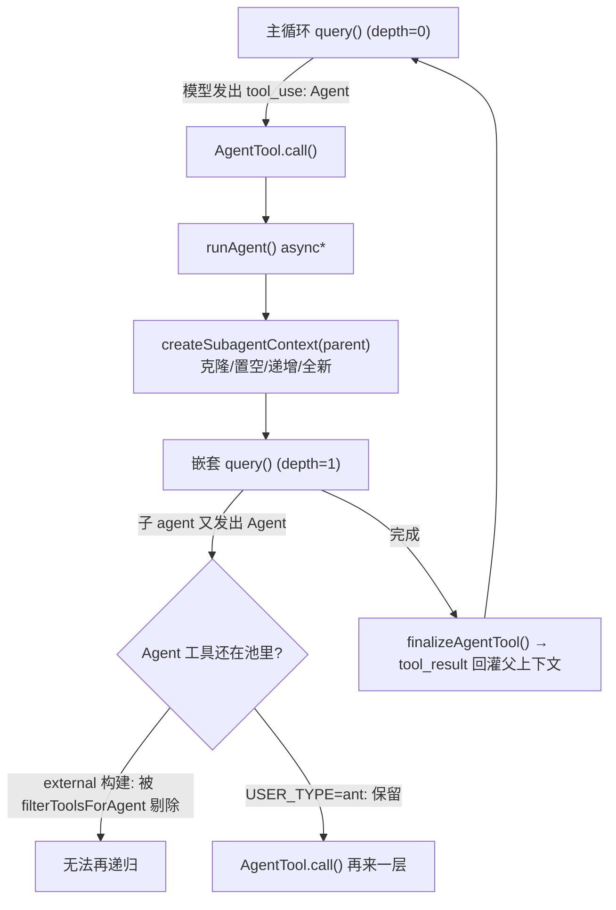
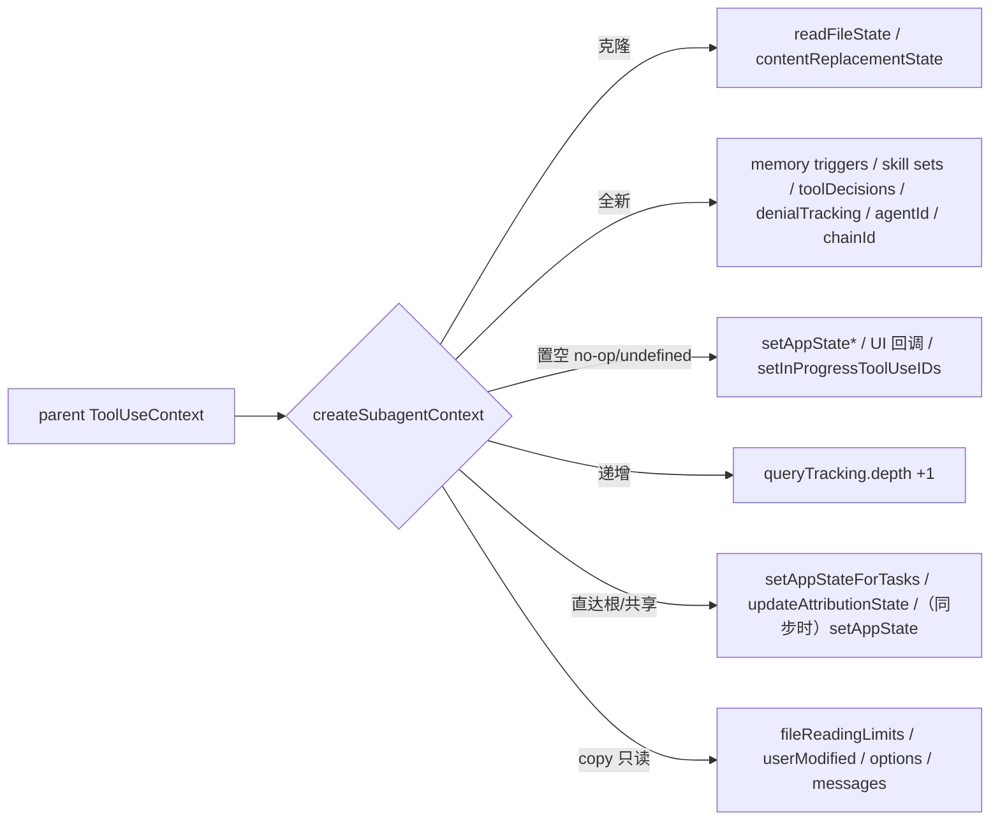
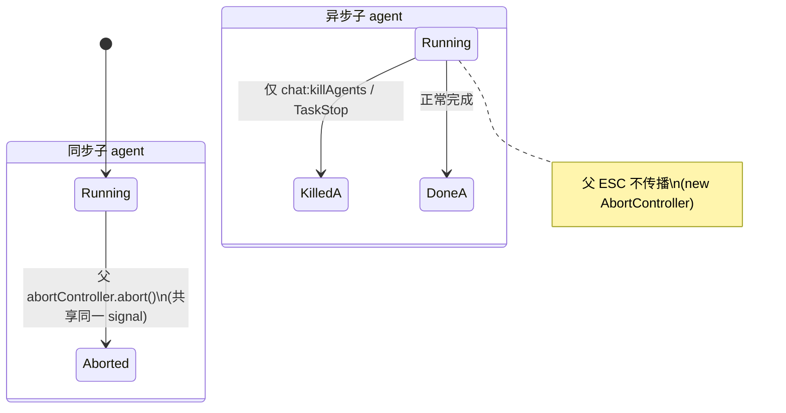
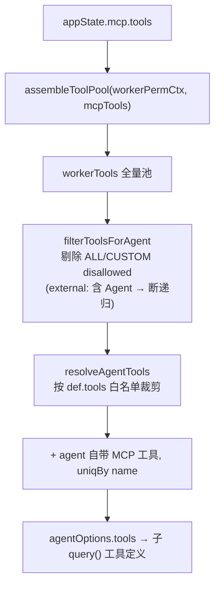
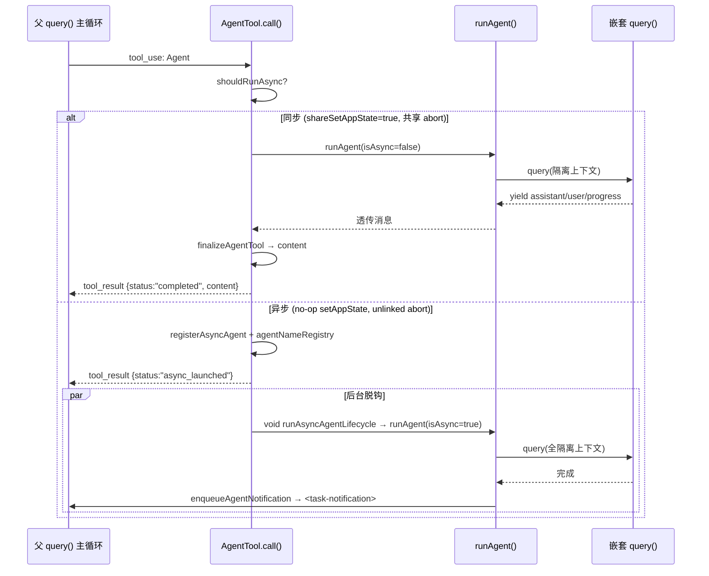

# 10 · 多 Agent：递归调用与上下文隔离

本篇覆盖：Agent 工具如何把 `query()` 递归地嵌套进自身、以及每一层子 agent 如何拿到一份**克隆而非共享**的执行上下文 ｜ 关键源文件：`src/tools/AgentTool/AgentTool.tsx`、`src/tools/AgentTool/runAgent.ts`、`src/utils/forkedAgent.ts`、`src/tools/AgentTool/agentToolUtils.ts`、`src/constants/tools.ts` ｜ 上一篇：09-hooks.md ｜ 下一篇：11-multi-agent-orchestration.md

> 本篇的关注点是**单向的父→子递归**与**状态隔离**：一个 agent 怎么派生出另一个 agent，子 agent 拿到什么、拿不到什么、退出时清理什么。子 agent 之间的**横向协作**（团队、`SendMessage` 路由、协调者模式的调度语义）留给下一篇 11-multi-agent-orchestration.md。这里只在"隔离边界"必要处触及协作机制。

整个子系统可以用一句话概括：**`AgentTool.call()` 是一个工具，它的实现体又调用了一遍主循环 `query()`**。递归由此产生；而"每次递归都换一份隔离的 `ToolUseContext`"这件事，全部集中在 `createSubagentContext()` 一个函数里。理解这两点，本篇就通了。



---

### 递归入口：`AgentTool.call` → `runAgent` → `query`

- **触发 / 记录**：模型在主循环里发出一个 `name: "Agent"` 的 `tool_use` block，工具框架据此调用 `AgentTool.call()`。`call` 解构出 `prompt / subagent_type / run_in_background / name / ...`，选定 `selectedAgent`，最终把参数打包给 `runAgent()`——而 `runAgent()` 的循环体里再次 `for await ... of query({...})`。这就是递归本身。

```ts
async call({
  prompt, subagent_type, description, model: modelParam,
  run_in_background, name, team_name, mode: spawnMode, isolation, cwd
}: AgentToolInput, toolUseContext, canUseTool, assistantMessage, onProgress?) {
```
`src/tools/AgentTool/AgentTool.tsx:239`

```ts
export async function* runAgent({ agentDefinition, promptMessages, toolUseContext, ... }): AsyncGenerator<Message, void> {
  // ...
  for await (const message of query({
    messages: initialMessages,
    systemPrompt: agentSystemPrompt,
    userContext: resolvedUserContext,
    systemContext: resolvedSystemContext,
    canUseTool,
    toolUseContext: agentToolUseContext,   // ← 隔离后的上下文
    querySource,
    maxTurns: maxTurns ?? agentDefinition.maxTurns,
  })) {
```
`src/tools/AgentTool/runAgent.ts:248`、`:748`

- **使用 / 注入**：`runAgent` 是 `AsyncGenerator<Message>`。它把嵌套 `query()` 逐条 yield 出的 `assistant/user/progress` 消息透传给调用方；同步路径下 `call()` 消费这些消息，退出后由 `finalizeAgentTool()` 抽取最后一条 assistant 文本，包装成工具结果 `data` 返回给框架，框架再把它序列化成父对话里的一个 `tool_result` block。也就是说：**子 agent 的一整段思考+工具调用，对父模型而言坍缩成一条工具返回值**。这是"上下文隔离"最外层的表现——父模型看不到子 agent 的中间步骤，只看到结论。

- **为什么（设计意图）**：递归复用同一套 `query()` 主循环，意味着子 agent 天然拥有完整的 agentic 能力（工具、权限、hooks、compaction），无需为"子任务"另写一套精简循环。代价是必须严格隔离可变状态，否则子 agent 的 `readFileState`、`todos`、abort 会污染父循环——这正是下一节 `createSubagentContext` 要解决的问题。注释点明 `runAgent` 参数里 `availableTools` 由 `AgentTool.tsx` 预先算好传入，"to avoid a circular dependency between runAgent and tools.ts"（`runAgent.ts:292` 附近）。

- **示例数据**：模型发出的 `tool_use.input`（据 `fullInputSchema` 构造，`AgentTool.tsx:82`/`:91`）：

```json
{
  "description": "Audit auth flow",
  "subagent_type": "code-reviewer",
  "prompt": "Review src/auth/ for missing authorization checks. Report each finding with file:line.",
  "run_in_background": true,
  "name": "auth-review"
}
```
（示例，据源码构造。`description` 3-5 词，`prompt` 是子任务全文，`subagent_type` 选定 agent 定义，`run_in_background:true` 触发异步路径，`name` 让它可被 `SendMessage({to:"auth-review"})` 寻址——详见下一篇。）

- **生命周期**：一次 `call()` 的作用域等于一个子 agent 的完整生命周期。同步子 agent 与父 turn 同生共死；异步子 agent（下节）脱离父 turn 独立运行，`call()` 立即返回 `status:"async_launched"`。

---

### 上下文隔离核心：`createSubagentContext`

这是本篇的心脏。`runAgent` 在启动嵌套 `query()` 前，调用它把父 `ToolUseContext` 派生成子上下文。它的默认语义是"**全部可变状态一律隔离**"，调用方按需 opt-in 共享。

- **触发 / 记录**：`runAgent` 组装好 `agentOptions`（工具池、model、thinkingConfig 等）后调用：

```ts
const agentToolUseContext = createSubagentContext(toolUseContext, {
  options: agentOptions,
  agentId,
  agentType: agentDefinition.agentType,
  messages: initialMessages,
  readFileState: agentReadFileState,
  abortController: agentAbortController,
  getAppState: agentGetAppState,
  // Sync agents share these callbacks with parent
  shareSetAppState: !isAsync,
  shareSetResponseLength: true,
  criticalSystemReminder_EXPERIMENTAL: agentDefinition.criticalSystemReminder_EXPERIMENTAL,
  contentReplacementState,
})
```
`src/tools/AgentTool/runAgent.ts:700`

注意 `shareSetAppState: !isAsync`——**同步子 agent 共享父的 `setAppState`，异步子 agent 拿到 no-op**。这一个布尔量决定了整套隔离策略的分岔。

- **使用 / 注入**：`createSubagentContext` 逐字段构造一个新 `ToolUseContext`。函数体开头的三条 doc 已经把默认策略写死（`forkedAgent.ts:306`）：

```
 * By default, ALL mutable state is isolated to prevent interference:
 * - readFileState: cloned from parent
 * - abortController: new controller linked to parent (parent abort propagates)
 * - getAppState: wrapped to set shouldAvoidPermissionPrompts
 * - All mutation callbacks (setAppState, etc.): no-op
 * - Fresh collections: nestedMemoryAttachmentTriggers, toolDecisions
```
`src/utils/forkedAgent.ts:306`

关键字段的处理（全部在 `forkedAgent.ts:345`–`:462`）：

```ts
readFileState: cloneFileStateCache(overrides?.readFileState ?? parentContext.readFileState),   // 克隆
nestedMemoryAttachmentTriggers: new Set<string>(),                                             // 全新
// ...
setAppState: overrides?.shareSetAppState ? parentContext.setAppState : () => {},                // 置空 / 共享
setAppStateForTasks: parentContext.setAppStateForTasks ?? parentContext.setAppState,           // 直达根
addNotification: undefined,                                                                     // 置空(UI)
agentId: overrides?.agentId ?? createAgentId(),                                                 // 全新 ID
queryTracking: { chainId: randomUUID(), depth: (parentContext.queryTracking?.depth ?? -1) + 1 } // 递增
```
`src/utils/forkedAgent.ts:379`、`:410`、`:416`、`:438`、`:448`、`:452`

- **为什么（设计意图）**：默认隔离、显式共享，是为了让"忘记隔离"成为不可能的失误——新增一个 UI 回调字段，若不主动共享就默认 `undefined`，子 agent 绝不会误触父终端。文档里逐条给出了每个字段"为什么必须隔离"的理由，其中 `todos` 泄漏的注释尤为典型（`runAgent.ts:838`）："every subagent that called TodoWrite leaves a key in AppState.todos forever ... Whale sessions spawn hundreds of agents; each orphaned key is a small leak that adds up."

- **示例数据**：`createSubagentContext` 各字段的隔离动作一览（据 `forkedAgent.ts:376`–`:461` 逐行构造）：

| 字段 | 动作 | 依据 | 说明 |
|---|---|---|---|
| `readFileState` | 克隆 | `cloneFileStateCache(...)` `:379` | 子 agent 的文件读缓存独立，退出时 `.clear()` |
| `contentReplacementState` | 克隆 | `cloneContentReplacementState(...)` `:399` | 克隆而非全新——保证 fork 场景 prompt cache 命中 |
| `nestedMemoryAttachmentTriggers` | 全新 | `new Set()` `:382` | |
| `loadedNestedMemoryPaths` | 全新 | `new Set()` `:383` | |
| `dynamicSkillDirTriggers` | 全新 | `new Set()` `:384` | |
| `discoveredSkillNames` | 全新 | `new Set()` `:385` | 每子 agent 独立的 skill 发现遥测 |
| `toolDecisions` | 全新(undefined) | `:387` | |
| `localDenialTracking` | 全新 | `createDenialTrackingState()` `:420` | 异步 agent 的 setAppState 是 no-op，须本地累计拒绝计数 |
| `abortController` | 全新(child) 或 共享/override | `:349`–`:354` | 见下节 |
| `getAppState` | 包装 | `:358`–`:374` | 注入 `shouldAvoidPermissionPrompts` |
| `setAppState` | 置空(no-op) 或 共享 | `:410` | `shareSetAppState` 控制 |
| `setAppStateForTasks` | 直达根 | `:416` | 无条件透传到根 store |
| `setResponseLength` / `pushApiMetricsEntry` | 置空 或 共享 | `:426`/`:429` | `shareSetResponseLength` 控制 |
| `setInProgressToolUseIDs` / `updateFileHistoryState` | 置空(no-op) | `:425`/`:432` | |
| `updateAttributionState` | 共享 | `:435` | 函数式 `prev=>next`，并发安全，可放心共享 |
| `addNotification` / `setToolJSX` / `setStreamMode` / `setSDKStatus` / `openMessageSelector` | 置空(undefined) | `:438`–`:442` | 子 agent 不能操纵父 UI |
| `options` / `messages` | override 或 copy | `:445`/`:446` | |
| `agentId` | 全新 | `createAgentId()` `:448` | |
| `queryTracking.chainId` | 全新 | `randomUUID()` `:453` | |
| `queryTracking.depth` | 递增 +1 | `:454` | 每嵌套一层 +1 |
| `fileReadingLimits` / `userModified` | copy | `:456`/`:457` | 只读，直接沿用父引用 |



---

### `setAppState` 置空 vs `setAppStateForTasks` 直达根

隔离里最微妙的一处：为什么 `setAppState` 可以 no-op，却又必须留一条 `setAppStateForTasks` 通道直达根 store？

- **触发 / 记录**：`createSubagentContext` 里两者并列出现：

```ts
setAppState: overrides?.shareSetAppState
  ? parentContext.setAppState
  : () => {},
// Task registration/kill must always reach the root store, even when
// setAppState is a no-op — otherwise async agents' background bash tasks
// are never registered and never killed (PPID=1 zombie).
setAppStateForTasks:
  parentContext.setAppStateForTasks ?? parentContext.setAppState,
```
`src/utils/forkedAgent.ts:410`

- **使用 / 注入**：消费端在 `runAgent` 开头就把这条通道取出来，命名为 `rootSetAppState`，之后所有"必须落到根 store"的写入（frontmatter hooks 注册、todos 清理、后台 bash 任务的注册与 kill）都走它，而不走可能是 no-op 的 `setAppState`：

```ts
// Always-shared channel to the root AppState store. toolUseContext.setAppState
// is a no-op when the *parent* is itself an async agent (nested async→async),
// so session-scoped writes (hooks, bash tasks) must go through this instead.
const rootSetAppState =
  toolUseContext.setAppStateForTasks ?? toolUseContext.setAppState
```
`src/tools/AgentTool/runAgent.ts:337`

`AgentTool.call()` 里同样开一份 `rootSetAppState`，用于 `registerAsyncAgent` 与 `agentNameRegistry` 写入（`AgentTool.tsx:259`）。

- **为什么（设计意图）**：`setAppState` no-op 是为了隔离——异步子 agent 不应把它的 React 局部状态回写进父的渲染树。但**任务生命周期状态（tasks、后台 shell 进程）是进程级资源**，必须始终能被根 store 追踪，否则出现注释里点名的 "PPID=1 zombie"：一个 `run_in_background` 的 shell 循环会在子 agent 结束后变成孤儿进程。`setAppStateForTasks ?? setAppState` 的兜底链保证了：即便嵌套三层 async，最内层的 task 写入仍能沿着每层的透传一路抵达真正的根。`runAgent.ts:844` 的 `killShellTasksForAgent(agentId, ..., rootSetAppState)` 就是这条通道的收尾。

- **示例数据**：三层嵌套 async 时的通道状态（据 `:410`/`:416` 推导）：

```
root REPL          setAppState = 真实 React setter     setAppStateForTasks = 真实 setter
  └ async 子 A     setAppState = no-op                 setAppStateForTasks = root setter (透传)
      └ async 孙 B setAppState = no-op                 setAppStateForTasks = root setter (再透传)
```
（示例，据源码构造。孙 B 注册的后台 bash 任务，经 `setAppStateForTasks` 两跳落到 root，退出时同路径被 `killShellTasksForAgent` 清理。）

---

### AbortController：同步共享父信号、异步全新独立

- **触发 / 记录**：abort 的传播关系直接决定"按 ESC 会杀掉谁"。决策分两处。`runAgent` 先算出要传哪个 controller：

```ts
// - Async agents get a new unlinked controller (runs independently)
// - Sync agents share parent's controller
const agentAbortController = override?.abortController
  ? override.abortController
  : isAsync
    ? new AbortController()          // 异步：全新、不与父 linked
    : toolUseContext.abortController  // 同步：直接用父的
```
`src/tools/AgentTool/runAgent.ts:524`

`createSubagentContext` 内部对未显式 override 的情况另有一层默认——`createChildAbortController`（父 abort 会**向下传播**到 child，但 child abort 不影响父）：

```ts
const abortController =
  overrides?.abortController ??
  (overrides?.shareAbortController
    ? parentContext.abortController
    : createChildAbortController(parentContext.abortController))
```
`src/utils/forkedAgent.ts:349`

- **使用 / 注入**：`runAgent` 把算好的 `agentAbortController` 作为 `override.abortController` 传入 `createSubagentContext`（见 `:706`），因此上面 `forkedAgent.ts:349` 的三元里走的是"`override` 优先"分支。异步路径在 `AgentTool.call()` 里进一步用 `agentBackgroundTask.abortController` 覆盖（`AgentTool.tsx:741`），并在注释里说明："Don't link to parent's abort controller -- background agents should survive when the user presses ESC"（`AgentTool.tsx:694`）。查询循环结束后 `runAgent` 检查 `agentAbortController.signal.aborted` 决定是否抛 `AbortError`（`runAgent.ts:808`）。

- **为什么（设计意图）**：同步子 agent 是父 turn 的一部分，用户中断父 turn 理应连带中断它——所以共享父 signal。异步子 agent 是独立生命周期，用户中断"当前对话"不该误杀在后台跑的 agent——所以给它全新的 unlinked controller，只能通过显式的 `chat:killAgents` / `TaskStop` 终止。`createChildAbortController` 用 `WeakRef` 双向持有，避免"被遗弃的 child 拖住父 controller 不被 GC"（`abortController.ts:80`）。



---

### 上下文消息分叉：`forkContextMessages` 与 `readFileState` 克隆

- **触发 / 记录**：普通子 agent 起步时只带自己的 `promptMessages`；但某些路径（fork subagent、in-process teammate）需要**继承父的整段对话**作为前缀。`runAgent` 用 `forkContextMessages` 是否存在来二选一：

```ts
const contextMessages: Message[] = forkContextMessages
  ? filterIncompleteToolCalls(forkContextMessages)
  : []
const initialMessages: Message[] = [...contextMessages, ...promptMessages]

const agentReadFileState =
  forkContextMessages !== undefined
    ? cloneFileStateCache(toolUseContext.readFileState)               // 带父上下文：克隆父的文件缓存
    : createFileStateCacheWithSizeLimit(READ_FILE_STATE_CACHE_SIZE)   // 干净起步：全新空缓存
```
`src/tools/AgentTool/runAgent.ts:370`

- **使用 / 注入**：`initialMessages` 作为 `query({ messages })` 的起始消息数组（`runAgent.ts:749`），并在启动前 fire-and-forget 写入 sidechain transcript（下节）。`filterIncompleteToolCalls` 会剔除"有 `tool_use` 但没有配对 `tool_result`"的 assistant 消息，防止 API 400——因为父对话可能正好停在一个未完成的工具批次上（`runAgent.ts:866`）。注意这与 fork 场景 `runForkedAgent` 的处理不同：后者**故意不** filter，改由 `claude.ts` 的 `ensureToolResultPairing` 下游修复以保证 prefix 字节一致命中缓存（`forkedAgent.ts:520` 注释）。

- **为什么（设计意图）**：`AgentTool.call()` 决定是否传 `forkContextMessages`——fork 路径传 `toolUseContext.messages`，普通路径传 `undefined`（`AgentTool.tsx:630`）。对应地，带上下文时必须克隆父的 `readFileState`，否则子 agent 看到父对话里"读过某文件"的记录、却没有对应缓存条目，就会对文件新鲜度判断出错。克隆是"深拷贝快照"：子 agent 之后的读取不回写父缓存，父之后的读取也不影响子。

- **示例数据**：两种起步形态（据 `:370`–`:378` 构造）：

```
普通 code-reviewer 子 agent:
  initialMessages = [ user("Review src/auth/ ...") ]        // 仅 promptMessages
  readFileState   = 空的新缓存 (size-limited)

fork worker (useExactTools):
  initialMessages = [ ...父的全部 messages, ...fork 指令 ]   // 继承父上下文
  readFileState   = cloneFileStateCache(父)                 // 父文件缓存的快照
```

- **生命周期**：`initialMessages` 在 `runAgent` 的 `finally` 里被 `initialMessages.length = 0` 主动释放，克隆的 `readFileState` 被 `.clear()`（`runAgent.ts:828`–`:830`）——子 agent 一结束就归还内存，不随父会话累积。

---

### 工具池隔离与递归闸门：`assembleToolPool` / `resolveAgentTools` / `filterToolsForAgent`

子 agent 的工具池**不是**从父继承过滤，而是**独立重建**，这既是隔离也是递归控制的关键。

- **触发 / 记录**：`AgentTool.call()` 用 worker 自己的 permission mode 重新组装整个工具池，绕开父的工具限制：

```ts
// Assemble the worker's tool pool independently of the parent's.
const workerPermissionContext = {
  ...appState.toolPermissionContext,
  mode: selectedAgent.permissionMode ?? 'acceptEdits'
};
const workerTools = assembleToolPool(workerPermissionContext, appState.mcp.tools);
```
`src/tools/AgentTool/AgentTool.tsx:573`

`runAgent` 收到 `workerTools` 作为 `availableTools`，再交给 `resolveAgentTools` 按 agent 定义的 `tools` 白名单裁剪（除非 `useExactTools`）：

```ts
const resolvedTools = useExactTools
  ? availableTools
  : resolveAgentTools(agentDefinition, availableTools, isAsync).resolvedTools
```
`src/tools/AgentTool/runAgent.ts:500`

`resolveAgentTools` 内部先过 `filterToolsForAgent`，后者是递归闸门所在：

```ts
if (ALL_AGENT_DISALLOWED_TOOLS.has(tool.name)) {
  return false
}
if (!isBuiltIn && CUSTOM_AGENT_DISALLOWED_TOOLS.has(tool.name)) {
  return false
}
if (isAsync && !ASYNC_AGENT_ALLOWED_TOOLS.has(tool.name)) {
  // ... in-process teammate 例外 ...
  return false
}
```
`src/tools/AgentTool/agentToolUtils.ts:94`、`:70`（`resolveAgentTools` 在 `:122`）

- **使用 / 注入**：`resolvedTools` 经与 agent 自带 MCP 工具去重合并成 `allTools`，写进 `agentOptions.tools`（`runAgent.ts:661`/`:674`），最终成为子 `query()` 发给模型的工具定义。**递归深度由此被 `ALL_AGENT_DISALLOWED_TOOLS` 控制**：

```ts
export const ALL_AGENT_DISALLOWED_TOOLS = new Set([
  TASK_OUTPUT_TOOL_NAME,
  EXIT_PLAN_MODE_V2_TOOL_NAME,
  ENTER_PLAN_MODE_TOOL_NAME,
  // Allow Agent tool for agents when user is ant (enables nested agents)
  ...(process.env.USER_TYPE === 'ant' ? [] : [AGENT_TOOL_NAME]),
  ASK_USER_QUESTION_TOOL_NAME,
  TASK_STOP_TOOL_NAME,
  ...(feature('WORKFLOW_SCRIPTS') ? [WORKFLOW_TOOL_NAME] : []),
])
```
`src/constants/tools.ts:36`

- **为什么（设计意图）**：
  1. **独立重建工具池** 而非过滤父池——注释说明，父可能处于受限 permission mode，若沿用父的过滤结果，worker 会莫名少工具；每个 worker 用自己的 mode 从零 `assembleToolPool` 才可控（`AgentTool.tsx:568`）。
  2. **递归闸门**：外部构建里 `AGENT_TOOL_NAME` 被放进 disallowed 集合，于是子 agent 的工具池里**没有 Agent 工具**，无法再派生下一层——递归被硬限制在深度 1。只有 `USER_TYPE === 'ant'` 才放开 Agent 工具允许嵌套。异步 agent 走的是另一条更严的白名单 `ASYNC_AGENT_ALLOWED_TOOLS`（不含 Agent，注释 "AgentTool: Blocked to prevent recursion" `tools.ts:92`），仅 in-process teammate 有例外放行（`agentToolUtils.ts:101`）。

- **示例数据**：一个受限 agent 定义 `tools: ["Read", "Grep"]`，同步、非内建。走 `resolveAgentTools(def, workerTools, isAsync=false)`：

```
输入 workerTools (assembleToolPool 全量, 简化):
  ["Agent","Bash","Edit","Glob","Grep","Read","TodoWrite","WebFetch","WebSearch","Write", ...]

第1步 filterToolsForAgent (isBuiltIn=false):
  - 剔除 ALL_AGENT_DISALLOWED_TOOLS（external 构建下含 "Agent"）→ 去掉 Agent/ExitPlanMode/... 
  - 剔除 CUSTOM_AGENT_DISALLOWED_TOOLS（= ALL_...）
  → 保留 ["Bash","Edit","Glob","Grep","Read","TodoWrite","WebFetch","WebSearch","Write", ...]

第2步 按 def.tools=["Read","Grep"] 白名单匹配:
  validTools   = ["Read","Grep"]
  invalidTools = []
  resolvedTools = [<Read 工具>, <Grep 工具>]        // 最终该 agent 可见工具名: ["Read","Grep"]
```
（示例，据 `agentToolUtils.ts:122`–`:225` 构造。`FILE_READ_TOOL_NAME="Read"`、`GREP_TOOL_NAME="Grep"`，见各自 `prompt.ts`。若白名单里写了 `Agent`，`resolveAgentTools` 会把它记为 `validTools` 但因已被 filter 剔除而不进 `resolvedTools`，仅保留 `allowedAgentTypes` 元数据，见 `:191`。）



---

### 每 agent 独立的 MCP / hooks / skills 生命周期

隔离不止于内存状态，还包括"这个 agent 自带的能力"，它们随 agent 起停被注册与清理。

- **触发 / 记录**：三者都在 `runAgent` 主体里加载，都以 `agentId` 为作用域键：

```ts
// agent 自带 MCP：additive 到父的 clients
const { clients: mergedMcpClients, tools: agentMcpTools, cleanup: mcpCleanup } =
  await initializeAgentMcpServers(agentDefinition, toolUseContext.options.mcpClients)
```
`src/tools/AgentTool/runAgent.ts:648`（`initializeAgentMcpServers` 定义在 `:95`）

```ts
// agent frontmatter hooks：注册到 rootSetAppState，isAgent=true 把 Stop 转成 SubagentStop
if (agentDefinition.hooks && hooksAllowedForThisAgent) {
  registerFrontmatterHooks(rootSetAppState, agentId, agentDefinition.hooks,
    `agent '${agentDefinition.agentType}'`, true)
}
```
`src/tools/AgentTool/runAgent.ts:567`

```ts
// agent frontmatter skills：预加载成 isMeta 的 user 消息，塞进 initialMessages
const skillsToPreload = agentDefinition.skills ?? []
// ... 解析 + getPromptForCommand ...
initialMessages.push(createUserMessage({ content: [{ type:'text', text: metadata }, ...content], isMeta: true }))
```
`src/tools/AgentTool/runAgent.ts:578`、`:639`

- **使用 / 注入**：
  - MCP 工具经 `uniqBy([...resolvedTools, ...agentMcpTools], 'name')` 合并进工具池（`:661`）。
  - Hooks 里的 `SubagentStart` 会被 `executeSubagentStartHooks` 立即执行，其 `additionalContexts` 被包成一条 `hook_additional_context` 的 attachment message 追加进 `initialMessages`（`runAgent.ts:532`–`:554`）——即以 attachment 形式注入子 agent 的首轮 prompt。
  - Skills 内容以 `isMeta:true` 的 user 消息注入，等价于"子 agent 一开机就已加载好这些 skill 说明"。
- **为什么（设计意图）**：这些能力是 agent 定义的一部分，必须**与父隔离**（父不该看到子 agent 临时连的 MCP server）且**随 agent 结束清理**。`runAgent` 的 `finally` 块集中收尾：

```ts
} finally {
  await mcpCleanup()                                   // 关闭 agent 专属 MCP（仅 inline 定义的新建 client）
  if (agentDefinition.hooks) clearSessionHooks(rootSetAppState, agentId)  // 注销 hooks
  agentToolUseContext.readFileState.clear()            // 释放克隆缓存
  initialMessages.length = 0                           // 释放上下文消息
  unregisterPerfettoAgent(agentId)
  clearAgentTranscriptSubdir(agentId)
  rootSetAppState(prev => { /* 删除本 agent 的 todos 键 */ })
  killShellTasksForAgent(agentId, toolUseContext.getAppState, rootSetAppState)  // 杀后台 bash
}
```
`src/tools/AgentTool/runAgent.ts:816`

MCP cleanup 只关"inline 定义、本次新建"的 client，字符串引用的共享 client 因被父 memoize 复用而不关（`runAgent.ts:194` 注释）。

- **生命周期**：MCP/hooks/skills 均**每 agent 每次运行**注册、退出即清；不落盘、不跨 resume（agent 重启时重新加载 frontmatter）。

---

### 子对话落盘隔离：sidechain transcript

子 agent 的完整对话不进主 transcript，而是写进以 `agentId` 命名的 sidechain，父的主 transcript 里只留一个 tool_result。

- **触发 / 记录**：`runAgent` 在启动前记录 `initialMessages`，之后每 yield 一条可记录消息就增量追加，用 `lastRecordedUuid` 维持父链连续性：

```ts
void recordSidechainTranscript(initialMessages, agentId).catch(_err =>
  logForDebugging(`Failed to record sidechain transcript: ${_err}`))
void writeAgentMetadata(agentId, {
  agentType: agentDefinition.agentType,
  ...(worktreePath && { worktreePath }),
  ...(description && { description }),
}).catch(...)
```
`src/tools/AgentTool/runAgent.ts:735`

循环内：

```ts
if (isRecordableMessage(message)) {
  await recordSidechainTranscript([message], agentId, lastRecordedUuid).catch(...)
  if (message.type !== 'progress') lastRecordedUuid = message.uuid
  yield message
}
```
`src/tools/AgentTool/runAgent.ts:792`

- **使用 / 注入**：`recordSidechainTranscript` 透传到 `getProject().insertMessageChain(..., agentId, startingParentUuid)`（`sessionStorage.ts:1451`），`agentId` 作为 sidechain 命名空间。`writeAgentMetadata` 持久化 `agentType`（+ 可选 `worktreePath`/`description`），供 **resume 后按 `subagent_type` 缺省也能正确路由**（`runAgent.ts:732` 注释）。这些写入全部 fire-and-forget——注释明确 "persistence failure shouldn't block the agent"。
- **为什么（设计意图）**：父模型只需要子 agent 的结论（tool_result），不需要它的每一步；把中间步骤隔离到 sidechain，既省父上下文 token，又保留了可回看的完整轨迹。`agentId` 由 `createAgentId()` 生成，形如 `a<16 hex>` 或带 label 的 `a<label>-<16hex>`（`uuid.ts:24`），天然是隔离的命名空间。
- **示例数据**：`createAgentId()` 与元数据（据 `uuid.ts:24` / `runAgent.ts:738`）：

```
agentId        = "a3f9c1a2b4d5e6f7"                    // createAgentId() 无 label
transcript 落点 = subagents/<agentId>[/<transcriptSubdir>]
metadata       = { "agentType": "code-reviewer", "description": "Audit auth flow" }
```
（示例，据源码构造。worktree 隔离时 metadata 追加 `"worktreePath": "..."`；`transcriptSubdir` 存在时 transcript 归入子目录，如 workflow 子 agent 的 `subagents/workflows/<runId>/`，见 `runAgent.ts:351`。）

- **生命周期**：sidechain 落盘持久化，跨 resume 存在；`transcriptSubdir` 映射是内存态，`finally` 里 `clearAgentTranscriptSubdir(agentId)` 释放（`runAgent.ts:834`）。

---

### 同步 vs 异步派生与 `isCoordinator` 强制异步

递归的第二个维度是"就地阻塞跑完"还是"脱离父 turn 后台跑"。这个决策决定了隔离强度（异步 = 全隔离）。

- **触发 / 记录**：`AgentTool.call()` 汇总多个条件算出 `shouldRunAsync`：

```ts
const isCoordinator = feature('COORDINATOR_MODE') ? isEnvTruthy(process.env.CLAUDE_CODE_COORDINATOR_MODE) : false;
const forceAsync = isForkSubagentEnabled();
const assistantForceAsync = feature('KAIROS') ? appState.kairosEnabled : false;
const shouldRunAsync = (run_in_background === true
  || selectedAgent.background === true
  || isCoordinator
  || forceAsync
  || assistantForceAsync
  || (proactiveModule?.isProactiveActive() ?? false)) && !isBackgroundTasksDisabled;
```
`src/tools/AgentTool/AgentTool.tsx:553`、`:567`

- **使用 / 注入**：`shouldRunAsync` 分岔两条路径：
  - **异步**：`registerAsyncAgent()` 登记后台任务 → `void runWithAgentContext(...runAsyncAgentLifecycle(...))` 脱钩执行，`call()` 立即返回 `{ status:"async_launched", agentId, outputFile, canReadOutputFile }`（`AgentTool.tsx:686`–`:764`）。子 agent 用**全新 unlinked abortController**、`shareSetAppState:false`（no-op）——最强隔离。完成时 `enqueueAgentNotification` 以 `<task-notification>` 形式回灌父。
  - **同步**：在 `runWithAgentContext` 内 `for await` 消费 `runAgent` 迭代器，`shareSetAppState: !isAsync === true`——共享父 `setAppState` 与父 abortController（`AgentTool.tsx:785` 起）。
- **为什么（设计意图）**：`isCoordinator` 强制异步，是因为协调者模式下每个 worker 都必须并行、不能阻塞协调循环——相关调度语义属下一篇。注释点出同类动机（assistant/KAIROS 模式）："Synchronous subagents hold the main loop's turn open until they complete — the daemon's inputQueue backs up"（`AgentTool.tsx:559`）。`registerAsyncAgent` 的 abortController **刻意不 link 父**，"background agents should survive when the user presses ESC"（`:694`）。
- **示例数据**：两种返回形态（据 `outputSchema` 构造，`AgentTool.tsx:141`）：

```json
// 同步完成 → syncOutputSchema
{ "status": "completed", "prompt": "Review src/auth/ ...",
  "agentId": "a3f9...", "content": [{"type":"text","text":"Found 2 missing checks ..."}],
  "totalToolUseCount": 7, "totalDurationMs": 41230, "totalTokens": 18544, "usage": { ... } }

// 异步派生 → asyncOutputSchema（立即返回）
{ "status": "async_launched", "agentId": "a3f9...",
  "description": "Audit auth flow", "prompt": "Review src/auth/ ...",
  "outputFile": "<task output path>", "canReadOutputFile": true }
```
（示例，据 `outputSchema`/`agentToolResultSchema` 构造。`canReadOutputFile` 取决于父工具池是否含 Read/Bash，`AgentTool.tsx:753`。）



---

### 结果收束：`finalizeAgentTool`

递归的返回值必须坍缩成父能消费的单条工具结果。

- **触发 / 记录**：无论同步收尾、异步 lifecycle 还是被 background 的 case，都调 `finalizeAgentTool(agentMessages, agentId, metadata)`：

```ts
export function finalizeAgentTool(
  agentMessages: MessageType[], agentId: string,
  metadata: { prompt; resolvedAgentModel; isBuiltInAgent; startTime; agentType; isAsync },
): AgentToolResult {
  const lastAssistantMessage = getLastAssistantMessage(agentMessages)
  if (lastAssistantMessage === undefined) throw new Error('No assistant messages found')
  let content = lastAssistantMessage.message.content.filter(_ => _.type === 'text')
  if (content.length === 0) {
    // fallback：末条是纯 tool_use 时，回溯最近一条带文本的 assistant
    for (let i = agentMessages.length - 1; i >= 0; i--) { ... }
  }
```
`src/tools/AgentTool/agentToolUtils.ts:276`–`:307`

- **使用 / 注入**：返回的 `AgentToolResult`（`agentId / agentType / content / totalToolUseCount / totalDurationMs / totalTokens / usage`）成为父对话里的 `tool_result` payload；异步路径下经 `extractTextContent(agentResult.content, '\n')` 转成通知文本，由 `enqueueAgentNotification` 投递（`agentToolUtils.ts:597`–`:637`）。同时 emit `tengu_agent_tool_completed` 与 `tengu_cache_eviction_hint`（后者提示推理侧可淘汰此 subagent 的 cache 链，`:337`）。
- **为什么（设计意图）**：只把"最后一条 assistant 文本"回灌父，是隔离原则的收口——父模型拿到的是**结论**而非过程。fallback 逻辑处理"子 agent 恰好停在纯工具调用"的边界，避免把工具结果当成最终答复。`totalToolUseCount` 由 `countToolUses` 遍历所有 assistant 的 tool_use block 统计（`:262`）。
- **示例数据**：见上一节 `syncOutputSchema` 的 JSON——那正是 `finalizeAgentTool` 输出再拼上 `status/prompt` 后的形态。

---

### 递归深度与 `queryTracking`

- **触发 / 记录**：每次 `createSubagentContext` 给子 agent 一条**新的查询链**、深度 +1：

```ts
queryTracking: {
  chainId: randomUUID(),
  depth: (parentContext.queryTracking?.depth ?? -1) + 1,
},
```
`src/utils/forkedAgent.ts:452`

- **使用 / 注入**：`depth` 与 `chainId` 用于遥测归因（如 `tengu_fork_agent_query` 的 `queryDepth`/`queryChainId`，`forkedAgent.ts:681`），标识"这是第几层派生、属于哪条链"。它**不是**递归上限的强制器——真正卡住递归的是上文的工具池闸门（external 构建剔除 Agent 工具）。
- **为什么（设计意图）**：`chainId` 每层全新（而非继承）意味着每个子 agent 是一条独立可追踪的查询链；`depth` 单调递增便于在 Perfetto/analytics 里重建父子层级树（`runAgent.ts:356` 用 `registerPerfettoAgent(agentId, type, parentId)` 记录层级）。`?? -1` 的兜底保证根（`queryTracking` 可能 undefined）起算为 0。
- **示例数据**：

```
root:                 queryTracking = { chainId: <uuid-A>, depth: 0 }
  └ 子 agent:         queryTracking = { chainId: <uuid-B>, depth: 1 }   // chainId 全新
      └ 孙 agent(ant): queryTracking = { chainId: <uuid-C>, depth: 2 }
```
（示例，据 `forkedAgent.ts:452` 构造。）

---

### 递归安全边界小结

隔离与递归控制分散在若干 guard，集中列出便于对照源码：

| 边界 | 规则 | 位置 |
|---|---|---|
| 外部构建禁止嵌套 | `AGENT_TOOL_NAME` 进 `ALL_AGENT_DISALLOWED_TOOLS`（非 ant），子池无 Agent 工具 | `constants/tools.ts:41` |
| 异步 agent 禁止再派生 | Agent 不在 `ASYNC_AGENT_ALLOWED_TOOLS`（in-process teammate 例外） | `constants/tools.ts:55`, `agentToolUtils.ts:100` |
| fork worker 禁止再 fork | querySource == `agent:builtin:fork` 或消息扫描命中即抛错 | `AgentTool.tsx:332` |
| teammate 禁止派生 teammate | `isTeammate() && teamName && name` 抛错（团队 roster 是扁平的） | `AgentTool.tsx:272` |
| in-process teammate 禁止后台 agent | `isInProcessTeammate() && teamName && run_in_background` 抛错 | `AgentTool.tsx:278` |
| 异步 abort 不随父 | 后台 agent 用 unlinked controller，ESC 不误杀 | `runAgent.ts:524`, `AgentTool.tsx:694` |
| 退出即清理 | MCP/hooks/todos/后台 bash/缓存全在 `finally` 收尾 | `runAgent.ts:816` |

这些 guard 共同保证：递归要么被工具池物理切断（external），要么在 ant 构建下可控嵌套且每层都拿到一份**克隆-置空-递增-全新**四类处理后的隔离上下文，退出时不留状态残渣。横向的团队协作与消息路由，见下一篇 11-multi-agent-orchestration.md。
