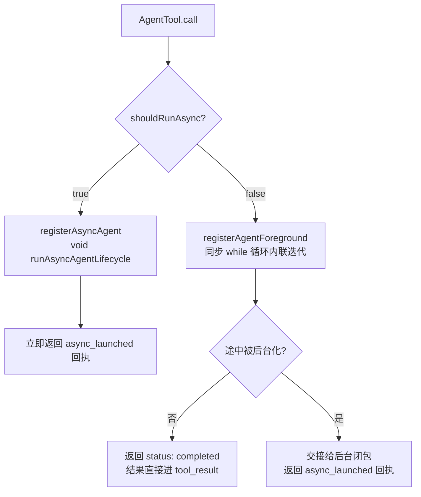
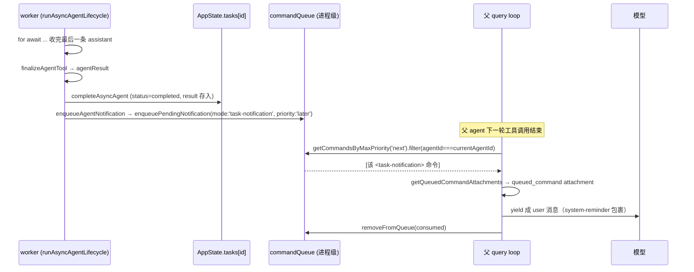
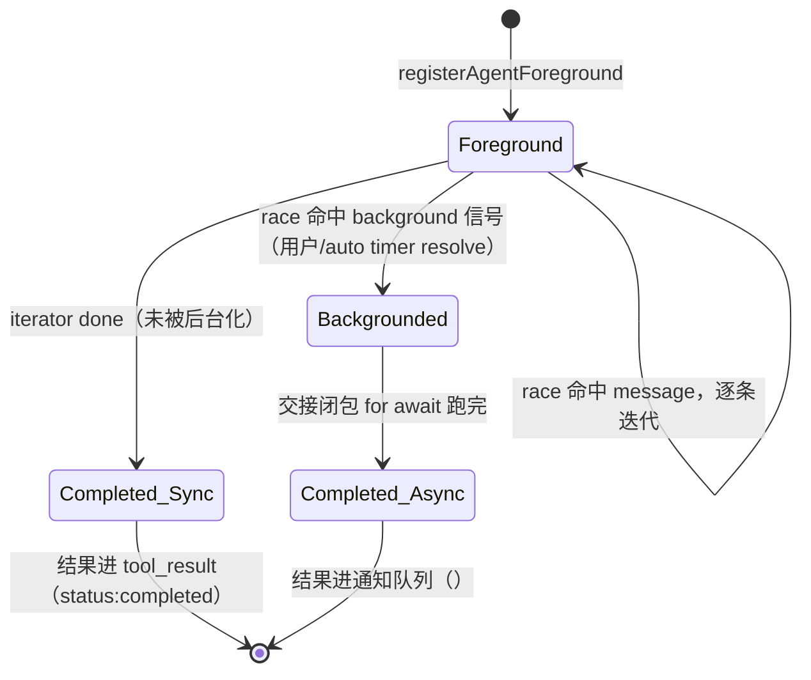
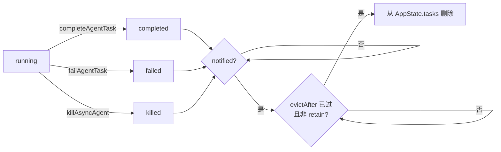
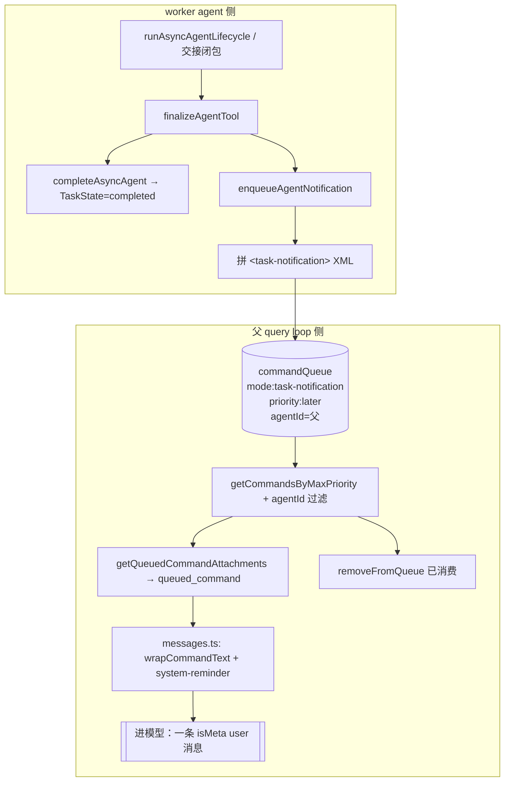

# 11 · 多 Agent：异步结果回注、通知队列与前后台切换

> 本篇覆盖：AgentTool 的同步/异步决策、异步 agent 生命周期、`<task-notification>` XML 拼装、进程级通知队列、父循环按 agentId 领取通知并转成 user attachment、前台执行与后台交接的 race、自动后台化、任务终态与逐出、Task 抽象的 kill 多态与 ID 前缀 ｜ 关键源文件：`src/tools/AgentTool/AgentTool.tsx`、`src/tools/AgentTool/agentToolUtils.ts`、`src/tasks/LocalAgentTask/LocalAgentTask.tsx`、`src/utils/task/framework.ts`、`src/utils/messageQueueManager.ts`、`src/query.ts`、`src/utils/attachments.ts`、`src/utils/messages.ts`、`src/Task.ts` ｜ 上一篇：10-multi-agent-isolation.md ｜ 下一篇：12-coordinator-teams-messaging.md

上一篇讲了子 agent 的隔离（tool pool、worktree、cwd override）。本篇讲隔离之后的第二个核心问题：**一个子 agent 跑完之后，它的结果怎么回到父 agent 的对话里去**。

Claude Code 的答案不是"父 agent await 子 agent"，而是一条更迂回、但对 agentic 系统更本质的路径：子 agent 把结果**写成一段 XML 字符串，塞进一个进程级的全局队列**；父 agent 在自己的 query loop 每一轮工具调用结束时**主动去队列里领取属于自己的通知**，把它当成一条新到达的 user 消息注入下一次推理。同步子 agent 是这套异步机制的一个退化特例——它甚至可以在运行途中"被后台化"，从阻塞父 turn 切换成异步回注。

理解这一篇的关键，是把三个东西分清楚：

- **task（TaskState）**：AppState 里的一条运行时记录，是 UI 与状态机的载体。
- **notification（`<task-notification>` 字符串）**：投递到队列里的一段文本，是"给模型看的东西"。
- **attachment（`queued_command`）**：父循环从队列领取后转成的一条 user 消息，是最终进 prompt 的形态。

三者一一映射但生命周期不同。下面逐个机制展开。

---

### 前后台决策：shouldRunAsync

- **触发 / 记录**：`AgentTool.call()` 在真正拉起子 agent 之前，先算一个布尔量 `shouldRunAsync`，决定这次 spawn 走"异步从头启动"还是"同步内联迭代"两条完全不同的代码路径。

```ts
const assistantForceAsync = feature('KAIROS') ? appState.kairosEnabled : false;
const shouldRunAsync = (run_in_background === true || selectedAgent.background === true || isCoordinator || forceAsync || assistantForceAsync || (proactiveModule?.isProactiveActive() ?? false)) && !isBackgroundTasksDisabled;
```
`src/tools/AgentTool/AgentTool.tsx:566-567`

触发异步的来源有六个，任一为真即异步（且 `CLAUDE_CODE_DISABLE_BACKGROUND_TASKS` 必须为假）：
1. `run_in_background === true` —— 模型在 tool input 里显式要求（schema 里的 `run_in_background` 字段）。
2. `selectedAgent.background === true` —— agent 定义 frontmatter 声明自己是后台型。
3. `isCoordinator` —— coordinator 模式下所有 spawn 强制异步（`CLAUDE_CODE_COORDINATOR_MODE`，见 `:553`）。
4. `forceAsync` —— fork-subagent 实验：为了统一成 `<task-notification>` 交互模型，**所有** spawn 都异步（`isForkSubagentEnabled()`，`:557`）。
5. `assistantForceAsync` —— KAIROS/assistant 模式：同步子 agent 会占住主循环的 turn，daemon 的 inputQueue 会堆积（注释见 `:559-566`）。
6. proactive 活跃。

- **使用 / 注入**：`shouldRunAsync` 之上还有一个更早算好的 `metadata.isAsync`（`:548`，`(run_in_background || selectedAgent.background) && !disabled`），它只进 analytics/`finalizeAgentTool`；真正的分叉是 `shouldRunAsync` 在 `:686` 的 `if (shouldRunAsync) { ... } else { ... }`。两条分支的返回值都被包成 tool 的 `data`——异步分支返回 `status: 'async_launched'`，同步分支返回 `status: 'completed'`。

- **为什么**：把"要不要阻塞父 turn"抽成一个布尔，让六种触发来源共用同一套下游生命周期代码（`runAsyncAgentLifecycle`）。注意其中三条（coordinator / forceAsync / assistantForceAsync）是**框架强制**而非模型选择——模型以为自己在同步调用一个子 agent，实际上拿回的是一张"回执"（`async_launched`），结果稍后才异步到达。这是整套异步回注机制能对模型透明的前提。

- **示例数据**（示例，据源码构造）：

| 场景 | run_in_background | selectedAgent.background | isCoordinator | forceAsync | ⇒ shouldRunAsync |
|---|---|---|---|---|---|
| 普通 REPL，模型直接调 | false | false | false | false | **false**（同步内联） |
| 模型勾了后台 | true | false | false | false | **true** |
| coordinator 模式 | false | false | true | false | **true**（强制） |
| fork-subagent 实验开 | false | false | false | true | **true**（全部强制） |



---

### 异步从头启动：registerAsyncAgent + void runAsyncAgentLifecycle

- **触发 / 记录**：`shouldRunAsync === true` 分支。先用早早生成的 `earlyAgentId`（`createAgentId()`，形如 `a` + 16 位 hex）注册一条 running 的 `local_agent` task，再 fire-and-forget 地启动生命周期，然后**立即**返回回执——不 await。

```ts
if (shouldRunAsync) {
  const asyncAgentId = earlyAgentId;
  const agentBackgroundTask = registerAsyncAgent({
    agentId: asyncAgentId,
    description, prompt, selectedAgent,
    setAppState: rootSetAppState,
    toolUseId: toolUseContext.toolUseId
  });
```
`src/tools/AgentTool/AgentTool.tsx:686-698`

```ts
  void runWithAgentContext(asyncAgentContext, () => wrapWithCwd(() => runAsyncAgentLifecycle({
    taskId: agentBackgroundTask.agentId,
    abortController: agentBackgroundTask.abortController!,
    makeStream: onCacheSafeParams => runAgent({ ...runAgentParams, override: { ... }, onCacheSafeParams }),
    ...
  })));
```
`src/tools/AgentTool/AgentTool.tsx:733-752`

`registerAsyncAgent` 里 task 一注册就是 `isBackgrounded: true`（注释直言"registerAsyncAgent immediately backgrounds"）：

```ts
    isBackgrounded: true,
    // registerAsyncAgent immediately backgrounds
    pendingMessages: [],
```
`src/tasks/LocalAgentTask/LocalAgentTask.tsx:499-501`

- **使用 / 注入**：`void` 之后紧接着的 `return`（`:754`）把回执交回 tool 框架。这个回执经 `outputSchema` 的 `asyncOutputSchema` 校验，字段为 `status/agentId/description/prompt/outputFile/canReadOutputFile`：

```ts
  return {
    data: {
      isAsync: true as const,
      status: 'async_launched' as const,
      agentId: agentBackgroundTask.agentId,
      description: description,
      prompt: prompt,
      outputFile: getTaskOutputPath(agentBackgroundTask.agentId),
      canReadOutputFile
    }
  };
```
`src/tools/AgentTool/AgentTool.tsx:754-764`

模型看到的 tool_result 就是这段回执——它拿到 `agentId` 和 `outputFile`（磁盘路径），可以（若 `canReadOutputFile`，即父 agent 持有 Read/Bash 工具）自己去轮询进度，但**结果不在这里**，结果稍后由通知队列送达。

若 spawn 时带了 `name`，会在 `registerAsyncAgent` 之后再写 `agentNameRegistry`（`name → agentId`），供 `SendMessage({to: name})` 路由（`:703-712`）。放在 register 之后，是为了 spawn 失败时不留下悬空条目。

- **为什么**：`void` + ALS 是这里的精髓。生命周期闭包在 `void` 触发的那一刻通过 `runWithAgentContext`（AsyncLocalStorage）捕获父 turn 的 workload/agent 上下文，之后所有 `await` 都自动继承这份上下文，且与父 turn 的 `finally` 隔离——父 turn 结束、tool 返回，都不会打断这个 detached 闭包。注释在 `:728-732` 明确写了这一点。abort controller **不**链到父 turn（`:694-695`：ESC 取消主线程不应杀掉后台 agent，后台 agent 只能被 `chat:killAgents` 显式杀）。

- **生命周期**：task 存活于 AppState（每会话进程），生命周期闭包存活于事件循环直到 agent 跑完。回执（tool_result）是每回合 query loop 的产物，一次性。

---

### runAsyncAgentLifecycle：流式回注、终态转换与通知入队

- **触发 / 记录**：这是所有后台 agent 的公共驱动函数（async-from-start 与 resume 共用，注释 `:504-507`）。它 `for await` 消费 `makeStream` 产出的每条 message，边收边做三件事：追加到 task.messages（仅当 UI 持有）、更新进度、发 SDK 进度事件。

```ts
    for await (const message of makeStream(onCacheSafeParams)) {
      agentMessages.push(message)
      // Append immediately when UI holds the task (retain). ...
      rootSetAppState(prev => {
        const t = prev.tasks[taskId]
        if (!isLocalAgentTask(t) || !t.retain) return prev
        const base = t.messages ?? []
        return { ...prev, tasks: { ...prev.tasks, [taskId]: { ...t, messages: [...base, message] } } }
      })
      updateProgressFromMessage(tracker, message, resolveActivity, toolUseContext.options.tools)
      updateAsyncAgentProgress(taskId, getProgressUpdate(tracker), rootSetAppState)
      ...
    }
```
`src/tools/AgentTool/agentToolUtils.ts:554-593`

流结束后是**关键的顺序**：先 `completeAsyncAgent`（把 task 标 completed，让阻塞在 `TaskOutput(block=true)` 上的读者立即解阻塞），**然后**才做可能挂起的润色（handoff 分类、worktree 清理），最后 `enqueueAgentNotification`：

```ts
    const agentResult = finalizeAgentTool(agentMessages, taskId, metadata)
    // Mark task completed FIRST so TaskOutput(block=true) unblocks
    // immediately. classifyHandoffIfNeeded (API call) and getWorktreeResult
    // (git exec) are notification embellishments that can hang ... (gh-20236).
    completeAsyncAgent(agentResult, rootSetAppState)
    let finalMessage = extractTextContent(agentResult.content, '\n')
    // ... handoff warning prepend ...
    const worktreeResult = await getWorktreeResult()
    enqueueAgentNotification({ taskId, description, status: 'completed', setAppState: rootSetAppState, finalMessage, usage: {...}, toolUseId: toolUseContext.toolUseId, ...worktreeResult })
```
`src/tools/AgentTool/agentToolUtils.ts:597-637`

- **使用 / 注入**：`completeAsyncAgent`（即 `completeAgentTask`）把 result 存进 TaskState 并转 completed；`enqueueAgentNotification` 才是把结果**推向模型**的那一步。两者职责分离——task 状态给 UI/轮询看，notification 给模型看。

- **为什么**：三个 catch 分支（AbortError→`killAsyncAgent`+killed 通知、其它 error→`failAsyncAgent`+failed 通知）都遵守"**先转终态，后清理**"的铁律，因为 handoff 分类要发 API、worktree 清理要跑 git，都可能 hang，绝不能让它们卡住状态转换（`gh-20236` 在注释里被反复引用）。AbortError 分支还额外调 `extractPartialResult(agentMessages)`（`:658`）把被杀前干到的东西塞进 killed 通知的 `finalMessage`——即便被中断，父 agent 也能看到半成品。

- **示例数据**——"worker 完成 → 通知队列 → 父循环 drain → 转成 user 消息"的时序：



- **生命周期**：`agentMessages` 数组随闭包存活；`finally` 里 `clearInvokedSkillsForAgent` + `clearDumpState` 清理进程级全局映射（`:682-685`），防止无界增长。

---

### finalizeAgentTool：从消息里榨出结果

- **触发 / 记录**：无论同步、后台、还是交接路径，收尾都调它，把一堆 `Message[]` 压成一个 `AgentToolResult`。核心是"取最后一条 assistant 的 text"，且带一个回退：若最后一条 assistant 是纯 tool_use（loop 中途退出），就往回找最近一条有 text 的 assistant。

```ts
  const lastAssistantMessage = getLastAssistantMessage(agentMessages)
  if (lastAssistantMessage === undefined) { throw new Error('No assistant messages found') }
  let content = lastAssistantMessage.message.content.filter(_ => _.type === 'text')
  if (content.length === 0) {
    for (let i = agentMessages.length - 1; i >= 0; i--) {
      const m = agentMessages[i]!
      if (m.type !== 'assistant') continue
      const textBlocks = m.message.content.filter(_ => _.type === 'text')
      if (textBlocks.length > 0) { content = textBlocks; break }
    }
  }
```
`src/tools/AgentTool/agentToolUtils.ts:297-317`

- **使用 / 注入**：返回的 `AgentToolResult`（`agentId/agentType/content/totalToolUseCount/totalDurationMs/totalTokens/usage`，schema 见 `:227-258`）有两个去向：同步路径下 `...agentResult` 直接 spread 进 tool_result 的 `data`（`:1257`）；异步路径下 `content` 经 `extractTextContent` 变成通知里的 `<result>`。

- **为什么**：子 agent 的"答案"约定就是它最后说的话。回退循环处理的是模型以一个 tool_use 收尾、text 在更早一条的情形——直接取 last 会拿到空 content。

- **示例数据**（示例，据源码构造，`AgentToolResult`）：

```json
{
  "agentId": "a1b2c3d4e5f60718",
  "agentType": "general-purpose",
  "content": [{ "type": "text", "text": "Found 3 call sites of parseConfig; all pass a string. Migration is safe." }],
  "totalToolUseCount": 7,
  "totalDurationMs": 41230,
  "totalTokens": 18422,
  "usage": {
    "input_tokens": 15012, "output_tokens": 640,
    "cache_creation_input_tokens": 2100, "cache_read_input_tokens": 11800,
    "server_tool_use": null, "service_tier": "standard", "cache_creation": null
  }
}
```

---

### enqueueAgentNotification 与 `<task-notification>` XML 拼装

- **触发 / 记录**：接上一步，这是把 `AgentToolResult` + status + usage 拼成一段 XML、投进队列的函数。开头有一个**原子去重**：读 `task.notified`，若已 true 直接返回，否则置 true 并放行——防止 `TaskStopTool` 与生命周期两条路径重复通知同一 task。

```ts
  let shouldEnqueue = false;
  updateTaskState<LocalAgentTaskState>(taskId, setAppState, task => {
    if (task.notified) { return task; }
    shouldEnqueue = true;
    return { ...task, notified: true };
  });
  if (!shouldEnqueue) { return; }
```
`src/tasks/LocalAgentTask/LocalAgentTask.tsx:227-240`

XML 拼装（各字段分别可选拼接）：

```ts
  const summary = status === 'completed' ? `Agent "${description}" completed` : status === 'failed' ? `Agent "${description}" failed: ${error || 'Unknown error'}` : `Agent "${description}" was stopped`;
  const outputPath = getTaskOutputPath(taskId);
  const toolUseIdLine = toolUseId ? `\n<${TOOL_USE_ID_TAG}>${toolUseId}</${TOOL_USE_ID_TAG}>` : '';
  const resultSection = finalMessage ? `\n<result>${finalMessage}</result>` : '';
  const usageSection = usage ? `\n<usage><total_tokens>${usage.totalTokens}</total_tokens><tool_uses>${usage.toolUses}</tool_uses><duration_ms>${usage.durationMs}</duration_ms></usage>` : '';
  const worktreeSection = worktreePath ? `\n<${WORKTREE_TAG}>...` : '';
  const message = `<${TASK_NOTIFICATION_TAG}>
<${TASK_ID_TAG}>${taskId}</${TASK_ID_TAG}>${toolUseIdLine}
<${OUTPUT_FILE_TAG}>${outputPath}</${OUTPUT_FILE_TAG}>
<${STATUS_TAG}>${status}</${STATUS_TAG}>
<${SUMMARY_TAG}>${summary}</${SUMMARY_TAG}>${resultSection}${usageSection}${worktreeSection}
</${TASK_NOTIFICATION_TAG}>`;
```
`src/tasks/LocalAgentTask/LocalAgentTask.tsx:246-257`

标签常量（`src/constants/xml.ts:28-38`）：`task-notification / task-id / tool-use-id / output-file / status / summary / worktree / worktreePath / worktreeBranch`。注意 `<usage>` 用的是**简化三元组** `total_tokens/tool_uses/duration_ms`（来自 `enqueueAgentNotification` 的 `usage` 入参），与 `AgentToolResult.usage`（完整 Anthropic usage schema）是**两套不同的形状**，别混。

- **使用 / 注入**：拼好的字符串交给 `enqueuePendingNotification({ value: message, mode: 'task-notification' })`（`:258-261`）。它此刻只是队列里一条 `mode:'task-notification'` 的命令；变成 prompt 是后面父循环 drain 的事。

- **为什么**：结果被序列化成**给模型看的自然语言 XML**而非结构化对象，因为它最终要作为 user 消息文本进模型上下文。`notified` 去重是幂等保证——多条终止路径（正常完成、TaskStop、kill、fail）可能都想通知，但每个 task 只应通知一次。

- **示例数据**——一段完整的 `<task-notification>`（completed，示例据 `:252-257` 与 XML 常量构造）：

```xml
<task-notification>
<task-id>a1b2c3d4e5f60718</task-id>
<tool-use-id>toolu_01F7cJ9k2mPqRs</tool-use-id>
<output-file>/home/user/.claude/tasks/a1b2c3d4e5f60718/output.log</output-file>
<status>completed</status>
<summary>Agent "audit parseConfig callers" completed</summary>
<result>Found 3 call sites of parseConfig; all pass a string. Migration is safe.</result>
<usage><total_tokens>18422</total_tokens><tool_uses>7</tool_uses><duration_ms>41230</duration_ms></usage>
</task-notification>
```

killed 时没有 `<usage>`、`<result>` 换成被杀前的 partial；failed 时 `<summary>` 带 `failed: <error>`。

---

### 通知队列：enqueuePendingNotification 与优先级

- **触发 / 记录**：`commandQueue` 是 `messageQueueManager.ts` 里一个**模块级、脱离 React 的进程全局单例**（`:53`）。所有命令——用户输入、任务通知、孤儿权限——都走它。`enqueuePendingNotification` 是任务通知的入口，默认优先级 `'later'`：

```ts
export function enqueuePendingNotification(command: QueuedCommand): void {
  commandQueue.push({ ...command, priority: command.priority ?? 'later' })
  notifySubscribers()
  ...
}
```
`src/utils/messageQueueManager.ts:142-149`

优先级三档 `now(0) > next(1) > later(2)`（`:151-155`），同档 FIFO。用户输入走 `enqueue` 默认 `'next'`（`:128-129`）。

- **使用 / 注入**：队列有两类消费者。React 侧通过 `useSyncExternalStore`（`subscribeToCommandQueue`）；非 React 侧（`print.ts` 流式循环、`query.ts` 父循环）直接 `getCommandQueue()` / `getCommandsByMaxPriority()` 读。task-notification 用 `'later'`，就是为了**永不饿死用户输入**——注释原文："defaults priority to 'later' so user input is never starved by system messages"（`:139-141`）。

- **为什么**：一个进程只有一条队列，被 coordinator、主线程、所有 in-process 子 agent 共享。区分不同接收者靠 `QueuedCommand.agentId`（见下一节 drain）。用一个全局队列 + 优先级 + agentId 过滤，替代了"每个 agent 一个 mailbox"的复杂度。

- **示例数据**——队列快照（示例，据 `QueuedCommand` 结构构造）：

| idx | mode | priority | agentId | value(截断) |
|---|---|---|---|---|
| 0 | prompt | next | undefined | "继续重构" |
| 1 | task-notification | later | undefined | `<task-notification>...a1b2...</task-notification>` |
| 2 | task-notification | later | t9f0e1 | `<task-notification>...给某 teammate...` |

主线程 drain 只会看到 idx 0/1（`agentId===undefined`），idx 2 留给那个 agentId 的 loop。

---

### 父循环 drain：只领本 agentId 的通知并转成 attachment

- **触发 / 记录**：`query.ts` 的工具循环里，每轮工具调用结束、准备算 attachments 时，从队列取一个"该我处理"的快照。**agent scoping** 是这里的灵魂：主线程只领 `agentId===undefined`，子 agent 只领 `mode==='task-notification' && agentId===currentAgentId`。

```ts
    const isMainThread = querySource.startsWith('repl_main_thread') || querySource === 'sdk'
    const currentAgentId = toolUseContext.agentId
    const queuedCommandsSnapshot = getCommandsByMaxPriority(sleepRan ? 'later' : 'next').filter(cmd => {
      if (isSlashCommand(cmd)) return false
      if (isMainThread) return cmd.agentId === undefined
      // Subagents only drain task-notifications addressed to them — never
      // user prompts, even if someone stamps an agentId on one.
      return cmd.mode === 'task-notification' && cmd.agentId === currentAgentId
    })
```
`src/query.ts:1566-1578`

`getCommandsByMaxPriority` 的阈值随本轮是否跑过 Sleep 而变：跑过 Sleep 才收 `'later'`（含 task-notification），否则只收 `'next'`（`:1570-1571`，注释 `:1550-1553` 解释 LocalShell 完成是 `'next'` 无需 Sleep，agent/workflow 仍是 `'later'` 靠 Sleep flush）。

- **使用 / 注入**：快照喂给 `getAttachmentMessages`（`:1580-1590`），内部 `getQueuedCommandAttachments` 过滤 `INLINE_NOTIFICATION_MODES = {'prompt','task-notification'}`（`attachments.ts:1044-1059`），把每条命令转成一个 `queued_command` attachment（`attachments.ts:1072-1080`）。这个 attachment 最终在 `messages.ts` 的 `case 'queued_command'` 里变成一条**被 `<system-reminder>` 包裹的 user 消息**，且因 `origin.kind==='task-notification'` 而 `isMeta:true`（对模型可见、对 UI 转录标记为 meta）：

```ts
    case 'queued_command': {
      const origin = attachment.origin ?? (attachment.commandMode === 'task-notification' ? { kind: 'task-notification' } : undefined)
      const metaProp = origin !== undefined || attachment.isMeta ? ({ isMeta: true } as const) : {}
      ...
      return wrapMessagesInSystemReminder([
        createUserMessage({ content: wrapCommandText(String(attachment.prompt), origin), ...metaProp, origin, uuid: attachment.source_uuid })
      ])
    }
```
`src/utils/messages.ts:3739-3795`

`wrapCommandText` 对 task-notification 加固定前缀：

```ts
    case 'task-notification':
      return `A background agent completed a task:\n${raw}`
```
`src/utils/messages.ts:5501-5502`

领取完，父循环只删**确实被消费**的那些命令（按 uuid），`removeFromQueue(consumedCommands)`（`query.ts:1632-1642`），并发 `notifyCommandLifecycle(uuid,'started')`。

- **为什么**：这套 agentId scoping 让一条全局队列安全地服务 N 个并发 agent——"每个 loop 只 drain 寄给自己的"（注释 `query.ts:1560-1564`）。用户 prompt（`mode:'prompt'`）永远只进主线程，子 agent 即便被人误盖 agentId 也拿不到用户 prompt。task-notification 走 `isMeta` 是因为它是系统事件而非人类发言，但仍需进模型上下文让父 agent 据此决策。

- **示例数据**——最终进模型的那条 user 消息（示例，据 `wrapCommandText` + `wrapMessagesInSystemReminder` 构造）：

```
<system-reminder>
A background agent completed a task:
<task-notification>
<task-id>a1b2c3d4e5f60718</task-id>
<tool-use-id>toolu_01F7cJ9k2mPqRs</tool-use-id>
<output-file>/home/user/.claude/tasks/a1b2c3d4e5f60718/output.log</output-file>
<status>completed</status>
<summary>Agent "audit parseConfig callers" completed</summary>
<result>Found 3 call sites of parseConfig; all pass a string. Migration is safe.</result>
<usage><total_tokens>18422</total_tokens><tool_uses>7</tool_uses><duration_ms>41230</duration_ms></usage>
</task-notification>
</system-reminder>
```

- **生命周期**：drain 发生在每轮工具循环（每回合 query loop）。队列本身是进程级；命令被消费即从队列删除，不落盘（落盘的是 task 的 output.log 与 sidechain JSONL）。

---

### 前台执行与后台交接：registerAgentForeground + Promise.race

- **触发 / 记录**：`shouldRunAsync === false` 分支（`:765` 起）。同步 agent 也**先注册成一个可被后台化的前台 task**，拿到一个 `backgroundSignal` promise；然后在 `while(true)` 里让"下一条 message"与"后台信号"赛跑。

```ts
        if (!isBackgroundTasksDisabled) {
          const registration = registerAgentForeground({ agentId: syncAgentId, description, prompt, selectedAgent, setAppState: rootSetAppState, toolUseId: toolUseContext.toolUseId, autoBackgroundMs: getAutoBackgroundMs() || undefined });
          foregroundTaskId = registration.taskId;
          backgroundPromise = registration.backgroundSignal.then(() => ({ type: 'background' as const }));
          cancelAutoBackground = registration.cancelAutoBackground;
        }
```
`src/tools/AgentTool/AgentTool.tsx:818-833`

race（注释强调 `backgroundPromise` 要在循环外建一次，否则每轮 `.then` 累积回调）：

```ts
            const nextMessagePromise = agentIterator.next();
            const raceResult = backgroundPromise ? await Promise.race([nextMessagePromise.then(r => ({ type: 'message' as const, result: r })), backgroundPromise]) : { type: 'message' as const, result: await nextMessagePromise };
```
`src/tools/AgentTool/AgentTool.tsx:885-892`

`backgroundSignal` 由 `registerAgentForeground` 建、存进模块级 `backgroundSignalResolvers` map（`LocalAgentTask.tsx:517-519, 573-577`）；`backgroundAgentTask(taskId,...)`（用户点"放到后台"）或自动后台化 timer 会 resolve 它。

- **使用 / 注入 / 交接**：一旦 race 出 `type:'background'` 且 task 确已 `isBackgrounded`，同步路径**当场把剩余执行交接给一个后台闭包**（同样 `void runWithAgentContext` + ALS 继承），并立刻返回一张 `async_launched` 回执——就像 async-from-start 那样：

```ts
            if (raceResult.type === 'background' && foregroundTaskId) {
              const task = appState.tasks[foregroundTaskId];
              if (isLocalAgentTask(task) && task.isBackgrounded) {
                const backgroundedTaskId = foregroundTaskId;
                wasBackgrounded = true;
                stopForegroundSummarization?.();
                void runWithAgentContext(syncAgentContext, async () => {
                  await Promise.race([agentIterator.return(undefined).catch(() => {}), sleep(1000)]);
                  // ... 用已有 agentMessages 初始化 tracker，继续 for await runAgent({...isAsync:true}) ...
```
`src/tools/AgentTool/AgentTool.tsx:897-940`

交接闭包的收尾与 `runAsyncAgentLifecycle` 一模一样：`finalizeAgentTool → completeAsyncAgent → enqueueAgentNotification`（`:951-991`），并返回 `async_launched`（`:1041-1051`）。若从未被后台化，`while` 正常跑到 `result.done`（`:1063`），走同步收尾，把结果**直接**放进 tool_result（`:1253-1260`，`status:'completed'`）——不经队列。

交接时 `agentIterator.return(undefined)` 加 1s 超时（`:918`）是为让前台 iterator 的 finally 跑起来（释放 MCP 连接等），但不让它 hang 住交接。前台若正常完成，`finally` 里 `unregisterAgentForeground` 把这条 foreground task 从 AppState 删掉（`:1162-1163`），并发一条纯 SDK 的 `task_notification` 事件（`:1167-1183`，走 `drainSdkEvents`，**不**触发模型 loop）。

- **为什么**：同步 agent 阻塞父 turn，但用户（或 auto-background timer）可能想把一个跑太久的同步 agent 转成后台。race 让"逐条推进"与"随时可中断切后台"共存于一个循环。交接后前后台各自持有独立的 summarization stop 函数（注释 `:904-905, 1156-1158`），互不干扰。同步完成走 tool_result、后台完成走队列——**同一个 agent，两种回注通道，由是否被后台化决定**。

- **图**——前后台状态机：



---

### 自动后台化：CLAUDE_AUTO_BACKGROUND_TASKS

- **触发 / 记录**：前台同步 agent 跑够 `autoBackgroundMs` 会被自动踢到后台。阈值来自 `getAutoBackgroundMs()`：env `CLAUDE_AUTO_BACKGROUND_TASKS` 或 GrowthBook gate 任一开启，返回 120000（2 分钟），否则 0（禁用）。

```ts
function getAutoBackgroundMs(): number {
  if (isEnvTruthy(process.env.CLAUDE_AUTO_BACKGROUND_TASKS) || getFeatureValue_CACHED_MAY_BE_STALE('tengu_auto_background_agents', false)) {
    return 120_000;
  }
  return 0;
}
```
`src/tools/AgentTool/AgentTool.tsx:72-77`

`registerAgentForeground` 拿到 `autoBackgroundMs` 后挂一个 `setTimeout`，到点把 task 标 `isBackgrounded:true` 并 resolve 那个 `backgroundSignal`：

```ts
  if (autoBackgroundMs !== undefined && autoBackgroundMs > 0) {
    const timer = setTimeout((setAppState, agentId) => {
      setAppState(prev => { /* ...isBackgrounded:true... */ });
      const resolver = backgroundSignalResolvers.get(agentId);
      if (resolver) { resolver(); backgroundSignalResolvers.delete(agentId); }
    }, autoBackgroundMs, setAppState, agentId);
    cancelAutoBackground = () => clearTimeout(timer);
  }
```
`src/tasks/LocalAgentTask/LocalAgentTask.tsx:582-608`

- **使用 / 注入**：timer resolve 的 `backgroundSignal` 正是上一节 race 的 `backgroundPromise` 源头——所以自动后台化与用户手动后台化走**完全相同**的交接路径。若 agent 在 timer 触发前就完成，`finally` 里 `cancelAutoBackground?.()`（`AgentTool.tsx:1196`）撤掉 timer。

- **为什么**：防止一个失控的同步子 agent 无限期占住父 turn。2 分钟是软上限，超时自动转异步、父 agent 拿回执继续干别的，结果稍后经通知队列到达。GB gate 用 `_CACHED_MAY_BE_STALE`（磁盘读，可能一会话陈旧），可接受——最坏是本会话按旧值走。

---

### 任务终态与逐出：complete / fail / kill、notified 去重、evictTerminalTask

- **触发 / 记录**：三个终态转换函数结构一致——只在 `status==='running'` 时转，调 `task.unregisterCleanup?.()`，设 `endTime` 与 `evictAfter`，清掉 `abortController/selectedAgent`：

```ts
export function completeAgentTask(result: AgentToolResult, setAppState: SetAppState): void {
  const taskId = result.agentId;
  updateTaskState<LocalAgentTaskState>(taskId, setAppState, task => {
    if (task.status !== 'running') { return task; }
    task.unregisterCleanup?.();
    return { ...task, status: 'completed', result, endTime: Date.now(), evictAfter: task.retain ? undefined : Date.now() + PANEL_GRACE_MS, abortController: undefined, unregisterCleanup: undefined, selectedAgent: undefined };
  });
  void evictTaskOutput(taskId);
}
```
`src/tasks/LocalAgentTask/LocalAgentTask.tsx:412-432`（`failAgentTask` `:437-456`、`killAsyncAgent` `:281-303` 同构）

`killAsyncAgent` 额外 `task.abortController?.abort()`。`evictAfter` 用 `PANEL_GRACE_MS = 30_000`（`framework.ts:28`）——终态后再留 30s 给 coordinator panel 显示，除非 UI 正 `retain`（则 `undefined`，永不过期）。

- **使用 / 注入**：逐出分两级。急切逐出 `evictTerminalTask`（`framework.ts:125-144`）在 notified 后立刻尝试删；懒逐出在 `generateTaskAttachments`（`:158-205`）里对 `notified && terminal` 的 task 加入 `evictedTaskIds`。两处都守 `notified===true` 且 `evictAfter` 已过：

```ts
    if (!isTerminalTaskStatus(task.status)) return prev
    if (!task.notified) return prev
    if ('retain' in task && (task.evictAfter ?? Infinity) > Date.now()) { return prev }
    const { [taskId]: _, ...remainingTasks } = prev.tasks
    return { ...prev, tasks: remainingTasks }
```
`src/utils/task/framework.ts:132-142`

关键：`generateTaskAttachments` **不**为 completed task 生成通知——注释 `:199-202` 说明每种 task 自己经 `enqueuePendingNotification` 通知，框架若也生成会造成双投递。框架的 `enqueueTaskNotification`（`:274-289`）只服务那些**不**自管通知的 task 类型（如 workflow）。

- **为什么**：`notified` 既是去重闩（`enqueueAgentNotification` 里原子 check-and-set），又是逐出前置条件——**没通知过的 task 绝不逐出**，保证结果一定到达模型后才回收内存。`retain`（UI 持有）压过一切逐出，让用户查看中的转录不被 GC。

- **图**——TaskState 状态与逐出：



---

### Task 抽象：ID 前缀与 kill 多态

- **触发 / 记录**：`local_agent` 只是七种 TaskType 之一（`Task.ts:6-13`）。`Task` 接口如今只保留一个多态方法 `kill`——注释直言 spawn/render 已不再多态调用，六个 kill 实现都只用 `setAppState`：

```ts
// What getTaskByType dispatches for: kill. spawn/render were never
// called polymorphically (removed in #22546). ...
export type Task = {
  name: string
  type: TaskType
  kill(taskId: string, setAppState: SetAppState): Promise<void>
}
```
`src/Task.ts:71-76`

`LocalAgentTask` 的实现就是委托给 `killAsyncAgent`：

```ts
export const LocalAgentTask: Task = {
  name: 'LocalAgentTask', type: 'local_agent',
  async kill(taskId, setAppState) { killAsyncAgent(taskId, setAppState); }
};
```
`src/tasks/LocalAgentTask/LocalAgentTask.tsx:270-276`

- **使用 / 注入**：task ID 前缀区分类型（`local_agent → 'a'`，`in_process_teammate → 't'`，`local_bash → 'b'` 等，`Task.ts:79-87`）。注意：**后台 agent 的 taskId 并非** `generateTaskId` 产的 base36 串，而是 `createAgentId()` 产的 `a` + 16 位 hex（`src/utils/uuid.ts:24-27`）——两者都以 `a` 开头，但 agent task 是完整 hex agentId，同时充当 `<task-id>`、`agentNameRegistry` 的值、磁盘 output 路径的 key。ESC 取消（coordinator）走 `killAllRunningAgentTasks`（`LocalAgentTask.tsx:309-315`）遍历所有 running 的 `local_agent` 逐个 `killAsyncAgent`。

- **为什么**：统一的 `Task` + `TaskState` 抽象让 `framework.ts` 的轮询、逐出、通知代码对所有 task 类型通用；类型差异收敛到 `kill` 多态与 ID 前缀。`#22546` 的收敛（去掉多态 spawn/render）说明这套抽象在演化中被有意瘦身——只保留真正需要按类型分派的行为。

- **示例数据**——一个存活的 `LocalAgentTaskState`（示例，据 `TaskStateBase` `Task.ts:45-57` + `LocalAgentTaskState` `LocalAgentTask.tsx:116-148` 构造）：

```jsonc
{
  // TaskStateBase
  "id": "a1b2c3d4e5f60718",
  "type": "local_agent",
  "status": "running",
  "description": "audit parseConfig callers",
  "toolUseId": "toolu_01F7cJ9k2mPqRs",
  "startTime": 1751600000000,
  "outputFile": "/home/user/.claude/tasks/a1b2c3d4e5f60718/output.log",
  "outputOffset": 0,
  "notified": false,
  // LocalAgentTaskState
  "agentId": "a1b2c3d4e5f60718",
  "prompt": "Find every call site of parseConfig and check the argument type.",
  "agentType": "general-purpose",
  "retrieved": false,
  "lastReportedToolCount": 0,
  "lastReportedTokenCount": 0,
  "isBackgrounded": true,   // async-from-start 一注册即 true
  "pendingMessages": [],    // SendMessage 中途注入、在 tool-round 边界 drain
  "retain": false,          // UI 是否持有：挡逐出、启用 stream-append
  "diskLoaded": false,
  "progress": { "toolUseCount": 3, "tokenCount": 9100, "summary": "grepping call sites" }
  // 终态时追加：endTime, result?/error?, evictAfter
}
```

---

## 收束：三层数据流一图



三个不变量收尾：

1. **先转终态、后润色**：`completeAsyncAgent` 永远早于 handoff 分类与 worktree 清理（`gh-20236`），保证阻塞读者与状态机不被可挂起的收尾拖住。
2. **notified 是唯一去重闩兼逐出前置**：只通知一次、且只在通知后才逐出——结果必达模型，内存才回收。
3. **agentId scoping 让一条全局队列服务 N 个 agent**：主线程领 `undefined`，子 agent 领本 id 的 task-notification，用户 prompt 永不外泄给子 agent。
