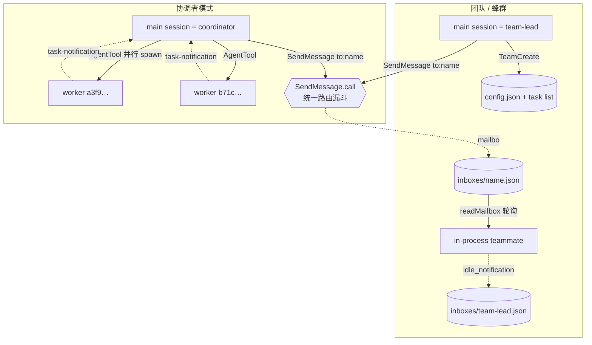
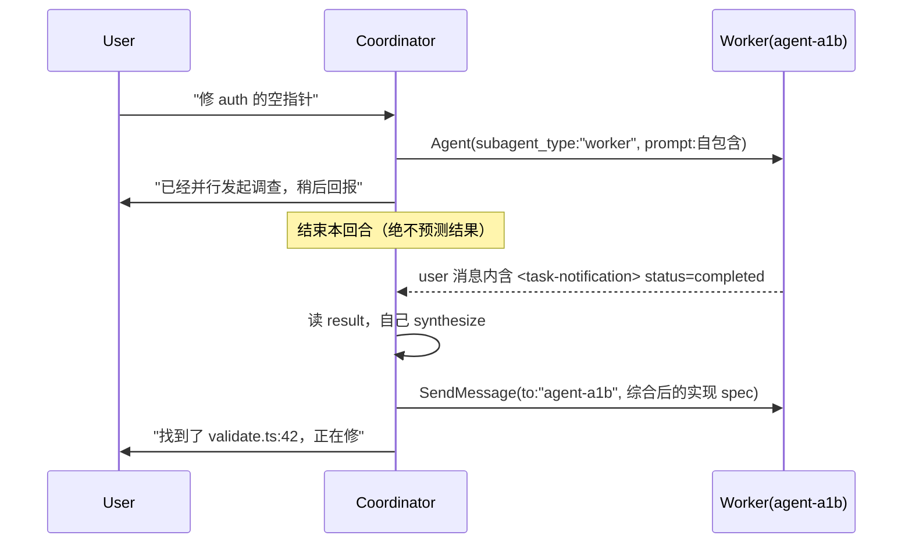
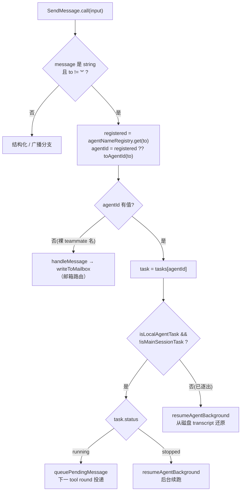
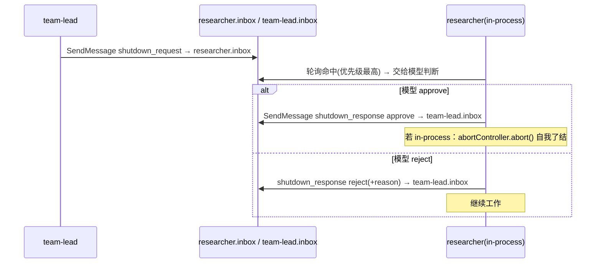
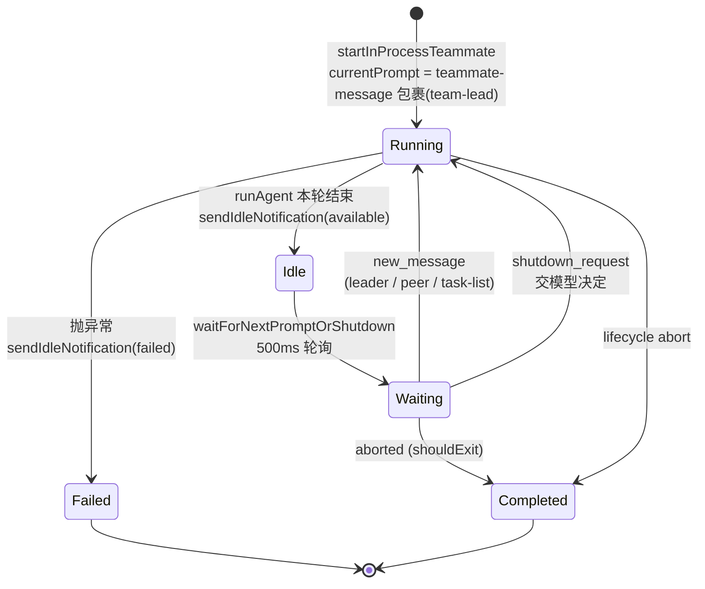

# 12 · 协调者模式、团队与 SendMessage 路由

> 本篇覆盖：协调者模式门（`isCoordinatorMode` / `matchSessionMode`）、协调者系统提示（角色 / 并行 / continue-vs-spawn / `<task-notification>` 交付）、worker 工具清单注入、`TeamCreate` 建队与 `teamContext` 播种、`SendMessage` 的统一路由决策（name→id→running/stopped/evicted、broadcast、mailbox 回退）、结构化消息（shutdown / plan_approval）、in-process teammate 的邮箱轮询循环与 idle 回报。 ｜ 关键源文件：`src/coordinator/coordinatorMode.ts`、`src/tools/TeamCreateTool/TeamCreateTool.ts`、`src/tools/SendMessageTool/SendMessageTool.ts`、`src/utils/swarm/inProcessRunner.ts`、`src/utils/teammateMailbox.ts`、`src/utils/agentId.ts` ｜ 上一篇：11-multi-agent-orchestration.md ｜ 下一篇：13-system-prompt-cache.md

---

## 先厘清：这里其实有两套协作模型

Claude Code 里"多个 agent 协作"落在两条互不相同、但被 `SendMessage` 缝合在一起的通路上。读代码前先把这张地图钉住，否则会把两套东西的行号读串。

| 维度 | 协调者模式（Coordinator） | 团队 / 蜂群（Swarm Team） |
|------|--------------------------|---------------------------|
| 开关 | `CLAUDE_CODE_COORDINATOR_MODE` + `feature('COORDINATOR_MODE')` | `isAgentSwarmsEnabled()` |
| 主体 | main session 扮演 coordinator | main session 扮演 `team-lead` |
| worker 是谁 | `AgentTool` 起的**异步后台 agent**（`LocalAgentTask`，同进程 fire-and-forget） | `TeamCreate` 建队后的 **in-process teammate**（`runInProcessTeammate`，也可以是 tmux 分屏的独立进程） |
| 结果如何回来 | worker 完成 → user-role 的 `<task-notification>` XML | teammate 通过**文件邮箱**写 `idle_notification` 到 leader 的 inbox |
| worker 间寻址 | `agentNameRegistry`（name → agentId）+ `tasks[agentId]` | `~/.claude/teams/{team}/inboxes/{name}.json` 文件邮箱 |
| `SendMessage` 走哪条 | `call` 的**前半段**：queue / resume | `call` 的**后半段**：`handleMessage` / `handleBroadcast` → `writeToMailbox` |

`SendMessage` 的 `call` 是一个"先试 in-process 路由，命不中再落到邮箱"的漏斗——这正是本篇的核心机制。



---

## 机制清单

### 协调者模式门 · isCoordinatorMode / matchSessionMode

- **触发 / 记录**：协调者模式不是配置项，而是一个**编译特性 + 环境变量**的双重门。所有分支（系统提示、user context、`AgentTool` 是否把 model 参数吞掉）都 live-读这个函数，没有缓存。

```ts
export function isCoordinatorMode(): boolean {
  if (feature('COORDINATOR_MODE')) {
    return isEnvTruthy(process.env.CLAUDE_CODE_COORDINATOR_MODE)
  }
  return false
}
```
`src/coordinator/coordinatorMode.ts:36`

- **使用 / 注入**：resume 一个旧会话时，磁盘上存着该会话当初的 mode。`matchSessionMode` 比对"当前进程的 mode"与"会话存的 mode"，不一致就**翻转 env 变量**（而不是报错退出），让 `isCoordinatorMode()` 立刻返回正确值，并返回一句面向用户的告警。

```ts
// Flip the env var — isCoordinatorMode() reads it live, no caching
if (sessionIsCoordinator) {
  process.env.CLAUDE_CODE_COORDINATOR_MODE = '1'
} else {
  delete process.env.CLAUDE_CODE_COORDINATOR_MODE
}
logEvent('tengu_coordinator_mode_switched', { to: sessionMode as … })
return sessionIsCoordinator
  ? 'Entered coordinator mode to match resumed session.'
  : 'Exited coordinator mode to match resumed session.'
```
`src/coordinator/coordinatorMode.ts:64`

- **为什么（设计意图）**：注释写得很直白——`isCoordinatorMode() reads it live, no caching`。选择"改 env 而非改内存状态"，是因为系统里散落着大量独立读点（`AgentTool.tsx:223`/`:553` 都直接 `isEnvTruthy(process.env.CLAUDE_CODE_COORDINATOR_MODE)`），env 是唯一对所有读点都可见的真源。resume 时保持模式一致，避免"协调者会话被当普通会话续起，系统提示全错"。

- **示例数据**：`matchSessionMode` 的判定表（据源码构造）

| currentIsCoordinator | sessionMode | 动作 | 返回 |
|---|---|---|---|
| false | `undefined` | 无（旧会话没存 mode） | `undefined` |
| false | `'coordinator'` | `process.env.…=‘1’` | `'Entered coordinator mode …'` |
| true | `'normal'` | `delete process.env.…` | `'Exited coordinator mode …'` |
| true | `'coordinator'` | 无 | `undefined` |

- **生命周期**：env 变量是**进程级**的；`isCoordinatorMode()` 每次调用重读，所以本回合内翻转即时生效。会话的 mode 落盘（供下次 resume 时 `matchSessionMode` 读取）。

---

### 协调者系统提示 · getCoordinatorSystemPrompt

- **触发 / 记录**：协调者模式下，主循环用这个函数产出的字符串**替换**默认系统提示。它把 coordinator 的行为契约（角色、工具、并行、continue-vs-spawn、结果格式）全部硬编码进 prompt。函数体第一件事是按 `CLAUDE_CODE_SIMPLE` 决定 worker 能力描述：

```ts
export function getCoordinatorSystemPrompt(): string {
  const workerCapabilities = isEnvTruthy(process.env.CLAUDE_CODE_SIMPLE)
    ? 'Workers have access to Bash, Read, and Edit tools, plus MCP tools from configured MCP servers.'
    : 'Workers have access to standard tools, MCP tools from configured MCP servers, and project skills via the Skill tool. Delegate skill invocations (e.g. /commit, /verify) to workers.'
  return `You are Claude Code, an AI assistant that orchestrates software engineering tasks across multiple workers.
  …`
```
`src/coordinator/coordinatorMode.ts:111`

- **使用 / 注入**：整段字符串作为**system prompt** 送入 API。其中几段是这套 agent 设计的"宪法条款"，值得逐条对照源码：
  - **结果如何进对话**——worker 结果以 **user-role 消息**回来，内含 `<task-notification>` XML；提示明确警告模型"它们长得像 user 消息但不是对话对象，永远别去感谢/回应它们"（`:126`、`:144`）。
  - **并行是超能力**（原文）：

```
**Parallelism is your superpower. Workers are async. Launch independent
workers concurrently whenever possible — don't serialize work that can run
simultaneously and look for opportunities to fan out. … To launch workers in
parallel, make multiple tool calls in a single message.**
```
`src/coordinator/coordinatorMode.ts:213`

  - **continue-vs-spawn 启发式**：完成研究后，coordinator 必须先自己 synthesize，再按"上下文重叠度"决定复用旧 worker（`SendMessage`）还是新起（`AgentTool`）：

```
| Situation | Mechanism | Why |
| Research explored exactly the files that need editing | Continue (SendMessage) | Worker already has the files …|
| Research was broad but implementation is narrow | Spawn fresh (Agent) | Avoid dragging along exploration noise …|
| Verifying code a different worker just wrote | Spawn fresh | Verifier should see the code with fresh eyes …|
```
`src/coordinator/coordinatorMode.ts:284`（表末总结一句 `High overlap -> continue. Low overlap -> spawn fresh.`）

- **为什么（设计意图）**：coordinator 不碰文件、只做编排与综合，所以系统提示把三件最容易做错的事写死在契约里：(1) 别把 worker 当对话对象（防止模型"谢谢 worker"式的浪费轮次）；(2) 默认并行、别串行（吞吐是 agentic 系统的核心指标）；(3) 综合是 coordinator 最重要的工作，禁止 `"based on your findings"` 式的懒委托（`:259`），因为那等于把"理解"再次外包给 worker。

- **task-notification 格式**（提示里给模型的契约，`:148`）：

```xml
<task-notification>
<task-id>{agentId}</task-id>
<status>completed|failed|killed</status>
<summary>{human-readable status summary}</summary>
<result>{agent's final text response}</result>
<usage>
  <total_tokens>N</total_tokens>
  <tool_uses>N</tool_uses>
  <duration_ms>N</duration_ms>
</usage>
</task-notification>
```
关键契约：`<task-id>` 就是 agentId，coordinator 要用它作为 `SendMessage({ to })` 去续这个 worker。



---

### worker 工具清单注入 · getCoordinatorUserContext

- **触发 / 记录**：coordinator 自己没有编辑工具，但它得知道"我派下去的 worker 手里有哪些工具/MCP/scratchpad"，才能写出合理的 spec。这段以 **user context** 形式注入（不是 system prompt），由 `QueryEngine` 传入 `scratchpadDir` 做依赖注入。

```ts
const workerTools = isEnvTruthy(process.env.CLAUDE_CODE_SIMPLE)
  ? [BASH_TOOL_NAME, FILE_READ_TOOL_NAME, FILE_EDIT_TOOL_NAME].sort().join(', ')
  : Array.from(ASYNC_AGENT_ALLOWED_TOOLS)
      .filter(name => !INTERNAL_WORKER_TOOLS.has(name))
      .sort().join(', ')
let content = `Workers spawned via the ${AGENT_TOOL_NAME} tool have access to these tools: ${workerTools}`
```
`src/coordinator/coordinatorMode.ts:88`

- **使用 / 注入**：返回 `{ workerToolsContext: content }`，作为 user-context 键值参与后续 prompt 组装。`INTERNAL_WORKER_TOOLS`（`TeamCreate`/`TeamDelete`/`SendMessage`/`SyntheticOutput`，`:29`）被过滤掉——这些是**编排层**工具，worker 不该看到，否则 coordinator 会误以为 worker 能自己发消息/建队。

- **为什么（设计意图）**：文件顶部注释解释了为何 scratchpad 门要在这里重复实现一遍——`importing filesystem.ts creates a circular dependency`（`:19`）。scratchpad 路径本身走 DI 从上层 `QueryEngine.ts` 传入，避免 `coordinatorMode` 反向依赖权限层。

- **示例数据**（据源码构造，非 SIMPLE 模式、带一个 MCP server、scratchpad 门开）：

```
Workers spawned via the Agent tool have access to these tools: Bash, Edit, Glob, Grep, Read, …

Workers also have access to MCP tools from connected MCP servers: github

Scratchpad directory: /home/lian/.../scratchpad
Workers can read and write here without permission prompts. Use this for durable cross-worker knowledge — structure files however fits the work.
```

---

### 建队与 teamContext 播种 · TeamCreateTool.call

- **触发 / 记录**：team-lead 调 `TeamCreate` 建队。第一步是**一队一 leader**的硬约束——已在带队就直接抛错，不允许一个 leader 同时管两队。

```ts
const appState = getAppState()
const existingTeam = appState.teamContext?.teamName
if (existingTeam) {
  throw new Error(
    `Already leading team "${existingTeam}". A leader can only manage one team at a time. Use TeamDelete to end the current team before creating a new one.`,
  )
}
```
`src/tools/TeamCreateTool/TeamCreateTool.ts:136`

  随后：名字冲突则 `generateUniqueTeamName` 换一个词 slug（不失败）；用 `formatAgentId(TEAM_LEAD_NAME, finalTeamName)` 生成**确定性** leader id（形如 `team-lead@my-project`）；把 leader 当成唯一初始成员写入磁盘 `config.json`（`TeamFile`），并 `registerTeamForSessionCleanup` 登记会话结束时清理。

- **使用 / 注入**：真正让"我在带队"这件事对全系统可见的是 `teamContext` 播种进 AppState：

```ts
setAppState(prev => ({
  ...prev,
  teamContext: {
    teamName: finalTeamName,
    teamFilePath,
    leadAgentId,
    teammates: {
      [leadAgentId]: {
        name: TEAM_LEAD_NAME,
        agentType: leadAgentType,
        color: assignTeammateColor(leadAgentId),
        tmuxSessionName: '',
        tmuxPaneId: '',
        cwd: getCwd(),
        spawnedAt: Date.now(),
      },
    },
  },
}))
```
`src/tools/TeamCreateTool/TeamCreateTool.ts:194`

  `SendMessage` 的 `handleBroadcast`/`handleMessage` 后续正是靠 `getTeamName(appState.teamContext)` 判断"我在不在团队上下文里"（不在就报错 `Not in a team context`，`SendMessageTool.ts:199`）。

- **为什么（设计意图）**：
  - **Team = Project = TaskList**：建队时 `resetTaskList(sanitizeName(name))` + `ensureTasksDir` + `setLeaderTeamName`，让任务编号从 1 重开，且 leader 的 `getTaskListId()` 落到与 tmux/iTerm2 teammate 一致的目录（`:182`–`:191` 注释解释了不这么做会写到 `getSessionId()` 的错目录）。
  - **leader 故意不设 `CLAUDE_CODE_AGENT_ID`**：尾部注释（`:224`）说明——leader 不是 teammate，`isTeammate()` 必须对它返回 false，否则会误触发 inbox 轮询；leader 的 id 是确定性的（`team-lead@teamName`），需要时现算即可。

- **示例数据**：`TeamCreate` 的 `Output` 与落盘后的 `TeamFile`（据 `TeamFile` 类型 + `call` 构造）

```jsonc
// tool result (Output)
{ "team_name": "my-project",
  "team_file_path": "~/.claude/teams/my-project/config.json",
  "lead_agent_id": "team-lead@my-project" }

// ~/.claude/teams/my-project/config.json  (TeamFile)
{ "name": "my-project",
  "description": "auth 重构",
  "createdAt": 1751600000000,
  "leadAgentId": "team-lead@my-project",
  "leadSessionId": "8f3a…",           // getSessionId()，用于团队发现
  "members": [
    { "agentId": "team-lead@my-project",
      "name": "team-lead",
      "agentType": "team-lead",
      "model": "claude-…",
      "joinedAt": 1751600000000,
      "tmuxPaneId": "",                 // in-process：空串
      "cwd": "/home/lian/Projects/…",
      "subscriptions": [] } ] }
```

- **生命周期**：`teamContext` 活在**会话进程内存**；`config.json` 落盘（供 teammate 进程/tmux 分屏发现）。会话结束由 `registerTeamForSessionCleanup` 触发清理——这是 gh-32730 修的"团队文件永远残留在磁盘"的 bug。

---

### 统一路由漏斗 · SendMessageTool.call

这是本篇的中枢。`SendMessage` 对 coordinator 和 team-lead 是同一个工具，`call` 内部按目标类型层层下探。先看 schema 与前置校验，再看路由。

- **触发 / 记录（schema & 校验）**：`to` 是"裸 teammate 名 / `*` 广播 / `uds:` / `bridge:`"之一；`message` 是纯文本或结构化消息（discriminated union）。`validateInput` 里有一条关键约束——**`to` 不能含 `@`**：

```ts
if (input.to.includes('@')) {
  return { result: false,
    message: 'to must be a bare teammate name or "*" — there is only one team per session',
    errorCode: 9 }
}
```
`src/tools/SendMessageTool/SendMessageTool.ts:623`

  这条约束是路由能成立的前提：`formatAgentId` 产出的 teammate id 形如 `researcher@my-project`（含 `@`），会在校验期被挡下；而 `AGENT_ID_PATTERN = /^a(?:.+-)?[0-9a-f]{16}$/`（`types/ids.ts:35`）不含 `@`。于是"能被 `toAgentId()` 认出的裸 id"只可能是**异步 worker 的 createAgentId**，绝不会是团队 teammate 名——这正是下面路由第二分支的安全基础。

- **使用 / 注入（路由决策）**：`call` 对"纯文本 + 非广播"的目标，先走 in-process/local-agent 路由：

```ts
if (typeof input.message === 'string' && input.to !== '*') {
  const appState = context.getAppState()
  const registered = appState.agentNameRegistry.get(input.to)
  const agentId = registered ?? toAgentId(input.to)
  if (agentId) {
    const task = appState.tasks[agentId]
    if (isLocalAgentTask(task) && !isMainSessionTask(task)) {
      if (task.status === 'running') {
        queuePendingMessage(agentId, input.message,
          context.setAppStateForTasks ?? context.setAppState)
        return { data: { success: true,
          message: `Message queued for delivery to ${input.to} at its next tool round.` } }
      }
      // task exists but stopped — auto-resume
      … resumeAgentBackground({ agentId, prompt: input.message, … })
    } else {
      // task evicted from state — try resume from disk transcript
      … resumeAgentBackground({ agentId, prompt: input.message, … })
    }
  }
}
```
`src/tools/SendMessageTool/SendMessageTool.ts:802`（name→id 解析在 `:804`；running→queue 在 `:810`；stopped→resume 在 `:824`；evicted→从磁盘 transcript resume 在 `:851`）

  三种落点：
  1. **running** → `queuePendingMessage`（LocalAgentTask.tsx:162，把消息推入 `task.pendingMessages`，worker 下一个 tool round 自取）。注意用的是 `setAppStateForTasks ?? setAppState`——in-process teammate 的 `setAppState` 是 no-op，必须走 `setAppStateForTasks` 才能触达根 store。
  2. **stopped**（task 还在但状态非 running）→ `resumeAgentBackground` 后台续跑，返回带 `outputFile` 路径。
  3. **evicted**（task 已被逐出 AppState）→ 仍尝试 `resumeAgentBackground`，它从磁盘 transcript 还原。注释（`:846`）点明此分支只会收到 registered name 或格式匹配的裸 id，teammate 名进不来。

  若 `agentId` 解析为 null（即 `to` 是团队 teammate 的裸名、不在 `agentNameRegistry` 里），漏斗落到**邮箱路由**：

```ts
if (typeof input.message === 'string') {
  if (input.to === '*') return handleBroadcast(input.message, input.summary, context)
  return handleMessage(input.to, input.message, input.summary, context)
}
```
`src/tools/SendMessageTool/SendMessageTool.ts:876`（broadcast 分派在 `:877`）

  `handleMessage`/`handleBroadcast` 最终都调 `writeToMailbox(recipientName, {from, text, summary, timestamp, color}, teamName)`，把消息写进收件人的 `inboxes/{name}.json`。broadcast 遍历 `teamFile.members`，跳过发送者自己（大小写不敏感比对）。

- **为什么（设计意图）**：一个工具、一个心智模型（"给 `to` 发消息"），底层却能覆盖两套完全不同的传输（内存 task 队列 vs 文件邮箱），关键靠 `@` 约束把两个命名空间**在类型层面隔开**，从而让 `registered ?? toAgentId(input.to)` 这一行既不会把 teammate 名误判成 worker id，也不会把 worker id 误投进邮箱。`isReadOnly` 也据此区分：纯文本消息只读，结构化消息（会改状态/触发关机）非只读（`:539`）。

- **示例数据 · 一个 tool_use input**（据 `inputSchema` 构造）：

```json
{
  "to": "auth-investigator",
  "summary": "Fix null pointer in validate.ts",
  "message": "Fix the null pointer in src/auth/validate.ts:42. Add a null check before accessing user.id — if null, return 401 'Session expired'. Commit and report the hash."
}
```

- **示例数据 · 一次路由 trace**（据 `call` 逻辑构造）：

```
to = "auth-investigator" ; message = string ; to != "*"
  agentNameRegistry.get("auth-investigator")  → "a3f9c1d84b0e5a72"   [registered]
  agentId = "a3f9c1d84b0e5a72"
  task = tasks["a3f9c1d84b0e5a72"]  → LocalAgentTask, 非 main-session
  task.status === "running"        → queuePendingMessage(agentId, message, setAppStateForTasks)
  return { success:true,
           message:'Message queued for delivery to auth-investigator at its next tool round.' }

# 若 task.status 为 "stopped":
  → resumeAgentBackground({ agentId, prompt:message, … })
  return { success:true,
           message:'Agent "auth-investigator" was stopped (stopped); resumed it in the background
                    with your message. You'll be notified when it finishes. Output: <outputFile>' }

# 若 to = "researcher"（团队 teammate 名，registry 无、toAgentId 返回 null）:
  agentId = null → 跳过 in-process 分支
  → handleMessage("researcher", message, summary) → writeToMailbox(...)
  return { success:true, message:"Message sent to researcher's inbox", routing:{…} }
```



- **生命周期**：queue 路径的 `pendingMessages` 活在 **AppState 的 task 内存**里，worker 每回合排空一次；resume 路径把 prompt 交给一次**新的后台 query 生命周期**；邮箱路径落**磁盘文件**，跨进程/跨 resume 存活直到被 `markMessageAsReadByIndex` 标记。

---

### 结构化消息 · shutdown / plan_approval

- **触发 / 记录**：`message` 除了纯文本，还可以是三种带 `type` 判别式的结构化消息（`StructuredMessage`，`SendMessageTool.ts:46`）：

```ts
z.discriminatedUnion('type', [
  z.object({ type: z.literal('shutdown_request'),  reason: z.string().optional() }),
  z.object({ type: z.literal('shutdown_response'), request_id: z.string(),
             approve: semanticBoolean(), reason: z.string().optional() }),
  z.object({ type: z.literal('plan_approval_response'), request_id: z.string(),
             approve: semanticBoolean(), feedback: z.string().optional() }),
])
```
`src/tools/SendMessageTool/SendMessageTool.ts:46`

  `call` 尾部按 `type` 分派（`:887`）：

```ts
switch (input.message.type) {
  case 'shutdown_request':
    return handleShutdownRequest(input.to, input.message.reason, context)
  case 'shutdown_response':
    if (input.message.approve) return handleShutdownApproval(input.message.request_id, context)
    return handleShutdownRejection(input.message.request_id, input.message.reason!)
  case 'plan_approval_response':
    if (input.message.approve)
      return handlePlanApproval(input.to, input.message.request_id, context)
    return handlePlanRejection(input.to, input.message.request_id,
      input.message.feedback ?? 'Plan needs revision', context)
}
```
`src/tools/SendMessageTool/SendMessageTool.ts:887`

- **使用 / 注入**：所有结构化消息最终也是 `writeToMailbox`，但 `text` 是 `jsonStringify(...)` 后的 JSON。收件端（`inProcessRunner`）在轮询时用 `isShutdownRequest(m.text)` / `isPermissionResponse(m.text)` 把 JSON 解回来做优先级调度。几条硬约束（`validateInput`）：
  - `shutdown_response` 只能发给 `TEAM_LEAD_NAME`（`:696`）；拒绝 shutdown 时 `reason` 必填（`:706`）。
  - 结构化消息**不能广播**（`to: "*"` 直接拒，`:678`），也**不能跨会话**（`bridge:`/`uds:` 只收纯文本，`:635`/`:685`）。
  - `plan_approval_response` 只有 team-lead 能发（`handlePlanApproval` 里 `isTeamLead` 断言，`:442`），且会把 leader 的 permission mode（`plan` 归一化成 `default`）通过 `permissionMode` 字段传给被批准者继承。

- **为什么（设计意图）**：shutdown 是**协商式**而非强制——leader 发 `shutdown_request`，teammate 的模型自己决定 approve/reject（`inProcessRunner` 明确"Does NOT auto-approve shutdown - the model should make that decision"，`:686`）。approve 时若是 in-process teammate，直接 `abortController.abort()` 结束自己（`SendMessageTool.ts:348`）。plan approval 让 leader 对 teammate 的计划做门禁，并把权限模式一并下放。

- **示例数据**（据 `createShutdown*Message` 与 handler 构造）：

```jsonc
// leader → teammate 的 shutdown_request（tool input）
{ "to": "researcher",
  "message": { "type": "shutdown_request", "reason": "需求变了，停掉当前方向" } }

// 落到 researcher inbox 的 text（jsonStringify 后）
{ "type": "shutdown_request",
  "requestId": "shutdown-1751600001234@researcher",
  "from": "team-lead",
  "reason": "需求变了，停掉当前方向",
  "timestamp": "2026-07-04T10:13:21.234Z" }

// teammate 批准（tool input） → 写入 team-lead inbox 的是 shutdown_approved
{ "to": "team-lead",
  "message": { "type": "shutdown_response",
               "request_id": "shutdown-1751600001234@researcher",
               "approve": true } }
```



---

### 成员消费邮箱 · readMailbox + waitForNextPromptOrShutdown

- **触发 / 记录**：in-process teammate 每完成一轮工作就进入**空闲轮询**，每 500ms 扫一次自己的邮箱和内存 pending 队列。轮询函数先查内存 `pendingUserMessages`（transcript 里手动注入的用户消息），再读磁盘邮箱：

```ts
const allMessages = await readMailbox(identity.agentName, identity.teamName)
// Scan all unread messages for shutdown requests (highest priority)
for (let i = 0; i < allMessages.length; i++) {
  const m = allMessages[i]
  if (m && !m.read) {
    const parsed = isShutdownRequest(m.text)
    if (parsed) { shutdownIndex = i; shutdownParsed = parsed; break }
  }
}
```
`src/utils/swarm/inProcessRunner.ts:763`（另一处 `readMailbox` 在权限回执轮询 `:394`）

  命中 shutdown 就立刻返回（`markMessageAsReadByIndex` 标读）；否则按**优先级挑选**：先找 `from === TEAM_LEAD_NAME` 的未读，找不到再退回 FIFO 第一条未读；两者都没有再 `tryClaimNextTask` 从团队任务表认领活干。

```ts
// leader 消息优先于 peer 消息（防饥饿）
for (let i = 0; i < allMessages.length; i++) {
  const m = allMessages[i]
  if (m && !m.read && m.from === TEAM_LEAD_NAME) { selectedIndex = i; break }
}
if (selectedIndex === -1) selectedIndex = allMessages.findIndex(m => !m.read)
```
`src/utils/swarm/inProcessRunner.ts:810`

- **使用 / 注入（变成什么 prompt）**：取到的消息回到 `runInProcessTeammate` 主循环，按来源包装：
  - `from === 'user'`（来自 `pendingUserMessages`）→ **纯文本** prompt，不加壳。
  - 其他 teammate/leader → 包成 `<teammate-message teammate_id=… color=… summary=…>…</teammate-message>`（`formatAsTeammateMessage`，`:457`），再作为 user 消息喂给 `runAgent`。
  - shutdown_request → 同样包成 `<teammate-message>`，交给模型自行决定 approve/reject。

```ts
currentPrompt = formatAsTeammateMessage(
  waitResult.from, waitResult.message, waitResult.color, waitResult.summary)
appendTeammateMessage(taskId, createUserMessage({ content: currentPrompt }), setAppState)
```
`src/utils/swarm/inProcessRunner.ts:1393`

- **为什么（设计意图）**：两级**防饥饿**优先级——shutdown 高于一切（防止 peer-to-peer 消息洪水淹没关机指令，`:768` 注释），leader 消息高于 peer 消息（leader 代表用户意图，不应被 peer 闲聊挤到后面，`:806` 注释）。用 `<teammate-message>` 壳统一 in-process 与 tmux teammate 看到的消息格式（`:454` 注释），让模型无论哪种后端都用同一心智解析。

- **示例数据**（researcher 邮箱 `inboxes/researcher.json`，`TeammateMessage[]`，据类型构造）：

```jsonc
[
  { "from": "team-lead", "text": "先扫 src/auth/ 找空指针来源，只读", "read": true,
    "color": "blue", "summary": "调查 auth 空指针", "timestamp": "2026-07-04T10:10:00.000Z" },
  { "from": "tester", "text": "我这边测试挂在 validate.test.ts:58", "read": false,
    "color": "green", "summary": "测试失败位置", "timestamp": "2026-07-04T10:12:30.000Z" },
  { "from": "team-lead", "text": "{\"type\":\"shutdown_request\", … }", "read": false,
    "color": "blue", "timestamp": "2026-07-04T10:13:21.234Z" }
]
```
轮询选择：跳过已读第 0 条 → 扫描发现第 2 条是 shutdown（最高优先级）→ 先处理它，**跳过**第 1 条 tester 的未读 peer 消息。

- **生命周期**：轮询循环活在 teammate 的**整个进程存续期**，`while (!abortController.signal.aborted)`，每 500ms 一次；邮箱文件跨进程共享，靠 `lockfile` 序列化并发写。

---

### 成员回报 leader · sendIdleNotification

- **触发 / 记录**：teammate 每次从 running → idle 的**转换点**（不是每次空闲）发一条 idle 通知给 leader。

```ts
async function sendIdleNotification(
  agentName, agentColor, teamName,
  options?: { idleReason?: 'available'|'interrupted'|'failed'; summary?; … },
): Promise<void> {
  const notification = createIdleNotification(agentName, options)
  await sendMessageToLeader(agentName, jsonStringify(notification), agentColor, teamName)
}
```
`src/utils/swarm/inProcessRunner.ts:566`

  主循环里的调用点用 `wasAlreadyIdle` 去重，避免重复通知；`summary` 取本轮最后一条 DM 的摘要（`getLastPeerDmSummary`）：

```ts
if (!wasAlreadyIdle) {
  await sendIdleNotification(identity.agentName, identity.color, identity.teamName, {
    idleReason: workWasAborted ? 'interrupted' : 'available',
    summary: getLastPeerDmSummary(allMessages),
  })
}
```
`src/utils/swarm/inProcessRunner.ts:1333`

- **使用 / 注入**：`createIdleNotification` 产出 `IdleNotificationMessage`（`type: 'idle_notification'`），`jsonStringify` 后写进 `team-lead` 的邮箱（`sendMessageToLeader` → `writeToMailbox(TEAM_LEAD_NAME, …)`, `:547`）。leader 侧轮询自己的邮箱、`isIdleNotification` 解回来，据此知道某成员空闲/失败，从而决定下一步派活。失败路径（`catch`）额外带 `completedStatus: 'failed'` 和 `failureReason`（`:1516`）。

- **为什么（设计意图）**：注释点明用 `agentName`（而非 agentId）以与进程型 teammate 一致（`:568`）。in-process teammate **不自动**把回答正文推给 leader（`:1328` 注释："We do NOT automatically send the teammate's response to the leader"），要通信必须显式 `SendMessage`——这刻意对齐进程型 teammate"输出对 leader 不可见"的语义，避免 leader 上下文被 teammate 的完整 scratchpad 淹没。

- **示例数据**（写入 `team-lead.inbox` 的 text，据 `IdleNotificationMessage` 构造）：

```jsonc
// 正常完成一轮
{ "type": "idle_notification", "from": "researcher",
  "timestamp": "2026-07-04T10:20:00.000Z",
  "idleReason": "available", "summary": "定位到 validate.ts:42 的空指针" }

// 失败
{ "type": "idle_notification", "from": "researcher",
  "timestamp": "2026-07-04T10:21:00.000Z",
  "idleReason": "failed", "completedStatus": "failed",
  "failureReason": "TypeError: cannot read property 'id' of undefined" }
```

---

### 常驻 teammate 生命周期 · runInProcessTeammate

- **触发 / 记录**：`startInProcessTeammate` fire-and-forget 拉起 `runInProcessTeammate`。它不是"跑完就退"，而是一个**常驻多轮循环**——`while (!aborted && !shouldExit)`：每轮把 `currentPrompt` 交给 `runAgent`（和普通 subagent 同一个 `runAgent`，内部再调 `query()`），跑完转 idle 发通知，再 `waitForNextPromptOrShutdown` 等下一条消息。

```ts
// 首条 prompt 包成 <teammate-message>，from=team-lead
let currentPrompt = formatAsTeammateMessage('team-lead', prompt, undefined, description)
while (!abortController.signal.aborted && !shouldExit) {
  const currentWorkAbortController = createAbortController()  // 每轮独立：Escape 只停当前轮
  …
  for await (const message of runAgent({ agentDefinition: iterationAgentDefinition,
    promptMessages, forkContextMessages, canUseTool: createInProcessCanUseTool(…),
    isAsync: true, override: { abortController: currentWorkAbortController }, … })) { … }
  …
  const waitResult = await waitForNextPromptOrShutdown(identity, abortController, …)
}
```
`src/utils/swarm/inProcessRunner.ts:883`（主循环 `:1048`）

- **使用 / 注入**：几个关键设计点：
  - **双 abortController**：lifecycle 级 `abortController` 杀整个 teammate；per-turn `currentWorkAbortController` 只停当前轮（对应 UI 的 Escape）。存进 task 状态供 UI 触发。
  - **teammate 系统提示** = 默认 system prompt + `TEAMMATE_SYSTEM_PROMPT_ADDENDUM`（+ 可选自定义 agent 提示），`permissionMode` 强制 `'default'`，即便 leader 在 plan 模式，teammate 也拿全工具（`:973` 注释）。
  - **强制注入团队工具**：无论自定义 agent 的 tools 列表怎么写，都并入 `SendMessage`/`TeamCreate`/`TeamDelete`/`Task*` 系列，保证 teammate 永远能回应 shutdown、发消息、动任务表（`:980`）。
  - **自动 compact**：`allMessages` 超过 `getAutoCompactThreshold` 就用**隔离的** toolUseContext 做 compact，避免污染主会话的 readFileState 缓存/UI 回调（`:1084`）。
  - **收尾**：正常退出把 task 置 `completed` 并 `emitTaskTerminatedSdk`；异常退出置 `failed` 并发失败 idle 通知；两者都 `evictTaskOutput` + `evictTerminalTask` 清理。

- **为什么（设计意图）**：与后台一次性 subagent 不同，teammate"活着并可多轮接活"（`:877` 注释），退出只发生在 abort 或模型批准 shutdown。这样 leader 能反复 `SendMessage` 复用同一个已加载上下文的 teammate（呼应协调者提示里的 continue-vs-spawn 权衡）。per-teammate 的 `contentReplacementState` 跨轮持久化（`:1043` 长注释），是为了让重复的 `runAgent` 调用产生一致的 wire 前缀、命中 prompt 缓存。

- **示例数据**：一轮消息如何进入 `runAgent`（据 `formatAsTeammateMessage` 构造）

```
# 首轮（来自 leader，带 description 当 summary）
<teammate-message teammate_id="team-lead" summary="调查 auth 空指针">
先扫 src/auth/ 找空指针来源，只读。报告文件路径与行号。
</teammate-message>

# 后续来自 tester 的 peer 消息
<teammate-message teammate_id="tester" color="green" summary="测试失败位置">
我这边测试挂在 validate.test.ts:58
</teammate-message>
```



- **生命周期**：teammate 循环 = 一个**长期存活的后台 promise**（可能持续数小时）；`allMessages` 在内存累积并按需 compact；task 状态镜像进 AppState（`appendCappedMessage` 有上限，防止 500 轮膨胀到几十 MB）；终态时 task 从 AppState 逐出、SDK bookend 关闭。resume：teammate 本身不跨会话 resume（它是进程内后台任务）；但被 `SendMessage` 打到的**异步 worker** 可从磁盘 transcript resume（见路由漏斗的 evicted 分支）。

---

## 小结：三层寻址

把整篇收敛成一句话——同一个 `SendMessage`，按目标落在三个命名空间：

1. **注册名 / createAgentId**（无 `@`）→ 内存 `tasks[agentId]` → queue（running）/ resume（stopped、evicted）。这是**协调者模式**的续跑通路。
2. **裸 teammate 名**（`agentNameRegistry` 无、`toAgentId` 返回 null）→ 文件邮箱 `inboxes/{name}.json` → teammate 轮询消费。这是**团队模式**的通路。
3. **`uds:` / `bridge:`**（`feature('UDS_INBOX')`）→ 跨会话/跨机 peer，只收纯文本，`bridge:` 还要过 `safetyCheck` 用户确认（`:585`，防跨机 prompt 注入）。

`@` 约束 + `AGENT_ID_PATTERN` 的互斥，是让这三层在一个工具里安全共存的类型学基础。
