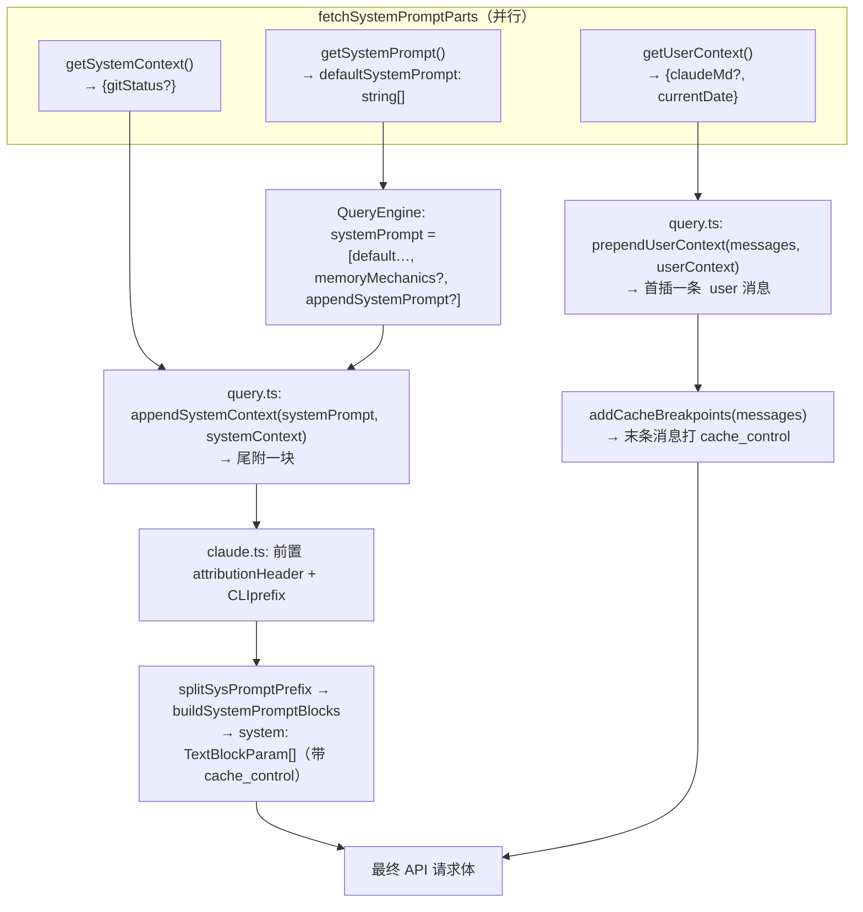
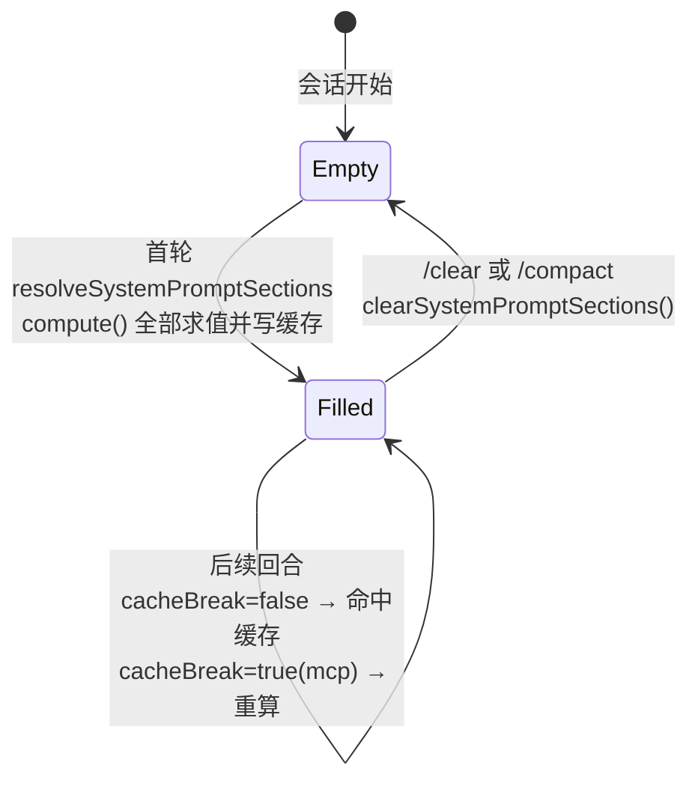
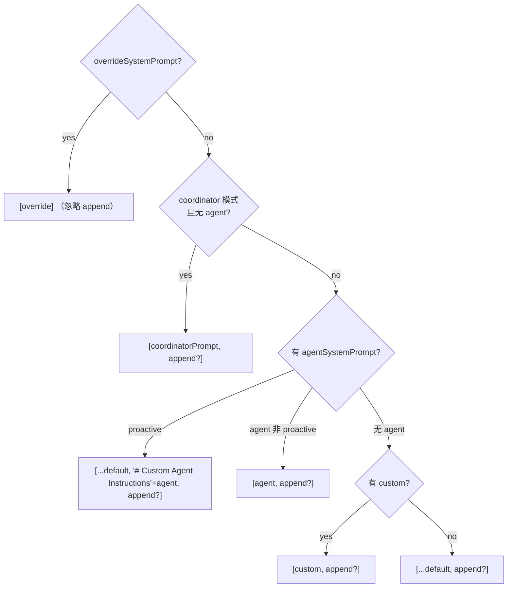
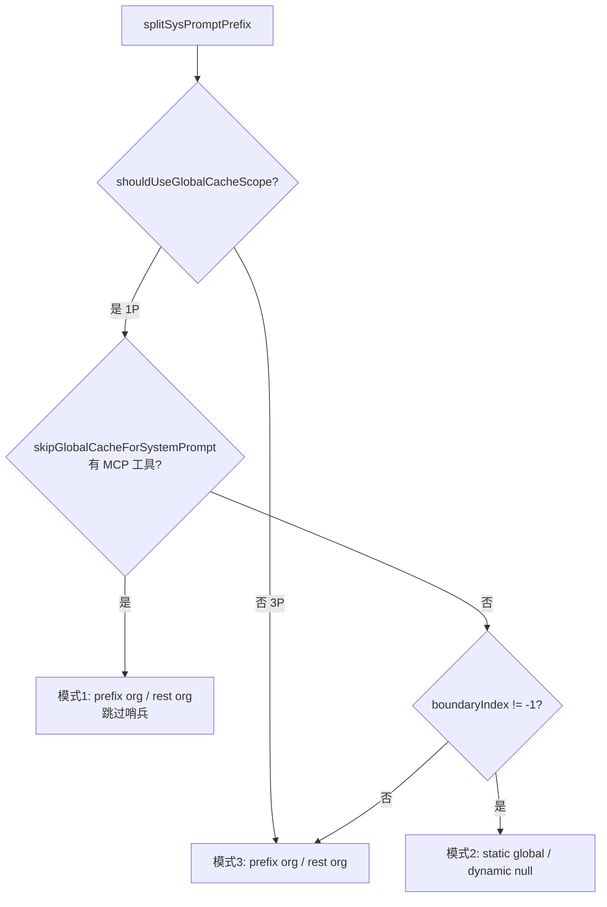
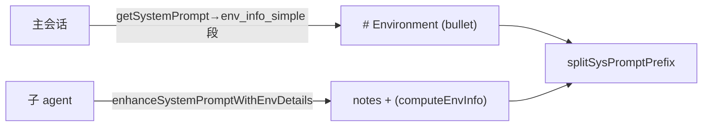
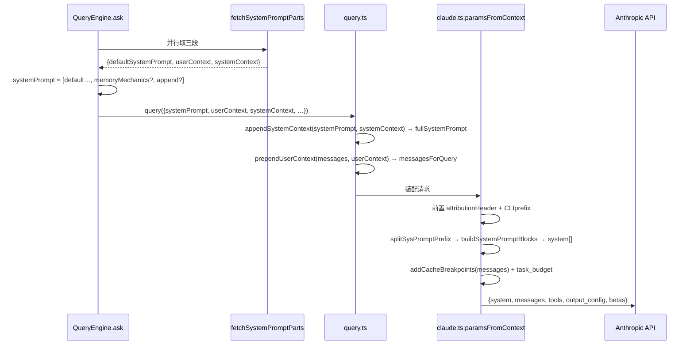

# 13 · 系统提示词组装与三段可缓存前缀

本篇覆盖：`fetchSystemPromptParts` 三段并行取数 ｜ `getSystemPrompt` 静态段+边界哨兵+动态段的有序数组 ｜ `systemPromptSection` / `DANGEROUS_uncachedSystemPromptSection` / `resolveSystemPromptSections` 分段缓存注册表 ｜ `SYSTEM_PROMPT_DYNAMIC_BOUNDARY` 静/动分界 ｜ `computeEnvInfo` / `computeSimpleEnvInfo` 与 `<env>` 块（含 `getKnowledgeCutoff` / `getShellInfoLine` / `getUnameSR`）｜ `buildEffectiveSystemPrompt` 五级优先级 ｜ `getCLISyspromptPrefix` / `getAttributionHeader` 两个可识别前缀块 ｜ `splitSysPromptPrefix` 按内容切块打 `cacheScope` ｜ `buildSystemPromptBlocks` / `getCacheControl` 落成 `TextBlockParam[]` ｜ `appendSystemContext` / `prependUserContext` ｜ `enhanceSystemPromptWithEnvDetails` 子 agent 路径 ｜ 最终请求装配 `addCacheBreakpoints` 与 `output_config.task_budget`
关键源文件：`src/utils/queryContext.ts`、`src/constants/prompts.ts`、`src/constants/systemPromptSections.ts`、`src/utils/systemPrompt.ts`、`src/utils/api.ts`、`src/constants/system.ts`、`src/services/api/claude.ts`、`src/context.ts`
上一篇：12-coordinator-teams-messaging.md ｜ 下一篇：14-claudemd-nested-memory.md

---

## 本节的两个"三"，先分清

"三段可缓存前缀"里的"三段"有一个明确出处——`queryContext.ts` 顶部注释直白写明：构建 API cache-key 前缀的三块内容是 **systemPrompt、userContext、systemContext**。这是逻辑意义上的"三段":

1. **systemPrompt**（`getSystemPrompt` 产出的字符串数组）——静态人格 + 指令 + 环境 + 动态开关；
2. **userContext**（`getUserContext`）——CLAUDE.md、当前日期，最终变成一条 `<system-reminder>` **user 消息**；
3. **systemContext**（`getSystemContext`）——git status 等，最终**尾附到 systemPrompt 数组末尾**。

而"可缓存"的实现意义上，systemPrompt 这一段本身在发往 API 前又会被 `splitSysPromptPrefix` 按内容切成 **attribution header / CLI prefix / static / dynamic** 若干块，每块打上不同的 `cacheScope`（`null` / `'org'` / `'global'`），由 `SYSTEM_PROMPT_DYNAMIC_BOUNDARY` 哨兵一分为二。所以真正落到 API `system` 字段上的是几个带 `cache_control` 的 `TextBlockParam`。

本篇先讲逻辑三段的取数与装配，再讲物理切块与打标，最后讲请求收口。



---

### fetchSystemPromptParts — 三段并行取数

- **触发 / 记录**：`QueryEngine.ask()`（SDK/print 路径）和 `buildSideQuestionFallbackParams`（resume 时的 side_question 回退）在开一轮 query 前调用它，一次 `Promise.all` 并行取回三段。

```ts
export async function fetchSystemPromptParts({
  tools, mainLoopModel, additionalWorkingDirectories, mcpClients, customSystemPrompt,
}: { … }): Promise<{
  defaultSystemPrompt: string[]
  userContext: { [k: string]: string }
  systemContext: { [k: string]: string }
}> {
  const [defaultSystemPrompt, userContext, systemContext] = await Promise.all([
    customSystemPrompt !== undefined
      ? Promise.resolve([])
      : getSystemPrompt(tools, mainLoopModel, additionalWorkingDirectories, mcpClients),
    getUserContext(),
    customSystemPrompt !== undefined ? Promise.resolve({}) : getSystemContext(),
  ])
  return { defaultSystemPrompt, userContext, systemContext }
}
```
`src/utils/queryContext.ts:44`（`Promise.all` 在 `:61`）

- **使用 / 注入**：调用方（`QueryEngine.ts:288`）拿到三段后各走各的路：`defaultSystemPrompt` 拼进 `systemPrompt` 数组（`QueryEngine.ts:321`），`userContext` 与 coordinator userContext 合并后交给 `prependUserContext`，`systemContext` 交给 `appendSystemContext`。三者在下游三个不同位置注入，见后文各小节。

- **为什么（设计意图）**：三段都是**每会话稳定、不随单条用户输入变化**的内容——正因如此它们才配得上"cache-key 前缀"这个名字（注释：`the three context pieces that form the API cache-key prefix`）。`getUserContext` / `getSystemContext` 本身是 `memoize` 的（`context.ts:155` / `:116`），进程内只算一次。并行取数是因为三者互不依赖，且 `getSystemContext` 里的 git status 是有 I/O 开销的子进程调用。另一个关键点：`customSystemPrompt !== undefined` 时**跳过** `getSystemPrompt` 和 `getSystemContext`——自定义 prompt 会整体替换默认 prompt，把 systemContext 追加到一个根本没被用的默认 prompt 上没有意义（注释 `:35-38`）。

- **示例数据**（示例，据源码构造）：

```jsonc
// fetchSystemPromptParts 返回（非 custom-prompt 的常规会话）
{
  "defaultSystemPrompt": [
    "\nYou are an interactive agent that helps users with software engineering tasks. …",
    "# System\n - All text you output outside of tool use …",
    "# Doing tasks\n - The user will primarily request …",
    "# Executing actions with care\n\nCarefully consider …",
    "# Using your tools\n - Do NOT use the Bash …",
    "# Tone and style\n - Only use emojis if …",
    "# Output efficiency\n\nIMPORTANT: Go straight to the point. …",
    "__SYSTEM_PROMPT_DYNAMIC_BOUNDARY__",        // 边界哨兵
    "# Session-specific guidance\n - …",          // 以下为动态段
    "# Environment\nYou have been invoked …",
    "# Scratchpad Directory\n\nIMPORTANT: …"
  ],
  "userContext":   { "currentDate": "Today's date is 2026-07-04." },
  "systemContext": { "gitStatus":   "This is the git status at the start of the conversation. …" }
}
```

- **生命周期**：三段都是**每会话**语义（`memoize` + section 缓存），一轮轮 query 复用；`/clear`、`/compact` 会清 section 缓存（见下文 `clearSystemPromptSections`）。`buildSideQuestionFallbackParams`（`:88`）在 resume 且尚无 stopHooks 快照时重建同样的前缀，尽量命中缓存，但注释坦承：若主循环叠加了它不知道的 extra（coordinator、memory-mechanics），可能 miss——这是可接受的降级。

---

### getSystemPrompt — 静态段 + 边界 + 动态段的有序数组

- **触发 / 记录**：`fetchSystemPromptParts` 里唯一构建默认 prompt 的入口。返回一个**有序 `string[]`**，顺序即缓存分区的物理顺序：先全部静态段，中间插入边界哨兵，最后全部动态段。

```ts
return [
  // --- Static content (cacheable) ---
  getSimpleIntroSection(outputStyleConfig),
  getSimpleSystemSection(),
  outputStyleConfig === null || outputStyleConfig.keepCodingInstructions === true
    ? getSimpleDoingTasksSection() : null,
  getActionsSection(),
  getUsingYourToolsSection(enabledTools),
  getSimpleToneAndStyleSection(),
  getOutputEfficiencySection(),
  // === BOUNDARY MARKER - DO NOT MOVE OR REMOVE ===
  ...(shouldUseGlobalCacheScope() ? [SYSTEM_PROMPT_DYNAMIC_BOUNDARY] : []),
  // --- Dynamic content (registry-managed) ---
  ...resolvedDynamicSections,
].filter(s => s !== null)
```
`src/constants/prompts.ts:560`（边界推入点 `:573`）

- **使用 / 注入**：整段数组即 `defaultSystemPrompt`，被 `QueryEngine` 拼成 `systemPrompt`（`asSystemPrompt([...defaultSystemPrompt, memoryMechanics?, appendSystemPrompt?])`，`QueryEngine.ts:321`），最终成为 API `system` 字段的主体。数组的**元素顺序 = 缓存块的切分依据**：`splitSysPromptPrefix` 用哨兵在数组中的下标（`boundaryIndex`）判断某个 block 是静态还是动态。

- **为什么（设计意图）**：把 prompt 拆成"静态区 + 哨兵 + 动态区"是整套缓存策略的地基。静态区对所有 Claude Code 用户**逐字节相同**（人格、`# System`、`# Doing tasks`、`# Executing actions with care`、`# Using your tools`、`# Tone and style`、`# Output efficiency`），因此可以打 `scope:'global'` 做**跨 org 共享缓存**；动态区含会话/用户特定内容（env、CLAUDE.md 派生、MCP 指令、session guidance 等），不能全局缓存。注意两条早退分支：`CLAUDE_CODE_SIMPLE` 时只返回一个极简块（`:450`），proactive/KAIROS 时走另一套 simple-proactive 组装（`:471`）。还要注意 `getSessionSpecificGuidanceSection` 的注释（`:343-351`）——它专门被挪到动态区，因为其内容依赖 `getIsNonInteractiveSession()` 等运行时 bit，若放在静态区会让 Blake2b 前缀哈希分裂成 2^N 个变体。

- **示例数据**（示例，据源码构造）：静态区第一块 `getSimpleIntroSection` 的原文首行——

```text
You are an interactive agent that helps users with software engineering tasks. Use the instructions below and the tools available to you to assist the user.

IMPORTANT: Assist with authorized security testing, defensive security, CTF challenges, and educational contexts. Refuse requests for destructive techniques, DoS attacks, mass targeting, supply chain compromise, or detection evasion for malicious purposes. Dual-use security tools (C2 frameworks, credential testing, exploit development) require clear authorization context: pentesting engagements, CTF competitions, security research, or defensive use cases.
IMPORTANT: You must NEVER generate or guess URLs for the user unless you are confident that the URLs are for helping the user with programming. …
```
（`${CYBER_RISK_INSTRUCTION}` 是模板插值，展开为常量 `CYBER_RISK_INSTRUCTION` 的实际正文——不是字面 `<CYBER_RISK_INSTRUCTION>` 标签；该常量定义于 `src/constants/cyberRiskInstruction.ts`。）

- **生命周期**：**每会话**构建一次（`memoize` 不在 `getSystemPrompt` 上，但其动态段走 section 缓存，静态段是纯函数）。

```mermaid
flowchart LR
  subgraph static["静态区 (index < boundary) → scope:global"]
    s1[intro] --> s2[# System] --> s3[# Doing tasks] --> s4[# Executing actions] --> s5[# Using your tools] --> s6[# Tone and style] --> s7[# Output efficiency]
  end
  s7 --> BND{{SYSTEM_PROMPT_DYNAMIC_BOUNDARY}}
  subgraph dyn["动态区 (index > boundary) → scope:null (不缓存)"]
    d1[session_guidance] --> d2[memory] --> d3[env_info_simple] --> d4[language] --> d5[output_style] --> d6[mcp_instructions] --> d7[scratchpad] --> d8[frc / summarize / …]
  end
  BND --> d1
```



---

### systemPromptSection / DANGEROUS_uncachedSystemPromptSection / resolveSystemPromptSections — 分段缓存注册表

- **触发 / 记录**：动态区的每一段不是直接求值，而是先注册成一个 `SystemPromptSection`（`{name, compute, cacheBreak}`），由 `resolveSystemPromptSections` 统一解析。`getSystemPrompt` 里 `dynamicSections` 数组（`prompts.ts:491-555`）把每个动态段包成 section：

```ts
const dynamicSections = [
  systemPromptSection('session_guidance', () => getSessionSpecificGuidanceSection(enabledTools, skillToolCommands)),
  systemPromptSection('memory', () => loadMemoryPrompt()),
  systemPromptSection('ant_model_override', () => getAntModelOverrideSection()),
  systemPromptSection('env_info_simple', () => computeSimpleEnvInfo(model, additionalWorkingDirectories)),
  systemPromptSection('language', () => getLanguageSection(settings.language)),
  systemPromptSection('output_style', () => getOutputStyleSection(outputStyleConfig)),
  DANGEROUS_uncachedSystemPromptSection(
    'mcp_instructions',
    () => isMcpInstructionsDeltaEnabled() ? null : getMcpInstructionsSection(mcpClients),
    'MCP servers connect/disconnect between turns',   // 必填 reason
  ),
  systemPromptSection('scratchpad', () => getScratchpadInstructions()),
  systemPromptSection('frc', () => getFunctionResultClearingSection(model)),
  systemPromptSection('summarize_tool_results', () => SUMMARIZE_TOOL_RESULTS_SECTION),
  …
]
const resolvedDynamicSections = await resolveSystemPromptSections(dynamicSections)
```
`src/constants/prompts.ts:491`

两种构造器的差别只在 `cacheBreak` 标志：

```ts
export function systemPromptSection(name, compute): SystemPromptSection {
  return { name, compute, cacheBreak: false }        // 缓存到 /clear 或 /compact
}
export function DANGEROUS_uncachedSystemPromptSection(name, compute, _reason): SystemPromptSection {
  return { name, compute, cacheBreak: true }         // 每回合重算，会破坏 prompt 缓存
}
```
`src/constants/systemPromptSections.ts:20` 与 `:32`

- **使用 / 注入**：`resolveSystemPromptSections` 是消费点——按 `name` 命中 section 级缓存则直接取值，否则 `compute()` 并回写缓存：

```ts
export async function resolveSystemPromptSections(sections): Promise<(string | null)[]> {
  const cache = getSystemPromptSectionCache()
  return Promise.all(sections.map(async s => {
    if (!s.cacheBreak && cache.has(s.name)) {
      return cache.get(s.name) ?? null      // 命中：跳过 compute
    }
    const value = await s.compute()
    setSystemPromptSectionCacheEntry(s.name, value)
    return value
  }))
}
```
`src/constants/systemPromptSections.ts:43`

- **为什么（设计意图）**：动态段虽然"动态"，但绝大多数**在一次会话内其实不变**（scratchpad 路径、language、output style、memory 快照）。用一个按 `name` key 的缓存把它们钉住，就能让整段 dynamic 内容跨回合保持逐字节稳定，从而让下游（tools 块 / 末条消息的 org 级 cache breakpoint）持续命中。真正每回合会变、必须重算的只有 `mcp_instructions`——因为 MCP server 会在回合之间连接/断开（这正是 `_reason` 参数强制要写理由的用意：把"破坏缓存"变成一个需要显式论证的决定）。注意 `mcp_instructions` 的 gate check 被刻意放进 `compute` **内部**（`isMcpInstructionsDeltaEnabled()` 在闭包里），而不是在两个 section 变体之间做选择——这样中途 gate 翻转不会读到过期缓存值（`prompts.ts:511-513`）。反例可看 `token_budget`（`:538-549`）的注释：它曾是 `DANGEROUS_uncached`（随 `getCurrentTurnTokenBudget()` 翻转），每次预算变动 bust 掉约 20K token，后来改成无条件缓存的措辞。

- **示例数据**（示例，据源码构造）：section 缓存内容——

```jsonc
// getSystemPromptSectionCache() 的快照
{
  "session_guidance": "# Session-specific guidance\n - If you do not understand …",
  "memory":           null,                       // 无 memory 文件时为 null
  "ant_model_override": null,
  "env_info_simple":  "# Environment\nYou have been invoked …",
  "language":         null,
  "output_style":     null,
  "mcp_instructions": null,                        // cacheBreak:true，每回合重写此项
  "scratchpad":       "# Scratchpad Directory\n\nIMPORTANT: Always use …",
  "frc":              null,
  "summarize_tool_results": "When working with tool results, write down …"
}
```

- **生命周期**：**每会话/进程**级缓存，`resolveSystemPromptSections` 读的 `getSystemPromptSectionCache()` 存在 bootstrap state。`/clear` 和 `/compact` 调 `clearSystemPromptSections()`（`systemPromptSections.ts:65`）清空并顺带 `clearBetaHeaderLatches()`，让新对话重新评估 AFK/fast-mode/cache-editing 头。



---

### SYSTEM_PROMPT_DYNAMIC_BOUNDARY — 静/动分界哨兵

- **触发 / 记录**：一个纯字符串常量，作为普通数组元素被推入 systemPrompt 数组中间；只有在 `shouldUseGlobalCacheScope()` 为真（1P 且未禁实验 beta）时才推入。

```ts
export const SYSTEM_PROMPT_DYNAMIC_BOUNDARY = '__SYSTEM_PROMPT_DYNAMIC_BOUNDARY__'
```
`src/constants/prompts.ts:114`（推入点 `prompts.ts:573`：`...(shouldUseGlobalCacheScope() ? [SYSTEM_PROMPT_DYNAMIC_BOUNDARY] : [])`）

- **使用 / 注入**：它本身**不会**进入发给模型的文本——`splitSysPromptPrefix` 遇到它一律 `continue` 跳过（`api.ts:338`、`:374`），它只用来标记数组下标。`splitSysPromptPrefix` 里 `boundaryIndex = systemPrompt.findIndex(s => s === SYSTEM_PROMPT_DYNAMIC_BOUNDARY)`，然后 `i < boundaryIndex` 的 block 归静态（`scope:'global'`），其余归动态（`scope:null`）。

- **为什么（设计意图）**：常量定义处的 `WARNING` 注释点名了两个消费方，强调不许随意移动或删除它：`src/utils/api.ts (splitSysPromptPrefix)` 与 `src/services/api/claude.ts (buildSystemPromptBlocks)`。设计上它是一个"位置无关"的分隔符——即使前面静态段的数量因 feature flag 增减，只要哨兵还在静/动之间，切分就正确。用哨兵而非硬编码下标，正是为了让静态段可以自由增删而不破坏缓存逻辑。

- **示例数据**（示例，据源码构造）：在数组里的位置——

```text
systemPrompt[6] = "# Output efficiency\n\nIMPORTANT: …"     ← 最后一个静态段
systemPrompt[7] = "__SYSTEM_PROMPT_DYNAMIC_BOUNDARY__"       ← 哨兵（boundaryIndex = 7）
systemPrompt[8] = "# Session-specific guidance\n - …"        ← 第一个动态段
```

---

### computeEnvInfo / computeSimpleEnvInfo 与 `<env>` 块

- **触发 / 记录**：两个函数都生成"环境信息"文本，但服务于不同路径且格式不同：
  - `computeEnvInfo`（`prompts.ts:606`）产出经典 `<env>` XML 块，用于**子 agent** 的 `enhanceSystemPromptWithEnvDetails`；
  - `computeSimpleEnvInfo`（`prompts.ts:651`）产出 `# Environment` markdown 列表，注册为主会话动态段 `env_info_simple`。

```ts
return `Here is useful information about the environment you are running in:
<env>
Working directory: ${getCwd()}
Is directory a git repo: ${isGit ? 'Yes' : 'No'}
${additionalDirsInfo}Platform: ${env.platform}
${getShellInfoLine()}
OS Version: ${unameSR}
</env>
${modelDescription}${knowledgeCutoffMessage}`
```
`src/constants/prompts.ts:640`（模板起点，函数 `computeEnvInfo` 在 `:606`）

三个子构件：
```ts
function getKnowledgeCutoff(modelId): string | null {   // prompts.ts:713
  const canonical = getCanonicalName(modelId)
  if (canonical.includes('claude-sonnet-4-6')) return 'August 2025'
  else if (canonical.includes('claude-opus-4-6')) return 'May 2025'
  else if (canonical.includes('claude-opus-4-5')) return 'May 2025'
  else if (canonical.includes('claude-haiku-4'))  return 'February 2025'
  else if (canonical.includes('claude-opus-4') || canonical.includes('claude-sonnet-4')) return 'January 2025'
  return null
}
function getShellInfoLine(): string {                    // prompts.ts:732
  const shellName = /* zsh|bash|原值，从 process.env.SHELL 提取 */
  if (env.platform === 'win32') return `Shell: ${shellName} (use Unix shell syntax, …)`
  return `Shell: ${shellName}`
}
export function getUnameSR(): string {                   // prompts.ts:745
  if (env.platform === 'win32') return `${osVersion()} ${osRelease()}`
  return `${osType()} ${osRelease()}`   // POSIX: 等价于 `uname -sr`，如 "Linux 6.6.4"
}
```

- **使用 / 注入**：`computeSimpleEnvInfo` 的产物经 `env_info_simple` section 进入主会话动态区（`prompts.ts:499`）；`computeEnvInfo` 的 `<env>` 块由 `enhanceSystemPromptWithEnvDetails` 追加到子 agent 的 system prompt 末尾（`prompts.ts:789`）。两者都落在动态/不缓存区——因为 cwd、git 状态、model、cutoff 都是会话特定的。

- **为什么（设计意图）**：`getUnameSR` 注释解释了为何不直接调 `uname`：`os.type()` + `os.release()` 在 POSIX 上包装 `uname(3)`，产出与 `uname -sr` 逐字节相同（`Darwin 25.3.0`、`Linux 6.6.4`），而 Windows 没有 `uname(3)`，改用 `os.version()` 拿到更友好的 `Windows 11 Pro`。`getKnowledgeCutoff` 顶部有 `@[MODEL LAUNCH]` 标记——新模型上线要在这里补 cutoff。两个 env 函数都有 undercover 分支：`process.env.USER_TYPE === 'ant' && isUndercover()` 时**抹掉所有 model 名/ID**，防止未公开模型名泄进公开 commit/PR（注释 `:612-619` 强调 `USER_TYPE === 'ant'` 是 build-time `--define`，必须在每个 callsite 内联以便外部构建能常量折叠为 `false` 并 DCE 掉整个分支）。

- **示例数据**（示例，据源码构造，`model = 'claude-opus-4-6'`）：`computeEnvInfo` 的完整 `<env>` 块——

```text
Here is useful information about the environment you are running in:
<env>
Working directory: /home/lian/Projects/claude-code-agent/claude-code-main
Is directory a git repo: No
Platform: linux
Shell: bash
OS Version: Linux 6.14.0-37-generic
</env>
You are powered by the model named Claude Opus 4.6. The exact model ID is claude-opus-4-6.

Assistant knowledge cutoff is May 2025.
```

对照 `computeSimpleEnvInfo` 同一环境的产物（主会话动态段，注意是 bullet 列表）——

```text
# Environment
You have been invoked in the following environment: 
 - Primary working directory: /home/lian/Projects/claude-code-agent/claude-code-main
   - Is a git repository: false
 - Platform: linux
 - Shell: bash
 - OS Version: Linux 6.14.0-37-generic
 - You are powered by the model named Claude Opus 4.6. The exact model ID is claude-opus-4-6.
 - Assistant knowledge cutoff is May 2025.
 - The most recent Claude model family is Claude 4.5/4.6. Model IDs — Opus 4.6: 'claude-opus-4-6', Sonnet 4.6: 'claude-sonnet-4-6', Haiku 4.5: 'claude-haiku-4-5-20251001'. …
 - Claude Code is available as a CLI in the terminal, desktop app …
 - Fast mode for Claude Code uses the same Claude Opus 4.6 model with faster output. …
```

- **生命周期**：`env_info_simple` 走 section 缓存（每会话稳定）；子 agent 的 `<env>` 每次 `enhanceSystemPromptWithEnvDetails` 现算。

---

### buildEffectiveSystemPrompt — 覆盖 > coordinator > agent > custom > default 五级优先级

- **触发 / 记录**：`fetchSystemPromptParts` 只负责取"默认 prompt"，而**在何种模式下用哪套 prompt**由 `buildEffectiveSystemPrompt` 决策。它被 `analyzeContext.ts:939`、`compact.ts:269`、`resumeAgent.ts:135` 等消费（`QueryEngine` 主 print 路径则内联了等价逻辑，见 `QueryEngine.ts:321`）。

```ts
export function buildEffectiveSystemPrompt({ mainThreadAgentDefinition, toolUseContext,
  customSystemPrompt, defaultSystemPrompt, appendSystemPrompt, overrideSystemPrompt }): SystemPrompt {
  if (overrideSystemPrompt) return asSystemPrompt([overrideSystemPrompt])          // 0. override 完全替换
  if (feature('COORDINATOR_MODE') && isEnvTruthy(process.env.CLAUDE_CODE_COORDINATOR_MODE)
      && !mainThreadAgentDefinition) {
    const { getCoordinatorSystemPrompt } = require('../coordinator/coordinatorMode.js')
    return asSystemPrompt([getCoordinatorSystemPrompt(), ...(appendSystemPrompt ? [appendSystemPrompt] : [])])  // 1.
  }
  const agentSystemPrompt = mainThreadAgentDefinition ? … : undefined              // 2. agent
  if (agentSystemPrompt && (feature('PROACTIVE') || feature('KAIROS')) && isProactiveActive_SAFE_TO_CALL_ANYWHERE()) {
    return asSystemPrompt([...defaultSystemPrompt, `\n# Custom Agent Instructions\n${agentSystemPrompt}`, …])  // proactive: 追加
  }
  return asSystemPrompt([
    ...(agentSystemPrompt ? [agentSystemPrompt]                                     // agent 替换
      : customSystemPrompt ? [customSystemPrompt]                                   // 3. custom 替换
        : defaultSystemPrompt),                                                     // 4. default 兜底
    ...(appendSystemPrompt ? [appendSystemPrompt] : []),
  ])
}
```
`src/utils/systemPrompt.ts:41`

- **使用 / 注入**：返回值是 `SystemPrompt`（品牌类型，`asSystemPrompt` 包装的 `string[]`），直接作为 systemPrompt 主体进入下游装配。

- **为什么（设计意图）**：函数头 doc 列了清晰的优先级层级（`:29-40`）。关键区分是"替换 vs 追加"：override / coordinator / agent（非 proactive）/ custom 都是**替换** default；唯独 **proactive 模式下 agent prompt 是追加**（注释 `:99-102`：proactive 默认 prompt 已经很精简——autonomous 身份+memory+env+proactive 段，agent 只在其上加领域指令，与 teammates 同构）。coordinator 分支用内联 `feature()` + env 检查而非导入 coordinatorModule，注释说明是为了避免测试模块加载时的循环依赖（`:59-61`）。`appendSystemPrompt` 除 override 外始终追加在末尾。

- **示例数据**（示例，据源码构造）：`--agent reviewer` + `--append-system-prompt "Be terse."`（非 proactive）——

```jsonc
[
  "<reviewer agent 的 getSystemPrompt() 输出>",   // agent 替换 default
  "Be terse."                                       // appendSystemPrompt 追加
]
```



---

### getCLISyspromptPrefix / getAttributionHeader — 两个可识别前缀块

- **触发 / 记录**：在 `claude.ts` 真正装配请求时，systemPrompt 被前置两块：attribution header 与 CLI sysprompt 前缀。

```ts
systemPrompt = asSystemPrompt(
  [
    getAttributionHeader(fingerprint),
    getCLISyspromptPrefix({ isNonInteractive: options.isNonInteractiveSession,
                            hasAppendSystemPrompt: options.hasAppendSystemPrompt }),
    ...systemPrompt,
    ...(advisorModel ? [ADVISOR_TOOL_INSTRUCTIONS] : []),
    ...(injectChromeHere ? [CHROME_TOOL_SEARCH_INSTRUCTIONS] : []),
  ].filter(Boolean),
)
```
`src/services/api/claude.ts:1358`

两个前缀本体：
```ts
const DEFAULT_PREFIX = `You are Claude Code, Anthropic's official CLI for Claude.`
const AGENT_SDK_CLAUDE_CODE_PRESET_PREFIX = `You are Claude Code, Anthropic's official CLI for Claude, running within the Claude Agent SDK.`
const AGENT_SDK_PREFIX = `You are a Claude agent, built on Anthropic's Claude Agent SDK.`
export function getCLISyspromptPrefix(options?): CLISyspromptPrefix {
  if (getAPIProvider() === 'vertex') return DEFAULT_PREFIX
  if (options?.isNonInteractive) {
    if (options.hasAppendSystemPrompt) return AGENT_SDK_CLAUDE_CODE_PRESET_PREFIX
    return AGENT_SDK_PREFIX
  }
  return DEFAULT_PREFIX
}
export function getAttributionHeader(fingerprint): string {
  if (!isAttributionHeaderEnabled()) return ''
  const version = `${MACRO.VERSION}.${fingerprint}`
  const entrypoint = process.env.CLAUDE_CODE_ENTRYPOINT ?? 'unknown'
  const cch = feature('NATIVE_CLIENT_ATTESTATION') ? ' cch=00000;' : ''
  const workloadPair = getWorkload() ? ` cc_workload=${getWorkload()};` : ''
  return `x-anthropic-billing-header: cc_version=${version}; cc_entrypoint=${entrypoint};${cch}${workloadPair}`
}
```
`src/constants/system.ts:30`（`getAttributionHeader` 在 `:73`，前缀集合 `CLI_SYSPROMPT_PREFIXES` 在 `:26`）

- **使用 / 注入**：`splitSysPromptPrefix` 靠**内容识别**这两块——`prompt.startsWith('x-anthropic-billing-header')` 判为 attribution header，`CLI_SYSPROMPT_PREFIXES.has(prompt)`（三个字面量之一）判为 CLI 前缀（`api.ts:339-341`）。识别出来后各自单独成块。

- **为什么（设计意图）**：两块都是 `cacheScope: null`（不打 cache_control），因为它们**每请求可能变**：attribution header 含 `cc_version.fingerprint`、`cc_workload`、attestation 占位符 `cch=00000`（注释 `system.ts:64-72`：Bun 原生 HTTP 栈在发送前会把这串零覆写成计算出的 hash，用等长替换避免 Content-Length 变化与 buffer 重分配）。CLI 前缀虽然稳定，但 1P 全局缓存路径里也刻意打成 `null`——这样它作为一个独立小块存在，把它与后面的 global static 块分开，让 static 块能保持跨用户逐字节一致（前缀里 `You are Claude Code…` 三个变体会因 provider/交互态而不同）。用**内容匹配**而非位置匹配来分块，是为了让上游可以自由增减 prompt 段而不打乱识别逻辑（注释 `system.ts:22-24`）。

- **示例数据**（示例，据源码构造）：

```text
x-anthropic-billing-header: cc_version=2.0.0.a1b2c3; cc_entrypoint=cli;
```
```text
You are Claude Code, Anthropic's official CLI for Claude, running within the Claude Agent SDK.
```
（第二行对应 `isNonInteractive=true && hasAppendSystemPrompt=true`——正是本任务运行环境的前缀。）

---

### splitSysPromptPrefix — 按内容切块并打 cacheScope

- **触发 / 记录**：`buildSystemPromptBlocks` 调用它把 `SystemPrompt`（`string[]`）切成 `SystemPromptBlock[]`（`{text, cacheScope}`）。三条分支，取决于 feature flag 与 MCP 存在性。

```ts
export function splitSysPromptPrefix(systemPrompt, options?): SystemPromptBlock[] {
  const useGlobalCacheFeature = shouldUseGlobalCacheScope()
  if (useGlobalCacheFeature && options?.skipGlobalCacheForSystemPrompt) { /* 模式1：有 MCP 工具 */ … }
  if (useGlobalCacheFeature) {
    const boundaryIndex = systemPrompt.findIndex(s => s === SYSTEM_PROMPT_DYNAMIC_BOUNDARY)
    if (boundaryIndex !== -1) { /* 模式2：全局缓存 + 找到边界 */
      for (let i = 0; i < systemPrompt.length; i++) {
        const block = systemPrompt[i]
        if (!block || block === SYSTEM_PROMPT_DYNAMIC_BOUNDARY) continue
        if (block.startsWith('x-anthropic-billing-header')) attributionHeader = block
        else if (CLI_SYSPROMPT_PREFIXES.has(block)) systemPromptPrefix = block
        else if (i < boundaryIndex) staticBlocks.push(block)
        else dynamicBlocks.push(block)
      }
      // 结果块：attribution(null) + prefix(null) + static(global) + dynamic(null)
    }
  }
  /* 模式3：默认（3P 或无边界）→ attribution(null) + prefix(org) + rest(org) */
}
```
`src/utils/api.ts:321`

- **使用 / 注入**：产出的 `SystemPromptBlock[]` 交给 `buildSystemPromptBlocks` 映射成带 `cache_control` 的 `TextBlockParam[]`（下一小节）。哨兵在所有分支里都被 `continue` 跳过，绝不进文本。

- **为什么（设计意图）**：三模式对应三种缓存策略（函数头 doc `:296-320`）：

| 模式 | 触发条件 | 产出块 & cacheScope | 缓存后果 |
|---|---|---|---|
| 1 tool-based | 1P 且有真实渲染的 MCP 工具（`skipGlobalCacheForSystemPrompt`）| attribution `null` / prefix `org` / rest `org` | 放弃系统 prompt 全局缓存，退回 org 级 |
| 2 global | 1P、无 MCP 工具、找到边界哨兵 | attribution `null` / prefix `null` / static `global` / dynamic `null` | static 段跨 org 共享缓存 |
| 3 default | 3P provider，或哨兵缺失 | attribution `null` / prefix `org` / rest `org` | org 级缓存 |

模式1 存在是因为 MCP 工具是每用户的（动态 tool 段），无法全局缓存，所以整条 system prompt 退回 org（`claude.ts` 里 `needsToolBasedCacheMarker = useGlobalCacheFeature && filteredTools.some(t => t.isMcp === true && !willDefer(t))`，`claude.ts:1212`）。`shouldUseGlobalCacheScope()` 本身要求 `getAPIProvider() === 'firstParty'` 且未设 `CLAUDE_CODE_DISABLE_EXPERIMENTAL_BETAS`（`betas.ts:227`）——这也是为什么 3P（Bedrock/Vertex）永远走模式3。每条分支都埋了 analytics 事件（`tengu_sysprompt_boundary_found` / `tengu_sysprompt_missing_boundary_marker` / `tengu_sysprompt_using_tool_based_cache`）。

- **示例数据**（示例，据源码构造，模式2）：

```jsonc
// splitSysPromptPrefix 返回
[
  { "text": "x-anthropic-billing-header: cc_version=2.0.0.a1b2c3; cc_entrypoint=cli;", "cacheScope": null },
  { "text": "You are Claude Code, Anthropic's official CLI for Claude, running within the Claude Agent SDK.", "cacheScope": null },
  { "text": "<7 个静态段用 \\n\\n 拼接>", "cacheScope": "global" },
  { "text": "<所有动态段 + systemContext 用 \\n\\n 拼接>", "cacheScope": null }
]
```



---

### buildSystemPromptBlocks / getCacheControl — 落成 TextBlockParam[]

- **触发 / 记录**：`claude.ts` 请求装配里把 `systemPrompt` 变成 API `system` 字段：

```ts
const system = buildSystemPromptBlocks(systemPrompt, enablePromptCaching, {
  skipGlobalCacheForSystemPrompt: needsToolBasedCacheMarker,
  querySource: options.querySource,
})
```
`src/services/api/claude.ts:1376`

```ts
export function buildSystemPromptBlocks(systemPrompt, enablePromptCaching, options?): TextBlockParam[] {
  // IMPORTANT: Do not add any more blocks for caching or you will get a 400
  return splitSysPromptPrefix(systemPrompt, { skipGlobalCacheForSystemPrompt: options?.skipGlobalCacheForSystemPrompt })
    .map(block => ({
      type: 'text' as const,
      text: block.text,
      ...(enablePromptCaching && block.cacheScope !== null && {
        cache_control: getCacheControl({ scope: block.cacheScope, querySource: options?.querySource }),
      }),
    }))
}
```
`src/services/api/claude.ts:3213`

```ts
export function getCacheControl({ scope, querySource } = {}) {
  return {
    type: 'ephemeral',
    ...(should1hCacheTTL(querySource) && { ttl: '1h' }),
    ...(scope === 'global' && { scope }),        // 仅 global 才写 scope 字段
  }
}
```
`src/services/api/claude.ts:358`

- **使用 / 注入**：这个 `TextBlockParam[]` 直接作为最终请求的 `system` 字段（`claude.ts:1710`）。`cache_control` 只在 `cacheScope !== null` 时加：`'org'` → `{type:'ephemeral'}`（无 scope 字段，即默认 org 级）；`'global'` → `{type:'ephemeral', scope:'global'}`；`null` → 无 `cache_control`。

- **为什么（设计意图）**：`// IMPORTANT: Do not add any more blocks for caching or you will get a 400`——Anthropic API 每请求最多 4 个 cache breakpoint，system prompt 这几块 + tool schemas 块 + 末条消息块加起来必须 ≤4。所以模式2 全局路径下**只有 static 块打一个 `scope:'global'` 标记**，attribution/prefix/dynamic 都不打——把珍贵的 breakpoint 名额让给 tools 与 messages。dynamic 段虽无自己的标记，但会被后面 tool schemas 块的 breakpoint 以"累积前缀"方式一并缓存（org 级）。`should1hCacheTTL` 决定是否升到 1h TTL：仅当用户 eligible（ant 或未 overage 的订阅者）且 `querySource` 命中 GrowthBook allowlist（`claude.ts:393`），且该 eligibility/allowlist 都 latch 进 bootstrap state 以防会话中翻转 bust 缓存。

- **示例数据**（示例，据源码构造，模式2 + `enablePromptCaching=true`）：最终 `system` 字段——

```jsonc
[
  { "type": "text", "text": "x-anthropic-billing-header: cc_version=2.0.0.a1b2c3; cc_entrypoint=cli;" },
  { "type": "text", "text": "You are Claude Code, Anthropic's official CLI for Claude, running within the Claude Agent SDK." },
  { "type": "text", "text": "<7 个静态段 \\n\\n 拼接>",
    "cache_control": { "type": "ephemeral", "scope": "global" } },          // ← 唯一 system 侧标记
  { "type": "text", "text": "# Session-specific guidance …\n\n# Environment …\n\ngitStatus: …" }
]
```

---

### appendSystemContext / prependUserContext — systemContext 尾附 & userContext 变 `<system-reminder>`

- **触发 / 记录**：三段中的另外两段在 `query.ts` 各自注入。`systemContext` 尾附到 systemPrompt：

```ts
const fullSystemPrompt = asSystemPrompt(appendSystemContext(systemPrompt, systemContext))
```
`src/query.ts:450`（`appendSystemContext` 定义 `api.ts:437`）

```ts
export function appendSystemContext(systemPrompt, context): string[] {
  return [
    ...systemPrompt,
    Object.entries(context).map(([key, value]) => `${key}: ${value}`).join('\n'),
  ].filter(Boolean)
}
```

`userContext` 则被前插成一条 user 消息：
```ts
messages: prependUserContext(messagesForQuery, userContext)
```
`src/query.ts:660`（`prependUserContext` 定义 `api.ts:449`）

```ts
export function prependUserContext(messages, context): Message[] {
  if (process.env.NODE_ENV === 'test') return messages
  if (Object.entries(context).length === 0) return messages
  return [
    createUserMessage({
      content: `<system-reminder>\nAs you answer the user's questions, you can use the following context:\n${
        Object.entries(context).map(([key, value]) => `# ${key}\n${value}`).join('\n')}

      IMPORTANT: this context may or may not be relevant to your tasks. You should not respond to this context unless it is highly relevant to your task.\n</system-reminder>\n`,
      isMeta: true,
    }),
    ...messages,
  ]
}
```
`src/utils/api.ts:449`

- **使用 / 注入**：`appendSystemContext` 把 `systemContext`（如 `{gitStatus}`）拍平成**一个** `"key: value"` 文本块，接在 systemPrompt 数组**最末尾**——即哨兵之后的动态区，`cacheScope: null`。`prependUserContext` 产出一条 `isMeta: true` 的 **user 消息**（包在 `<system-reminder>` 里），插在消息列表最前面。

- **为什么（设计意图）**：两段落点不同是因为语义不同。`systemContext`（git status）是"系统告诉模型的环境事实"，放 system prompt 尾部；且它每会话稳定（`getSystemContext` memoized），放动态区不缓存是因为它是本会话特有、无跨 org 共享价值，但会随后被 tools 块的 org breakpoint 覆盖缓存。`userContext`（CLAUDE.md、日期）放成 user 消息而非 system，是为了让它出现在"对话流"里、更贴近用户视角；`isMeta: true` 标记它是系统注入而非用户真正输入。两个 guard 值得注意：`NODE_ENV === 'test'` 直接返回原消息（避免测试 fixture 被污染），空 context 也直接返回（不插空 reminder）。注意末尾 `IMPORTANT` 前有 6 个空格缩进——源码字面量原样保留。

- **示例数据**（示例，据源码构造）：`prependUserContext` 插入的 user 消息（`userContext = {currentDate}`）——

```text
<system-reminder>
As you answer the user's questions, you can use the following context:
# currentDate
Today's date is 2026-07-04.

      IMPORTANT: this context may or may not be relevant to your tasks. You should not respond to this context unless it is highly relevant to your task.
</system-reminder>
```
```jsonc
// 对应的 Message 对象
{ "type": "user", "isMeta": true, "message": { "role": "user", "content": "<system-reminder>…</system-reminder>\n" } }
```

`appendSystemContext` 尾附块（`systemContext = {gitStatus}`）——

```text
gitStatus: This is the git status at the start of the conversation. Note that this status is a snapshot in time, and will not update during the conversation.

Current branch: main

Main branch (you will usually use this for PRs): main

Status:
(clean)

Recent commits:
a1b2c3d initial import
```

---

### enhanceSystemPromptWithEnvDetails — 子 agent 的 env 注入路径

- **触发 / 记录**：子 agent（`AgentTool` / `runAgent`）不走 `getSystemPrompt`，因此环境信息由这个函数在既有 prompt 末尾追加。

```ts
export async function enhanceSystemPromptWithEnvDetails(
  existingSystemPrompt, model, additionalWorkingDirectories?, enabledToolNames?
): Promise<string[]> {
  const notes = `Notes:
- Agent threads always have their cwd reset between bash calls, as a result please only use absolute file paths.
- In your final response, share file paths (always absolute, never relative) that are relevant to the task. …
- For clear communication with the user the assistant MUST avoid using emojis.
- Do not use a colon before tool calls. …`
  const discoverSkillsGuidance = /* 若开启 skill search 且工具可用 */ getDiscoverSkillsGuidance() … : null
  const envInfo = await computeEnvInfo(model, additionalWorkingDirectories)
  return [
    ...existingSystemPrompt,
    notes,
    ...(discoverSkillsGuidance !== null ? [discoverSkillsGuidance] : []),
    envInfo,      // ← computeEnvInfo 的 <env> 块
  ]
}
```
`src/constants/prompts.ts:760`（`DEFAULT_AGENT_PROMPT` 在 `:758`）

- **使用 / 注入**：产出仍是 `string[]`，作为子 agent 的 system prompt，最终同样经过 `splitSysPromptPrefix` / `buildSystemPromptBlocks`。`envInfo` 用的是 `<env>` 块格式（`computeEnvInfo`），而非主会话的 `# Environment` bullet 格式。

- **为什么（设计意图）**：子 agent 的 prompt 通常来自 `DEFAULT_AGENT_PROMPT` 或自定义 agent 定义，不含 env——所以这里补齐"cwd 每次 bash 后重置→只用绝对路径"等 agent 专属 notes 与环境块。`discoverSkillsGuidance` 的注释（`:771-776`）解释了一个细节：子 agent 会收到 `skill_discovery` attachment 但不过 `getSystemPrompt`，所以要在这里补上同样的 DiscoverSkills 框架说明，否则子 agent 看到 skill reminder 却没有解释框架。`enabledToolNames` 缺省时 `?? true` 保留 guidance——因为某些 callsite（`AgentTool.tsx:768`）在 `assembleToolPool` 之前就构建 prompt，拿不到工具集。

- **示例数据**（示例，据源码构造）：本任务运行环境下子 agent 的 `notes` 块正是我此刻收到的那段（`Agent threads always have their cwd reset between bash calls…`），紧跟其后的即上文 `computeEnvInfo` 小节展示的 `<env>` 块。



---

### 最终请求装配：addCacheBreakpoints 与 output_config.task_budget

- **触发 / 记录**：所有前缀就绪后，`paramsFromContext` 收口成请求体。system 已由 `buildSystemPromptBlocks` 生成；messages 侧由 `addCacheBreakpoints` 打最后一个 breakpoint；`output_config` 装 effort/task_budget。

```ts
return {
  model: normalizeModelStringForAPI(options.model),
  messages: addCacheBreakpoints(messagesForAPI, enablePromptCaching, options.querySource,
                                useCachedMC, consumedCacheEdits, consumedPinnedEdits, options.skipCacheWrite),
  system,
  tools: allTools,
  tool_choice: options.toolChoice,
  …
  ...(Object.keys(outputConfig).length > 0 && { output_config: outputConfig }),
  ...(speed !== undefined && { speed }),
}
```
`src/services/api/claude.ts:1699`

message 侧只打**一个** breakpoint：
```ts
const markerIndex = skipCacheWrite ? messages.length - 2 : messages.length - 1
const result = messages.map((msg, index) => {
  const addCache = index === markerIndex
  …
})
```
`src/services/api/claude.ts:3089`（`addCacheBreakpoints` 定义 `:3063`）

task_budget 装配：
```ts
export function configureTaskBudgetParams(taskBudget, outputConfig, betas): void {
  if (!taskBudget || 'task_budget' in outputConfig || !shouldIncludeFirstPartyOnlyBetas()) return
  outputConfig.task_budget = { type: 'tokens', total: taskBudget.total,
    ...(taskBudget.remaining !== undefined && { remaining: taskBudget.remaining }) }
  if (!betas.includes(TASK_BUDGETS_BETA_HEADER)) betas.push(TASK_BUDGETS_BETA_HEADER)
}
```
`src/services/api/claude.ts:479`

- **使用 / 注入**：`system`（带 cache_control 的 TextBlockParam[]）、`messages`（末条打 cache_control）、`output_config.task_budget`（1P EAP 的 token 预算）共同构成请求体。整个请求的 cache breakpoint 预算被小心分配：system 侧 1~2 个 + tools 块 1 个 + messages 末条 1 个 = ≤4。

- **为什么（设计意图）**：`addCacheBreakpoints` 的核心注释（`:3078-3088`）解释了**为何全请求只允许一个 message 级 cache_control**：服务端 mycro 的逐回合 eviction 会释放任何不在 `cache_store_int_token_boundaries` 的缓存前缀位置的 KV 页；两个标记会让倒数第二个位置被保护、其 locals 多存活一回合却永远不会从那里 resume——纯浪费。对 fire-and-forget 的 fork（`skipCacheWrite`），标记前移到倒数第二条（最后的共享前缀点），使写入在 mycro 上成为 no-op merge，fork 不在 KVCC 留自己的尾巴。`task_budget` 是 `output_config` 的 API 侧 token 预算感知（beta `task-budgets-2026-03-13`，EAP 限定），仅 `shouldIncludeFirstPartyOnlyBetas()` 时下发。

- **示例数据**（示例，据源码构造）：请求体骨架——

```jsonc
{
  "model": "claude-opus-4-6",
  "system": [ /* 4 个 TextBlockParam，见上一小节 */ ],
  "messages": [
    { "role": "user", "content": "<system-reminder>…currentDate…</system-reminder>\n" },  // prependUserContext, isMeta
    { "role": "user", "content": "帮我修一下登录 bug",
      "cache_control": { "type": "ephemeral" } }                                            // ← 末条唯一 message 标记
  ],
  "tools": [ /* toolSchemas，末个带 cache_control */ ],
  "output_config": { "task_budget": { "type": "tokens", "total": 500000 } },
  "betas": [ "prompt-caching-scope-…", "task-budgets-2026-03-13", … ]
}
```

- **生命周期**：`system` 与 tools 的 cache breakpoint 跨回合稳定（每会话缓存命中）；message 侧 breakpoint 随对话增长每回合右移到新的末条。`/clear`、`/compact` 清 section 缓存后，下一轮 static/dynamic 会重新求值并重建缓存条目。



---

## 小结：三段前缀 × 四类缓存块

- **逻辑三段**（`fetchSystemPromptParts`）：systemPrompt / userContext / systemContext——每会话稳定，构成 cache-key 前缀。落点各异：systemPrompt 是 `system` 主体，systemContext 尾附进 systemPrompt 动态区，userContext 变成首条 `<system-reminder>` user 消息。
- **物理四块**（`splitSysPromptPrefix` 模式2）：attribution header（`null`）/ CLI prefix（`null`）/ static（`global`，跨 org 共享）/ dynamic（`null`）。哨兵 `SYSTEM_PROMPT_DYNAMIC_BOUNDARY` 定静/动分界，`getCacheControl` 仅给 static 打 `scope:'global'`。
- **缓存名额守恒**：全请求 ≤4 个 breakpoint——system 侧最多留给 static 全局块，dynamic 靠 tools 块的 org breakpoint 累积缓存，messages 末条打最后一个。`section 缓存 + latch` 把动态段与 beta 头钉稳，让缓存跨回合持续命中；`/clear`、`/compact` 是唯一的重置点。
