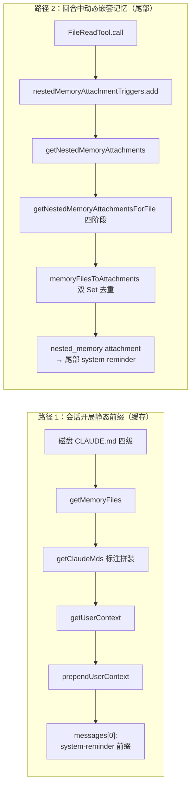
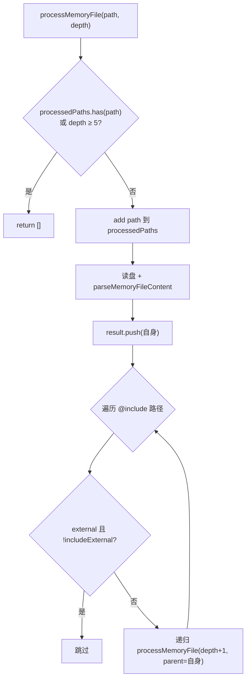
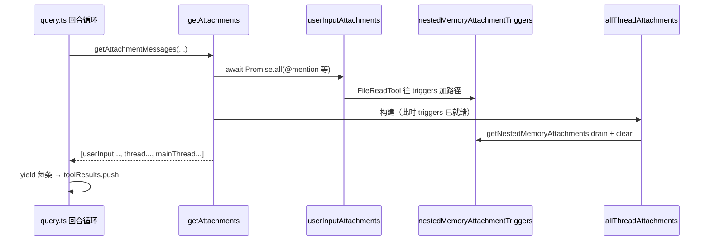
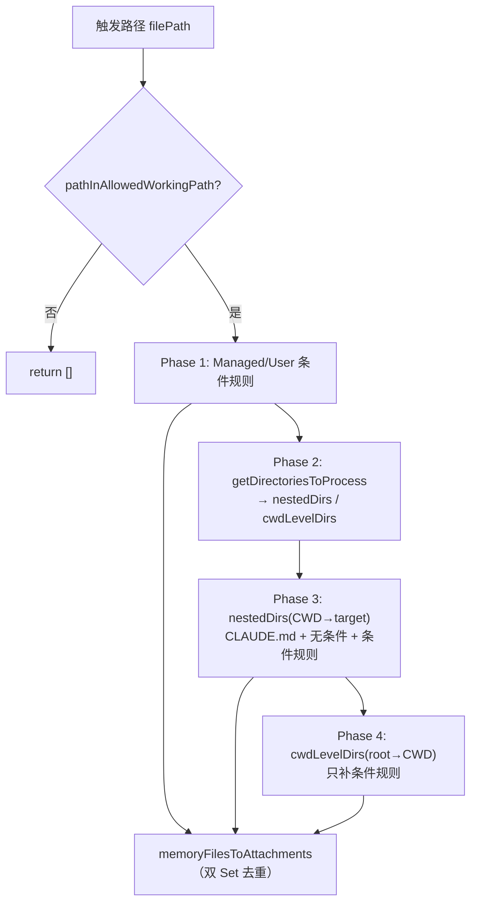
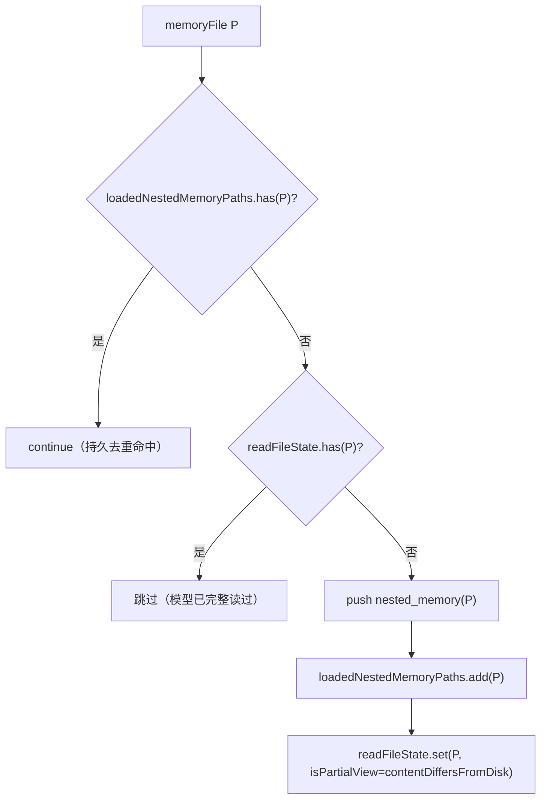

# 14 · CLAUDE.md 加载、嵌套记忆与 attachments 流水线

本篇覆盖：CLAUDE.md 四级发现顺序与向上遍历 · @include 递归（MAX_INCLUDE_DEPTH）· 记忆文件净化与 contentDiffersFromDisk · getClaudeMds 标注拼装 · 经 getUserContext / prependUserContext 注入系统提示 · getAttachments 编排（userInput 先行）· FileReadTool 触发 nestedMemoryAttachmentTriggers · getNestedMemoryAttachments 每回合 drain+clear · 四阶段目录遍历 · loadedNestedMemoryPaths vs readFileState 双 Set 去重 · nested_memory 渲染为 `<system-reminder>` ｜ 关键源文件：`src/context.ts`、`src/utils/claudemd.ts`、`src/utils/attachments.ts`、`src/tools/FileReadTool/FileReadTool.ts`、`src/utils/messages.ts`、`src/utils/api.ts` ｜ 上一篇：13-system-prompt-cache.md ｜ 下一篇：15-compaction.md

CLAUDE.md 子系统有两条独立的注入路径，读代码时务必分清：

1. **会话开局的静态前缀**：所有 CLAUDE.md（含 `@include` 展开）在会话开始时一次性读盘、拼装成一大段字符串，作为 `<system-reminder>` 前缀挂在对话最前面，进 prompt 缓存。走 `getMemoryFiles → getClaudeMds → getUserContext → prependUserContext`。
2. **回合中的动态嵌套记忆**：当模型 `Read` 到某个文件时，才按需加载该文件所在目录链上的 CLAUDE.md / 规则，作为独立的 `nested_memory` attachment 追加到对话尾部。走 `FileReadTool → nestedMemoryAttachmentTriggers → getNestedMemoryAttachments → getNestedMemoryAttachmentsForFile → memoryFilesToAttachments`。

两条路径共享同一套 `MemoryFileInfo` 解析器（`processMemoryFile` / `parseMemoryFileContent`），但注入形态、作用域、去重机制完全不同。下面逐个拆开。



---

### getMemoryFiles — 记忆文件发现顺序与向上遍历

- **触发 / 记录**：`getUserContext`（`src/context.ts:155`）在会话第一次构建 prompt 时调用 `getMemoryFiles()`。该函数被 `memoize` 包裹，进程内只真正扫盘一次；结果按固定优先级顺序 push 进一个 `MemoryFileInfo[]`。

```ts
// Process Managed file first (always loaded - policy settings)
const managedClaudeMd = getMemoryPath('Managed')
result.push(...(await processMemoryFile(managedClaudeMd, 'Managed', processedPaths, includeExternal)))
// ...Managed rules, then User (if userSettings enabled), then Project/Local walk
const dirs: string[] = []
let currentDir = originalCwd
while (currentDir !== parse(currentDir).root) {
  dirs.push(currentDir)
  currentDir = dirname(currentDir)
}
// Process from root downward to CWD
for (const dir of dirs.reverse()) { /* CLAUDE.md, .claude/CLAUDE.md, rules, CLAUDE.local.md */ }
```
`src/utils/claudemd.ts:790`（Managed 首个 :804；User :826；向上收集 dirs :854；`dirs.reverse()` 从 root 向下 :878）

顺序由文件顶部的模块注释精确规定（`src/utils/claudemd.ts:1-10`）：

```
1. Managed memory (eg. /etc/claude-code/CLAUDE.md)   — 全局策略
2. User memory (~/.claude/CLAUDE.md)                  — 用户私有全局
3. Project memory (CLAUDE.md / .claude/CLAUDE.md / .claude/rules/*.md)
4. Local memory (CLAUDE.local.md)                     — 未 checkin 的项目私有
Files are loaded in reverse order of priority, i.e. the latest files are highest priority.
```

关键点：**先收集从 CWD 向上到 root 的目录（`while` 循环），再 `.reverse()` 从 root 向下遍历**——于是越靠近 CWD 的 CLAUDE.md 越晚 push、在数组里越靠后。注释明说“latest files are highest priority”，即拼进 prompt 时排在后面、模型更关注。`getMemoryPath` 给出各级真实路径：

```ts
case 'User':    return join(getClaudeConfigHomeDir(), 'CLAUDE.md')  // ~/.claude/CLAUDE.md
case 'Local':   return join(cwd, 'CLAUDE.local.md')
case 'Project': return join(cwd, 'CLAUDE.md')
case 'Managed': return join(getManagedFilePath(), 'CLAUDE.md')      // eg. /etc/claude-code/CLAUDE.md
```
`src/utils/config.ts:1779`

- **使用 / 注入**：`getMemoryFiles()` 的结果先过 `filterInjectedMemoryFiles`（当 `tengu_moth_copse` 打开时剔除 `AutoMem`/`TeamMem`，因为它们改走 relevant-memory 预取，`src/utils/claudemd.ts:1142`），再交给 `getClaudeMds` 拼成一大段字符串（见下一节）。

- **为什么（设计意图）**：
  - **反优先级加载**是 LLM 的“近因偏置”利用：把最贴近当前工作目录、最可能相关的指令放在最后。
  - **向上遍历 + 逐级 CLAUDE.md** 让 monorepo 子包能各自带局部约定，而不必全塞进根目录。
  - **nested worktree 去重**（`src/utils/claudemd.ts:868-884`）：`claude -w` 从 `.claude/worktrees/<name>/` 运行时，向上走会同时穿过 worktree root 和主仓库 root，两者都有 checkin 的 `CLAUDE.md`。`isNestedWorktree` 判定成立时，对主仓库工作树里（`canonicalRoot` 内、`gitRoot` 外）的目录 `skipProject`，避免同一份内容加载两遍（issue #29599）。`CLAUDE.local.md` 因 gitignore 只存在于主仓库，仍照常加载。
  - `Managed` 恒加载（策略性）；`User` 需 `isSettingSourceEnabled('userSettings')`；`Project`/`Local` 分别受 `projectSettings`/`localSettings` 门控——这让 SDK 场景（默认 `settingSources: []`）可以彻底关掉自动发现。

- **示例数据**（CLAUDE.md 加载顺序清单，示例，据 `getMemoryPath` + 注释构造；数组从前到后 = 优先级从低到高）：

| # | type | 真实路径（示例 cwd=`/repo/pkg/api`） | 拼装标注（见 getClaudeMds） |
|---|------|------|------|
| 0 | Managed | `/etc/claude-code/CLAUDE.md` | ` (user's private global instructions for all projects)` |
| 1 | User | `~/.claude/CLAUDE.md` | ` (user's private global instructions for all projects)` |
| 2 | Project | `/repo/CLAUDE.md` | ` (project instructions, checked into the codebase)` |
| 3 | Project | `/repo/pkg/CLAUDE.md` | ` (project instructions, checked into the codebase)` |
| 4 | Project | `/repo/pkg/api/CLAUDE.md` | ` (project instructions, checked into the codebase)` |
| 5 | Local | `/repo/pkg/api/CLAUDE.local.md` | ` (user's private project instructions, not checked in)` |

注意：源码里 `Managed` 与 `User` 共用同一句标注（都落到 getClaudeMds 三元的 `else` 分支，`src/utils/claudemd.ts:1177`）——这是有意的，Managed 也是“对所有项目生效的全局指令”。

- **生命周期**：`getMemoryFiles` 与 `getUserContext` 均 `memoize`，作用域是**整个进程/会话**。compaction 后子系统通过 `getUserContext.cache.clear?.()`（`src/services/compact/postCompactCleanup.ts:59`）失效外层缓存，才能重新读盘。`--resume` 起新进程自然重扫。

---

### processMemoryFile 与 @include（MAX_INCLUDE_DEPTH = 5）

- **触发 / 记录**：`getMemoryFiles` 对每个候选路径调 `processMemoryFile`。它读盘、解析出 `MemoryFileInfo`，再递归展开文件内的 `@include`。递归深度与环由两道闸把住：

```ts
const normalizedPath = normalizePathForComparison(filePath)
if (processedPaths.has(normalizedPath) || depth >= MAX_INCLUDE_DEPTH) {
  return []
}
// ...读盘、解析出 memoryFile 与 resolvedIncludePaths
result.push(memoryFile)                       // 父在前
for (const resolvedIncludePath of resolvedIncludePaths) {
  const isExternal = !pathInOriginalCwd(resolvedIncludePath)
  if (isExternal && !includeExternal) continue // CWD 外的 include 需批准
  const includedFiles = await processMemoryFile(
    resolvedIncludePath, type, processedPaths, includeExternal,
    depth + 1, filePath,                        // 传自身为 parent
  )
  result.push(...includedFiles)
}
```
`src/utils/claudemd.ts:626`（深度/环闸 :630）、`:666-682`（递归）、常量 `const MAX_INCLUDE_DEPTH = 5` 于 `:537`

`@include` 语法由 `src/utils/claudemd.ts:18-25` 注释定义：`@path`、`@./relative`、`@~/home`、`@/absolute`；只在叶子文本节点生效（代码块/代码串内的 `@` 不算）；被 include 的文件作为独立条目排在**引用它的文件之前**。`extractIncludePathsFromTokens` 用 marked 词法器扫 token，`TEXT_FILE_EXTENSIONS`（`:96`）白名单挡掉二进制（图片/PDF 不会被读进记忆）。

- **使用 / 注入**：`processMemoryFile` 返回的每个 `MemoryFileInfo` 都携带 `parent` 字段（谁 include 了它）。这些条目和主 CLAUDE.md 一起进 `getMemoryFiles` 的结果数组，走同一条拼装路径；`parent` 还用于 InstructionsLoaded hook 的 `loadReason`（见双 Set 去重一节）。

- **为什么（设计意图）**：
  - `MAX_INCLUDE_DEPTH = 5` + `processedPaths` 双保险：前者挡深链，后者挡环（同一路径归一化后只处理一次）。注释 `Circular references are prevented by tracking processed files`。
  - **external 门控**：CWD 之外的 include（`!pathInOriginalCwd`）默认不加载，需 `includeExternal`（来自 `config.hasClaudeMdExternalIncludesApproved`）。这是防“恶意 CLAUDE.md 把 `~/.ssh/...` include 进 prompt”的边界。User 级记忆例外（`processMemoryFile(userClaudeMd, 'User', …, true)`，`src/utils/claudemd.ts:833`），因为用户自己家目录的文件本就可信。
  - **父在前、子在后**——`result.push(memoryFile)` 先于递归结果 push。等一下，代码是父先 push 然后 push 子，即父在前。而模块注释说“Included files are added as separate entries before the including file”——这条注释描述的是 `getMemoryFiles` 顶层遍历里“先 Managed、后靠近 CWD”的整体优先级语义。以实际代码为准：单个 `processMemoryFile` 内父条目排在其 includes 之前。

- **示例数据**（一次 `@include` 展开，示例，据 `MemoryFileInfo` 结构构造）。设 `/repo/CLAUDE.md` 含 `@./docs/style.md`：

```jsonc
[
  { "path": "/repo/CLAUDE.md",        "type": "Project", "content": "See @./docs/style.md ..." },
  { "path": "/repo/docs/style.md",    "type": "Project", "content": "2-space indent ...",
    "parent": "/repo/CLAUDE.md" }
]
```

- **图**：



- **生命周期**：随 `getMemoryFiles` 一起 memoize，会话级。`processedPaths` 是每次顶层调用新建的局部 Set，不跨调用。

---

### parseMemoryFileContent — 净化、frontmatter globs 与 contentDiffersFromDisk

- **触发 / 记录**：`safelyReadMemoryFileAsync` 读到原始字节后交给纯函数 `parseMemoryFileContent`（`src/utils/claudemd.ts:343`）。它做三件净化：拆 frontmatter（提取 `paths` → `globs`）、去 block 级 HTML 注释、对 `AutoMem`/`TeamMem` 入口做行/字节截断。

```ts
let finalContent = strippedContent
if (type === 'AutoMem' || type === 'TeamMem') {
  finalContent = truncateEntrypointContent(strippedContent).content
}
// Covers frontmatter strip, HTML comment strip, and MEMORY.md truncation
const contentDiffersFromDisk = finalContent !== rawContent
return {
  info: { path: filePath, type, content: finalContent, globs: paths,
    contentDiffersFromDisk,
    rawContent: contentDiffersFromDisk ? rawContent : undefined },
  includePaths,
}
```
`src/utils/claudemd.ts:381-399`

`MemoryFileInfo` 的形状（`src/utils/claudemd.ts:229`）：

```ts
export type MemoryFileInfo = {
  path: string
  type: MemoryType                  // 'User'|'Project'|'Local'|'Managed'|'AutoMem'|('TeamMem')
  content: string
  parent?: string                   // include 它的文件
  globs?: string[]                  // frontmatter paths → 条件规则
  contentDiffersFromDisk?: boolean  // content 已被净化，不再等于磁盘字节
  rawContent?: string               // 净化时保留的原始磁盘字节
}
```

- **使用 / 注入**：`contentDiffersFromDisk` / `rawContent` 是给 `memoryFilesToAttachments` 写 `readFileState` 用的——净化过的内容不能当成“模型已完整读过磁盘”，否则 Edit/Write 会基于被裁剪的视图直接改文件。所以缓存时写入 `rawContent` 并打 `isPartialView: true`（详见双 Set 去重一节）。`globs` 则决定该规则是“无条件规则”还是“条件规则”（`processConditionedMdRules` 用 `ignore()` 把 `globs` 与目标路径匹配）。

- **为什么（设计意图）**：`MAX_MEMORY_CHARACTER_COUNT = 40000`（`src/utils/claudemd.ts:92`，注释“Recommended max character count for a memory file”）是软上限，`getLargeMemoryFiles` 据此提示用户拆分；真正的硬截断只对 `AutoMem`/`TeamMem` 入口生效。净化的核心矛盾是：**注进 prompt 的字节**（要干净、要短）与**磁盘上的字节**（Edit/Write 的基准）必须分别记账，`contentDiffersFromDisk` 正是这两者的分水岭。CRLF 细节：只有真需要 strip 注释时才走 token 重建，否则 marked 归一化 `\r\n` 会让 `contentDiffersFromDisk` 误翻（`src/utils/claudemd.ts:368-374`）。

- **示例数据**（条件规则文件带 frontmatter，示例，据 `parseFrontmatterPaths` 构造）。`.claude/rules/py.md`：

```markdown
---
paths: src/**/*.py
---
所有 Python 代码用 4 空格缩进。
```
解析为：
```jsonc
{ "path": ".../.claude/rules/py.md", "type": "Project",
  "content": "所有 Python 代码用 4 空格缩进。",
  "globs": ["src/**/*.py"], "contentDiffersFromDisk": true,
  "rawContent": "---\npaths: src/**/*.py\n---\n所有 Python 代码用 4 空格缩进。\n" }
```
（`paths` 去掉了尾部 `/**`；若全是 `**` 则视为无 globs、无条件生效，`src/utils/claudemd.ts:272-278`。）

- **生命周期**：纯函数，无 I/O，无状态。

---

### getClaudeMds — 标注拼装为系统提示前缀

- **触发 / 记录**：`getUserContext` 把 `getMemoryFiles()` 的结果传给 `getClaudeMds`（`src/utils/claudemd.ts:1153`），逐条按 `type` 加人类可读标注，拼成一段字符串。

```ts
const description =
  file.type === 'Project'  ? ' (project instructions, checked into the codebase)'
: file.type === 'Local'    ? " (user's private project instructions, not checked in)"
: feature('TEAMMEM') && file.type === 'TeamMem'
                           ? ' (shared team memory, synced across the organization)'
: file.type === 'AutoMem'  ? " (user's auto-memory, persists across conversations)"
:                            " (user's private global instructions for all projects)"
const content = file.content.trim()
memories.push(`Contents of ${file.path}${description}:\n\n${content}`)
// ...
return `${MEMORY_INSTRUCTION_PROMPT}\n\n${memories.join('\n\n')}`
```
`src/utils/claudemd.ts:1168-1194`

其中 `MEMORY_INSTRUCTION_PROMPT`（`src/utils/claudemd.ts:89`）逐字为：

```
Codebase and user instructions are shown below. Be sure to adhere to these
instructions. IMPORTANT: These instructions OVERRIDE any default behavior and
you MUST follow them exactly as written.
```

- **使用 / 注入**：返回值作为 `getUserContext` 结果里的 `claudeMd` 字段，最终经 `prependUserContext` 变成对话首条 `<system-reminder>` 用户消息的一部分（下一节）。`skipProjectLevel`（`tengu_paper_halyard`）打开时会跳过所有 Project/Local——因为那时它们改由 nested_memory 按需注入。

- **为什么（设计意图）**：每条前面加 `Contents of <path> (…):` 让模型知道**指令来源与信任级别**（是团队 checkin 的、还是本地私有的），从而在冲突时有据可依。`MEMORY_INSTRUCTION_PROMPT` 用 `OVERRIDE any default behavior` 措辞是刻意把用户指令抬到高于系统默认行为。注意 `TeamMem` 还额外用 `<team-memory-content source="shared">` 包裹（`:1182`），把“共享来源”做成结构化标签。

- **示例数据**（拼装结果，示例，据源码字符串构造）：

```
Codebase and user instructions are shown below. Be sure to adhere to these instructions. IMPORTANT: These instructions OVERRIDE any default behavior and you MUST follow them exactly as written.

Contents of /repo/CLAUDE.md (project instructions, checked into the codebase):

Use bun, not npm. Run tests with `bun test`.

Contents of /repo/pkg/api/CLAUDE.md (project instructions, checked into the codebase):

This package targets Node 20. Prefer async fs.

Contents of /repo/pkg/api/CLAUDE.local.md (user's private project instructions, not checked in):

My scratch DB is at localhost:5433.
```

- **生命周期**：随 `getUserContext` memoize，会话级。

---

### getUserContext / prependUserContext — CLAUDE.md 注入到 prompt

- **触发 / 记录**：`getUserContext`（`src/context.ts:155`）返回 `{ claudeMd?, currentDate }`。`shouldDisableClaudeMd` 门控两种关法：`CLAUDE_CODE_DISABLE_CLAUDE_MDS`（硬关）与 `--bare` 且无 `--add-dir`（跳过自动发现但仍尊重显式加目录）。

```ts
const claudeMd = shouldDisableClaudeMd
  ? null
  : getClaudeMds(filterInjectedMemoryFiles(await getMemoryFiles()))
setCachedClaudeMdContent(claudeMd || null)   // 给 yoloClassifier 用，避免循环依赖
return {
  ...(claudeMd && { claudeMd }),
  currentDate: `Today's date is ${getLocalISODate()}.`,
}
```
`src/context.ts:170-188`

- **使用 / 注入**：`query.ts:660` 用 `prependUserContext(messagesForQuery, userContext)` 把这个对象铺成对话首条消息：

```ts
return [
  createUserMessage({
    content: `<system-reminder>\nAs you answer the user's questions, you can use the following context:\n${
      Object.entries(context).map(([key, value]) => `# ${key}\n${value}`).join('\n')}

      IMPORTANT: this context may or may not be relevant to your tasks. You should not respond to this context unless it is highly relevant to your task.\n</system-reminder>\n`,
    isMeta: true,
  }),
  ...messages,
]
```
`src/utils/api.ts:461-473`

于是整段 CLAUDE.md 以 `# claudeMd\n<拼装串>` 的形式，和 `# currentDate\nToday's date is …` 一起，作为 `messages[0]` 的一条 `isMeta` 用户消息进 API 的 `messages` 数组。它是缓存前缀的一部分。

- **为什么（设计意图）**：
  - 用 `isMeta: true` 的 user 消息而非塞进 system prompt——保持 system prompt 稳定、可跨会话复用缓存；把易变的项目上下文放进对话首条。
  - `IMPORTANT: this context may or may not be relevant` 是给模型的降噪提示，避免它把 git 状态、日期当成必答内容。
  - `currentDate` 故意留在这条缓存前缀里、且**不随午夜跳变而刷新**——`getDateChangeAttachments` 会在对话尾部追加 `date_change` 来告诉模型新日期，而不动 `messages[0]`，否则清缓存会让整段对话在跨天时变成 cache_creation（注释算过：一夜约 920K token，`src/utils/attachments.ts:1406-1411`）。

- **示例数据**（`messages[0]`，示例，据 `prependUserContext` 构造）：

```
<system-reminder>
As you answer the user's questions, you can use the following context:
# claudeMd
Codebase and user instructions are shown below. Be sure to adhere to these instructions. IMPORTANT: These instructions OVERRIDE any default behavior and you MUST follow them exactly as written.

Contents of /repo/CLAUDE.md (project instructions, checked into the codebase):

Use bun, not npm.
# currentDate
Today's date is 2026-07-04.

      IMPORTANT: this context may or may not be relevant to your tasks. You should not respond to this context unless it is highly relevant to your task.
</system-reminder>
```

- **生命周期**：会话级 memoize。compaction 后由 `postCompactCleanup` 清缓存重建。`NODE_ENV==='test'` 时 `prependUserContext` 直接返回原消息（`src/utils/api.ts:453`）。

---

### getSystemContext / getGitStatus — 会话级系统上下文

- **触发 / 记录**：与 `getUserContext` 并行的 `getSystemContext`（`src/context.ts:116`）产出 `{ gitStatus? , cacheBreaker? }`。`getGitStatus`（`src/context.ts:36`，`memoize`）并行跑 `git status --short`、`git log --oneline -n 5`、`git config user.name`、当前/主分支，拼成一段快照。

```ts
return [
  `This is the git status at the start of the conversation. Note that this status is a snapshot in time, and will not update during the conversation.`,
  `Current branch: ${branch}`,
  `Main branch (you will usually use this for PRs): ${mainBranch}`,
  ...(userName ? [`Git user: ${userName}`] : []),
  `Status:\n${truncatedStatus || '(clean)'}`,
  `Recent commits:\n${log}`,
].join('\n\n')
```
`src/context.ts:96-103`（`MAX_STATUS_CHARS = 2000` 截断于 :85）

- **使用 / 注入**：同样经 `prependUserContext` 变成 `messages[0]` 里的 `# gitStatus` 条目（`src/utils/api.ts:491-492` 处 `logContextMetrics` 也读它算体积）。CCR（`CLAUDE_CODE_REMOTE`）或关掉 git 指令时跳过（resume 上是多余开销）。

- **为什么**：明确写“snapshot in time, will not update”是防模型把开局的 git 状态当成实时事实；超 2000 字符截断并提示“run git status using BashTool”。这与 nested_memory 无直接耦合，但同属“开局静态前缀”家族，故一并列出。

- **生命周期**：`memoize`，会话级；`setSystemPromptInjection` 会 `getSystemContext.cache.clear?.()`（`src/context.ts:33`）。

---

### getAttachments 编排 — userInput 先行与 thread attachments 清单

- **触发 / 记录**：`getAttachmentMessages`（`src/utils/attachments.ts:2937`）是每回合末尾在 `query.ts:1580` 的 `for await` 里被消费的异步生成器；它内部先调 `getAttachments`（`:743`）算出 `Attachment[]`，再逐个 `createAttachmentMessage` yield 出去。`getAttachments` 的编排关键在于**三段分批 + userInput 先 await**：

```ts
// Attachments which are added in response to on user input
const userInputAttachments = input ? [ maybe('at_mentioned_files', …), … ] : []
// Process user input attachments first
// This ensures files are added to nestedMemoryAttachmentTriggers before nested_memory processes them
const userAttachmentResults = await Promise.all(userInputAttachments)

// Thread-safe attachments available in sub-agents
// NOTE: created AFTER userInputAttachments completes so triggers are populated
const allThreadAttachments = [
  maybe('queued_commands',      () => getQueuedCommandAttachments(queuedCommands)),
  maybe('date_change',          () => Promise.resolve(getDateChangeAttachments(messages))),
  maybe('deferred_tools_delta', () => …),
  maybe('agent_listing_delta',  () => …),
  maybe('changed_files',        () => getChangedFiles(context)),
  maybe('nested_memory',        () => getNestedMemoryAttachments(context)),
  maybe('dynamic_skill',        () => getDynamicSkillAttachments(context)),
  maybe('skill_listing',        () => getSkillListingAttachments(context)),
  /* … plan_mode, todo_reminders, … */
]
```
`src/utils/attachments.ts:817-875`；最终顺序 `[...userAttachmentResults, ...threadAttachmentResults, ...mainThreadAttachmentResults]`（`:998-1002`）

- **使用 / 注入**：每个 `Attachment` 经 `createAttachmentMessage`（分派到 `messages.ts` 的 render）变成一条消息追加到对话尾部（`toolResults.push(attachment)`，`query.ts:1589`）。`removeFromQueue`（`query.ts:1642`）把已消费的 queued command 出队。

- **为什么（设计意图）**：**顺序即正确性**。`processAtMentionedFiles`（`@file` 提及）内部会调 `FileReadTool`，从而往 `nestedMemoryAttachmentTriggers` 里塞路径；必须先 `await` 完这批，`getNestedMemoryAttachments` 才能在同一次收集里 drain 到它们。注释写死了这条依赖（`:818` / `:822-823`）。`maybe(label, fn)`（`:1005`）是每个 attachment 的计时 + 错误边界：任一 getter 抛错只丢自己那份、不炸整条流水线。

- **示例数据**（thread attachments 清单里与本篇相关的类型，示例，据 union 类型构造）：

| label | attachment.type | 载荷字段（节选） |
|------|------|------|
| `queued_commands` | `queued_command` | `prompt`, `commandMode`, `isMeta` |
| `date_change` | `date_change` | `newDate: "2026-07-05"` |
| `changed_files` | `edited_text_file` | `filename`, `snippet` |
| `nested_memory` | `nested_memory` | `path`, `content: MemoryFileInfo`, `displayPath` |
| `deferred_tools_delta` | `deferred_tools_delta` | `addedNames[]`, `addedLines[]`, `removedNames[]` |
| `agent_listing_delta` | `agent_listing_delta` | `addedTypes[]`, `addedLines[]`, `isInitial`, `showConcurrencyNote` |
| `skill_listing` | `skill_listing` | `content`, `skillCount`, `isInitial` |
| `dynamic_skill` | `dynamic_skill` | `skillDir`, `skillNames[]`, `displayPath` |

- **图**（一次回合末的收集时序）：



- **生命周期**：每回合（每次 `getAttachmentMessages` 调用）重算；`CLAUDE_CODE_DISABLE_ATTACHMENTS`/`CLAUDE_CODE_SIMPLE` 时只回 queued command（`:752-761`）。

---

### FileReadTool → nestedMemoryAttachmentTriggers — 每次 Read 打触发点

- **触发 / 记录**：`FileReadTool.call` 每成功读一个文件（文本/图片/notebook 三条路径），都会把绝对路径塞进 `context.nestedMemoryAttachmentTriggers`：

```ts
readFileState.set(fullFilePath, { content, timestamp: Math.floor(mtimeMs), offset, limit })
context.nestedMemoryAttachmentTriggers?.add(fullFilePath)
```
`src/tools/FileReadTool/FileReadTool.ts:1038`（文本）；`:848`（notebook）；`:870`（图片）

- **使用 / 注入**：该 Set 在本回合末由 `getNestedMemoryAttachments`（thread attachment）读取并清空。它是“模型刚碰过哪些文件”的**回合内待办队列**。

- **为什么（设计意图）**：嵌套记忆是**惰性**的——不预先把全仓库每个子目录的 CLAUDE.md 都塞进 prompt，而是等模型真读到某文件，才注入该文件目录链上的局部约定。`nestedMemoryAttachmentTriggers` 就是把“读文件”这个事件与“加载相邻记忆”这个动作解耦的信箱：FileReadTool 只管记事件，attachments 流水线统一 drain。`?.` 可选链是因为某些精简 context（如部分 SDK 路径）不带这个 Set。

- **示例数据**（一次回合内 triggers 的累积，示例）：

```
模型本回合 Read 了：
  /repo/pkg/api/src/db/query.ts
  /repo/pkg/api/README.md
→ nestedMemoryAttachmentTriggers = {
    "/repo/pkg/api/src/db/query.ts",
    "/repo/pkg/api/README.md",
  }
```

- **生命周期**：`nestedMemoryAttachmentTriggers` 在每次 ToolUseContext 构建时 `new Set<string>()`（`src/QueryEngine.ts:370`、`:518`、`forkedAgent.ts:382`），即**每回合/每次 submitMessage 级**；由 `getNestedMemoryAttachments` 在回合末 `.clear()`。

---

### getNestedMemoryAttachments — 每回合 drain + clear

- **触发 / 记录**：作为 `nested_memory` thread attachment 的 getter（`src/utils/attachments.ts:872 → 2167`）。先看 triggers 是否为空（空则连 `getAppState()` 都不调，因为它要等一个 React render cycle），非空才逐个处理：

```ts
if (!toolUseContext.nestedMemoryAttachmentTriggers ||
    toolUseContext.nestedMemoryAttachmentTriggers.size === 0) {
  return []
}
const appState = toolUseContext.getAppState()
const attachments: Attachment[] = []
for (const filePath of toolUseContext.nestedMemoryAttachmentTriggers) {
  const nestedAttachments = await getNestedMemoryAttachmentsForFile(filePath, toolUseContext, appState)
  attachments.push(...nestedAttachments)
}
toolUseContext.nestedMemoryAttachmentTriggers.clear()
return attachments
```
`src/utils/attachments.ts:2167-2194`

- **使用 / 注入**：返回的 `nested_memory` attachment 由 `createAttachmentMessage` 渲染成尾部 `<system-reminder>`（见最后一节）。

- **为什么**：drain 后立刻 `clear()`——确保同一批触发只处理一次；跨回合的持久去重交给 `loadedNestedMemoryPaths`（下一节），本 Set 只负责“本回合有哪些新读的文件”。空集 fast-path 避免了每回合无谓的 `getAppState()` render 等待（注释 :2170-2171）。

- **生命周期**：回合级 drain。`clear()` 后本回合再有 Read 会重新填充，下回合再 drain。

---

### getNestedMemoryAttachmentsForFile — 四阶段目录遍历

- **触发 / 记录**：对每个触发路径，`getNestedMemoryAttachmentsForFile`（`src/utils/attachments.ts:1792`）按固定顺序拉取应用于该路径的记忆文件。先过 `pathInAllowedWorkingPath` 权限闸，再分四阶段：

```ts
// Phase 1: Managed/User 条件规则（匹配 targetPath 的 glob）
const managedUserRules = await getManagedAndUserConditionalRules(filePath, processedPaths)
attachments.push(...memoryFilesToAttachments(managedUserRules, toolUseContext, filePath))
// Phase 2: 计算目录集
const { nestedDirs, cwdLevelDirs } = getDirectoriesToProcess(filePath, originalCwd)
// Phase 3: 嵌套目录 CWD→target：CLAUDE.md + 无条件规则 + 条件规则
for (const dir of nestedDirs) {
  const memoryFiles = await getMemoryFilesForNestedDirectory(dir, filePath, processedPaths)
  attachments.push(...memoryFilesToAttachments(memoryFiles, toolUseContext, filePath))
}
// Phase 4: CWD 级目录 root→CWD：只补条件规则（无条件规则开局已加载）
for (const dir of cwdLevelDirs) {
  const conditionalRules = await getConditionalRulesForCwdLevelDirectory(dir, filePath, processedPaths)
  attachments.push(...memoryFilesToAttachments(conditionalRules, toolUseContext, filePath))
}
```
`src/utils/attachments.ts:1808-1856`（`skipProjectLevel` 过滤 :1834/:1851 略）

`getDirectoriesToProcess`（`:1656`）把目录切成两段：`nestedDirs` = 从 target 目录向上走到 `originalCwd`（且必须 `startsWith(originalCwd)`）再 reverse 成 CWD→target；`cwdLevelDirs` = 从 root 到 CWD。

- **使用 / 注入**：四阶段的每批 `MemoryFileInfo` 都过 `memoryFilesToAttachments` 转成 `nested_memory` attachment（下一节去重）。

- **为什么（设计意图）**：
  - **Phase 1** 先处理 Managed/User 的条件规则（`.claude/rules/*.md` 带 frontmatter `paths`），因为这些是最高层级、可能对任意路径生效的约定。
  - **Phase 3 只覆盖 CWD 与 target 之间的目录**——开局静态前缀已经加载了 root→CWD 的无条件 CLAUDE.md，所以嵌套加载只需补“CWD 更深处”的目录。这正是惰性加载的价值：你打开 `/repo/pkg/api/src/db/query.ts` 时，才把 `/repo/pkg/api/src`、`/repo/pkg/api/src/db` 里的 CLAUDE.md 拉进来。
  - **Phase 4 对 root→CWD 只补条件规则**——无条件规则开局已在，但条件规则（glob 匹配）当时没触发，现在有了具体 target 路径才可能匹配上。
  - 共享 `processedPaths` 贯穿四阶段，避免同一文件被不同阶段重复解析。

- **示例数据**（Read `/repo/pkg/api/src/db/query.ts`，cwd=`/repo/pkg/api`，示例）：

```
Phase 1  Managed/User 条件规则 匹配 query.ts 的（如 src/**/*.ts）
Phase 3  nestedDirs = [ /repo/pkg/api/src, /repo/pkg/api/src/db ]
         → 各自的 CLAUDE.md + .claude/rules/*.md
Phase 4  cwdLevelDirs = [ /, /repo, /repo/pkg, /repo/pkg/api ]
         → 只补条件规则（无条件的开局已在前缀里）
```

- **图**：



- **生命周期**：随每次 drain 调用，无独立状态（`processedPaths` 为局部 Set）。

---

### memoryFilesToAttachments — loadedNestedMemoryPaths vs readFileState 双 Set 去重

- **触发 / 记录**：四阶段的每批 `MemoryFileInfo` 都过 `memoryFilesToAttachments`（`src/utils/attachments.ts:1710`）。它用**两个 Set 串联**决定某文件是否真的要生成 attachment：

```ts
for (const memoryFile of memoryFiles) {
  // Dedup: loadedNestedMemoryPaths is a non-evicting Set; readFileState
  // is a 100-entry LRU that drops entries in busy sessions, so relying
  // on it alone re-injects the same CLAUDE.md on every eviction cycle.
  if (toolUseContext.loadedNestedMemoryPaths?.has(memoryFile.path)) continue
  if (!toolUseContext.readFileState.has(memoryFile.path)) {
    attachments.push({ type: 'nested_memory', path: memoryFile.path,
      content: memoryFile, displayPath: relative(getCwd(), memoryFile.path) })
    toolUseContext.loadedNestedMemoryPaths?.add(memoryFile.path)
    toolUseContext.readFileState.set(memoryFile.path, {
      content: memoryFile.contentDiffersFromDisk
        ? (memoryFile.rawContent ?? memoryFile.content) : memoryFile.content,
      timestamp: Date.now(), offset: undefined, limit: undefined,
      isPartialView: memoryFile.contentDiffersFromDisk,
    })
    // Fire InstructionsLoaded hook（loadReason: path_glob_match / include / nested_traversal）
  }
}
```
`src/utils/attachments.ts:1718-1770`

- **使用 / 注入**：push 出的 `nested_memory` attachment 进 thread attachment 结果；同时**写 `readFileState`**——这一步很关键：它让后续的 `getChangedFiles`（`:2063`，读 `readFileState` 里的 content 与磁盘 diff）能感知这份文件已在上下文里，且当 `contentDiffersFromDisk` 时写入的是 `rawContent` + `isPartialView: true`，于是 Edit/Write 仍会要求先真正 Read（净化视图不作数）。

- **为什么（设计意图）**：两个 Set 分工明确，注释讲得很直白：
  - `loadedNestedMemoryPaths`：**非驱逐**的 Set，会话级持久。防止“同一 CLAUDE.md 每回合重复注入”。
  - `readFileState`：**100 条 LRU**，繁忙会话会驱逐旧条目。若只靠它去重，一旦某记忆文件被 LRU 淘汰，下次触发又会把它当“没读过”重新注入——每个驱逐周期重注一遍。
  - 所以顺序是：先看 `loadedNestedMemoryPaths`（持久，命中即跳过）；没命中再看 `readFileState`（若模型本就用 FileReadTool 完整读过它，也不必再注 nested_memory）。两道闸缺一不可。
  - `loadReason` 三分类喂给 InstructionsLoaded hook：有 `globs`→`path_glob_match`，有 `parent`→`include`，否则 `nested_traversal`。

- **示例数据**（双 Set 去重的一次 trace，示例，据源码逻辑构造）：

```
触发 Read: /repo/pkg/api/src/db/query.ts
候选记忆文件: /repo/pkg/api/src/CLAUDE.md  (contentDiffersFromDisk=false)

第 1 次遇到：
  loadedNestedMemoryPaths.has(P)?  否
  readFileState.has(P)?            否
  → push nested_memory(P)
  → loadedNestedMemoryPaths.add(P)         // {P}
  → readFileState.set(P, {content, isPartialView:false})

同回合/后续回合再触发同一 P：
  loadedNestedMemoryPaths.has(P)?  是 → continue（不再注入）

假设繁忙会话把 P 从 readFileState(LRU) 驱逐：
  loadedNestedMemoryPaths.has(P)?  仍是 是 → continue
  （若没有这个持久 Set，此处 readFileState.has(P)=否 会误重注 P）
```

- **图**：



- **生命周期**：
  - `loadedNestedMemoryPaths`：`QueryEngine` 私有字段 `new Set<string>()`（`src/QueryEngine.ts:198`），跨回合共享**整个会话**；compaction 时 `context.loadedNestedMemoryPaths?.clear()`（`src/services/compact/compact.ts:522`、`:921`），`/clear` 时也清（`src/commands/clear/conversation.ts:132`）——因为压缩/清屏后旧的 nested_memory 消息没了，需允许重新注入。
  - `readFileState`：会话级 100 条 LRU。
  - resume 行为：新进程新建两个 Set，历史里的 nested_memory 消息已在 transcript 中，`loadedNestedMemoryPaths` 从空开始意味着 resume 后首次触发同一文件会重注一份——可接受，因为持久 Set 本就不跨进程。

---

### nested_memory 渲染为 `<system-reminder>`

- **触发 / 记录**：`createAttachmentMessage` 对 `nested_memory` 分派到 `messages.ts` 的 render 分支：

```ts
case 'nested_memory': {
  return wrapMessagesInSystemReminder([
    createUserMessage({
      content: `Contents of ${attachment.content.path}:\n\n${attachment.content.content}`,
      isMeta: true,
    }),
  ])
}
```
`src/utils/messages.ts:3700-3706`；`wrapInSystemReminder` 于 `:3097`

- **使用 / 注入**：`wrapMessagesInSystemReminder`（`:3101`）把内容裹进 `<system-reminder>\n…\n</system-reminder>`，作为一条 `isMeta` user 消息追加到对话尾部，进 API 的 `messages` 数组。

- **为什么（设计意图）**：
  - 注意与开局前缀的**措辞差异**：`getClaudeMds` 顶层 CLAUDE.md 用 `Contents of <path> (project instructions, …):`（带信任级别标注），而 nested_memory 只用 `Contents of <path>:`——嵌套记忆是按需补充，不重复挂 `MEMORY_INSTRUCTION_PROMPT`，也不加 type 描述后缀。
  - 用 `<system-reminder>` 包裹让它在 transcript 里可被前缀 `startsWith('<system-reminder>')` 可靠识别（`messages.ts` 多处依赖此判别把 reminder 并进相邻 tool_result，`:1800`/`:1849`/`:2502`）。
  - `isMeta: true` 标记它是系统注入而非用户输入，UI 与后续处理据此区别对待。
  - 兄弟分支 `relevant_memories`（`:3708`）走类似渲染，但用预存的 `header`（含 age + path 前缀）以稳定跨回合字节、命中缓存——对照可见 nested_memory 因内容取自磁盘净化结果，字节天然稳定，不需要那层 header 缓存技巧。

- **示例数据**（一条 nested_memory 的最终消息，示例，据 `messages.ts:3703` 构造）：

```
<system-reminder>
Contents of /repo/pkg/api/src/CLAUDE.md:

This directory holds the DB layer. Never import from ../http here.
Prefer prepared statements. All timestamps are UTC.
</system-reminder>
```

- **图**（从磁盘到尾部消息的整链）：

```mermaid
sequenceDiagram
  participant Model as 模型
  participant FRT as FileReadTool
  participant TR as triggers Set
  participant GNM as getNestedMemoryAttachments
  participant MFA as memoryFilesToAttachments
  participant R as messages.ts render
  Model->>FRT: Read(query.ts)
  FRT->>TR: add(query.ts 绝对路径)
  Note over TR: 回合末
  GNM->>GNM: 四阶段遍历目录链
  GNM->>MFA: 候选 MemoryFileInfo[]
  MFA->>MFA: 双 Set 去重 + 写 readFileState
  MFA-->>R: nested_memory attachment
  R-->>Model: "&lt;system-reminder&gt;Contents of ...&lt;/system-reminder&gt;（尾部）"
```

- **生命周期**：每条 nested_memory 消息一旦追加进 transcript 就是**持久对话历史**（不再随回合重算），除非 compaction/clear 抹掉——届时 `loadedNestedMemoryPaths` 同步清空，允许重注。
