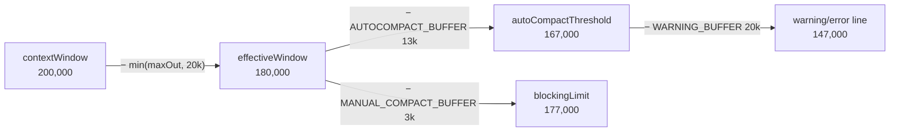
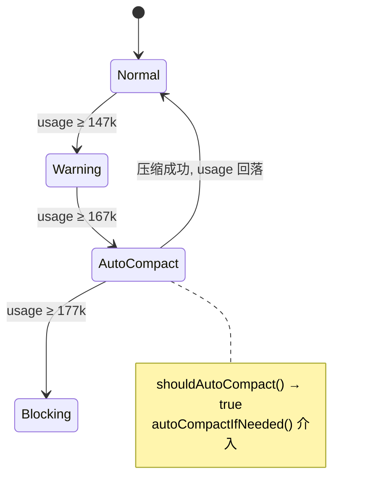
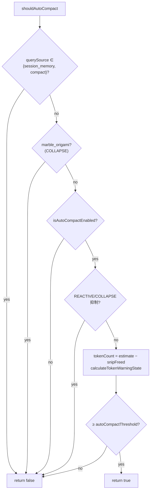
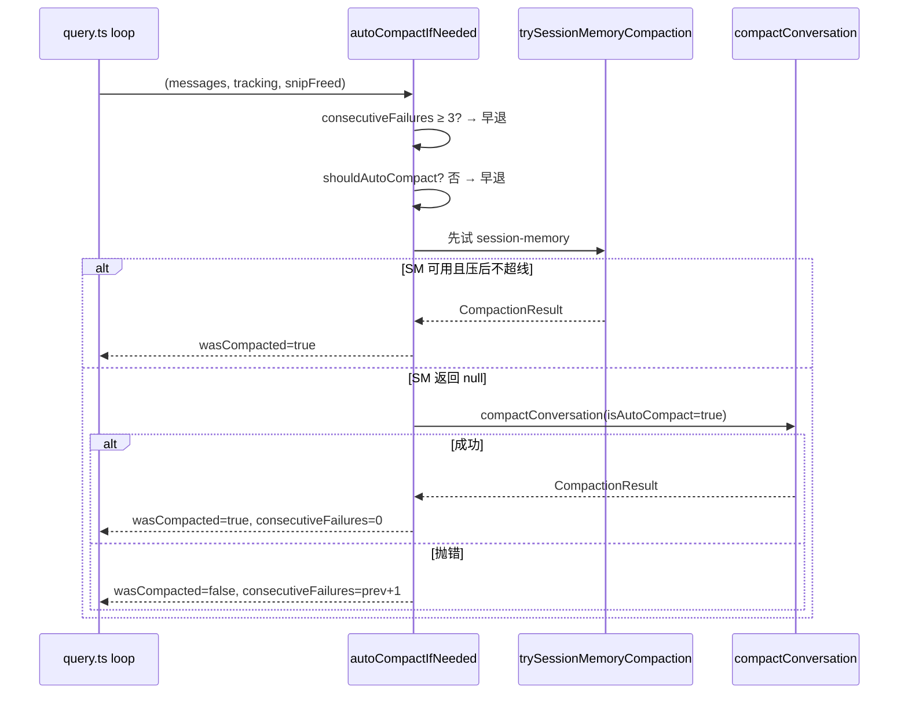
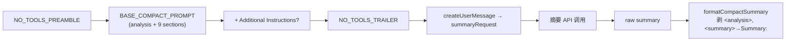
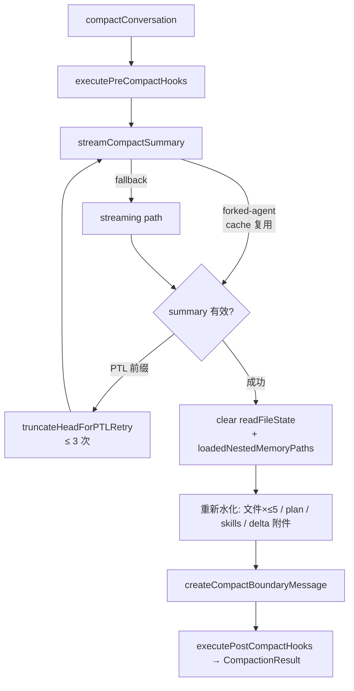
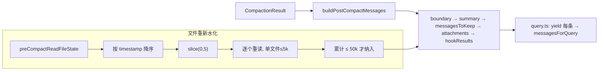
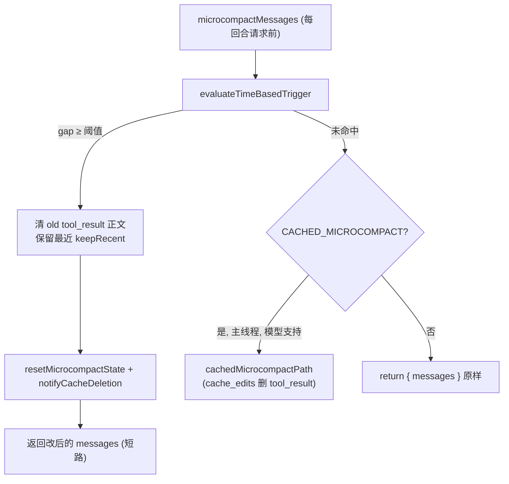
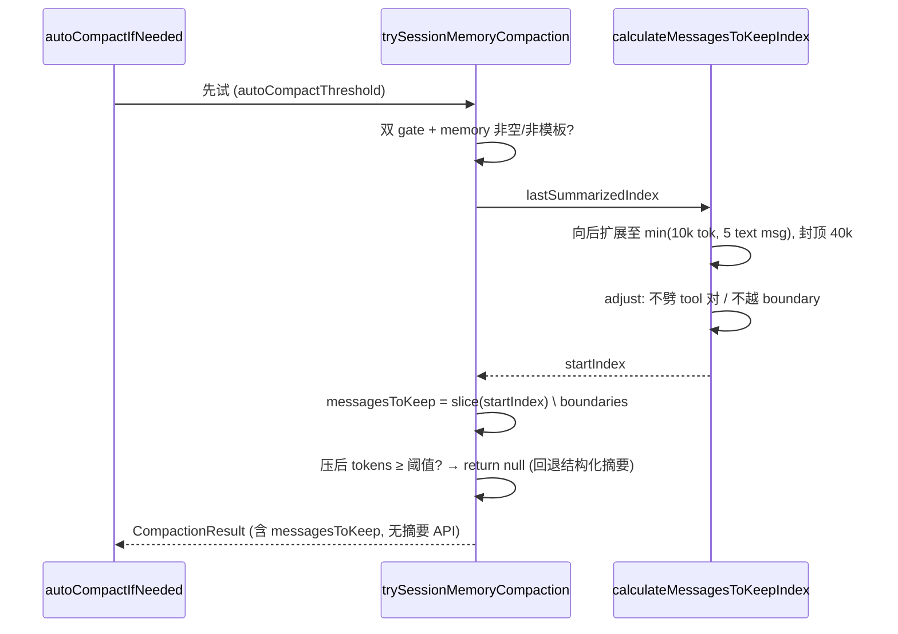
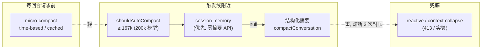

# 15 · 上下文压缩（auto / 结构化摘要 / micro / session-memory）

本篇覆盖：有效窗口与阈值计算（`getEffectiveContextWindowSize` / `getAutoCompactThreshold` / `calculateTokenWarningState`）｜ 触发判定与熔断（`shouldAutoCompact` / `autoCompactIfNeeded`）｜ `AutoCompactTrackingState` 跨迭代穿线 ｜ 9 段式结构化摘要 prompt ｜ `compactConversation` 主流程（forked-agent 摘要 + PTL 重试 + 文件/skill 重新水化）｜ 摘要合成消息 `getCompactUserSummaryMessage` ｜ 时间驱动 micro-compact ｜ session-memory 压缩 ｜ 关键源文件：`src/services/compact/autoCompact.ts`、`compact.ts`、`prompt.ts`、`microCompact.ts`、`sessionMemoryCompact.ts`、`src/query.ts` ｜ 上一篇：14-claudemd-nested-memory.md ｜ 下一篇：16-persistent-memory.md

Claude Code 有**四条**独立的上下文管理路径，按"侵入性"从轻到重排列：

1. **micro-compact**（`microCompact.ts`）——每回合请求前跑，只清老 tool_result 的正文，不动消息结构，不发 API。最轻。
2. **session-memory compact**（`sessionMemoryCompact.ts`）——用后台持续维护的 session memory 文件当摘要，剪掉旧消息，**不发**摘要 API 调用。中等，实验特性。
3. **auto-compact / 结构化摘要**（`autoCompact.ts` + `compact.ts`）——真正跑一次 LLM 摘要，把整段历史替换成一条 9 段式摘要消息 + 重新水化的文件。重。
4. **reactive compact / context-collapse**（本篇不展开，属 413 兜底与实验路径）。

本篇聚焦 1/2/3，逐个函数拆。所有阈值都以 **200k 上下文窗口、maxOutput ≥ 20k 的模型**为例，便于对照真值。

---

### getEffectiveContextWindowSize —— 有效窗口 = 上下文窗口 − 摘要预留

- **触发 / 记录**：所有阈值计算的地基。它从模型的原始上下文窗口里预扣一块"给摘要输出留的空间"，避免"上下文刚好塞满、连生成摘要的 output 都放不下"的死锁。

```ts
const MAX_OUTPUT_TOKENS_FOR_SUMMARY = 20_000       // p99.99 摘要输出 17,387 tok

export function getEffectiveContextWindowSize(model: string): number {
  const reservedTokensForSummary = Math.min(
    getMaxOutputTokensForModel(model),
    MAX_OUTPUT_TOKENS_FOR_SUMMARY,
  )
  let contextWindow = getContextWindowForModel(model, getSdkBetas())
  const autoCompactWindow = process.env.CLAUDE_CODE_AUTO_COMPACT_WINDOW
  if (autoCompactWindow) { /* 允许 env 把窗口调小，便于测试 */ }
  return contextWindow - reservedTokensForSummary
}
```
`src/services/compact/autoCompact.ts:30 / :33`

- **使用 / 注入**：不直接影响发给模型的 prompt，是纯计算函数。下游三处消费：`getAutoCompactThreshold`（减 buffer 得触发线）、`calculateTokenWarningState`（算 blocking limit）、`compact.ts` 里的诸多 token 预算。`getContextWindowForModel` 默认返回 `MODEL_CONTEXT_WINDOW_DEFAULT = 200_000`（`src/utils/context.ts:9`）。

- **为什么**：注释写明 `MAX_OUTPUT_TOKENS_FOR_SUMMARY` 取自"p99.99 of compact summary output being 17,387 tokens"——即用真实分布的极端分位数决定预留量，而非拍脑袋。`Math.min(maxOutput, 20_000)` 保证在 output 上限很低的模型上不会预留过头。

- **示例数据**（示例，据源码构造，200k 模型、maxOutput=64k）：

```
getContextWindowForModel      = 200_000
reservedTokensForSummary      = min(64_000, 20_000) = 20_000
getEffectiveContextWindowSize = 200_000 - 20_000    = 180_000
```

- **图**：



- **生命周期**：无状态，每次调用现算。`getSdkBetas()` 会因 beta header 变化而改变窗口（如 1M context beta），所以同一进程内不同时刻可能返回不同值。

---

### getAutoCompactThreshold —— 触发线 = 有效窗口 − 13k buffer

- **触发 / 记录**：把有效窗口再减去一个固定 buffer，得到"到这条线就触发 auto-compact"的阈值。

```ts
export const AUTOCOMPACT_BUFFER_TOKENS = 13_000

export function getAutoCompactThreshold(model: string): number {
  const effectiveContextWindow = getEffectiveContextWindowSize(model)
  const autocompactThreshold = effectiveContextWindow - AUTOCOMPACT_BUFFER_TOKENS
  const envPercent = process.env.CLAUDE_AUTOCOMPACT_PCT_OVERRIDE
  if (envPercent) { /* 测试用：按百分比取 min(pct*window, threshold) */ }
  return autocompactThreshold
}
```
`src/services/compact/autoCompact.ts:62 / :72`

- **使用 / 注入**：`shouldAutoCompact` 用它判定是否该压缩；`autoCompactIfNeeded` 把它塞进 `RecompactionInfo.autoCompactThreshold`（`:283`），最终 session-memory 路径拿它当"压缩后仍超线就放弃"的门槛（`sessionMemoryCompact.ts:606`），`compactConversation` 拿它算 `willRetriggerNextTurn` 遥测（`compact.ts:656`）。

- **为什么**：13k 的 buffer 是 auto-compact 触发线与真实上限之间的安全垫。对照 `shouldAutoCompact` 的注释：auto-compact 在"effective−13k（约有效窗口 93%）"处触发，正卡在 context-collapse 的 90% commit 与 95% blocking 之间——这个数值被反复引用来解释各机制的相对触发顺序。

- **示例数据**（示例，据源码构造，200k 模型）：

```
autoCompactThreshold = 180_000 − 13_000 = 167_000   (≈ effectiveWindow 的 92.8%)
```

- **生命周期**：无状态。注意 `tokenCountWithEstimation(messages)` 只算**消息负载**，而下一回合 API 实际 `input_tokens` 还要 +20~40k 的 system prompt/tools/userContext——所以真实触发点比 167k 更早（见 `compact.ts:633-636` 的注释）。

---

### calculateTokenWarningState —— 四条带：warning / error / autocompact / blocking

- **触发 / 记录**：把当前 `tokenUsage` 映射到几条阈值带，供 UI 显示"剩余百分比"、决定是否弹警告、是否硬拦。

```ts
export const WARNING_THRESHOLD_BUFFER_TOKENS = 20_000
export const ERROR_THRESHOLD_BUFFER_TOKENS   = 20_000
export const MANUAL_COMPACT_BUFFER_TOKENS    = 3_000

export function calculateTokenWarningState(tokenUsage, model) {
  const autoCompactThreshold = getAutoCompactThreshold(model)
  const threshold = isAutoCompactEnabled()
    ? autoCompactThreshold
    : getEffectiveContextWindowSize(model)
  const percentLeft = Math.max(0, Math.round(((threshold - tokenUsage) / threshold) * 100))
  const warningThreshold = threshold - WARNING_THRESHOLD_BUFFER_TOKENS
  const errorThreshold   = threshold - ERROR_THRESHOLD_BUFFER_TOKENS
  const isAboveAutoCompactThreshold =
    isAutoCompactEnabled() && tokenUsage >= autoCompactThreshold
  const defaultBlockingLimit =
    getEffectiveContextWindowSize(model) - MANUAL_COMPACT_BUFFER_TOKENS
  const isAtBlockingLimit = tokenUsage >= blockingLimit
  return { percentLeft, isAboveWarningThreshold, isAboveErrorThreshold,
           isAboveAutoCompactThreshold, isAtBlockingLimit }
}
```
`src/services/compact/autoCompact.ts:63-65 / :93`

- **使用 / 注入**：`shouldAutoCompact` 只解构 `isAboveAutoCompactThreshold`（`:233-238`）。其余布尔位供 REPL 的上下文余量条 UI 与 `/context` 使用。当 auto-compact 被关闭时，`threshold` 退化为有效窗口本身（不再减 13k）。

- **为什么**：注意一个真实**巧合/设计**——`WARNING_THRESHOLD_BUFFER_TOKENS` 与 `ERROR_THRESHOLD_BUFFER_TOKENS` **都是 20_000**，所以 `isAboveWarningThreshold` 与 `isAboveErrorThreshold` 在同一点翻转，当前实现里两条带重合。`isAtBlockingLimit` 用的是 `effectiveWindow − 3k`（不减 13k buffer），因此**硬拦线在 auto-compact 触发线之后**——设计意图是：先让 auto-compact 有机会自救，救不了才硬拦。

- **示例数据**（示例，据源码构造，200k 模型、auto-compact 开启）：

| 带 | 阈值（tok） | 含义 |
|---|---|---|
| warning / error | ≥ 147,000 | `threshold(167k) − 20k`，UI 变黄（两条重合） |
| autocompact | ≥ 167,000 | `isAboveAutoCompactThreshold` 置真，`shouldAutoCompact` 返回 true |
| blocking | ≥ 177,000 | `effectiveWindow(180k) − 3k`，`isAtBlockingLimit` |
| percentLeft = 0 | ≥ 167,000 | 归一化到 threshold=167k |

- **图**：



---

### shouldAutoCompact —— 递归守卫 + feature 抑制 + 阈值判定

- **触发 / 记录**：`autoCompactIfNeeded` 内部先调它，决定"这一回合到底要不要压"。它把一串**否决条件**串成短路链。

```ts
export async function shouldAutoCompact(messages, model, querySource, snipTokensFreed = 0) {
  // 1) 递归守卫：session_memory / compact 都是 forked agent，会死锁
  if (querySource === 'session_memory' || querySource === 'compact') return false
  // 2) CONTEXT_COLLAPSE 下 marble_origami（ctx-agent）不能触发，否则 reset 主线程日志
  if (feature('CONTEXT_COLLAPSE')) { if (querySource === 'marble_origami') return false }
  if (!isAutoCompactEnabled()) return false
  // 3) REACTIVE_COMPACT / CONTEXT_COLLAPSE 实验开时抑制 proactive
  ...
  const tokenCount = tokenCountWithEstimation(messages) - snipTokensFreed
  const { isAboveAutoCompactThreshold } = calculateTokenWarningState(tokenCount, model)
  return isAboveAutoCompactThreshold
}
```
`src/services/compact/autoCompact.ts:160`

- **使用 / 注入**：返回 `true` 时，`autoCompactIfNeeded` 才会往下走摘要流程；这些消息最终被替换为 boundary + summary + attachments 注入下一次 API 调用。`snipTokensFreed` 是"snip 已经删了消息但幸存 assistant 的 usage 还反映删前上下文"的补偿量（见 `:164-167` 注释）。

- **为什么**：递归守卫是关键正确性约束——`compact` 与 `session_memory` 本身是 forked agent，如果它们的上下文膨胀又触发 auto-compact，会自我递归死锁。`isAutoCompactEnabled` 同时看 `DISABLE_COMPACT`、`DISABLE_AUTO_COMPACT` 两个 env 和用户配置 `autoCompactEnabled`（`:147`）。

- **图**：



---

### autoCompactIfNeeded —— 熔断 + session-memory 优先 + 结构化摘要兜底

- **触发 / 记录**：`query.ts` 每次迭代在 `query_autocompact_start` 检查点调 `deps.autocompact(...)`（`query.ts:454`），即本函数。它是整个 auto 路径的编排器。

```ts
export async function autoCompactIfNeeded(messages, toolUseContext, cacheSafeParams,
    querySource, tracking, snipTokensFreed) {
  if (isEnvTruthy(process.env.DISABLE_COMPACT)) return { wasCompacted: false }
  // 熔断：连续失败 ≥ 3 次就彻底停手
  if (tracking?.consecutiveFailures !== undefined &&
      tracking.consecutiveFailures >= MAX_CONSECUTIVE_AUTOCOMPACT_FAILURES) {
    return { wasCompacted: false }
  }
  const shouldCompact = await shouldAutoCompact(messages, model, querySource, snipTokensFreed)
  if (!shouldCompact) return { wasCompacted: false }

  const recompactionInfo = { isRecompactionInChain: tracking?.compacted === true,
    turnsSincePreviousCompact: tracking?.turnCounter ?? -1,
    previousCompactTurnId: tracking?.turnId,
    autoCompactThreshold: getAutoCompactThreshold(model), querySource }

  // EXPERIMENT：先试 session memory 压缩
  const sessionMemoryResult = await trySessionMemoryCompaction(
    messages, toolUseContext.agentId, recompactionInfo.autoCompactThreshold)
  if (sessionMemoryResult) { ...; return { wasCompacted: true, compactionResult: sessionMemoryResult } }

  try {
    const compactionResult = await compactConversation(messages, ..., true /*isAutoCompact*/, recompactionInfo)
    setLastSummarizedMessageId(undefined)
    runPostCompactCleanup(querySource)
    return { wasCompacted: true, compactionResult, consecutiveFailures: 0 }  // 成功清零
  } catch (error) {
    const nextFailures = (tracking?.consecutiveFailures ?? 0) + 1
    if (nextFailures >= MAX_CONSECUTIVE_AUTOCOMPACT_FAILURES) { logForDebugging('circuit breaker tripped ...') }
    return { wasCompacted: false, consecutiveFailures: nextFailures }
  }
}
```
`src/services/compact/autoCompact.ts:70 / :241 / :260-265 / :339-349`

- **使用 / 注入**：返回的 `compactionResult` 被 `query.ts:528` 交给 `buildPostCompactMessages` 拆成 `boundaryMarker + summaryMessages + messagesToKeep + attachments + hookResults`，逐条 `yield` 出去并成为 `messagesForQuery`——**下一次 API 调用直接吃这批新消息**。`consecutiveFailures` 被 `query.ts:536-542` 写回 `tracking.consecutiveFailures`，供下回合熔断。

- **为什么**：熔断常量 `MAX_CONSECUTIVE_AUTOCOMPACT_FAILURES = 3` 的注释给了硬数据："BQ 2026-03-10: 1,279 sessions had 50+ consecutive failures (up to 3,272) in a single session, wasting ~250K API calls/day globally."——上下文一旦不可逆超限（如 prompt_too_long），每回合重试都是徒劳，熔断把每会话的浪费封顶在 3 次。**成功一次即清零**（`:332`），所以熔断只针对"连续"失败。session-memory 优先是因为它不发摘要 API、更省。

- **示例数据**（示例，据源码构造，`autoCompactIfNeeded` 返回值三态）：

```jsonc
// A. 未触发
{ "wasCompacted": false }
// B. 摘要成功
{ "wasCompacted": true, "compactionResult": { /* CompactionResult */ }, "consecutiveFailures": 0 }
// C. 摘要失败（第 2 次连续失败）
{ "wasCompacted": false, "consecutiveFailures": 2 }
```

- **图**：



- **生命周期**：每个 queryLoop 迭代调一次。`tracking` 由 `query.ts` 跨迭代持有（见下节）。

---

### AutoCompactTrackingState —— 跨迭代/跨压缩链的穿线

- **触发 / 记录**：`query.ts` 的 `State` 类型里有一格 `autoCompactTracking`（`:207`），进程内随 queryLoop 的 `state` 一起流转。首次进入为 `undefined`（`:272`）。

```ts
export type AutoCompactTrackingState = {
  compacted: boolean
  turnCounter: number
  turnId: string            // 每次压缩一个新 UUID
  consecutiveFailures?: number
}
```
`src/services/compact/autoCompact.ts:51`

```ts
// 压缩成功后：重置，让 turnCounter/turnId 反映"最近一次"压缩
tracking = { compacted: true, turnId: deps.uuid(), turnCounter: 0, consecutiveFailures: 0 }
...
// 压缩失败：只更新失败计数，保留其余字段
} else if (consecutiveFailures !== undefined) {
  tracking = { ...(tracking ?? { compacted: false, turnId: '', turnCounter: 0 }), consecutiveFailures }
}
```
`src/query.ts:521-526 / :536-542`

```ts
// 每个完成的 post-compact 回合，turnCounter++ 并打点
if (tracking?.compacted) {
  tracking.turnCounter++
  logEvent('tengu_post_autocompact_turn', { turnId: tracking.turnId, turnCounter: tracking.turnCounter })
}
```
`src/query.ts:1523-1524`

- **使用 / 注入**：`autoCompactIfNeeded` 读它构造 `RecompactionInfo`——`isRecompactionInChain = tracking?.compacted === true`、`turnsSincePreviousCompact = tracking?.turnCounter`、`previousCompactTurnId = tracking?.turnId`（`autoCompact.ts:279-285`），这些进入 `tengu_compact` 遥测，用于**无 join 地**区分"同一压缩链内的再压缩"（H2）、"跨 agent"（H1/H5）、"手动 vs 自动"（H3）。`tracking` 在 queryLoop 每个 `state = {...}` 分支都被原样带过（`query.ts:1102/:1210/:1290/:1331/:1718`），保证不丢。

- **为什么**：`turnId` + `turnCounter` 组合刻画"距上次压缩过了几个完整回合"，用于诊断"压完没多久又压"的抖动。注释（`query.ts:517-520`）强调：压缩成功后重置是安全的，因为 `recompactionInfo` 在调用**前**已经抓走旧的 `turnsSincePreviousCompact/previousCompactTurnId`。

- **示例数据**（示例，据源码构造，一次会话跨 6 回合）：

| 回合 | 事件 | compacted | turnCounter | turnId | consecutiveFailures |
|---|---|---|---|---|---|
| t0 | 初始 | — | — | — | `undefined`（整个 tracking 未初始化） |
| t1 | 未触发 | — | — | — | undefined |
| t2 | 触发→压缩成功 | true | 0 | `a1b2…` | 0 |
| t3 | 正常回合结束 | true | 1 | `a1b2…` | 0 |
| t4 | 又触发→失败 | true | 1 | `a1b2…` | 1 |
| t5 | 再触发→失败 | true | 1 | `a1b2…` | 2 |
| t6 | 再触发→失败，熔断跳闸 | true | 1 | `a1b2…` | 3（此后 `autoCompactIfNeeded` 直接早退） |

- **生命周期**：进程内、随 queryLoop 的 `State` 存活；**不落盘**。`--resume` 恢复的是消息序列（含 boundary），不恢复 `tracking`，故 resume 后 `tracking` 重新从 `undefined` 起步、熔断计数清零。

---

### 9 段式结构化摘要 prompt —— BASE_COMPACT_PROMPT + no-tools 夹层

- **触发 / 记录**：`compactConversation` 用 `getCompactPrompt(customInstructions)` 组装摘要请求（`compact.ts:440`）。prompt 由三段拼成：`NO_TOOLS_PREAMBLE` + `BASE_COMPACT_PROMPT`（+ 可选 Additional Instructions）+ `NO_TOOLS_TRAILER`。

```ts
export function getCompactPrompt(customInstructions?: string): string {
  let prompt = NO_TOOLS_PREAMBLE + BASE_COMPACT_PROMPT
  if (customInstructions && customInstructions.trim() !== '')
    prompt += `\n\nAdditional Instructions:\n${customInstructions}`
  prompt += NO_TOOLS_TRAILER
  return prompt
}
```
`src/services/compact/prompt.ts:19 / :61 / :269 / :293`

`BASE_COMPACT_PROMPT` 要求模型先写 `<analysis>` 草稿再写 `<summary>`，`<summary>` 内含**9 个编号小节**（注意：本节标题沿用房规"8 段式"的习惯叫法，但源码里实际是 9 节）：

```
1. Primary Request and Intent
2. Key Technical Concepts
3. Files and Code Sections
4. Errors and fixes
5. Problem Solving
6. All user messages          ← 逐条列出所有非 tool_result 的 user 消息
7. Pending Tasks
8. Current Work
9. Optional Next Step         ← 要求带最近对话的逐字引用，防任务漂移
```

- **使用 / 注入**：这段字符串被包成一条 `createUserMessage({ content: compactPrompt })`（`summaryRequest`），追加到"待摘要消息 + summaryRequest"末尾发给 forked/streaming 摘要 agent。摘要返回后，`formatCompactSummary` 会**剥掉 `<analysis>` 草稿块**、把 `<summary>...</summary>` 换成 `Summary:\n...` 标题（`prompt.ts:311`）。

- **为什么**：`NO_TOOLS_PREAMBLE`（`:19`）与 `NO_TOOLS_TRAILER`（`:269`）双重强调"纯文本、别调工具"，注释给了动机：cache-sharing fork 路径会继承父线程的全套工具（为对齐 cache key），Sonnet 4.6+ 自适应思考模型有时会**误调工具**；`maxTurns:1` 下被拒的工具调用 = 无文本输出 = 整个 turn 浪费（"2.79% on 4.6 vs 0.01% on 4.5"）。把禁令放在**最前**且写明后果，压住了这个浪费。第 6 节"All user messages"逐条保留用户消息，第 9 节要求逐字引用，都是为"续写时不丢意图"。

- **示例数据**（示例，据源码 `BASE_COMPACT_PROMPT` 的 `<example>` 骨架构造）：

```text
<analysis>
[逐段分析：user 意图 / 我的做法 / 关键决策 / 文件与代码 / 报错与修复 …]
</analysis>

<summary>
1. Primary Request and Intent:
   给 auto-compact 加熔断，连续失败 3 次后停手。
2. Key Technical Concepts:
   - AutoCompactTrackingState.consecutiveFailures
   - circuit breaker
3. Files and Code Sections:
   - src/services/compact/autoCompact.ts
     - 触发线与熔断都在此
     - const MAX_CONSECUTIVE_AUTOCOMPACT_FAILURES = 3
4. Errors and fixes:
   - prompt_too_long 反复重试：加计数器早退。
5. Problem Solving:
   已定位 250K API calls/day 的浪费源。
6. All user messages:
   - "给 autocompact 加个熔断"
7. Pending Tasks:
   - 补单测
8. Current Work:
   正在 autoCompactIfNeeded 的 catch 分支累加 nextFailures。
9. Optional Next Step:
   "补单测" —— 覆盖 consecutiveFailures 达 3 后早退的分支。
</summary>
```

- **图**：



- **生命周期**：prompt 是模块级常量。`getPartialCompactPrompt`（`:274`）是同构的两变体（`from` / `up_to`），供手动 partial compact 用，section 8/9 换成 "Work Completed" / "Context for Continuing Work"。

---

### compactConversation —— 摘要主流程（forked 摘要 + PTL 重试 + 状态清空）

- **触发 / 记录**：由 `autoCompactIfNeeded`（auto）或 `/compact` 命令（manual）调用。核心是 `streamCompactSummary` 拿到摘要文本，再重建上下文。

```ts
const compactPrompt = getCompactPrompt(customInstructions)
const summaryRequest = createUserMessage({ content: compactPrompt })
let messagesToSummarize = messages
let ptlAttempts = 0
for (;;) {
  summaryResponse = await streamCompactSummary({ messages: messagesToSummarize, summaryRequest, ... })
  summary = getAssistantMessageText(summaryResponse)
  if (!summary?.startsWith(PROMPT_TOO_LONG_ERROR_MESSAGE)) break
  // CC-1180：连摘要请求本身都 prompt-too-long → 砍最老的 API-round 组再重试
  ptlAttempts++
  const truncated = ptlAttempts <= MAX_PTL_RETRIES
    ? truncateHeadForPTLRetry(messagesToSummarize, summaryResponse) : null
  if (!truncated) throw new Error(ERROR_MESSAGE_PROMPT_TOO_LONG)
  messagesToSummarize = truncated
  retryCacheSafeParams = { ...retryCacheSafeParams, forkContextMessages: truncated }
}
```
`src/services/compact/compact.ts:243（truncateHeadForPTLRetry）/ :387（compactConversation）`

摘要成功后，清空文件与嵌套 memory 缓存，再重新水化：

```ts
const preCompactReadFileState = cacheToObject(context.readFileState)
context.readFileState.clear()               // :521
context.loadedNestedMemoryPaths?.clear()    // :522
const [fileAttachments, asyncAgentAttachments] = await Promise.all([
  createPostCompactFileAttachments(preCompactReadFileState, context, POST_COMPACT_MAX_FILES_TO_RESTORE),
  createAsyncAgentAttachmentsIfNeeded(context),
])
```
`src/services/compact/compact.ts:517-539`

- **使用 / 注入**：`streamCompactSummary`（`:1136`）优先走 **forked-agent** 路径（`runForkedAgent`，复用主对话 prompt cache，`gate=tengu_compact_cache_prefix` 默认 true），失败回退到 **streaming** 路径。streaming 路径把待摘要消息经 `getMessagesAfterCompactBoundary → stripReinjectedAttachments → stripImagesFromMessages → normalizeMessagesForAPI` 处理后，配一句极简 system prompt（"You are a helpful AI assistant tasked with summarizing conversations."）、`thinkingConfig:{type:'disabled'}`、`maxOutputTokensOverride = min(COMPACT_MAX_OUTPUT_TOKENS=20k, 模型上限)` 发出去（`compact.ts:1292-1326`）。返回的 `CompactionResult` 交给 `buildPostCompactMessages`。

- **为什么**：`truncateHeadForPTLRetry`（`:243`）是 CC-1180 的"最后逃生门"——当**摘要请求本身**都超限时，按 API-round 分组丢弃最老的组（能解析 token gap 就丢够 gap，不能解析就丢 20%），至少保留 1 组；丢完若首条是 assistant，就补一条合成 user marker（API 要求首条为 user）。清空 `readFileState/loadedNestedMemoryPaths` 是因为摘要**不保留** tool_reference/文件正文，必须显式重新水化（下一节），否则模型压缩后"看不见"刚读过的文件。注释特意说明**不重置** `sentSkillNames`——重发完整 skill_listing（~4K tok）是纯 cache_creation，收益边际。

- **示例数据**（示例，据源码构造，`CompactionResult` 形状，`compact.ts:299`）：

```jsonc
{
  "boundaryMarker": { "type": "system", "subtype": "compact_boundary" /* 见下节 */ },
  "summaryMessages": [ { "type": "user", "isCompactSummary": true, "isVisibleInTranscriptOnly": true } ],
  "attachments": [ /* file × ≤5, plan?, invoked_skills?, deferred-tools/agent/mcp delta */ ],
  "hookResults": [ /* SessionStart hooks 产出 */ ],
  "preCompactTokenCount": 168500,
  "postCompactTokenCount": 172310,        // = 摘要 API 调用的 total usage（非结果上下文大小）
  "truePostCompactTokenCount": 41200,     // 重建后消息负载估算
  "compactionUsage": { "input_tokens": 167900, "output_tokens": 4102, "cache_read_input_tokens": 160000 }
}
```

- **图**：



- **生命周期**：每次压缩一次。`markPostCompaction()`、`notifyCompaction()`（重置 prompt-cache-break 基线）、`reAppendSessionMetadata()`（把标题写回 16KB 尾窗，保 `--resume` 显示）均在此收尾。

---

### buildPostCompactMessages + createPostCompactFileAttachments —— 重建与文件重新水化

- **触发 / 记录**：`buildPostCompactMessages` 把 `CompactionResult` 拍平成有序消息数组；`createPostCompactFileAttachments` 负责从压缩前的 `readFileState` 里挑最近文件、重读、按预算裁剪。

```ts
export function buildPostCompactMessages(result: CompactionResult): Message[] {
  return [ result.boundaryMarker, ...result.summaryMessages,
           ...(result.messagesToKeep ?? []), ...result.attachments, ...result.hookResults ]
}
```
`src/services/compact/compact.ts:330`

```ts
export const POST_COMPACT_MAX_FILES_TO_RESTORE = 5
export const POST_COMPACT_TOKEN_BUDGET = 50_000
export const POST_COMPACT_MAX_TOKENS_PER_FILE = 5_000

const recentFiles = Object.entries(readFileState)
  .map(...).filter(不是 plan/CLAUDE.md、且不在保留尾部)
  .sort((a, b) => b.timestamp - a.timestamp)   // 最近优先
  .slice(0, maxFiles)                            // 至多 5 个
// 每个文件重读时限 POST_COMPACT_MAX_TOKENS_PER_FILE，再按 50k 总预算逐个纳入
let usedTokens = 0
return results.filter(result => {
  const t = roughTokenCountEstimation(jsonStringify(result))
  if (usedTokens + t <= POST_COMPACT_TOKEN_BUDGET) { usedTokens += t; return true }
  return false
})
```
`src/services/compact/compact.ts:122-124 / :1415 / :1441 / :1452-1463`

- **使用 / 注入**：`buildPostCompactMessages` 的返回被 `query.ts:528-535` 逐条 `yield` 并赋给 `messagesForQuery`，成为**下一次 API 调用的完整历史**。文件以 `type:'attachment'` 消息注入，`attachment.type==='file'`，模型压缩后无需重读即可看到最近文件正文。`collectReadToolFilePaths` 会跳过已在保留尾部可见的 Read（去重，最多省 25K tok/次）。

- **为什么**：三层预算是"重新水化不能把省下的空间又吃回去"的护栏——单文件 5k、至多 5 个、总计 50k。排序按 `timestamp` 降序保证"最近读的先进"，预算耗尽时丢的是最老的。skill 附件另有一套预算：单 skill 5k（`POST_COMPACT_MAX_TOKENS_PER_SKILL`）、总计 25k（`POST_COMPACT_SKILLS_TOKEN_BUDGET`，`:129-130`），注释说明大 skill（verify=18.7KB, claude-api=20.1KB）改为**按 token 头部截断**而非整体丢弃，因为 skill 文件头部通常是关键的 setup/usage 指令。

- **示例数据**（示例，据源码构造，一份 post-compact `messages`——摘要合成消息 + 3 个重新水化文件）：

```jsonc
[
  { "type": "system", "subtype": "compact_boundary", "content": "Conversation compacted",
    "isMeta": false, "level": "info", "uuid": "b0…",
    "compactMetadata": { "trigger": "auto", "preTokens": 168500,
      "preCompactDiscoveredTools": ["mcp__foo__bar"] },
    "logicalParentUuid": "aa…"                                  // 指向压缩前最后一条
  },
  { "type": "user", "isCompactSummary": true, "isVisibleInTranscriptOnly": true, "uuid": "c1…",
    "message": { "role": "user",
      "content": "This session is being continued from a previous conversation that ran out of context.\n\nSummary:\n1. Primary Request and Intent: …\n…\n9. Optional Next Step: …\n\nIf you need specific details … read the full transcript at: /…/transcript.jsonl\nContinue the conversation from where it left off without asking the user any further questions. Resume directly …" }
  },
  { "type": "attachment", "uuid": "d1…", "attachment": {
      "type": "file", "filename": "/repo/src/services/compact/autoCompact.ts",
      "displayPath": "src/services/compact/autoCompact.ts", "content": { /* FileRead 结果, ≤5k tok */ } } },
  { "type": "attachment", "uuid": "d2…", "attachment": {
      "type": "file", "filename": "/repo/src/query.ts", "displayPath": "src/query.ts", "content": { /* … */ } } },
  { "type": "attachment", "uuid": "d3…", "attachment": {
      "type": "invoked_skills", "skills": [ { "name": "verify", "path": "/…/verify/SKILL.md",
        "content": "…(截断至 5k tok)…\n\n[... skill content truncated for compaction; use Read on the skill path if you need the full text]" } ] } }
]
```

- **图**：



- **生命周期**：每次压缩重建一次。`messagesToKeep` 仅在 partial / session-memory 路径非空（前缀/后缀保留），full auto-compact 时为空。

---

### getCompactUserSummaryMessage —— 摘要文本合成为 user 续写消息

- **触发 / 记录**：`compactConversation` 用它把裸摘要包装成一条给模型的 user 消息内容（`compact.ts:614-624`）。

```ts
export function getCompactUserSummaryMessage(summary, suppressFollowUpQuestions, transcriptPath, recentMessagesPreserved) {
  const formattedSummary = formatCompactSummary(summary)   // 剥 <analysis>，<summary>→Summary:
  let baseSummary = `This session is being continued from a previous conversation that ran out of context. The summary below covers the earlier portion of the conversation.\n\n${formattedSummary}`
  if (transcriptPath) baseSummary += `\n\nIf you need specific details from before compaction … read the full transcript at: ${transcriptPath}`
  if (recentMessagesPreserved) baseSummary += `\n\nRecent messages are preserved verbatim.`
  if (suppressFollowUpQuestions) {
    return `${baseSummary}\nContinue the conversation from where it left off without asking the user any further questions. Resume directly — do not acknowledge the summary …`
  }
  return baseSummary
}
```
`src/services/compact/prompt.ts:337`

- **使用 / 注入**：返回字符串成为 `summaryMessages[0]` 这条 `createUserMessage(...)` 的 `content`，带 `isCompactSummary:true` 和 `isVisibleInTranscriptOnly:true`——即它在 API 侧是一条**普通 user 消息**（模型据此续写），但在 UI transcript 里被特殊标记。auto-compact 恒传 `suppressFollowUpQuestions=true`（`autoCompactIfNeeded → compactConversation(..., true, ...)`），所以会附上"直接续写、别打招呼、别复述摘要"的强指令。

- **为什么**：`transcriptPath` 兜底——摘要必然有损，给模型一条"要精确原文就去读完整 transcript 文件"的逃生路径。`suppressFollowUpQuestions` 分支的措辞（"Pick up the last task as if the break never happened"）专治"压缩后模型爱寒暄/复述"的体验问题。`PROACTIVE/KAIROS` 自主模式下还追加"这不是首次唤醒，继续你的工作循环"。

- **示例数据**（示例，据源码构造，auto-compact 且 recentMessagesPreserved=false）：

```text
This session is being continued from a previous conversation that ran out of context. The summary below covers the earlier portion of the conversation.

Summary:
1. Primary Request and Intent: 给 auto-compact 加熔断 …
…
9. Optional Next Step: "补单测" — 覆盖 consecutiveFailures 达 3 后早退。

If you need specific details from before compaction (like exact code snippets, error messages, or content you generated), read the full transcript at: /home/…/transcript.jsonl
Continue the conversation from where it left off without asking the user any further questions. Resume directly — do not acknowledge the summary, do not recap what was happening, do not preface with "I'll continue" or similar. Pick up the last task as if the break never happened.
```

- **生命周期**：每次压缩生成一次。session-memory 路径复用同一函数，但传 `recentMessagesPreserved=true`（`sessionMemoryCompact.ts:464-469`），因此文案多一句 "Recent messages are preserved verbatim."

---

### 时间驱动 micro-compact —— evaluateTimeBasedTrigger + tool_result 清正文

- **触发 / 记录**：`microcompactMessages`（`microCompact.ts:253`）在每回合 API 请求**前**跑，第一步就是时间驱动分支。`evaluateTimeBasedTrigger` 判定"距上一条 assistant 消息是否超过配置的间隔阈值"。

```ts
export function evaluateTimeBasedTrigger(messages, querySource): { gapMinutes, config } | null {
  const config = getTimeBasedMCConfig()
  if (!config.enabled || !querySource || !isMainThreadSource(querySource)) return null
  const lastAssistant = messages.findLast(m => m.type === 'assistant')
  if (!lastAssistant) return null
  const gapMinutes = (Date.now() - new Date(lastAssistant.timestamp).getTime()) / 60_000
  if (!Number.isFinite(gapMinutes) || gapMinutes < config.gapThresholdMinutes) return null
  return { gapMinutes, config }
}
```
`src/services/compact/microCompact.ts:422`

命中后，`maybeTimeBasedMicrocompact` 保留最近 `keepRecent` 个 compactable tool_result（`COMPACTABLE_TOOLS`：Read/Bash/Grep/Glob/WebSearch/WebFetch/Edit/Write，`:41`），其余正文替换为占位串：

```ts
export const TIME_BASED_MC_CLEARED_MESSAGE = '[Old tool result content cleared]'
const keepRecent = Math.max(1, config.keepRecent)          // 兜底 ≥1，slice(-0) 会全保留
const keepSet = new Set(compactableIds.slice(-keepRecent))
// clearSet 内的 tool_result.content → TIME_BASED_MC_CLEARED_MESSAGE
```
`src/services/compact/microCompact.ts:36 / :446-530`

- **使用 / 注入**：直接**改消息内容**（不换结构），返回的 `result` 就是发给 API 的 messages。因为是"内容替换"，对下游 cached-MC（只按 `tool_use_id` 操作、不看正文）透明，两者可组合。命中后调 `resetMicrocompactState()`（清 cached-MC 的模块级状态，避免它去 cache_edit 已失效的条目）、`notifyCacheDeletion()`（告诉 cache-break 检测器"这次 cache read 下跌是我干的，不是异常"）。

- **为什么**：注释点破核心洞察——间隔超阈值意味着**服务端 prompt cache 已过期**，整段前缀无论如何都要重写；那就趁重写前先把老 tool_result 正文清掉，缩小被重写的体积。cached-MC（cache-editing）此时被跳过，因为它假设 cache 是热的，而这里刚确认它是冷的。`keepRecent` 的 `Math.max(1, ...)` 兜底防两个退化：`slice(-0)` 反而全保留、清光则模型零工作上下文。

- **示例数据**（示例，据源码构造，keepRecent=3，gap=42min>阈值）：

```jsonc
// 请求前 messages 中某条 user 的 content（tool_result 被清正文）
{ "type": "user", "message": { "role": "user", "content": [
  { "type": "tool_result", "tool_use_id": "toolu_old_01",
    "content": "[Old tool result content cleared]" },      // ← 被清（超出最近 3）
  { "type": "tool_result", "tool_use_id": "toolu_recent_09",
    "content": "…完整 Read 输出，最近 3 个之一，保留…" }
] } }
```
遥测 `tengu_time_based_microcompact`：`{ gapMinutes: 42, gapThresholdMinutes: 30, toolsCleared: 12, toolsKept: 3, keepRecent: 3, tokensSaved: 8400 }`

- **图**：



- **生命周期**：每回合请求前评估。cached-MC 走 `pendingCacheEdits` 模块级状态，跨回合累积；时间驱动路径无持久状态、每次现算。两者都只对主线程 source（`isMainThreadSource`，前缀匹配 `repl_main_thread`）生效，forked agent 不参与。

---

### session-memory 压缩 —— 用后台 memory 当摘要、剪旧消息、零摘要 API

- **触发 / 记录**：`autoCompactIfNeeded` 在跑结构化摘要**前**先试 `trySessionMemoryCompaction`（`autoCompact.ts:288`）。它拿后台持续维护的 session memory 文件当"现成摘要"，只需算出保留哪些近期消息。

```ts
export const DEFAULT_SM_COMPACT_CONFIG = { minTokens: 10_000, minTextBlockMessages: 5, maxTokens: 40_000 }

export async function trySessionMemoryCompaction(messages, agentId, autoCompactThreshold) {
  if (!shouldUseSessionMemoryCompaction()) return null            // 双 gate: tengu_session_memory && tengu_sm_compact
  await waitForSessionMemoryExtraction()
  const sessionMemory = await getSessionMemoryContent()
  if (!sessionMemory) { logEvent('tengu_sm_compact_no_session_memory'); return null }
  if (await isSessionMemoryEmpty(sessionMemory)) { logEvent('tengu_sm_compact_empty_template'); return null }
  ...
  const startIndex = calculateMessagesToKeepIndex(messages, lastSummarizedIndex)
  const messagesToKeep = messages.slice(startIndex).filter(m => !isCompactBoundaryMessage(m))
  ...
  const postCompactTokenCount = estimateMessageTokens(buildPostCompactMessages(compactionResult))
  if (autoCompactThreshold !== undefined && postCompactTokenCount >= autoCompactThreshold) {
    logEvent('tengu_sm_compact_threshold_exceeded'); return null   // 压后仍超线 → 放弃, 回退结构化摘要
  }
  return { ...compactionResult, postCompactTokenCount, truePostCompactTokenCount: postCompactTokenCount }
}
```
`src/services/compact/sessionMemoryCompact.ts:57 / :324 / :514`

`calculateMessagesToKeepIndex` 从 `lastSummarizedMessageId` 之后起步，**向后扩展**直到同时满足 `minTokens(10k)` 和 `minTextBlockMessages(5)`，`maxTokens(40k)` 封顶；再 `adjustIndexToPreserveAPIInvariants` 避免劈开 tool_use/tool_result 对或同 `message.id` 的 thinking 块，且不越过上一个 compact boundary（floor）。

- **使用 / 注入**：返回的 `CompactionResult` 与结构化摘要**同构**，同样经 `buildPostCompactMessages` 注入。区别：摘要内容是 `truncateSessionMemoryForCompact(sessionMemory)`（不是 LLM 新生成），`recentMessagesPreserved=true`，且 `messagesToKeep` 非空（保留近期真实消息，boundary 用 `annotateBoundaryWithPreservedSegment` 记 relink 元数据）。命中后 `autoCompactIfNeeded` 会 `setLastSummarizedMessageId(undefined)` 并 `runPostCompactCleanup`。

- **为什么**：省掉一次昂贵的摘要 API 调用——session memory 是另一条链路后台增量维护的，压缩时"白嫖"。`postCompactTokenCount >= autoCompactThreshold` 的回退门槛保证：如果连 session-memory 压缩都压不到线以下（如近期消息本身就巨大），就放弃、回退到能真正缩小的结构化摘要。`resumed session case`（`lastSummarizedMessageId` 未设但 memory 有内容）把 `lastSummarizedIndex` 设为末条，`startIndex → messages.length`，即初始不保留任何近期消息、纯靠 memory。

- **示例数据**（示例，据源码构造，`calculateMessagesToKeepIndex` 扩展轨迹，config=默认）：

| 步骤 | startIndex | 累计 tokens | textBlock 消息数 | 动作 |
|---|---|---|---|---|
| 起点 | lastSummarizedIndex+1 = 40 | 0 | 0 | 从摘要点之后起 |
| 扩展 | 40→…→33 | 8,200 | 3 | 未达 minTokens(10k)/minText(5) |
| 扩展 | 33→…→28 | 11,900 | 6 | 两个下限均满足 → 停 |
| 收尾 | `adjustIndexToPreserveAPIInvariants(28)` → 27 | — | — | 27 处有配对 tool_use，回退保配对 |

结果 `messagesToKeep = messages.slice(27)`（滤掉 boundary），摘要 = session memory 文本，两者拼成 post-compact 上下文。

- **图**：



- **生命周期**：session memory 文件由独立链路**持久落盘**、跨会话存活；`lastSummarizedMessageId` 是进程内游标，压缩后置空。`--resume` 恢复的会话若 `lastSummarizedMessageId` 丢失但 memory 有内容，走 resumed-session 分支。`DEFAULT_SM_COMPACT_CONFIG` 可被 GrowthBook `tengu_sm_compact_config` 覆盖（仅正数生效，防 0 值抹掉默认，`:113-128`）。

---

## 小结：四路径的触发点与代价



- **micro-compact**：不动结构、不发 API、每回合跑，只清老 tool_result 正文（时间驱动）或用 cache_edits 删（cached）。省 token 但保结构。
- **session-memory**：中等，剪旧消息 + 用现成 memory 当摘要，省一次摘要 API；压不下线就回退。
- **结构化摘要**：重，一次 LLM 摘要把历史换成 9 段式摘要 + ≤5 文件重新水化；有 PTL 重试逃生门与"连续失败 3 次熔断"。
- **穿线**：`AutoCompactTrackingState`（进程内、不落盘）承载 `compacted/turnCounter/turnId/consecutiveFailures`，`query.ts` 在每个 `State` 分支原样带过，支撑遥测归因与熔断。

关键常量真值一览：`AUTOCOMPACT_BUFFER_TOKENS=13,000`、`WARNING/ERROR_THRESHOLD_BUFFER_TOKENS=20,000`（两者重合）、`MANUAL_COMPACT_BUFFER_TOKENS=3,000`、`MAX_OUTPUT_TOKENS_FOR_SUMMARY=20,000`、`MAX_CONSECUTIVE_AUTOCOMPACT_FAILURES=3`、`POST_COMPACT_MAX_FILES_TO_RESTORE=5`、`POST_COMPACT_TOKEN_BUDGET=50,000`、`POST_COMPACT_MAX_TOKENS_PER_FILE=5,000`、`POST_COMPACT_MAX_TOKENS_PER_SKILL=5,000`、`POST_COMPACT_SKILLS_TOKEN_BUDGET=25,000`、`DEFAULT_SM_COMPACT_CONFIG={minTokens:10,000, minTextBlockMessages:5, maxTokens:40,000}`。
